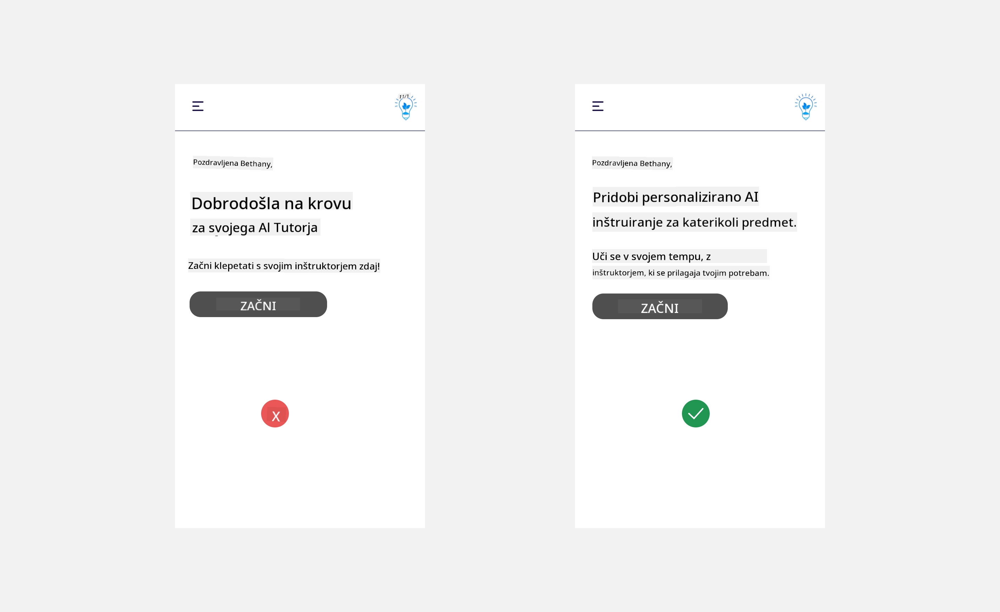
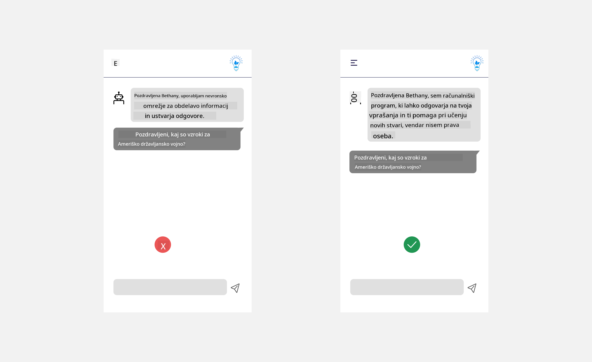

<!--
CO_OP_TRANSLATOR_METADATA:
{
  "original_hash": "78bbeed50fd4dc9fdee931f5daf98cb3",
  "translation_date": "2025-10-18T01:38:52+00:00",
  "source_file": "12-designing-ux-for-ai-applications/README.md",
  "language_code": "sl"
}
-->
# Oblikovanje uporabniške izkušnje za aplikacije z umetno inteligenco

> _(Kliknite zgornjo sliko za ogled videa te lekcije)_

Uporabniška izkušnja je zelo pomemben vidik pri razvoju aplikacij. Uporabniki morajo vašo aplikacijo uporabljati na učinkovit način za izvajanje nalog. Biti učinkovit je ena stvar, vendar morate aplikacije oblikovati tudi tako, da jih lahko uporabljajo vsi, da so _dostopne_. To poglavje se bo osredotočilo na to področje, da boste na koncu oblikovali aplikacijo, ki jo ljudje lahko in želijo uporabljati.

## Uvod

Uporabniška izkušnja je način, kako uporabnik komunicira z določenim izdelkom ali storitvijo, naj bo to sistem, orodje ali dizajn. Pri razvoju aplikacij z umetno inteligenco se razvijalci ne osredotočajo le na zagotavljanje učinkovite uporabniške izkušnje, temveč tudi na etičnost. V tej lekciji bomo obravnavali, kako zgraditi aplikacije z umetno inteligenco (AI), ki ustrezajo potrebam uporabnikov.

Lekcija bo obravnavala naslednja področja:

- Uvod v uporabniško izkušnjo in razumevanje potreb uporabnikov
- Oblikovanje aplikacij z umetno inteligenco za zaupanje in transparentnost
- Oblikovanje aplikacij z umetno inteligenco za sodelovanje in povratne informacije

## Cilji učenja

Po zaključku te lekcije boste lahko:

- Razumeli, kako zgraditi aplikacije z umetno inteligenco, ki ustrezajo potrebam uporabnikov.
- Oblikovali aplikacije z umetno inteligenco, ki spodbujajo zaupanje in sodelovanje.

### Predpogoj

Vzemite si čas in preberite več o [uporabniški izkušnji in oblikovalskem razmišljanju.](https://learn.microsoft.com/training/modules/ux-design?WT.mc_id=academic-105485-koreyst)

## Uvod v uporabniško izkušnjo in razumevanje potreb uporabnikov

V našem izmišljenem izobraževalnem startupu imamo dva glavna uporabnika, učitelje in učence. Vsak od teh dveh uporabnikov ima edinstvene potrebe. Oblikovanje, osredotočeno na uporabnika, daje prednost uporabniku in zagotavlja, da so izdelki relevantni in koristni za tiste, za katere so namenjeni.

Aplikacija mora biti **uporabna, zanesljiva, dostopna in prijetna**, da zagotovi dobro uporabniško izkušnjo.

### Uporabnost

Biti uporaben pomeni, da ima aplikacija funkcionalnosti, ki ustrezajo njenemu namenu, kot je avtomatizacija procesa ocenjevanja ali ustvarjanje učnih kartic za ponavljanje. Aplikacija, ki avtomatizira proces ocenjevanja, mora biti sposobna natančno in učinkovito dodeliti ocene študentskim nalogam na podlagi vnaprej določenih kriterijev. Podobno mora aplikacija, ki ustvarja učne kartice za ponavljanje, ustvariti ustrezna in raznolika vprašanja na podlagi svojih podatkov.

### Zanesljivost

Biti zanesljiv pomeni, da lahko aplikacija dosledno in brez napak opravlja svoje naloge. Vendar pa umetna inteligenca, tako kot ljudje, ni popolna in je lahko nagnjena k napakam. Aplikacije se lahko soočajo z napakami ali nepričakovanimi situacijami, ki zahtevajo človeško posredovanje ali popravek. Kako ravnate z napakami? V zadnjem delu te lekcije bomo obravnavali, kako so sistemi in aplikacije z umetno inteligenco zasnovani za sodelovanje in povratne informacije.

### Dostopnost

Biti dostopen pomeni razširiti uporabniško izkušnjo na uporabnike z različnimi sposobnostmi, vključno s tistimi z invalidnostmi, in zagotoviti, da nihče ni izključen. Z upoštevanjem smernic in načel dostopnosti postanejo rešitve z umetno inteligenco bolj vključujoče, uporabne in koristne za vse uporabnike.

### Prijetnost

Biti prijeten pomeni, da je aplikacijo užitek uporabljati. Privlačna uporabniška izkušnja lahko pozitivno vpliva na uporabnika, ga spodbuja k ponovni uporabi aplikacije in povečuje poslovne prihodke.

Vsak izziv ni mogoče rešiti z umetno inteligenco. Umetna inteligenca dopolnjuje vašo uporabniško izkušnjo, bodisi z avtomatizacijo ročnih nalog ali personalizacijo uporabniških izkušenj.

## Oblikovanje aplikacij z umetno inteligenco za zaupanje in transparentnost

Vzpostavljanje zaupanja je ključnega pomena pri oblikovanju aplikacij z umetno inteligenco. Zaupanje zagotavlja, da je uporabnik prepričan, da bo aplikacija opravila delo, dosledno dostavila rezultate in da so ti rezultati tisto, kar uporabnik potrebuje. Tveganje na tem področju sta nezaupanje in pretirano zaupanje. Nezaupanje se pojavi, ko uporabnik nima ali ima malo zaupanja v sistem umetne inteligence, kar vodi do zavrnitve vaše aplikacije. Pretirano zaupanje pa se pojavi, ko uporabnik preceni sposobnosti sistema umetne inteligence, kar vodi do prevelikega zaupanja v sistem. Na primer, avtomatiziran sistem ocenjevanja v primeru pretiranega zaupanja lahko povzroči, da učitelj ne preveri nekaterih nalog, da bi zagotovil pravilno delovanje sistema ocenjevanja. To lahko privede do nepravičnih ali netočnih ocen za učence ali zamujenih priložnosti za povratne informacije in izboljšave.

Dva načina za zagotovitev, da je zaupanje postavljeno v središče oblikovanja, sta razložljivost in nadzor.

### Razložljivost

Ko umetna inteligenca pomaga pri sprejemanju odločitev, kot je prenos znanja na prihodnje generacije, je ključnega pomena, da učitelji in starši razumejo, kako so odločitve sprejete. To je razložljivost - razumevanje, kako aplikacije z umetno inteligenco sprejemajo odločitve. Oblikovanje za razložljivost vključuje dodajanje podrobnosti, ki poudarjajo, kako je umetna inteligenca prišla do določenega rezultata. Občinstvo mora biti obveščeno, da je rezultat ustvarjen s strani umetne inteligence in ne človeka. Na primer, namesto "Začnite klepetati s svojim učiteljem zdaj" recite "Uporabite AI učitelja, ki se prilagaja vašim potrebam in vam pomaga učiti se v vašem tempu."

Drug primer je, kako umetna inteligenca uporablja uporabniške in osebne podatke. Na primer, uporabnik s persono študenta ima lahko omejitve glede na svojo persono. Umetna inteligenca morda ne bo mogla razkriti odgovorov na vprašanja, lahko pa pomaga uporabniku razmisliti, kako lahko reši problem.

Še en ključni del razložljivosti je poenostavitev razlag. Študenti in učitelji morda niso strokovnjaki za umetno inteligenco, zato morajo biti razlage o tem, kaj aplikacija lahko ali ne more storiti, poenostavljene in enostavne za razumevanje.

### Nadzor

Generativna umetna inteligenca ustvarja sodelovanje med umetno inteligenco in uporabnikom, kjer lahko uporabnik na primer spreminja pozive za različne rezultate. Poleg tega, ko je rezultat ustvarjen, bi morali uporabniki imeti možnost, da ga spremenijo, kar jim daje občutek nadzora. Na primer, pri uporabi Binga lahko prilagodite svoj poziv glede na format, ton in dolžino. Poleg tega lahko dodate spremembe svojemu rezultatu in ga prilagodite, kot je prikazano spodaj:

Druga funkcija v Bingu, ki uporabniku omogoča nadzor nad aplikacijo, je možnost, da se odloči za vključitev ali izključitev podatkov, ki jih umetna inteligenca uporablja. Za šolsko aplikacijo bi študent morda želel uporabiti svoje zapiske kot tudi učiteljeve vire kot učni material.

> Pri oblikovanju aplikacij z umetno inteligenco je ključna namernost, da se uporabnikom prepreči pretirano zaupanje, ki bi postavilo nerealna pričakovanja glede zmožnosti aplikacije. Eden od načinov za to je ustvarjanje trenja med pozivi in rezultati. Opominjanje uporabnika, da gre za umetno inteligenco in ne za človeka.

## Oblikovanje aplikacij z umetno inteligenco za sodelovanje in povratne informacije

Kot je bilo že omenjeno, generativna umetna inteligenca ustvarja sodelovanje med uporabnikom in umetno inteligenco. Večina interakcij vključuje uporabnika, ki vnese poziv, in umetno inteligenco, ki ustvari rezultat. Kaj pa, če je rezultat napačen? Kako aplikacija obravnava napake, če se pojavijo? Ali umetna inteligenca krivi uporabnika ali si vzame čas za razlago napake?

Aplikacije z umetno inteligenco bi morale biti zasnovane tako, da sprejemajo in dajejo povratne informacije. To ne pomaga le izboljšati sistem umetne inteligence, temveč tudi gradi zaupanje z uporabniki. Povratna zanka bi morala biti vključena v oblikovanje, primer je lahko preprosto všečkanje ali nevšečkanje rezultata.

Drug način za obravnavo tega je jasno komuniciranje zmožnosti in omejitev sistema. Ko uporabnik naredi napako in zahteva nekaj, kar presega zmožnosti umetne inteligence, bi moral obstajati način za obravnavo tega, kot je prikazano spodaj.

Sistemske napake so pogoste pri aplikacijah, kjer uporabnik morda potrebuje pomoč z informacijami, ki so zunaj obsega umetne inteligence, ali pa ima aplikacija omejitev glede števila vprašanj/predmetov, za katere lahko uporabnik ustvari povzetke. Na primer, aplikacija z umetno inteligenco, ki je usposobljena z omejenimi podatki o določenih predmetih, na primer zgodovini in matematiki, morda ne bo mogla obravnavati vprašanj o geografiji. Da bi to omilili, lahko sistem umetne inteligence poda odgovor, kot je: "Oprostite, naš izdelek je bil usposobljen z podatki o naslednjih predmetih....., ne morem odgovoriti na vprašanje, ki ste ga postavili."

Aplikacije z umetno inteligenco niso popolne, zato so nagnjene k napakam. Pri oblikovanju vaših aplikacij morate zagotoviti, da ustvarite prostor za povratne informacije uporabnikov in obravnavo napak na način, ki je preprost in enostaven za razumevanje.

## Naloga

Vzemite katero koli aplikacijo z umetno inteligenco, ki ste jo doslej razvili, in razmislite o implementaciji spodnjih korakov v vaši aplikaciji:

- **Prijetnost:** Razmislite, kako lahko naredite svojo aplikacijo bolj prijetno. Ali povsod dodajate razlage? Ali spodbujate uporabnika k raziskovanju? Kako oblikujete svoja sporočila o napakah?

- **Uporabnost:** Če gradite spletno aplikacijo, poskrbite, da bo vaša aplikacija dostopna tako z miško kot s tipkovnico.

- **Zaupanje in transparentnost:** Ne zaupajte umetni inteligenci popolnoma in njenim rezultatom, razmislite, kako bi lahko dodali človeka v proces za preverjanje rezultatov. Prav tako razmislite in implementirajte druge načine za dosego zaupanja in transparentnosti.

- **Nadzor:** Dajte uporabniku nadzor nad podatki, ki jih posreduje aplikaciji. Implementirajte način, kako se lahko uporabnik odloči za vključitev ali izključitev zbiranja podatkov v aplikaciji z umetno inteligenco.

## Nadaljujte z učenjem!

Po zaključku te lekcije si oglejte našo [učno zbirko o generativni umetni inteligenci](https://aka.ms/genai-collection?WT.mc_id=academic-105485-koreyst), da še naprej nadgrajujete svoje znanje o generativni umetni inteligenci!

Nadaljujte z 13. lekcijo, kjer bomo obravnavali [varnost aplikacij z umetno inteligenco](../13-securing-ai-applications/README.md?WT.mc_id=academic-105485-koreyst)!

---

**Omejitev odgovornosti**:  
Ta dokument je bil preveden z uporabo storitve za prevajanje AI [Co-op Translator](https://github.com/Azure/co-op-translator). Čeprav si prizadevamo za natančnost, vas prosimo, da upoštevate, da lahko avtomatizirani prevodi vsebujejo napake ali netočnosti. Izvirni dokument v njegovem maternem jeziku naj se šteje za avtoritativni vir. Za ključne informacije je priporočljivo profesionalno človeško prevajanje. Ne prevzemamo odgovornosti za morebitne nesporazume ali napačne razlage, ki izhajajo iz uporabe tega prevoda.