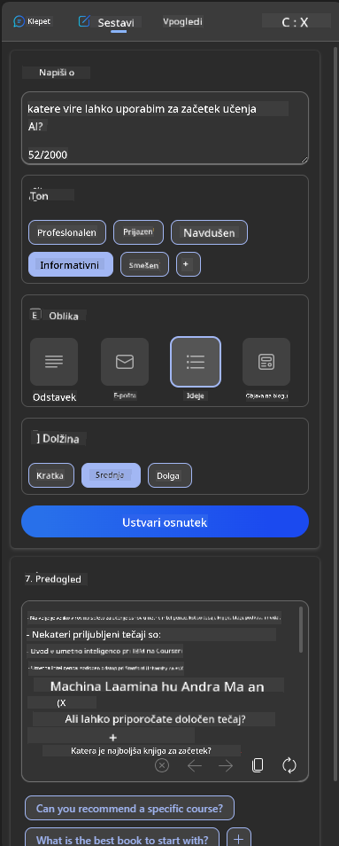
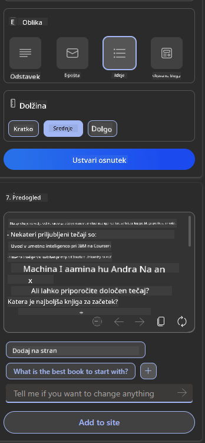

<!--
CO_OP_TRANSLATOR_METADATA:
{
  "original_hash": "747668e4c53d067369f06e9ec2e6313e",
  "translation_date": "2025-08-26T19:53:32+00:00",
  "source_file": "12-designing-ux-for-ai-applications/README.md",
  "language_code": "sl"
}
-->
# Oblikovanje uporabniške izkušnje (UX) za AI aplikacije

> _(Kliknite na zgornjo sliko za ogled videa te lekcije)_

Uporabniška izkušnja je zelo pomemben vidik pri razvoju aplikacij. Uporabniki morajo vašo aplikacijo uporabljati učinkovito za opravljanje nalog. Biti učinkovit je ena stvar, vendar morate aplikacije zasnovati tudi tako, da jih lahko uporablja vsak, torej da so _dostopne_. To poglavje se osredotoča na to področje, da boste na koncu zasnovali aplikacijo, ki jo bodo ljudje lahko in želeli uporabljati.

## Uvod

Uporabniška izkušnja je način, kako uporabnik uporablja določen izdelek ali storitev, naj bo to sistem, orodje ali dizajn. Pri razvoju AI aplikacij se razvijalci ne osredotočajo le na učinkovito uporabniško izkušnjo, temveč tudi na etičnost. V tej lekciji bomo obravnavali, kako graditi aplikacije umetne inteligence (AI), ki upoštevajo potrebe uporabnikov.

Leksija pokriva naslednja področja:

- Uvod v uporabniško izkušnjo in razumevanje potreb uporabnikov
- Oblikovanje AI aplikacij za zaupanje in transparentnost
- Oblikovanje AI aplikacij za sodelovanje in povratne informacije

## Cilji učenja

Po tej lekciji boste znali:

- Razumeti, kako graditi AI aplikacije, ki ustrezajo potrebam uporabnikov.
- Oblikovati AI aplikacije, ki spodbujajo zaupanje in sodelovanje.

### Predznanje

Vzemite si čas in preberite več o [uporabniški izkušnji in design thinkingu.](https://learn.microsoft.com/training/modules/ux-design?WT.mc_id=academic-105485-koreyst)

## Uvod v uporabniško izkušnjo in razumevanje potreb uporabnikov

V našem izmišljenem izobraževalnem startupu imamo dva glavna uporabnika: učitelje in učence. Vsak od njiju ima svoje specifične potrebe. Oblikovanje, osredotočeno na uporabnika, daje prednost uporabniku in zagotavlja, da so izdelki relevantni in koristni za tiste, katerim so namenjeni.

Aplikacija mora biti **uporabna, zanesljiva, dostopna in prijetna**, da zagotovi dobro uporabniško izkušnjo.

### Uporabnost

Biti uporaben pomeni, da ima aplikacija funkcionalnosti, ki ustrezajo njenemu namenu, na primer avtomatizacija ocenjevanja ali ustvarjanje kartic za ponavljanje. Aplikacija, ki avtomatizira ocenjevanje, mora znati natančno in učinkovito dodeljevati ocene glede na vnaprej določena merila. Podobno mora aplikacija, ki ustvarja kartice za ponavljanje, znati pripraviti ustrezna in raznolika vprašanja na podlagi svojih podatkov.

### Zanesljivost

Biti zanesljiv pomeni, da aplikacija dosledno in brez napak opravlja svojo nalogo. Vendar pa AI, tako kot ljudje, ni popoln in je lahko nagnjen k napakam. Aplikacije se lahko srečajo z napakami ali nepričakovanimi situacijami, ki zahtevajo človeški poseg ali popravek. Kako ravnati z napakami? V zadnjem delu te lekcije bomo obravnavali, kako so AI sistemi in aplikacije zasnovani za sodelovanje in povratne informacije.

### Dostopnost

Biti dostopen pomeni razširiti uporabniško izkušnjo na uporabnike z različnimi zmožnostmi, vključno z osebami z oviranostmi, in tako zagotoviti, da nihče ni izključen. Z upoštevanjem smernic in načel dostopnosti postanejo AI rešitve bolj vključujoče, uporabne in koristne za vse uporabnike.

### Prijetnost

Biti prijeten pomeni, da je aplikacijo užitek uporabljati. Privlačna uporabniška izkušnja lahko pozitivno vpliva na uporabnika, ga spodbuja k ponovni uporabi aplikacije in povečuje prihodke podjetja.

Vsakega izziva ni mogoče rešiti z AI. AI dopolnjuje uporabniško izkušnjo, bodisi z avtomatizacijo ročnih nalog ali personalizacijo izkušenj.

## Oblikovanje AI aplikacij za zaupanje in transparentnost

Gradnja zaupanja je ključna pri oblikovanju AI aplikacij. Zaupanje zagotavlja, da je uporabnik prepričan, da bo aplikacija opravila nalogo, dosledno dostavljala rezultate in da so ti rezultati tisto, kar uporabnik potrebuje. Tveganje na tem področju sta nezaupanje in pretirano zaupanje. Nezaupanje nastane, ko uporabnik nima ali ima zelo malo zaupanja v AI sistem, kar vodi v zavrnitev aplikacije. Pretirano zaupanje pa nastane, ko uporabnik preceni zmožnosti AI sistema in mu preveč zaupa. Na primer, avtomatiziran sistem za ocenjevanje lahko v primeru pretiranega zaupanja povzroči, da učitelj ne preveri nekaterih nalog in s tem ne zagotovi, da sistem pravilno ocenjuje. To lahko vodi do nepravičnih ali netočnih ocen za učence ali zamujenih priložnosti za povratne informacije in izboljšave.

Dva načina, kako postaviti zaupanje v središče oblikovanja, sta razložljivost in nadzor.

### Razložljivost

Ko AI pomaga pri sprejemanju odločitev, kot je prenašanje znanja na prihodnje generacije, je ključno, da učitelji in starši razumejo, kako AI sprejema odločitve. To je razložljivost – razumevanje, kako AI aplikacije sprejemajo odločitve. Oblikovanje za razložljivost vključuje dodajanje podrobnosti, ki poudarjajo, kako je AI prišel do določenega rezultata. Občinstvo mora vedeti, da je rezultat ustvaril AI in ne človek. Na primer, namesto "Začni klepetati s svojim tutorjem zdaj" raje napišite "Uporabi AI tutorja, ki se prilagaja tvojim potrebam in ti pomaga učiti se v tvojem tempu."

Drug primer je, kako AI uporablja uporabniške in osebne podatke. Na primer, uporabnik s persono učenec ima lahko omejitve glede na svojo vlogo. AI morda ne sme razkriti odgovorov na vprašanja, lahko pa uporabnika usmerja, da sam razmisli, kako rešiti problem.

Zadnji pomemben del razložljivosti je poenostavitev razlag. Učenci in učitelji niso nujno AI strokovnjaki, zato morajo biti razlage, kaj aplikacija zmore ali ne zmore, preproste in lahko razumljive.

### Nadzor

Generativni AI ustvarja sodelovanje med AI in uporabnikom, kjer lahko uporabnik na primer spreminja pozive za različne rezultate. Poleg tega bi moral uporabnik po generiranju rezultata imeti možnost, da rezultat spremeni, kar mu daje občutek nadzora. Na primer, pri uporabi Binga lahko prilagodite svoj poziv glede na obliko, ton in dolžino. Prav tako lahko spreminjate svoj rezultat, kot je prikazano spodaj:

Druga funkcija v Bingu, ki uporabniku omogoča nadzor nad aplikacijo, je možnost, da se odloči za uporabo ali neuporabo podatkov, ki jih AI uporablja. Pri šolski aplikaciji bi učenec morda želel uporabiti svoje zapiske in učiteljeve vire kot gradivo za ponavljanje.

> Pri oblikovanju AI aplikacij je pomembno, da uporabniki ne razvijejo pretiranega zaupanja in nerealnih pričakovanj glede zmožnosti AI. Eden od načinov za to je ustvarjanje "trenja" med pozivi in rezultati. Uporabnika je treba opomniti, da gre za AI in ne za človeka.

## Oblikovanje AI aplikacij za sodelovanje in povratne informacije

Kot smo že omenili, generativni AI ustvarja sodelovanje med uporabnikom in AI. Večina interakcij poteka tako, da uporabnik vnese poziv, AI pa ustvari rezultat. Kaj pa, če je rezultat napačen? Kako aplikacija ravna z napakami, če do njih pride? Ali AI krivi uporabnika ali si vzame čas za razlago napake?

AI aplikacije morajo biti zasnovane tako, da lahko prejemajo in dajejo povratne informacije. To ne pomaga le AI sistemu, da se izboljšuje, ampak tudi gradi zaupanje uporabnikov. V zasnovo je treba vključiti povratno zanko, na primer preprosto možnost všečkanja ali nevšečkanja rezultata.

Drug način za reševanje tega je jasna komunikacija o zmožnostih in omejitvah sistema. Ko uporabnik naredi napako in zahteva nekaj, kar presega zmožnosti AI, mora obstajati način, kako to obravnavati, kot je prikazano spodaj.

Sistemske napake so pogoste pri aplikacijah, kjer uporabnik potrebuje pomoč pri informacijah, ki presegajo zmožnosti AI, ali pa ima aplikacija omejitev glede števila vprašanj/predmetov, za katere lahko uporabnik ustvari povzetke. Na primer, AI aplikacija, ki je bila izurjena le na podatkih iz zgodovine in matematike, morda ne bo znala odgovoriti na vprašanja iz geografije. Da bi to omilili, lahko AI sistem poda odgovor, kot je: "Oprostite, naš izdelek je bil izurjen na podatkih iz naslednjih predmetov....., zato ne morem odgovoriti na vaše vprašanje."

AI aplikacije niso popolne, zato bodo včasih naredile napake. Pri oblikovanju svojih aplikacij poskrbite, da boste omogočili prostor za povratne informacije uporabnikov in obravnavanje napak na preprost in razumljiv način.

## Naloga

Vzemite katerokoli AI aplikacijo, ki ste jo do sedaj razvili, in razmislite, kako bi v njej izvedli naslednje korake:

- **Prijetnost:** Razmislite, kako lahko naredite svojo aplikacijo bolj prijetno. Ali povsod dodajate razlage? Ali spodbujate uporabnika k raziskovanju? Kako oblikujete svoja sporočila o napakah?

- **Uporabnost:** Če gradite spletno aplikacijo, poskrbite, da bo navigacija mogoča tako z miško kot s tipkovnico.

- **Zaupanje in transparentnost:** Ne zaupajte AI in njenim rezultatom popolnoma, razmislite, kako bi v proces vključili človeka za preverjanje rezultatov. Razmislite in uvedite tudi druge načine za doseganje zaupanja in transparentnosti.

- **Nadzor:** Dajte uporabniku nadzor nad podatki, ki jih posreduje aplikaciji. Uvedite možnost, da se uporabnik lahko odloči za vključitev ali izključitev zbiranja podatkov v AI aplikaciji.

## Nadaljujte z učenjem!

Po zaključku te lekcije si oglejte našo [zbirko za učenje o generativni AI](https://aka.ms/genai-collection?WT.mc_id=academic-105485-koreyst) in še naprej nadgrajujte svoje znanje o generativni AI!

Nadaljujte na Lekcijo 13, kjer bomo pogledali, kako [zavarovati AI aplikacije](../13-securing-ai-applications/README.md?WT.mc_id=academic-105485-koreyst)!

---

**Izjava o omejitvi odgovornosti**:  
Ta dokument je bil preveden s pomočjo storitve AI prevajanja [Co-op Translator](https://github.com/Azure/co-op-translator). Čeprav si prizadevamo za natančnost, vas prosimo, da upoštevate, da lahko avtomatski prevodi vsebujejo napake ali netočnosti. Izvirni dokument v svojem maternem jeziku naj velja za avtoritativni vir. Za kritične informacije priporočamo strokovni človeški prevod. Ne prevzemamo odgovornosti za morebitne nesporazume ali napačne razlage, ki bi izhajale iz uporabe tega prevoda.