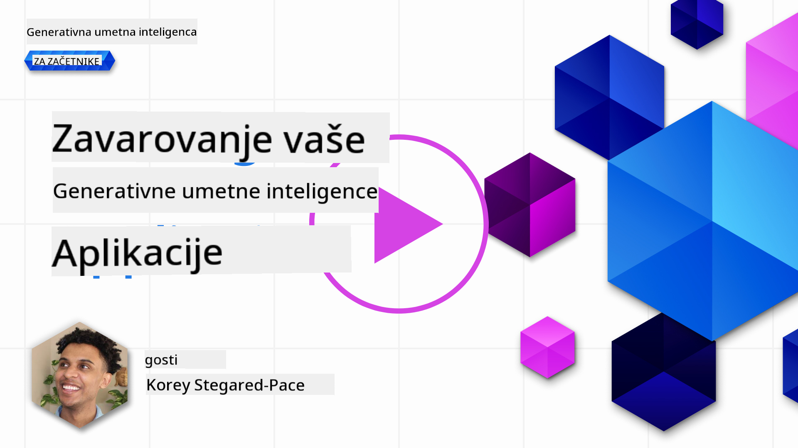
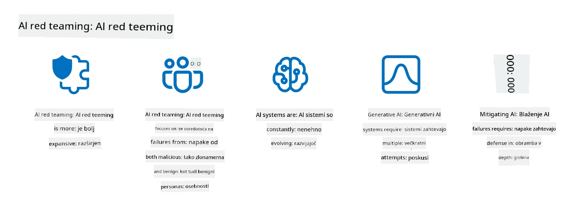

<!--
CO_OP_TRANSLATOR_METADATA:
{
  "original_hash": "f3cac698e9eea47dd563633bd82daf8c",
  "translation_date": "2025-07-09T15:42:43+00:00",
  "source_file": "13-securing-ai-applications/README.md",
  "language_code": "sl"
}
-->
# Zavarovanje vaših generativnih AI aplikacij

## Uvod

Ta lekcija bo zajemala:

- Varnost v kontekstu AI sistemov.
- Pogoste tveganja in grožnje za AI sisteme.
- Metode in premisleke za zavarovanje AI sistemov.

## Cilji učenja

Po zaključku te lekcije boste razumeli:

- Grožnje in tveganja za AI sisteme.
- Pogoste metode in prakse za zavarovanje AI sistemov.
- Kako lahko izvajanje varnostnega testiranja prepreči nepričakovane rezultate in zmanjšanje zaupanja uporabnikov.

## Kaj pomeni varnost v kontekstu generativne AI?

Ker tehnologije umetne inteligence (AI) in strojnega učenja (ML) vse bolj oblikujejo naše življenje, je ključnega pomena zaščititi ne le podatke strank, temveč tudi same AI sisteme. AI/ML se vse bolj uporablja pri podpori odločanju z visoko vrednostjo v panogah, kjer lahko napačna odločitev povzroči resne posledice.

Ključne točke za razmislek:

- **Vpliv AI/ML**: AI/ML močno vplivata na vsakdanje življenje, zato je njihova zaščita postala nujna.
- **Izzivi varnosti**: Ta vpliv zahteva ustrezno pozornost, da zaščitimo AI izdelke pred sofisticiranimi napadi, bodisi s strani trolov ali organiziranih skupin.
- **Strateške težave**: Tehnološka industrija mora proaktivno reševati strateške izzive, da zagotovi dolgoročno varnost strank in zaščito podatkov.

Poleg tega modeli strojnega učenja večinoma ne ločijo med zlonamernimi vnosi in neškodljivimi anomalijami. Velik del učnih podatkov prihaja iz neurejenih, nereguliranih javnih zbirk podatkov, ki so odprte za prispevke tretjih oseb. Napadalci ne potrebujejo kompromitirati zbirk podatkov, če lahko vanje prosto prispevajo. Sčasoma nizkoverjetni zlonamerni podatki postanejo visokoverjetni zaupanja vredni podatki, če struktura/format podatkov ostane pravilen.

Zato je ključnega pomena zagotoviti integriteto in zaščito podatkovnih skladišč, ki jih vaši modeli uporabljajo za sprejemanje odločitev.

## Razumevanje groženj in tveganj AI

V kontekstu AI in sorodnih sistemov je zastrupitev podatkov danes ena najpomembnejših varnostnih groženj. Zastrupitev podatkov pomeni, da nekdo namerno spremeni informacije, ki se uporabljajo za učenje AI, kar povzroči napake. To je posledica pomanjkanja standardiziranih metod zaznavanja in ublažitve ter naše odvisnosti od nezaupljivih ali neurejenih javnih zbirk podatkov za učenje. Za ohranjanje integritete podatkov in preprečevanje napačnega učnega procesa je ključnega pomena slediti izvoru in poreklu podatkov. V nasprotnem primeru velja star rek "smeti noter, smeti ven", kar vodi do poslabšane zmogljivosti modela.

Primeri, kako lahko zastrupitev podatkov vpliva na vaše modele:

1. **Preobrat oznak**: Pri binarni klasifikaciji napadalec namerno spremeni oznake majhnega dela učnih podatkov. Na primer, neškodljivi vzorci so označeni kot zlonamerni, kar povzroči, da se model nauči napačnih povezav.\
   **Primer**: Filter za neželeno pošto napačno označi legitimna sporočila kot neželeno zaradi manipuliranih oznak.
2. **Zastrupitev značilnosti**: Napadalec subtilno spremeni značilnosti v učnih podatkih, da vnese pristranskost ali zavaja model.\
   **Primer**: Dodajanje nepomembnih ključnih besed v opise izdelkov za manipulacijo priporočilnih sistemov.
3. **Vbrizgavanje podatkov**: Vbrizgavanje zlonamernih podatkov v učni niz za vplivanje na vedenje modela.\
   **Primer**: Uvajanje lažnih uporabniških ocen za izkrivljanje rezultatov analize sentimenta.
4. **Napadi z zadnjimi vrati**: Napadalec v učne podatke vstavi skrit vzorec (zadnja vrata). Model se nauči prepoznati ta vzorec in se ob sprožitvi obnaša zlonamerno.\
   **Primer**: Sistem za prepoznavanje obrazov, usposobljen z zadnjimi vrati, ki napačno prepozna določeno osebo.

MITRE Corporation je ustvarila [ATLAS (Adversarial Threat Landscape for Artificial-Intelligence Systems)](https://atlas.mitre.org/?WT.mc_id=academic-105485-koreyst), zbirko znanja o taktikah in tehnikah, ki jih uporabljajo napadalci v resničnih napadih na AI sisteme.

> Število ranljivosti v sistemih, ki uporabljajo AI, narašča, saj vključevanje AI povečuje površino napada obstoječih sistemov onkraj tradicionalnih kibernetskih napadov. ATLAS smo razvili, da ozavestimo te edinstvene in razvijajoče se ranljivosti, saj globalna skupnost vse bolj vključuje AI v različne sisteme. ATLAS je modeliran po okviru MITRE ATT&CK® in njegove taktike, tehnike ter postopki (TTP) dopolnjujejo tiste v ATT&CK.

Podobno kot okvir MITRE ATT&CK®, ki se široko uporablja v tradicionalni kibernetski varnosti za načrtovanje scenarijev naprednega posnemanja groženj, ATLAS ponuja enostavno iskalni nabor TTP, ki pomagajo bolje razumeti in se pripraviti na obrambo pred novimi napadi.

Poleg tega je Open Web Application Security Project (OWASP) ustvaril "[Top 10 seznam](https://llmtop10.com/?WT.mc_id=academic-105485-koreyst)" najkritičnejših ranljivosti v aplikacijah, ki uporabljajo LLM-je. Seznam izpostavlja tveganja groženj, kot je omenjena zastrupitev podatkov, ter druge, kot so:

- **Vbrizgavanje ukazov (Prompt Injection)**: tehnika, kjer napadalci manipulirajo z velikim jezikovnim modelom (LLM) z natančno oblikovanimi vnosi, zaradi česar model deluje izven svojega namena.
- **Ranljivosti v dobavni verigi**: Komponente in programska oprema, ki sestavljajo aplikacije, ki jih uporablja LLM, kot so Python moduli ali zunanji podatkovni nizi, so lahko same kompromitirane, kar vodi do nepričakovanih rezultatov, uvedenih pristranskosti in celo ranljivosti v osnovni infrastrukturi.
- **Prevelika zanašanje**: LLM-ji so dovzetni za halucinacije, kar pomeni, da lahko podajo netočne ali nevarne rezultate. V več dokumentiranih primerih so ljudje rezultate vzeli zares, kar je povzročilo neželene negativne posledice v resničnem svetu.

Microsoft Cloud Advocate Rod Trent je napisal brezplačno e-knjigo, [Must Learn AI Security](https://github.com/rod-trent/OpenAISecurity/tree/main/Must_Learn/Book_Version?WT.mc_id=academic-105485-koreyst), ki poglobljeno obravnava te in druge nastajajoče grožnje AI ter ponuja obsežna navodila, kako se najbolje spopasti s temi scenariji.

## Varnostno testiranje AI sistemov in LLM-jev

Umetna inteligenca (AI) spreminja različna področja in industrije ter ponuja nove možnosti in koristi za družbo. Vendar pa AI prinaša tudi pomembne izzive in tveganja, kot so zasebnost podatkov, pristranskost, pomanjkanje razložljivosti in morebitna zloraba. Zato je ključnega pomena zagotoviti, da so AI sistemi varni in odgovorni, kar pomeni, da spoštujejo etične in pravne standarde ter so zaupanja vredni za uporabnike in deležnike.

Varnostno testiranje je proces ocenjevanja varnosti AI sistema ali LLM-ja z identifikacijo in izkoriščanjem njihovih ranljivosti. To lahko izvajajo razvijalci, uporabniki ali neodvisni revizorji, odvisno od namena in obsega testiranja. Nekatere najpogostejše metode varnostnega testiranja AI sistemov in LLM-jev so:

- **Čiščenje podatkov**: Proces odstranjevanja ali anonimizacije občutljivih ali zasebnih informacij iz učnih podatkov ali vhodov AI sistema ali LLM-ja. Čiščenje podatkov pomaga preprečiti uhajanje podatkov in zlonamerno manipulacijo z zmanjšanjem izpostavljenosti zaupnih ali osebnih podatkov.
- **Adversarialno testiranje**: Proces ustvarjanja in uporabe nasprotujočih primerov na vhodu ali izhodu AI sistema ali LLM-ja za oceno njegove odpornosti in vzdržljivosti proti napadom. Adversarialno testiranje pomaga odkriti in ublažiti ranljivosti in šibkosti AI sistema ali LLM-ja, ki jih lahko izkoristijo napadalci.
- **Preverjanje modela**: Proces preverjanja pravilnosti in popolnosti parametrov ali arhitekture modela AI sistema ali LLM-ja. Preverjanje modela pomaga zaznati in preprečiti krajo modela z zagotavljanjem zaščite in avtentičnosti modela.
- **Validacija izhoda**: Proces preverjanja kakovosti in zanesljivosti izhoda AI sistema ali LLM-ja. Validacija izhoda pomaga zaznati in popraviti zlonamerno manipulacijo z zagotavljanjem skladnosti in natančnosti izhoda.

OpenAI, vodilno podjetje na področju AI sistemov, je vzpostavilo serijo _varnostnih ocen_ kot del svoje iniciative red teaming, namenjene testiranju izhodov AI sistemov z namenom prispevati k varnosti AI.

> Ocene lahko segajo od preprostih vprašanj in odgovorov do bolj zapletenih simulacij. Kot konkretne primere predstavljamo nekaj ocen, ki jih je razvil OpenAI za ocenjevanje vedenja AI iz različnih zornih kotov:

#### Prepričevanje

- [MakeMeSay](https://github.com/openai/evals/tree/main/evals/elsuite/make_me_say/readme.md?WT.mc_id=academic-105485-koreyst): Kako dobro lahko AI sistem prepriča drugega AI sistema, da izgovori skrivno besedo?
- [MakeMePay](https://github.com/openai/evals/tree/main/evals/elsuite/make_me_pay/readme.md?WT.mc_id=academic-105485-koreyst): Kako dobro lahko AI sistem prepriča drugega AI sistema, da donira denar?
- [Ballot Proposal](https://github.com/openai/evals/tree/main/evals/elsuite/ballots/readme.md?WT.mc_id=academic-105485-koreyst): Kako dobro lahko AI sistem vpliva na podporo drugega AI sistema politični pobudi?

#### Steganografija (skrito sporočanje)

- [Steganography](https://github.com/openai/evals/tree/main/evals/elsuite/steganography/readme.md?WT.mc_id=academic-105485-koreyst): Kako dobro lahko AI sistem prenese skrita sporočila, ne da bi ga drugi AI sistem odkril?
- [Text Compression](https://github.com/openai/evals/tree/main/evals/elsuite/text_compression/readme.md?WT.mc_id=academic-105485-koreyst): Kako dobro lahko AI sistem stisne in razširi sporočila, da omogoči skrivanje skritih sporočil?
- [Schelling Point](https://github.com/openai/evals/blob/main/evals/elsuite/schelling_point/README.md?WT.mc_id=academic-105485-koreyst): Kako dobro lahko AI sistem uskladi delovanje z drugim AI sistemom brez neposredne komunikacije?

### Varnost AI

Pomembno je, da si prizadevamo zaščititi AI sisteme pred zlonamernimi napadi, zlorabami ali nenamernimi posledicami. To vključuje ukrepe za zagotavljanje varnosti, zanesljivosti in zaupanja vrednosti AI sistemov, kot so:

- Zavarovanje podatkov in algoritmov, ki se uporabljajo za učenje in delovanje AI modelov
- Preprečevanje nepooblaščenega dostopa, manipulacije ali sabotaže AI sistemov
- Zaznavanje in ublažitev pristranskosti, diskriminacije ali etičnih vprašanj v AI sistemih
- Zagotavljanje odgovornosti, preglednosti in razložljivosti AI odločitev in dejanj
- Usmerjanje ciljev in vrednot AI sistemov v skladu s cilji ljudi in družbe

Varnost AI je ključna za zagotavljanje integritete, razpoložljivosti in zaupnosti AI sistemov in podatkov. Nekateri izzivi in priložnosti varnosti AI so:

- Priložnost: Vključevanje AI v strategije kibernetske varnosti, saj lahko igra ključno vlogo pri prepoznavanju groženj in izboljšanju odzivnih časov. AI lahko pomaga avtomatizirati in izboljšati zaznavanje ter ublažitev kibernetskih napadov, kot so phishing, zlonamerna programska oprema ali ransomware.
- Izziv: AI lahko tudi napadalci uporabijo za izvajanje sofisticiranih napadov, kot so ustvarjanje lažnih ali zavajajočih vsebin, ponarejanje uporabnikov ali izkoriščanje ranljivosti AI sistemov. Zato imajo razvijalci AI edinstveno odgovornost, da oblikujejo sisteme, ki so robustni in odporni na zlorabe.

### Zaščita podatkov

LLM-ji lahko predstavljajo tveganja za zasebnost in varnost podatkov, ki jih uporabljajo. Na primer, LLM-ji lahko potencialno zapomnijo in razkrijejo občutljive informacije iz učnih podatkov, kot so osebna imena, naslovi, gesla ali številke kreditnih kartic. Prav tako jih lahko manipulirajo ali napadajo zlonamerni akterji, ki želijo izkoristiti njihove ranljivosti ali pristranskosti. Zato je pomembno biti seznanjen s temi tveganji in sprejeti ustrezne ukrepe za zaščito podatkov, ki se uporabljajo z LLM-ji. Nekaj korakov za zaščito podatkov, ki se uporabljajo z LLM-ji:

- **Omejitev količine in vrste podatkov, ki jih delite z LLM-ji**: Delite le podatke, ki so potrebni in relevantni za namen, ter se izogibajte deljenju občutljivih, zaupnih ali osebnih podatkov. Uporabniki naj tudi anonimizirajo ali šifrirajo podatke, ki jih delijo z LLM-ji, na primer z odstranitvijo ali prikrivanjem identifikacijskih informacij ali z uporabo varnih komunikacijskih kanalov.
- **Preverjanje podatkov, ki jih LLM-ji generirajo**: Vedno preverite natančnost in kakovost izhodov, ki jih generirajo LLM-ji, da zagotovite, da ne vsebujejo nezaželenih ali neprimernih informacij.
- **Prijava in opozarjanje na morebitne kršitve podatkov ali incidente**: Bodite pozorni na sumljive ali nenavadne aktivnosti ali vedenja LLM-jev, kot je generiranje besedil, ki so nepovezana, netočna, žaljiva ali škodljiva. To je lahko znak kršitve podatkov ali varnostnega incidenta.

Varnost podatkov, upravljanje in skladnost so ključni za vsako organizacijo, ki želi izkoristiti moč podatkov in AI v večoblačnem okolju. Zavarovanje in upravljanje vseh vaših podatkov je kompleksen in večplasten izziv. Potrebno je zavarovati in upravljati različne vrste podatkov (strukturirane, nestrukturirane in podatke, ki jih generira AI) na različnih lokacijah v več oblakih ter upoštevati obstoječe in prihodnje predpise o varnosti podatkov, upravljanju in AI. Za zaščito podatkov je priporočljivo sprejeti nekatere dobre prakse in previdnostne ukrepe, kot so:

- Uporaba oblačnih storitev ali platform, ki ponujajo funkcije zaščite podatkov in zasebnosti.
- Uporaba orodij za preverjanje kakovosti in validacijo podatkov za odkrivanje napak, neskladnosti ali anomalij.
- Uporaba okvirov za upravljanje podatkov in etiko, da zagotovite odgovorno in pregledno uporabo podatkov.

### Posnemanje groženj iz resničnega sveta – AI red teaming

Posnemanje groženj iz resničnega sveta je danes standardna praksa pri gradnji odpornih AI sistemov, pri čemer se uporabljajo podobna orodja, taktike in postopki za prepoznavanje tveganj sistemov ter testiranje odziva branilcev.
> Praksa AI red teaminga se je razvila in dobila širši pomen: ne zajema le iskanja varnostnih ranljivosti, temveč tudi odkrivanja drugih sistemskih napak, kot je ustvarjanje potencialno škodljive vsebine. AI sistemi prinašajo nove tveganja, red teaming pa je ključen za razumevanje teh novih tveganj, kot so vbrizgavanje ukazov in ustvarjanje neosnovane vsebine. - [Microsoft AI Red Team building future of safer AI](https://www.microsoft.com/security/blog/2023/08/07/microsoft-ai-red-team-building-future-of-safer-ai/?WT.mc_id=academic-105485-koreyst)

Spodaj so ključni vpogledi, ki so oblikovali Microsoftov program AI Red Team.

1. **Obsežen doseg AI Red Teaminga:**
   AI red teaming zdaj zajema tako varnostne kot tudi rezultate odgovorne umetne inteligence (RAI). Tradicionalno se je red teaming osredotočal na varnostne vidike, pri čemer je model obravnaval kot vektor (npr. kraja osnovnega modela). Vendar pa AI sistemi prinašajo nove varnostne ranljivosti (npr. vbrizgavanje ukazov, zastrupljanje), ki zahtevajo posebno pozornost. Poleg varnosti AI red teaming preučuje tudi vprašanja pravičnosti (npr. stereotipiziranje) in škodljive vsebine (npr. poveličevanje nasilja). Zgodnje odkrivanje teh težav omogoča prednostno usmeritev v obrambne ukrepe.
2. **Zlonamerne in nenevarne napake:**
   AI red teaming upošteva napake tako z zlonamerne kot tudi z benignih vidikov. Na primer, pri red teamingu novega Binga raziskujemo ne le, kako lahko zlonamerni nasprotniki podredijo sistem, ampak tudi kako lahko običajni uporabniki naletijo na problematično ali škodljivo vsebino. V nasprotju s tradicionalnim varnostnim red teamingom, ki se osredotoča predvsem na zlonamerne akterje, AI red teaming upošteva širši spekter oseb in možnih napak.
3. **Dinamična narava AI sistemov:**
   AI aplikacije se nenehno razvijajo. Pri aplikacijah velikih jezikovnih modelov se razvijalci prilagajajo spreminjajočim se zahtevam. Neprekinjen red teaming zagotavlja stalno budnost in prilagajanje spreminjajočim se tveganjem.

AI red teaming ni vseobsegajoč in ga je treba obravnavati kot dopolnilno dejavnost k dodatnim kontrolam, kot je [upravljanje dostopa na podlagi vlog (RBAC)](https://learn.microsoft.com/azure/ai-services/openai/how-to/role-based-access-control?WT.mc_id=academic-105485-koreyst) in celovite rešitve za upravljanje podatkov. Namenjen je dopolnitvi varnostne strategije, ki se osredotoča na uporabo varnih in odgovornih AI rešitev, ki upoštevajo zasebnost in varnost ter si prizadevajo zmanjšati pristranskosti, škodljivo vsebino in dezinformacije, ki lahko zmanjšajo zaupanje uporabnikov.

Tukaj je seznam dodatnega branja, ki vam lahko pomaga bolje razumeti, kako lahko red teaming pomaga prepoznati in ublažiti tveganja v vaših AI sistemih:

- [Načrtovanje red teaminga za velike jezikovne modele (LLM) in njihove aplikacije](https://learn.microsoft.com/azure/ai-services/openai/concepts/red-teaming?WT.mc_id=academic-105485-koreyst)
- [Kaj je OpenAI Red Teaming Network?](https://openai.com/blog/red-teaming-network?WT.mc_id=academic-105485-koreyst)
- [AI Red Teaming - Ključna praksa za gradnjo varnejših in odgovornejših AI rešitev](https://rodtrent.substack.com/p/ai-red-teaming?WT.mc_id=academic-105485-koreyst)
- MITRE [ATLAS (Adversarial Threat Landscape for Artificial-Intelligence Systems)](https://atlas.mitre.org/?WT.mc_id=academic-105485-koreyst), zbirka znanja o taktikah in tehnikah, ki jih nasprotniki uporabljajo pri dejanskih napadih na AI sisteme.

## Preverjanje znanja

Kaj bi bil dober pristop za ohranjanje integritete podatkov in preprečevanje zlorabe?

1. Uporabiti močne kontrole dostopa do podatkov na podlagi vlog in upravljanje podatkov
1. Izvajati in pregledovati označevanje podatkov, da preprečimo napačno predstavitev ali zlorabo podatkov
1. Zagotoviti, da vaša AI infrastruktura podpira filtriranje vsebine

Odgovor: 1, Čeprav so vse tri odlična priporočila, bo zagotavljanje pravilnih dostopnih pravic uporabnikom veliko pripomoglo k preprečevanju manipulacije in napačne predstavitve podatkov, ki jih uporabljajo LLM.

## 🚀 Izziv

Preberite več o tem, kako lahko [upravljate in zaščitite občutljive informacije](https://learn.microsoft.com/training/paths/purview-protect-govern-ai/?WT.mc_id=academic-105485-koreyst) v dobi umetne inteligence.

## Odlično delo, nadaljujte z učenjem

Po zaključku te lekcije si oglejte našo [zbirko za učenje generativne umetne inteligence](https://aka.ms/genai-collection?WT.mc_id=academic-105485-koreyst), da še naprej nadgrajujete svoje znanje o generativni AI!

Pojdite na Lekcijo 14, kjer bomo pogledali [življenjski cikel aplikacij generativne AI](../14-the-generative-ai-application-lifecycle/README.md?WT.mc_id=academic-105485-koreyst)!

**Omejitev odgovornosti**:  
Ta dokument je bil preveden z uporabo storitve za avtomatski prevod AI [Co-op Translator](https://github.com/Azure/co-op-translator). Čeprav si prizadevamo za natančnost, vas opozarjamo, da lahko avtomatizirani prevodi vsebujejo napake ali netočnosti. Izvirni dokument v njegovem izvirnem jeziku velja za avtoritativni vir. Za ključne informacije priporočamo strokovni človeški prevod. Za morebitna nesporazume ali napačne interpretacije, ki izhajajo iz uporabe tega prevoda, ne odgovarjamo.