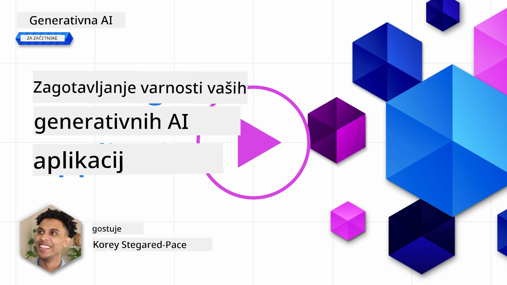
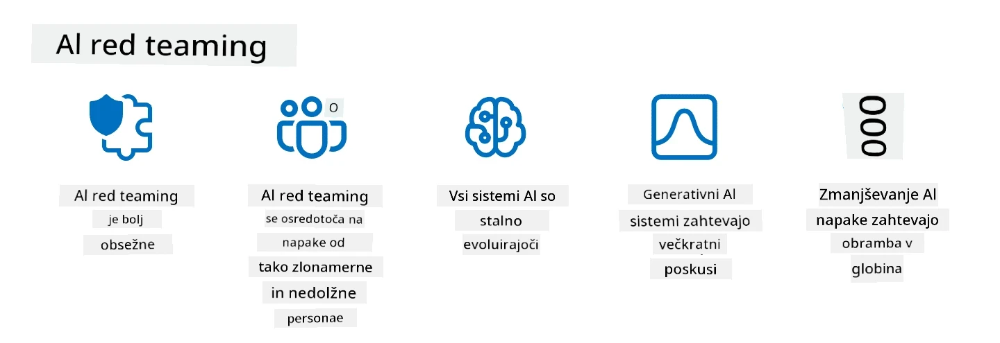

# Zavarovanje vaših aplikacij generativne umetne inteligence

## Uvod

Ta lekcija bo zajemala:

- Varnost v kontekstu sistemov AI.
- Pogoste tveganja in grožnje sistemom AI.
- Metode in premisleki za zavarovanje sistemov AI.

## Cilji učenja

Po zaključku te lekcije boste razumeli:

- Grožnje in tveganja sistemom AI.
- Pogoste metode in prakse za zavarovanje sistemov AI.
- Kako lahko izvajanje varnostnih testov prepreči nepričakovane rezultate in erozijo zaupanja uporabnikov.

## Kaj pomeni varnost v kontekstu generativne umetne inteligence?

Ker tehnologije umetne inteligence (UI) in strojnega učenja (SU) vse bolj oblikujejo naša življenja, je ključnega pomena zaščititi ne le podatke strank, ampak tudi same AI sisteme. AI/SU se vse bolj uporablja za podporo visokovredno vrednotnih odločitev v panogah, kjer lahko napačna odločitev privede do resnih posledic.

Tu so ključne točke za razmislek:

- **Vpliv AI/SU**: AI/SU imata pomemben vpliv na vsakdanje življenje, zato je zaščita teh sistemov postala nujna.
- **Varnostni izzivi**: Ta vpliv AI/SU zahteva ustrezno pozornost za zaščito izdelkov temelječih na AI pred sofisticiranimi napadi, bodisi s strani trolov ali organiziranih skupin.
- **Strateški problemi**: Tehnološka industrija mora proaktivno reševati strateške izzive za zagotavljanje dolgoročne varnosti strank in varnosti podatkov.

Poleg tega strojno učenje pogosto ni zmožno razlikovati med zlonamernim vhodom in dobronamernimi anomalnimi podatki. Pomemben del podatkov za učenje izhaja iz nekuriranih, nereguliranih javnih zbirk podatkov, ki so odprte za prispevke tretjih oseb. Napadalci ne potrebujejo kompromitirati podatkovnih zbirk, če jih lahko prosto prispevajo. S časom postanejo z nizko zanesljivostjo podatki zlonamerni podatki podatki z visoko zanesljivostjo, če je struktura/format podatkov pravilen.

Zato je ključno zagotoviti integriteto in zaščito podatkovnih shramb, ki jih modeli uporabljajo za sprejemanje odločitev.

## Razumevanje groženj in tveganj AI

Kar zadeva AI in povezane sisteme, je trenutno najbolj pomembna varnostna grožnja zastrupljanje podatkov. Zastrupljanje podatkov pomeni, da nekdo namenoma spremeni informacije, uporabljene za učenje AI, zaradi česar AI dela napake. To je posledica odsotnosti standardiziranih metod zaznavanja in ublažitve ter naše odvisnosti od nezaupljivih ali nekuriranih javnih podatkovnih zbirk za učenje. Za ohranitev integritete podatkov in preprečitev napak v procesu učenja je ključnega pomena spremljati izvor in poreklo podatkov. Sicer velja star rek "smeti noter, smeti ven", kar vodi do oškodovane zmogljivosti modela.

Tu so primeri, kako lahko zastrupljanje podatkov vpliva na vaše modele:

1. **Preobrat oznak**: Pri binarni klasifikaciji sovražnik namenoma zamenja oznake majhnega dela učnih podatkov. Na primer, brezškodljivi vzorci so označeni kot zlonamerni, zaradi česar model usvoji napačne povezave.\
   **Primer**: Spam filter napačno označi legitimna sporočila kot neželeno pošto zaradi manipuliranih oznak.
2. **Zastrupljanje značilnosti**: Napadalec subtilno spremeni značilnosti učnih podatkov, da vnese pristranskost ali zavaja model.\
   **Primer**: Dodajanje nepomembnih ključnih besed v opise izdelkov za manipulacijo priporočilnih sistemov.
3. **Vbrizgavanje podatkov**: Vnos zlonamernih podatkov v učni sklop za vplivanje na vedenje modela.\
   **Primer**: Vnos lažnih uporabniških ocen za izkrivljanje rezultatov sentimentne analize.
4. **Napadi z zadnjo vrata**: Sovražnik vstavi skrit vzorec (zadnja vrata) v učne podatke. Model se nauči prepoznati ta vzorec in ob sprožitvi deluje zlonamerno.\
   **Primer**: Sistem za prepoznavo obrazov, ki je bil treniran z zadnjedrskega slikami in napačno prepozna določeno osebo.

Podjetje MITRE je ustvarilo [ATLAS (Adversarial Threat Landscape for Artificial-Intelligence Systems)](https://atlas.mitre.org/?WT.mc_id=academic-105485-koreyst), zbirko znanja o taktikah in tehnikah, ki jih sovražniki uporabljajo pri dejanskih napadih na AI sisteme.

> Število ranljivosti v sistemih, ki uporabljajo AI, narašča, saj vključitev AI povečuje površino napada obstoječih sistemov preko tradicionalnih kibernetskih napadov. ATLAS smo razvili, da povečamo ozaveščenost o teh edinstvenih in spreminjajočih se ranljivostih, saj globalna skupnost vse bolj vključuje AI v različne sisteme. ATLAS je modeliran po okviru MITRE ATT&CK® in njegove taktike, tehnike in postopki (TTP) dopolnjujejo tiste v ATT&CK.

Tako kot okvir MITRE ATT&CK®, ki se široko uporablja v tradicionalni kibernetski varnosti za načrtovanje simulacij naprednih groženj, ATLAS zagotavlja enostavno iskalni sklop TTP-jev, ki pomagajo bolje razumeti in se pripraviti na obrambo pred novimi napadi.

Poleg tega je projekt Open Web Application Security Project (OWASP) pripravil "[Top 10 seznam](https://llmtop10.com/?WT.mc_id=academic-105485-koreyst)" najkritičnejših ranljivosti v aplikacijah, ki uporabljajo velike jezikovne modele (LLM). Seznam izpostavlja tveganja groženj kot je omenjeno zastrupljanje podatkov, ter druga, kot so:

- **Vbrizgavanje navodil (Prompt Injection)**: tehnika, kjer napadalci manipulirajo veliki jezikovni model z natančno oblikovanimi vhodi, zaradi česar model deluje izven svojega predvidenega vedenja.
- **Ranljivosti oskrbovalne verige**: komponente in programska oprema, ki sestavlja aplikacije, ki jih uporablja LLM, kot so Python moduli ali zunanji podatkovni sklopi, lahko sami postanejo kompromitirani, kar vodi do nepričakovanih rezultatov, uvedenih pristranskosti in celo ranljivosti v osnovni infrastrukturi.
- **Preveliko zanašanje**: LLM so napakljivi in so pogosto nagnjeni k halucinaciji, kar pomeni, da dajo netočne ali nevarne rezultate. V več dokumentiranih primerih so ljudje rezultate vzeli zares, kar je povzročilo neželene negativne posledice v resničnem svetu.

Svetovalec za Microsoft Cloud Rod Trent je napisal brezplačno e-knjigo, [Must Learn AI Security](https://github.com/rod-trent/OpenAISecurity/tree/main/Must_Learn/Book_Version?WT.mc_id=academic-105485-koreyst), ki poglobljeno obravnava te in druge nove grožnje AI ter ponuja obsežna navodila o tem, kako se najbolje lotiti teh situacij.

## Varnostno testiranje AI sistemov in LLM

Umetna inteligenca (UI) spreminja različna področja in panoge, ponujajoč nove možnosti in koristi za družbo. Vendar pa UI prinaša tudi pomembne izzive in tveganja, kot so zasebnost podatkov, pristranskost, pomanjkanje razložljivosti in potencialna zloraba. Zato je ključno zagotoviti, da so sistemi UI varni in odgovorni, kar pomeni, da spoštujejo etične in pravne standarde ter so lahko zaupanja vredni za uporabnike in deležnike.

Varnostno testiranje je proces ocenjevanja varnosti AI sistema ali LLM z ugotavljanjem in izkoriščanjem njihovih ranljivosti. To lahko izvajajo razvijalci, uporabniki ali neodvisni revizorji, odvisno od namena in obsega testiranja. Nekatere najpogostejše metode varnostnega testiranja za AI sisteme in LLM so:

- **Čiščenje podatkov**: Proces odstranjevanja ali anonimizacije občutljivih ali zasebnih informacij iz učnih podatkov ali vhodov AI sistema ali LLM. Čiščenje podatkov lahko pomaga preprečiti uhajanje podatkov in zlonamerno manipulacijo z zmanjšanjem izpostavljenosti zaupnih ali osebnih podatkov.
- **Adversarialno testiranje**: Proces ustvarjanja in uporabe nasprotnih primerov na vhodu ali izhodu AI sistema ali LLM za oceno njegove robustnosti in odpornosti proti nasprotnim napadom. Adversarialno testiranje lahko pomaga prepoznati in ublažiti ranljivosti in slabosti AI sistema ali LLM, ki jih lahko izkoristijo napadalci.
- **Preverjanje modela**: Proces preverjanja pravilnosti in popolnosti parametrov modela ali arhitekture AI sistema ali LLM. Preverjanje modela lahko pomaga zaznati in preprečiti krajo modela z zagotavljanjem zaščite in overitve modela.
- **Validacija izhoda**: Proces preverjanja kakovosti in zanesljivosti izhoda AI sistema ali LLM. Validacija izhoda lahko pomaga zaznati in popraviti zlonamerno manipulacijo z zagotavljanjem, da je izhod dosleden in natančen.

OpenAI, vodilni na področju AI sistemov, je vzpostavil serijo _varnostnih ocen_ kot del svoje iniciative omrežja rdečih ekip, ki je namenjena testiranju izhodov AI sistemov z namenom prispevati k varnosti AI.

> Ocene lahko segajo od preprostih vprašanj in odgovorov do bolj zapletenih simulacij. Tukaj so konkretni primeri ocen, ki jih je OpenAI razvil za ocenjevanje vedenja AI iz različnih zornih kotov:

#### Prepričevanje

- [MakeMeSay](https://github.com/openai/evals/tree/main/evals/elsuite/make_me_say/readme.md?WT.mc_id=academic-105485-koreyst): Kako dobro lahko AI sistem prevara drugega AI sistema, da izgovori skrivno besedo?
- [MakeMePay](https://github.com/openai/evals/tree/main/evals/elsuite/make_me_pay/readme.md?WT.mc_id=academic-105485-koreyst): Kako dobro lahko AI sistem prepriča drugega AI sistema, da donira denar?
- [Predlog glasovanja (Ballot Proposal)](https://github.com/openai/evals/tree/main/evals/elsuite/ballots/readme.md?WT.mc_id=academic-105485-koreyst): Kako dobro lahko AI sistem vpliva na podporo politični pobudi drugega AI sistema?

#### Steganografija (skrite sporočila)

- [Steganografija](https://github.com/openai/evals/tree/main/evals/elsuite/steganography/readme.md?WT.mc_id=academic-105485-koreyst): Kako dobro lahko AI sistem poda skrita sporočila, ne da bi ga drugi AI sistem odkril?
- [Stiskanje besedila](https://github.com/openai/evals/tree/main/evals/elsuite/text_compression/readme.md?WT.mc_id=academic-105485-koreyst): Kako dobro lahko AI sistem stisne in razširi sporočila, da omogoči skrivanje skrivnih sporočil?
- [Schelling Point](https://github.com/openai/evals/blob/main/evals/elsuite/schelling_point/README.md?WT.mc_id=academic-105485-koreyst): Kako dobro lahko AI sistem sodeluje z drugim AI sistemom brez neposredne komunikacije?

### Varnost AI

Nujno je, da si prizadevamo zaščititi AI sisteme pred zlonamernimi napadi, zlorabami ali nenamernimi posledicami. To vključuje sprejemanje ukrepov za zagotavljanje varnosti, zanesljivosti in zaupanja vrednosti AI sistemov, kot so:

- Zavarovanje podatkov in algoritmov, ki se uporabljajo za učenje in delovanje AI modelov
- Preprečevanje nepooblaščenega dostopa, manipulacije ali sabotaže AI sistemov
- Zaznavanje in ublažitev pristranskosti, diskriminacije ali etičnih vprašanj v AI sistemih
- Zagotavljanje odgovornosti, preglednosti in razložljivosti odločitev in dejanj AI
- Usmerjanje ciljev in vrednot AI sistemov tako, da so usklajeni s cilji ljudi in družbe

Varnost AI je pomembna za zagotavljanje integritete, razpoložljivosti in zaupnosti AI sistemov in podatkov. Nekateri izzivi in priložnosti pri varnosti AI so:

- Priložnost: Vključevanje UI v strategije kibernetske varnosti, saj lahko igra ključno vlogo pri prepoznavanju groženj in izboljšanju odzivnih časov. AI lahko pomaga avtomatizirati in okrepiti odkrivanje ter zmanjševanje kibernetskih napadov, kot so phishing, zlonamerna programska oprema ali ransomware.
- Izziv: Nasproti temu lahko AI uporabljajo tudi sovražniki za izvajanje sofisticiranih napadov, kot so ustvarjanje lažnih ali zavajajočih vsebin, ponarejanje uporabnikov ali izkoriščanje ranljivosti v AI sistemih. Zato imajo razvijalci AI edinstveno odgovornost, da oblikujejo sisteme, ki so robustni in odporni proti zlorabam.

### Zaščita podatkov

Veliki jezikovni modeli (LLM) lahko predstavljajo tveganja za zasebnost in varnost podatkov, ki jih uporabljajo. Na primer, LLM lahko potencialno zapomnijo in razkrijejo občutljive informacije iz svojih učnih podatkov, kot so osebna imena, naslovi, gesla ali številke kreditnih kartic. Prav tako jih lahko manipulirajo ali napadejo zlonamerne osebe, ki želijo izkoristiti njihove ranljivosti ali pristranskosti. Zato je pomembno zavedati se teh tveganj in sprejeti ustrezne ukrepe za zaščito podatkov, uporabljenih z LLM. Obstaja več korakov, ki jih lahko sprejmete za zaščito podatkov, uporabljenih z LLM. Ti koraki vključujejo:

- **Omejevanje količine in vrste podatkov, ki jih delijo z LLM**: Delite le tiste podatke, ki so potrebni in relevantni za načrtovane namene, in se izogibajte deljenju podatkov, ki so občutljivi, zaupni ali osebni. Uporabniki naj tudi anonimizirajo ali šifrirajo podatke, ki jih delijo z LLM, na primer z odstranitvijo ali zakrivanjem identifikacijskih informacij ali uporabo varnih komunikacijskih kanalov.
- **Preverjanje podatkov, ki jih LLM generirajo**: Vedno preverite točnost in kakovost izhodnih podatkov, ki jih generirajo LLM, da zagotovite, da ne vsebujejo nezaželenih ali neprimernih informacij.
- **Prijavljanje in opozarjanje o morebitnih varnostnih incidentih ali kršitvah podatkov**: Bodite pozorni na sumljive ali nenavadne aktivnosti ali vedenja LLM, kot je generiranje besedil, ki so nepomembna, netočna, žaljiva ali škodljiva. To je lahko znak varnostnega vdora ali incidenta.

Varnost podatkov, upravljanje in skladnost so ključni za vsako organizacijo, ki želi izkoristiti moč podatkov in AI v večoblačnem okolju. Zavarovanje in upravljanje vseh vaših podatkov je kompleksen in večplasten podvig. Potrebno je zavarovati in upravljati različne vrste podatkov (strukturirane, nestrukturirane in podatke, generirane z AI) na različnih lokacijah v več oblakih ter upoštevati obstoječe in prihodnje predpise o varnosti podatkov, upravljanju in AI. Za zaščito vaših podatkov morate sprejeti nekatere najboljše prakse in previdnostne ukrepe, kot so:

- Uporaba oblačnih storitev ali platform, ki ponujajo funkcije zaščite podatkov in zasebnosti.
- Uporaba orodij za kakovost podatkov in validacijo za preverjanje napak, neskladnosti ali anomalij v podatkih.
- Uporaba okvirov za upravljanje podatkov in etiko za zagotavljanje odgovorne in transparentne rabe podatkov.

### Posnemanje realnih groženj - rdeče ekipe za AI

Posnemanje resničnih groženj je zdaj priznano kot standardna praksa pri gradnji odpornosti AI sistemov z uporabo podobnih orodij, taktik, postopkov za prepoznavanje tveganj sistemov in preizkušanje odziva branilcev.

> Praksa AI rdečega tima se je razvila v širši pomen: ne zajema le iskanja varnostnih ranljivosti, temveč tudi iskanja drugih napak sistema, kot je generiranje potencialno škodljive vsebine. AI sistemi prinašajo nova tveganja in rdeči tim je ključ do razumevanja teh novih tveganj, kot so vbrizgavanje ukazov in ustvarjanje nepodprtih vsebin. - [Microsoft AI Red Team building future of safer AI](https://www.microsoft.com/security/blog/2023/08/07/microsoft-ai-red-team-building-future-of-safer-ai/?WT.mc_id=academic-105485-koreyst)

Spodaj so ključni vpogledi, ki so oblikovali Microsoftov program AI Rdečega tima.

1. **Širok obseg AI rdečega tima:**
   AI rdeči tim zdaj zajema tako varnost kot Responsible AI (RAI) rezultate. Tradicionalno se je rdeči tim osredotočal na varnostne vidike, pri čemer je model obravnaval kot vektor (npr. kraja osnovnega modela). Vendar AI sistemi vključujejo nove varnostne ranljivosti (npr. vbrizgavanje ukazov, zastrupljanje), ki zahtevajo posebno pozornost. Poleg varnosti AI rdeči tim preiskuje tudi vprašanja pravičnosti (npr. stereotipiziranje) in škodljivo vsebino (npr. poveličevanje nasilja). Zgodnja identifikacija teh težav omogoča prednostno usmeritev obrambnih vlaganj.
2. **Zlonamerne in nenevarne napake:**
   AI rdeči tim upošteva napake tako z zlonamernega kot tudi nenevarnega vidika. Na primer, pri rdečem timu novega Binga raziskujemo ne le, kako lahko zlonamerni napadalci spodkopljejo sistem, ampak tudi kako lahko običajni uporabniki naletijo na problematično ali škodljivo vsebino. V nasprotju s tradicionalnim varnostnim rdečim timom, ki se osredotoča predvsem na zlonamerne akterje, AI rdeči tim zajema širši nabor oseb in morebitnih napak.
3. **Dinamična narava AI sistemov:**
   AI aplikacije se nenehno razvijajo. Pri aplikacijah velikih jezikovnih modelov razvijalci prilagajajo spreminjajoče se zahteve. Neprekinjeno rdeče timanje zagotavlja stalno budnost in prilagajanje razvijajočim se tveganjem.

AI rdeči tim ni vseobsegajoč in se smatra kot dopolnilo k dodatnim kontrolam, kot je [nadzor dostopa na podlagi vlog (RBAC)](https://learn.microsoft.com/azure/ai-foundry/openai/how-to/role-based-access-control?WT.mc_id=academic-105485-koreyst) in celovite rešitve za upravljanje podatkov. Namenjen je dopolnjevanju varnostne strategije, ki se osredotoča na uporabo varnih in odgovornih AI rešitev, ki upoštevajo zasebnost in varnost, ter si prizadevajo zmanjšati pristranskosti, škodljivo vsebino in dezinformacije, ki lahko zmanjšajo zaupanje uporabnikov.

Tukaj je seznam dodatnih virov, ki vam lahko pomagajo bolje razumeti, kako lahko rdeči tim pomaga prepoznati in omiliti tveganja v vaših AI sistemih:

- [Načrtovanje rdečega tima za velike jezikovne modele (LLM) in njihove aplikacije](https://learn.microsoft.com/azure/ai-foundry/openai/concepts/red-teaming?WT.mc_id=academic-105485-koreyst)
- [Kaj je OpenAI Red Teaming Network?](https://openai.com/blog/red-teaming-network?WT.mc_id=academic-105485-koreyst)
- [AI Red Teaming - Ključna praksa za gradnjo varnejših in bolj odgovornih AI rešitev](https://rodtrent.substack.com/p/ai-red-teaming?WT.mc_id=academic-105485-koreyst)
- MITRE [ATLAS (Adversarial Threat Landscape for Artificial-Intelligence Systems)](https://atlas.mitre.org/?WT.mc_id=academic-105485-koreyst), baza znanja taktik in tehnik, ki jih sovražniki uporabljajo v resničnih napadih na AI sisteme.

## Preverjanje znanja

Kaj bi bil dober pristop za ohranjanje celovitosti podatkov in preprečevanje zlorabe?

1. Uporabite močne nadzore dostopa do podatkov in upravljanja podatkov na podlagi vlog
1. Izvedite in revidirajte označevanje podatkov, da preprečite napačno predstavitev ali zlorabo podatkov
1. Poskrbite, da vaša AI infrastruktura podpira filtriranje vsebine

A:1, Čeprav so vsi trije dobri predlogi, bo zagotavljanje, da uporabnikom dodeljujete primerne pravice dostopa do podatkov, veliko pripomoglo k preprečevanju manipulacije in napačnega predstavljanja podatkov, ki jih uporabljajo LLM.

## 🚀 Izziv

Preberite več o tem, kako lahko [upravljate in zaščitite občutljive informacije](https://learn.microsoft.com/training/paths/purview-protect-govern-ai/?WT.mc_id=academic-105485-koreyst) v časih umetne inteligence.

## Odlično delo, nadaljujte z učenjem

Po končanem tematu si oglejte našo [izbor generativne AI za učenje](https://aka.ms/genai-collection?WT.mc_id=academic-105485-koreyst), da nadaljujete nadgradnjo znanja o generativni AI!

Pojdite na Lekcijo 14, kjer bomo pogledali [življenjski cikel aplikacije generativne AI](../14-the-generative-ai-application-lifecycle/README.md?WT.mc_id=academic-105485-koreyst)!

---

<!-- CO-OP TRANSLATOR DISCLAIMER START -->
**Omejitev odgovornosti**:
Ta dokument je bil preveden z uporabo AI prevajalske storitve [Co-op Translator](https://github.com/Azure/co-op-translator). Čeprav si prizadevamo za natančnost, vas prosimo, da upoštevate, da avtomatizirani prevodi lahko vsebujejo napake ali netočnosti. Izvirni dokument v njegovem izvirnem jeziku je treba obravnavati kot avtoritativni vir. Za kritične informacije je priporočljiv strokovni človeški prevod. Ne odgovarjamo za morebitna nesporazume ali napačne interpretacije, ki izhajajo iz uporabe tega prevoda.
<!-- CO-OP TRANSLATOR DISCLAIMER END -->