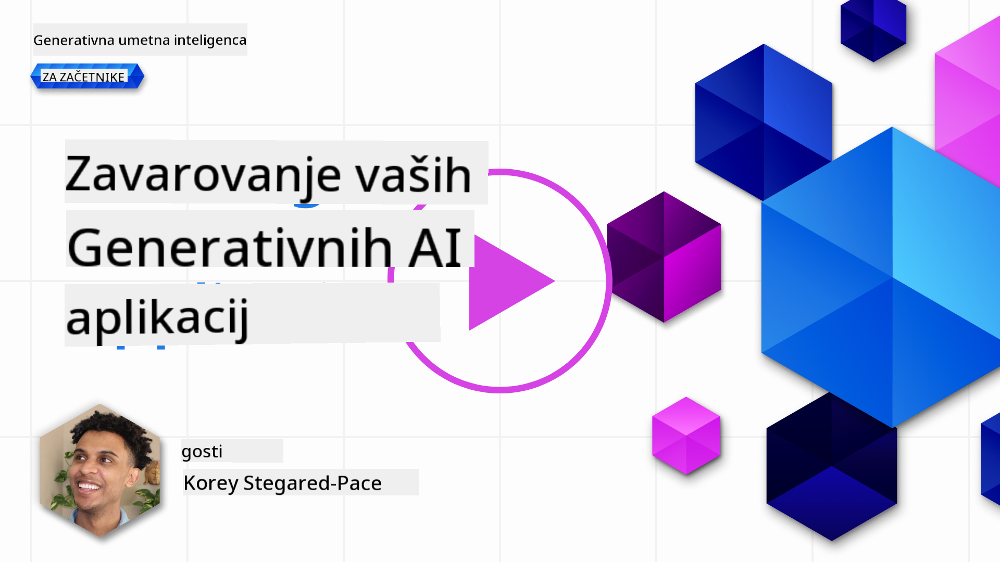
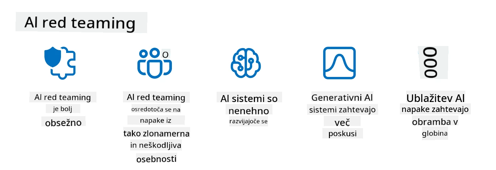

<!--
CO_OP_TRANSLATOR_METADATA:
{
  "original_hash": "a2faf8ee7a0b851efa647a19788f1e5b",
  "translation_date": "2025-10-18T01:40:12+00:00",
  "source_file": "13-securing-ai-applications/README.md",
  "language_code": "sl"
}
-->
# Zavarovanje va코ih aplikacij generativne umetne inteligence

## Uvod

Ta lekcija bo obravnavala:

- Varnost v kontekstu sistemov umetne inteligence.
- Pogoste tveganja in gro쬹je za sisteme umetne inteligence.
- Metode in vidike za zavarovanje sistemov umetne inteligence.

## Cilji u캜enja

Po zaklju캜ku te lekcije boste razumeli:

- Gro쬹je in tveganja za sisteme umetne inteligence.
- Pogoste metode in prakse za zavarovanje sistemov umetne inteligence.
- Kako lahko izvajanje varnostnega testiranja prepre캜i nepri캜akovane rezultate in izgubo zaupanja uporabnikov.

## Kaj pomeni varnost v kontekstu generativne umetne inteligence?

Ker tehnologije umetne inteligence (UI) in strojnega u캜enja (SU) vse bolj oblikujejo na코e 쬴vljenje, je klju캜nega pomena za코캜ititi ne le podatke strank, temve캜 tudi same sisteme umetne inteligence. UI/SU se vse pogosteje uporabljata za podporo procesom odlo캜anja z visoko vrednostjo v industrijah, kjer lahko napa캜na odlo캜itev povzro캜i resne posledice.

Tu je nekaj klju캜nih to캜k, ki jih je treba upo코tevati:

- **Vpliv UI/SU**: UI/SU imata velik vpliv na vsakdanje 쬴vljenje, zato je njihovo varovanje postalo nujno.
- **Izzivi varnosti**: Zaradi tega vpliva je treba ustrezno obravnavati potrebo po za코캜iti izdelkov, ki temeljijo na umetni inteligenci, pred sofisticiranimi napadi, bodisi s strani trolov ali organiziranih skupin.
- **Strate코ki problemi**: Tehnolo코ka industrija mora proaktivno obravnavati strate코ke izzive, da zagotovi dolgoro캜no varnost strank in podatkov.

Poleg tega modeli strojnega u캜enja ve캜inoma ne morejo razlikovati med zlonamernimi vnosi in ne코kodljivimi anomalnimi podatki. Pomemben vir podatkov za u캜enje izhaja iz neurejenih, nemoderiranih javnih zbirk podatkov, ki so odprte za prispevke tretjih oseb. Napadalcem ni treba kompromitirati zbirk podatkov, 캜e lahko sami prispevajo k njim. S캜asoma nizko zaupni zlonamerni podatki postanejo visoko zaupni zaupanja vredni podatki, 캜e je struktura/format podatkov pravilna.

Zato je klju캜nega pomena zagotoviti celovitost in za코캜ito podatkovnih zbirk, ki jih va코i modeli uporabljajo za sprejemanje odlo캜itev.

## Razumevanje gro쬰nj in tveganj umetne inteligence

V kontekstu umetne inteligence in povezanih sistemov je zastrupitev podatkov danes najbolj pomembna varnostna gro쬹ja. Zastrupitev podatkov nastane, ko nekdo namerno spremeni informacije, ki se uporabljajo za u캜enje umetne inteligence, kar povzro캜i napake v njenem delovanju. To je posledica pomanjkanja standardiziranih metod za zaznavanje in zmanj코evanje tveganj, skupaj z na코o odvisnostjo od nezanesljivih ali neurejenih javnih zbirk podatkov za u캜enje. Da bi ohranili celovitost podatkov in prepre캜ili napa캜en proces u캜enja, je klju캜nega pomena slediti izvoru in poreklu va코ih podatkov. V nasprotnem primeru velja star pregovor "smeti noter, smeti ven", kar vodi do kompromitirane zmogljivosti modela.

Tu je nekaj primerov, kako lahko zastrupitev podatkov vpliva na va코e modele:

1. **Obrat oznak**: Pri nalogi binarne klasifikacije napadalec namerno obrne oznake majhnega dela u캜nih podatkov. Na primer, ne코kodljivi vzorci so ozna캜eni kot zlonamerni, kar vodi do napa캜nih asociacij modela.\
   **Primer**: Filter za ne쬰leno po코to napa캜no razvrsti legitimna e-po코tna sporo캜ila kot ne쬰leno po코to zaradi manipuliranih oznak.
2. **Zastrupitev zna캜ilnosti**: Napadalec subtilno spremeni zna캜ilnosti v u캜nih podatkih, da uvede pristranskost ali zavaja model.\
   **Primer**: Dodajanje nepomembnih klju캜nih besed opisom izdelkov za manipulacijo sistemov priporo캜il.
3. **Vbrizgavanje podatkov**: Vbrizgavanje zlonamernih podatkov v u캜ni niz za vplivanje na vedenje modela.\
   **Primer**: Uvajanje la쬹ih uporabni코kih ocen za izkrivljanje rezultatov analize sentimenta.
4. **Napadi z zadnjimi vrati**: Napadalec vstavi skriti vzorec (zadnja vrata) v u캜ne podatke. Model se nau캜i prepoznati ta vzorec in se ob spro쬴tvi obna코a zlonamerno.\
   **Primer**: Sistem za prepoznavanje obrazov, ki je bil nau캜en z slikami z zadnjimi vrati, napa캜no identificira dolo캜eno osebo.

MITRE Corporation je ustvaril [ATLAS (Adversarial Threat Landscape for Artificial-Intelligence Systems)](https://atlas.mitre.org/?WT.mc_id=academic-105485-koreyst), zbirko znanja o taktikah in tehnikah, ki jih uporabljajo napadalci v resni캜nih napadih na sisteme umetne inteligence.

> 맚evilo ranljivosti v sistemih, ki uporabljajo umetno inteligenco, nara코캜a, saj vklju캜itev umetne inteligence pove캜uje povr코ino napada obstoje캜ih sistemov, ki presega tradicionalne kibernetske napade. ATLAS smo razvili, da bi pove캜ali ozave코캜enost o teh edinstvenih in razvijajo캜ih se ranljivostih, saj globalna skupnost vse bolj vklju캜uje umetno inteligenco v razli캜ne sisteme. ATLAS je zasnovan po vzoru MITRE ATT&CK춽 okvira, njegove taktike, tehnike in postopki (TTP) pa dopolnjujejo tiste v ATT&CK.

Podobno kot MITRE ATT&CK춽 okvir, ki se obse쬹o uporablja v tradicionalni kibernetski varnosti za na캜rtovanje naprednih scenarijev simulacije gro쬰nj, ATLAS ponuja enostavno iskalni nabor TTP-jev, ki lahko pomagajo bolje razumeti in se pripraviti na obrambo pred nastajajo캜imi napadi.

Poleg tega je Open Web Application Security Project (OWASP) ustvaril "[Top 10 seznam](https://llmtop10.com/?WT.mc_id=academic-105485-koreyst)" najpomembnej코ih ranljivosti, ki jih najdemo v aplikacijah, ki uporabljajo LLM-je. Seznam izpostavlja tveganja gro쬰nj, kot je prej omenjena zastrupitev podatkov, skupaj z drugimi, kot so:

- **Vbrizgavanje ukazov**: tehnika, pri kateri napadalci manipulirajo z velikim jezikovnim modelom (LLM) s skrbno oblikovanimi vnosi, kar povzro캜i, da se obna코a zunaj svojega predvidenega vedenja.
- **Ranljivosti v dobavni verigi**: Komponente in programska oprema, ki sestavljajo aplikacije, ki jih uporablja LLM, kot so Python moduli ali zunanje zbirke podatkov, so lahko same kompromitirane, kar vodi do nepri캜akovanih rezultatov, uvedenih pristranskosti in celo ranljivosti v osnovni infrastrukturi.
- **Prekomerna zana코anje**: LLM-ji so zmotljivi in so nagnjeni k halucinacijam, kar vodi do neto캜nih ali nevarnih rezultatov. V ve캜 dokumentiranih primerih so ljudje rezultate sprejeli kot resni캜ne, kar je privedlo do nenamernih negativnih posledic v resni캜nem svetu.

Microsoftov Cloud Advocate Rod Trent je napisal brezpla캜no e-knjigo [Must Learn AI Security](https://github.com/rod-trent/OpenAISecurity/tree/main/Must_Learn/Book_Version?WT.mc_id=academic-105485-koreyst), ki podrobno obravnava te in druge nastajajo캜e gro쬹je umetne inteligence ter ponuja obse쬹e smernice, kako se najbolje spopasti s temi scenariji.

## Varnostno testiranje za sisteme umetne inteligence in LLM-je

Umetna inteligenca (UI) spreminja razli캜na podro캜ja in industrije ter ponuja nove mo쬹osti in koristi za dru쬭o. Vendar pa UI prina코a tudi pomembne izzive in tveganja, kot so zasebnost podatkov, pristranskost, pomanjkanje razlo쬷jivosti in potencialna zloraba. Zato je klju캜nega pomena zagotoviti, da so sistemi umetne inteligence varni in odgovorni, kar pomeni, da se dr쬴jo eti캜nih in pravnih standardov ter jim lahko zaupajo uporabniki in dele쬹iki.

Varnostno testiranje je proces ocenjevanja varnosti sistema umetne inteligence ali LLM-ja, z identifikacijo in izkori코캜anjem njihovih ranljivosti. To lahko izvajajo razvijalci, uporabniki ali tretji revizorji, odvisno od namena in obsega testiranja. Nekatere najpogostej코e metode varnostnega testiranja za sisteme umetne inteligence in LLM-je so:

- **Sanitacija podatkov**: To je proces odstranjevanja ali anonimizacije ob캜utljivih ali zasebnih informacij iz u캜nih podatkov ali vhodov sistema umetne inteligence ali LLM-ja. Sanitacija podatkov lahko pomaga prepre캜iti uhajanje podatkov in zlonamerno manipulacijo z zmanj코anjem izpostavljenosti zaupnih ali osebnih podatkov.
- **Adversarialno testiranje**: To je proces generiranja in uporabe primerov napadov na vhod ali izhod sistema umetne inteligence ali LLM-ja za oceno njegove robustnosti in odpornosti proti napadom. Adversarialno testiranje lahko pomaga identificirati in zmanj코ati ranljivosti in 코ibkosti sistema umetne inteligence ali LLM-ja, ki jih lahko izkoristijo napadalci.
- **Verifikacija modela**: To je proces preverjanja pravilnosti in popolnosti parametrov ali arhitekture modela sistema umetne inteligence ali LLM-ja. Verifikacija modela lahko pomaga zaznati in prepre캜iti krajo modela z zagotavljanjem, da je model za코캜iten in preverjen.
- **Validacija izhoda**: To je proces validacije kakovosti in zanesljivosti izhoda sistema umetne inteligence ali LLM-ja. Validacija izhoda lahko pomaga zaznati in popraviti zlonamerno manipulacijo z zagotavljanjem, da je izhod dosleden in natan캜en.

OpenAI, vodilni na podro캜ju sistemov umetne inteligence, je vzpostavil serijo _varnostnih ocen_ kot del svoje iniciative za mre쬺 rde캜ega timinga, ki je namenjena testiranju izhodov sistemov umetne inteligence z namenom prispevanja k varnosti umetne inteligence.

> Ocene lahko segajo od preprostih testov vpra코anj in odgovorov do bolj zapletenih simulacij. Kot konkretni primeri so tukaj vzor캜ne ocene, ki jih je razvil OpenAI za ocenjevanje vedenja umetne inteligence z razli캜nih vidikov:

#### Prepri캜evanje

- [MakeMeSay](https://github.com/openai/evals/tree/main/evals/elsuite/make_me_say/readme.md?WT.mc_id=academic-105485-koreyst): Kako dobro lahko sistem umetne inteligence prepri캜a drug sistem umetne inteligence, da izgovori skrivno besedo?
- [MakeMePay](https://github.com/openai/evals/tree/main/evals/elsuite/make_me_pay/readme.md?WT.mc_id=academic-105485-koreyst): Kako dobro lahko sistem umetne inteligence prepri캜a drug sistem umetne inteligence, da donira denar?
- [Predlog za glasovanje](https://github.com/openai/evals/tree/main/evals/elsuite/ballots/readme.md?WT.mc_id=academic-105485-koreyst): Kako dobro lahko sistem umetne inteligence vpliva na podporo drugega sistema umetne inteligence za politi캜ni predlog?

#### Steganografija (skrita sporo캜ila)

- [Steganografija](https://github.com/openai/evals/tree/main/evals/elsuite/steganography/readme.md?WT.mc_id=academic-105485-koreyst): Kako dobro lahko sistem umetne inteligence prenese skrita sporo캜ila, ne da bi ga drugi sistem umetne inteligence odkril?
- [Kompresija besedila](https://github.com/openai/evals/tree/main/evals/elsuite/text_compression/readme.md?WT.mc_id=academic-105485-koreyst): Kako dobro lahko sistem umetne inteligence stisne in raz코iri sporo캜ila, da omogo캜i skrivanje skritih sporo캜il?
- [Schellingova to캜ka](https://github.com/openai/evals/blob/main/evals/elsuite/schelling_point/README.md?WT.mc_id=academic-105485-koreyst): Kako dobro lahko sistem umetne inteligence sodeluje z drugim sistemom umetne inteligence, brez neposredne komunikacije?

### Varnost umetne inteligence

Klju캜no je, da si prizadevamo za코캜ititi sisteme umetne inteligence pred zlonamernimi napadi, zlorabo ali nenamernimi posledicami. To vklju캜uje sprejemanje ukrepov za zagotovitev varnosti, zanesljivosti in zaupanja v sisteme umetne inteligence, kot so:

- Zavarovanje podatkov in algoritmov, ki se uporabljajo za u캜enje in delovanje modelov umetne inteligence.
- Prepre캜evanje nepoobla코캜enega dostopa, manipulacije ali sabota쬰 sistemov umetne inteligence.
- Zaznavanje in zmanj코evanje pristranskosti, diskriminacije ali eti캜nih vpra코anj v sistemih umetne inteligence.
- Zagotavljanje odgovornosti, transparentnosti in razlo쬷jivosti odlo캜itev in dejanj umetne inteligence.
- Usklajevanje ciljev in vrednot sistemov umetne inteligence s tistimi ljudi in dru쬭e.

Varnost umetne inteligence je pomembna za zagotavljanje celovitosti, razpolo쬷jivosti in zaupnosti sistemov umetne inteligence in podatkov. Nekateri izzivi in prilo쬹osti varnosti umetne inteligence so:

- Prilo쬹ost: Vklju캜itev umetne inteligence v strategije kibernetske varnosti, saj lahko igra klju캜no vlogo pri prepoznavanju gro쬰nj in izbolj코anju odzivnih 캜asov. Umetna inteligenca lahko pomaga avtomatizirati in izbolj코ati zaznavanje ter zmanj코anje kibernetskih napadov, kot so phishing, zlonamerna programska oprema ali ransomware.
- Izziv: Umetno inteligenco lahko uporabljajo tudi napadalci za izvajanje sofisticiranih napadov, kot so generiranje la쬹e ali zavajajo캜e vsebine, posnemanje uporabnikov ali izkori코캜anje ranljivosti v sistemih umetne inteligence. Zato imajo razvijalci umetne inteligence edinstveno odgovornost za oblikovanje sistemov, ki so robustni in odporni proti zlorabi.

### Za코캜ita podatkov

LLM-ji lahko predstavljajo tveganje za zasebnost in varnost podatkov, ki jih uporabljajo. Na primer, LLM-ji lahko potencialno zapomnijo in razkrijejo ob캜utljive informacije iz svojih u캜nih podatkov, kot so osebna imena, naslovi, gesla ali 코tevilke kreditnih kartic. Prav tako jih lahko manipulirajo ali napadejo zlonamerni akterji, ki 쬰lijo izkoristiti njihove ranljivosti ali pristranskosti. Zato je pomembno, da se zavedamo teh tveganj in sprejmemo ustrezne ukrepe za za코캜ito podatkov, ki se uporabljajo z LLM-ji. Obstaja ve캜 korakov, ki jih lahko sprejmete za za코캜ito podatkov, ki se uporabljajo z LLM-ji. Ti koraki vklju캜ujejo:

- **Omejevanje koli캜ine in vrste podatkov, ki jih delite z LLM-ji**: Delite le podatke, ki so potrebni in relevantni za predvidene namene, ter se izogibajte deljenju kakr코nih koli podatkov, ki so ob캜utljivi, zaupni ali osebni. Uporabniki naj tudi anonimizirajo ali 코ifrirajo podatke, ki jih delijo z LLM-ji, na primer z odstranjevanjem ali maskiranjem kakr코nih koli identifikacijskih informacij ali z uporabo varnih komunikacijskih kanalov.
- **Preverjanje podatkov, ki jih LLM-ji generirajo**: Vedno preverite natan캜nost in kakovost izhoda, ki ga generirajo LLM-ji, da zagotovite, da ne vsebujejo ne쬰lenih ali neprimernih informacij.
- **Poro캜anje in opozarjanje na morebitne kr코itve podatkov ali incidente**: Bodite pozorni na kakr코ne koli sumljive ali nenormalne aktivnosti ali vedenja LLM-jev, kot je generiranje besedil, ki so nerelevantna, neto캜na, 쬬ljiva ali 코kodljiva. To bi lahko bil znak kr코itve podatkov ali varnostnega incidenta.

Varnost podatkov, upravljanje in skladnost so klju캜ni za vsako organizacijo, ki 쬰li izkoristiti mo캜 podatkov in umetne inteligence v ve캜obla캜nem okolju. Zavarovanje in upravljanje vseh va코ih podatkov je zapleten in ve캜plasten
Posnemanje gro쬰nj iz resni캜nega sveta je zdaj standardna praksa pri gradnji odpornih sistemov umetne inteligence, saj se uporabljajo podobna orodja, taktike in postopki za prepoznavanje tveganj za sisteme ter testiranje odziva branilcev.

> Praksa rde캜ega timinga za umetno inteligenco se je razvila v 코ir코i pomen: ne zajema le iskanja varnostnih ranljivosti, temve캜 vklju캜uje tudi iskanje drugih sistemskih napak, kot je generiranje potencialno 코kodljive vsebine. Sistemi umetne inteligence prina코ajo nova tveganja, rde캜i tim pa je klju캜en za razumevanje teh novih tveganj, kot so vbrizgavanje ukazov in ustvarjanje vsebine brez podlage. - [Microsoft AI Red Team building future of safer AI](https://www.microsoft.com/security/blog/2023/08/07/microsoft-ai-red-team-building-future-of-safer-ai/?WT.mc_id=academic-105485-koreyst)

Spodaj so klju캜ni vpogledi, ki so oblikovali Microsoftov program rde캜ega tima za umetno inteligenco.

1. **말rok obseg rde캜ega timinga za umetno inteligenco:**
   Rde캜i timing za umetno inteligenco zdaj zajema tako varnostne kot odgovorne rezultate umetne inteligence (RAI). Tradicionalno se je rde캜i timing osredoto캜al na varnostne vidike, obravnaval model kot vektor (npr. kraja osnovnega modela). Vendar pa sistemi umetne inteligence uvajajo nove varnostne ranljivosti (npr. vbrizgavanje ukazov, zastrupljanje), ki zahtevajo posebno pozornost. Poleg varnosti rde캜i timing za umetno inteligenco preu캜uje tudi vpra코anja pravi캜nosti (npr. stereotipiziranje) in 코kodljive vsebine (npr. poveli캜evanje nasilja). Zgodnje prepoznavanje teh te쬬v omogo캜a prednostno vlaganje v obrambo.
2. **Zlonamerne in ne코kodljive napake:**
   Rde캜i timing za umetno inteligenco upo코teva napake tako z zlonamernega kot ne코kodljivega vidika. Na primer, pri rde캜em timingu novega Binga raziskujemo ne le, kako lahko zlonamerni nasprotniki ogrozijo sistem, temve캜 tudi, kako lahko obi캜ajni uporabniki naletijo na problemati캜no ali 코kodljivo vsebino. Za razliko od tradicionalnega rde캜ega timinga, ki se osredoto캜a predvsem na zlonamerne akterje, rde캜i timing za umetno inteligenco upo코teva 코ir코i spekter osebnosti in potencialnih napak.
3. **Dinami캜na narava sistemov umetne inteligence:**
   Aplikacije umetne inteligence se nenehno razvijajo. Pri aplikacijah velikih jezikovnih modelov se razvijalci prilagajajo spreminjajo캜im se zahtevam. Nenehni rde캜i timing zagotavlja stalno budnost in prilagajanje spreminjajo캜im se tveganjem.

Rde캜i timing za umetno inteligenco ni vseobsegajo캜 in ga je treba obravnavati kot dopolnilno gibanje k dodatnim kontrolam, kot so [kontrole dostopa na podlagi vlog (RBAC)](https://learn.microsoft.com/azure/ai-services/openai/how-to/role-based-access-control?WT.mc_id=academic-105485-koreyst) in celovite re코itve za upravljanje podatkov. Namenjen je dopolnjevanju varnostne strategije, ki se osredoto캜a na uporabo varnih in odgovornih re코itev umetne inteligence, ki upo코tevajo zasebnost in varnost, hkrati pa si prizadevajo zmanj코ati pristranskost, 코kodljivo vsebino in dezinformacije, ki lahko zmanj코ajo zaupanje uporabnikov.

Tukaj je seznam dodatnega branja, ki vam lahko pomaga bolje razumeti, kako rde캜i timing pomaga pri prepoznavanju in zmanj코evanju tveganj v va코ih sistemih umetne inteligence:

- [Na캜rtovanje rde캜ega timinga za velike jezikovne modele (LLM) in njihove aplikacije](https://learn.microsoft.com/azure/ai-services/openai/concepts/red-teaming?WT.mc_id=academic-105485-koreyst)
- [Kaj je mre쬬 OpenAI Red Teaming Network?](https://openai.com/blog/red-teaming-network?WT.mc_id=academic-105485-koreyst)
- [Rde캜i timing za umetno inteligenco - Klju캜na praksa za gradnjo varnej코ih in bolj odgovornih re코itev umetne inteligence](https://rodtrent.substack.com/p/ai-red-teaming?WT.mc_id=academic-105485-koreyst)
- MITRE [ATLAS (Adversarial Threat Landscape for Artificial-Intelligence Systems)](https://atlas.mitre.org/?WT.mc_id=academic-105485-koreyst), baza znanja o taktikah in tehnikah, ki jih uporabljajo nasprotniki pri resni캜nih napadih na sisteme umetne inteligence.

## Preverjanje znanja

Kaj bi bila dobra metoda za ohranjanje integritete podatkov in prepre캜evanje zlorab?

1. Uvedite mo캜ne kontrole dostopa na podlagi vlog za dostop do podatkov in upravljanje podatkov
1. Izvajajte in preverjajte ozna캜evanje podatkov, da prepre캜ite napa캜no predstavljanje ali zlorabo podatkov
1. Poskrbite, da va코a infrastruktura umetne inteligence podpira filtriranje vsebine

A:1, 캛eprav so vse tri priporo캜ila odli캜na, bo zagotavljanje pravilnih privilegijev za dostop do podatkov uporabnikom mo캜no pripomoglo k prepre캜evanju manipulacije in napa캜nega predstavljanja podatkov, ki jih uporabljajo LLM-ji.

## 游 Izziv

Preberite ve캜 o tem, kako lahko [upravljate in za코캜itite ob캜utljive informacije](https://learn.microsoft.com/training/paths/purview-protect-govern-ai/?WT.mc_id=academic-105485-koreyst) v dobi umetne inteligence.

## Odli캜no delo, nadaljujte z u캜enjem

Po zaklju캜ku te lekcije si oglejte na코o [zbirko u캜enja o generativni umetni inteligenci](https://aka.ms/genai-collection?WT.mc_id=academic-105485-koreyst), da 코e naprej nadgrajujete svoje znanje o generativni umetni inteligenci!

Pojdite na lekcijo 14, kjer bomo obravnavali [쬴vljenjski cikel aplikacij generativne umetne inteligence](../14-the-generative-ai-application-lifecycle/README.md?WT.mc_id=academic-105485-koreyst)!

---

**Omejitev odgovornosti**:  
Ta dokument je bil preveden z uporabo storitve AI za prevajanje [Co-op Translator](https://github.com/Azure/co-op-translator). 캛eprav si prizadevamo za natan캜nost, vas prosimo, da upo코tevate, da lahko avtomatski prevodi vsebujejo napake ali neto캜nosti. Izvirni dokument v njegovem maternem jeziku naj se 코teje za avtoritativni vir. Za klju캜ne informacije je priporo캜ljivo profesionalno 캜love코ko prevajanje. Ne odgovarjamo za morebitne nesporazume ali napa캜ne razlage, ki izhajajo iz uporabe tega prevoda.