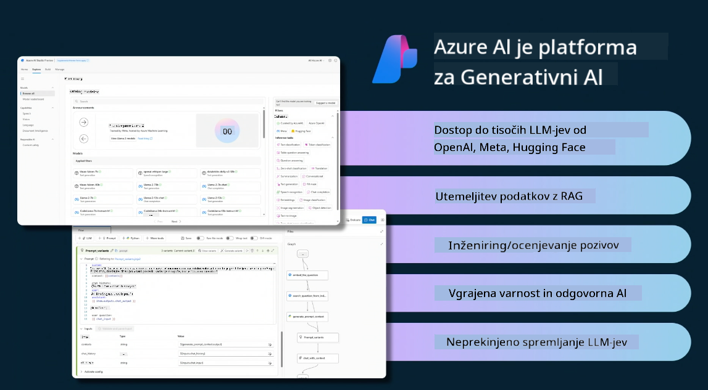

<!--
CO_OP_TRANSLATOR_METADATA:
{
  "original_hash": "df44972d5575ea8cef3c52ee31696d04",
  "translation_date": "2025-12-19T17:29:39+00:00",
  "source_file": "14-the-generative-ai-application-lifecycle/README.md",
  "language_code": "sl"
}
-->

# Življenjski cikel generativne umetne inteligence

Pomembno vprašanje za vse aplikacije umetne inteligence je relevantnost AI funkcij, saj je AI hitro razvijajoče se področje. Da zagotovite, da vaša aplikacija ostane relevantna, zanesljiva in robustna, jo morate nenehno spremljati, ocenjevati in izboljševati. Tu pride v poštev življenjski cikel generativne AI.

Življenjski cikel generativne AI je okvir, ki vas vodi skozi faze razvoja, uvajanja in vzdrževanja generativne AI aplikacije. Pomaga vam opredeliti cilje, meriti uspešnost, prepoznati izzive in uresničiti rešitve. Prav tako vam pomaga uskladiti vašo aplikacijo z etičnimi in pravnimi standardi vašega področja in deležnikov. Sledenje življenjskemu ciklu generativne AI zagotavlja, da vaša aplikacija vedno prinaša vrednost in zadovoljuje uporabnike.

## Uvod

V tem poglavju boste:

- Razumeli premik paradigme od MLOps do LLMOps
- Spoznali življenjski cikel LLM
- Orodja za življenjski cikel
- Merjenje in ocenjevanje življenjskega cikla

## Razumeti premik paradigme od MLOps do LLMOps

LLM so novo orodje v arzenalu umetne inteligence, izjemno močni pri analizah in generiranju za aplikacije, vendar ta moč prinaša posledice pri poenostavljanju AI in klasičnih strojno-učečih se nalog.

Zato potrebujemo novo paradigmo, da to orodje prilagodimo dinamično in z ustreznimi spodbudami. Starejše AI aplikacije lahko kategoriziramo kot "ML aplikacije", novejše pa kot "GenAI aplikacije" ali preprosto "AI aplikacije", kar odraža prevladujočo tehnologijo in tehnike v tistem času. To premakne našo pripoved na več načinov, poglejte naslednjo primerjavo.

Opazite, da se v LLMOps bolj osredotočamo na razvijalce aplikacij, uporabljamo integracije kot ključno točko, uporabljamo "Modeli kot storitev" in razmišljamo o naslednjih metrikah.

- Kakovost: kakovost odgovora
- Škoda: odgovorna AI
- Iskrenost: utemeljenost odgovora (Ali ima smisel? Je pravilen?)
- Stroški: proračun rešitve
- Zakasnitev: povprečni čas za odgovor na token

## Življenjski cikel LLM

Najprej, da razumemo življenjski cikel in spremembe, si oglejmo naslednjo infografiko.

Kot lahko opazite, se to razlikuje od običajnih življenjskih ciklov MLOps. LLM imajo veliko novih zahtev, kot so spodbujanje (Prompting), različne tehnike za izboljšanje kakovosti (Fine-Tuning, RAG, Meta-Prompts), drugačno ocenjevanje in odgovornost z odgovorno AI, nazadnje nove metrike ocenjevanja (Kakovost, Škoda, Iskrenost, Stroški in Zakasnitev).

Na primer, poglejte, kako ustvarjamo ideje. Uporabljamo inženiring pozivov za eksperimentiranje z različnimi LLM, da raziščemo možnosti in preverimo, ali je njihova hipoteza pravilna.

Opazite, da to ni linearno, ampak integrirani zanki, iterativno in z obsežnim ciklom.

Kako bi lahko raziskali te korake? Poglobimo se v podrobnosti, kako lahko zgradimo življenjski cikel.

To se morda zdi nekoliko zapleteno, osredotočimo se najprej na tri velike korake.

1. Ustvarjanje idej/raziskovanje: Raziskovanje, tukaj lahko raziskujemo glede na naše poslovne potrebe. Prototipiranje, ustvarjanje [PromptFlow](https://microsoft.github.io/promptflow/index.html?WT.mc_id=academic-105485-koreyst) in testiranje, ali je dovolj učinkovito za našo hipotezo.
1. Gradnja/razširjanje: Izvedba, zdaj začnemo ocenjevati večje podatkovne nize, izvajati tehnike, kot so Fine-tuning in RAG, da preverimo robustnost naše rešitve. Če ne deluje, lahko ponovna izvedba, dodajanje novih korakov v našem toku ali prestrukturiranje podatkov pomaga. Po testiranju našega toka in obsega, če deluje in preveri naše metrike, je pripravljen za naslednji korak.
1. Operativizacija: Integracija, zdaj dodajamo sisteme za spremljanje in opozarjanje, uvajanje in integracijo aplikacije v našo aplikacijo.

Nato imamo obsežen cikel upravljanja, osredotočen na varnost, skladnost in upravljanje.

Čestitke, zdaj imate svojo AI aplikacijo pripravljeno za uporabo in delovanje. Za praktično izkušnjo si oglejte [Contoso Chat Demo.](https://nitya.github.io/contoso-chat/?WT.mc_id=academic-105485-koreys)

Zdaj, katera orodja lahko uporabimo?

## Orodja za življenjski cikel

Za orodja Microsoft ponuja [Azure AI Platform](https://azure.microsoft.com/solutions/ai/?WT.mc_id=academic-105485-koreys) in [PromptFlow](https://microsoft.github.io/promptflow/index.html?WT.mc_id=academic-105485-koreyst), ki olajšata in omogočata enostavno izvajanje vašega cikla.

[Azure AI Platform](https://azure.microsoft.com/solutions/ai/?WT.mc_id=academic-105485-koreys) vam omogoča uporabo [AI Studio](https://ai.azure.com/?WT.mc_id=academic-105485-koreys). AI Studio je spletni portal, ki vam omogoča raziskovanje modelov, vzorcev in orodij. Upravljanje virov, razvoj uporabniških vmesnikov in možnosti SDK/CLI za razvoj s kodo.

Azure AI vam omogoča uporabo več virov za upravljanje vaših operacij, storitev, projektov, iskanja vektorjev in potreb po bazah podatkov.

Gradite od Proof-of-Concept (POC) do velikih aplikacij s PromptFlow:

- Oblikujte in gradite aplikacije iz VS Code z vizualnimi in funkcionalnimi orodji
- Testirajte in fino nastavite svoje aplikacije za kakovostno AI, enostavno.
- Uporabite Azure AI Studio za integracijo in iteracijo z oblakom, potiskanje in uvajanje za hitro integracijo.

## Odlično! Nadaljujte z učenjem!

Čudovito, zdaj se naučite več o tem, kako strukturiramo aplikacijo za uporabo konceptov z [Contoso Chat App](https://nitya.github.io/contoso-chat/?WT.mc_id=academic-105485-koreyst), da preverite, kako Cloud Advocacy vključuje te koncepte v demonstracijah. Za več vsebin si oglejte našo [Ignite breakout sejo!
](https://www.youtube.com/watch?v=DdOylyrTOWg)

Zdaj pa si oglejte Lekcijo 15, da razumete, kako [Retrieval Augmented Generation in vektorske baze podatkov](../15-rag-and-vector-databases/README.md?WT.mc_id=academic-105485-koreyst) vplivata na generativno AI in kako ustvariti bolj privlačne aplikacije!

---

<!-- CO-OP TRANSLATOR DISCLAIMER START -->
**Omejitev odgovornosti**:
Ta dokument je bil preveden z uporabo storitve za prevajanje z umetno inteligenco [Co-op Translator](https://github.com/Azure/co-op-translator). Čeprav si prizadevamo za natančnost, vas opozarjamo, da avtomatizirani prevodi lahko vsebujejo napake ali netočnosti. Izvirni dokument v njegovem izvirnem jeziku velja za avtoritativni vir. Za ključne informacije priporočamo strokovni človeški prevod. Za morebitna nesporazume ali napačne interpretacije, ki izhajajo iz uporabe tega prevoda, ne odgovarjamo.
<!-- CO-OP TRANSLATOR DISCLAIMER END -->