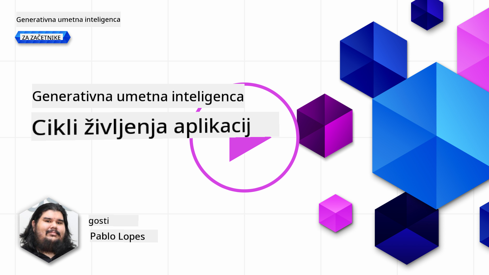
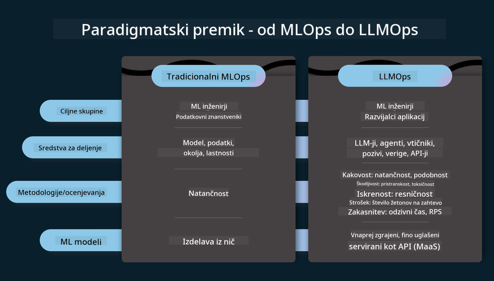
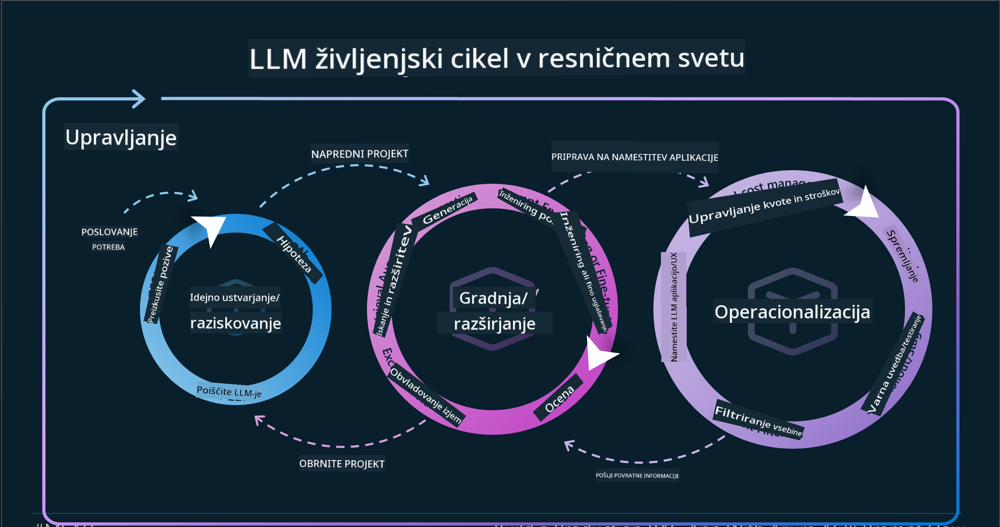
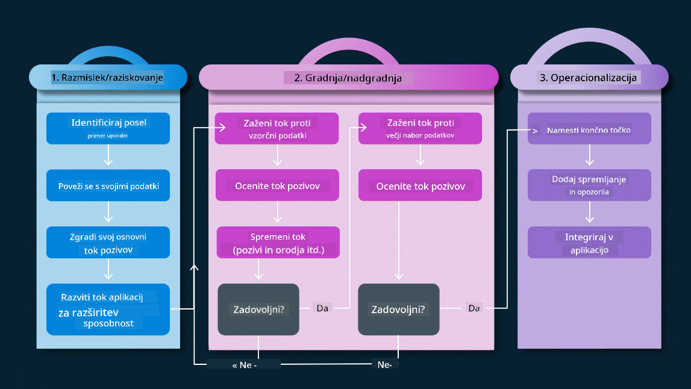
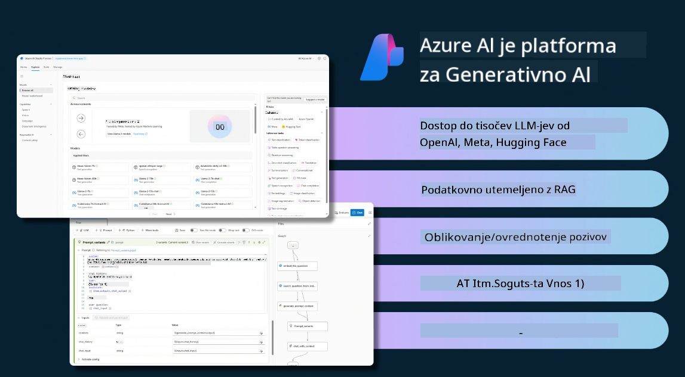
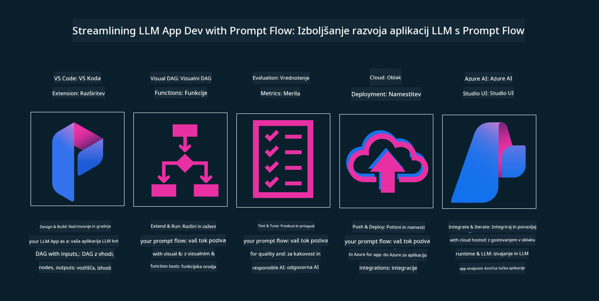

<!--
CO_OP_TRANSLATOR_METADATA:
{
  "original_hash": "27a5347a5022d5ef0a72ab029b03526a",
  "translation_date": "2025-06-25T22:12:33+00:00",
  "source_file": "14-the-generative-ai-application-lifecycle/README.md",
  "language_code": "sl"
}
-->

# Življenjski cikel aplikacij generativne umetne inteligence

Pomembno vprašanje za vse aplikacije umetne inteligence je pomembnost funkcij umetne inteligence, saj je umetna inteligenca hitro razvijajoče se področje. Da bi zagotovili, da vaša aplikacija ostane pomembna, zanesljiva in robustna, jo morate neprestano spremljati, ocenjevati in izboljševati. Tukaj pride v poštev življenjski cikel generativne umetne inteligence.

Življenjski cikel generativne umetne inteligence je okvir, ki vas vodi skozi faze razvoja, uvajanja in vzdrževanja aplikacije generativne umetne inteligence. Pomaga vam določiti vaše cilje, meriti vašo uspešnost, prepoznati vaše izzive in uvesti vaše rešitve. Prav tako vam pomaga uskladiti vašo aplikacijo z etičnimi in pravnimi standardi vašega področja in vaših deležnikov. Z upoštevanjem življenjskega cikla generativne umetne inteligence lahko zagotovite, da vaša aplikacija vedno prinaša vrednost in zadovoljuje vaše uporabnike.

## Uvod

V tem poglavju boste:

- Razumeli premik paradigme iz MLOps v LLMOps
- Življenjski cikel LLM
- Orodja za življenjski cikel
- Merjenje in ocenjevanje življenjskega cikla

## Razumeti premik paradigme iz MLOps v LLMOps

LLM-ji so novo orodje v arzenalu umetne inteligence, izjemno močni pri nalogah analize in generiranja za aplikacije, vendar ima ta moč posledice za to, kako poenostavimo naloge umetne inteligence in klasičnega strojnega učenja.

Zato potrebujemo novo paradigmo, da to orodje prilagodimo dinamično, s pravilnimi spodbudami. Starejše aplikacije umetne inteligence lahko kategoriziramo kot "ML aplikacije", novejše aplikacije umetne inteligence pa kot "GenAI aplikacije" ali preprosto "AI aplikacije", kar odraža mainstream tehnologijo in tehnike, uporabljene v tistem času. To spremeni našo naracijo na več načinov, poglejte naslednjo primerjavo.

Opazite, da se v LLMOps bolj osredotočamo na razvijalce aplikacij, z uporabo integracij kot ključne točke, z uporabo "Modeli-kot-storitev" in razmišljanjem o naslednjih točkah za metrike.

- Kakovost: Kakovost odziva
- Škoda: Odgovorna umetna inteligenca
- Poštenost: Utemeljenost odziva (Ali ima smisel? Ali je pravilno?)
- Stroški: Proračun za rešitev
- Zakasnitev: Povprečen čas za odziv na žetone

## Življenjski cikel LLM

Najprej, da bi razumeli življenjski cikel in spremembe, si oglejmo naslednjo infografiko.

Kot lahko opazite, se to razlikuje od običajnih življenjskih ciklov iz MLOps. LLM-ji imajo veliko novih zahtev, kot so Prompting, različne tehnike za izboljšanje kakovosti (Fine-Tuning, RAG, Meta-Prompts), drugačno ocenjevanje in odgovornost z odgovorno umetno inteligenco, nazadnje pa nove metrike ocenjevanja (Kakovost, Škoda, Poštenost, Stroški in Zakasnitev).

Na primer, poglejte, kako idejamo. Uporabljamo inženiring pozivov za eksperimentiranje z različnimi LLM-ji, da raziščemo možnosti in preverimo, ali bi lahko bila njihova hipoteza pravilna.

Opazite, da to ni linearno, temveč integrirani zanki, iterativni in s splošnim ciklom.

Kako bi lahko raziskali te korake? Poglejmo podrobnosti, kako bi lahko zgradili življenjski cikel.

To se morda zdi nekoliko zapleteno, osredotočimo se najprej na tri velike korake.

1. Idejanje/Raziskovanje: Raziskovanje, tukaj lahko raziskujemo glede na naše poslovne potrebe. Prototipiranje, ustvarjanje [PromptFlow](https://microsoft.github.io/promptflow/index.html?WT.mc_id=academic-105485-koreyst) in preverjanje, ali je dovolj učinkovito za našo hipotezo.
2. Gradnja/Povečevanje: Implementacija, zdaj začnemo ocenjevati za večje nabor podatkov, implementirati tehnike, kot sta Fine-tuning in RAG, da preverimo robustnost naše rešitve. Če ni, lahko ponovno implementiramo, dodamo nove korake v naš tok ali prestrukturiramo podatke. Po testiranju našega toka in naše skale, če deluje in preverimo naše metrike, je pripravljeno za naslednji korak.
3. Operacionalizacija: Integracija, zdaj dodajamo sisteme za spremljanje in opozarjanje v naš sistem, uvajanje in integracijo aplikacij v našo aplikacijo.

Nato imamo splošni cikel upravljanja, ki se osredotoča na varnost, skladnost in upravljanje.

Čestitamo, zdaj imate svojo aplikacijo AI pripravljeno in operativno. Za praktične izkušnje si oglejte [Contoso Chat Demo.](https://nitya.github.io/contoso-chat/?WT.mc_id=academic-105485-koreys)

Zdaj, katere orodja bi lahko uporabili?

## Orodja za življenjski cikel

Za orodja Microsoft ponuja [Azure AI Platform](https://azure.microsoft.com/solutions/ai/?WT.mc_id=academic-105485-koreys) in [PromptFlow](https://microsoft.github.io/promptflow/index.html?WT.mc_id=academic-105485-koreyst), ki olajšata in omogočata, da je vaš cikel enostaven za implementacijo in pripravljen za uporabo.

[Azure AI Platform](https://azure.microsoft.com/solutions/ai/?WT.mc_id=academic-105485-koreys) vam omogoča uporabo [AI Studio](https://ai.azure.com/?WT.mc_id=academic-105485-koreys). AI Studio je spletni portal, ki vam omogoča raziskovanje modelov, vzorcev in orodij. Upravljanje vaših virov, razvojnih tokov UI in možnosti SDK/CLI za razvoj, ki temelji na kodi.

Azure AI vam omogoča uporabo več virov za upravljanje vaših operacij, storitev, projektov, iskanje vektorjev in potreb po bazah podatkov.

Izdelajte, od dokazila o konceptu (POC) do aplikacij velikega obsega s PromptFlow:

- Oblikujte in gradite aplikacije iz VS Code, z vizualnimi in funkcionalnimi orodji
- Preizkusite in prilagodite svoje aplikacije za kakovostno umetno inteligenco, z lahkoto.
- Uporabite Azure AI Studio za integracijo in iteracijo z oblakom, potisnite in uvedite za hitro integracijo.

## Odlično! Nadaljujte z učenjem!

Neverjetno, zdaj se naučite več o tem, kako strukturiramo aplikacijo za uporabo konceptov z [Contoso Chat App](https://nitya.github.io/contoso-chat/?WT.mc_id=academic-105485-koreyst), da preverite, kako Cloud Advocacy dodaja te koncepte v predstavitve. Za več vsebin preverite naš [Ignite breakout session!](https://www.youtube.com/watch?v=DdOylyrTOWg)

Zdaj preverite lekcijo 15, da razumete, kako [Retrieval Augmented Generation in vektorske baze podatkov](../15-rag-and-vector-databases/README.md?WT.mc_id=academic-105485-koreyst) vplivajo na generativno umetno inteligenco in kako narediti bolj privlačne aplikacije!

**Omejitev odgovornosti**:  
Ta dokument je bil preveden s pomočjo AI prevajalske storitve [Co-op Translator](https://github.com/Azure/co-op-translator). Medtem ko si prizadevamo za natančnost, vas prosimo, da se zavedate, da lahko avtomatizirani prevodi vsebujejo napake ali netočnosti. Izvirni dokument v svojem maternem jeziku je treba obravnavati kot avtoritativni vir. Za kritične informacije je priporočljiv strokovni človeški prevod. Ne odgovarjamo za morebitne nesporazume ali napačne interpretacije, ki izhajajo iz uporabe tega prevoda.