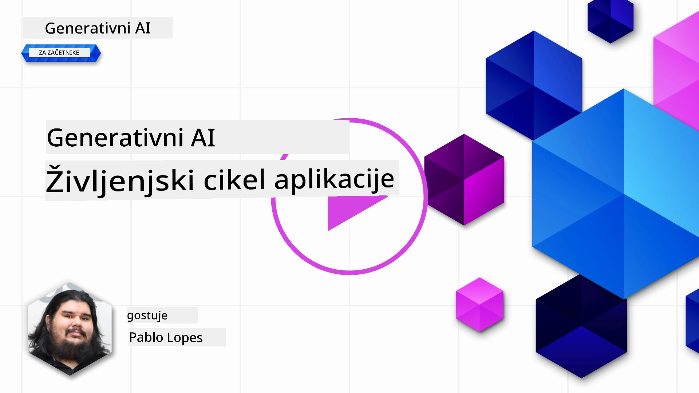
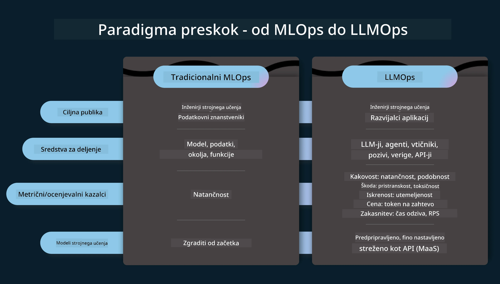
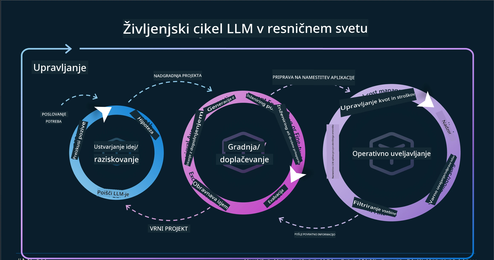
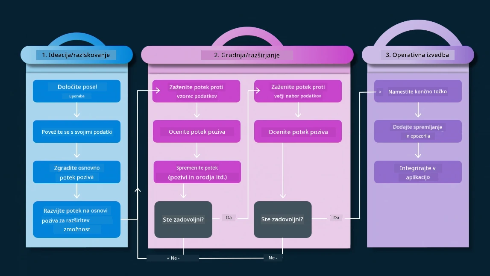
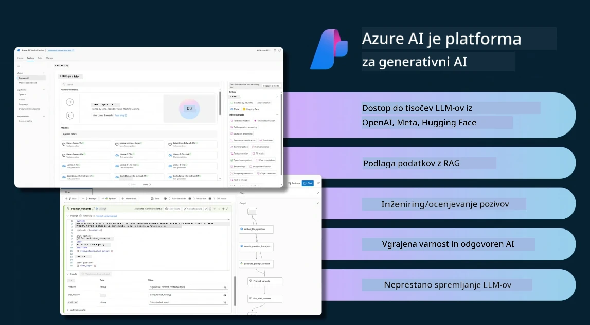
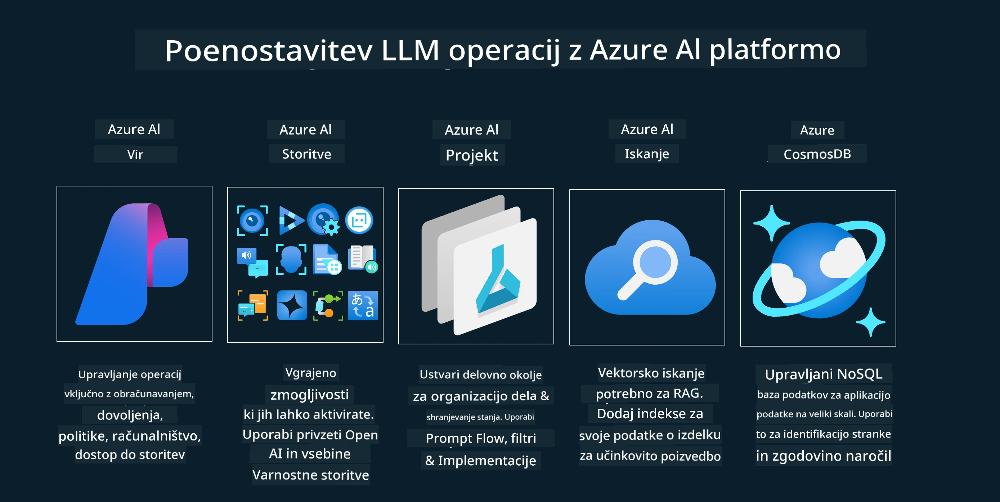
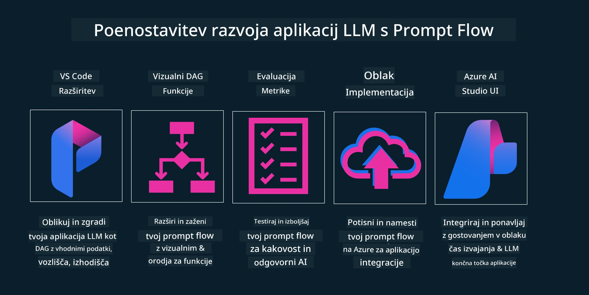

# Življenjski cikel generativnih AI aplikacij

Pomembno vprašanje za vse AI aplikacije je ustreznost AI funkcij, saj je AI hitro razvijajoče se področje, zato je za zagotavljanje, da vaša aplikacija ostane relevantna, zanesljiva in robustna, potrebno njeno stalno spremljanje, ocenjevanje in izboljševanje. Pri tem pomaga življenjski cikel generativnega AI.

Življenjski cikel generativnega AI je okvir, ki vas vodi skozi faze razvoja, uvajanja in vzdrževanja generativne AI aplikacije. Pomaga vam opredeliti cilje, meriti uspešnost, prepoznati izzive in implementirati rešitve. Prav tako pomaga uskladiti vašo aplikacijo z etičnimi in pravnimi standardi vašega področja in deležnikov. Z upoštevanjem življenjskega cikla generativnega AI lahko zagotovite, da vaša aplikacija vedno prinaša vrednost in zadovoljuje uporabnike.

## Uvod

V tem poglavju boste:

- Razumeli prehod paradigme od MLOps do LLMOps
- Spoznali življenjski cikel LLM
- Orodja za življenjski cikel
- Merjenje in ocenjevanje življenjskega cikla

## Razumeti prehod paradigme od MLOps do LLMOps

LLM-ji so novo orodje v arzenalu umetne inteligence, izjemno močni pri analizi in ustvarjanju vsebin za aplikacije, a ta moč prinaša nekatere posledice pri poenostavljanju AI in klasičnih strojnoučnih nalog.

Zato potrebujemo novo paradigmo, da to orodje prilagodimo dinamično in z ustreznimi spodbudami. Starejše AI aplikacije lahko razvrstimo kot "ML aplikacije", novejše pa kot "GenAI aplikacije" ali preprosto "AI aplikacije", kar odraža prevladujočo tehnologijo in tehnike tistega časa. To spremeni našo naracijo na več načinov, poglejte naslednjo primerjavo.

Upoštevajte, da se pri LLMOps bolj osredotočamo na razvijalce aplikacij, uporabljamo integracije kot ključno točko, modeliramo "Modeli kot storitev" in razmišljamo o naslednjih metriki.

- Kakovost: Kakovost odgovora
- Škoda: Odgovorna AI
- Iskrenost: Utemeljenost odgovora (Ali je smiselno? Ali je pravilen?)
- Stroški: Proračun rešitve
- Zakasnitev: Povprečni čas za odgovor na token

## Življenjski cikel LLM

Najprej, da razumemo življenjski cikel in njegove spremembe, si oglejmo naslednjo infografiko.

Kot lahko opazite, se to razlikuje od običajnih življenjskih ciklov MLOps. LLM-ji imajo številne nove zahteve, kot so Prompting, različne tehnike za izboljšanje kakovosti (Fine-Tuning, RAG, Meta-Prompti), drugačno ocenjevanje in odgovornost z vidika odgovorne AI, na koncu pa nove merilne metrike (Kakovost, Škoda, Iskrenost, Stroški in Zakasnitev).

Na primer, poglejte, kako ideiramo. Uporabljamo prompt inženiring za eksperimentiranje z različnimi LLM-ji, da raziščemo možnosti in preverimo, ali je njihova hipoteza lahko pravilna.

Upoštevajte, da to ni linearno, ampak integrirani zanki, iterativno in z vseobsegajočim ciklom.

Kako bi lahko raziskali te korake? Podrobno poglejmo, kako lahko zgradimo življenjski cikel.

Morda izgleda nekoliko zapleteno, osredotočimo se najprej na tri glavne korake.

1. Ideiranje/Raziskovanje: Raziščemo glede na potrebe našega posla. Prototipiranje, ustvarjanje [PromptFlow](https://microsoft.github.io/promptflow/index.html?WT.mc_id=academic-105485-koreyst) in testiranje, ali je dovolj učinkovito za našo hipotezo.
1. Gradnja/Dopolnjevanje: Implementacija, zdaj začnemo ocenjevanje večjih podatkovnih nizov, izvajamo tehnike, kot so Fine-tuning in RAG, za preverjanje robustnosti naše rešitve. Če ne deluje, ponovna implementacija, dodajanje novih korakov v našem toku ali prestrukturiranje podatkov lahko pomaga. Po preizkusu toka in razširitve, če deluje in ustreza metrikam, je pripravljen za naslednji korak.
1. Operativna uvedba: Integracija, sedaj dodajamo sisteme za spremljanje in opozorila, uvajanje in integracijo aplikacije v naš sistem.

Nato imamo vseobsegajoči cikel upravljanja, ki se osredotoča na varnost, skladnost in upravljanje.

Čestitke, zdaj imate svojo AI aplikacijo pripravljeno za uporabo in delovanje. Za praktično izkušnjo si oglejte [Contoso Chat Demo.](https://nitya.github.io/contoso-chat/?WT.mc_id=academic-105485-koreyst)

Zdaj, katera orodja lahko uporabimo?

## Orodja za življenjski cikel

Za orodja Microsoft ponuja [Azure AI Platform](https://azure.microsoft.com/solutions/ai/?WT.mc_id=academic-105485-koreyst) in [PromptFlow](https://microsoft.github.io/promptflow/index.html?WT.mc_id=academic-105485-koreyst), ki olajšata in omogočata enostavno implementacijo vašega cikla.

[xAzure AI Platform](https://azure.microsoft.com/solutions/ai/?WT.mc_id=academic-105485-koreyst) omogoča uporabo [AI Studio](https://ai.azure.com/?WT.mc_id=academic-105485-koreyst). AI Studio je spletni portal, ki omogoča raziskovanje modelov, vzorcev in orodij. Upravljanje virov, UI razvojnih tokov ter SDK/CLI možnosti za razvoj s kode.

Azure AI omogoča uporabo več virov za upravljanje operacij, storitev, projektov, iskanje vektorjev in potreb po bazah podatkov.

Zgradite, od dokazov koncepta do velikih aplikacij s PromptFlow:

- Načrtujte in gradite aplikacije iz VS Code z vizualnimi in funkcionalnimi orodji
- Testirajte in fino prilagodite vaše aplikacije za kakovostno AI, na enostaven način.
- Uporabite Azure AI Studio za integracijo in iteriranje s cloudom, potiskanje in uvajanje za hitro integracijo.

## Odlično! Nadaljujte z učenjem!

Neverjetno, zdaj izvedite več o tem, kako strukturirati aplikacijo za uporabo konceptov z [Contoso Chat App](https://nitya.github.io/contoso-chat/?WT.mc_id=academic-105485-koreyst), da preverite, kako Cloud Advocacy vključuje te koncepte v demonstracije. Za več vsebin si oglejte našo [Ignite predstavitveno sejo!
](https://www.youtube.com/watch?v=DdOylyrTOWg)

Zdaj si oglejte lekcijo 15, da razumete, kako [Retrieval Augmented Generation in Vektorske baze podatkov](../15-rag-and-vector-databases/README.md?WT.mc_id=academic-105485-koreyst) vplivata na generativni AI in pripomoreta k ustvarjanju bolj privlačnih aplikacij!

---

<!-- CO-OP TRANSLATOR DISCLAIMER START -->
**Omejitev odgovornosti**:
Ta dokument je bil preveden z uporabo storitve za prevajanje z umetno inteligenco [Co-op Translator](https://github.com/Azure/co-op-translator). Čeprav si prizadevamo za natančnost, upoštevajte, da avtomatski prevodi lahko vsebujejo napake ali netočnosti. Izvirni dokument v njegovem izvirnem jeziku velja za avtoritativni vir. Za ključne informacije priporočamo strokovni človeški prevod. Ne odgovarjamo za morebitne nesporazume ali napačne interpretacije, ki izhajajo iz uporabe tega prevoda.
<!-- CO-OP TRANSLATOR DISCLAIMER END -->