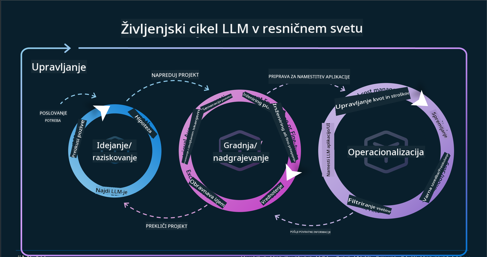
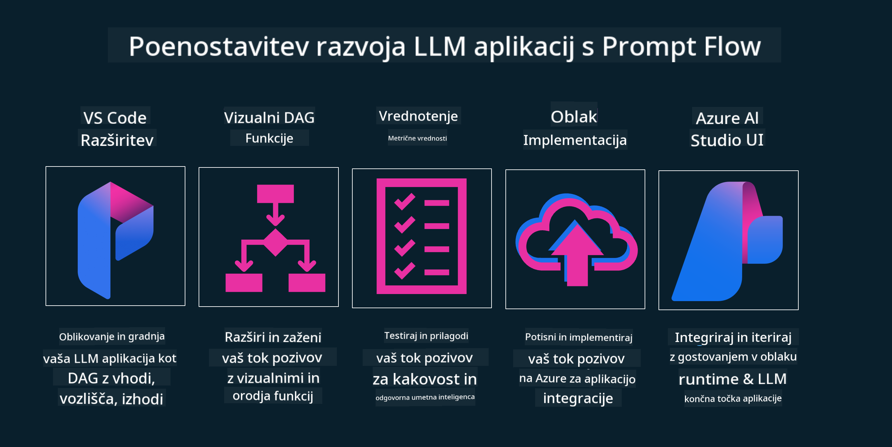

<!--
CO_OP_TRANSLATOR_METADATA:
{
  "original_hash": "b9d32511b27373a1b21b5789d4fda057",
  "translation_date": "2025-10-18T01:44:01+00:00",
  "source_file": "14-the-generative-ai-application-lifecycle/README.md",
  "language_code": "sl"
}
-->

# Življenjski cikel aplikacij generativne umetne inteligence

Pomembno vprašanje za vse aplikacije umetne inteligence je relevantnost funkcij umetne inteligence, saj je to področje hitro razvijajoče. Da bi zagotovili, da vaša aplikacija ostane relevantna, zanesljiva in robustna, jo morate nenehno spremljati, ocenjevati in izboljševati. Tukaj pride v poštev življenjski cikel generativne umetne inteligence.

Življenjski cikel generativne umetne inteligence je okvir, ki vas vodi skozi faze razvoja, uvajanja in vzdrževanja aplikacije generativne umetne inteligence. Pomaga vam opredeliti cilje, meriti uspešnost, prepoznati izzive in uvesti rešitve. Prav tako vam pomaga uskladiti vašo aplikacijo z etičnimi in pravnimi standardi vašega področja ter vaših deležnikov. Z upoštevanjem življenjskega cikla generativne umetne inteligence lahko zagotovite, da vaša aplikacija vedno prinaša vrednost in zadovoljuje vaše uporabnike.

## Uvod

V tem poglavju boste:

- Razumeli premik paradigme od MLOps k LLMOps
- Življenjski cikel LLM
- Orodja za življenjski cikel
- Metrično vrednotenje življenjskega cikla

## Razumevanje premika paradigme od MLOps k LLMOps

LLM-ji so novo orodje v arzenalu umetne inteligence, ki so izjemno zmogljivi pri nalogah analize in generiranja za aplikacije. Vendar pa ima ta moč določene posledice za način, kako optimiziramo naloge umetne inteligence in klasičnega strojnega učenja.

Zato potrebujemo novo paradigmo, da to orodje prilagodimo dinamičnemu okolju s pravimi spodbudami. Starejše aplikacije umetne inteligence lahko kategoriziramo kot "ML aplikacije", novejše pa kot "GenAI aplikacije" ali preprosto "AI aplikacije", kar odraža prevladujočo tehnologijo in tehnike, uporabljene v danem času. To spreminja našo naracijo na več načinov, poglejte naslednjo primerjavo.

Opazite, da se pri LLMOps bolj osredotočamo na razvijalce aplikacij, pri čemer so integracije ključna točka, uporabljamo "model kot storitev" in razmišljamo o naslednjih točkah za metrike:

- Kakovost: Kakovost odgovora
- Škodljivost: Odgovorna umetna inteligenca
- Poštenost: Utemeljenost odgovora (Ali ima smisel? Ali je pravilen?)
- Stroški: Proračun rešitve
- Zakasnitev: Povprečen čas za odgovor na žeton

## Življenjski cikel LLM

Najprej, da razumemo življenjski cikel in njegove spremembe, si oglejmo naslednjo infografiko.

Kot lahko opazite, se to razlikuje od običajnih življenjskih ciklov MLOps. LLM-ji imajo številne nove zahteve, kot so oblikovanje pozivov, različne tehnike za izboljšanje kakovosti (Fine-Tuning, RAG, Meta-Prompts), drugačno ocenjevanje in odgovornost z odgovorno umetno inteligenco ter nove metrike vrednotenja (kakovost, škodljivost, poštenost, stroški in zakasnitev).

Na primer, poglejte, kako oblikujemo ideje. Uporabljamo inženiring pozivov za eksperimentiranje z različnimi LLM-ji, da raziščemo možnosti in preverimo, ali bi lahko bila njihova hipoteza pravilna.

Upoštevajte, da to ni linearen proces, ampak integrirani cikli, iterativni in s celovitim ciklom.

Kako lahko raziščemo te korake? Poglejmo podrobneje, kako lahko zgradimo življenjski cikel.

To se morda zdi nekoliko zapleteno, osredotočimo se na tri glavne korake.

1. Oblikovanje idej/raziskovanje: Raziskovanje, tukaj lahko raziskujemo glede na potrebe našega poslovanja. Prototipiranje, ustvarjanje [PromptFlow](https://microsoft.github.io/promptflow/index.html?WT.mc_id=academic-105485-koreyst) in testiranje, ali je dovolj učinkovito za našo hipotezo.
1. Gradnja/izboljševanje: Implementacija, zdaj začnemo ocenjevati večje nabore podatkov, izvajati tehnike, kot sta Fine-tuning in RAG, da preverimo robustnost naše rešitve. Če ni dovolj robustna, jo ponovno implementiramo, dodamo nove korake v naš tok ali prestrukturiramo podatke. Po testiranju našega toka in obsega, če deluje in preverimo naše metrike, je pripravljena na naslednji korak.
1. Operativna uporaba: Integracija, zdaj dodajamo sisteme za spremljanje in opozarjanje v naš sistem, uvajanje in integracijo aplikacije v našo rešitev.

Nato imamo celovit cikel upravljanja, ki se osredotoča na varnost, skladnost in upravljanje.

Čestitke, zdaj je vaša AI aplikacija pripravljena za uporabo in delovanje. Za praktično izkušnjo si oglejte [Contoso Chat Demo.](https://nitya.github.io/contoso-chat/?WT.mc_id=academic-105485-koreys)

Katera orodja lahko uporabimo?

## Orodja za življenjski cikel

Za orodja Microsoft ponuja [Azure AI Platform](https://azure.microsoft.com/solutions/ai/?WT.mc_id=academic-105485-koreys) in [PromptFlow](https://microsoft.github.io/promptflow/index.html?WT.mc_id=academic-105485-koreyst), ki olajšata in omogočata enostavno implementacijo vašega cikla.

[Azure AI Platform](https://azure.microsoft.com/solutions/ai/?WT.mc_id=academic-105485-koreys) vam omogoča uporabo [AI Studio](https://ai.azure.com/?WT.mc_id=academic-105485-koreys). AI Studio je spletni portal, ki vam omogoča raziskovanje modelov, vzorcev in orodij. Upravljanje vaših virov, razvoj uporabniških vmesnikov in možnosti SDK/CLI za razvoj, ki temelji na kodi.

Azure AI vam omogoča uporabo več virov za upravljanje vaših operacij, storitev, projektov, iskanje vektorjev in potreb po podatkovnih bazah.

Zgradite od koncepta do aplikacij velikega obsega s PromptFlow:

- Oblikujte in gradite aplikacije iz VS Code, z vizualnimi in funkcionalnimi orodji
- Testirajte in prilagodite svoje aplikacije za kakovostno umetno inteligenco, enostavno.
- Uporabite Azure AI Studio za integracijo in iteracijo v oblaku, potisnite in uvedite za hitro integracijo.

## Odlično! Nadaljujte z učenjem!

Odlično, zdaj se naučite več o tem, kako strukturiramo aplikacijo za uporabo konceptov z [Contoso Chat App](https://nitya.github.io/contoso-chat/?WT.mc_id=academic-105485-koreyst), da preverite, kako Cloud Advocacy vključuje te koncepte v demonstracije. Za več vsebine si oglejte naš [Ignite breakout session!
](https://www.youtube.com/watch?v=DdOylyrTOWg)

Zdaj pa si oglejte Lekcijo 15, da razumete, kako [Pridobivanje obogatene generacije in vektorske baze podatkov](../15-rag-and-vector-databases/README.md?WT.mc_id=academic-105485-koreyst) vplivajo na generativno umetno inteligenco in kako ustvariti bolj privlačne aplikacije!

---

**Omejitev odgovornosti**:  
Ta dokument je bil preveden z uporabo storitve za prevajanje AI [Co-op Translator](https://github.com/Azure/co-op-translator). Čeprav si prizadevamo za natančnost, vas prosimo, da upoštevate, da lahko avtomatizirani prevodi vsebujejo napake ali netočnosti. Izvirni dokument v njegovem maternem jeziku naj se šteje za avtoritativni vir. Za ključne informacije priporočamo profesionalni človeški prevod. Ne odgovarjamo za morebitna nesporazumevanja ali napačne razlage, ki izhajajo iz uporabe tega prevoda.