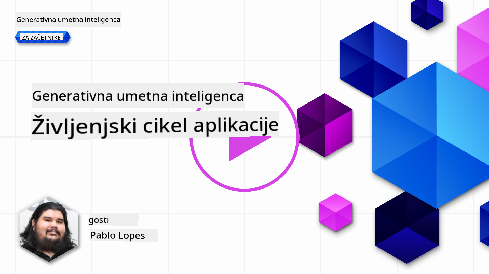

<!--
CO_OP_TRANSLATOR_METADATA:
{
  "original_hash": "27a5347a5022d5ef0a72ab029b03526a",
  "translation_date": "2025-07-09T15:59:53+00:00",
  "source_file": "14-the-generative-ai-application-lifecycle/README.md",
  "language_code": "sl"
}
-->

# Življenjski cikel generativne umetne inteligence

Pomembno vprašanje za vse AI aplikacije je relevantnost AI funkcij, saj je AI hitro razvijajoče se področje. Da zagotovite, da vaša aplikacija ostane relevantna, zanesljiva in robustna, jo morate nenehno spremljati, ocenjevati in izboljševati. Tu pride v poštev življenjski cikel generativne AI.

Življenjski cikel generativne AI je okvir, ki vas vodi skozi faze razvoja, uvajanja in vzdrževanja generativne AI aplikacije. Pomaga vam opredeliti cilje, meriti uspešnost, prepoznati izzive in uresničiti rešitve. Prav tako vam pomaga uskladiti aplikacijo z etičnimi in pravnimi standardi vašega področja in deležnikov. Sledenje življenjskemu ciklu generativne AI zagotavlja, da vaša aplikacija vedno prinaša vrednost in zadovoljuje uporabnike.

## Uvod

V tem poglavju boste:

- Spoznali premik paradigme od MLOps do LLMOps
- Življenjski cikel LLM
- Orodja za življenjski cikel
- Merjenje in ocenjevanje življenjskega cikla

## Spoznajte premik paradigme od MLOps do LLMOps

LLM so novo orodje v arzenalu umetne inteligence, izjemno močni pri analizah in generiranju za aplikacije, vendar ta moč prinaša tudi posledice pri poenostavljanju AI in klasičnih strojno-učečih se nalog.

Zato potrebujemo novo paradigmo, da to orodje dinamično prilagodimo z ustreznimi spodbudami. Starejše AI aplikacije lahko označimo kot "ML Apps", novejše pa kot "GenAI Apps" ali preprosto "AI Apps", kar odraža prevladujočo tehnologijo in tehnike v tistem času. To spremeni naš pogled na več načinov, poglejmo primerjavo.

Opazite, da se pri LLMOps bolj osredotočamo na razvijalce aplikacij, kjer so integracije ključne, uporabljamo "Models-as-a-Service" in razmišljamo o naslednjih metrikah.

- Kakovost: kakovost odgovora
- Škoda: odgovorna AI
- Iskrenost: utemeljenost odgovora (Ali ima smisel? Je pravilen?)
- Stroški: proračun rešitve
- Zakasnitev: povprečni čas za odgovor na token

## Življenjski cikel LLM

Najprej, da razumemo življenjski cikel in spremembe, si oglejmo naslednjo infografiko.

Kot lahko opazite, se to razlikuje od običajnih življenjskih ciklov MLOps. LLM imajo veliko novih zahtev, kot so promptiranje, različne tehnike za izboljšanje kakovosti (fine-tuning, RAG, meta-prompti), drugačno ocenjevanje in odgovornost z vidika odgovorne AI ter nove metrike ocenjevanja (kakovost, škoda, iskrenost, stroški in zakasnitev).

Na primer, poglejmo, kako ustvarjamo ideje. Z inženiringom promptov eksperimentiramo z različnimi LLM, da raziščemo možnosti in preverimo, ali je njihova hipoteza pravilna.

Upoštevajte, da to ni linearno, ampak integrirani zanki, iterativni in z obsežnim ciklom.

Kako lahko raziskujemo te korake? Poglejmo podrobneje, kako lahko zgradimo življenjski cikel.

To se morda zdi nekoliko zapleteno, osredotočimo se najprej na tri glavne korake.

1. Ideacija/raziskovanje: Raziskovanje, tukaj lahko raziskujemo glede na poslovne potrebe. Prototipiranje, ustvarjanje [PromptFlow](https://microsoft.github.io/promptflow/index.html?WT.mc_id=academic-105485-koreyst) in testiranje, ali je dovolj učinkovit za našo hipotezo.
1. Gradnja/izboljševanje: Implementacija, zdaj začnemo ocenjevati večje podatkovne nize, izvajati tehnike, kot so fine-tuning in RAG, da preverimo robustnost rešitve. Če ne deluje, lahko ponovna implementacija, dodajanje novih korakov v tok ali prestrukturiranje podatkov pomaga. Po testiranju toka in obsega, če deluje in so metrike ustrezne, je pripravljen za naslednji korak.
1. Operacionalizacija: Integracija, zdaj dodajamo sisteme za spremljanje in opozarjanje, uvajanje in integracijo aplikacije.

Nato imamo obsežni cikel upravljanja, ki se osredotoča na varnost, skladnost in upravljanje.

Čestitke, vaša AI aplikacija je zdaj pripravljena in delujoča. Za praktično izkušnjo si oglejte [Contoso Chat Demo.](https://nitya.github.io/contoso-chat/?WT.mc_id=academic-105485-koreys)

Kaj pa orodja, ki jih lahko uporabimo?

## Orodja za življenjski cikel

Microsoft za orodja ponuja [Azure AI Platform](https://azure.microsoft.com/solutions/ai/?WT.mc_id=academic-105485-koreys) in [PromptFlow](https://microsoft.github.io/promptflow/index.html?WT.mc_id=academic-105485-koreyst), ki olajšata in poenostavita vaš življenjski cikel.

[Azure AI Platform](https://azure.microsoft.com/solutions/ai/?WT.mc_id=academic-105485-koreys) vam omogoča uporabo [AI Studio](https://ai.azure.com/?WT.mc_id=academic-105485-koreys). AI Studio je spletni portal, ki omogoča raziskovanje modelov, vzorcev in orodij. Upravljanje virov, razvoj uporabniških vmesnikov in možnosti SDK/CLI za razvoj s kodo.

Azure AI omogoča uporabo različnih virov za upravljanje operacij, storitev, projektov, iskanje po vektorjih in potrebe po bazah podatkov.

Zgradite od Proof-of-Concept (POC) do velikih aplikacij s PromptFlow:

- Oblikujte in gradite aplikacije iz VS Code z vizualnimi in funkcionalnimi orodji
- Testirajte in fino nastavljajte aplikacije za kakovostno AI, enostavno
- Uporabite Azure AI Studio za integracijo in iteracijo v oblaku, potiskanje in uvajanje za hitro integracijo

## Odlično! Nadaljujte z učenjem!

Odlično, zdaj se naučite več o tem, kako strukturiramo aplikacijo za uporabo teh konceptov z [Contoso Chat App](https://nitya.github.io/contoso-chat/?WT.mc_id=academic-105485-koreyst), da vidite, kako Cloud Advocacy vključuje te koncepte v demonstracije. Za več vsebin si oglejte našo [Ignite breakout sejo!](https://www.youtube.com/watch?v=DdOylyrTOWg)

Sedaj pa si oglejte Lekcijo 15, da razumete, kako [Retrieval Augmented Generation in vektorske baze podatkov](../15-rag-and-vector-databases/README.md?WT.mc_id=academic-105485-koreyst) vplivata na generativno AI in kako ustvariti bolj privlačne aplikacije!

**Omejitev odgovornosti**:  
Ta dokument je bil preveden z uporabo AI prevajalske storitve [Co-op Translator](https://github.com/Azure/co-op-translator). Čeprav si prizadevamo za natančnost, vas opozarjamo, da avtomatizirani prevodi lahko vsebujejo napake ali netočnosti. Izvirni dokument v njegovem izvirnem jeziku velja za avtoritativni vir. Za ključne informacije priporočamo strokovni človeški prevod. Za morebitna nesporazume ali napačne interpretacije, ki izhajajo iz uporabe tega prevoda, ne odgovarjamo.