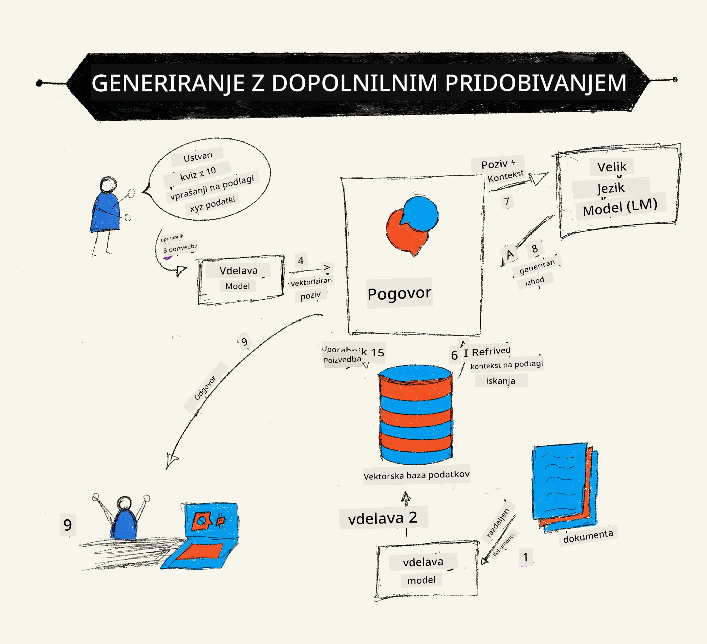
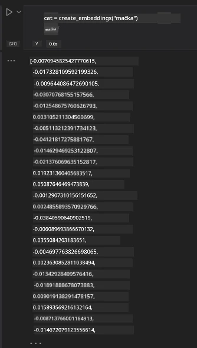

# Retrieval Augmented Generation (RAG) in vektorske baze podatkov

[](https://youtu.be/4l8zhHUBeyI?si=BmvDmL1fnHtgQYkL)

V lekciji o iskalnih aplikacijah smo na kratko spoznali, kako integrirati lastne podatke v velike jezikovne modele (LLM). V tej lekciji se bomo poglobili v koncepte utemeljitve vaših podatkov v aplikaciji LLM, mehaniko procesa in metode za shranjevanje podatkov, vključno z vključenimi predstavitvami (embeddings) in besedilom.

> **Video prihaja kmalu**

## Uvod

V tej lekciji bomo obravnavali naslednje:

- Uvod v RAG, kaj je in zakaj se uporablja v umetni inteligenci (AI).

- Razumevanje, kaj so vektorske baze podatkov in kako ustvariti eno za našo aplikacijo.

- Praktičen primer, kako integrirati RAG v aplikacijo.

## Cilji učenja

Po zaključku te lekcije boste znali:

- Razložiti pomen RAG pri iskanju in obdelavi podatkov.

- Nastaviti RAG aplikacijo in utemeljiti vaše podatke v LLM.

- Učinkovito integrirati RAG in vektorske baze podatkov v aplikacije LLM.

## Naš scenarij: izboljšanje naših LLM z lastnimi podatki

Za to lekcijo želimo dodati naše lastne zapiske v izobraževalni startup, kar omogoča klepetalnemu robotu, da pridobi več informacij o različnih predmetih. Uporabniki bodo lahko z uporabo teh zapiskov bolje študirali in razumeli različne teme, kar bo olajšalo pripravo na izpite. Za ustvarjanje našega scenarija bomo uporabili:

- `Azure OpenAI:` LLM, ki ga bomo uporabili za ustvarjanje klepetalnega bota

- `Lekcija AI za začetnike o nevronskih mrežah:` to bodo podatki, na katerih bomo utemeljili naš LLM

- `Azure AI Search` in `Azure Cosmos DB:` vektorska baza podatkov za shranjevanje naših podatkov in ustvarjanje iskalnega indeksa

Uporabniki bodo lahko ustvarjali vajinske kvize iz svojih zapiskov, kartice za ponavljanje in jih povzeli v jedrnate preglede. Za začetek si poglejmo, kaj je RAG in kako deluje:

## Retrieval Augmented Generation (RAG)

Klepetalni bot, ki ga poganja LLM, obdeluje uporabniške pozive za generiranje odgovorov. Namenjen je interakciji in sodelovanju z uporabniki na različnih temah. Vendar so njegovi odgovori omejeni na kontekst, ki je podan, in na temeljne podatke za usposabljanje. Na primer, znanje GPT-4 je omejeno do septembra 2021, kar pomeni, da ne pozna dogodkov po tem obdobju. Poleg tega podatki, uporabljeni za usposabljanje LLM, ne vključujejo zaupnih informacij, kot so osebni zapiski ali priročniki izdelkov podjetja.

### Kako delujejo RAG (Retrieval Augmented Generation)



Recimo, da želite postaviti klepetalnega bota, ki ustvarja kvize iz vaših zapiskov; potrebovali boste povezavo z bazo znanja. Prav tu nastopi RAG. RAG deluje tako:

- **Baza znanja:** Pred pridobivanjem morajo biti ti dokumenti uvoženi in predhodno obdelani, običajno z razdelitvijo velikih dokumentov na manjše koščke, pretvorbo v besedilne vključevalne predstavitve (text embeddings) in shranjevanjem v bazo podatkov.

- **Uporabniški poizvedba:** uporabnik postavi vprašanje

- **Pridobivanje:** ko uporabnik postavi vprašanje, model vključevalne predstavitve poišče ustrezne informacije iz naše baze znanja, da zagotovi več konteksta, ki se bo vključil v poziv.

- **Obogatena generacija:** LLM izboljša svoj odgovor na podlagi pridobljenih podatkov. To omogoča generiranje odgovora, ki ni le na podlagi vnaprej usposobljenih podatkov, ampak tudi ustreznih informacij iz dodanega konteksta. Pridobljeni podatki se uporabijo za obogatitev odgovorov LLM. LLM nato odgovori na vprašanje uporabnika.


Arhitektura RAG je implementirana z uporabo transformatorjev, ki imajo dva dela: encoder in decoder. Na primer, ko uporabnik postavi vprašanje, je vhodno besedilo 'zakodirano' v vektorje, ki zajemajo pomen besed, nato pa so ti vektorji 'dekodirani' v naš indeks dokumentov in generirajo nov tekst glede na uporabnikovo poizvedbo. LLM uporablja model encoder-decoder za generiranje izhoda.

Dve pristopi pri implementaciji RAG po predlaganem članku: [Retrieval-Augmented Generation for Knowledge intensive NLP (natural language processing software) Tasks](https://arxiv.org/pdf/2005.11401.pdf?WT.mc_id=academic-105485-koreyst) sta:

- **_RAG-Sequence_** — uporaba pridobljenih dokumentov za napoved najbolj možnega odgovora na uporabnikovo vprašanje

- **RAG-Token** — uporaba dokumentov za generiranje naslednjega tokena, nato pa jih ponovno pridobi za odgovor na vprašanje uporabnika

### Zakaj uporabiti RAG? 

- **Bogastvo informacij:** zagotavlja, da so besedilni odgovori ažurni in aktualni. S tem izboljšuje delovanje na specifičnih področjih z dostopom do notranje baze znanja.

- Zmanjšuje izmišljevanje z uporabo **preverljivih podatkov** v bazi znanja za kontekst uporabniških poizvedb.

- Je **stroškovno učinkovito**, saj je bolj ekonomično v primerjavi z dodatnim usposabljanjem (fine-tuning) LLM.

## Ustvarjanje baze znanja

Naša aplikacija temelji na naših osebnih podatkih, tj. lekciji o nevronskih mrežah v kurikulumu AI za začetnike.

### Vektorske baze podatkov

Vektorska baza podatkov, v nasprotju s tradicionalnimi bazami, je specializirana baza, zasnovana za shranjevanje, upravljanje in iskanje v vključenih vektorjih. Shranjuje numerične predstavitve dokumentov. Razbijanje podatkov v numerične vključevalne predstavitve omogoča našem AI sistemu lažje razumevanje in obdelavo podatkov.

Naše vključevalne predstavitve hranimo v vektorskih bazah, ker imajo LLM omejitev glede števila tokenov, ki jih sprejmejo kot vhod. Ker ne morete posredovati celotnih vključevalnih predstavitev LLM, jih bomo razdelili na koščke, ko pa uporabnik postavi vprašanje, se vrnejo vključevalne predstavitve, ki so najbolj podobne vprašanju, skupaj s pozivom. Razbijanje na koščke tudi znižuje stroške glede števila tokenov, ki gredo skozi LLM.

Nekatere priljubljene vektorske baze vključujejo Azure Cosmos DB, Clarifyai, Pinecone, Chromadb, ScaNN, Qdrant in DeepLake. Model Azure Cosmos DB lahko ustvarite z Azure CLI z naslednjim ukazom:

```bash
az login
az group create -n <resource-group-name> -l <location>
az cosmosdb create -n <cosmos-db-name> -r <resource-group-name>
az cosmosdb list-keys -n <cosmos-db-name> -g <resource-group-name>
```

### Iz besedila v vključevalne predstavitve

Preden shranimo podatke, jih moramo pretvoriti v vektorske vključevalne predstavitve, preden jih shranimo v bazo. Če delate z velikimi dokumenti ali dolgimi besedili, jih lahko razdelite glede na pričakovane poizvedbe. Razbijanje lahko izvedete na ravni stavkov ali odstavkov. Ker razbijanje izhaja iz pomena besed okoli njega, lahko dodate tudi drug kontekst h koščku, na primer, dodajanje naslova dokumenta ali vključitev nekaj besedila pred ali za koščkom. Podatke lahko razdelite takole:

```python
def split_text(text, max_length, min_length):
    words = text.split()
    chunks = []
    current_chunk = []

    for word in words:
        current_chunk.append(word)
        if len(' '.join(current_chunk)) < max_length and len(' '.join(current_chunk)) > min_length:
            chunks.append(' '.join(current_chunk))
            current_chunk = []

    # Če zadnji delček ni dosegel najmanjše dolžine, ga vseeno dodajte
    if current_chunk:
        chunks.append(' '.join(current_chunk))

    return chunks
```

Ko razbijemo, lahko nato vstavimo naše besedilo z različnimi modeli za vključevalne predstavitve. Nekateri modeli, ki jih lahko uporabite, so: word2vec, ada-002 od OpenAI, Azure Computer Vision in še mnogi drugi. Izbira modela je odvisna od jezikov, ki jih uporabljate, tipa vsebine (besedilo/slike/zvok), velikosti vhoda, ki ga lahko kodira, in dolžine izhoda vključevalne predstavitve.

Primer vključenega besedila z modelom `text-embedding-ada-002` OpenAI je:


## Pridobivanje in vektorsko iskanje

Ko uporabnik postavi vprašanje, ga iskalnik pretvori v vektor z uporabo kodirnika poizvedbe, nato išče skozi naš indeks dokumentov ustrezne vektorje v dokumentu, povezane z vhodom. Ko konča, pretvori tako vhodni vektor kot vektorje dokumentov nazaj v tekst in jih posreduje LLM.

### Pridobivanje

Pridobivanje se zgodi, ko sistem hitro najde dokumente iz indeksa, ki ustrezajo iskalnim kriterijem. Cilj iskalnika je pridobiti dokumente, ki bodo služili kot kontekst in utemeljili LLM na vaših podatkih.

Obstajajo različni načini za iskanje v naši bazi, na primer:

- **Iskanje po ključnih besedah** – za tekstovno iskanje

- **Vektorsko iskanje** – pretvori dokumente iz besedila v vektorske predstavitve z modeli za vključevalne predstavitve, kar omogoča **semantično iskanje** s pomenom besed. Pridobivanje poteka z iskanjem dokumentov, katerih vektorske predstavitve so najbližje uporabnikovemu vprašanju.

- **Hibridno** – kombinacija iskanja po ključnih besedah in vektorskega iskanja.

Težava pri pridobivanju nastane, ko v bazi ni podobnega odgovora na poizvedbo; sistem potem vrne najboljše informacije, ki jih ima. Vendar lahko uporabite taktike, npr. nastavitev maksimalne razdalje za relevantnost ali hibridno iskanje, ki združuje ključne besede in vektorsko iskanje. V tej lekciji bomo uporabili hibridno iskanje, kombinacijo vektorskega in iskanja po ključnih besedah. Shranili bomo podatke v podatkovni okvir s stolpci, ki vsebujejo tako koščke kot vključevalne predstavitve.

### Vektorska podobnost

Iskalnik bo iskal v bazi znanja za vključevalne predstavitve, ki so si blizu, najbližji sosed, saj so to podobni teksti. V primeru, da uporabnik postavi poizvedbo, jo najprej vključi, nato pa jo primerja s podobnimi vključevalnimi predstavitvami. Pogosta mera, ki se uporablja za ugotavljanje podobnosti med vektorji, je kosinusna podobnost, ki temelji na kotu med dvema vektorjema.

Podobnost lahko merimo tudi z drugimi možnostmi, kot so evklidska razdalja, ki predstavlja najkrajšo pot med končnima točkama dveh vektorjev, ali skalarni produkt, ki meri vsoto produktov pripadajočih elementov dveh vektorjev.

### Iskalni indeks

Pri pridobivanju bomo morali najprej zgraditi iskalni indeks za našo bazo znanja, preden izvedemo iskanje. Indeks bo shranjeval naše vključevalne predstavitve in lahko hitro pridobil najbolj podobne koščke, tudi v veliki bazi. Indeks lahko ustvarimo lokalno z uporabo:

```python
from sklearn.neighbors import NearestNeighbors

embeddings = flattened_df['embeddings'].to_list()

# Ustvari iskalni indeks
nbrs = NearestNeighbors(n_neighbors=5, algorithm='ball_tree').fit(embeddings)

# Za poizvedbo indeksa lahko uporabite metodo kneighbors
distances, indices = nbrs.kneighbors(embeddings)
```

### Ponovno razvrščanje

Ko ste poizvedovali bazo, boste morda želeli rezultate urediti po relevantnosti. Ponovno razvrščanje (reranking) z LLM uporablja strojno učenje za izboljšanje relevantnosti iskalnih rezultatov z njihovim urejanjem od najbolj relevantnih. Z uporabo Azure AI Search se reranking izvaja avtomatično s pomočjo semantičnega prerazvrščevalnika. Primer delovanja rerankinga z uporabo najbližjih sosedov:

```python
# Najdi najbolj podobne dokumente
distances, indices = nbrs.kneighbors([query_vector])

index = []
# Izpiši najbolj podobne dokumente
for i in range(3):
    index = indices[0][i]
    for index in indices[0]:
        print(flattened_df['chunks'].iloc[index])
        print(flattened_df['path'].iloc[index])
        print(flattened_df['distances'].iloc[index])
    else:
        print(f"Index {index} not found in DataFrame")
```

## Vse skupaj združimo

Zadnji korak je dodati naš LLM v zmes, da lahko dobimo odgovore, ki so utemeljeni na naših podatkih. To lahko implementiramo takole:

```python
user_input = "what is a perceptron?"

def chatbot(user_input):
    # Pretvori vprašanje v vektor poizvedbe
    query_vector = create_embeddings(user_input)

    # Najdi najbolj podobne dokumente
    distances, indices = nbrs.kneighbors([query_vector])

    # dodaj dokumente k poizvedbi, da zagotoviš kontekst
    history = []
    for index in indices[0]:
        history.append(flattened_df['chunks'].iloc[index])

    # združi zgodovino in uporabnikov vnos
    history.append(user_input)

    # ustvari objekt sporočila
    messages=[
        {"role": "system", "content": "You are an AI assistant that helps with AI questions."},
        {"role": "user", "content": "\n\n".join(history) }
    ]

    # uporabi dokončanje klepeta za generiranje odgovora
    response = openai.chat.completions.create(
        model="gpt-4",
        temperature=0.7,
        max_tokens=800,
        messages=messages
    )

    return response.choices[0].message

chatbot(user_input)
```

## Vrednotenje naše aplikacije

### Evalvacijske metrike

- Kakovost danih odgovorov, ki zagotavlja, da zvenijo naravno, tekoče in človeško

- Utemeljenost podatkov: ocena, ali je odgovor prišel iz priskrbljenih dokumentov

- Relevantnost: ocena, ali odgovor ustreza in je povezan z zastavljenim vprašanjem

- Tekočnost – ali je odgovor slovnično smiseln

## Primeri uporabe RAG in vektorskih baz podatkov

Obstaja veliko primerov uporabe, kjer lahko klici funkcij izboljšajo vašo aplikacijo, kot so:

- Vprašanja in odgovori: utemeljitev podatkov vašega podjetja v klepetalnik, ki ga zaposleni lahko uporabljajo za zastavljanje vprašanj.

- Priporočilni sistemi: kjer lahko ustvarite sistem, ki najde najbolj podobne vrednosti, npr. filme, restavracije in še več.

- Storitve klepetalnikov: lahko shranjujete zgodovino pogovorov in prilagajate pogovor glede na uporabniške podatke.

- Iskanje slik na podlagi vektorskih vključevalnih predstavitev, uporabno pri prepoznavanju slik in odkrivanju anomalij.

## Povzetek

Pokril smo osnovna področja RAG, od dodajanja podatkov v aplikacijo, uporabniške poizvedbe do izhoda. Za poenostavitev ustvarjanja RAG lahko uporabite ogrodja, kot so Semanti Kernel, Langchain ali Autogen.

## Naloga

Za nadaljevanje učenja Retrieval Augmented Generation (RAG) lahko:

- ustvarite uporabniški vmesnik za aplikacijo z ogrodjem po vaši izbiri

- uporabite ogrodje, bodisi LangChain ali Semantic Kernel, in ponovno ustvarite vašo aplikacijo.

Čestitke za dokončanje lekcije 👏.

## Učenje se tukaj ne ustavi, nadaljujte pot

Po zaključku te lekcije si oglejte našo [kolekcijo za učenje generativne AI](https://aka.ms/genai-collection?WT.mc_id=academic-105485-koreyst), da še naprej nadgrajujete svoje znanje o generativni umetni inteligenci!

---

<!-- CO-OP TRANSLATOR DISCLAIMER START -->
**Opozorilo**:
Ta dokument je bil preveden z uporabo storitve za avtomatski prevod AI [Co-op Translator](https://github.com/Azure/co-op-translator). Čeprav si prizadevamo za natančnost, upoštevajte, da lahko avtomatizirani prevodi vsebujejo napake ali netočnosti. Izvirni dokument v njegovem izvorni jeziku velja za avtoritativni vir. Za ključne informacije priporočamo strokovni človeški prevod. Ne odgovarjamo za morebitna nesporazume ali napačne interpretacije, ki izhajajo iz uporabe tega prevoda.
<!-- CO-OP TRANSLATOR DISCLAIMER END -->