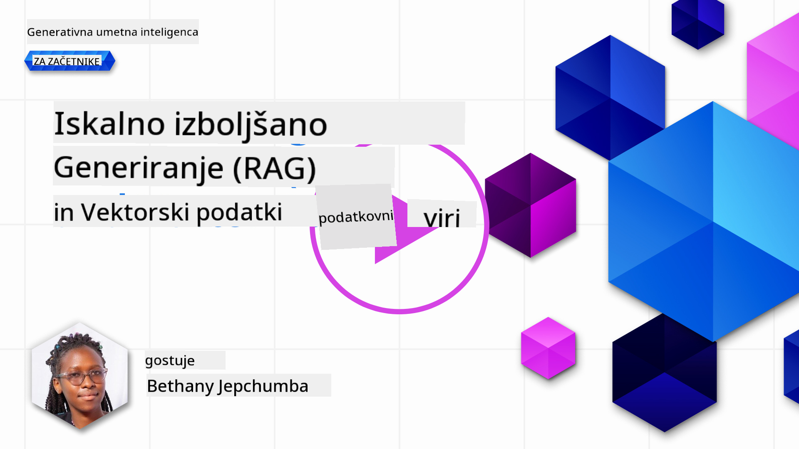
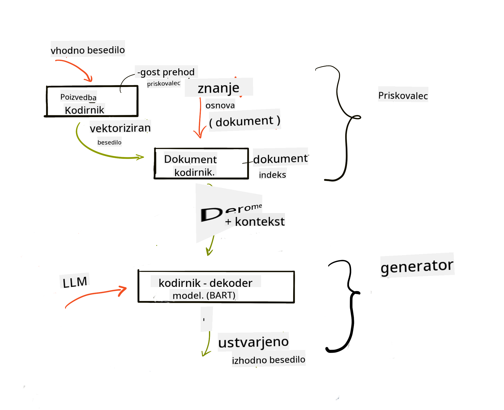
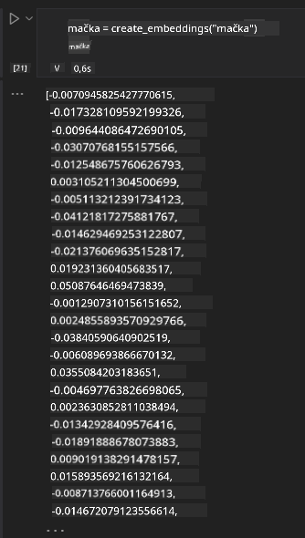

<!--
CO_OP_TRANSLATOR_METADATA:
{
  "original_hash": "e2861bbca91c0567ef32bc77fe054f9e",
  "translation_date": "2025-07-09T16:22:01+00:00",
  "source_file": "15-rag-and-vector-databases/README.md",
  "language_code": "sl"
}
-->
# Retrieval Augmented Generation (RAG) in vektorske baze podatkov

[](https://aka.ms/gen-ai-lesson15-gh?WT.mc_id=academic-105485-koreyst)

V lekciji o iskalnih aplikacijah smo na kratko spoznali, kako vključiti lastne podatke v velike jezikovne modele (LLM). V tej lekciji bomo podrobneje raziskali koncept povezovanja vaših podatkov v aplikaciji LLM, mehaniko procesa in metode shranjevanja podatkov, vključno z vektorskimi predstavitvami in besedilom.

> **Video kmalu na voljo**

## Uvod

V tej lekciji bomo obravnavali naslednje:

- Uvod v RAG, kaj je in zakaj se uporablja v umetni inteligenci (AI).

- Razumevanje, kaj so vektorske baze podatkov in kako ustvariti eno za našo aplikacijo.

- Praktičen primer, kako integrirati RAG v aplikacijo.

## Cilji učenja

Po zaključku te lekcije boste znali:

- Pojasniti pomen RAG pri iskanju in obdelavi podatkov.

- Nastaviti RAG aplikacijo in povezati svoje podatke z LLM.

- Učinkovito integrirati RAG in vektorske baze podatkov v LLM aplikacije.

## Naš primer: izboljšanje LLM z lastnimi podatki

Za to lekcijo želimo dodati lastne zapiske v izobraževalni startup, ki omogoča chatbotu, da pridobi več informacij o različnih predmetih. Z uporabo zapiskov bodo učenci lahko bolje študirali in razumeli različne teme, kar jim bo olajšalo pripravo na izpite. Za naš primer bomo uporabili:

- `Azure OpenAI:` LLM, ki ga bomo uporabili za izdelavo chatbota

- `Lekcija AI za začetnike o nevronskih mrežah:` to bo podlaga, na kateri bomo povezali naš LLM

- `Azure AI Search` in `Azure Cosmos DB:` vektorska baza podatkov za shranjevanje podatkov in ustvarjanje iskalnega indeksa

Uporabniki bodo lahko ustvarjali vaje iz svojih zapiskov, kartice za ponavljanje in povzetke. Za začetek si poglejmo, kaj je RAG in kako deluje:

## Retrieval Augmented Generation (RAG)

Chatbot, ki ga poganja LLM, obdeluje uporabniške zahteve in ustvarja odgovore. Namenjen je interakciji in pogovoru z uporabniki o različnih temah. Vendar so njegovi odgovori omejeni na kontekst, ki mu je na voljo, in na osnovne podatke, na katerih je bil usposobljen. Na primer, GPT-4 ima znanje do septembra 2021, kar pomeni, da ne pozna dogodkov po tem datumu. Poleg tega podatki, uporabljeni za usposabljanje LLM, ne vključujejo zaupnih informacij, kot so osebni zapiski ali priročniki podjetij.

### Kako delujejo RAG (Retrieval Augmented Generation)


Recimo, da želite postaviti chatbota, ki ustvarja kvize iz vaših zapiskov; potrebovali boste povezavo z bazo znanja. Tu pride RAG na pomoč. RAG deluje tako:

- **Baza znanja:** Pred iskanjem je treba dokumente vnesti in predobdelati, običajno tako, da velike dokumente razdelimo na manjše dele, jih pretvorimo v vektorske predstavitve in shranimo v bazo podatkov.

- **Uporabniški poizvedba:** uporabnik postavi vprašanje

- **Iskanje:** Ko uporabnik postavi vprašanje, model vektorskih predstavitev poišče relevantne informacije v naši bazi znanja, da zagotovi več konteksta, ki se vključi v poziv.

- **Povečana generacija:** LLM izboljša svoj odgovor na podlagi pridobljenih podatkov. Tako odgovor ni le na podlagi predhodno usposobljenih podatkov, ampak tudi relevantnih informacij iz dodanega konteksta. Pridobljeni podatki se uporabijo za izboljšanje odgovorov LLM. Nato LLM vrne odgovor na uporabnikovo vprašanje.



Arhitektura RAG temelji na transformatorjih, ki jih sestavljata dve komponenti: enkoder in dekoder. Na primer, ko uporabnik postavi vprašanje, se vhodno besedilo 'zakodira' v vektorje, ki zajamejo pomen besed, ti vektorji pa se 'dekodirajo' v naš indeks dokumentov in ustvarijo nov tekst na podlagi uporabnikove poizvedbe. LLM uporablja model enkoder-dekoder za generiranje izhoda.

Dva pristopa pri implementaciji RAG, kot je opisano v predlaganem članku: [Retrieval-Augmented Generation for Knowledge intensive NLP Tasks](https://arxiv.org/pdf/2005.11401.pdf?WT.mc_id=academic-105485-koreyst) sta:

- **_RAG-Sequence_** uporablja pridobljene dokumente za napoved najbolj možnega odgovora na uporabnikovo vprašanje

- **RAG-Token** uporablja dokumente za generiranje naslednjega tokena, nato jih pridobi za odgovor na vprašanje uporabnika

### Zakaj uporabljati RAG?

- **Bogastvo informacij:** zagotavlja, da so besedilni odgovori ažurni in aktualni. S tem izboljša delovanje pri nalogah, specifičnih za določeno področje, z dostopom do notranje baze znanja.

- Zmanjšuje izmišljanje z uporabo **preverljivih podatkov** v bazi znanja, ki zagotavljajo kontekst za uporabnikove poizvedbe.

- Je **stroškovno učinkovito**, saj je cenejše kot dodatno usposabljanje LLM.

## Ustvarjanje baze znanja

Naša aplikacija temelji na osebnih podatkih, tj. lekciji o nevronskih mrežah iz kurikuluma AI za začetnike.

### Vektorske baze podatkov

Vektorska baza podatkov je specializirana baza, namenjena shranjevanju, upravljanju in iskanju vektorskih predstavitev. Shranjuje numerične predstavitve dokumentov. Razbijanje podatkov na numerične vektorske predstavitve omogoča našemu AI sistemu lažje razumevanje in obdelavo podatkov.

Naše vektorske predstavitve shranjujemo v vektorskih bazah, saj imajo LLM omejitev števila tokenov, ki jih lahko sprejmejo kot vhod. Ker celotnih predstavitev ne moremo poslati v LLM, jih moramo razdeliti na manjše dele, ki se ob uporabnikovi poizvedbi vrnejo skupaj s pozivom. Razdeljevanje na dele tudi znižuje stroške glede števila tokenov, ki jih LLM obdela.

Nekatere priljubljene vektorske baze so Azure Cosmos DB, Clarifyai, Pinecone, Chromadb, ScaNN, Qdrant in DeepLake. Model Azure Cosmos DB lahko ustvarite z ukazom Azure CLI:

```bash
az login
az group create -n <resource-group-name> -l <location>
az cosmosdb create -n <cosmos-db-name> -r <resource-group-name>
az cosmosdb list-keys -n <cosmos-db-name> -g <resource-group-name>
```

### Iz besedila v vektorske predstavitve

Preden shranimo podatke, jih moramo pretvoriti v vektorske predstavitve. Če delate z velikimi dokumenti ali dolgimi besedili, jih lahko razdelite glede na pričakovane poizvedbe. Razdeljevanje lahko poteka na ravni stavkov ali odstavkov. Ker razdeljevanje zajema pomen okoliških besed, lahko dodate tudi dodatni kontekst, na primer naslov dokumenta ali nekaj besedila pred ali za delom. Podatke lahko razdelite tako:

```python
def split_text(text, max_length, min_length):
    words = text.split()
    chunks = []
    current_chunk = []

    for word in words:
        current_chunk.append(word)
        if len(' '.join(current_chunk)) < max_length and len(' '.join(current_chunk)) > min_length:
            chunks.append(' '.join(current_chunk))
            current_chunk = []

    # If the last chunk didn't reach the minimum length, add it anyway
    if current_chunk:
        chunks.append(' '.join(current_chunk))

    return chunks
```

Ko so podatki razdeljeni, jih lahko vektoriziramo z različnimi modeli. Nekateri modeli so word2vec, ada-002 od OpenAI, Azure Computer Vision in še več. Izbira modela je odvisna od uporabljenih jezikov, vrste vsebine (besedilo/slike/zvok), velikosti vhoda in dolžine izhoda vektorske predstavitve.

Primer vektorske predstavitve besede "cat" z modelom OpenAI `text-embedding-ada-002` je:


## Iskanje in vektorsko iskanje

Ko uporabnik postavi vprašanje, ga iskalnik pretvori v vektor z uporabo enkoderja poizvedbe, nato pa išče v našem indeksu dokumentov ustrezne vektorje, povezane z vhodom. Nato pretvori vhodni in dokumentne vektorje nazaj v besedilo in jih posreduje LLM.

### Iskanje

Iskanje poteka, ko sistem hitro poišče dokumente v indeksu, ki ustrezajo iskalnim kriterijem. Namen iskalnika je pridobiti dokumente, ki bodo služili kot kontekst in podlaga za LLM.

Iskanje v bazi lahko izvedemo na več načinov:

- **Iskanje po ključnih besedah** – za iskanje po besedilu

- **Semantično iskanje** – uporablja pomen besed

- **Vektorsko iskanje** – pretvori dokumente iz besedila v vektorske predstavitve z modeli za vektorizacijo. Iskanje poteka po dokumentih, katerih vektorske predstavitve so najbližje uporabnikovemu vprašanju.

- **Hibridno** – kombinacija iskanja po ključnih besedah in vektorskega iskanja.

Izziv pri iskanju nastane, če v bazi ni podobnega odgovora na poizvedbo; sistem bo vrnil najboljše razpoložljive informacije. Za izboljšanje lahko nastavite maksimalno razdaljo za relevantnost ali uporabite hibridno iskanje, ki združuje ključne besede in vektorsko iskanje. V tej lekciji bomo uporabili hibridno iskanje. Podatke bomo shranili v podatkovni okvir s stolpci, ki vsebujejo dele besedila in njihove vektorske predstavitve.

### Vektorska podobnost

Iskalnik bo iskal v bazi znanja vektorske predstavitve, ki so si med seboj blizu, torej najbližji sosedje, saj gre za podobna besedila. Ko uporabnik postavi vprašanje, se to najprej vektorizira in nato primerja s podobnimi vektorskimi predstavitvami. Pogosta mera podobnosti je kosinusna podobnost, ki temelji na kotu med dvema vektorjema.

Podobnost lahko merimo tudi z drugimi metodami, kot sta evklidska razdalja (najkrajša razdalja med koncema vektorjev) in skalarni produkt (vsota produktov ustreznih elementov dveh vektorjev).

### Iskalni indeks

Pred iskanjem moramo zgraditi iskalni indeks za bazo znanja. Indeks shrani naše vektorske predstavitve in omogoča hitro iskanje najbolj podobnih delov tudi v veliki bazi. Indeks lahko ustvarimo lokalno z:

```python
from sklearn.neighbors import NearestNeighbors

embeddings = flattened_df['embeddings'].to_list()

# Create the search index
nbrs = NearestNeighbors(n_neighbors=5, algorithm='ball_tree').fit(embeddings)

# To query the index, you can use the kneighbors method
distances, indices = nbrs.kneighbors(embeddings)
```

### Ponovno razvrščanje (re-ranking)

Ko poizvedujete bazo, boste morda želeli rezultate razvrstiti po relevantnosti. LLM za ponovno razvrščanje uporablja strojno učenje za izboljšanje relevantnosti rezultatov tako, da jih uredi od najbolj do manj relevantnih. Z uporabo Azure AI Search se ponovno razvrščanje izvede samodejno s semantičnim razvrščevalcem. Primer delovanja ponovnega razvrščanja z najbližjimi sosedi:

```python
# Find the most similar documents
distances, indices = nbrs.kneighbors([query_vector])

index = []
# Print the most similar documents
for i in range(3):
    index = indices[0][i]
    for index in indices[0]:
        print(flattened_df['chunks'].iloc[index])
        print(flattened_df['path'].iloc[index])
        print(flattened_df['distances'].iloc[index])
    else:
        print(f"Index {index} not found in DataFrame")
```

## Vse skupaj združimo

Zadnji korak je vključitev našega LLM, da lahko dobimo odgovore, ki temeljijo na naših podatkih. Implementiramo ga lahko tako:

```python
user_input = "what is a perceptron?"

def chatbot(user_input):
    # Convert the question to a query vector
    query_vector = create_embeddings(user_input)

    # Find the most similar documents
    distances, indices = nbrs.kneighbors([query_vector])

    # add documents to query  to provide context
    history = []
    for index in indices[0]:
        history.append(flattened_df['chunks'].iloc[index])

    # combine the history and the user input
    history.append(user_input)

    # create a message object
    messages=[
        {"role": "system", "content": "You are an AI assistant that helps with AI questions."},
        {"role": "user", "content": history[-1]}
    ]

    # use chat completion to generate a response
    response = openai.chat.completions.create(
        model="gpt-4",
        temperature=0.7,
        max_tokens=800,
        messages=messages
    )

    return response.choices[0].message

chatbot(user_input)
```

## Evalvacija naše aplikacije

### Merila za ocenjevanje

- Kakovost odgovorov: ali zvenijo naravno, tekoče in človeško

- Povezanost podatkov: ali je odgovor izhajal iz predloženih dokumentov

- Relevantnost: ali odgovor ustreza in je povezan z zastavljenim vprašanjem

- Tekočnost – ali je odgovor slovnično smiseln

## Primeri uporabe RAG in vektorskih baz podatkov

Obstaja veliko primerov, kjer lahko klici funkcij izboljšajo vašo aplikacijo, na primer:

- Vprašanja in odgovori: povezovanje podatkov podjetja s klepetalnikom, ki ga lahko zaposleni uporabljajo za vprašanja.

- Priporočilni sistemi: ustvarjanje sistema, ki najde najbolj podobne vrednosti, npr. filme, restavracije in drugo.

- Storitve chatbotov: shranjevanje zgodovine pogovorov in personalizacija pogovora na podlagi uporabniških podatkov.

- Iskanje slik na podlagi vektorskih predstavitev, uporabno pri prepoznavanju slik in odkrivanju anomalij.

## Povzetek

Obravnavali smo osnovna področja RAG, od dodajanja podatkov v aplikacijo, uporabniške poizvedbe do izhoda. Za lažjo izdelavo RAG lahko uporabite ogrodja, kot so Semantic Kernel, Langchain ali Autogen.

## Naloga

Za nadaljevanje učenja o Retrieval Augmented Generation (RAG) lahko naredite:

- Ustvarite uporabniški vmesnik za aplikacijo z ogrodjem po vaši izbiri

- Uporabite ogrodje, bodisi LangChain ali Semantic Kernel, in ponovno ustvarite svojo aplikacijo.

Čestitke za uspešen zaključek lekcije 👏.

## Učenje se tukaj ne konča, nadaljujte pot

Po zaključku te lekcije si oglejte našo [Generative AI Learning collection](https://aka.ms/genai-collection?WT.mc_id=academic-105485-koreyst) in nadaljujte z nadgrajevanjem svojega znanja o generativni umetni inteligenci!

**Omejitev odgovornosti**:  
Ta dokument je bil preveden z uporabo storitve za avtomatski prevod AI [Co-op Translator](https://github.com/Azure/co-op-translator). Čeprav si prizadevamo za natančnost, vas opozarjamo, da lahko avtomatski prevodi vsebujejo napake ali netočnosti. Izvirni dokument v njegovem izvirnem jeziku velja za avtoritativni vir. Za ključne informacije priporočamo strokovni človeški prevod. Za morebitna nesporazume ali napačne interpretacije, ki izhajajo iz uporabe tega prevoda, ne odgovarjamo.