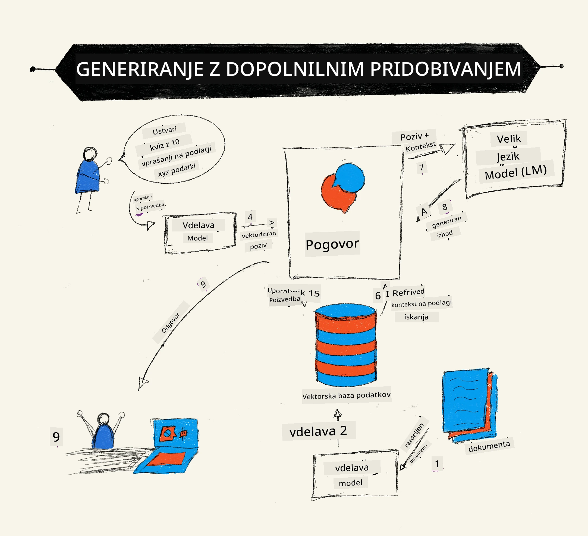
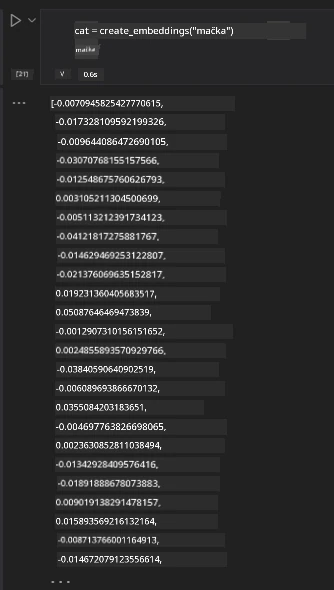

# Generiranje z nadgradnjo pridobivanja (RAG) in vektorske baze podatkov

[](https://youtu.be/4l8zhHUBeyI?si=BmvDmL1fnHtgQYkL)

V lekciji o iskalnih aplikacijah smo na kratko spoznali, kako integrirati lastne podatke v velike jezikovne modele (LLM). V tej lekciji bomo podrobneje raziskali koncepte utemeljevanja vaših podatkov v vaši LLM aplikaciji, mehaniko procesa in metode shranjevanja podatkov, vključno z vdelavami (embeddings) in besedilom.

> **Video kmalu na voljo**

## Uvod

V tej lekciji bomo pokrili naslednje:

- Uvod v RAG, kaj je in zakaj se uporablja v umetni inteligenci (UI).

- Razumevanje, kaj so vektorske baze podatkov in ustvarjanje ene za našo aplikacijo.

- Praktični primer, kako integrirati RAG v aplikacijo.

## Cilji učenja

Po zaključku te lekcije boste znali:

- Razložiti pomen RAG pri pridobivanju in obdelavi podatkov.

- Nastaviti RAG aplikacijo in utemeljiti svoje podatke na LLM.

- Učinkovita integracija RAG in vektorskih baz podatkov v LLM aplikacijah.

## Naš scenarij: nadgradnja naših LLM z lastnimi podatki

Za to lekcijo želimo dodati svoje lastne zapiske v izobraževalni startup, kar omogoča chatbotu pridobiti več informacij o različnih predmetih. Z uporabo naših zapiskov bodo učenci lahko bolje študirali in razumeli različne teme, kar olajša pripravo na izpite. Za naš scenarij bomo uporabili:

- `Azure OpenAI:` LLM, ki ga bomo uporabili za ustvarjanje chatbota

- `Lekcijo AI za začetnike o nevronskih mrežah`: podatke, na katerih bomo utemeljili naš LLM

- `Azure AI Search` in `Azure Cosmos DB:` vektorsko bazo podatkov za shranjevanje podatkov in ustvarjanje iskalnega indeksa

Uporabniki bodo lahko ustvarjali vaje iz svojih zapiskov, pregledne kartice za ponavljanje ter povzema v jedrnate preglede. Za začetek si poglejmo, kaj je RAG in kako deluje:

## Generiranje z nadgradnjo pridobivanja (RAG)

LLM-podprt chatbot obdeluje uporabniške pozive za generiranje odgovorov. Namenjen je interaktivnosti in vključenosti uporabnikov v številne teme. Njegovi odgovori so omejeni na kontekst in osnovne podatke za usposabljanje. Na primer, GPT-4 ima mejni datum znanja september 2021, kar pomeni, da ne pozna dogodkov po tem obdobju. Poleg tega podatki za usposabljanje LLM izključujejo zaupne informacije, kot so osebni zapiski ali priročniki podjetja.

### Kako delujejo RAG (Generiranje z nadgradnjo pridobivanja)



Predpostavimo, da želite namestiti chatbota, ki ustvarja kvize iz vaših zapiskov. Potrebovali boste povezavo z bazo znanja. Tu pride RAG na pomoč. RAG deluje tako:

- **Baza znanja:** Pred pridobivanjem je treba te dokumente vnesti in predprocesirati, običajno z razbijanjem večjih dokumentov v manjše dele, pretvorbo v besedilne vdelave in shranjevanjem v bazo podatkov.

- **Uporabniško vprašanje:** uporabnik postavi vprašanje.

- **Pridobivanje:** Ko uporabnik postavi vprašanje, model vdelave poišče ustrezne informacije v naši bazi znanja, da zagotovi dodatni kontekst, ki bo vključen v poziv.

- **Nadgrajeno generiranje:** LLM izboljša svoj odgovor na podlagi pridobljenih podatkov. To omogoča, da generirani odgovor ni le na podlagi vnaprej usposobljenih podatkov, ampak tudi na ustreznih informacijah iz dodanega konteksta. Pridobljeni podatki se uporabijo za nadgradnjo LLM odgovorov. LLM nato vrne odgovor na uporabnikovo vprašanje.


Arhitektura RAG je izvedena z uporabo transformatorjev, sestavljenih iz dveh delov: kodirnika in dekodirnika. Na primer, ko uporabnik postavi vprašanje, se vhodno besedilo 'kodira' v vektorje, ki zajamejo pomen besed, ti vektorji pa se 'dekodirajo' v indeks dokumentov in generirajo novo besedilo glede na uporabnikovo vprašanje. LLM uporablja model kodirnik-dekodirnik za ustvarjanje izhoda.

Po predlaganem članku: [Retrieval-Augmented Generation for Knowledge intensive NLP Tasks](https://arxiv.org/pdf/2005.11401.pdf?WT.mc_id=academic-105485-koreyst) obstajata dva pristopa za implementacijo RAG:

- **_RAG-Sequence_** uporaba pridobljenih dokumentov za napoved najbolj možnega odgovora na uporabnikovo vprašanje

- **RAG-Token** uporaba dokumentov za generiranje naslednjega tokena, nato pa pridobivanje dokumentov za odgovor na uporabnikovo vprašanje

### Zakaj uporabljati RAG? 

- **Bogastvo informacij:** zagotavlja, da so besedilni odgovori aktualni in sodobni. S tem izboljša delovanje na nalogah, specifičnih za domeno, z dostopom do notranje baze znanja.

- Zmanjšuje izmišljanje z uporabo **preverljivih podatkov** iz baze znanja, ki zagotavljajo kontekst za uporabniške poizvedbe.

- Je **stroškovno učinkovit**, saj je cenejši od dodatnega prilagajanja LLM.

## Ustvarjanje baze znanja

Naša aplikacija temelji na naših osebnih podatkih, tj. lekciji o nevronskih mrežah iz kurikuluma AI za začetnike.

### Vektorske baze podatkov

Vektorska baza podatkov, v nasprotju s tradicionalnimi bazami, je specializirana baza za shranjevanje, upravljanje in iskanje vektorskih vdelav. Shranjuje numerične predstavitve dokumentov. Razbijanje podatkov v numerične vdelave olajša našemu AI sistemu razumevanje in obdelavo podatkov.

Naše vdelave shranjujemo v vektorskih bazah podatkov, saj imajo LLM omejitev števila tokenov, ki jih sprejmejo kot vhod. Ker celotnih vdelav ne morete poslati v LLM, jih moramo razdeliti na dele, ko uporabnik postavi vprašanje, se vrnejo najbolj ustrezne vdelave skupaj s pozivom. Razbijanje na dele tudi zmanjša stroške glede števila tokenov, poslanih skozi LLM.

Nekatere priljubljene vektorske baze vključujejo Azure Cosmos DB, Clarifyai, Pinecone, Chromadb, ScaNN, Qdrant in DeepLake. Azure Cosmos DB model lahko ustvarite z uporabo Azure CLI z naslednjim ukazom:

```bash
az login
az group create -n <resource-group-name> -l <location>
az cosmosdb create -n <cosmos-db-name> -r <resource-group-name>
az cosmosdb list-keys -n <cosmos-db-name> -g <resource-group-name>
```

### Od besedila do vdelav

Preden shranimo podatke, jih moramo pretvoriti v vektorske vdelave, preden se shranijo v bazo podatkov. Če delate z velikimi dokumenti ali dolgimi besedili, jih lahko razdelite glede na pričakovane poizvedbe. Razbijanje je možno na ravni stavka ali odstavka. Ker razbijanje izhaja iz pomena okoliških besed, lahko dodate tudi drugi kontekst, npr. naslov dokumenta ali vključite nekaj besedila pred ali za delom. Podatke lahko razdelite tako:

```python
def split_text(text, max_length, min_length):
    words = text.split()
    chunks = []
    current_chunk = []

    for word in words:
        current_chunk.append(word)
        if len(' '.join(current_chunk)) < max_length and len(' '.join(current_chunk)) > min_length:
            chunks.append(' '.join(current_chunk))
            current_chunk = []

    # Če zadnji kos ni dosegel minimalne dolžine, ga vseeno dodajte
    if current_chunk:
        chunks.append(' '.join(current_chunk))

    return chunks
```

Ko so podatki razdeljeni, jih lahko vdelamo z različnimi modeli vdelav. Nekateri modeli, ki jih lahko uporabite, so: word2vec, ada-002 od OpenAI, Azure Computer Vision in še mnogo drugih. Izbira modela je odvisna od jezikov, ki jih uporabljate, tipa vsebine, ki jo kodira (besedilo/slike/zvok), velikosti vhoda, ki ga lahko kodira, in dolžine rezultata vdelave.

Primer vdelanega besedila z uporabo OpenAI-jevega modela `text-embedding-ada-002` je:


## Pridobivanje in vektorsko iskanje

Ko uporabnik postavi vprašanje, ga model za pridobivanje pretvori v vektor z uporabo kodirnika poizvedb, nato pa išče v našem indeksu iskanja dokumentov ustrezne vektorje, povezane z vhodom. Ko je to opravljeno, pretvori tako vhodni vektor kot vektorje dokumentov v besedilo in jih posreduje LLM.

### Pridobivanje

Pridobivanje se zgodi, ko sistem poskuša hitro najti dokumente iz indeksa, ki ustrezajo iskalnim kriterijem. Cilj pridobitelja je dobiti dokumente, ki bodo uporabljeni za zagotavljanje konteksta in utemeljitev LLM na vaših podatkih.

Obstaja več načinov iskanja v naši bazi, kot so:

- **Iskanje po ključnih besedah** - za iskanje besedila

- **Vektorsko iskanje** - pretvori dokumente iz besedila v vektorske predstavitve z uporabo modelov vdelav, kar omogoča **semantično iskanje** na podlagi pomena besed. Pridobivanje poteka z iskanjem dokumentov, katerih vektorske predstavitve so najbližje uporabnikovemu vprašanju.

- **Hibridno** - kombinacija iskanja po ključnih besedah in vektorskega iskanja.

Izziv pri pridobivanju nastane, ko ni podobnega odgovora na poizvedbo v bazi; sistem nato vrne najboljše informacije, ki jih lahko dobi. Vendar lahko uporabite taktike, kot je nastavitev maksimalne razdalje za ustreznost ali uporabo hibridnega iskanja, ki združuje ključne besede in vektorsko iskanje. V tej lekciji bomo uporabili hibridno iskanje, kombinacijo obeh pristopov. Podatke bomo shranili v podatkovni okvir s stolpci, ki vsebujejo razdelke in vdelave.

### Vektorska podobnost

Pridobitelj bo iskal v bazi znanja vdelave, ki so si med seboj blizu, najbližji sosed, saj so to podobna besedila. V scenariju, ko uporabnik postavi vprašanje, je to najprej vdelano, nato pa se ujema s podobnimi vdelavami. Pogosta mera podobnosti, ki se uporablja za ugotavljanje, kako so različni vektorji podobni, je kosinusna podobnost, ki temelji na kotu med dvema vektorjema.

Ukrepe podobnosti lahko izmerimo tudi z drugimi možnostmi, kot sta evklidska razdalja, ki predstavlja najkrajšo razdaljo med končnimi točkami vektorjev, in skalarni produkt, ki meri vsoto produktov ustreznih elementov dveh vektorjev.

### Iskalni indeks

Pri pridobivanju moramo najprej ustvariti iskalni indeks za našo bazo znanja. Indeks shrani vdelave in lahko hitro vrne najbolj podobne razdelke tudi v veliki bazi podatkov. Indeks lahko ustvarimo lokalno z uporabo:

```python
from sklearn.neighbors import NearestNeighbors

embeddings = flattened_df['embeddings'].to_list()

# Ustvari iskalni indeks
nbrs = NearestNeighbors(n_neighbors=5, algorithm='ball_tree').fit(embeddings)

# Za poizvedbo indeksa lahko uporabiš metodo kneighbors
distances, indices = nbrs.kneighbors(embeddings)
```

### Ponovno razvrščanje

Ko poizvedujete bazo podatkov, boste morda morali rezultate razvrstiti po relevantnosti. LLM za ponovno razvrščanje uporablja strojno učenje za izboljšanje relevantnosti rezultatov iskanja tako, da jih ureja od najbolj do najmanj relevantnih. Z uporabo Azure AI Search se ponovno razvrščanje samodejno izvaja z uporabo semantičnega prerazvrščevalnika. Primer, kako deluje ponovno razvrščanje s najbližjimi sosedi:

```python
# Poišči najbolj podobne dokumente
distances, indices = nbrs.kneighbors([query_vector])

index = []
# Izpiši najbolj podobne dokumente
for i in range(3):
    index = indices[0][i]
    for index in indices[0]:
        print(flattened_df['chunks'].iloc[index])
        print(flattened_df['path'].iloc[index])
        print(flattened_df['distances'].iloc[index])
    else:
        print(f"Index {index} not found in DataFrame")
```

## Združevanje vsega

Zadnji korak je dodati naš LLM v zmes, da lahko dobimo odgovore, ki so utemeljeni na naših podatkih. To lahko izvedemo tako:

```python
user_input = "what is a perceptron?"

def chatbot(user_input):
    # Pretvori vprašanje v vektor poizvedbe
    query_vector = create_embeddings(user_input)

    # Najdi najbolj podobne dokumente
    distances, indices = nbrs.kneighbors([query_vector])

    # dodaj dokumente k poizvedbi za zagotavljanje konteksta
    history = []
    for index in indices[0]:
        history.append(flattened_df['chunks'].iloc[index])

    # združi zgodovino in vnos uporabnika
    history.append(user_input)

    # ustvari objekt sporočila
    messages=[
        {"role": "system", "content": "You are an AI assistant that helps with AI questions."},
        {"role": "user", "content": "\n\n".join(history) }
    ]

    # uporabi API Odgovori za ustvarjanje odgovora
    response = client.responses.create(
        model="gpt-5-mini",
        max_output_tokens=800,
        input=messages,
        store=False,
    )

    return response.output_text

chatbot(user_input)
```

## Vrednotenje naše aplikacije

### Merila vrednotenja

- Kakovost podanih odgovorov, ki zagotavlja, da zvenijo naravno, tekoče in človeško

- Utemeljenost podatkov: vrednotenje, ali odgovor izvira iz podanih dokumentov

- Relevantnost: vrednotenje, ali je odgovor skladen in povezan z zastavljenim vprašanjem

- Tekočnost - ali je odgovor slovnično smiseln

## Primeri uporabe RAG (Generiranje z nadgradnjo pridobivanja) in vektorskih baz podatkov

Obstaja veliko različnih primerov, kjer lahko funkcijski klici izboljšajo vašo aplikacijo, kot so:

- Vprašanja in odgovori: utemeljitev podatkov vašega podjetja v klepetu, ki ga lahko zaposleni uporabljajo za postavljanje vprašanj.

- Sistemi priporočil: kjer lahko ustvarite sistem, ki primerja najbolj podobne vrednosti, npr. filme, restavracije in še veliko več.

- Storitve chatbotov: lahko shranjujete zgodovino klepetov in personalizirate pogovor glede na podatke uporabnika.

- Iskanje slik na podlagi vektorskih vdelav, uporabno pri prepoznavanju slik in odkrivanju anomalij.

## Povzetek

Pokrili smo osnovna področja RAG, od dodajanja naših podatkov v aplikacijo, uporabniške poizvedbe do izhoda. Za poenostavitev ustvarjanja RAG lahko uporabite ogrodja, kot so Semanti Kernel, Langchain ali Autogen.

## Naloga

Za nadaljevanje učenja o Generiranju z nadgradnjo pridobivanja (RAG) lahko ustvarite:

- Prednji del aplikacije z uporabo poljubnega ogrodja

- Uporabite ogrodje, bodisi LangChain ali Semantic Kernel, in znova ustvarite svojo aplikacijo.

Čestitke za zaključek lekcije 👏.

## Učenje se tukaj ne konča, nadaljujte pot

Po zaključku lekcije si oglejte našo [zbirko za učenje generativne umetne inteligence](https://aka.ms/genai-collection?WT.mc_id=academic-105485-koreyst) in še naprej nadgrajujte svoje znanje o generativni UI!

---

<!-- CO-OP TRANSLATOR DISCLAIMER START -->
**Omejitev odgovornosti**:
Ta dokument je bil preveden z uporabo AI prevajalske storitve [Co-op Translator](https://github.com/Azure/co-op-translator). Čeprav si prizadevamo za natančnost, vas prosimo, da upoštevate, da avtomatizirani prevodi lahko vsebujejo napake ali netočnosti. Izvirni dokument v njegovem izvirnem jeziku je treba obravnavati kot avtoritativni vir. Za kritične informacije je priporočljiv strokovni človeški prevod. Ne odgovarjamo za morebitna nesporazume ali napačne interpretacije, ki izhajajo iz uporabe tega prevoda.
<!-- CO-OP TRANSLATOR DISCLAIMER END -->