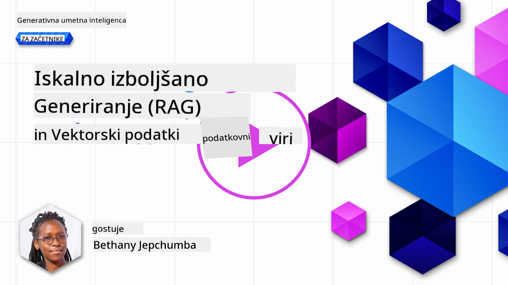
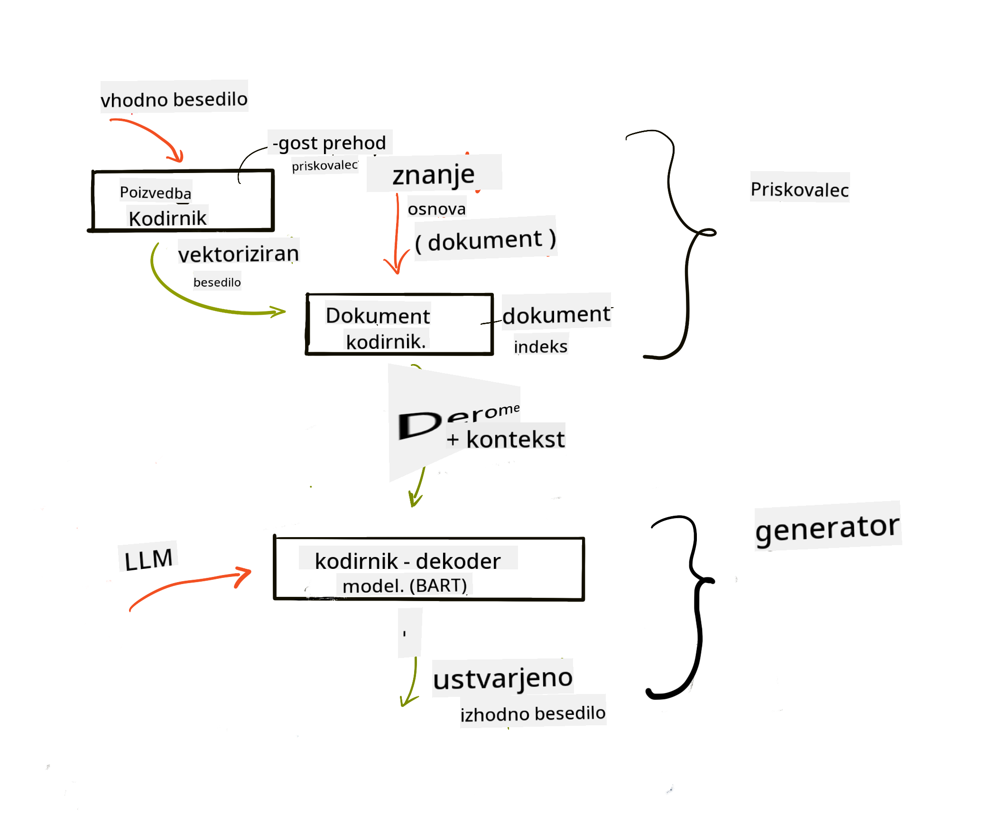
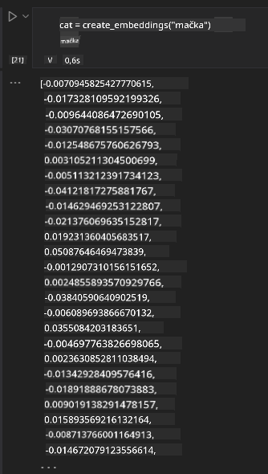

<!--
CO_OP_TRANSLATOR_METADATA:
{
  "original_hash": "e2861bbca91c0567ef32bc77fe054f9e",
  "translation_date": "2025-06-25T22:49:01+00:00",
  "source_file": "15-rag-and-vector-databases/README.md",
  "language_code": "sl"
}
-->
# Generacija z izboljšanim pridobivanjem (RAG) in vektorske baze podatkov

[](https://aka.ms/gen-ai-lesson15-gh?WT.mc_id=academic-105485-koreyst)

V lekciji o aplikacijah za iskanje smo se na kratko naučili, kako vključiti lastne podatke v modele velikih jezikov (LLM). V tej lekciji bomo podrobneje obravnavali koncept postavitve vaših podatkov v aplikacijo LLM, mehaniko procesa in metode za shranjevanje podatkov, vključno z vektorizacijo in besedilom.

> **Video prihaja kmalu**

## Uvod

V tej lekciji bomo obravnavali naslednje:

- Uvod v RAG, kaj je in zakaj se uporablja v umetni inteligenci (AI).

- Razumevanje, kaj so vektorske baze podatkov in ustvarjanje ene za našo aplikacijo.

- Praktičen primer, kako vključiti RAG v aplikacijo.

## Cilji učenja

Po zaključku te lekcije boste lahko:

- Pojasnili pomen RAG pri pridobivanju in obdelavi podatkov.

- Nastavili aplikacijo RAG in postavili vaše podatke v LLM

- Učinkovita integracija RAG in vektorskih baz podatkov v aplikacijah LLM.

## Naš scenarij: izboljšanje naših LLM-jev z lastnimi podatki

Za to lekcijo želimo dodati lastne zapiske v izobraževalni startup, kar omogoča chatbotu pridobivanje več informacij o različnih temah. Z uporabo zapiskov, ki jih imamo, bodo učenci lahko bolje študirali in razumeli različne teme, kar bo olajšalo pripravo na izpite. Za ustvarjanje našega scenarija bomo uporabili:

- `Azure OpenAI:` LLM, ki ga bomo uporabili za ustvarjanje našega chatbota

- `AI for beginners' lesson on Neural Networks`: to bodo podatki, na katerih bomo postavili naš LLM

- `Azure AI Search` in `Azure Cosmos DB:` vektorsko bazo podatkov za shranjevanje naših podatkov in ustvarjanje iskalnega indeksa

Uporabniki bodo lahko ustvarili kvize za vajo iz svojih zapiskov, kartice za ponavljanje in jih povzemali v jedrnate preglede. Za začetek si poglejmo, kaj je RAG in kako deluje:

## Generacija z izboljšanim pridobivanjem (RAG)

Chatbot, ki ga poganja LLM, obdeluje uporabniške pozive za generiranje odgovorov. Zasnovan je za interaktivno komunikacijo in se ukvarja z uporabniki na širokem področju tem. Vendar pa so njegovi odgovori omejeni na kontekst, ki je zagotovljen, in osnovne podatke o usposabljanju. Na primer, znanje GPT-4 je omejeno na september 2021, kar pomeni, da mu manjka znanje o dogodkih, ki so se zgodili po tem obdobju. Poleg tega podatki, uporabljeni za usposabljanje LLM-jev, izključujejo zaupne informacije, kot so osebni zapiski ali priročnik za izdelke podjetja.

### Kako delujejo RAG-i (Generacija z izboljšanim pridobivanjem)


Recimo, da želite uvesti chatbot, ki ustvarja kvize iz vaših zapiskov, potrebovali boste povezavo do baze znanja. Tukaj RAG priskoči na pomoč. RAG-i delujejo kot sledi:

- **Baza znanja:** Pred pridobivanjem je treba te dokumente vnesti in predobdelati, običajno razdeliti velike dokumente na manjše dele, jih pretvoriti v vektorizacijo besedila in shraniti v bazo podatkov.

- **Uporabniško vprašanje:** uporabnik postavi vprašanje

- **Pridobivanje:** Ko uporabnik postavi vprašanje, model vektorizacije pridobi ustrezne informacije iz naše baze znanja, da zagotovi več konteksta, ki bo vključen v poziv.

- **Izboljšana generacija:** LLM izboljša svoj odgovor na podlagi pridobljenih podatkov. Omogoča, da je odgovor generiran ne le na podlagi predhodno usposobljenih podatkov, temveč tudi na ustreznih informacijah iz dodanega konteksta. Pridobljeni podatki se uporabljajo za izboljšanje odgovorov LLM-a. LLM nato vrne odgovor na uporabnikovo vprašanje.



Arhitektura RAG-ov je implementirana z uporabo transformatorjev, ki sestavljajo dve del: kodirnik in dekodirnik. Na primer, ko uporabnik postavi vprašanje, se vhodno besedilo 'kodira' v vektorje, ki zajemajo pomen besed, in vektorji se 'dekodirajo' v naš indeks dokumentov ter generirajo novo besedilo na podlagi uporabniškega vprašanja. LLM uporablja model kodirnik-dekodirnik za generiranje izhoda.

Dva pristopa pri implementaciji RAG po predlaganem dokumentu: [Generacija z izboljšanim pridobivanjem za naloge, intenzivne v znanju, v obdelavi naravnega jezika (NLP)](https://arxiv.org/pdf/2005.11401.pdf?WT.mc_id=academic-105485-koreyst) sta:

- **_RAG-Sequence_** uporaba pridobljenih dokumentov za napoved najbolj možnega odgovora na uporabniško vprašanje

- **RAG-Token** uporaba dokumentov za generiranje naslednjega tokena, nato pa njihovo pridobivanje za odgovor na uporabnikovo vprašanje

### Zakaj bi uporabljali RAG-e?

- **Bogastvo informacij:** zagotavlja, da so besedilni odgovori ažurni in aktualni. Zato izboljšuje učinkovitost pri nalogah, specifičnih za domeno, z dostopom do notranje baze znanja.

- Zmanjšuje izmišljanje z uporabo **preverljivih podatkov** v bazi znanja za zagotavljanje konteksta uporabniškim vprašanjem.

- Je **stroškovno učinkovit**, saj so bolj ekonomični v primerjavi z fino nastavitvijo LLM-a.

## Ustvarjanje baze znanja

Naša aplikacija temelji na naših osebnih podatkih, tj. lekcija o nevronskih mrežah v učnem načrtu AI za začetnike.

### Vektorske baze podatkov

Vektorska baza podatkov, za razliko od tradicionalnih baz podatkov, je specializirana baza podatkov, zasnovana za shranjevanje, upravljanje in iskanje vektoriziranih vektorjev. Shranjuje numerične predstavitve dokumentov. Razčlenitev podatkov na numerične vektorizacije olajša našemu AI sistemu razumevanje in obdelavo podatkov.

Naše vektorizacije shranjujemo v vektorskih bazah podatkov, saj imajo LLM-ji omejitev števila tokenov, ki jih sprejmejo kot vhod. Ker ne morete prenesti celotnih vektorizacij v LLM, jih bomo morali razdeliti na dele, in ko uporabnik postavi vprašanje, se vektorizacije, ki so najbolj podobne vprašanju, vrnejo skupaj s pozivom. Razčlenitev prav tako zmanjšuje stroške glede števila tokenov, ki jih prenesemo skozi LLM.

Nekatere priljubljene vektorske baze podatkov vključujejo Azure Cosmos DB, Clarifyai, Pinecone, Chromadb, ScaNN, Qdrant in DeepLake. Model Azure Cosmos DB lahko ustvarite z uporabo Azure CLI z naslednjim ukazom:

```bash
az login
az group create -n <resource-group-name> -l <location>
az cosmosdb create -n <cosmos-db-name> -r <resource-group-name>
az cosmosdb list-keys -n <cosmos-db-name> -g <resource-group-name>
```

### Od besedila do vektorizacij

Preden shranimo naše podatke, jih bomo morali pretvoriti v vektorizacije, preden jih shranimo v bazo podatkov. Če delate z velikimi dokumenti ali dolgimi besedili, jih lahko razdelite glede na pričakovana vprašanja. Razčlenitev lahko izvedete na ravni stavka ali na ravni odstavka. Ker razčlenitev izhaja iz pomena besed okoli njih, lahko dodate nekaj drugega konteksta razčlenitvi, na primer z dodajanjem naslova dokumenta ali vključitvijo besedila pred ali po razčlenitvi. Podatke lahko razčlenite na naslednji način:

```python
def split_text(text, max_length, min_length):
    words = text.split()
    chunks = []
    current_chunk = []

    for word in words:
        current_chunk.append(word)
        if len(' '.join(current_chunk)) < max_length and len(' '.join(current_chunk)) > min_length:
            chunks.append(' '.join(current_chunk))
            current_chunk = []

    # If the last chunk didn't reach the minimum length, add it anyway
    if current_chunk:
        chunks.append(' '.join(current_chunk))

    return chunks
```

Ko so razčlenjeni, lahko nato vektoriziramo naše besedilo z uporabo različnih modelov vektorizacije. Nekateri modeli, ki jih lahko uporabite, vključujejo: word2vec, ada-002 od OpenAI, Azure Computer Vision in mnogi drugi. Izbira modela, ki ga boste uporabili, bo odvisna od jezikov, ki jih uporabljate, vrste kodirane vsebine (besedilo/slike/zvok), velikosti vhodnih podatkov, ki jih lahko kodira, in dolžine izhoda vektorizacije.

Primer vektoriziranega besedila z uporabo OpenAI-ovega modela `text-embedding-ada-002` je:


## Pridobivanje in iskanje vektorjev

Ko uporabnik postavi vprašanje, ga pridobitelj pretvori v vektor z uporabo kodirnika poizvedbe, nato pa poišče po našem indeksu iskanja dokumentov ustrezne vektorje v dokumentu, ki so povezani z vhodom. Ko je končano, pretvori tako vhodni vektor kot vektorje dokumentov v besedilo in jih prenese skozi LLM.

### Pridobivanje

Pridobivanje se zgodi, ko sistem poskuša hitro najti dokumente iz indeksa, ki ustrezajo iskalnim kriterijem. Cilj pridobitelja je pridobiti dokumente, ki bodo uporabljeni za zagotavljanje konteksta in postavitev LLM na vaše podatke.

Obstaja več načinov za izvajanje iskanja v naši bazi podatkov, kot so:

- **Iskanje po ključnih besedah** - uporablja se za iskanje besedila

- **Semantično iskanje** - uporablja semantični pomen besed

- **Iskanje vektorjev** - pretvori dokumente iz besedila v vektorske predstavitve z uporabo modelov vektorizacije. Pridobivanje se bo izvedlo z iskanjem dokumentov, katerih vektorske predstavitve so najbližje uporabniškemu vprašanju.

- **Hibridno** - kombinacija iskanja po ključnih besedah in iskanja vektorjev.

Izziv pri pridobivanju nastane, ko v bazi podatkov ni podobnega odgovora na poizvedbo, sistem bo nato vrnil najboljše informacije, ki jih lahko dobi, vendar pa lahko uporabite taktike, kot so nastavitev največje razdalje za relevantnost ali uporaba hibridnega iskanja, ki združuje tako iskanje po ključnih besedah kot iskanje vektorjev. V tej lekciji bomo uporabili hibridno iskanje, kombinacijo iskanja po vektorjih in ključnih besedah. Naše podatke bomo shranili v podatkovni okvir s stolpci, ki vsebujejo razčlenitve in vektorizacije.

### Vektorska podobnost

Pridobitelj bo iskal po bazi znanja vektorizacije, ki so blizu skupaj, najbližji sosed, saj so to besedila, ki so podobna. V scenariju, ko uporabnik postavi poizvedbo, se najprej vektorizira, nato pa se ujema s podobnimi vektorizacijami. Običajna meritev, ki se uporablja za ugotavljanje, kako podobni so različni vektorji, je kosinusna podobnost, ki temelji na kotu med dvema vektorjema.

Lahko merimo podobnost z uporabo drugih alternativ, ki jih lahko uporabimo, so Evklidska razdalja, ki je ravna črta med končnimi točkami vektorjev, in produkt točk, ki meri vsoto produktov ustreznih elementov dveh vektorjev.

### Iskalni indeks

Pri izvajanju pridobivanja bomo morali zgraditi iskalni indeks za našo bazo znanja, preden izvedemo iskanje. Indeks bo shranjeval naše vektorizacije in lahko hitro pridobil najbolj podobne razčlenitve, tudi v veliki bazi podatkov. Indeks lahko ustvarimo lokalno z uporabo:

```python
from sklearn.neighbors import NearestNeighbors

embeddings = flattened_df['embeddings'].to_list()

# Create the search index
nbrs = NearestNeighbors(n_neighbors=5, algorithm='ball_tree').fit(embeddings)

# To query the index, you can use the kneighbors method
distances, indices = nbrs.kneighbors(embeddings)
```

### Ponovno razvrščanje

Ko ste poizvedovali bazo podatkov, boste morda morali razvrstiti rezultate od najbolj relevantnih. LLM za ponovno razvrščanje uporablja strojno učenje za izboljšanje relevantnosti rezultatov iskanja z njihovim urejanjem od najbolj relevantnih. Z uporabo Azure AI Search se ponovno razvrščanje samodejno izvede za vas z uporabo semantičnega razvrščevalnika. Primer, kako ponovno razvrščanje deluje z uporabo najbližjih sosedov:

```python
# Find the most similar documents
distances, indices = nbrs.kneighbors([query_vector])

index = []
# Print the most similar documents
for i in range(3):
    index = indices[0][i]
    for index in indices[0]:
        print(flattened_df['chunks'].iloc[index])
        print(flattened_df['path'].iloc[index])
        print(flattened_df['distances'].iloc[index])
    else:
        print(f"Index {index} not found in DataFrame")
```

## Vse skupaj

Zadnji korak je dodajanje našega LLM v mešanico, da bomo lahko dobili odgovore, ki so postavljeni na naše podatke. Implementiramo ga lahko na naslednji način:

```python
user_input = "what is a perceptron?"

def chatbot(user_input):
    # Convert the question to a query vector
    query_vector = create_embeddings(user_input)

    # Find the most similar documents
    distances, indices = nbrs.kneighbors([query_vector])

    # add documents to query  to provide context
    history = []
    for index in indices[0]:
        history.append(flattened_df['chunks'].iloc[index])

    # combine the history and the user input
    history.append(user_input)

    # create a message object
    messages=[
        {"role": "system", "content": "You are an AI assistant that helps with AI questions."},
        {"role": "user", "content": history[-1]}
    ]

    # use chat completion to generate a response
    response = openai.chat.completions.create(
        model="gpt-4",
        temperature=0.7,
        max_tokens=800,
        messages=messages
    )

    return response.choices[0].message

chatbot(user_input)
```

## Vrednotenje naše aplikacije

### Evalvacijske meritve

- Kakovost podanih odgovorov, ki zagotavlja, da zvenijo naravno, tekoče in človeško

- Postavljenost podatkov: vrednotenje, ali je odgovor prišel iz posredovanih dokumentov

- Relevantnost: vrednotenje, ali se odgovor ujema in je povezan z zastavljenim vprašanjem

- Tekočnost - ali odgovor smiselno gramatično

## Primeri uporabe za uporabo RAG (Generacija z izboljšanim pridobivanjem) in vektorskih baz podatkov

Obstaja veliko različnih primerov uporabe, kjer lahko klici funkcij izboljšajo vašo aplikacijo, kot so:

- Vprašanja in odgovarjanje: postavljanje podatkov vašega podjetja na klepet, ki ga lahko zaposleni uporabljajo za postavljanje vprašanj.

- Priporočilni sistemi: kjer lahko ustvarite sistem, ki ustreza najbolj podobnim vrednostim, npr. filmi, restavracije in še več.

- Storitve chatbotov: lahko shranite zgodovino klepeta in prilagodite pogovor na podlagi uporabniških podatkov.

- Iskanje slik na podlagi vektorskih vektorizacij, uporabno pri prepoznavanju slik in zaznavanju anomalij.

## Povzetek

Pokazali smo temeljna področja RAG od dodajanja naših podatkov v aplikacijo, uporabniške poizvedbe in izhoda. Za poenostavitev ustvarjanja RAG lahko uporabite ogrodja, kot so Semantični Kernel, Langchain ali Autogen.

## Naloga

Za nadaljevanje vašega učenja o Generaciji z izboljšanim pridobivanjem (RAG) lahko zgradite:

- Zgradite sprednji del aplikacije z uporabo ogrodja po vaši izbiri

- Uporabite ogrodje, bodisi LangChain ali Semantični Kernel, in ponovno ustvarite svojo aplikacijo.

Čestitke za dokončanje lekcije 👏.

## Učenje se tukaj ne konča, nadaljujte pot

Po zaključku te lekcije si oglejte našo [Zbirko učenja generativne AI](https://aka.ms/genai-collection?WT.mc_id=academic-105485-koreyst), da nadaljujete z nadgradnjo svojega znanja o generativni AI!

**Omejitev odgovornosti**:  
Ta dokument je bil preveden z uporabo storitve AI prevajanja [Co-op Translator](https://github.com/Azure/co-op-translator). Čeprav si prizadevamo za natančnost, prosimo, da se zavedate, da lahko avtomatizirani prevodi vsebujejo napake ali netočnosti. Izvirni dokument v njegovem maternem jeziku je treba obravnavati kot avtoritativni vir. Za kritične informacije je priporočljivo profesionalno človeško prevajanje. Ne odgovarjamo za morebitna nesporazumevanja ali napačne razlage, ki izhajajo iz uporabe tega prevoda.