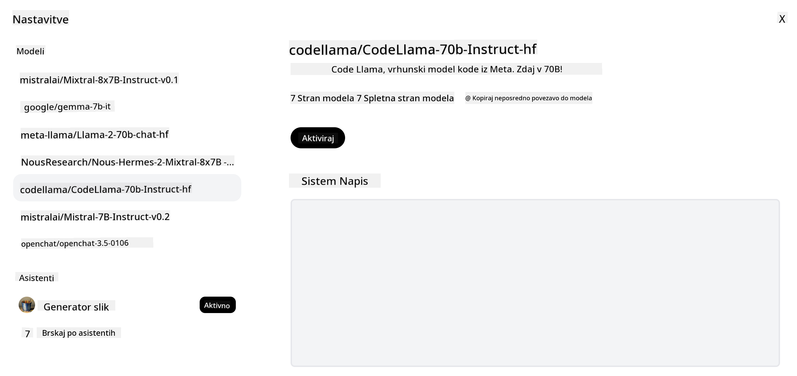

<!--
CO_OP_TRANSLATOR_METADATA:
{
  "original_hash": "0bba96e53ab841d99db731892a51fab8",
  "translation_date": "2025-05-20T07:05:41+00:00",
  "source_file": "16-open-source-models/README.md",
  "language_code": "sl"
}
-->

## Uvod

Svet odprtokodnih LLM-jev je razburljiv in se nenehno razvija. Ta lekcija si prizadeva zagotoviti poglobljen pogled na odprtokodne modele. Če iščete informacije o tem, kako se lastniški modeli primerjajo z odprtokodnimi modeli, pojdite na lekcijo ["Raziskovanje in primerjava različnih LLM-jev"](../02-exploring-and-comparing-different-llms/README.md?WT.mc_id=academic-105485-koreyst). Ta lekcija bo obravnavala tudi temo prilagajanja, vendar podrobnejšo razlago najdete v lekciji ["Prilagajanje LLM-jev"](../18-fine-tuning/README.md?WT.mc_id=academic-105485-koreyst).

## Cilji učenja

- Pridobite razumevanje odprtokodnih modelov
- Razumevanje prednosti dela z odprtokodnimi modeli
- Raziskovanje odprtih modelov, ki so na voljo na Hugging Face in Azure AI Studio

## Kaj so odprtokodni modeli?

Odprtokodna programska oprema je igrala ključno vlogo pri rasti tehnologije na različnih področjih. Pobuda za odprtokodno programsko opremo (OSI) je opredelila [10 meril za programsko opremo](https://web.archive.org/web/20241126001143/https://opensource.org/osd?WT.mc_id=academic-105485-koreyst), da se razvrsti kot odprtokodna. Izvorna koda mora biti odprto deljena pod licenco, ki jo je odobrila OSI.

Medtem ko razvoj LLM-jev vsebuje podobne elemente kot razvoj programske opreme, postopek ni povsem enak. To je povzročilo veliko razprav v skupnosti o definiciji odprtokodnosti v kontekstu LLM-jev. Da bi bil model skladen s tradicionalno definicijo odprtokodnosti, bi morale biti javno dostopne naslednje informacije:

- Nabori podatkov, uporabljeni za treniranje modela.
- Polne uteži modela kot del treniranja.
- Koda za ocenjevanje.
- Koda za prilagajanje.
- Polne uteži modela in metrika treniranja.

Trenutno obstaja le nekaj modelov, ki ustrezajo tem merilom. [OLMo model, ki ga je ustvaril Allen Institute for Artificial Intelligence (AllenAI)](https://huggingface.co/allenai/OLMo-7B?WT.mc_id=academic-105485-koreyst) je eden izmed teh.

Za to lekcijo bomo modele v nadaljevanju imenovali "odprti modeli", saj morda ne ustrezajo zgornjim merilom v času pisanja.

## Prednosti odprtih modelov

**Visoka prilagodljivost** - Ker so odprti modeli izdani z natančnimi informacijami o treniranju, lahko raziskovalci in razvijalci spreminjajo notranjost modela. To omogoča ustvarjanje zelo specializiranih modelov, ki so prilagojeni za določeno nalogo ali področje študija. Nekateri primeri tega so generiranje kode, matematične operacije in biologija.

**Stroški** - Stroški na žeton za uporabo in uvajanje teh modelov so nižji kot pri lastniških modelih. Pri gradnji aplikacij za generativno umetno inteligenco je treba upoštevati razmerje med zmogljivostjo in ceno pri delu s temi modeli za vaš primer uporabe.

Vir: Artificial Analysis

**Prilagodljivost** - Delo z odprtimi modeli vam omogoča, da ste prilagodljivi pri uporabi različnih modelov ali njihovem kombiniranju. Primer tega so [HuggingChat Assistants](https://huggingface.co/chat?WT.mc_id=academic-105485-koreyst), kjer lahko uporabnik neposredno v uporabniškem vmesniku izbere model, ki se uporablja:

## Raziskovanje različnih odprtih modelov

### Llama 2

[LLama2](https://huggingface.co/meta-llama?WT.mc_id=academic-105485-koreyst), ki ga je razvil Meta, je odprt model, optimiziran za aplikacije, ki temeljijo na klepetu. To je posledica njegove metode prilagajanja, ki je vključevala veliko količino dialogov in povratnih informacij ljudi. S to metodo model proizvaja več rezultatov, ki so skladni s pričakovanji ljudi, kar zagotavlja boljšo uporabniško izkušnjo.

Nekateri primeri prilagojenih različic Llama vključujejo [Japanese Llama](https://huggingface.co/elyza/ELYZA-japanese-Llama-2-7b?WT.mc_id=academic-105485-koreyst), ki se specializira za japonščino, in [Llama Pro](https://huggingface.co/TencentARC/LLaMA-Pro-8B?WT.mc_id=academic-105485-koreyst), ki je izboljšana različica osnovnega modela.

### Mistral

[Mistral](https://huggingface.co/mistralai?WT.mc_id=academic-105485-koreyst) je odprt model s poudarkom na visoki zmogljivosti in učinkovitosti. Uporablja pristop mešanice strokovnjakov, ki združuje skupino specializiranih strokovnih modelov v en sistem, kjer se glede na vhod izberejo določeni modeli za uporabo. To naredi izračun bolj učinkovit, saj modeli obravnavajo samo vhode, v katerih so specializirani.

Nekateri primeri prilagojenih različic Mistral vključujejo [BioMistral](https://huggingface.co/BioMistral/BioMistral-7B?text=Mon+nom+est+Thomas+et+mon+principal?WT.mc_id=academic-105485-koreyst), ki je osredotočen na medicinsko področje, in [OpenMath Mistral](https://huggingface.co/nvidia/OpenMath-Mistral-7B-v0.1-hf?WT.mc_id=academic-105485-koreyst), ki izvaja matematične izračune.

### Falcon

[Falcon](https://huggingface.co/tiiuae?WT.mc_id=academic-105485-koreyst) je LLM, ki ga je ustvaril Inštitut za tehnološke inovacije (**TII**). Falcon-40B je bil treniran na 40 milijardah parametrov, kar se je izkazalo za boljše delovanje kot GPT-3 z manjšo računsko zmogljivostjo. To je posledica uporabe algoritma FlashAttention in večpoizvedbene pozornosti, ki omogočata zmanjšanje zahtev po pomnilniku ob času sklepanja. Z zmanjšanim časom sklepanja je Falcon-40B primeren za aplikacije za klepet.

Nekateri primeri prilagojenih različic Falcon so [OpenAssistant](https://huggingface.co/OpenAssistant/falcon-40b-sft-top1-560?WT.mc_id=academic-105485-koreyst), asistent, zgrajen na odprtih modelih, in [GPT4ALL](https://huggingface.co/nomic-ai/gpt4all-falcon?WT.mc_id=academic-105485-koreyst), ki ponuja boljšo zmogljivost kot osnovni model.

## Kako izbrati

Ni enega odgovora za izbiro odprtega modela. Dober začetek je uporaba funkcije filtriranja po nalogi v Azure AI Studio. To vam bo pomagalo razumeti, za katere vrste nalog je bil model treniran. Hugging Face prav tako vzdržuje LLM Leaderboard, ki vam pokaže najbolje delujoče modele na podlagi določenih metrik.

Ko želite primerjati LLM-je med različnimi vrstami, je [Artificial Analysis](https://artificialanalysis.ai/?WT.mc_id=academic-105485-koreyst) še en odličen vir:

Vir: Artifical Analysis

Če delate na določenem primeru uporabe, je iskanje prilagojenih različic, ki so osredotočene na isto področje, lahko učinkovito. Eksperimentiranje z več odprtimi modeli, da vidite, kako se odzivajo glede na vaša pričakovanja in pričakovanja vaših uporabnikov, je še ena dobra praksa.

## Naslednji koraki

Najboljši del odprtih modelov je, da lahko začnete z delom z njimi precej hitro. Oglejte si [Azure AI Studio Model Catalog](https://ai.azure.com?WT.mc_id=academic-105485-koreyst), ki vsebuje posebno zbirko Hugging Face s temi modeli, ki smo jih obravnavali tukaj.

## Učenje se tukaj ne konča, nadaljujte pot

Po zaključku te lekcije si oglejte našo [Generative AI Learning collection](https://aka.ms/genai-collection?WT.mc_id=academic-105485-koreyst), da nadaljujete z nadgradnjo svojega znanja o generativni umetni inteligenci!

**Omejitev odgovornosti**:
Ta dokument je bil preveden z uporabo storitve za prevajanje AI [Co-op Translator](https://github.com/Azure/co-op-translator). Čeprav si prizadevamo za natančnost, upoštevajte, da lahko samodejni prevodi vsebujejo napake ali netočnosti. Izvirni dokument v njegovem maternem jeziku je treba obravnavati kot avtoritativni vir. Za kritične informacije je priporočljivo profesionalno prevajanje s strani ljudi. Ne prevzemamo odgovornosti za morebitne nesporazume ali napačne razlage, ki izhajajo iz uporabe tega prevoda.