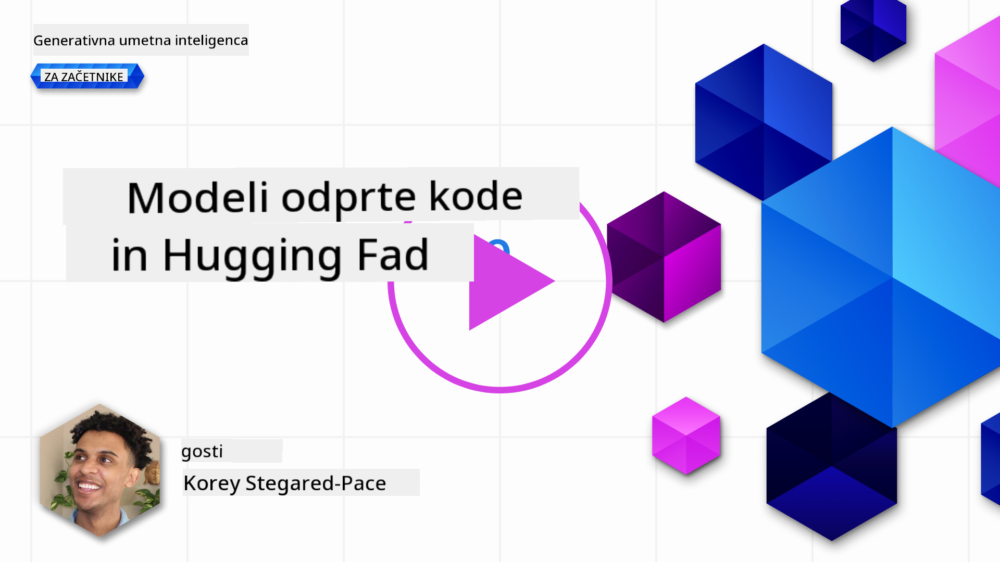
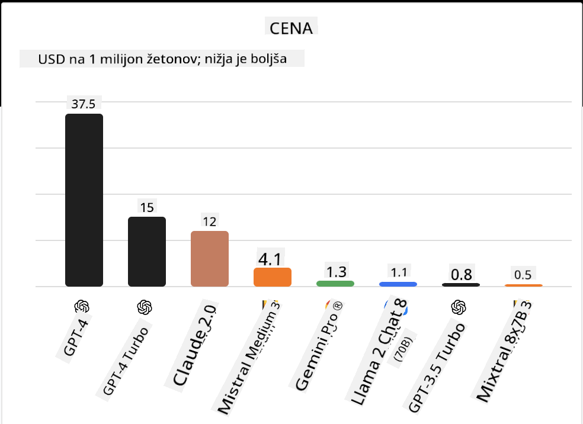
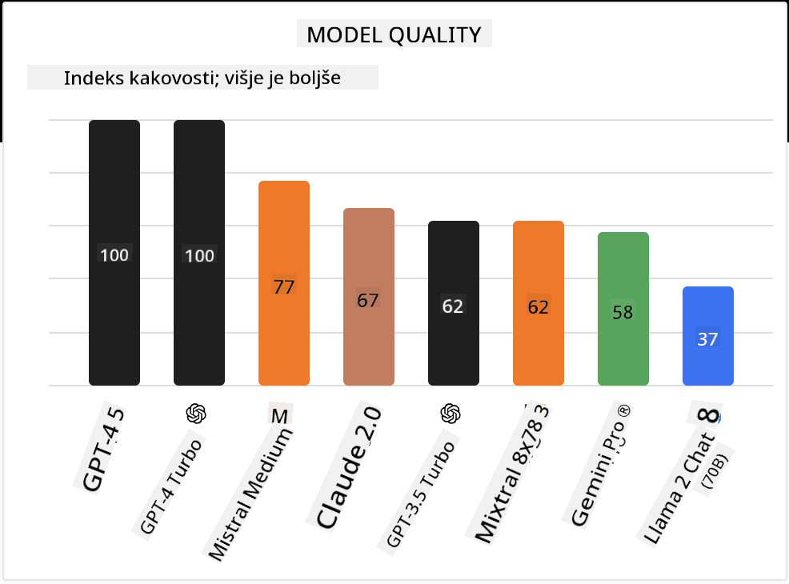

<!--
CO_OP_TRANSLATOR_METADATA:
{
  "original_hash": "0bba96e53ab841d99db731892a51fab8",
  "translation_date": "2025-07-09T17:16:11+00:00",
  "source_file": "16-open-source-models/README.md",
  "language_code": "sl"
}
-->

## Uvod

Svet odprtokodnih LLM-jev je razburljiv in se nenehno razvija. Ta lekcija ponuja poglobljen vpogled v odprtokodne modele. Če iščete informacije o tem, kako se lastniški modeli primerjajo z odprtokodnimi, pojdite na lekcijo ["Raziskovanje in primerjava različnih LLM-jev"](../02-exploring-and-comparing-different-llms/README.md?WT.mc_id=academic-105485-koreyst). Ta lekcija bo prav tako obravnavala temo fine-tuninga, podrobnejša razlaga pa je na voljo v lekciji ["Fine-Tuning LLMs"](../18-fine-tuning/README.md?WT.mc_id=academic-105485-koreyst).

## Cilji učenja

- Razumevanje odprtokodnih modelov  
- Spoznati prednosti dela z odprtokodnimi modeli  
- Raziskati odprte modele, ki so na voljo na Hugging Face in v Azure AI Studiu  

## Kaj so odprtokodni modeli?

Odprtokodna programska oprema je igrala ključno vlogo pri razvoju tehnologije na različnih področjih. Open Source Initiative (OSI) je določila [10 kriterijev za programsko opremo](https://web.archive.org/web/20241126001143/https://opensource.org/osd?WT.mc_id=academic-105485-koreyst), da se lahko uvrsti med odprtokodno. Izvorna koda mora biti javno dostopna pod licenco, ki jo odobri OSI.

Čeprav razvoj LLM-jev vsebuje podobne elemente kot razvoj programske opreme, proces ni povsem enak. To je sprožilo veliko razprav v skupnosti o definiciji odprtokodnosti v kontekstu LLM-jev. Da bi model ustrezal tradicionalni definiciji odprtokodnosti, bi morale biti javno dostopne naslednje informacije:

- Podatkovni nizi, uporabljeni za treniranje modela  
- Polne uteži modela kot del treninga  
- Koda za ocenjevanje  
- Koda za fine-tuning  
- Polne uteži modela in metrike treninga  

Trenutno je le nekaj modelov, ki izpolnjujejo te kriterije. [OLMo model, ki ga je ustvaril Allen Institute for Artificial Intelligence (AllenAI)](https://huggingface.co/allenai/OLMo-7B?WT.mc_id=academic-105485-koreyst) je eden izmed njih.

V tej lekciji bomo modele naprej imenovali "odprti modeli", saj morda v času pisanja ne izpolnjujejo vseh zgornjih kriterijev.

## Prednosti odprtih modelov

**Zelo prilagodljivi** – Ker so odprti modeli objavljeni z natančnimi informacijami o treningu, lahko raziskovalci in razvijalci spreminjajo notranjost modela. To omogoča ustvarjanje zelo specializiranih modelov, ki so prilagojeni za določeno nalogo ali področje. Nekateri primeri so generiranje kode, matematične operacije in biologija.

**Stroški** – Stroški na token za uporabo in uvajanje teh modelov so nižji kot pri lastniških modelih. Pri gradnji aplikacij Generativne AI je pomembno upoštevati razmerje med zmogljivostjo in ceno glede na vaš primer uporabe.

  
Vir: Artificial Analysis

**Fleksibilnost** – Delo z odprtimi modeli omogoča prilagodljivost pri uporabi različnih modelov ali njihovi kombinaciji. Primer tega so [HuggingChat asistenti](https://huggingface.co/chat?WT.mc_id=academic-105485-koreyst), kjer lahko uporabnik neposredno v uporabniškem vmesniku izbere model, ki ga želi uporabljati:

## Raziskovanje različnih odprtih modelov

### Llama 2

[LLama2](https://huggingface.co/meta-llama?WT.mc_id=academic-105485-koreyst), ki ga je razvil Meta, je odprt model, optimiziran za klepetalne aplikacije. To je posledica njegove metode fine-tuninga, ki je vključevala veliko količino dialoga in povratnih informacij ljudi. S to metodo model proizvaja rezultate, ki so bolj usklajeni s pričakovanji ljudi, kar izboljša uporabniško izkušnjo.

Nekateri primeri fine-tuniranih različic Llama so [Japanese Llama](https://huggingface.co/elyza/ELYZA-japanese-Llama-2-7b?WT.mc_id=academic-105485-koreyst), specializiran za japonščino, in [Llama Pro](https://huggingface.co/TencentARC/LLaMA-Pro-8B?WT.mc_id=academic-105485-koreyst), izboljšana različica osnovnega modela.

### Mistral

[Mistral](https://huggingface.co/mistralai?WT.mc_id=academic-105485-koreyst) je odprt model, ki se osredotoča na visoko zmogljivost in učinkovitost. Uporablja pristop Mixture-of-Experts, ki združuje skupino specializiranih ekspertnih modelov v en sistem, kjer se glede na vhod izberejo določeni modeli za uporabo. To naredi izračune bolj učinkovite, saj modeli obravnavajo le tiste vhode, za katere so specializirani.

Nekateri primeri fine-tuniranih različic Mistral so [BioMistral](https://huggingface.co/BioMistral/BioMistral-7B?text=Mon+nom+est+Thomas+et+mon+principal?WT.mc_id=academic-105485-koreyst), osredotočen na medicinsko področje, in [OpenMath Mistral](https://huggingface.co/nvidia/OpenMath-Mistral-7B-v0.1-hf?WT.mc_id=academic-105485-koreyst), ki izvaja matematične izračune.

### Falcon

[Falcon](https://huggingface.co/tiiuae?WT.mc_id=academic-105485-koreyst) je LLM, ki ga je ustvaril Technology Innovation Institute (**TII**). Falcon-40B je bil treniran na 40 milijardah parametrov in je pokazal boljše rezultate kot GPT-3 ob manjši porabi računske moči. To je posledica uporabe algoritma FlashAttention in multiquery attention, ki zmanjšujeta zahteve po pomnilniku med inferenco. Zaradi skrajšanega časa inferenc je Falcon-40B primeren za klepetalne aplikacije.

Nekateri primeri fine-tuniranih različic Falcon so [OpenAssistant](https://huggingface.co/OpenAssistant/falcon-40b-sft-top1-560?WT.mc_id=academic-105485-koreyst), asistent zgrajen na odprtih modelih, in [GPT4ALL](https://huggingface.co/nomic-ai/gpt4all-falcon?WT.mc_id=academic-105485-koreyst), ki nudi boljšo zmogljivost kot osnovni model.

## Kako izbrati

Za izbiro odprtega modela ni enega samega odgovora. Dobro izhodišče je uporaba funkcije filtriranja po nalogi v Azure AI Studiu. To vam bo pomagalo razumeti, za katere vrste nalog je bil model treniran. Hugging Face prav tako vzdržuje LLM Leaderboard, ki prikazuje najbolje delujoče modele glede na določene metrike.

Če želite primerjati LLM-je med različnimi vrstami, je [Artificial Analysis](https://artificialanalysis.ai/?WT.mc_id=academic-105485-koreyst) še en odličen vir:

  
Vir: Artificial Analysis

Če delate na specifičnem primeru uporabe, je lahko učinkovito iskati fine-tunirane različice, osredotočene na isto področje. Prav tako je dobra praksa eksperimentirati z več odprtimi modeli, da vidite, kako se obnašajo glede na vaša in pričakovanja vaših uporabnikov.

## Naslednji koraki

Najboljše pri odprtih modelih je, da lahko hitro začnete z delom z njimi. Oglejte si [Azure AI Studio Model Catalog](https://ai.azure.com?WT.mc_id=academic-105485-koreyst), ki vsebuje posebno zbirko Hugging Face z modeli, o katerih smo tukaj govorili.

## Učenje se tukaj ne konča, nadaljujte pot

Po zaključku te lekcije si oglejte našo [Generative AI Learning collection](https://aka.ms/genai-collection?WT.mc_id=academic-105485-koreyst), da še naprej nadgrajujete svoje znanje o Generativni AI!

**Omejitev odgovornosti**:  
Ta dokument je bil preveden z uporabo storitve za avtomatski prevod AI [Co-op Translator](https://github.com/Azure/co-op-translator). Čeprav si prizadevamo za natančnost, vas opozarjamo, da lahko avtomatizirani prevodi vsebujejo napake ali netočnosti. Izvirni dokument v njegovem izvirnem jeziku velja za avtoritativni vir. Za ključne informacije priporočamo strokovni človeški prevod. Za morebitna nesporazume ali napačne interpretacije, ki izhajajo iz uporabe tega prevoda, ne odgovarjamo.