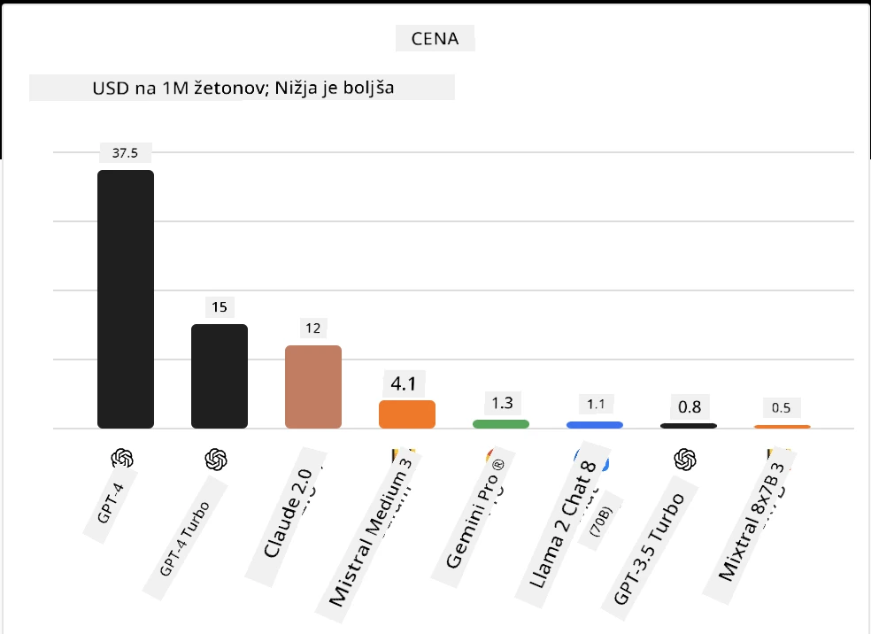
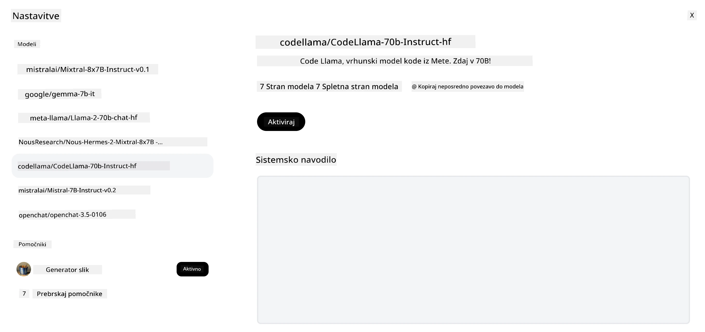
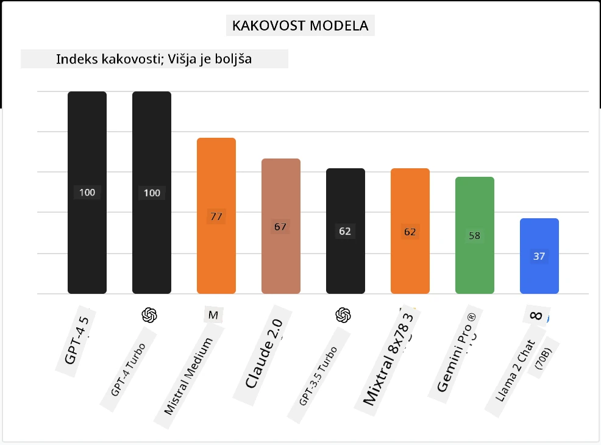

## Uvod

Svet odprtokodnih velikih jezikovnih modelov (LLM) je razburljiv in se nenehno razvija. Ta lekcija si prizadeva ponuditi poglobljen pogled na odprtokodne modele. Če iščete informacije o tem, kako se lastniški modeli primerjajo z odprtokodnimi modeli, pojdite na ["Raziskovanje in primerjanje različnih LLM-jev"](../02-exploring-and-comparing-different-llms/README.md?WT.mc_id=academic-105485-koreyst). Ta lekcija bo prav tako zajemala temo fino nastavljanja, podrobnejša razlaga pa je na voljo v ["Fino nastavljanje LLM-jev"](../18-fine-tuning/README.md?WT.mc_id=academic-105485-koreyst).

## Cilji učenja

- Pridobiti razumevanje odprtokodnih modelov
- Razumeti koristi dela z odprtokodnimi modeli
- Raziščite odprte modele, ki so na voljo na Hugging Face in v katalogu modelov Microsoft Foundry

## Kaj so odprtokodni modeli?

Odprtokodna programska oprema je igrala ključno vlogo pri rasti tehnologije na različnih področjih. Iniciativa za odprto kodo (OSI) je opredelila [10 meril za programsko opremo](https://web.archive.org/web/20241126001143/https://opensource.org/osd?WT.mc_id=academic-105485-koreyst), da se uvrsti med odprtokodno. Izvorna koda mora biti javno deljena pod licenco, ki jo odobri OSI.

Čeprav ima razvoj LLM-jev podobne elemente kot razvoj programske opreme, postopek ni povsem enak. To je povzročilo veliko razprav v skupnosti o opredelitvi odprtokodnosti v kontekstu LLM-jev. Za model, da ustreza tradicionalni opredelitvi odprtokodnosti, morajo biti naslednji podatki javno dostopni:

- Podatkovni nizi, uporabljeni za treniranje modela.
- Polne uteži modela kot del treninga.
- Koda za ocenjevanje.
- Koda za fino nastavljanje.
- Polne uteži modela in metrike treniranja.

Trenutno je le nekaj modelov, ki izpolnjujejo ta merila. [Model OLMo, ki ga je ustvaril Allen Institute for Artificial Intelligence (AllenAI)](https://huggingface.co/allenai/OLMo-7B?WT.mc_id=academic-105485-koreyst) je eden izmed njih.

V tej lekciji bomo modele naprej imenovali "odprti modeli", saj morda v času pisanja ne ustrezajo vsem zgornjim kriterijem.

## Prednosti odprtih modelov

**Zelo prilagodljivi** - Ker so odprti modeli izdani z vsemi podrobnostmi o treningu, lahko raziskovalci in razvijalci spreminjajo notranjost modela. To omogoča ustvarjanje zelo specializiranih modelov, ki so fino nastavljeni za določen nalogo ali študijsko področje. Nekateri primeri tega so generiranje kode, matematične operacije in biologija.

**Stroški** - Strošek na token za uporabo in uvajanje teh modelov je nižji kot pri lastniških modelih. Pri gradnji aplikacij generativne umetne inteligence je priporočljivo upoštevati razmerje med zmogljivostjo in ceno, ko delate z temi modeli za vaš primer uporabe.

Vir: Artificial Analysis

**Prilagodljivost** - Delo z odprtimi modeli vam omogoča fleksibilnost pri uporabi različnih modelov ali njihovi kombinaciji. Primer tega so [HuggingChat asistenti](https://huggingface.co/chat?WT.mc_id=academic-105485-koreyst), kjer lahko uporabnik neposredno v uporabniškem vmesniku izbere model:

## Raziščite različne odprte modele

### Llama 2

[Llama2](https://huggingface.co/meta-llama?WT.mc_id=academic-105485-koreyst), razvit pri Meta, je odprt model, optimiziran za aplikacije, ki temeljijo na klepetu. To je posledica njegove metode fino nastavljanja, ki je vključevala veliko količino dialoga in povratnih informacij ljudi. S to metodo model proizvaja rezultate, ki so bolj skladni s pričakovanji ljudi, kar izboljša uporabniško izkušnjo.

Nekateri primeri fino nastavljenih različic Llama so [Japonska Llama](https://huggingface.co/elyza/ELYZA-japanese-Llama-2-7b?WT.mc_id=academic-105485-koreyst), ki je specializirana za japonščino, in [Llama Pro](https://huggingface.co/TencentARC/LLaMA-Pro-8B?WT.mc_id=academic-105485-koreyst), ki je izboljšana različica osnovnega modela.

### Mistral

[Mistral](https://huggingface.co/mistralai?WT.mc_id=academic-105485-koreyst) je odprt model z močno usmeritvijo na visoko zmogljivost in učinkovitost. Uporablja pristop z mešanico strokovnjakov (Mixture-of-Experts), ki združuje skupino specializiranih ekspertnih modelov v en sistem, kjer se glede na vhod izberejo določeni modeli za uporabo. To naredi računalniško procesiranje bolj učinkovito, saj se modeli ukvarjajo le z vhodom, za katerega so specializirani.

Nekateri primeri fino nastavljenih različic Mistrala so [BioMistral](https://huggingface.co/BioMistral/BioMistral-7B?text=Mon+nom+est+Thomas+et+mon+principal?WT.mc_id=academic-105485-koreyst), ki je osredotočen na medicinsko področje, in [OpenMath Mistral](https://huggingface.co/nvidia/OpenMath-Mistral-7B-v0.1-hf?WT.mc_id=academic-105485-koreyst), ki izvaja matematične izračune.

### Falcon

[Falcon](https://huggingface.co/tiiuae?WT.mc_id=academic-105485-koreyst) je LLM, ki ga je ustvaril Technology Innovation Institute (**TII**). Falcon-40B je bil usposobljen na 40 milijardah parametrov, kar naj bi bilo boljše od GPT-3 z manjšo porabo računske moči. To je posledica uporabe algoritma FlashAttention in multiquery attention, ki mu omogoča zmanjšanje zahtev po pomnilniku med izvajanjem. Zaradi skrajšanega časa izvajanja je Falcon-40B primeren za klepetalne aplikacije.

Nekateri primeri fino nastavljenih različic Falcona so [OpenAssistant](https://huggingface.co/OpenAssistant/falcon-40b-sft-top1-560?WT.mc_id=academic-105485-koreyst), asistent zgrajen na odprtih modelih, in [GPT4ALL](https://huggingface.co/nomic-ai/gpt4all-falcon?WT.mc_id=academic-105485-koreyst), ki nudi boljše zmogljivosti kot osnovni model.

## Kako izbrati

Za izbiro odprtega modela ni enoznačnega odgovora. Dober začetek je uporaba filtra po nalogi v kataloga modelov Microsoft Foundry. To vam bo pomagalo razumeti, za katere vrste nalog je bil model usposobljen. Hugging Face prav tako vzdržuje lestvico LLM, ki prikazuje najbolj uspešne modele glede na določene metrike.

Ko želite primerjati LLM-je med različnimi vrstami, je [Artificial Analysis](https://artificialanalysis.ai/?WT.mc_id=academic-105485-koreyst) še en odličen vir:

Vir: Artificial Analysis

Če delate na specifičnem primeru uporabe, je lahko koristno iskati fino nastavljene različice, ki so usmerjene na isto področje. Preizkušanje več odprtih modelov, da vidite, kako delujejo glede na vaša in pričakovanja uporabnikov, je prav tako dobra praksa.

## Naslednji koraki

Najboljši del odprtih modelov je, da lahko z njimi začnete delati zelo hitro. Oglejte si [Microsoft Foundry katalog modelov](https://ai.azure.com?WT.mc_id=academic-105485-koreyst), ki vsebuje tudi posebno zbirko Hugging Face z modeli, o katerih smo tukaj govorili.

## Učenje se tukaj ne konča, nadaljujte potovanje

Po zaključku te lekcije si oglejte našo [Generativno AI zbirko za učenje](https://aka.ms/genai-collection?WT.mc_id=academic-105485-koreyst), da še naprej nadgrajujete svoje znanje o generativni umetni inteligenci!

---

<!-- CO-OP TRANSLATOR DISCLAIMER START -->
**Omejitev odgovornosti**:
Ta dokument je bil preveden z uporabo AI prevajalske storitve [Co-op Translator](https://github.com/Azure/co-op-translator). Čeprav si prizadevamo za natančnost, vas prosimo, da upoštevate, da avtomatizirani prevodi lahko vsebujejo napake ali netočnosti. Izvirni dokument v njegovem izvirnem jeziku je treba obravnavati kot avtoritativni vir. Za kritične informacije je priporočljiv strokovni človeški prevod. Ne odgovarjamo za morebitna nesporazume ali napačne interpretacije, ki izhajajo iz uporabe tega prevoda.
<!-- CO-OP TRANSLATOR DISCLAIMER END -->