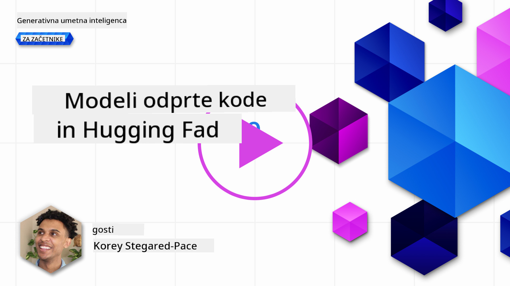
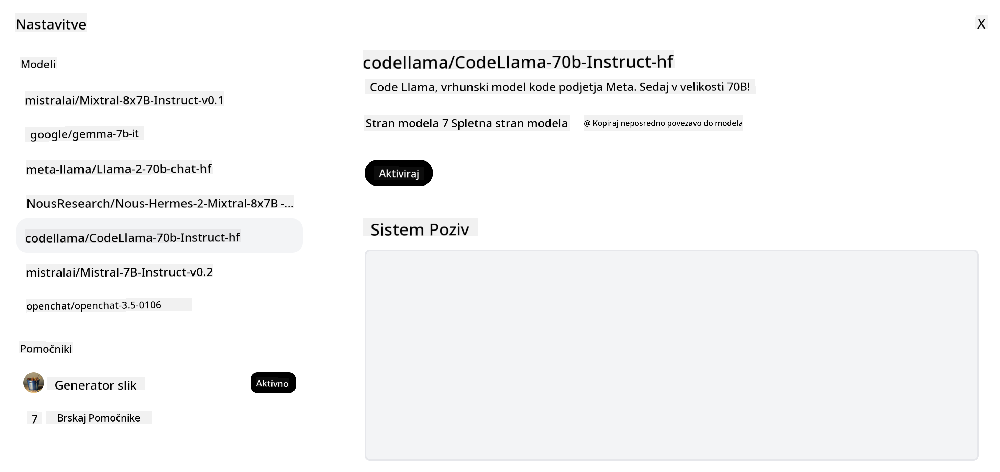
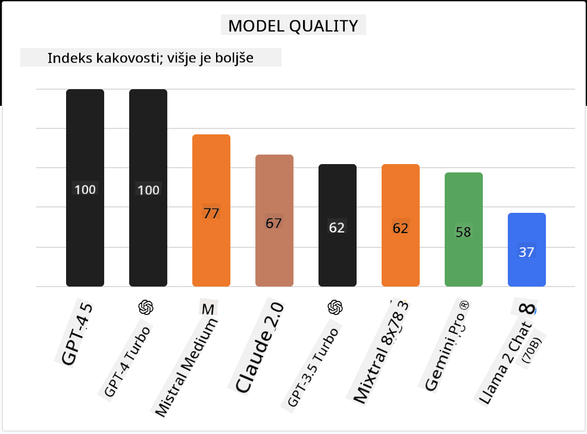

<!--
CO_OP_TRANSLATOR_METADATA:
{
  "original_hash": "0bba96e53ab841d99db731892a51fab8",
  "translation_date": "2025-06-26T00:05:38+00:00",
  "source_file": "16-open-source-models/README.md",
  "language_code": "sl"
}
-->

## Uvod

Svet odprtokodnih LLM-jev je vznemirljiv in se nenehno razvija. Namen te lekcije je zagotoviti poglobljen pogled na odprtokodne modele. Če iščete informacije o tem, kako se lastniški modeli primerjajo z odprtokodnimi modeli, pojdite na lekcijo ["Raziskovanje in primerjava različnih LLM-jev"](../02-exploring-and-comparing-different-llms/README.md?WT.mc_id=academic-105485-koreyst). Ta lekcija bo obravnavala tudi temo prilagajanja, vendar je bolj podrobna razlaga na voljo v lekciji ["Prilagajanje LLM-jev"](../18-fine-tuning/README.md?WT.mc_id=academic-105485-koreyst).

## Cilji učenja

- Pridobiti razumevanje odprtokodnih modelov
- Razumevanje prednosti dela z odprtokodnimi modeli
- Raziskovanje odprtih modelov, ki so na voljo na Hugging Face in Azure AI Studio

## Kaj so odprtokodni modeli?

Odprtokodna programska oprema je igrala ključno vlogo pri rasti tehnologije na različnih področjih. Iniciativa za odprto kodo (OSI) je določila [10 meril za programsko opremo](https://web.archive.org/web/20241126001143/https://opensource.org/osd?WT.mc_id=academic-105485-koreyst), da se lahko klasificira kot odprtokodna. Izvorna koda mora biti javno deljena pod licenco, ki jo odobri OSI.

Čeprav razvoj LLM-jev vsebuje podobne elemente kot razvoj programske opreme, proces ni popolnoma enak. To je v skupnosti povzročilo veliko razprav o definiciji odprte kode v kontekstu LLM-jev. Da bi model ustrezal tradicionalni definiciji odprte kode, bi morale biti naslednje informacije javno dostopne:

- Nabori podatkov, uporabljeni za treniranje modela.
- Polne uteži modela kot del treninga.
- Koda za evalvacijo.
- Koda za prilagajanje.
- Polne uteži modela in meritve treninga.

Trenutno obstaja le nekaj modelov, ki ustrezajo tem kriterijem. [Model OLMo, ki ga je ustvaril Allen Institute for Artificial Intelligence (AllenAI)](https://huggingface.co/allenai/OLMo-7B?WT.mc_id=academic-105485-koreyst) je eden izmed njih.

Za to lekcijo bomo modele v nadaljevanju imenovali "odprti modeli", saj morda v času pisanja ne ustrezajo zgornjim kriterijem.

## Prednosti odprtih modelov

**Zelo prilagodljivi** - Ker so odprti modeli izdani z natančnimi informacijami o treningu, lahko raziskovalci in razvijalci spreminjajo notranjost modela. To omogoča ustvarjanje zelo specializiranih modelov, ki so prilagojeni za določeno nalogo ali področje študija. Nekateri primeri tega so generiranje kode, matematične operacije in biologija.

**Stroški** - Stroški na žeton za uporabo in uvajanje teh modelov so nižji kot pri lastniških modelih. Pri gradnji aplikacij Generativne umetne inteligence je potrebno upoštevati zmogljivost v primerjavi s ceno pri delu s temi modeli za vaš primer uporabe.

 Vir: Artificial Analysis

**Fleksibilnost** - Delo z odprtimi modeli omogoča fleksibilnost pri uporabi različnih modelov ali njihovem kombiniranju. Primer tega je [HuggingChat Assistants](https://huggingface.co/chat?WT.mc_id=academic-105485-koreyst), kjer lahko uporabnik neposredno v uporabniškem vmesniku izbere model, ki se uporablja:

## Raziskovanje različnih odprtih modelov

### Llama 2

[LLama2](https://huggingface.co/meta-llama?WT.mc_id=academic-105485-koreyst), ki ga je razvil Meta, je odprt model, optimiziran za aplikacije, ki temeljijo na klepetu. To je posledica njegove metode prilagajanja, ki je vključevala veliko količino dialoga in povratnih informacij ljudi. S to metodo model ustvarja več rezultatov, ki so usklajeni s pričakovanji ljudi, kar zagotavlja boljšo uporabniško izkušnjo.

Nekateri primeri prilagojenih različic Llama vključujejo [Japanese Llama](https://huggingface.co/elyza/ELYZA-japanese-Llama-2-7b?WT.mc_id=academic-105485-koreyst), ki se specializira za japonščino in [Llama Pro](https://huggingface.co/TencentARC/LLaMA-Pro-8B?WT.mc_id=academic-105485-koreyst), ki je izboljšana različica osnovnega modela.

### Mistral

[Mistral](https://huggingface.co/mistralai?WT.mc_id=academic-105485-koreyst) je odprt model z močnim poudarkom na visoki zmogljivosti in učinkovitosti. Uporablja pristop Mešanice strokovnjakov, ki združuje skupino specializiranih strokovnih modelov v en sistem, kjer se glede na vhod izberejo določeni modeli. To naredi izračun bolj učinkovit, saj se modeli ukvarjajo le z vhodi, za katere so specializirani.

Nekateri primeri prilagojenih različic Mistral vključujejo [BioMistral](https://huggingface.co/BioMistral/BioMistral-7B?text=Mon+nom+est+Thomas+et+mon+principal?WT.mc_id=academic-105485-koreyst), ki je osredotočen na medicinsko področje, in [OpenMath Mistral](https://huggingface.co/nvidia/OpenMath-Mistral-7B-v0.1-hf?WT.mc_id=academic-105485-koreyst), ki izvaja matematične izračune.

### Falcon

[Falcon](https://huggingface.co/tiiuae?WT.mc_id=academic-105485-koreyst) je LLM, ki ga je ustvaril Inštitut za tehnološke inovacije (**TII**). Falcon-40B je bil usposobljen na 40 milijardah parametrov, kar se je izkazalo za boljše kot GPT-3 z manjšim proračunom za izračune. To je posledica njegove uporabe algoritma FlashAttention in večpoizvedbene pozornosti, ki mu omogoča zmanjšanje zahtev po pomnilniku v času sklepanja. Zaradi tega skrajšanega časa sklepanja je Falcon-40B primeren za aplikacije klepeta.

Nekateri primeri prilagojenih različic Falcon so [OpenAssistant](https://huggingface.co/OpenAssistant/falcon-40b-sft-top1-560?WT.mc_id=academic-105485-koreyst), asistent, zgrajen na odprtih modelih, in [GPT4ALL](https://huggingface.co/nomic-ai/gpt4all-falcon?WT.mc_id=academic-105485-koreyst), ki zagotavlja višjo zmogljivost kot osnovni model.

## Kako izbrati

Ni enega odgovora za izbiro odprtega modela. Dober začetek je uporaba funkcije filtriranja po nalogi v Azure AI Studio. To vam bo pomagalo razumeti, za katere vrste nalog je bil model usposobljen. Hugging Face prav tako vzdržuje LLM Leaderboard, ki vam pokaže najbolje delujoče modele na podlagi določenih meril.

Ko želite primerjati LLM-je med različnimi vrstami, je [Artificial Analysis](https://artificialanalysis.ai/?WT.mc_id=academic-105485-koreyst) še en odličen vir:

 Vir: Artificial Analysis

Če delate na specifičnem primeru uporabe, je lahko učinkovito iskati prilagojene različice, ki so osredotočene na isto področje. Eksperimentiranje z več odprtimi modeli, da vidite, kako se izvedejo v skladu z vašimi in uporabniškimi pričakovanji, je še ena dobra praksa.

## Naslednji koraki

Najboljši del odprtih modelov je, da lahko začnete delati z njimi precej hitro. Oglejte si [Azure AI Studio Model Catalog](https://ai.azure.com?WT.mc_id=academic-105485-koreyst), ki vsebuje posebno zbirko Hugging Face s temi modeli, ki smo jih tukaj obravnavali.

## Učenje se tukaj ne konča, nadaljujte potovanje

Po zaključku te lekcije si oglejte našo [zbirko učenja Generativne AI](https://aka.ms/genai-collection?WT.mc_id=academic-105485-koreyst), da nadaljujete z nadgradnjo svojega znanja o Generativni AI!

**Omejitev odgovornosti**:  
Ta dokument je bil preveden z uporabo storitve AI prevajanja [Co-op Translator](https://github.com/Azure/co-op-translator). Čeprav se trudimo za natančnost, vas prosimo, da upoštevate, da lahko avtomatizirani prevodi vsebujejo napake ali netočnosti. Izvirni dokument v njegovem maternem jeziku naj se šteje za avtoritativni vir. Za ključne informacije se priporoča profesionalni človeški prevod. Ne odgovarjamo za morebitna nesporazumevanja ali napačne interpretacije, ki bi nastale zaradi uporabe tega prevoda.