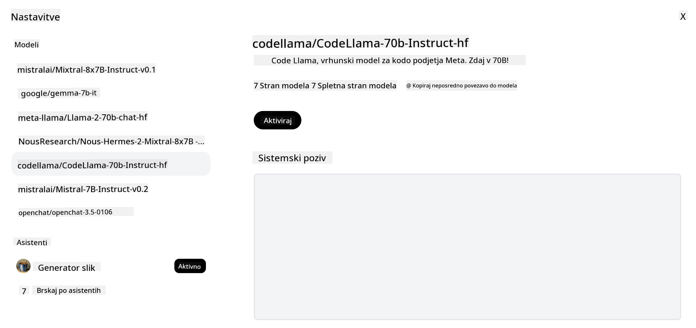

<!--
CO_OP_TRANSLATOR_METADATA:
{
  "original_hash": "a8b2d4bb727c877ebf9edff8623d16b9",
  "translation_date": "2025-09-06T10:25:38+00:00",
  "source_file": "16-open-source-models/README.md",
  "language_code": "sl"
}
-->

## Uvod

Svet odprtokodnih LLM-jev je vznemirljiv in se nenehno razvija. Namen te lekcije je ponuditi poglobljen pogled na odprtokodne modele. Če iščete informacije o tem, kako se lastniški modeli primerjajo z odprtokodnimi modeli, obiščite lekcijo ["Raziskovanje in primerjava različnih LLM-jev"](../02-exploring-and-comparing-different-llms/README.md?WT.mc_id=academic-105485-koreyst). Ta lekcija bo obravnavala tudi temo prilagajanja modelov, vendar podrobnejšo razlago najdete v lekciji ["Prilagajanje LLM-jev"](../18-fine-tuning/README.md?WT.mc_id=academic-105485-koreyst).

## Cilji učenja

- Razumevanje odprtokodnih modelov
- Razumevanje prednosti dela z odprtokodnimi modeli
- Raziskovanje odprtih modelov na Hugging Face in Azure AI Studio

## Kaj so odprtokodni modeli?

Odprtokodna programska oprema je igrala ključno vlogo pri razvoju tehnologije na različnih področjih. Pobuda za odprto kodo (OSI) je opredelila [10 kriterijev za programsko opremo](https://web.archive.org/web/20241126001143/https://opensource.org/osd?WT.mc_id=academic-105485-koreyst), da se lahko klasificira kot odprtokodna. Izvorna koda mora biti javno deljena pod licenco, ki jo odobri OSI.

Čeprav razvoj LLM-jev vključuje podobne elemente kot razvoj programske opreme, proces ni povsem enak. To je sprožilo veliko razprav v skupnosti o definiciji odprte kode v kontekstu LLM-jev. Da bi bil model usklajen s tradicionalno definicijo odprte kode, morajo biti javno dostopne naslednje informacije:

- Podatkovne zbirke, uporabljene za učenje modela.
- Polne uteži modela kot del učenja.
- Koda za evalvacijo.
- Koda za prilagajanje.
- Polne uteži modela in metrične vrednosti učenja.

Trenutno obstaja le nekaj modelov, ki ustrezajo tem kriterijem. [Model OLMo, ki ga je ustvaril Allen Institute for Artificial Intelligence (AllenAI)](https://huggingface.co/allenai/OLMo-7B?WT.mc_id=academic-105485-koreyst), je eden izmed njih.

Za to lekcijo bomo modele v nadaljevanju imenovali "odprti modeli", saj morda ne ustrezajo zgornjim kriterijem v času pisanja.

## Prednosti odprtih modelov

**Visoka prilagodljivost** - Ker so odprti modeli objavljeni z natančnimi informacijami o učenju, lahko raziskovalci in razvijalci spreminjajo notranjo strukturo modela. To omogoča ustvarjanje zelo specializiranih modelov, ki so prilagojeni za določeno nalogo ali področje raziskovanja. Nekateri primeri vključujejo generiranje kode, matematične operacije in biologijo.

**Stroški** - Stroški na token za uporabo in uvajanje teh modelov so nižji kot pri lastniških modelih. Pri gradnji aplikacij za generativno umetno inteligenco je treba upoštevati razmerje med zmogljivostjo in ceno glede na vaš primer uporabe.

  
Vir: Artificial Analysis

**Fleksibilnost** - Delo z odprtimi modeli omogoča fleksibilnost pri uporabi različnih modelov ali njihovi kombinaciji. Primer tega je [HuggingChat Assistants](https://huggingface.co/chat?WT.mc_id=academic-105485-koreyst), kjer lahko uporabnik neposredno v uporabniškem vmesniku izbere model, ki se uporablja:

## Raziskovanje različnih odprtih modelov

### Llama 2

[LLama2](https://huggingface.co/meta-llama?WT.mc_id=academic-105485-koreyst), ki ga je razvil Meta, je odprti model, optimiziran za aplikacije, ki temeljijo na klepetu. To je posledica metode prilagajanja, ki je vključevala veliko količino dialogov in povratnih informacij ljudi. S to metodo model ustvarja rezultate, ki so bolj usklajeni s pričakovanji ljudi, kar zagotavlja boljšo uporabniško izkušnjo.

Nekateri primeri prilagojenih različic Llama vključujejo [Japanese Llama](https://huggingface.co/elyza/ELYZA-japanese-Llama-2-7b?WT.mc_id=academic-105485-koreyst), ki se specializira za japonščino, in [Llama Pro](https://huggingface.co/TencentARC/LLaMA-Pro-8B?WT.mc_id=academic-105485-koreyst), ki je izboljšana različica osnovnega modela.

### Mistral

[Mistral](https://huggingface.co/mistralai?WT.mc_id=academic-105485-koreyst) je odprti model, ki se osredotoča na visoko zmogljivost in učinkovitost. Uporablja pristop Mixture-of-Experts, ki združuje skupino specializiranih ekspertnih modelov v en sistem, kjer se glede na vhodne podatke izberejo določeni modeli za uporabo. To naredi izračun bolj učinkovit, saj modeli obravnavajo le vhodne podatke, za katere so specializirani.

Nekateri primeri prilagojenih različic Mistral vključujejo [BioMistral](https://huggingface.co/BioMistral/BioMistral-7B?text=Mon+nom+est+Thomas+et+mon+principal?WT.mc_id=academic-105485-koreyst), ki se osredotoča na medicinsko področje, in [OpenMath Mistral](https://huggingface.co/nvidia/OpenMath-Mistral-7B-v0.1-hf?WT.mc_id=academic-105485-koreyst), ki izvaja matematične izračune.

### Falcon

[Falcon](https://huggingface.co/tiiuae?WT.mc_id=academic-105485-koreyst) je LLM, ki ga je ustvaril Technology Innovation Institute (**TII**). Falcon-40B je bil naučen na 40 milijard parametrov, kar se je izkazalo za boljše od GPT-3 z manjšo porabo računalniških virov. To je posledica uporabe algoritma FlashAttention in večpoizvedbene pozornosti, ki omogočata zmanjšanje zahtev po pomnilniku med časom sklepanja. Zaradi zmanjšanega časa sklepanja je Falcon-40B primeren za aplikacije, ki temeljijo na klepetu.

Nekateri primeri prilagojenih različic Falcon vključujejo [OpenAssistant](https://huggingface.co/OpenAssistant/falcon-40b-sft-top1-560?WT.mc_id=academic-105485-koreyst), asistenta, zgrajenega na odprtih modelih, in [GPT4ALL](https://huggingface.co/nomic-ai/gpt4all-falcon?WT.mc_id=academic-105485-koreyst), ki zagotavlja boljšo zmogljivost kot osnovni model.

## Kako izbrati

Ni enega samega odgovora za izbiro odprtega modela. Dober začetek je uporaba funkcije filtriranja po nalogi v Azure AI Studio. To vam bo pomagalo razumeti, za katere vrste nalog je bil model naučen. Hugging Face prav tako vzdržuje LLM Leaderboard, ki prikazuje najbolje delujoče modele glede na določene metrike.

Pri primerjavi LLM-jev različnih vrst je [Artificial Analysis](https://artificialanalysis.ai/?WT.mc_id=academic-105485-koreyst) še en odličen vir:

  
Vir: Artificial Analysis

Če delate na specifičnem primeru uporabe, je iskanje prilagojenih različic, ki se osredotočajo na isto področje, lahko učinkovito. Eksperimentiranje z več odprtimi modeli, da vidite, kako se obnašajo glede na vaša pričakovanja in pričakovanja vaših uporabnikov, je prav tako dobra praksa.

## Naslednji koraki

Najboljši del odprtih modelov je, da lahko začnete delati z njimi zelo hitro. Oglejte si [Azure AI Foundry Model Catalog](https://ai.azure.com?WT.mc_id=academic-105485-koreyst), ki vključuje posebno zbirko Hugging Face z modeli, o katerih smo govorili tukaj.

## Učenje se tukaj ne konča, nadaljujte pot

Po zaključku te lekcije si oglejte našo [Generative AI Learning collection](https://aka.ms/genai-collection?WT.mc_id=academic-105485-koreyst), da nadaljujete z nadgradnjo svojega znanja o generativni umetni inteligenci!

---

**Omejitev odgovornosti**:  
Ta dokument je bil preveden z uporabo storitve za prevajanje z umetno inteligenco [Co-op Translator](https://github.com/Azure/co-op-translator). Čeprav si prizadevamo za natančnost, vas prosimo, da upoštevate, da lahko avtomatizirani prevodi vsebujejo napake ali netočnosti. Izvirni dokument v njegovem maternem jeziku je treba obravnavati kot avtoritativni vir. Za ključne informacije priporočamo profesionalni človeški prevod. Ne prevzemamo odgovornosti za morebitna nesporazumevanja ali napačne razlage, ki bi nastale zaradi uporabe tega prevoda.