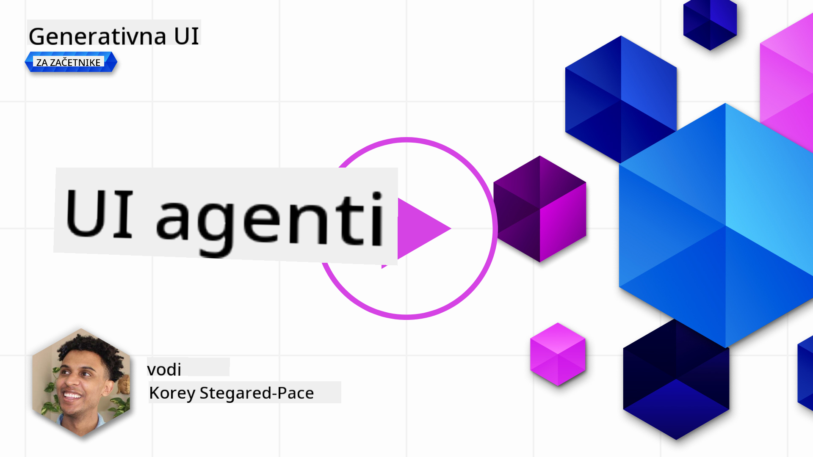
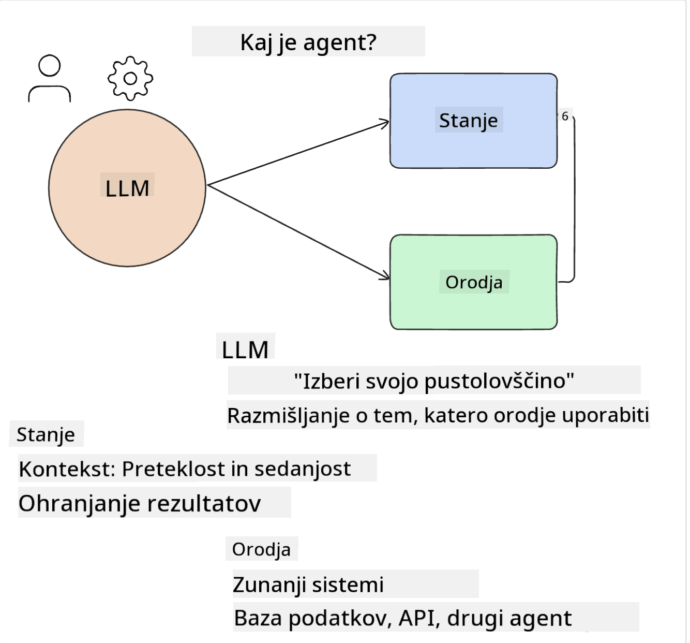
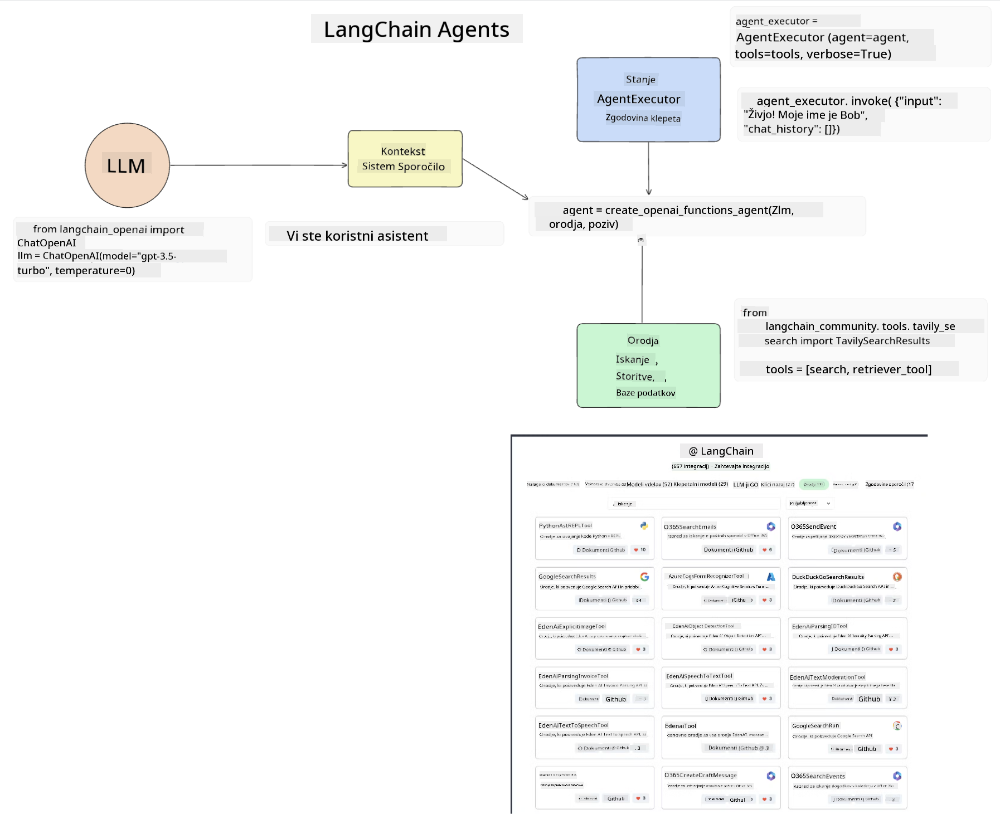
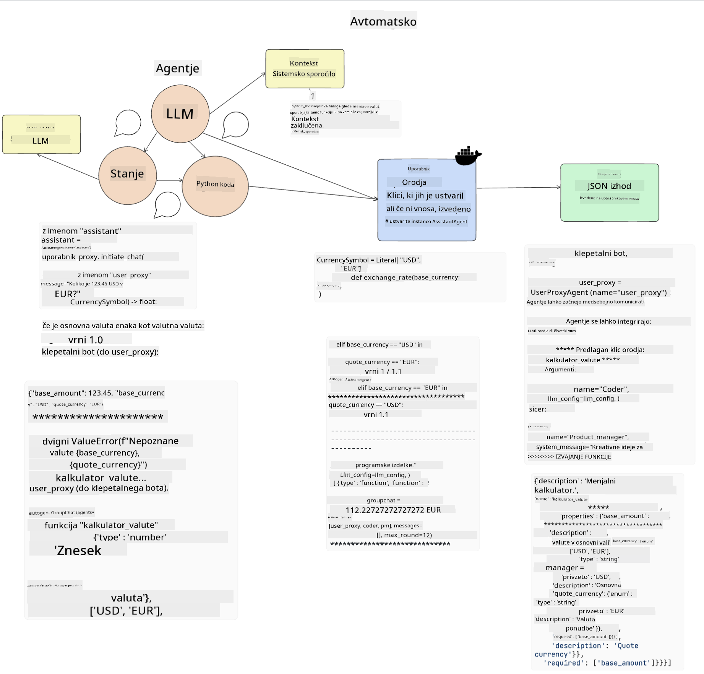
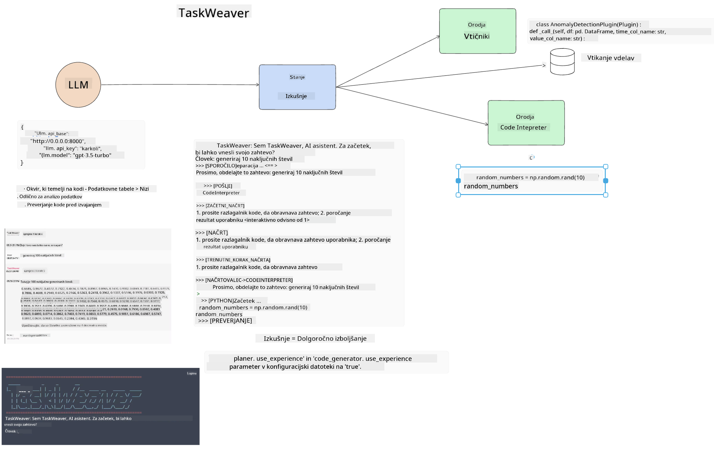

<!--
CO_OP_TRANSLATOR_METADATA:
{
  "original_hash": "11f03c81f190d9cbafd0f977dcbede6c",
  "translation_date": "2025-05-20T07:33:28+00:00",
  "source_file": "17-ai-agents/README.md",
  "language_code": "sl"
}
-->
[](https://aka.ms/gen-ai-lesson17-gh?WT.mc_id=academic-105485-koreyst)

## Uvod

AI agenti predstavljajo vznemirljiv napredek v Generativni AI, saj omogočajo velikim jezikovnim modelom (LLM), da se razvijejo iz pomočnikov v agente, sposobne izvajanja dejanj. Okviri AI agentov omogočajo razvijalcem ustvarjanje aplikacij, ki LLM-jem omogočajo dostop do orodij in upravljanja stanja. Ti okviri prav tako izboljšajo preglednost, kar uporabnikom in razvijalcem omogoča spremljanje dejanj, ki jih načrtujejo LLM-ji, s čimer se izboljša upravljanje izkušenj.

Lekcija bo zajemala naslednja področja:

- Razumevanje, kaj je AI agent - Kaj pravzaprav je AI agent?
- Raziskovanje štirih različnih okvirov AI agentov - Kaj jih dela edinstvene?
- Uporaba teh AI agentov v različnih primerih uporabe - Kdaj naj uporabimo AI agente?

## Cilji učenja

Po tej lekciji boste lahko:

- Pojasnili, kaj so AI agenti in kako jih lahko uporabimo.
- Razumeli razlike med nekaterimi priljubljenimi okviri AI agentov in kako se razlikujejo.
- Razumeli, kako delujejo AI agenti, da bi lahko z njimi gradili aplikacije.

## Kaj so AI agenti?

AI agenti so zelo vznemirljivo področje v svetu Generativne AI. Z vznemirjenjem včasih pride tudi zmeda glede terminologije in njihove uporabe. Da bi stvari poenostavili in vključili večino orodij, ki se nanašajo na AI agente, bomo uporabili to definicijo:

AI agenti omogočajo velikim jezikovnim modelom (LLM), da opravljajo naloge, tako da jim omogočijo dostop do **stanja** in **orodij**.



Opredelimo te izraze:

**Veliki jezikovni modeli** - To so modeli, o katerih govorimo v tem tečaju, kot so GPT-3.5, GPT-4, Llama-2 itd.

**Stanje** - To se nanaša na kontekst, v katerem LLM deluje. LLM uporablja kontekst svojih preteklih dejanj in trenutni kontekst, kar vodi njegovo odločanje za nadaljnja dejanja. Okviri AI agentov omogočajo razvijalcem lažje vzdrževanje tega konteksta.

**Orodja** - Da bi LLM dokončal nalogo, ki jo je uporabnik zahteval in ki jo je LLM načrtoval, potrebuje dostop do orodij. Nekateri primeri orodij so lahko baza podatkov, API, zunanja aplikacija ali celo drug LLM!

Te definicije vam bodo upamo zagotovile dobro osnovo za nadaljevanje, ko bomo raziskovali, kako so implementirane. Raziskujmo nekaj različnih okvirov AI agentov:

## LangChain agenti

[LangChain agenti](https://python.langchain.com/docs/how_to/#agents?WT.mc_id=academic-105485-koreyst) so implementacija zgoraj podanih definicij.

Za upravljanje **stanja** uporablja vgrajeno funkcijo, imenovano `AgentExecutor`. Ta sprejema definirano `agent` in `tools`, ki so na voljo.

`Agent Executor` prav tako shranjuje zgodovino klepeta, da zagotovi kontekst klepeta.



LangChain ponuja [katalog orodij](https://integrations.langchain.com/tools?WT.mc_id=academic-105485-koreyst), ki jih je mogoče uvoziti v vašo aplikacijo, v kateri lahko LLM dobi dostop do njih. Ta orodja so ustvarjena s strani skupnosti in ekipe LangChain.

Nato lahko definirate ta orodja in jih posredujete `Agent Executor`.

Preglednost je še en pomemben vidik, ko govorimo o AI agentih. Pomembno je, da razvijalci aplikacij razumejo, katero orodje LLM uporablja in zakaj. Za to je ekipa pri LangChain razvila LangSmith.

## AutoGen

Naslednji okvir AI agentov, ki ga bomo obravnavali, je [AutoGen](https://microsoft.github.io/autogen/?WT.mc_id=academic-105485-koreyst). Glavni poudarek AutoGen je na pogovorih. Agenti so tako **pogovorni** kot **prilagodljivi**.

**Pogovorni -** LLM-ji lahko začnejo in nadaljujejo pogovor z drugim LLM-jem, da dokončajo nalogo. To se naredi z ustvarjanjem `AssistantAgents` in jim dodeli specifično sistemsko sporočilo.

```python

autogen.AssistantAgent( name="Coder", llm_config=llm_config, ) pm = autogen.AssistantAgent( name="Product_manager", system_message="Creative in software product ideas.", llm_config=llm_config, )

```

**Prilagodljivi** - Agenti se lahko definirajo ne le kot LLM-ji, temveč kot uporabnik ali orodje. Kot razvijalec lahko definirate `UserProxyAgent`, ki je odgovoren za interakcijo z uporabnikom za povratne informacije pri dokončanju naloge. Te povratne informacije lahko nadaljujejo izvedbo naloge ali jo ustavijo.

```python
user_proxy = UserProxyAgent(name="user_proxy")
```

### Stanje in orodja

Za spreminjanje in upravljanje stanja, pomočnik Agent generira Python kodo za dokončanje naloge.

Tukaj je primer procesa:



#### LLM Definiran s Sistemsko Sporočilo

```python
system_message="For weather related tasks, only use the functions you have been provided with. Reply TERMINATE when the task is done."
```

To sistemsko sporočilo usmerja specifični LLM, katere funkcije so relevantne za njegovo nalogo. Ne pozabite, z AutoGen lahko imate več definiranih AssistantAgentov z različnimi sistemskimi sporočili.

#### Klepet se Začne s Strani Uporabnika

```python
user_proxy.initiate_chat( chatbot, message="I am planning a trip to NYC next week, can you help me pick out what to wear? ", )

```

To sporočilo s strani user_proxy (Človek) je tisto, kar bo začelo proces Agenta, da razišče možne funkcije, ki bi jih moral izvršiti.

#### Funkcija se Izvrši

```bash
chatbot (to user_proxy):

***** Suggested tool Call: get_weather ***** Arguments: {"location":"New York City, NY","time_periond:"7","temperature_unit":"Celsius"} ******************************************************** --------------------------------------------------------------------------------

>>>>>>>> EXECUTING FUNCTION get_weather... user_proxy (to chatbot): ***** Response from calling function "get_weather" ***** 112.22727272727272 EUR ****************************************************************

```

Ko se začetni klepet obdela, Agent pošlje predlagano orodje za klic. V tem primeru je to funkcija, imenovana `get_weather`. Depending on your configuration, this function can be automatically executed and read by the Agent or can be executed based on user input.

You can find a list of [AutoGen code samples](https://microsoft.github.io/autogen/docs/Examples/?WT.mc_id=academic-105485-koreyst) to further explore how to get started building.

## Taskweaver

The next agent framework we will explore is [Taskweaver](https://microsoft.github.io/TaskWeaver/?WT.mc_id=academic-105485-koreyst). It is known as a "code-first" agent because instead of working strictly with `strings` , it can work with DataFrames in Python. This becomes extremely useful for data analysis and generation tasks. This can be things like creating graphs and charts or generating random numbers.

### State and Tools

To manage the state of the conversation, TaskWeaver uses the concept of a `Planner`. The `Planner` is a LLM that takes the request from the users and maps out the tasks that need to be completed to fulfill this request.

To complete the tasks the `Planner` is exposed to the collection of tools called `Plugins`. To so lahko Python razredi ali splošni tolmač kode. Ti vtičniki so shranjeni kot vdelave, da lahko LLM bolje išče pravilni vtičnik.



Tukaj je primer vtičnika za obravnavo zaznavanja anomalij:

```python
class AnomalyDetectionPlugin(Plugin): def __call__(self, df: pd.DataFrame, time_col_name: str, value_col_name: str):
```

Koda se preveri pred izvedbo. Druga funkcija za upravljanje konteksta v Taskweaver je `experience`. Experience allows for the context of a conversation to be stored over to the long term in a YAML file. This can be configured so that the LLM improves over time on certain tasks given that it is exposed to prior conversations.

## JARVIS

The last agent framework we will explore is [JARVIS](https://github.com/microsoft/JARVIS?tab=readme-ov-file?WT.mc_id=academic-105485-koreyst). What makes JARVIS unique is that it uses an LLM to manage the `state` pogovora in `tools`so drugi AI modeli. Vsak izmed AI modelov so specializirani modeli, ki opravljajo določene naloge, kot so zaznavanje objektov, transkripcija ali podnaslovljanje slik.


LLM, kot splošni model, prejme zahtevo od uporabnika in prepozna specifično nalogo ter morebitne argumente/podatke, ki so potrebni za dokončanje naloge.

```python
[{"task": "object-detection", "id": 0, "dep": [-1], "args": {"image": "e1.jpg" }}]
```

LLM nato oblikuje zahtevo na način, ki ga specializirani AI model lahko interpretira, kot je JSON. Ko AI model vrne svojo napoved glede na nalogo, LLM prejme odgovor.

Če je za dokončanje naloge potrebno več modelov, bo prav tako interpretiral odgovor teh modelov, preden jih združi in generira odgovor za uporabnika.

Spodnji primer prikazuje, kako bi to delovalo, ko uporabnik zahteva opis in štetje objektov na sliki:

## Naloga

Za nadaljevanje učenja o AI agentih lahko zgradite z AutoGen:

- Aplikacijo, ki simulira poslovni sestanek z različnimi oddelki izobraževalnega startup podjetja.
- Ustvarite sistemska sporočila, ki usmerjajo LLM-je v razumevanju različnih osebnosti in prioritet ter omogočajo uporabniku, da predstavi novo idejo o produktu.
- LLM naj nato generira nadaljnja vprašanja iz vsakega oddelka za izboljšanje predstavitve in ideje o produktu.

## Učenje se tukaj ne konča, nadaljujte pot

Po zaključku te lekcije si oglejte našo [Generative AI Learning collection](https://aka.ms/genai-collection?WT.mc_id=academic-105485-koreyst), da nadaljujete z nadgradnjo svojega znanja o Generativni AI!

**Omejitev odgovornosti**:  
Ta dokument je bil preveden z uporabo storitve AI za prevajanje [Co-op Translator](https://github.com/Azure/co-op-translator). Čeprav si prizadevamo za natančnost, vas prosimo, da se zavedate, da lahko avtomatizirani prevodi vsebujejo napake ali netočnosti. Izvirni dokument v njegovem izvirnem jeziku je treba obravnavati kot avtoritativni vir. Za kritične informacije je priporočljivo profesionalno človeško prevajanje. Ne odgovarjamo za morebitna nesporazume ali napačne interpretacije, ki izhajajo iz uporabe tega prevoda.