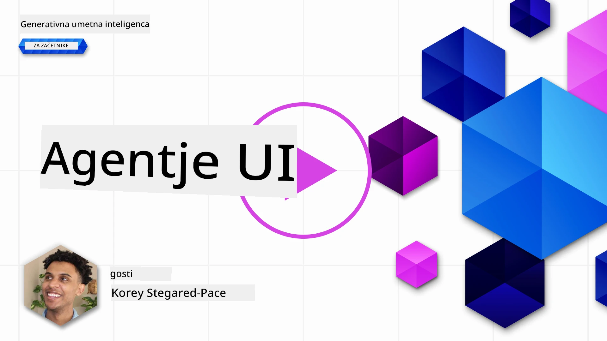
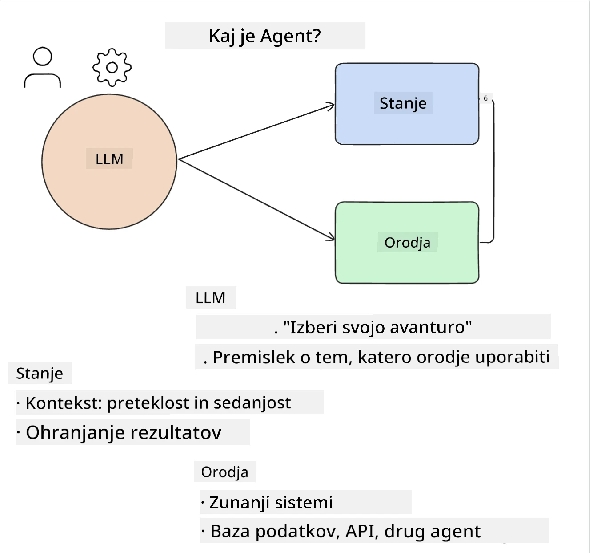
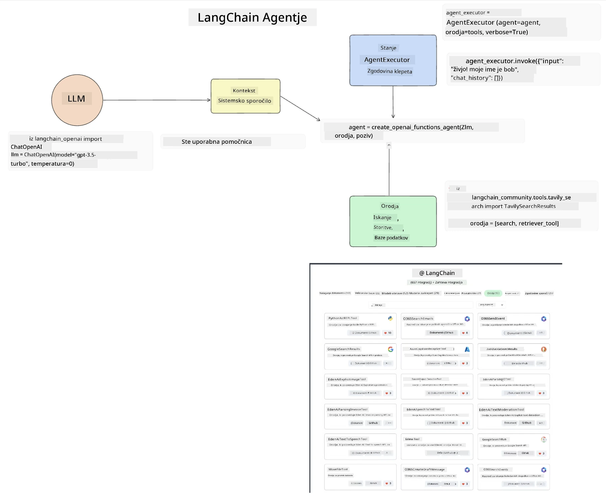
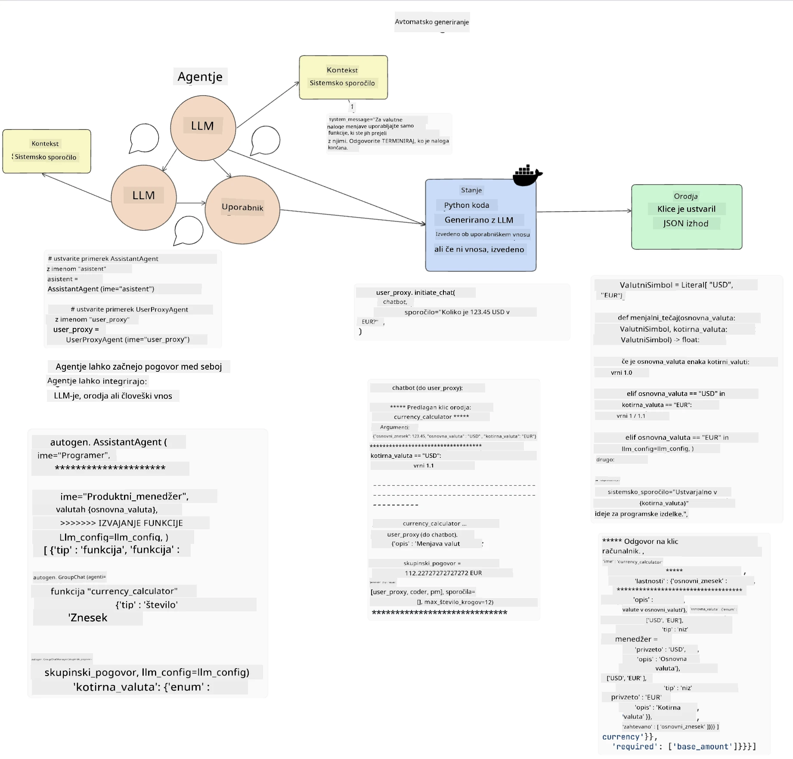
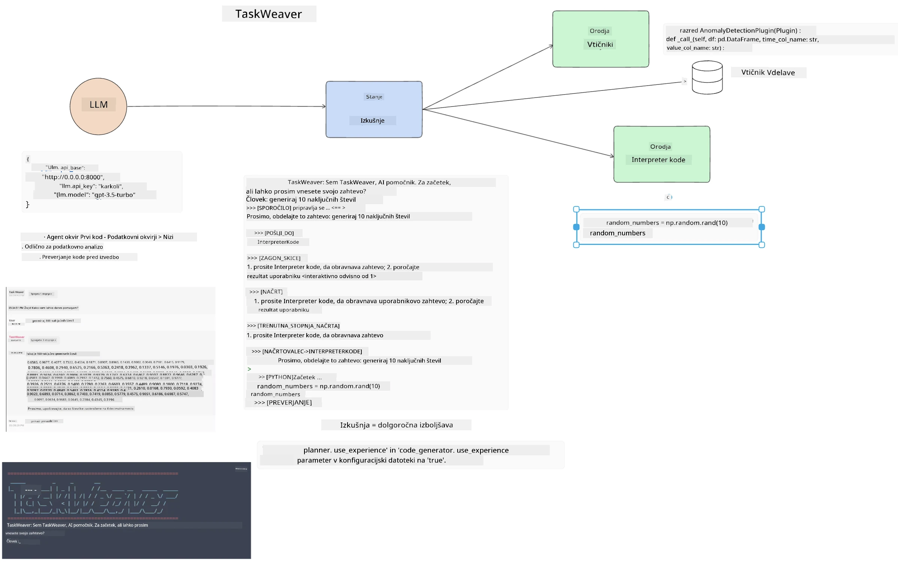
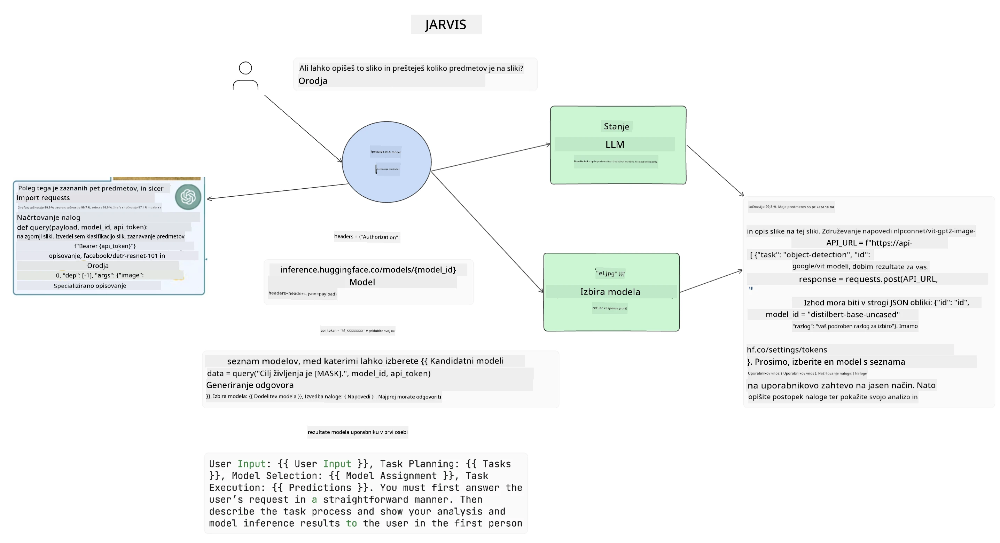

[](https://youtu.be/yAXVW-lUINc?si=bOtW9nL6jc3XJgOM)

## Uvod

AI agenti predstavljajo razburljiv razvoj na področju generativne umetne inteligence, saj omogočajo velikim jezikovnim modelom (LLM), da prerastejo v agenta, ki lahko izvaja dejanja. Okviri za AI agente razvijalcem omogočajo ustvarjanje aplikacij, ki LLM-jem omogočajo dostop do orodij in upravljanje stanja. Ti okviri tudi povečujejo preglednost, kar uporabnikom in razvijalcem omogoča spremljanje dejanj, ki jih LLM načrtuje, s čimer izboljšujejo upravljanje izkušenj.

V lekciji bomo zajeli naslednja področja:

- Razumevanje, kaj je AI agent - Kaj pravzaprav je AI agent?
- Raziskovanje štirih različnih okvirov za AI agente - Kaj jih dela edinstvene?
- Uporaba teh AI agentov za različne primere uporabe - Kdaj naj uporabimo AI agente?

## Cilji učenja

Po opravljeni lekciji boste lahko:

- Razložili, kaj so AI agenti in kako jih je mogoče uporabiti.
- Razumeli razlike med nekaterimi priljubljenimi okviri za AI agente in kako se razlikujejo.
- Razumeli, kako AI agenti delujejo, da bi lahko z njimi gradili aplikacije.

## Kaj so AI agenti?

AI agenti so zelo razburljivo področje v svetu generativne umetne inteligence. S tem navdušenjem pa včasih pride tudi zmeda glede izrazov in njihove uporabe. Da bomo preprosti in vključujoči večino orodij, ki se nanašajo na AI agente, bomo uporabili to definicijo:

AI agenti omogočajo velikim jezikovnim modelom (LLM), da izvajajo naloge tako, da jim omogočijo dostop do **stanja** in **orodij**.



Določimo te izraze:

**Veliki jezikovni modeli** – To so modeli, na katere se sklicuje ta tečaj, kot so GPT-3.5, GPT-4, Llama-2 itd.

**Stanje** – Nanaša se na kontekst, v katerem LLM deluje. LLM uporablja kontekst svojih preteklih dejanj in trenutni kontekst za usmerjanje odločitev za nadaljnja dejanja. Okviri za AI agente razvijalcem omogočajo lažje vzdrževanje tega konteksta.

**Orodja** – Za dokončanje naloge, ki jo je uporabnik zahteval in ki jo je LLM načrtoval, LLM potrebuje dostop do orodij. Nekateri primeri orodij so podatkovna baza, API, zunanja aplikacija ali celo drug LLM!

Te definicije naj vam bodo osnova, ko bomo pogledali, kako so implementirani. Raziščimo nekaj različnih okvirov za AI agente:

## LangChain Agents

[LangChain Agents](https://python.langchain.com/docs/how_to/#agents?WT.mc_id=academic-105485-koreyst) je implementacija zgoraj danih definicij.

Za upravljanje **stanja** uporablja vgrajeno funkcijo, imenovano `AgentExecutor`. Ta sprejme definirani `agent` in `orodja`, ki so mu na voljo.

`Agent Executor` prav tako shranjuje zgodovino klepeta, da zagotovi kontekst klepeta.



LangChain ponuja [katalog orodij](https://integrations.langchain.com/tools?WT.mc_id=academic-105485-koreyst), ki jih lahko uvozite v svojo aplikacijo in do katerih lahko LLM dostopa. Ta orodja ustvarja skupnost in ekipa LangChain.

Nato lahko ta orodja definirate in jih posredujete `Agent Executor`.

Preglednost je še en pomemben vidik pri pogovoru o AI agentih. Pomembno je, da razvijalci aplikacij razumejo, katero orodje LLM uporablja in zakaj. Za to je ekipa LangChain razvila LangSmith.

## AutoGen

Naslednji okvir za AI agente, o katerem bomo govorili, je [AutoGen](https://microsoft.github.io/autogen/?WT.mc_id=academic-105485-koreyst). Glavni fokus AutoGen je pogovor. Agenti so tako **govorni** kot **prilagodljivi**.

**Govorni –** LLM lahko začne in nadaljuje pogovor z drugim LLM za dokončanje naloge. To se naredi z ustvarjanjem `AssistantAgents` in jim da specifično sistemsko sporočilo.

```python

autogen.AssistantAgent( name="Coder", llm_config=llm_config, ) pm = autogen.AssistantAgent( name="Product_manager", system_message="Creative in software product ideas.", llm_config=llm_config, )

```

**Prilagodljivi** – Agente lahko definiramo ne samo kot LLM, temveč tudi kot uporabnika ali orodje. Kot razvijalec lahko definirate `UserProxyAgent`, ki je odgovoren za interakcijo z uporabnikom za povratne informacije pri opravljanju naloge. Te povratne informacije lahko nadaljujejo izvajanje naloge ali jo ustavijo.

```python
user_proxy = UserProxyAgent(name="user_proxy")
```

### Stanje in orodja

Za spreminjanje in upravljanje stanja pomočnik agent generira Python kodo za dokončanje naloge.

Tukaj je primer procesa:



#### LLM definiran s sistemskim sporočilom

```python
system_message="For weather related tasks, only use the functions you have been provided with. Reply TERMINATE when the task is done."
```

To sistemsko sporočilo usmerja ta specifični LLM, katere funkcije so relevantne za njegovo nalogo. Zapomnite si, da lahko z AutoGen imate več definirnih AssistanceAgentov z različnimi sistemskimi sporočili.

#### Klepet sproži uporabnik

```python
user_proxy.initiate_chat( chatbot, message="I am planning a trip to NYC next week, can you help me pick out what to wear? ", )

```

To sporočilo od user_proxy (človeka) bo začelo proces, da agent raziskuje možne funkcije, ki jih mora izvesti.

#### Funkcija se izvede

```bash
chatbot (to user_proxy):

***** Suggested tool Call: get_weather ***** Arguments: {"location":"New York City, NY","time_periond:"7","temperature_unit":"Celsius"} ******************************************************** --------------------------------------------------------------------------------

>>>>>>>> EXECUTING FUNCTION get_weather... user_proxy (to chatbot): ***** Response from calling function "get_weather" ***** 112.22727272727272 EUR ****************************************************************

```

Ko je začetni klepet obdelan, bo agent poslal predlagano orodje za klic. V tem primeru je to funkcija z imenom `get_weather`. Glede na vašo konfiguracijo se lahko ta funkcija samodejno izvede in prebere ali pa se izvede na podlagi uporabniškega vnosa.

Našli boste seznam [primerov kode AutoGen](https://microsoft.github.io/autogen/docs/Examples/?WT.mc_id=academic-105485-koreyst), s katerimi si lahko dodatno pomagate pri začetku izdelave.

## Taskweaver

Naslednji okvir za agente, ki ga bomo raziskovali, je [Taskweaver](https://microsoft.github.io/TaskWeaver/?WT.mc_id=academic-105485-koreyst). Poznan je kot "code-first" agent, ker namesto dela izključno z `nizi`, lahko dela s DataFrame-i v Pythonu. To je izjemno uporabno za analizo podatkov in naloge generiranja. To so lahko stvari, kot so ustvarjanje grafikonov in diagramov ali generiranje naključnih števil.

### Stanje in orodja

Za upravljanje stanja pogovora TaskWeaver uporablja koncept `Planner`. `Planner` je LLM, ki prejme zahtevo uporabnikov in izriše naloge, ki jih je treba dokončati, da se zahteva izpolni.

Za dokončanje nalog je `Planner` izpostavljen zbirki orodij, imenovani `Plugins`. To so lahko Python razredi ali splošni interpreter kode. Ti dodatki so shranjeni kot vektorji, da lahko LLM bolje poišče pravilen dodatek.



Tukaj je primer dodatka za obravnavo zaznavanja anomalij:

```python
class AnomalyDetectionPlugin(Plugin): def __call__(self, df: pd.DataFrame, time_col_name: str, value_col_name: str):
```

Koda se preveri pred izvedbo. Druga funkcija za upravljanje konteksta v Taskweaver je `experience` (izkušnja). Izkušnja omogoča dolgoročno shranjevanje konteksta pogovora v YML datoteko. To se lahko konfigurira tako, da se LLM skozi čas izboljša pri določenih nalogah, če je izpostavljen prejšnjim pogovorom.

## JARVIS

Zadnji okvir za agente, ki ga bomo raziskovali, je [JARVIS](https://github.com/microsoft/JARVIS?tab=readme-ov-file&WT.mc_id=academic-105485-koreyst). Kar naredi JARVIS edinstven je, da uporablja LLM za upravljanje stanja pogovora, medtem ko so `orodja` drugi AI modeli. Vsak od teh AI modelov je specializiran model, ki izvaja določene naloge, kot so zaznavanje predmetov, prepisovanje ali opisovanje slik.



LLM, kot splošni model, prejme zahtevo uporabnika in identificira specifično nalogo ter kateri argumenti/podatki so potrebni za dokončanje naloge.

```python
[{"task": "object-detection", "id": 0, "dep": [-1], "args": {"image": "e1.jpg" }}]
```

LLM nato oblikuje zahtevo na način, ki ga specializirani AI model lahko interpretira, na primer v JSON formatu. Ko AI model vrne napoved na podlagi naloge, LLM prejme odgovor.

Če je za dokončanje naloge potrebnih več modelov, bo tudi interpretiral odgovore teh modelov, preden jih združi v odgovor za uporabnika.

Primer spodaj prikazuje, kako bi to delovalo, ko uporabnik zahteva opis in štetje predmetov na sliki:

## Naloga

Da nadaljujete učenje o AI agentih, lahko s AutoGen zgradite:

- Aplikacijo, ki simulira poslovni sestanek z različnimi oddelki izobraževalnega zagona.
- Ustvarite sistemska sporočila, ki usmerjajo LLM pri razumevanju različnih osebnosti in prioritet ter omogočajo uporabniku, da predstavi idejo o novem izdelku.
- LLM naj nato generira nadaljnja vprašanja iz vsakega oddelka za izboljšanje in izpopolnitev predstavitve in izdelka.

## Učenje se tukaj ne konča, nadaljujte pot

Po opravljeni lekciji si oglejte našo [zbirko za učenje generativne umetne inteligence](https://aka.ms/genai-collection?WT.mc_id=academic-105485-koreyst), da še naprej nadgrajujete svoje znanje generativne umetne inteligence!

---

<!-- CO-OP TRANSLATOR DISCLAIMER START -->
**Izjava o omejitvi odgovornosti**:
Ta dokument je bil preveden z uporabo storitve za prevajanje z umetno inteligenco [Co-op Translator](https://github.com/Azure/co-op-translator). Čeprav si prizadevamo za natančnost, vas opozarjamo, da avtomatizirani prevodi lahko vsebujejo napake ali netočnosti. Izvirni dokument v izvirnem jeziku velja za avtoritativni vir. Za ključne informacije priporočamo profesionalni človeški prevod. Ne odgovarjamo za morebitna nesporazume ali napačne interpretacije, ki izhajajo iz uporabe tega prevoda.
<!-- CO-OP TRANSLATOR DISCLAIMER END -->