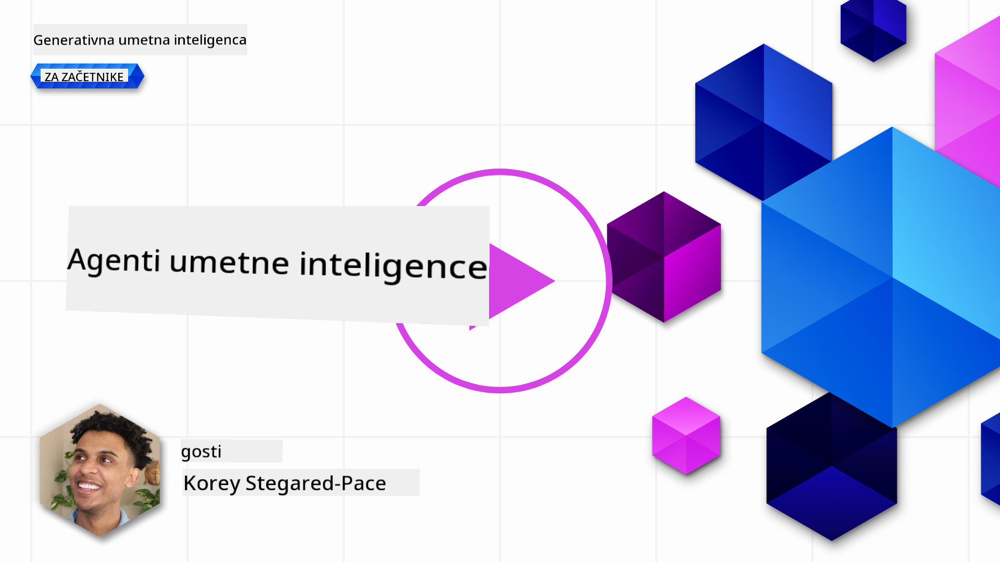
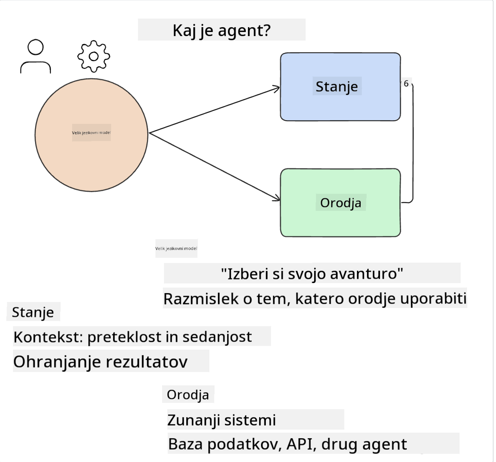
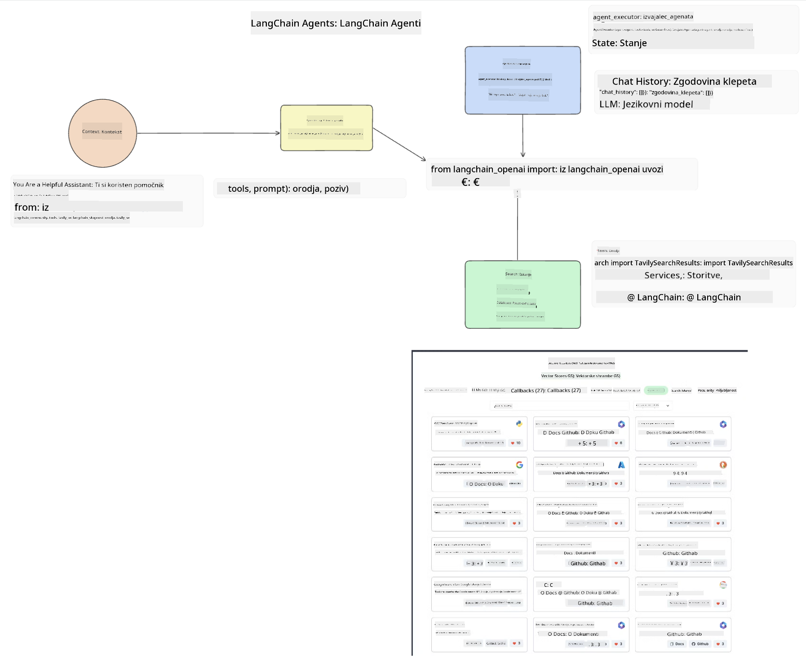
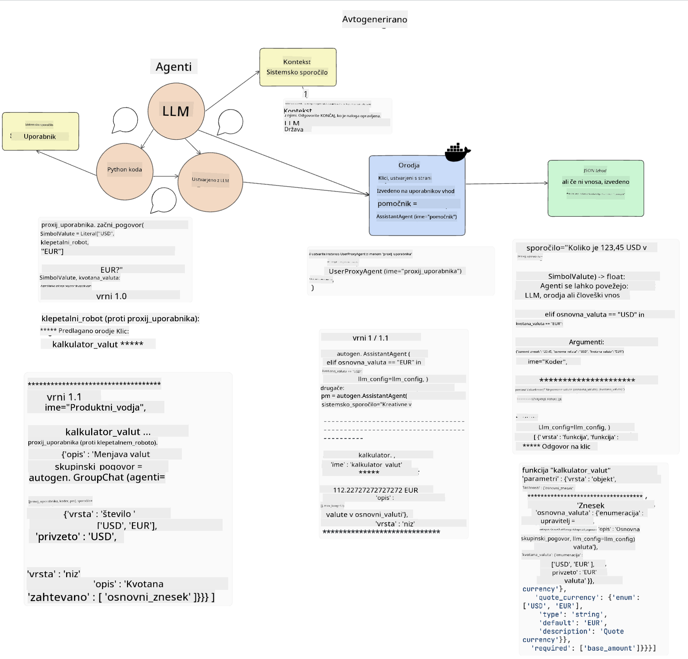
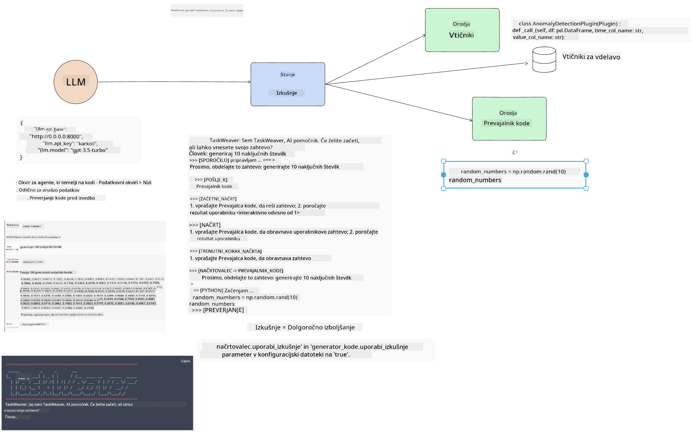
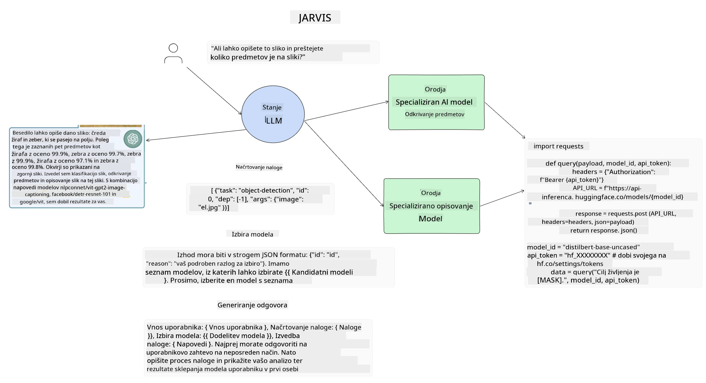

<!--
CO_OP_TRANSLATOR_METADATA:
{
  "original_hash": "11f03c81f190d9cbafd0f977dcbede6c",
  "translation_date": "2025-06-26T00:27:04+00:00",
  "source_file": "17-ai-agents/README.md",
  "language_code": "sl"
}
-->
[](https://aka.ms/gen-ai-lesson17-gh?WT.mc_id=academic-105485-koreyst)

## Uvod

AI agenti predstavljajo vznemirljiv razvoj na področju generativne umetne inteligence, saj omogočajo, da se veliki jezikovni modeli (LLM) razvijejo iz pomočnikov v agente, sposobne izvajanja dejanj. Okviri za AI agente omogočajo razvijalcem ustvarjanje aplikacij, ki LLM-jem omogočajo dostop do orodij in upravljanja stanja. Ti okviri prav tako izboljšajo preglednost, kar uporabnikom in razvijalcem omogoča spremljanje dejanj, ki jih načrtujejo LLM-ji, s čimer se izboljša upravljanje izkušenj.

Lekcija bo pokrivala naslednja področja:

- Razumevanje, kaj je AI agent - Kaj točno je AI agent?
- Raziskovanje štirih različnih okvirov za AI agente - Kaj jih dela edinstvene?
- Uporaba teh AI agentov v različnih primerih uporabe - Kdaj naj uporabimo AI agente?

## Cilji učenja

Po zaključku te lekcije boste lahko:

- Pojasnili, kaj so AI agenti in kako jih je mogoče uporabiti.
- Razumeli razlike med nekaterimi priljubljenimi okviri za AI agente in kako se razlikujejo.
- Razumeli, kako AI agenti delujejo, da bi lahko z njimi gradili aplikacije.

## Kaj so AI agenti?

AI agenti so zelo vznemirljivo področje v svetu generativne umetne inteligence. Z navdušenjem včasih pride tudi zmeda glede terminologije in njihove uporabe. Da bi stvari ostale preproste in vključevale večino orodij, ki se nanašajo na AI agente, bomo uporabili to definicijo:

AI agenti omogočajo velikim jezikovnim modelom (LLM), da opravljajo naloge, tako da jim omogočijo dostop do **stanja** in **orodij**.



Opredelimo te izraze:

**Veliki jezikovni modeli** - To so modeli, omenjeni skozi celoten tečaj, kot so GPT-3.5, GPT-4, Llama-2 itd.

**Stanje** - To se nanaša na kontekst, v katerem LLM deluje. LLM uporablja kontekst svojih preteklih dejanj in trenutni kontekst, kar vodi njegovo odločanje za nadaljnja dejanja. Okviri za AI agente razvijalcem omogočajo lažje vzdrževanje tega konteksta.

**Orodja** - Da bi LLM lahko dokončal nalogo, ki jo je uporabnik zahteval in ki jo je načrtoval, potrebuje dostop do orodij. Nekateri primeri orodij so lahko baza podatkov, API, zunanja aplikacija ali celo drug LLM!

Te definicije vam bodo upajmo dale dobro osnovo, ko bomo raziskovali, kako so implementirane. Raziskujmo nekaj različnih okvirov za AI agente:

## LangChain Agents

[LangChain Agents](https://python.langchain.com/docs/how_to/#agents?WT.mc_id=academic-105485-koreyst) je implementacija definicij, ki smo jih podali zgoraj.

Za upravljanje **stanja** uporablja vgrajeno funkcijo, imenovano `AgentExecutor`. Ta sprejema definirane `agent` in `tools`, ki so mu na voljo.

`Agent Executor` prav tako shranjuje zgodovino klepeta, da zagotovi kontekst klepeta.



LangChain ponuja [katalog orodij](https://integrations.langchain.com/tools?WT.mc_id=academic-105485-koreyst), ki jih je mogoče uvoziti v vašo aplikacijo, v kateri LLM lahko dostopa do njih. Ta so izdelana s strani skupnosti in ekipe LangChain.

Nato lahko definirate ta orodja in jih posredujete `Agent Executor`.

Preglednost je še en pomemben vidik pri govorjenju o AI agentih. Pomembno je, da razvijalci aplikacij razumejo, katero orodje LLM uporablja in zakaj. Za to je ekipa pri LangChain razvila LangSmith.

## AutoGen

Naslednji okvir za AI agente, ki ga bomo obravnavali, je [AutoGen](https://microsoft.github.io/autogen/?WT.mc_id=academic-105485-koreyst). Glavni poudarek AutoGen je na pogovorih. Agenti so tako **pogovorni** kot **prilagodljivi**.

**Pogovorni -** LLM-ji lahko začnejo in nadaljujejo pogovor z drugim LLM, da dokončajo nalogo. To se izvede z ustvarjanjem `AssistantAgents` in jim dodeli specifično sistemsko sporočilo.

```python

autogen.AssistantAgent( name="Coder", llm_config=llm_config, ) pm = autogen.AssistantAgent( name="Product_manager", system_message="Creative in software product ideas.", llm_config=llm_config, )

```

**Prilagodljivi** - Agenti so lahko definirani ne samo kot LLM-ji, ampak tudi kot uporabnik ali orodje. Kot razvijalec lahko definirate `UserProxyAgent`, ki je odgovoren za interakcijo z uporabnikom za povratne informacije pri dokončanju naloge. Te povratne informacije lahko nadaljujejo izvajanje naloge ali jo ustavijo.

```python
user_proxy = UserProxyAgent(name="user_proxy")
```

### Stanje in orodja

Za spreminjanje in upravljanje stanja asistent Agent generira Python kodo za dokončanje naloge.

Tukaj je primer postopka:



#### LLM definiran s sistemskim sporočilom

```python
system_message="For weather related tasks, only use the functions you have been provided with. Reply TERMINATE when the task is done."
```

To sistemsko sporočilo usmerja specifičen LLM k temu, katere funkcije so pomembne za njegovo nalogo. Ne pozabite, z AutoGen lahko imate več definiranih AssistantAgents z različnimi sistemskimi sporočili.

#### Klepet začne uporabnik

```python
user_proxy.initiate_chat( chatbot, message="I am planning a trip to NYC next week, can you help me pick out what to wear? ", )

```

To sporočilo iz user_proxy (Človek) je tisto, kar bo začelo proces agenta, da raziskuje možne funkcije, ki jih mora izvesti.

#### Funkcija je izvedena

```bash
chatbot (to user_proxy):

***** Suggested tool Call: get_weather ***** Arguments: {"location":"New York City, NY","time_periond:"7","temperature_unit":"Celsius"} ******************************************************** --------------------------------------------------------------------------------

>>>>>>>> EXECUTING FUNCTION get_weather... user_proxy (to chatbot): ***** Response from calling function "get_weather" ***** 112.22727272727272 EUR ****************************************************************

```

Ko je začetni klepet obdelan, bo agent predlagal orodje, ki ga je treba poklicati. V tem primeru je to funkcija, imenovana `get_weather`. Depending on your configuration, this function can be automatically executed and read by the Agent or can be executed based on user input.

You can find a list of [AutoGen code samples](https://microsoft.github.io/autogen/docs/Examples/?WT.mc_id=academic-105485-koreyst) to further explore how to get started building.

## Taskweaver

The next agent framework we will explore is [Taskweaver](https://microsoft.github.io/TaskWeaver/?WT.mc_id=academic-105485-koreyst). It is known as a "code-first" agent because instead of working strictly with `strings` , it can work with DataFrames in Python. This becomes extremely useful for data analysis and generation tasks. This can be things like creating graphs and charts or generating random numbers.

### State and Tools

To manage the state of the conversation, TaskWeaver uses the concept of a `Planner`. The `Planner` is a LLM that takes the request from the users and maps out the tasks that need to be completed to fulfill this request.

To complete the tasks the `Planner` is exposed to the collection of tools called `Plugins`. To so lahko Python razredi ali splošni tolmač kode. Ti vtičniki so shranjeni kot vdelave, da lahko LLM bolje išče pravi vtičnik.



Tukaj je primer vtičnika za obravnavo odkrivanja anomalij:

```python
class AnomalyDetectionPlugin(Plugin): def __call__(self, df: pd.DataFrame, time_col_name: str, value_col_name: str):
```

Koda je preverjena pred izvajanjem. Druga funkcija za upravljanje konteksta v Taskweaver je `experience`. Experience allows for the context of a conversation to be stored over to the long term in a YAML file. This can be configured so that the LLM improves over time on certain tasks given that it is exposed to prior conversations.

## JARVIS

The last agent framework we will explore is [JARVIS](https://github.com/microsoft/JARVIS?tab=readme-ov-file?WT.mc_id=academic-105485-koreyst). What makes JARVIS unique is that it uses an LLM to manage the `state` pogovora in `tools` so drugi AI modeli. Vsak od AI modelov je specializiran model, ki izvaja določene naloge, kot so zaznavanje objektov, transkripcija ali opisovanje slik.



LLM, ki je splošni model, prejme zahtevo od uporabnika in identificira specifično nalogo ter vse argumente/podatke, potrebne za dokončanje naloge.

```python
[{"task": "object-detection", "id": 0, "dep": [-1], "args": {"image": "e1.jpg" }}]
```

LLM nato oblikuje zahtevo na način, ki ga lahko specializirani AI model razume, na primer JSON. Ko AI model vrne svojo napoved na podlagi naloge, LLM prejme odgovor.

Če je za dokončanje naloge potrebnih več modelov, bo prav tako interpretiral odgovore teh modelov, preden jih združi, da bi ustvaril odgovor za uporabnika.

Spodnji primer prikazuje, kako bi to delovalo, ko uporabnik zahteva opis in število objektov na sliki:

## Naloga

Za nadaljevanje učenja o AI agentih lahko zgradite z AutoGen:

- Aplikacijo, ki simulira poslovni sestanek z različnimi oddelki izobraževalnega zagona.
- Ustvarite sistemska sporočila, ki vodijo LLM-je pri razumevanju različnih osebnosti in prioritet ter omogočite uporabniku predstavitev nove ideje za izdelek.
- LLM naj nato ustvari nadaljnja vprašanja vsakega oddelka za izpopolnitev in izboljšanje predstavitve in ideje za izdelek.

## Učenje se tukaj ne konča, nadaljujte potovanje

Po zaključku te lekcije si oglejte našo [zbirko učenja o generativni umetni inteligenci](https://aka.ms/genai-collection?WT.mc_id=academic-105485-koreyst), da nadaljujete z izpopolnjevanjem svojega znanja o generativni umetni inteligenci!

**Omejitev odgovornosti**:  
Ta dokument je bil preveden z uporabo AI prevajalske storitve [Co-op Translator](https://github.com/Azure/co-op-translator). Čeprav si prizadevamo za natančnost, vas prosimo, da se zavedate, da lahko avtomatizirani prevodi vsebujejo napake ali netočnosti. Izvirni dokument v njegovem maternem jeziku je treba obravnavati kot avtoritativni vir. Za kritične informacije se priporoča strokovni človeški prevod. Ne odgovarjamo za nesporazume ali napačne razlage, ki izhajajo iz uporabe tega prevoda.