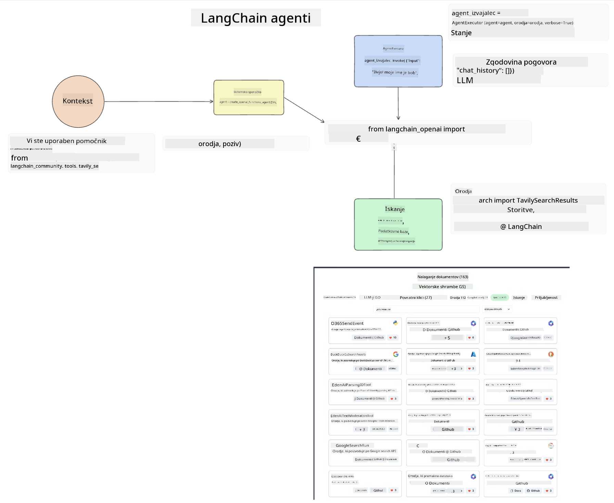
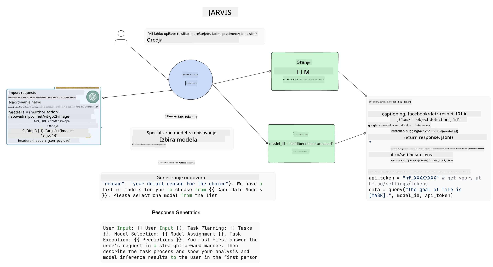

<!--
CO_OP_TRANSLATOR_METADATA:
{
  "original_hash": "11f03c81f190d9cbafd0f977dcbede6c",
  "translation_date": "2025-07-09T17:32:41+00:00",
  "source_file": "17-ai-agents/README.md",
  "language_code": "sl"
}
-->
[](https://aka.ms/gen-ai-lesson17-gh?WT.mc_id=academic-105485-koreyst)

## Uvod

AI agenti predstavljajo razburljiv razvoj na področju Generativne umetne inteligence, saj omogočajo, da se veliki jezikovni modeli (LLM) razvijejo iz pomočnikov v agente, ki lahko izvajajo dejanja. Okviri za AI agente razvijalcem omogočajo ustvarjanje aplikacij, ki LLM-jem omogočajo dostop do orodij in upravljanje stanja. Ti okviri prav tako izboljšajo preglednost, saj uporabnikom in razvijalcem omogočajo spremljanje dejanj, ki jih LLM načrtuje, s čimer izboljšajo upravljanje uporabniške izkušnje.

V tej lekciji bomo obravnavali naslednja področja:

- Razumevanje, kaj je AI agent – Kaj pravzaprav je AI agent?
- Pregled štirih različnih okvirov za AI agente – Kaj jih naredi edinstvene?
- Uporaba teh AI agentov v različnih primerih uporabe – Kdaj naj uporabimo AI agente?

## Cilji učenja

Po opravljeni lekciji boste znali:

- Razložiti, kaj so AI agenti in kako jih lahko uporabimo.
- Razumeti razlike med nekaterimi priljubljenimi okviri za AI agente in kako se razlikujejo.
- Razumeti, kako AI agenti delujejo, da boste lahko z njimi gradili aplikacije.

## Kaj so AI agenti?

AI agenti so zelo razburljivo področje v svetu Generativne umetne inteligence. S tem navdušenjem pa včasih pride tudi do zmede glede izrazov in njihove uporabe. Da bo vse preprosto in vključujoče za večino orodij, ki se nanašajo na AI agente, bomo uporabili naslednjo definicijo:

AI agenti omogočajo velikim jezikovnim modelom (LLM), da opravljajo naloge tako, da jim omogočijo dostop do **stanja** in **orodij**.


Pojasnimo te izraze:

**Veliki jezikovni modeli** – To so modeli, na katere se sklicujemo v tem tečaju, kot so GPT-3.5, GPT-4, Llama-2 itd.

**Stanje** – Nanaša se na kontekst, v katerem LLM deluje. LLM uporablja kontekst svojih preteklih dejanj in trenutni kontekst, ki usmerja njegovo odločanje za nadaljnja dejanja. Okviri za AI agente razvijalcem olajšajo vzdrževanje tega konteksta.

**Orodja** – Da bi LLM lahko opravil nalogo, ki jo je uporabnik zahteval in jo je LLM načrtoval, potrebuje dostop do orodij. Nekateri primeri orodij so baza podatkov, API, zunanja aplikacija ali celo drug LLM!

Upamo, da vam bodo te definicije pomagale bolje razumeti, ko bomo pogledali, kako so ti agenti implementirani. Raziščimo nekaj različnih okvirov za AI agente:

## LangChain Agents

[LangChain Agents](https://python.langchain.com/docs/how_to/#agents?WT.mc_id=academic-105485-koreyst) je implementacija zgornjih definicij.

Za upravljanje **stanja** uporablja vgrajeno funkcijo z imenom `AgentExecutor`. Ta sprejme definiran `agent` in `tools`, ki so mu na voljo.

`AgentExecutor` prav tako shranjuje zgodovino pogovora, da zagotovi kontekst pogovora.



LangChain ponuja [katalog orodij](https://integrations.langchain.com/tools?WT.mc_id=academic-105485-koreyst), ki jih lahko uvozite v svojo aplikacijo in do katerih lahko LLM dostopa. Ta orodja ustvarja skupnost in ekipa LangChain.

Nato lahko ta orodja definirate in jih posredujete `AgentExecutor`.

Preglednost je še en pomemben vidik pri pogovoru o AI agentih. Pomembno je, da razvijalci aplikacij razumejo, katero orodje LLM uporablja in zakaj. Za to je ekipa LangChain razvila LangSmith.

## AutoGen

Naslednji okvir za AI agente, o katerem bomo govorili, je [AutoGen](https://microsoft.github.io/autogen/?WT.mc_id=academic-105485-koreyst). Glavni fokus AutoGen je pogovor. Agenti so tako **pogovorni** kot **prilagodljivi**.

**Pogovorni** – LLM lahko začne in nadaljuje pogovor z drugim LLM, da opravi nalogo. To se doseže z ustvarjanjem `AssistantAgents` in dodelitvijo specifičnega sistemskega sporočila.

```python

autogen.AssistantAgent( name="Coder", llm_config=llm_config, ) pm = autogen.AssistantAgent( name="Product_manager", system_message="Creative in software product ideas.", llm_config=llm_config, )

```

**Prilagodljivi** – Agente lahko definiramo ne le kot LLM, ampak tudi kot uporabnika ali orodje. Kot razvijalec lahko definirate `UserProxyAgent`, ki je odgovoren za interakcijo z uporabnikom za povratne informacije pri opravljanju naloge. Te povratne informacije lahko nadaljujejo izvajanje naloge ali ga ustavijo.

```python
user_proxy = UserProxyAgent(name="user_proxy")
```

### Stanje in orodja

Za spreminjanje in upravljanje stanja asistent Agent generira Python kodo za dokončanje naloge.

Tukaj je primer procesa:


#### LLM definiran s sistemskim sporočilom

```python
system_message="For weather related tasks, only use the functions you have been provided with. Reply TERMINATE when the task is done."
```

To sistemsko sporočilo usmerja ta specifični LLM, katere funkcije so pomembne za njegovo nalogo. Ne pozabite, da lahko z AutoGen imate več definiranih AssistantAgents z različnimi sistemskimi sporočili.

#### Pogovor začne uporabnik

```python
user_proxy.initiate_chat( chatbot, message="I am planning a trip to NYC next week, can you help me pick out what to wear? ", )

```

To sporočilo od user_proxy (človek) bo sprožilo proces, da agent razišče možne funkcije, ki jih mora izvesti.

#### Funkcija se izvede

```bash
chatbot (to user_proxy):

***** Suggested tool Call: get_weather ***** Arguments: {"location":"New York City, NY","time_periond:"7","temperature_unit":"Celsius"} ******************************************************** --------------------------------------------------------------------------------

>>>>>>>> EXECUTING FUNCTION get_weather... user_proxy (to chatbot): ***** Response from calling function "get_weather" ***** 112.22727272727272 EUR ****************************************************************

```

Ko je začetni pogovor obdelan, bo agent poslal predlagano orodje za klic. V tem primeru je to funkcija z imenom `get_weather`. Glede na vašo konfiguracijo se ta funkcija lahko samodejno izvede in prebere s strani agenta ali pa se izvede na podlagi uporabniškega vnosa.

Za nadaljnje raziskovanje, kako začeti z gradnjo, lahko najdete seznam [AutoGen primerov kode](https://microsoft.github.io/autogen/docs/Examples/?WT.mc_id=academic-105485-koreyst).

## Taskweaver

Naslednji okvir za agente, ki ga bomo raziskali, je [Taskweaver](https://microsoft.github.io/TaskWeaver/?WT.mc_id=academic-105485-koreyst). Znano je kot "code-first" orodje, saj namesto dela izključno z `nizi` lahko dela s podatkovnimi okviri (DataFrames) v Pythonu. To je izjemno uporabno za naloge analize podatkov in generiranja. To so lahko stvari, kot so ustvarjanje grafov in diagramov ali generiranje naključnih števil.

### Stanje in orodja

Za upravljanje stanja pogovora TaskWeaver uporablja koncept `Planner`. `Planner` je LLM, ki prejme zahtevo uporabnika in načrtuje naloge, ki jih je treba opraviti za izpolnitev te zahteve.

Za dokončanje nalog je `Planner` povezan z zbirko orodij, imenovanih `Plugins`. To so lahko Python razredi ali splošni interpretator kode. Ti vtičniki so shranjeni kot vdelave (embeddings), da lahko LLM lažje poišče pravi vtičnik.


Tukaj je primer vtičnika za zaznavanje anomalij:

```python
class AnomalyDetectionPlugin(Plugin): def __call__(self, df: pd.DataFrame, time_col_name: str, value_col_name: str):
```

Koda se preveri pred izvajanjem. Druga funkcija za upravljanje konteksta v Taskweaverju je `experience`. Experience omogoča, da se kontekst pogovora shrani za daljše obdobje v YAML datoteko. To je mogoče konfigurirati tako, da se LLM skozi čas izboljšuje pri določenih nalogah, če je izpostavljen prejšnjim pogovorom.

## JARVIS

Zadnji okvir za agente, ki ga bomo raziskali, je [JARVIS](https://github.com/microsoft/JARVIS?tab=readme-ov-file?WT.mc_id=academic-105485-koreyst). Edinstvenost JARVIS-a je v tem, da uporablja LLM za upravljanje `stanja` pogovora, medtem ko so `orodja` drugi AI modeli. Vsak od teh AI modelov je specializiran za določene naloge, kot so zaznavanje predmetov, prepisovanje ali opisovanje slik.



LLM, kot model splošne rabe, prejme zahtevo uporabnika in identificira specifično nalogo ter morebitne argumente/podatke, potrebne za dokončanje naloge.

```python
[{"task": "object-detection", "id": 0, "dep": [-1], "args": {"image": "e1.jpg" }}]
```

LLM nato oblikuje zahtevo na način, ki ga specializirani AI model lahko interpretira, na primer v JSON formatu. Ko AI model vrne svojo napoved na podlagi naloge, LLM prejme odgovor.

Če je za dokončanje naloge potrebnih več modelov, bo interpretiral tudi odgovore teh modelov, preden jih združi in ustvari odgovor za uporabnika.

Primer spodaj prikazuje, kako bi to delovalo, ko uporabnik zahteva opis in štetje predmetov na sliki:

## Naloga

Za nadaljevanje učenja o AI agentih lahko zgradite z AutoGen:

- Aplikacijo, ki simulira poslovni sestanek z različnimi oddelki izobraževalnega startupa.
- Ustvarite sistemska sporočila, ki usmerjajo LLM-je pri razumevanju različnih osebnosti in prioritet ter omogočajo uporabniku predstavitev nove ideje za izdelek.
- LLM naj nato generira nadaljnja vprašanja iz vsakega oddelka za izpopolnitev in izboljšanje predstavitve ter ideje za izdelek.

## Učenje se tukaj ne konča, nadaljujte pot

Po zaključku te lekcije si oglejte našo [Generative AI Learning collection](https://aka.ms/genai-collection?WT.mc_id=academic-105485-koreyst), da še naprej nadgrajujete svoje znanje o Generativni umetni inteligenci!

**Omejitev odgovornosti**:  
Ta dokument je bil preveden z uporabo storitve za avtomatski prevod AI [Co-op Translator](https://github.com/Azure/co-op-translator). Čeprav si prizadevamo za natančnost, vas opozarjamo, da lahko avtomatizirani prevodi vsebujejo napake ali netočnosti. Izvirni dokument v njegovem izvirnem jeziku velja za avtoritativni vir. Za ključne informacije priporočamo strokovni človeški prevod. Za morebitna nesporazume ali napačne interpretacije, ki izhajajo iz uporabe tega prevoda, ne odgovarjamo.