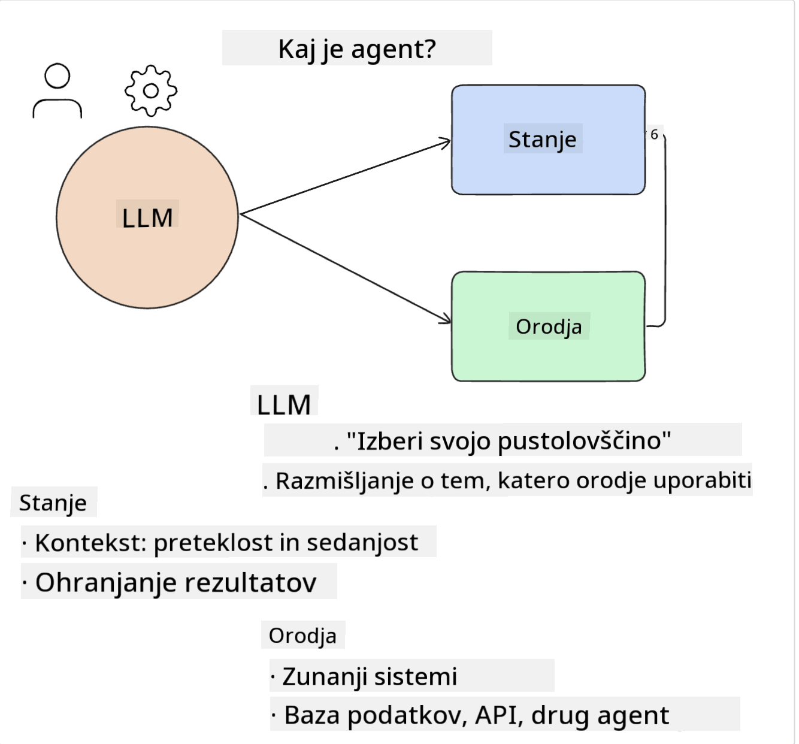

<!--
CO_OP_TRANSLATOR_METADATA:
{
  "original_hash": "8e8d1f6a63da606af7176a87ff8e92b6",
  "translation_date": "2025-10-18T01:47:09+00:00",
  "source_file": "17-ai-agents/README.md",
  "language_code": "sl"
}
-->
[](https://youtu.be/yAXVW-lUINc?si=bOtW9nL6jc3XJgOM)

## Uvod

AI agenti predstavljajo vznemirljiv razvoj na področju generativne umetne inteligence, saj omogočajo, da se veliki jezikovni modeli (LLM) razvijejo iz asistentov v agente, ki so sposobni izvajati dejanja. Okviri za AI agente razvijalcem omogočajo ustvarjanje aplikacij, ki LLM-jem omogočajo dostop do orodij in upravljanje stanja. Ti okviri prav tako izboljšujejo preglednost, saj uporabnikom in razvijalcem omogočajo spremljanje dejanj, ki jih načrtujejo LLM-ji, kar izboljšuje upravljanje izkušenj.

Lekcija bo obravnavala naslednja področja:

- Razumevanje, kaj je AI agent - Kaj točno je AI agent?
- Raziskovanje štirih različnih okvirov za AI agente - Kaj jih dela edinstvene?
- Uporaba teh AI agentov v različnih primerih uporabe - Kdaj naj uporabimo AI agente?

## Cilji učenja

Po zaključku te lekcije boste lahko:

- Razložili, kaj so AI agenti in kako jih lahko uporabimo.
- Razumeli razlike med nekaterimi priljubljenimi okviri za AI agente in kako se med seboj razlikujejo.
- Razumeli, kako AI agenti delujejo, da bi lahko z njimi gradili aplikacije.

## Kaj so AI agenti?

AI agenti so zelo vznemirljivo področje v svetu generativne umetne inteligence. S to vznemirljivostjo pa včasih pride tudi zmeda glede terminov in njihove uporabe. Da bi stvari poenostavili in vključili večino orodij, ki se nanašajo na AI agente, bomo uporabili naslednjo definicijo:

AI agenti omogočajo velikim jezikovnim modelom (LLM), da izvajajo naloge, tako da jim omogočijo dostop do **stanja** in **orodij**.



Definirajmo te izraze:

**Veliki jezikovni modeli** - To so modeli, o katerih govorimo v tem tečaju, kot so GPT-3.5, GPT-4, Llama-2 itd.

**Stanje** - To se nanaša na kontekst, v katerem LLM deluje. LLM uporablja kontekst svojih preteklih dejanj in trenutni kontekst, kar usmerja njegovo odločanje za nadaljnja dejanja. Okviri za AI agente razvijalcem omogočajo lažje vzdrževanje tega konteksta.

**Orodja** - Da bi LLM lahko dokončal nalogo, ki jo je uporabnik zahteval in jo je LLM načrtoval, potrebuje dostop do orodij. Nekateri primeri orodij so lahko podatkovne baze, API-ji, zunanje aplikacije ali celo drugi LLM-ji!

Te definicije vam bodo upajmo dale dobro osnovo za nadaljnje razumevanje, ko bomo raziskovali, kako so implementirani. Poglejmo nekaj različnih okvirov za AI agente:

## LangChain Agents

[LangChain Agents](https://python.langchain.com/docs/how_to/#agents?WT.mc_id=academic-105485-koreyst) je implementacija zgoraj podanih definicij.

Za upravljanje **stanja** uporablja vgrajeno funkcijo, imenovano `AgentExecutor`. Ta sprejema definirane `agent` in `tools`, ki so mu na voljo.

`AgentExecutor` prav tako shranjuje zgodovino pogovora, da zagotovi kontekst pogovora.


LangChain ponuja [katalog orodij](https://integrations.langchain.com/tools?WT.mc_id=academic-105485-koreyst), ki jih je mogoče uvoziti v vašo aplikacijo, v kateri lahko LLM dostopa do njih. Ta orodja so ustvarjena s strani skupnosti in ekipe LangChain.

Ta orodja lahko nato definirate in jih posredujete `AgentExecutor`.

Preglednost je še en pomemben vidik pri pogovoru o AI agentih. Pomembno je, da razvijalci aplikacij razumejo, katero orodje LLM uporablja in zakaj. Za to je ekipa LangChain razvila LangSmith.

## AutoGen

Naslednji okvir za AI agente, ki ga bomo obravnavali, je [AutoGen](https://microsoft.github.io/autogen/?WT.mc_id=academic-105485-koreyst). Glavni fokus AutoGen-a so pogovori. Agenti so hkrati **pogovorni** in **prilagodljivi**.

**Pogovorni -** LLM-ji lahko začnejo in nadaljujejo pogovor z drugim LLM-jem, da dokončajo nalogo. To se izvede z ustvarjanjem `AssistantAgents` in dodelitvijo specifičnega sistemskega sporočila.

```python

autogen.AssistantAgent( name="Coder", llm_config=llm_config, ) pm = autogen.AssistantAgent( name="Product_manager", system_message="Creative in software product ideas.", llm_config=llm_config, )

```

**Prilagodljivi** - Agenti niso definirani le kot LLM-ji, ampak so lahko tudi uporabniki ali orodja. Kot razvijalec lahko definirate `UserProxyAgent`, ki je odgovoren za interakcijo z uporabnikom za povratne informacije pri dokončanju naloge. Te povratne informacije lahko bodisi nadaljujejo izvajanje naloge bodisi jo ustavijo.

```python
user_proxy = UserProxyAgent(name="user_proxy")
```

### Stanje in orodja

Za spreminjanje in upravljanje stanja asistent Agent generira Python kodo za dokončanje naloge.

Tukaj je primer postopka:


#### LLM definiran s sistemskim sporočilom

```python
system_message="For weather related tasks, only use the functions you have been provided with. Reply TERMINATE when the task is done."
```

To sistemsko sporočilo usmerja določen LLM, katere funkcije so relevantne za njegovo nalogo. Ne pozabite, da lahko z AutoGen definirate več AssistantAgents z različnimi sistemskimi sporočili.

#### Pogovor začne uporabnik

```python
user_proxy.initiate_chat( chatbot, message="I am planning a trip to NYC next week, can you help me pick out what to wear? ", )

```

To sporočilo od user_proxy (človeka) je tisto, kar bo sprožilo proces agenta, da razišče možne funkcije, ki jih mora izvesti.

#### Funkcija se izvede

```bash
chatbot (to user_proxy):

***** Suggested tool Call: get_weather ***** Arguments: {"location":"New York City, NY","time_periond:"7","temperature_unit":"Celsius"} ******************************************************** --------------------------------------------------------------------------------

>>>>>>>> EXECUTING FUNCTION get_weather... user_proxy (to chatbot): ***** Response from calling function "get_weather" ***** 112.22727272727272 EUR ****************************************************************

```

Ko je začetni pogovor obdelan, agent predlaga orodje, ki ga je treba poklicati. V tem primeru je to funkcija, imenovana `get_weather`. Odvisno od vaše konfiguracije se ta funkcija lahko samodejno izvede in prebere s strani agenta ali pa se izvede na podlagi uporabniškega vnosa.

Seznam [AutoGen primerov kode](https://microsoft.github.io/autogen/docs/Examples/?WT.mc_id=academic-105485-koreyst) lahko najdete za nadaljnje raziskovanje, kako začeti graditi.

## Taskweaver

Naslednji okvir za agente, ki ga bomo raziskali, je [Taskweaver](https://microsoft.github.io/TaskWeaver/?WT.mc_id=academic-105485-koreyst). Znano je kot "code-first" agent, ker namesto da bi deloval izključno z `strings`, lahko deluje z DataFrames v Pythonu. To postane izjemno uporabno za analizo podatkov in naloge generiranja. To so lahko stvari, kot so ustvarjanje grafov in diagramov ali generiranje naključnih števil.

### Stanje in orodja

Za upravljanje stanja pogovora TaskWeaver uporablja koncept `Planner`. `Planner` je LLM, ki sprejme zahtevo uporabnika in načrtuje naloge, ki jih je treba izvesti, da se zahteva izpolni.

Za dokončanje nalog je `Planner` izpostavljen zbirki orodij, imenovanih `Plugins`. To so lahko Python razredi ali splošni tolmač kode. Ti vtičniki so shranjeni kot vdelave, da lahko LLM bolje išče ustrezen vtičnik.


Tukaj je primer vtičnika za obravnavo zaznavanja anomalij:

```python
class AnomalyDetectionPlugin(Plugin): def __call__(self, df: pd.DataFrame, time_col_name: str, value_col_name: str):
```

Koda je preverjena pred izvedbo. Druga funkcija za upravljanje konteksta v Taskweaver je `experience`. Izkušnje omogočajo, da se kontekst pogovora dolgoročno shrani v YAML datoteko. To je mogoče konfigurirati tako, da se LLM sčasoma izboljša pri določenih nalogah, saj je izpostavljen prejšnjim pogovorom.

## JARVIS

Zadnji okvir za agente, ki ga bomo raziskali, je [JARVIS](https://github.com/microsoft/JARVIS?tab=readme-ov-file?WT.mc_id=academic-105485-koreyst). Kar JARVIS-a dela edinstvenega, je to, da uporablja LLM za upravljanje `stanja` pogovora, medtem ko so `orodja` drugi modeli umetne inteligence. Vsak od AI modelov je specializiran model, ki izvaja določene naloge, kot so zaznavanje objektov, transkripcija ali opisovanje slik.


LLM, kot splošni model, prejme zahtevo od uporabnika in identificira specifično nalogo ter morebitne argumente/podatke, ki so potrebni za dokončanje naloge.

```python
[{"task": "object-detection", "id": 0, "dep": [-1], "args": {"image": "e1.jpg" }}]
```

LLM nato oblikuje zahtevo na način, ki ga lahko specializirani AI model interpretira, na primer v obliki JSON-a. Ko AI model vrne svojo napoved na podlagi naloge, LLM prejme odgovor.

Če je za dokončanje naloge potrebnih več modelov, bo LLM interpretiral odgovore teh modelov, preden jih združi in ustvari odgovor za uporabnika.

Spodnji primer prikazuje, kako bi to delovalo, ko uporabnik zahteva opis in število objektov na sliki:

## Naloga

Za nadaljevanje učenja o AI agentih lahko zgradite aplikacijo z AutoGen:

- Aplikacijo, ki simulira poslovni sestanek z različnimi oddelki izobraževalnega startupa.
- Ustvarite sistemska sporočila, ki usmerjajo LLM-je pri razumevanju različnih osebnosti in prioritet ter omogočajo uporabniku, da predstavi novo idejo za izdelek.
- LLM naj nato ustvari nadaljnja vprašanja iz vsakega oddelka za izboljšanje ideje in predstavitve izdelka.

## Učenje se tukaj ne konča, nadaljujte pot

Po zaključku te lekcije si oglejte našo [zbirko učenja o generativni umetni inteligenci](https://aka.ms/genai-collection?WT.mc_id=academic-105485-koreyst), da še naprej nadgrajujete svoje znanje o generativni umetni inteligenci!

---

**Omejitev odgovornosti**:  
Ta dokument je bil preveden z uporabo storitve za prevajanje AI [Co-op Translator](https://github.com/Azure/co-op-translator). Čeprav si prizadevamo za natančnost, vas prosimo, da upoštevate, da lahko avtomatizirani prevodi vsebujejo napake ali netočnosti. Izvirni dokument v njegovem maternem jeziku je treba obravnavati kot avtoritativni vir. Za ključne informacije priporočamo profesionalni človeški prevod. Ne odgovarjamo za morebitna nesporazumevanja ali napačne razlage, ki izhajajo iz uporabe tega prevoda.