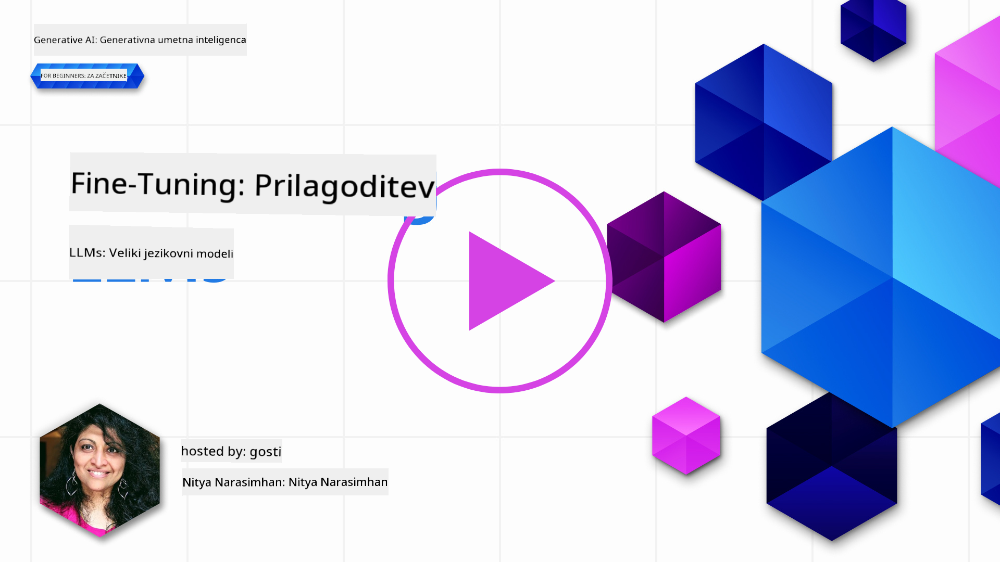

<!--
CO_OP_TRANSLATOR_METADATA:
{
  "original_hash": "68664f7e754a892ae1d8d5e2b7bd2081",
  "translation_date": "2025-07-09T17:51:21+00:00",
  "source_file": "18-fine-tuning/README.md",
  "language_code": "sl"
}
-->

# Prilagajanje vašega LLM

Uporaba velikih jezikovnih modelov za gradnjo generativnih AI aplikacij prinaša nove izzive. Ključno vprašanje je zagotavljanje kakovosti odgovorov (natančnost in relevantnost) v vsebini, ki jo model ustvari za določen uporabniški zahtevek. V prejšnjih lekcijah smo obravnavali tehnike, kot sta prompt engineering in retrieval-augmented generation, ki poskušajo rešiti problem z _modifikacijo vhodnega poziva_ obstoječemu modelu.

V današnji lekciji bomo predstavili tretjo tehniko, **fine-tuning** (prilagajanje), ki skuša izziv rešiti z _ponovnim učenjem samega modela_ z dodatnimi podatki. Poglejmo podrobnosti.

## Cilji učenja

Ta lekcija uvaja koncept prilagajanja za vnaprej naučene jezikovne modele, raziskuje prednosti in izzive tega pristopa ter ponuja navodila, kdaj in kako uporabiti prilagajanje za izboljšanje zmogljivosti vaših generativnih AI modelov.

Na koncu te lekcije boste znali odgovoriti na naslednja vprašanja:

- Kaj je prilagajanje jezikovnih modelov?
- Kdaj in zakaj je prilagajanje koristno?
- Kako lahko prilagodim vnaprej naučen model?
- Kakšne so omejitve prilagajanja?

Ste pripravljeni? Začnimo.

## Ilustriran vodič

Želite dobiti celoten pregled vsebine, preden se poglobimo? Oglejte si ta ilustriran vodič, ki opisuje učno pot za to lekcijo – od spoznavanja osnovnih pojmov in motivacije za prilagajanje do razumevanja procesa in najboljših praks za izvedbo naloge prilagajanja. To je zanimiva tema za raziskovanje, zato ne pozabite obiskati strani [Resources](./RESOURCES.md?WT.mc_id=academic-105485-koreyst) za dodatne povezave, ki podpirajo vaše samostojno učenje!

## Kaj je prilagajanje jezikovnih modelov?

Veliki jezikovni modeli so po definiciji _vnaprej naučeni_ na velikih količinah besedil, pridobljenih iz različnih virov, vključno z internetom. Kot smo se naučili v prejšnjih lekcijah, potrebujemo tehnike, kot sta _prompt engineering_ in _retrieval-augmented generation_, da izboljšamo kakovost odgovorov modela na uporabnikova vprašanja ("prompte").

Priljubljena tehnika prompt engineeringa vključuje, da modelu damo več navodil o tem, kaj naj pričakuje v odgovoru, bodisi z zagotavljanjem _navodil_ (izrecna usmeritev) ali _z nekaj primeri_ (implicitna usmeritev). To imenujemo _few-shot learning_, vendar ima dve omejitvi:

- Omejitve števila tokenov modela lahko omejijo število primerov, ki jih lahko podate, in s tem učinkovitost.
- Stroški tokenov modela lahko povzročijo, da je dodajanje primerov vsakemu pozivu drago, kar omejuje prilagodljivost.

Prilagajanje je pogosta praksa v sistemih strojnega učenja, kjer vzamemo vnaprej naučen model in ga ponovno naučimo z novimi podatki, da izboljšamo njegovo zmogljivost za določen opravek. V kontekstu jezikovnih modelov lahko prilagodimo vnaprej naučen model _z izbranim naborom primerov za določen opravek ali področje uporabe_, da ustvarimo **prilagojen model**, ki je lahko natančnejši in bolj relevanten za ta specifični opravek ali področje. Dodatna prednost prilagajanja je, da lahko zmanjša število primerov, potrebnih za few-shot učenje – s tem zmanjša uporabo tokenov in povezane stroške.

## Kdaj in zakaj prilagajati modele?

V _tem_ kontekstu, ko govorimo o prilagajanju, mislimo na **nadzorovano** prilagajanje, kjer se ponovno učenje izvaja z **dodajanjem novih podatkov**, ki niso bili del izvornega učnega nabora. To se razlikuje od nenadzorovanega prilagajanja, kjer se model ponovno uči na izvornih podatkih, vendar z drugačnimi hiperparametri.

Ključno je, da je prilagajanje napredna tehnika, ki zahteva določeno raven strokovnega znanja, da dosežemo želene rezultate. Če je izvedeno nepravilno, morda ne bo prineslo pričakovanih izboljšav in lahko celo poslabša zmogljivost modela za vaše ciljno področje.

Zato, preden se naučite "kako" prilagoditi jezikovne modele, morate vedeti "zakaj" bi se tega lotili in "kdaj" začeti postopek prilagajanja. Začnite z zastavljanjem naslednjih vprašanj:

- **Uporabniški primer**: Kakšen je vaš _uporabniški primer_ za prilagajanje? Kateri vidik trenutnega vnaprej naučenega modela želite izboljšati?
- **Alternativne možnosti**: Ste že poskusili _druge tehnike_ za dosego želenih rezultatov? Uporabite jih za ustvarjanje osnovne primerjave.
  - Prompt engineering: Poskusite tehnike, kot je few-shot prompting z relevantnimi primeri odgovorov. Ocenite kakovost odgovorov.
  - Retrieval Augmented Generation: Poskusite dopolniti pozive z rezultati iskanja v vaših podatkih. Ocenite kakovost odgovorov.
- **Stroški**: Ste ocenili stroške prilagajanja?
  - Prilagodljivost – ali je vnaprej naučeni model na voljo za prilagajanje?
  - Napor – za pripravo učnih podatkov, ocenjevanje in izboljševanje modela.
  - Računska moč – za izvajanje prilagajanja in nameščanje prilagojenega modela.
  - Podatki – dostop do dovolj kakovostnih primerov za vpliv prilagajanja.
- **Koristi**: Ste potrdili koristi prilagajanja?
  - Kakovost – ali je prilagojeni model presegel osnovno različico?
  - Stroški – ali zmanjša uporabo tokenov z enostavnejšimi pozivi?
  - Razširljivost – ali lahko osnovni model uporabite za nova področja?

Z odgovori na ta vprašanja boste lažje odločili, ali je prilagajanje prava pot za vaš primer uporabe. Idealno je, da je pristop smiseln le, če koristi pretehtajo stroške. Ko se odločite za nadaljevanje, je čas, da razmislite o tem, _kako_ lahko prilagodite vnaprej naučen model.

Želite več vpogledov v proces odločanja? Oglejte si [To fine-tune or not to fine-tune](https://www.youtube.com/watch?v=0Jo-z-MFxJs)

## Kako lahko prilagodimo vnaprej naučen model?

Za prilagajanje vnaprej naučenega modela potrebujete:

- vnaprej naučen model za prilagajanje
- podatkovni niz za prilagajanje
- učni okolje za izvajanje prilagajanja
- gostiteljsko okolje za nameščanje prilagojenega modela

## Prilagajanje v praksi

Naslednji viri ponujajo korak-po-korak vodiče, ki vas vodijo skozi resničen primer z izbranim modelom in izbranim podatkovnim nizom. Za delo z temi vodiči potrebujete račun pri določenem ponudniku ter dostop do ustreznega modela in podatkovnih nizov.

| Ponudnik    | Vodič                                                                                                                                                                        | Opis                                                                                                                                                                                                                                                                                                                                                                                                                             |
| ----------- | --------------------------------------------------------------------------------------------------------------------------------------------------------------------------- | -------------------------------------------------------------------------------------------------------------------------------------------------------------------------------------------------------------------------------------------------------------------------------------------------------------------------------------------------------------------------------------------------------------------------------- |
| OpenAI      | [How to fine-tune chat models](https://github.com/openai/openai-cookbook/blob/main/examples/How_to_finetune_chat_models.ipynb?WT.mc_id=academic-105485-koreyst)             | Naučite se prilagoditi `gpt-35-turbo` za specifično področje ("pomočnik za recepte") z pripravo učnih podatkov, izvajanjem prilagajanja in uporabo prilagojenega modela za napovedovanje.                                                                                                                                                                                                                                   |
| Azure OpenAI| [GPT 3.5 Turbo fine-tuning tutorial](https://learn.microsoft.com/azure/ai-services/openai/tutorials/fine-tune?tabs=python-new%2Ccommand-line?WT.mc_id=academic-105485-koreyst) | Naučite se prilagoditi model `gpt-35-turbo-0613` **na Azure** z ustvarjanjem in nalaganjem učnih podatkov, izvajanjem prilagajanja, nameščanjem in uporabo novega modela.                                                                                                                                                                                                                                                    |
| Hugging Face| [Fine-tuning LLMs with Hugging Face](https://www.philschmid.de/fine-tune-llms-in-2024-with-trl?WT.mc_id=academic-105485-koreyst)                                            | Ta blog vodi skozi prilagajanje _odprtega LLM_ (npr. `CodeLlama 7B`) z uporabo knjižnice [transformers](https://huggingface.co/docs/transformers/index?WT.mc_id=academic-105485-koreyst) in [Transformer Reinforcement Learning (TRL)](https://huggingface.co/docs/trl/index?WT.mc_id=academic-105485-koreyst) ter odprtih [podatkovnih nizov](https://huggingface.co/docs/datasets/index?WT.mc_id=academic-105485-koreyst) na Hugging Face. |
|             |                                                                                                                                                                             |                                                                                                                                                                                                                                                                                                                                                                                                                                 |
| 🤗 AutoTrain| [Fine-tuning LLMs with AutoTrain](https://github.com/huggingface/autotrain-advanced/?WT.mc_id=academic-105485-koreyst)                                                      | AutoTrain (ali AutoTrain Advanced) je Python knjižnica, ki jo je razvila Hugging Face in omogoča prilagajanje za različne naloge, vključno s prilagajanjem LLM. AutoTrain je rešitev brez kode, prilagajanje pa je možno v vaši lastni oblaku, na Hugging Face Spaces ali lokalno. Podpira spletni vmesnik, CLI in učenje preko yaml konfiguracijskih datotek.                                                                                 |
|             |                                                                                                                                                                             |                                                                                                                                                                                                                                                                                                                                                                                                                                 |

## Naloga

Izberite enega od zgornjih vodičev in ga preglejte. _Morda bomo različico teh vodičev vključili v Jupyter zvezke v tem repozitoriju samo za referenco. Za najnovejše različice uporabite izvirne vire._

## Odlično delo! Nadaljujte z učenjem.

Po zaključku te lekcije si oglejte našo [Generative AI Learning collection](https://aka.ms/genai-collection?WT.mc_id=academic-105485-koreyst), da še naprej nadgrajujete svoje znanje o generativni AI!

Čestitke!! Zaključili ste zadnjo lekcijo iz serije v2 tega tečaja! Ne prenehajte z učenjem in ustvarjanjem. \*\*Oglejte si stran [RESOURCES](RESOURCES.md?WT.mc_id=academic-105485-koreyst) za seznam dodatnih priporočil prav za to temo.

Naša serija lekcij v1 je prav tako posodobljena z več nalogami in koncepti. Vzemite si trenutek za osvežitev znanja – in prosimo, [delite svoja vprašanja in povratne informacije](https://github.com/microsoft/generative-ai-for-beginners/issues?WT.mc_id=academic-105485-koreyst), da nam pomagate izboljšati te lekcije za skupnost.

**Omejitev odgovornosti**:  
Ta dokument je bil preveden z uporabo storitve za avtomatski prevod AI [Co-op Translator](https://github.com/Azure/co-op-translator). Čeprav si prizadevamo za natančnost, vas opozarjamo, da lahko avtomatski prevodi vsebujejo napake ali netočnosti. Izvirni dokument v njegovem izvirnem jeziku velja za avtoritativni vir. Za pomembne informacije priporočamo strokovni človeški prevod. Za morebitna nesporazume ali napačne interpretacije, ki izhajajo iz uporabe tega prevoda, ne odgovarjamo.