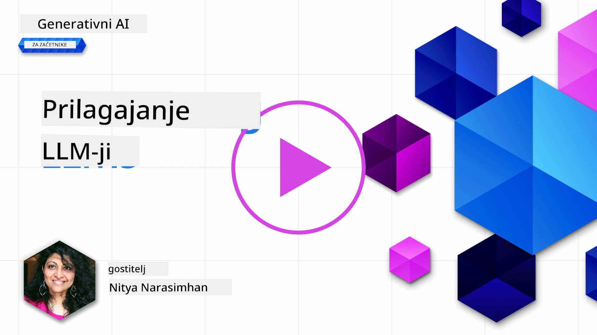
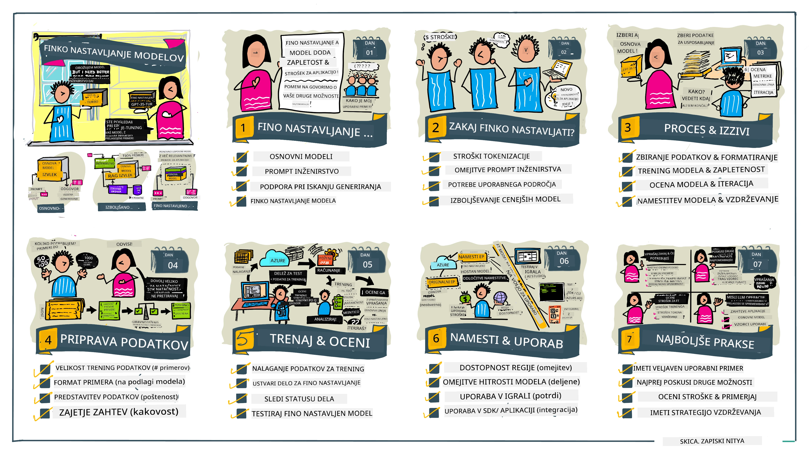

# Prilagajanje vašega LLM

Uporaba velikih jezikovnih modelov za gradnjo generativnih AI aplikacij prinaša nove izzive. Ključna težava je zagotavljanje kakovosti odziva (natančnost in relevantnost) v vsebini, ki jo model ustvari za določeno uporabniško zahtevo. V prejšnjih lekcijah smo obravnavali tehnike, kot sta inženiring pozivov in generiranje z iskanjem, ki poskušajo rešiti problem z _spreminjanjem vhodnega poziva_ obstoječemu modelu.

V današnji lekciji obravnavamo tretjo tehniko, **prilagajanje (fine-tuning)**, ki poskuša rešiti izziv z _ponovnim treniranjem samega modela_ z dodatnimi podatki. Poglejmo podrobnosti.

## Cilji učenja

Ta lekcija uvaja koncept prilagajanja predhodno usposobljenih jezikovnih modelov, raziskuje prednosti in izzive tega pristopa ter daje navodila, kdaj in kako uporabiti prilagajanje za izboljšanje delovanja vaših generativnih AI modelov.

Do konca te lekcije bi morali znati odgovoriti na naslednja vprašanja:

- Kaj je prilagajanje za jezikovne modele?
- Kdaj in zakaj je prilagajanje uporabno?
- Kako lahko prilagodim predhodno usposobljen model?
- Kakšne so omejitve prilagajanja?

Pripravljeni? Začnimo.

## Ilustriran vodič

Želite dobiti celoten pregled tega, kar bomo obravnavali, preden se poglobimo? Oglejte si ta ilustrirani vodič, ki opisuje učni proces za to lekcijo - od spoznavanja osnovnih konceptov in motivacije za prilagajanje do razumevanja postopka in najboljših praks za izvedbo naloge prilagajanja. To je zanimiva tema za raziskovanje, zato ne pozabite preveriti tudi strani [Viri](./RESOURCES.md?WT.mc_id=academic-105485-koreyst) za dodatne povezave, ki podpirajo vaše samostojno učenje!

## Kaj je prilagajanje za jezikovne modele?

Veliki jezikovni modeli so po definiciji _predhodno usposobljeni_ na velikih količinah besedil, pridobljenih iz različnih virov, vključno z internetom. Kot smo se naučili v prejšnjih lekcijah, potrebujemo tehnike, kot so _inženiring pozivov_ in _generiranje z iskanjem_, da izboljšamo kakovost odzivov modela na vprašanja uporabnikov ("pozive").

Priljubljena tehnika inženiringa pozivov vključuje dajanje več usmeritev modelu glede pričakovanega odgovora bodisi z zagotavljanjem _navodil_ (izrecno vodstvo) ali _dajanjem nekaj primerov_ (implicitno vodstvo). To imenujemo _učenje z nekaj primeri_ (few-shot learning), vendar ima dve omejitvi:

- Omejitve števila modelnih tokenov lahko omejijo število primerov, ki jih lahko podate, in omejijo učinkovitost.
- Stroški modelnih tokenov lahko naredijo drago dodajanje primerov v vsak poziv in omejijo prilagodljivost.

Prilagajanje je običajna praksa v strojno-učnih sistemih, kjer vzamemo predhodno usposobljen model in ga ponovno treniramo z novimi podatki za izboljšanje njegove učinkovitosti pri določeni nalogi. V kontekstu jezikovnih modelov lahko prilagodimo predhodno usposobljen model _z izbranimi primeri za določeno nalogo ali domeno uporabe_, da ustvarimo **prilagojen model**, ki je lahko natančnejši in bolj relevanten za to specifično nalogo ali domeno. Dodaten plus prilagajanja je, da lahko zmanjša tudi število primerov, potrebnih za učenje z nekaj primeri - s tem zmanjša porabo tokenov in povezane stroške.

## Kdaj in zakaj prilagajati modele?

V _tem_ kontekstu, ko govorimo o prilagajanju, mislimo na **nadzorovano** prilagajanje, kjer se ponovno treniranje izvaja z **dodajanjem novih podatkov**, ki niso bili del izvornega nabora za učenje. To se razlikuje od nenadzorovanega pristopa, kjer se model ponovno trenira na izvirnih podatkih, a z drugimi hiperparametri.

Ključno je razumeti, da je prilagajanje napredna tehnika, ki zahteva določeno stopnjo strokovnega znanja za dosego želenih rezultatov. Če se izvede nepravilno, morda ne bo prinesla pričakovanih izboljšav, lahko pa celo poslabša delovanje modela za vašo ciljno domeno.

Zato, preden se naučite "kako" prilagajati jezikovne modele, morate vedeti "zakaj" bi morali izbrati to pot, in "kdaj" začeti proces prilagajanja. Začnite z vprašanji:

- **Primer uporabe**: Kakšen je vaš _primer uporabe_ za prilagajanje? Kateri vidik sedanjega predhodno usposobljenega modela želite izboljšati?
- **Alternative**: Ste poskusili _druge tehnike_ za dosego želenih rezultatov? Uporabite jih za ustvarjanje osnovne primerjave.
  - Inženiring pozivov: Poskusite tehnike, kot je učenje z nekaj primeri s primeri ustreznih odzivov na pozive. Ocenite kakovost odzivov.
  - Generiranje z iskanjem: Poskusite dopolniti pozive z rezultati iskanja med vašimi podatki. Ocenite kakovost odzivov.
- **Stroški**: Ste določili stroške za prilagajanje?
  - Prilagodljivost – ali je predhodno usposobljen model na voljo za prilagajanje?
  - Napor – za pripravo učnih podatkov, ocenjevanje in izpopolnjevanje modela.
  - Računske zmogljivosti – za izvajanje prilagajanja in nameščanje prilagojenega modela.
  - Podatki – dostop do dovolj kakovostnih primerov za učinek prilagajanja.
- **Koristi**: Ste potrdili koristi prilagajanja?
  - Kakovost – ali je prilagojeni model presegel osnovo?
  - Stroški – ali zmanjša porabo tokenov s poenostavitvijo pozivov?
  - Razširljivost – ali lahko osnovni model ponovno uporabite za nove domene?

Z odgovori na ta vprašanja bi morali vedeti, ali je prilagajanje prava pot za vaš primer uporabe. Idealno je, da je ta pristop veljaven le, če koristi pretehta stroške. Ko se odločite za nadaljevanje, je čas, da razmislite, _kako_ prilagoditi predhodno usposobljen model.

Želite več vpogledov v proces odločanja? Oglejte si [Prilagoditi ali ne prilagoditi](https://www.youtube.com/watch?v=0Jo-z-MFxJs)

## Kako lahko prilagodimo predhodno usposobljen model?

Za prilagajanje predhodno usposobljenega modela potrebujete:

- predhodno usposobljen model za prilagajanje
- podatkovni niz za prilagajanje
- okolje za usposabljanje za izvajanje naloge prilagajanja
- gostiteljsko okolje za nameščanje prilagojenega modela

## Prilagajanje v akciji

Naslednji viri ponujajo korak-po-korak vadnice, ki vas vodijo skozi resničen primer z izbranim modelom in izbranim naborom podatkov. Za delo z vajami potrebujete račun pri določenem ponudniku ter dostop do ustreznega modela in podatkovnih nizov.

| Ponudnik     | Vodič                                                                                                                                                                        | Opis                                                                                                                                                                                                                                                                                                                                                                                                                             |
| ------------ | --------------------------------------------------------------------------------------------------------------------------------------------------------------------------- | -------------------------------------------------------------------------------------------------------------------------------------------------------------------------------------------------------------------------------------------------------------------------------------------------------------------------------------------------------------------------------------------------------------------------------- |
| OpenAI       | [Kako prilagoditi klepetalne modele](https://github.com/openai/openai-cookbook/blob/main/examples/How_to_finetune_chat_models.ipynb?WT.mc_id=academic-105485-koreyst)       | Naučite se prilagoditi `gpt-35-turbo` za specifično domeno ("pomočnik za recepte") s pripravo podatkov za učenje, izvedbo prilagajanja in uporabo prilagojenega modela za sklepanje.                                                                                                                                                                                                                                       |
| Azure OpenAI | [Vadnica za prilagajanje GPT 3.5 Turbo](https://learn.microsoft.com/azure/ai-services/openai/tutorials/fine-tune?tabs=python-new%2Ccommand-line?WT.mc_id=academic-105485-koreyst) | Naučite se prilagoditi model `gpt-35-turbo-0613` **na Azure** z ustvarjanjem in nalaganjem učnih podatkov, izvajanjem prilagajanja, nameščanjem in uporabo novega modela.                                                                                                                                                                                                                                                   |
| Hugging Face | [Prilagajanje LLM z Hugging Face](https://www.philschmid.de/fine-tune-llms-in-2024-with-trl?WT.mc_id=academic-105485-koreyst)                                              | Ta blog vodi vas skozi prilagajanje odprtega LLM (npr. `CodeLlama 7B`) z uporabo knjižnice [transformers](https://huggingface.co/docs/transformers/index?WT.mc_id=academic-105485-koreyst) in [Transformer Reinforcement Learning (TRL)](https://huggingface.co/docs/trl/index?WT.mc_id=academic-105485-koreyst) z odprtimi [nabori podatkov](https://huggingface.co/docs/datasets/index?WT.mc_id=academic-105485-koreyst) na Hugging Face. |
|              |                                                                                                                                                                             |                                                                                                                                                                                                                                                                                                                                                                                                                                 |
| 🤗 AutoTrain | [Prilagajanje LLM z AutoTrain](https://github.com/huggingface/autotrain-advanced/?WT.mc_id=academic-105485-koreyst)                                                        | AutoTrain (ali AutoTrain Advanced) je python knjižnica, ki jo je razvil Hugging Face in omogoča prilagajanje za različne naloge, vključno s prilagajanjem LLM. AutoTrain je rešitev brez kodiranja, prilagajanje pa je možno v vašem oblaku, na Hugging Face Spaces ali lokalno. Podpira spletni GUI, CLI in učenje preko yaml konfiguracijskih datotek.                                                                     |
|              |                                                                                                                                                                             |                                                                                                                                                                                                                                                                                                                                                                                                                                 |
| 🦥 Unsloth  | [Prilagajanje LLM z Unsloth](https://github.com/unslothai/unsloth)                                                                        | Unsloth je odprtokodni okvir za podporo prilagajanja LLM in okrepljenega učenja (RL). Poenostavlja lokalno usposabljanje, ocenjevanje in nameščanje z uporabo pripravljenih [zvezkov](https://github.com/unslothai/notebooks). Podpira tudi pretvorbo besedila v govor (TTS), BERT in multimodalne modele. Za začetek preberite njihov korak-po-korak [Vodnik za prilagajanje LLM](https://docs.unsloth.ai/get-started/fine-tuning-llms-guide).  |
|              |                                                                                                                                                                             |                                                                                                                                                                                                                                                                                                                                                                                                                                 |
## Naloga

Izberite eno od zgornjih vadnic in jo preglejte. _Morda bomo v tej repozitoriji podvojili verzijo teh vadnic v Jupyter zvezkih zgolj za referenco. Za najnovejše verzije uporabljajte prosim originalne vire._

## Odlično delo! Nadaljujte z učenjem.

Po zaključku te lekcije si oglejte našo [Zbirko za učenje generativne AI](https://aka.ms/genai-collection?WT.mc_id=academic-105485-koreyst), da nadaljujete z nadgrajevanjem znanja generativne AI!

Čestitamo!! Zaključili ste zadnjo lekcijo iz serije v2 tega tečaja! Ne prenehajte z učenjem in ustvarjanjem. \*\*Oglejte si stran [VIRI](RESOURCES.md?WT.mc_id=academic-105485-koreyst) za seznam dodatnih predlogov za to temo.

Naša serija v1 lekcij je prav tako posodobljena z več nalogami in koncepti. Vzemite si trenutek, da osvežite svoje znanje – in prosimo, [delite svoja vprašanja in povratne informacije](https://github.com/microsoft/generative-ai-for-beginners/issues?WT.mc_id=academic-105485-koreyst), da pomagamo izboljšati te lekcije za skupnost.

---

<!-- CO-OP TRANSLATOR DISCLAIMER START -->
**Izjava o omejitvi odgovornosti**:  
Ta dokument je bil preveden z uporabo storitve za avtomatski prevod AI [Co-op Translator](https://github.com/Azure/co-op-translator). Čeprav si prizadevamo za natančnost, upoštevajte, da lahko avtomatski prevodi vsebujejo napake ali nedoslednosti. Izvirni dokument v njegovem izvorno jeziku velja za avtoritativni vir. Za pomembne informacije priporočamo strokoven človeški prevod. Ne odgovarjamo za morebitna nesporazume ali napačne interpretacije, ki izhajajo iz uporabe tega prevoda.
<!-- CO-OP TRANSLATOR DISCLAIMER END -->