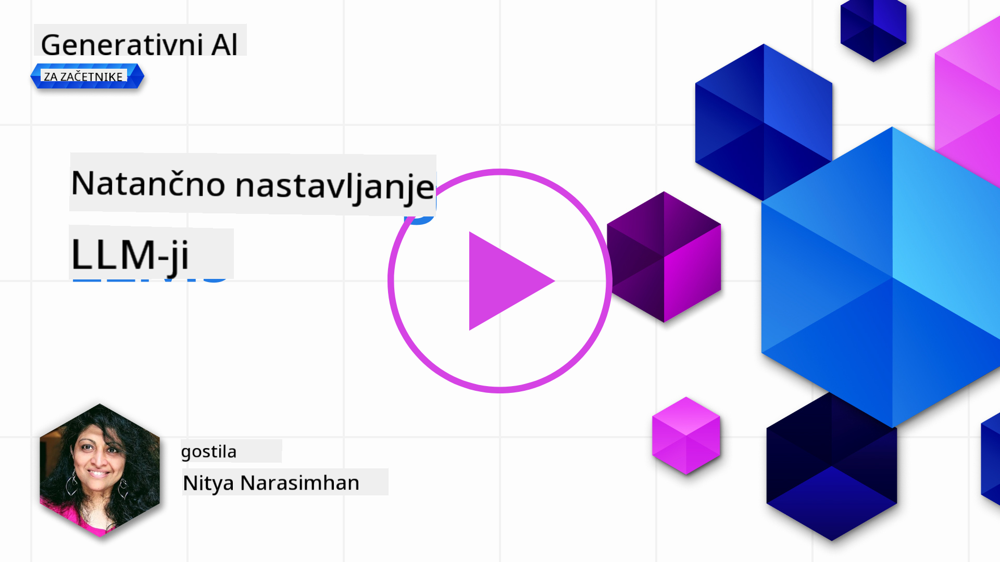
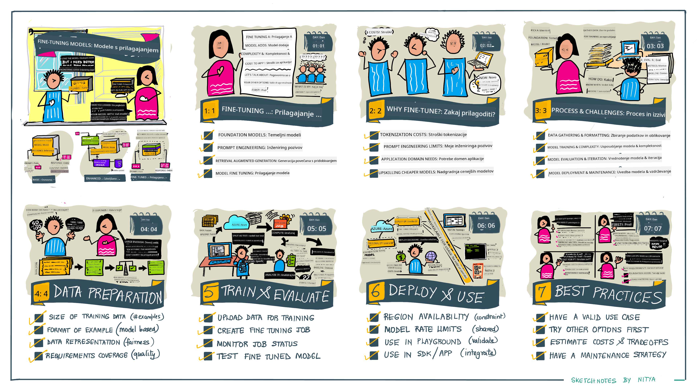

<!--
CO_OP_TRANSLATOR_METADATA:
{
  "original_hash": "68664f7e754a892ae1d8d5e2b7bd2081",
  "translation_date": "2025-05-20T08:23:26+00:00",
  "source_file": "18-fine-tuning/README.md",
  "language_code": "sl"
}
-->

# Fino prilagajanje vašega LLM

Uporaba velikih jezikovnih modelov za gradnjo aplikacij generativne umetne inteligence prinaša nove izzive. Ključno vprašanje je zagotavljanje kakovosti odzivov (natančnost in ustreznost) v vsebini, ki jo model generira za dano zahtevo uporabnika. V prejšnjih lekcijah smo razpravljali o tehnikah, kot sta oblikovanje pozivov in generacija z izboljšanim iskanjem, ki poskušata rešiti težavo z _modificiranjem vhodnega poziva_ obstoječemu modelu.

V današnji lekciji razpravljamo o tretji tehniki, **fino prilagajanje**, ki poskuša rešiti izziv z _ponovnim usposabljanjem modela samega_ z dodatnimi podatki. Poglobimo se v podrobnosti.

## Cilji učenja

Ta lekcija uvaja koncept finega prilagajanja za že usposobljene jezikovne modele, raziskuje prednosti in izzive tega pristopa ter ponuja smernice o tem, kdaj in kako uporabiti fino prilagajanje za izboljšanje učinkovitosti vaših generativnih modelov umetne inteligence.

Do konca te lekcije bi morali biti sposobni odgovoriti na naslednja vprašanja:

- Kaj je fino prilagajanje za jezikovne modele?
- Kdaj in zakaj je fino prilagajanje koristno?
- Kako lahko fino prilagodim že usposobljen model?
- Kakšne so omejitve finega prilagajanja?

Pripravljeni? Začnimo.

## Ilustrirani vodič

Želite dobiti širšo sliko o tem, kaj bomo obravnavali, preden se poglobimo? Oglejte si ta ilustrirani vodič, ki opisuje potek učenja za to lekcijo - od učenja osnovnih konceptov in motivacije za fino prilagajanje do razumevanja procesa in najboljših praks za izvedbo naloge finega prilagajanja. To je fascinantna tema za raziskovanje, zato ne pozabite preveriti strani [Viri](./RESOURCES.md?WT.mc_id=academic-105485-koreyst) za dodatne povezave, ki podpirajo vašo samostojno pot učenja!

## Kaj je fino prilagajanje za jezikovne modele?

Po definiciji so veliki jezikovni modeli _že usposobljeni_ na velike količine besedila, pridobljenega iz različnih virov, vključno z internetom. Kot smo se naučili v prejšnjih lekcijah, potrebujemo tehnike, kot sta _oblikovanje pozivov_ in _generacija z izboljšanim iskanjem_, da izboljšamo kakovost modelovih odzivov na uporabnikova vprašanja ("pozive").

Priljubljena tehnika oblikovanja pozivov vključuje dajanje modelu več smernic o tem, kaj se pričakuje v odzivu, bodisi z zagotavljanjem _navodil_ (eksplicitne smernice) ali _z nekaj primeri_ (implicitne smernice). To se imenuje _učenje z nekaj primeri_, vendar ima dve omejitvi:

- Omejitve žetonov modela lahko omejijo število primerov, ki jih lahko navedete, in omejijo učinkovitost.
- Stroški žetonov modela lahko povečajo stroške dodajanja primerov k vsakemu pozivu in omejijo prilagodljivost.

Fino prilagajanje je običajna praksa v sistemih strojnega učenja, kjer vzamemo že usposobljen model in ga ponovno usposobimo z novimi podatki, da izboljšamo njegovo učinkovitost pri določeni nalogi. V kontekstu jezikovnih modelov lahko fino prilagodimo že usposobljen model _s skrbno izbranim naborom primerov za določeno nalogo ali aplikacijsko področje_, da ustvarimo **prilagojen model**, ki je lahko bolj natančen in ustrezen za to specifično nalogo ali področje. Stranska korist finega prilagajanja je, da lahko zmanjša število potrebnih primerov za učenje z nekaj primeri - zmanjšuje uporabo žetonov in s tem povezane stroške.

## Kdaj in zakaj bi morali fino prilagoditi modele?

V _tem_ kontekstu, ko govorimo o finem prilagajanju, mislimo na **supervizirano** fino prilagajanje, kjer se ponovno usposabljanje izvaja z **dodajanjem novih podatkov**, ki niso bili del izvornega nabora podatkov za usposabljanje. To se razlikuje od nesuperviziranega pristopa finega prilagajanja, kjer se model ponovno usposobi na izvornih podatkih, vendar z različnimi hiperparametri.

Ključna stvar, ki si jo morate zapomniti, je, da je fino prilagajanje napredna tehnika, ki zahteva določeno raven strokovnega znanja za doseganje želenih rezultatov. Če je izvedeno nepravilno, morda ne bo prineslo pričakovanih izboljšav in lahko celo poslabša učinkovitost modela za vaše ciljno področje.

Torej, preden se naučite "kako" fino prilagoditi jezikovne modele, morate vedeti "zakaj" bi se odločili za to pot in "kdaj" začeti postopek finega prilagajanja. Začnite tako, da si zastavite ta vprašanja:

- **Primer uporabe**: Kaj je vaš _primer uporabe_ za fino prilagajanje? Katerega vidika trenutnega že usposobljenega modela želite izboljšati?
- **Alternativa**: Ali ste poskusili _druge tehnike_ za doseganje želenih rezultatov? Uporabite jih za ustvarjanje izhodišča za primerjavo.
  - Oblikovanje pozivov: Poskusite tehnike, kot je dajanje primerov ustreznih odzivov na pozive. Ocenite kakovost odzivov.
  - Generacija z izboljšanim iskanjem: Poskusite izboljšati pozive z rezultati iskanja vaših podatkov. Ocenite kakovost odzivov.
- **Stroški**: Ali ste identificirali stroške finega prilagajanja?
  - Prilagodljivost - ali je že usposobljen model na voljo za fino prilagajanje?
  - Napor - za pripravo podatkov za usposabljanje, ocenjevanje in izboljšanje modela.
  - Računalništvo - za izvajanje nalog finega prilagajanja in uvajanje fino prilagojenega modela.
  - Podatki - dostop do dovolj kakovostnih primerov za vpliv finega prilagajanja.
- **Koristi**: Ali ste potrdili koristi finega prilagajanja?
  - Kakovost - ali je fino prilagojen model presegel izhodišče?
  - Stroški - ali zmanjšuje uporabo žetonov s poenostavitvijo pozivov?
  - Razširljivost - ali lahko ponovno uporabite osnovni model za nova področja?

Z odgovori na ta vprašanja bi morali biti sposobni odločiti, ali je fino prilagajanje pravi pristop za vaš primer uporabe. Idealno je, da je pristop veljaven le, če koristi presegajo stroške. Ko se odločite za nadaljevanje, je čas, da razmislite o _tem, kako_ lahko fino prilagodite že usposobljen model.

Želite dobiti več vpogledov v proces odločanja? Oglejte si [Ali fino prilagoditi ali ne fino prilagoditi](https://www.youtube.com/watch?v=0Jo-z-MFxJs)

## Kako lahko fino prilagodimo že usposobljen model?

Za fino prilagajanje že usposobljenega modela potrebujete:

- že usposobljen model za fino prilagajanje
- nabor podatkov za fino prilagajanje
- okolje za usposabljanje za izvajanje naloge finega prilagajanja
- gostiteljsko okolje za uvajanje fino prilagojenega modela

## Fino prilagajanje v praksi

Naslednji viri ponujajo vodnike po korakih, ki vas vodijo skozi resnični primer z izbranim modelom in skrbno izbranim naborom podatkov. Za delo skozi te vodnike potrebujete račun pri določenem ponudniku, skupaj z dostopom do ustreznega modela in nabora podatkov.

| Ponudnik     | Vodnik                                                                                                                                                                          | Opis                                                                                                                                                                                                                                                                                                                                                                                                                                |
| ------------ | -------------------------------------------------------------------------------------------------------------------------------------------------------------------------------- | ---------------------------------------------------------------------------------------------------------------------------------------------------------------------------------------------------------------------------------------------------------------------------------------------------------------------------------------------------------------------------------------------------------------------------------- |
| OpenAI       | [Kako fino prilagoditi klepetalne modele](https://github.com/openai/openai-cookbook/blob/main/examples/How_to_finetune_chat_models.ipynb?WT.mc_id=academic-105485-koreyst)       | Naučite se fino prilagoditi `gpt-35-turbo` za določeno področje ("asistent za recepte") z pripravo podatkov za usposabljanje, izvajanjem naloge finega prilagajanja in uporabo fino prilagojenega modela za sklepanje.                                                                                                                                                                                                                 |
| Azure OpenAI | [GPT 3.5 Turbo fino prilagajanje vodnik](https://learn.microsoft.com/azure/ai-services/openai/tutorials/fine-tune?tabs=python-new%2Ccommand-line?WT.mc_id=academic-105485-koreyst) | Naučite se fino prilagoditi `gpt-35-turbo-0613` model **na Azure** s koraki za ustvarjanje in nalaganje podatkov za usposabljanje, izvajanje naloge finega prilagajanja. Uvedite in uporabite nov model.                                                                                                                                                                                                                               |
| Hugging Face | [Fino prilagajanje LLM-jev s Hugging Face](https://www.philschmid.de/fine-tune-llms-in-2024-with-trl?WT.mc_id=academic-105485-koreyst)                                           | Ta objava na blogu vas vodi skozi fino prilagajanje _odprtega LLM_ (npr. `CodeLlama 7B`) z uporabo knjižnice [transformers](https://huggingface.co/docs/transformers/index?WT.mc_id=academic-105485-koreyst) in [Učenje z ojačitvijo za transformatorje (TRL)](https://huggingface.co/docs/trl/index?WT.mc_id=academic-105485-koreyst]) z odprtimi [nabori podatkov](https://huggingface.co/docs/datasets/index?WT.mc_id=academic-105485-koreyst) na Hugging Face. |
|              |                                                                                                                                                                                  |                                                                                                                                                                                                                                                                                                                                                                                                                                    |
| 🤗 AutoTrain | [Fino prilagajanje LLM-jev z AutoTrain](https://github.com/huggingface/autotrain-advanced/?WT.mc_id=academic-105485-koreyst)                                                     | AutoTrain (ali AutoTrain Advanced) je knjižnica za python, ki jo je razvil Hugging Face in omogoča fino prilagajanje za številne različne naloge, vključno z finim prilagajanjem LLM-jev. AutoTrain je rešitev brez kode in fino prilagajanje se lahko izvede v vašem lastnem oblaku, na Hugging Face Spaces ali lokalno. Podpira tako spletni vmesnik GUI, CLI kot tudi usposabljanje prek yaml konfiguracijskih datotek.                                           |
|              |                                                                                                                                                                                  |                                                                                                                                                                                                                                                                                                                                                                                                                                    |

## Naloga

Izberite enega od zgoraj navedenih vodnikov in ga prehodite. _Morda bomo replicirali različico teh vodnikov v Jupyter Notebooks v tem repozitoriju samo za referenco. Prosimo, da neposredno uporabite izvorne vire za pridobitev najnovejših različic_.

## Odlično delo! Nadaljujte z učenjem.

Po zaključku te lekcije si oglejte našo [Zbirko učenja generativne umetne inteligence](https://aka.ms/genai-collection?WT.mc_id=academic-105485-koreyst) za nadaljnje nadgradnje vašega znanja o generativni umetni inteligenci!

Čestitke!! Zaključili ste zadnjo lekcijo iz serije v2 za ta tečaj! Ne prenehajte z učenjem in gradnjo. \*\*Oglejte si stran [VIRI](RESOURCES.md?WT.mc_id=academic-105485-koreyst) za seznam dodatnih predlogov samo za to temo.

Naša serija lekcij v1 je bila tudi posodobljena z več nalogami in koncepti. Zato si vzemite trenutek za osvežitev vašega znanja - in prosimo [delite svoja vprašanja in povratne informacije](https://github.com/microsoft/generative-ai-for-beginners/issues?WT.mc_id=academic-105485-koreyst) za pomoč pri izboljšanju teh lekcij za skupnost.

**Omejitev odgovornosti**:  
Ta dokument je bil preveden z uporabo storitve AI prevajanja [Co-op Translator](https://github.com/Azure/co-op-translator). Medtem ko si prizadevamo za natančnost, vas prosimo, da se zavedate, da lahko avtomatski prevodi vsebujejo napake ali netočnosti. Izvirni dokument v njegovem maternem jeziku je treba obravnavati kot avtoritativni vir. Za kritične informacije priporočamo strokovni prevod s strani človeka. Ne odgovarjamo za kakršne koli nesporazume ali napačne razlage, ki izhajajo iz uporabe tega prevoda.