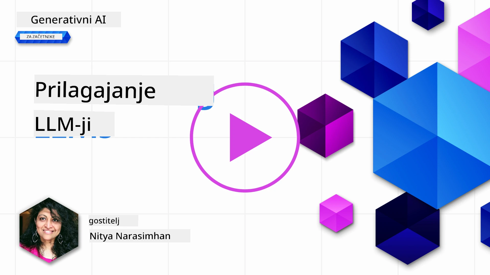
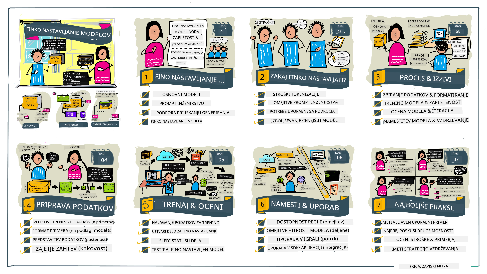

# Prilagoditev vašega LLM

Uporaba velikih jezikovnih modelov za gradnjo generativnih AI aplikacij prinaša nove izzive. Ključno vprašanje je zagotavljanje kakovosti odziva (točnost in relevantnost) v vsebini, ki jo model ustvari za določeno uporabniško zahtevo. V preteklih lekcijah smo obravnavali tehnike, kot so inženiring pozivov in generacija s pomočjo pridobivanja informacij, ki skušajo težavo rešiti z _modifikacijo vnosa poziva_ v obstoječi model.

V današnji lekciji obravnavamo tretjo tehniko, **prilagajanje**, ki skuša izziv nasloviti z _ponovnim usposabljanjem samega modela_ z dodatnimi podatki. Pojdimo v podrobnosti.

## Cilji učenja

Ta lekcija uvaja koncept prilagajanja za vnaprej usposobljene jezikovne modele, raziskuje prednosti in izzive tega pristopa ter daje navodila, kdaj in kako uporabiti prilagajanje za izboljšanje delovanja vaših generativnih AI modelov.

Na koncu te lekcije boste znali odgovoriti na sledeča vprašanja:

- Kaj je prilagajanje jezikovnih modelov?
- Kdaj in zakaj je prilagajanje koristno?
- Kako lahko prilagodim vnaprej usposobljen model?
- Kakšne so omejitve prilagajanja?

Pripravljeni? Začnimo.

## Ilustriran vodič

Želite dobiti celovit pregled, kaj bomo obravnavali, preden se poglobimo? Oglejte si ta ilustriran vodič, ki opisuje učni proces za to lekcijo – od spoznavanja ključnih konceptov in motivacije za prilagajanje, do razumevanja procesa in najboljših praks za izvedbo naloge prilagajanja. To je fascinantna tema za raziskovanje, zato ne pozabite obiskati strani z [viri](./RESOURCES.md?WT.mc_id=academic-105485-koreyst) za dodatne povezave, ki podpirajo vašo samostojno učno pot!

## Kaj je prilagajanje jezikovnih modelov?

Veliki jezikovni modeli so po definiciji _vnaprej usposobljeni_ na velikih količinah besedil, pridobljenih iz različnih virov, vključno z internetom. Kot smo se naučili v prejšnjih lekcijah, potrebujemo tehnike, kot sta _inženiring pozivov_ in _generacija z dodatnim iskanjem_, da izboljšamo kakovost modelovih odgovorov na uporabnikova vprašanja ("pozive").

Priljubljena tehnika inženiringa pozivov vključuje dajanje več smernic modelu o tem, kaj se pričakuje v odgovoru, bodisi z zagotavljanjem _navodil_ (izrecnih smernic) ali _z nekaj primeri_ (implicitnih smernic). To imenujemo _učenje z nekaj primeri_, vendar ima dve omejitvi:

- Omejitve modela glede števila tokenov lahko omejijo število primerov, ki jih lahko podate, ter tako omejijo učinkovitost.
- Stroški tokenov modela lahko naredijo dodajanje primerov k vsakemu pozivu drago in omejijo prilagodljivost.

Prilagajanje je običajna praksa v sistemih za strojno učenje, kjer vzamemo vnaprej usposobljen model in ga ponovno usposobimo z novimi podatki, da izboljšamo njegovo delovanje pri določeni nalogi. V kontekstu jezikovnih modelov lahko prilagodimo vnaprej usposobljen model _s skrbno izbranim naborom primerov za določeno nalogo ali področje uporabe_, da ustvarimo **prilagojen model**, ki je lahko bolj natančen in relevanten za to specifično nalogo ali področje. Dodaten plus prilagajanja je tudi zmanjšanje števila potrebnih primerov za učenje z nekaj primeri – kar zmanjša uporabo tokenov in povezane stroške.

## Kdaj in zakaj bi morali prilagajati modele?

V _tem_ kontekstu, ko govorimo o prilagajanju, govorimo o **nadzorovanem** prilagajanju, kjer se ponovno usposabljanje izvede z **dodajanjem novih podatkov**, ki niso bili del izvornega učnega nabora. To se razlikuje od nenadzorovanega pristopa prilagajanja, kjer se model ponovno usposobi na izvornih podatkih, vendar z različnimi hiperparametri.

Ključno je, da je prilagajanje napredna tehnika, ki zahteva določeno stopnjo strokovnosti, da doseže želene rezultate. Če je izvedena napačno, morda ne prinese pričakovanih izboljšav, lahko pa celo poslabša delovanje modela za izbrano področje.

Torej, preden se naučite "kako" prilagoditi jezikovne modele, morate vedeti "zakaj" bi se sploh lotili tega in "kdaj" začeti proces prilagajanja. Začnite z vprašanjem sami sebi:

- **Uporabniški primer**: Kakšen je vaš _uporabniški primer_ za prilagajanje? Kateri vidik trenutnega vnaprej usposobljenega modela želite izboljšati?
- **Alternativa**: Ste poskusili _druge tehnike_, da dosežete želene rezultate? Uporabite jih za ustvarjanje izhodišča za primerjavo.
  - Inženiring pozivov: Preizkusite tehnike, kot je učenje z nekaj primeri, kjer uporabite primere ustreznih odgovorov na pozive. Ocenite kakovost odgovorov.
  - Generacija z dodatnim iskanjem: Poskusite dopolniti pozive z rezultati poizvedb, pridobljenih z iskanjem v vaših podatkih. Ocenite kakovost odgovorov.
- **Stroški**: Ste ocenili stroške prilagajanja?
  - Prilagodljivost – ali je vnaprej usposobljen model na voljo za prilagajanje?
  - Napor – za pripravo učnih podatkov, ocenjevanje in izboljševanje modela.
  - Računska moč – za izvajanje nalog prilagajanja in nameščanje prilagojenega modela.
  - Podatki – dostop do dovolj kakovostnih primerov za vpliv prilagajanja.
- **Koristi**: Ste potrdili koristi prilagajanja?
  - Kakovost – je prilagojeni model presegel začetno točko?
  - Stroški – ali zmanjša porabo tokenov z enostavnejšimi pozivi?
  - Razširljivost – ali lahko osnovni model ponovno uporabite za nova področja?

Z odgovori na ta vprašanja boste lahko presodili, ali je prilagajanje prava pot za vaš primer uporabe. Idealno je, da je pristop veljaven samo, če koristi pretehtajo stroške. Ko se odločite nadaljevati, je čas, da razmislite o _tem, kako_ lahko prilagodite vnaprej usposobljen model.

Želite več vpogleda v odločanje? Oglejte si [To fine-tune or not to fine-tune](https://www.youtube.com/watch?v=0Jo-z-MFxJs).

## Kako lahko prilagodimo vnaprej usposobljen model?

Za prilagoditev vnaprej usposobljenega modela potrebujete:

- vnaprej usposobljen model za prilagajanje
- nabor podatkov za prilagajanje
- učni okolje za izvajanje naloge prilagajanja
- gostujoče okolje za nameščanje prilagojenega modela

## Prilagajanje v praksi

Naslednji viri ponujajo korak za korakom vodiče, ki vas vodijo skozi pravi primer uporabe izbranega modela s skrbno izbranim naborom podatkov. Za delo z temi vodiči potrebujete račun pri določenem ponudniku ter dostop do relevantnih modelov in podatkovnih nizov.

| Ponudnik     | Vodič                                                                                                                                                                       | Opis                                                                                                                                                                                                                                                                                                                                                                                                                              |
| ------------ | -------------------------------------------------------------------------------------------------------------------------------------------------------------------------- | -------------------------------------------------------------------------------------------------------------------------------------------------------------------------------------------------------------------------------------------------------------------------------------------------------------------------------------------------------------------------------------------------------------------------------- |
| OpenAI       | [Kako prilagoditi klepetalne modele](https://github.com/openai/openai-cookbook/blob/main/examples/How_to_finetune_chat_models.ipynb?WT.mc_id=academic-105485-koreyst)      | Naučite se prilagoditi `gpt-35-turbo` za določen domeno ("pomočnik za recepte") z pripravo učnih podatkov, izvajanjem prilagajanja in uporabo prilagojenega modela za sklepanje.                                                                                                                                                                                                                                            |
| Azure OpenAI | [Vodič za prilagajanje GPT 3.5 Turbo](https://learn.microsoft.com/azure/ai-services/openai/tutorials/fine-tune?tabs=python-new%2Ccommand-line&WT.mc_id=academic-105485-koreyst) | Naučite se prilagoditi model `gpt-35-turbo-0613` **na Azure** z ustvarjanjem in nalaganjem učnih podatkov, izvajanjem prilagajanja, nameščanjem in uporabo novega modela.                                                                                                                                                                                                                                                 |
| Hugging Face | [Prilagajanje LLM z Hugging Face](https://www.philschmid.de/fine-tune-llms-in-2024-with-trl?WT.mc_id=academic-105485-koreyst)                                              | Ta blog vodi skozi postopek prilagajanja odprtega LLM (npr. `CodeLlama 7B`) z uporabo knjižnice [transformers](https://huggingface.co/docs/transformers/index?WT.mc_id=academic-105485-koreyst) in [Transformer Reinforcement Learning (TRL)](https://huggingface.co/docs/trl/index?WT.mc_id=academic-105485-koreyst) z odprtimi [podatkovnimi nizi](https://huggingface.co/docs/datasets/index?WT.mc_id=academic-105485-koreyst) na Hugging Face. |
|              |                                                                                                                                                                            |                                                                                                                                                                                                                                                                                                                                                                                                                                  |
| 🤗 AutoTrain | [Prilagajanje LLM z AutoTrain](https://github.com/huggingface/autotrain-advanced/?WT.mc_id=academic-105485-koreyst)                                                         | AutoTrain (ali AutoTrain Advanced) je Pythonova knjižnica, ki jo je razvil Hugging Face in omogoča prilagoditev za različne naloge, vključno s prilagajanjem LLM. AutoTrain je rešitev brez kode, prilagajanje pa je možno v lastnem oblaku, na Hugging Face Spaces ali lokalno. Ponuja spletni vmesnik, CLI in učenje preko YAML konfiguracijskih datotek.                                                                             |
|              |                                                                                                                                                                            |                                                                                                                                                                                                                                                                                                                                                                                                                                  |
| 🦥 Unsloth   | [Prilagajanje LLM z Unsloth](https://github.com/unslothai/unsloth)                                                                                                         | Unsloth je odprtokodni okvir, ki podpira prilagajanje LLM in okrepitevno učenje (RL). Olajša lokalno učenje, ocenjevanje in nameščanje z uporabnimi [zvezki](https://github.com/unslothai/notebooks). Podpira tudi pretvorbo besedila v govor (TTS), BERT in multimodalne modele. Za začetek si preberite njihov korak-po-korak [Vodič za prilagajanje LLM](https://docs.unsloth.ai/get-started/fine-tuning-llms-guide).                                      |
|              |                                                                                                                                                                            |                                                                                                                                                                                                                                                                                                                                                                                                                                  |
## Naloga

Izberite enega izmed zgornjih vodičev in ga preizkusite. _Lahko bomo v tem repozitoriju za referenco ustvarili verzije teh vodičev v Jupyter zvezkih. Prosim uporabite originalne vire za najnovejše različice_.

## Odlično delo! Nadaljujte z učenjem.

Po zaključku te lekcije si oglejte našo [kolekcijo za učenje generativne AI](https://aka.ms/genai-collection?WT.mc_id=academic-105485-koreyst), da še naprej nadgrajujete svoje znanje o generativni AI!

Čestitamo!! Zaključili ste zadnjo lekcijo iz serije v2 tega tečaja! Ne nehajte se učiti in ustvarjati. \*\*Oglejte si stran z [VIRI](RESOURCES.md?WT.mc_id=academic-105485-koreyst) za seznam dodatnih priporočil prav za to temo.

Naša serija lekcij v1 je prav tako posodobljena z več nalogami in koncepti. Vzemite si minuto za osvežitev znanja – in prosimo, [delite svoja vprašanja in povratne informacije](https://github.com/microsoft/generative-ai-for-beginners/issues?WT.mc_id=academic-105485-koreyst), da pomagamo izboljšati te lekcije za skupnost.

---

<!-- CO-OP TRANSLATOR DISCLAIMER START -->
**Omejitev odgovornosti**:
Ta dokument je bil preveden z uporabo AI prevajalske storitve [Co-op Translator](https://github.com/Azure/co-op-translator). Čeprav si prizadevamo za natančnost, vas prosimo, da upoštevate, da lahko avtomatizirani prevodi vsebujejo napake ali netočnosti. Izvirni dokument v izvorni jezik velja za avtoritativni vir. Za kritične informacije priporočamo profesionalni človeški prevod. Za morebitna nesporazume ali napačne interpretacije, ki izhajajo iz uporabe tega prevoda, ne prevzemamo odgovornosti.
<!-- CO-OP TRANSLATOR DISCLAIMER END -->