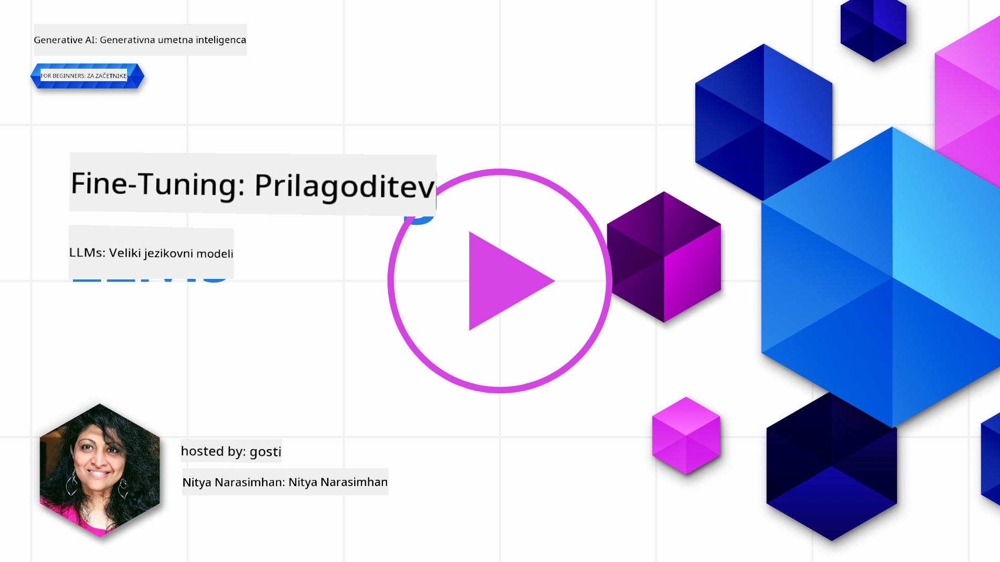
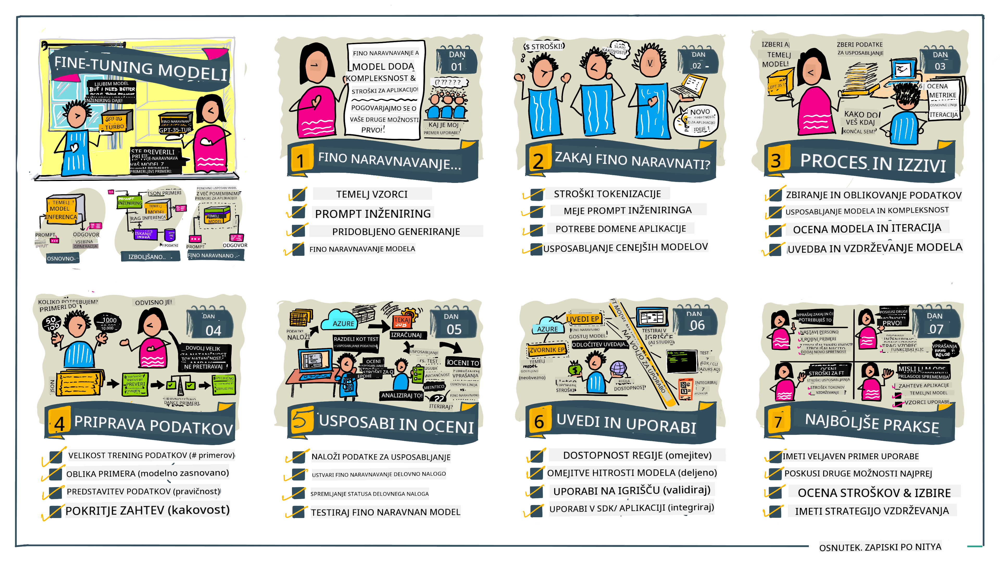

<!--
CO_OP_TRANSLATOR_METADATA:
{
  "original_hash": "68664f7e754a892ae1d8d5e2b7bd2081",
  "translation_date": "2025-06-26T00:54:01+00:00",
  "source_file": "18-fine-tuning/README.md",
  "language_code": "sl"
}
-->

# Fino Nastavljanje Vašega LLM

Uporaba velikih jezikovnih modelov za gradnjo aplikacij generativne umetne inteligence prinaša nove izzive. Ključno vprašanje je zagotavljanje kakovosti odgovorov (točnost in ustreznost) v vsebini, ki jo model ustvari za dano uporabniško zahtevo. V prejšnjih lekcijah smo razpravljali o tehnikah, kot sta oblikovanje pozivov in generacija z obogatitvijo iskanja, ki poskušajo rešiti problem z _modificiranjem vhodnega poziva_ obstoječemu modelu.

V današnji lekciji bomo obravnavali tretjo tehniko, **fino nastavljanje**, ki poskuša nasloviti izziv z _ponovnim usposabljanjem samega modela_ z dodatnimi podatki. Poglobimo se v podrobnosti.

## Učni Cilji

Ta lekcija uvaja koncept finega nastavljanja za vnaprej usposobljene jezikovne modele, raziskuje prednosti in izzive tega pristopa ter ponuja smernice, kdaj in kako uporabiti fino nastavljanje za izboljšanje delovanja vaših generativnih AI modelov.

Po koncu te lekcije bi morali biti sposobni odgovoriti na naslednja vprašanja:

- Kaj je fino nastavljanje za jezikovne modele?
- Kdaj in zakaj je fino nastavljanje koristno?
- Kako lahko fino nastavim vnaprej usposobljen model?
- Kakšne so omejitve finega nastavljanja?

Pripravljeni? Začnimo.

## Ilustrirani Vodnik

Želite dobiti celotno sliko o tem, kaj bomo pokrili, preden se poglobimo? Oglejte si ta ilustrirani vodnik, ki opisuje učno pot za to lekcijo - od učenja osnovnih konceptov in motivacije za fino nastavljanje, do razumevanja procesa in najboljših praks za izvajanje naloge finega nastavljanja. To je fascinantna tema za raziskovanje, zato ne pozabite preveriti strani [Viri](./RESOURCES.md?WT.mc_id=academic-105485-koreyst) za dodatne povezave, ki podpirajo vašo samostojno učno pot!

## Kaj je fino nastavljanje za jezikovne modele?

Po definiciji so veliki jezikovni modeli _vnaprej usposobljeni_ na velikih količinah besedila iz različnih virov, vključno z internetom. Kot smo se naučili v prejšnjih lekcijah, potrebujemo tehnike, kot sta _oblikovanje pozivov_ in _generacija z obogatitvijo iskanja_, da izboljšamo kakovost odgovorov modela na uporabnikova vprašanja ("pozive").

Priljubljena tehnika oblikovanja pozivov vključuje dajanje modelu več usmeritev o tem, kaj se pričakuje v odgovoru, bodisi z zagotavljanjem _navodil_ (eksplicitne usmeritve) bodisi _z nekaj primeri_ (implicitna usmeritev). To se imenuje _učenje iz nekaj primerov_, vendar ima dve omejitvi:

- Omejitve števila tokenov modela lahko omejijo število primerov, ki jih lahko podate, in omejijo učinkovitost.
- Stroški tokenov modela lahko naredijo dodajanje primerov k vsakemu pozivu drago in omejijo prilagodljivost.

Fino nastavljanje je običajna praksa v sistemih strojnega učenja, kjer vzamemo vnaprej usposobljen model in ga ponovno usposobimo z novimi podatki, da izboljšamo njegovo delovanje pri določeni nalogi. V kontekstu jezikovnih modelov lahko vnaprej usposobljen model fino nastavimo _s skrbno izbranim naborom primerov za določeno nalogo ali aplikacijsko področje_, da ustvarimo **prilagojen model**, ki je lahko natančnejši in ustreznejši za to specifično nalogo ali področje. Stranska korist finega nastavljanja je, da lahko tudi zmanjša število potrebnih primerov za učenje iz nekaj primerov - zmanjšanje uporabe tokenov in povezanih stroškov.

## Kdaj in zakaj bi morali fino nastaviti modele?

V _tem_ kontekstu, ko govorimo o finem nastavljanju, se sklicujemo na **nadzorovano** fino nastavljanje, kjer se ponovno usposabljanje izvaja z **dodajanjem novih podatkov**, ki niso bili del izvornega nabora podatkov za usposabljanje. To je drugače od nenadzorovanega pristopa finega nastavljanja, kjer se model ponovno usposobi na izvornih podatkih, vendar z različnimi hiperparametri.

Ključna stvar, ki si jo morate zapomniti, je, da je fino nastavljanje napredna tehnika, ki zahteva določeno raven strokovnega znanja za dosego želenih rezultatov. Če je izvedeno nepravilno, morda ne bo zagotovilo pričakovanih izboljšav, lahko celo poslabša delovanje modela za vaše ciljno področje.

Torej, preden se naučite "kako" fino nastaviti jezikovne modele, morate vedeti "zakaj" bi morali ubrati to pot in "kdaj" začeti proces finega nastavljanja. Začnite z zastavljanjem teh vprašanj:

- **Uporabniški primer**: Kaj je vaš _uporabniški primer_ za fino nastavljanje? Kateri vidik trenutnega vnaprej usposobljenega modela želite izboljšati?
- **Alternativne možnosti**: Ste poskusili _druge tehnike_ za dosego želenih rezultatov? Uporabite jih za ustvarjanje izhodišča za primerjavo.
  - Oblikovanje pozivov: Poskusite tehnike, kot je podajanje pozivov z nekaj primeri relevantnih odzivov. Ocenite kakovost odgovorov.
  - Generacija z obogatitvijo iskanja: Poskusite obogatiti pozive z rezultati iskanja, pridobljenimi z iskanjem vaših podatkov. Ocenite kakovost odgovorov.
- **Stroški**: Ste identificirali stroške za fino nastavljanje?
  - Prilagodljivost - ali je vnaprej usposobljen model na voljo za fino nastavljanje?
  - Napor - za pripravo podatkov za usposabljanje, ocenjevanje in izboljšanje modela.
  - Računalniška moč - za izvajanje nalog finega nastavljanja in uvajanje fino nastavljenega modela
  - Podatki - dostop do zadostne kakovosti primerov za vpliv finega nastavljanja
- **Prednosti**: Ste potrdili prednosti finega nastavljanja?
  - Kakovost - ali je fino nastavljen model presegel izhodiščni model?
  - Stroški - ali zmanjša uporabo tokenov z enostavitvijo pozivov?
  - Razširljivost - ali lahko osnovni model uporabite za nova področja?

Z odgovarjanjem na ta vprašanja bi morali biti sposobni odločiti, ali je fino nastavljanje pravi pristop za vaš uporabniški primer. Idealno je, da je pristop veljaven le, če koristi prevladajo nad stroški. Ko se odločite za nadaljevanje, je čas, da razmislite o tem, _kako_ lahko fino nastavite vnaprej usposobljen model.

Želite pridobiti več vpogledov v proces odločanja? Oglejte si [Ali fino nastaviti ali ne fino nastaviti](https://www.youtube.com/watch?v=0Jo-z-MFxJs)

## Kako lahko fino nastavimo vnaprej usposobljen model?

Za fino nastavljanje vnaprej usposobljenega modela potrebujete:

- vnaprej usposobljen model za fino nastavljanje
- nabor podatkov za fino nastavljanje
- okolje za usposabljanje za izvajanje naloge finega nastavljanja
- okolje za gostovanje za uvajanje fino nastavljenega modela

## Fino Nastavljanje v Praksi

Naslednji viri ponujajo vodnike po korakih, ki vas vodijo skozi resnični primer z uporabo izbranega modela s skrbno izbranim naborom podatkov. Za delo skozi te vadnice potrebujete račun pri določenem ponudniku, skupaj z dostopom do ustreznega modela in naborov podatkov.

| Ponudnik     | Vadnica                                                                                                                                                                       | Opis                                                                                                                                                                                                                                                                                                                                                                                                                        |
| ------------ | ------------------------------------------------------------------------------------------------------------------------------------------------------------------------------ | ---------------------------------------------------------------------------------------------------------------------------------------------------------------------------------------------------------------------------------------------------------------------------------------------------------------------------------------------------------------------------------------------------------------------------------- |
| OpenAI       | [Kako fino nastaviti klepetalne modele](https://github.com/openai/openai-cookbook/blob/main/examples/How_to_finetune_chat_models.ipynb?WT.mc_id=academic-105485-koreyst)                | Naučite se fino nastaviti `gpt-35-turbo` za določeno področje ("asistent za recepte") z pripravo podatkov za usposabljanje, izvajanjem naloge finega nastavljanja in uporabo fino nastavljenega modela za sklepanje.                                                                                                                                                                                                                                              |
| Azure OpenAI | [Vadnica za fino nastavljanje GPT 3.5 Turbo](https://learn.microsoft.com/azure/ai-services/openai/tutorials/fine-tune?tabs=python-new%2Ccommand-line?WT.mc_id=academic-105485-koreyst) | Naučite se fino nastaviti `gpt-35-turbo-0613` model **na Azure** z izvedbo korakov za ustvarjanje in nalaganje podatkov za usposabljanje ter izvajanje naloge finega nastavljanja. Uvajanje in uporaba novega modela.                                                                                                                                                                                                                                                                 |
| Hugging Face | [Fino nastavljanje LLM-jev z Hugging Face](https://www.philschmid.de/fine-tune-llms-in-2024-with-trl?WT.mc_id=academic-105485-koreyst)                                               | Ta blog objava vas vodi skozi fino nastavljanje _odprtega LLM_ (npr. `CodeLlama 7B`) z uporabo knjižnice [transformers](https://huggingface.co/docs/transformers/index?WT.mc_id=academic-105485-koreyst) in [Transformer Reinforcement Learning (TRL)](https://huggingface.co/docs/trl/index?WT.mc_id=academic-105485-koreyst]) z odprtimi [nabori podatkov](https://huggingface.co/docs/datasets/index?WT.mc_id=academic-105485-koreyst) na Hugging Face. |
|              |                                                                                                                                                                                |                                                                                                                                                                                                                                                                                                                                                                                                                                    |
| 🤗 AutoTrain | [Fino nastavljanje LLM-jev z AutoTrain](https://github.com/huggingface/autotrain-advanced/?WT.mc_id=academic-105485-koreyst)                                                         | AutoTrain (ali AutoTrain Advanced) je python knjižnica, ki jo je razvil Hugging Face in omogoča fino nastavljanje za številne različne naloge, vključno z finim nastavljanjem LLM. AutoTrain je rešitev brez kode in fino nastavljanje se lahko izvede v vašem lastnem oblaku, na Hugging Face Spaces ali lokalno. Podpira tako spletni GUI, CLI kot tudi usposabljanje prek yaml konfiguracijskih datotek.                                                                               |
|              |                                                                                                                                                                                |                                                                                                                                                                                                                                                                                                                                                                                                                                    |

## Naloga

Izberite eno od zgornjih vadnic in jo prehodite. _Morda bomo replicirali različico teh vadnic v Jupyter Zvezkih v tem repozitoriju samo za referenco. Prosimo, uporabite izvorne vire neposredno, da dobite najnovejše različice_.

## Odlično Delo! Nadaljujte z Učenjem.

Po zaključku te lekcije si oglejte našo [Zbirko učenja o Generativni AI](https://aka.ms/genai-collection?WT.mc_id=academic-105485-koreyst), da nadaljujete z nadgradnjo svojega znanja o Generativni AI!

Čestitamo!! Zaključili ste zadnjo lekcijo iz serije v2 za ta tečaj! Ne prenehajte se učiti in graditi. \*\*Oglejte si stran [VIRI](RESOURCES.md?WT.mc_id=academic-105485-koreyst) za seznam dodatnih predlogov za to temo.

Naša serija lekcij v1 je bila prav tako posodobljena z več nalogami in koncepti. Vzemite si trenutek za osvežitev svojega znanja - in prosimo [delite svoja vprašanja in povratne informacije](https://github.com/microsoft/generative-ai-for-beginners/issues?WT.mc_id=academic-105485-koreyst), da nam pomagate izboljšati te lekcije za skupnost.

**Omejitev odgovornosti**:  
Ta dokument je bil preveden z uporabo storitve AI za prevajanje [Co-op Translator](https://github.com/Azure/co-op-translator). Medtem ko si prizadevamo za natančnost, vas prosimo, da se zavedate, da avtomatizirani prevodi lahko vsebujejo napake ali netočnosti. Izvirni dokument v njegovem maternem jeziku je treba obravnavati kot avtoritativni vir. Za ključne informacije se priporoča profesionalni prevod s strani človeka. Ne prevzemamo odgovornosti za morebitne nesporazume ali napačne interpretacije, ki bi nastale zaradi uporabe tega prevoda.