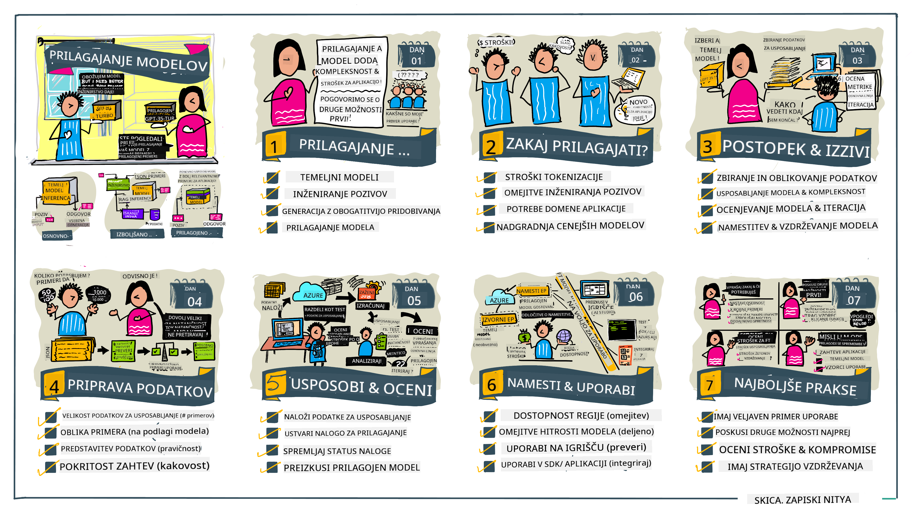

<!--
CO_OP_TRANSLATOR_METADATA:
{
  "original_hash": "807f0d9fc1747e796433534e1be6a98a",
  "translation_date": "2025-10-18T01:44:17+00:00",
  "source_file": "18-fine-tuning/README.md",
  "language_code": "sl"
}
-->

# Prilagajanje vašega LLM

Uporaba velikih jezikovnih modelov za gradnjo aplikacij generativne umetne inteligence prinaša nove izzive. Ključno vprašanje je zagotavljanje kakovosti odgovorov (natančnost in ustreznost) v vsebini, ki jo model ustvari za določeno zahtevo uporabnika. V prejšnjih lekcijah smo obravnavali tehnike, kot sta oblikovanje pozivov in generacija, podprta z iskanjem, ki poskušata rešiti te쬬vo z _modifikacijo vhodnega poziva_ obstoječega modela.

V današnji lekciji bomo obravnavali tretjo tehniko, **prilagajanje**, ki poskuša rešiti izziv z _ponovnim učenjem samega modela_ z dodatnimi podatki. Poglobimo se v podrobnosti.

## Cilji učenja

Ta lekcija uvaja koncept prilagajanja za vnaprej naučene jezikovne modele, raziskuje prednosti in izzive tega pristopa ter ponuja smernice o tem, kdaj in kako uporabiti prilagajanje za izboljšanje zmogljivosti vaših generativnih AI modelov.

Na koncu te lekcije boste lahko odgovorili na naslednja vprašanja:

- Kaj je prilagajanje jezikovnih modelov?
- Kdaj in zakaj je prilagajanje koristno?
- Kako lahko prilagodim vnaprej naučen model?
- Kakšne so omejitve prilagajanja?

Pripravljeni? Začnimo.

## Ilustrirani vodič

Želite dobiti celotno sliko o tem, kaj bomo obravnavali, preden se poglobimo? Oglejte si ta ilustrirani vodič, ki opisuje učni proces za to lekcijo - od učenja osnovnih konceptov in motivacije za prilagajanje do razumevanja procesa in najboljših praks za izvedbo naloge prilagajanja. To je fascinantna tema za raziskovanje, zato ne pozabite preveriti strani [Viri](./RESOURCES.md?WT.mc_id=academic-105485-koreyst) za dodatne povezave, ki podpirajo vašo samostojno učno pot!

## Kaj je prilagajanje jezikovnih modelov?

Po definiciji so veliki jezikovni modeli _vnaprej naučeni_ na velikih količinah besedil, pridobljenih iz različnih virov, vključno z internetom. Kot smo se naučili v prejšnjih lekcijah, potrebujemo tehnike, kot sta _oblikovanje pozivov_ in _generacija, podprta z iskanjem_, da izboljšamo kakovost odgovorov modela na vprašanja uporabnika ("pozive").

Priljubljena tehnika oblikovanja pozivov vključuje dajanje modelu več navodil o tem, kaj se pričakuje v odgovoru, bodisi z zagotavljanjem _navodil_ (izrecna navodila) bodisi _z nekaj primeri_ (implicitna navodila). To se imenuje _učenje z nekaj primeri_, vendar ima dve omejitvi:

- Omejitve števila tokenov modela lahko omejijo število primerov, ki jih lahko podate, in s tem učinkovitost.
- Stroški tokenov modela lahko podra쬴jo dodajanje primerov k vsakemu pozivu in omejijo prilagodljivost.

Prilagajanje je običajna praksa v sistemih strojnega učenja, kjer vzamemo vnaprej naučen model in ga ponovno naučimo z novimi podatki, da izboljšamo njegovo zmogljivost pri določeni nalogi. V kontekstu jezikovnih modelov lahko vnaprej naučen model prilagodimo _z izbranim naborom primerov za določeno nalogo ali aplikacijsko področje_, da ustvarimo **prilagojen model**, ki je lahko bolj natančen in ustrezen za to specifično nalogo ali področje. Stranska korist prilagajanja je, da lahko zmanjša število potrebnih primerov za učenje z nekaj primeri - kar zmanjša uporabo tokenov in s tem povezane stroške.

## Kdaj in zakaj bi morali prilagoditi modele?

V _tem_ kontekstu, ko govorimo o prilagajanju, mislimo na **nadzorovano** prilagajanje, kjer se ponovno učenje izvaja z **dodajanjem novih podatkov**, ki niso bili del prvotnega nabora podatkov za učenje. To se razlikuje od nenadzorovanega pristopa prilagajanja, kjer se model ponovno nauči na prvotnih podatkih, vendar z različnimi hiperparametri.

Ključno je, da si zapomnite, da je prilagajanje napredna tehnika, ki zahteva določeno raven strokovnosti za dosego 쬰lenih rezultatov. Če je izvedeno nepravilno, morda ne bo prineslo pričakovanih izboljšav in lahko celo poslabša zmogljivost modela za vaše ciljno področje.

Torej, preden se naučite "kako" prilagoditi jezikovne modele, morate vedeti "zakaj" bi se odločili za to pot in "kdaj" začeti proces prilagajanja. Začnite z zastavljanjem teh vprašanj:

- **Uporaba**: Kakšen je vaš _namen uporabe_ prilagajanja? Kateri vidik trenutnega vnaprej naučenega modela 쬰lite izboljšati?
- **Alternativne mo쬹osti**: Ste poskusili _druge tehnike_ za dosego 쬰lenih rezultatov? Uporabite jih za ustvarjanje izhodišč za primerjavo.
  - Oblikovanje pozivov: Poskusite tehnike, kot je učenje z nekaj primeri, z ustreznimi primeri odgovorov na pozive. Ocenite kakovost odgovorov.
  - Generacija, podprta z iskanjem: Poskusite dopolniti pozive z rezultati iskanja v vaših podatkih. Ocenite kakovost odgovorov.
- **Stroški**: Ste identificirali stroške prilagajanja?
  - Prilagodljivost - ali je vnaprej naučen model na voljo za prilagajanje?
  - Trud - za pripravo podatkov za učenje, ocenjevanje in izboljšanje modela.
  - Računalniška moč - za izvajanje nalog prilagajanja in uvajanje prilagojenega modela.
  - Podatki - dostop do zadostnega števila kakovostnih primerov za vpliv prilagajanja.
- **Koristi**: Ste potrdili koristi prilagajanja?
  - Kakovost - ali je prilagojen model presegel izhodiščne rezultate?
  - Stroški - ali zmanjšuje uporabo tokenov z enostavnejšimi pozivi?
  - Razširljivost - ali lahko osnovni model uporabite za nova področja?

Z odgovori na ta vprašanja bi morali biti sposobni odločiti, ali je prilagajanje prava pot za vaš namen uporabe. Idealno je, da je pristop veljaven le, če koristi presegajo stroške. Ko se odločite za nadaljevanje, je čas, da razmislite o tem, _kako_ lahko prilagodite vnaprej naučen model.

Želite pridobiti več vpogleda v proces odločanja? Oglejte si [Prilagoditi ali ne prilagoditi](https://www.youtube.com/watch?v=0Jo-z-MFxJs)

## Kako lahko prilagodimo vnaprej naučen model?

Za prilagajanje vnaprej naučenega modela potrebujete:

- vnaprej naučen model za prilagajanje
- nabor podatkov za prilagajanje
- okolje za učenje za izvajanje naloge prilagajanja
- gostiteljsko okolje za uvajanje prilagojenega modela

## Prilagajanje v praksi

Naslednji viri ponujajo korak za korakom vadnice, ki vas vodijo skozi resničen primer uporabe izbranega modela z izbranim naborom podatkov. Za izvedbo teh vadnic potrebujete račun pri določenem ponudniku, skupaj z dostopom do ustreznega modela in naborov podatkov.

| Ponudnik     | Vadnica                                                                                                                                                                       | Opis                                                                                                                                                                                                                                                                                                                                                                                                                        |
| ------------ | ----------------------------------------------------------------------------------------------------------------------------------------------------------------------------- | ---------------------------------------------------------------------------------------------------------------------------------------------------------------------------------------------------------------------------------------------------------------------------------------------------------------------------------------------------------------------------------------------------------------------------------- |
| OpenAI       | [Kako prilagoditi klepetalne modele](https://github.com/openai/openai-cookbook/blob/main/examples/How_to_finetune_chat_models.ipynb?WT.mc_id=academic-105485-koreyst)         | Naučite se prilagoditi `gpt-35-turbo` za določeno področje ("pomočnik za recepte") z pripravo podatkov za učenje, izvajanjem naloge prilagajanja in uporabo prilagojenega modela za sklepanje.                                                                                                                                                                                                                                              |
| Azure OpenAI | [Vadnica za prilagajanje GPT 3.5 Turbo](https://learn.microsoft.com/azure/ai-services/openai/tutorials/fine-tune?tabs=python-new%2Ccommand-line?WT.mc_id=academic-105485-koreyst) | Naučite se prilagoditi model `gpt-35-turbo-0613` **na Azure** z izvedbo korakov za ustvarjanje in nalaganje podatkov za učenje ter izvajanje naloge prilagajanja. Uvedite in uporabite nov model.                                                                                                                                                                                                                                                                 |
| Hugging Face | [Prilagajanje LLM-jev s Hugging Face](https://www.philschmid.de/fine-tune-llms-in-2024-with-trl?WT.mc_id=academic-105485-koreyst)                                              | Ta blog objava vas vodi skozi prilagajanje _odprtega LLM_ (npr. `CodeLlama 7B`) z uporabo knji쬹ice [transformers](https://huggingface.co/docs/transformers/index?WT.mc_id=academic-105485-koreyst) in [Transformer Reinforcement Learning (TRL)](https://huggingface.co/docs/trl/index?WT.mc_id=academic-105485-koreyst]) z odprtimi [nabori podatkov](https://huggingface.co/docs/datasets/index?WT.mc_id=academic-105485-koreyst) na Hugging Face. |
|              |                                                                                                                                                                                |                                                                                                                                                                                                                                                                                                                                                                                                                                    |
| 游뱅 AutoTrain | [Prilagajanje LLM-jev z AutoTrain](https://github.com/huggingface/autotrain-advanced/?WT.mc_id=academic-105485-koreyst)                                                        | AutoTrain (ali AutoTrain Advanced) je knji쬹ica za Python, ki jo je razvil Hugging Face in omogoča prilagajanje za številne različne naloge, vključno s prilagajanjem LLM. AutoTrain je rešitev brez kode, prilagajanje pa je mogoče izvesti v vašem oblaku, na Hugging Face Spaces ali lokalno. Podpira tako spletni GUI, CLI kot tudi učenje prek konfiguracijskih datotek yaml.                                                                               |
|              |                                                                                                                                                                                |                                                                                                                                                                                                                                                                                                                                                                                                                                    |

## Naloga

Izberite eno od zgornjih vadnic in jo preučite. _Morda bomo replicirali različico teh vadnic v Jupyter Notebooks v tem repozitoriju samo za referenco. Prosimo, da za najnovejše različice neposredno uporabite izvirne vire_.

## Odlično delo! Nadaljujte z učenjem.

Po zaključku te lekcije si oglejte našo [Zbirko učenja o generativni umetni inteligenci](https://aka.ms/genai-collection?WT.mc_id=academic-105485-koreyst), da še naprej nadgrajujete svoje znanje o generativni umetni inteligenci!

Čestitke!! Zaključili ste zadnjo lekcijo iz serije v2 tega tečaja! Ne prenehajte se učiti in ustvarjati. \*\*Oglejte si stran [VIRI](RESOURCES.md?WT.mc_id=academic-105485-koreyst) za seznam dodatnih predlogov za to temo.

Naša serija lekcij v1 je bila prav tako posodobljena z več nalogami in koncepti. Zato si vzemite trenutek za osve쬴tev svojega znanja - in prosimo, [delite svoja vprašanja in povratne informacije](https://github.com/microsoft/generative-ai-for-beginners/issues?WT.mc_id=academic-105485-koreyst), da nam pomagate izboljšati te lekcije za skupnost.

---

**Omejitev odgovornosti**:  
Ta dokument je bil preveden z uporabo storitve za prevajanje AI [Co-op Translator](https://github.com/Azure/co-op-translator). Čeprav si prizadevamo za natančnost, vas prosimo, da upoštevate, da lahko avtomatizirani prevodi vsebujejo napake ali netočnosti. Izvirni dokument v njegovem maternem jeziku naj se šteje za avtoritativni vir. Za ključne informacije priporočamo profesionalni človeški prevod. Ne odgovarjamo za morebitne nesporazume ali napačne razlage, ki izhajajo iz uporabe tega prevoda.