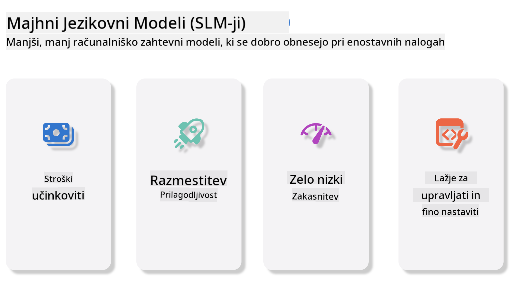
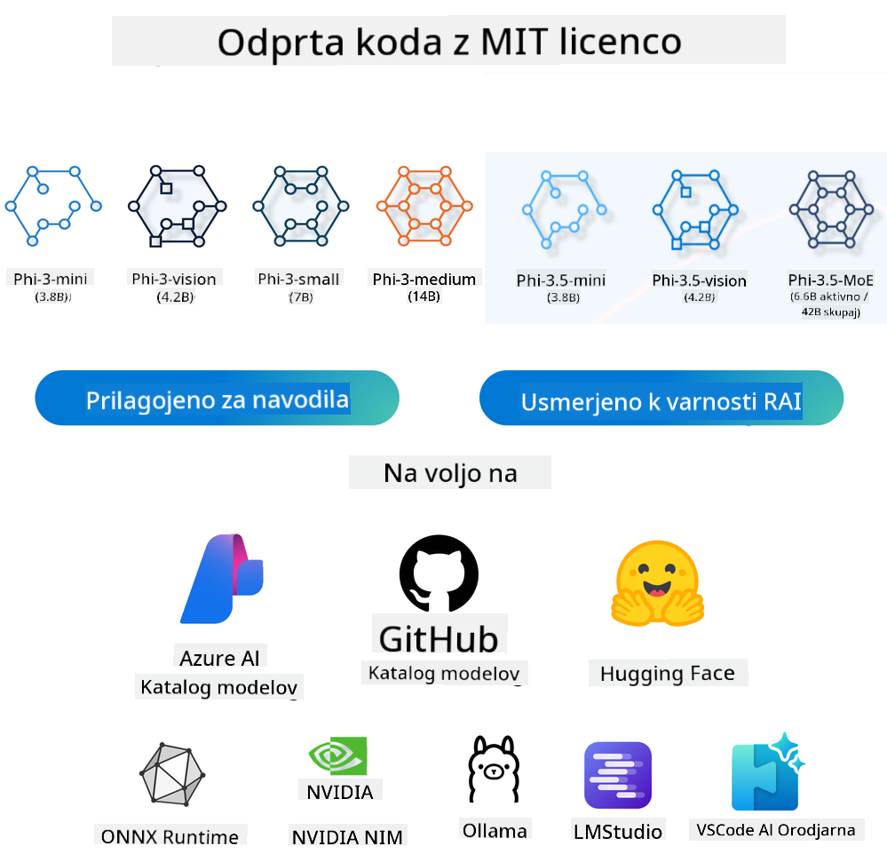
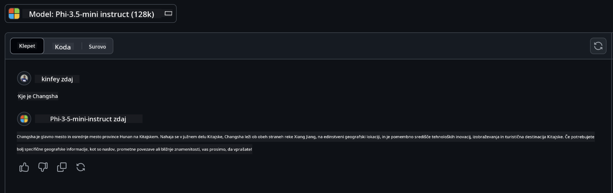

<!--
CO_OP_TRANSLATOR_METADATA:
{
  "original_hash": "124ad36cfe96f74038811b6e2bb93e9d",
  "translation_date": "2025-07-09T18:51:30+00:00",
  "source_file": "19-slm/README.md",
  "language_code": "sl"
}
-->
# Uvod v majhne jezikovne modele za generativno AI za začetnike  
Generativna AI je fascinantno področje umetne inteligence, ki se osredotoča na ustvarjanje sistemov, sposobnih generiranja nove vsebine. Ta vsebina lahko zajema besedilo, slike, glasbo in celo celotna virtualna okolja. Ena najbolj vznemirljivih uporab generativne AI je na področju jezikovnih modelov.

## Kaj so majhni jezikovni modeli?  

Majhni jezikovni model (SLM) predstavlja zmanjšano različico velikega jezikovnega modela (LLM), ki uporablja številne arhitekturne principe in tehnike LLM-jev, hkrati pa ima občutno manjšo računsko zahtevnost.

SLM-ji so podskupina jezikovnih modelov, zasnovanih za generiranje besedila, ki je podobno človeškemu. V nasprotju z večjimi modeli, kot je GPT-4, so SLM-ji bolj kompaktni in učinkoviti, zato so idealni za aplikacije, kjer so računski viri omejeni. Kljub manjšim dimenzijam lahko opravijo različne naloge. Običajno so SLM-ji ustvarjeni z zgoščevanjem ali destilacijo LLM-jev, pri čemer si prizadevajo ohraniti velik del funkcionalnosti in jezikovnih sposobnosti izvirnega modela. Ta zmanjšana velikost modela zmanjša kompleksnost, zaradi česar so SLM-ji učinkovitejši tako glede porabe pomnilnika kot računske moči. Kljub optimizacijam lahko SLM-ji opravijo širok spekter nalog obdelave naravnega jezika (NLP):

- Generiranje besedila: ustvarjanje koherentnih in kontekstualno ustreznih stavkov ali odstavkov.  
- Dokončanje besedila: napovedovanje in dopolnjevanje stavkov na podlagi danega izhodišča.  
- Prevajanje: pretvarjanje besedila iz enega jezika v drugega.  
- Povzemanje: strnitev dolgih besedil v krajše, lažje prebavljive povzetke.  

Čeprav z določenimi kompromisi v zmogljivosti ali globini razumevanja v primerjavi z večjimi modeli.

## Kako delujejo majhni jezikovni modeli?  
SLM-ji so usposobljeni na ogromnih količinah besedilnih podatkov. Med usposabljanjem se naučijo vzorcev in struktur jezika, kar jim omogoča generiranje besedila, ki je tako slovnično pravilno kot kontekstualno primerno. Proces usposabljanja vključuje:

- Zbiranje podatkov: pridobivanje velikih zbirk besedil iz različnih virov.  
- Predobdelava: čiščenje in organiziranje podatkov, da so primerni za usposabljanje.  
- Usposabljanje: uporaba algoritmov strojnega učenja za učenje razumevanja in generiranja besedila.  
- Dopolnjevanje: prilagajanje modela za izboljšanje zmogljivosti pri specifičnih nalogah.  

Razvoj SLM-jev je usklajen z naraščajočo potrebo po modelih, ki jih je mogoče uporabljati v okoljih z omejenimi viri, kot so mobilne naprave ali edge računalniške platforme, kjer so polni LLM-ji zaradi velikih zahtev po virih nepraktični. S poudarkom na učinkovitosti SLM-ji uravnotežijo zmogljivost in dostopnost, kar omogoča širšo uporabo na različnih področjih.



## Cilji učenja  

V tej lekciji želimo predstaviti znanje o SLM-jih in ga povezati z Microsoft Phi-3, da se naučimo različnih scenarijev v besedilni vsebini, vidu in MoE.

Ob koncu te lekcije bi morali znati odgovoriti na naslednja vprašanja:

- Kaj je SLM  
- Kakšna je razlika med SLM in LLM  
- Kaj je Microsoft Phi-3/3.5 družina  
- Kako izvajati inferenco z Microsoft Phi-3/3.5 družino  

Ste pripravljeni? Začnimo.

## Razlike med velikimi jezikovnimi modeli (LLM) in majhnimi jezikovnimi modeli (SLM)  

Tako LLM-ji kot SLM-ji temeljijo na osnovnih principih probabilističnega strojnega učenja, sledijo podobnim pristopom v arhitekturni zasnovi, metodah usposabljanja, procesih generiranja podatkov in tehnikah ocenjevanja modelov. Vendar pa jih loči več ključnih dejavnikov.

## Uporabe majhnih jezikovnih modelov  

SLM-ji imajo širok spekter uporab, med drugim:

- Chatboti: zagotavljanje podpore strankam in interakcija z uporabniki v pogovornem slogu.  
- Ustvarjanje vsebin: pomoč pisateljem pri generiranju idej ali celo osnutkov celotnih člankov.  
- Izobraževanje: pomoč študentom pri pisnih nalogah ali učenju novih jezikov.  
- Dostopnost: ustvarjanje orodij za osebe z invalidnostmi, kot so sistemi za pretvorbo besedila v govor.  

**Velikost**  

Glavna razlika med LLM in SLM je v obsegu modelov. LLM-ji, kot je ChatGPT (GPT-4), lahko vsebujejo ocenjenih 1,76 bilijona parametrov, medtem ko so odprtokodni SLM-ji, kot je Mistral 7B, zasnovani z bistveno manj parametri – približno 7 milijard. Ta razlika izhaja predvsem iz arhitekture modela in procesov usposabljanja. Na primer, ChatGPT uporablja mehanizem samopozornosti v okviru encoder-decoder, medtem ko Mistral 7B uporablja pozornost s pomičnim oknom, kar omogoča učinkovitejše usposabljanje v modelu, ki je samo decoder. Ta arhitekturna razlika močno vpliva na kompleksnost in zmogljivost modelov.

**Razumevanje**  

SLM-ji so običajno optimizirani za delovanje v specifičnih domenah, zaradi česar so zelo specializirani, a lahko omejeni v zmožnosti zagotavljanja širokega kontekstualnega razumevanja na različnih področjih. Nasprotno pa LLM-ji ciljajo na simulacijo človeške inteligence na bolj celoviti ravni. Usposobljeni na obsežnih in raznolikih podatkovnih zbirkah, so LLM-ji zasnovani za dobro delovanje v različnih domenah, kar jim omogoča večjo vsestranskost in prilagodljivost. Posledično so LLM-ji primernejši za širši nabor nalog, kot so obdelava naravnega jezika in programiranje.

**Računalniški viri**  

Usposabljanje in uvajanje LLM-jev sta procesa, ki zahtevata veliko virov, pogosto vključujeta obsežne računske infrastrukture, kot so veliki GPU grozdi. Na primer, usposabljanje modela, kot je ChatGPT, od začetka lahko zahteva tisoče GPU-jev skozi dolga obdobja. V nasprotju s tem so SLM-ji, zaradi manjšega števila parametrov, bolj dostopni glede računalniških virov. Modeli, kot je Mistral 7B, se lahko usposabljajo in izvajajo na lokalnih računalnikih z zmerno zmogljivimi GPU-ji, čeprav usposabljanje še vedno zahteva več ur na več GPU-jih.

**Pristranskost**  

Pristranskost je znan problem pri LLM-jih, predvsem zaradi narave podatkov za usposabljanje. Ti modeli pogosto temeljijo na surovih, javno dostopnih podatkih z interneta, ki lahko podzastopajo ali napačno predstavljajo določene skupine, vsebujejo napačne oznake ali odražajo jezikovne pristranskosti, ki izhajajo iz dialektov, geografskih razlik in slovničnih pravil. Poleg tega lahko kompleksnost arhitekture LLM-jev nehote poveča pristranskost, ki ostane neopažena brez skrbnega dopolnjevanja. Po drugi strani pa so SLM-ji, ki so usposobljeni na bolj omejenih, domeno-specifičnih zbirkah podatkov, manj dovzetni za takšne pristranskosti, čeprav niso popolnoma imuni nanje.

**Inferenca**  

Manjša velikost SLM-jev jim omogoča pomembno prednost pri hitrosti inferenc, saj lahko učinkovito generirajo izhode na lokalni strojni opremi brez potrebe po obsežnem vzporednem procesiranju. Nasprotno pa LLM-ji zaradi svoje velikosti in kompleksnosti pogosto zahtevajo obsežne vzporedne računske vire za doseganje sprejemljivih časov inferenc. Prisotnost več sočasnih uporabnikov dodatno upočasni odzivne čase LLM-jev, še posebej pri uvajanju v velikem obsegu.

Povzemimo, da čeprav imata LLM in SLM skupne temelje v strojni inteligenci, se bistveno razlikujeta po velikosti modela, zahtevah po virih, kontekstualnem razumevanju, dovzetnosti za pristranskost in hitrosti inferenc. Te razlike odražajo njuno primernost za različne primere uporabe, pri čemer so LLM-ji bolj vsestranski, a zahtevajo več virov, SLM-ji pa nudijo večjo učinkovitost v specifičnih domenah z manjšimi računalniškimi zahtevami.

***Opomba: V tem poglavju bomo SLM predstavili na primeru Microsoft Phi-3 / 3.5.***

## Predstavitev družine Phi-3 / Phi-3.5  

Družina Phi-3 / 3.5 je namenjena predvsem scenarijem uporabe na področju besedila, vida in agentov (MoE):

### Phi-3 / 3.5 Instruct  

Glavna uporaba je generiranje besedila, dokončanje pogovorov in izvleček informacij iz vsebin.

**Phi-3-mini**  

3,8-milijardni jezikovni model je na voljo na Microsoft Azure AI Studio, Hugging Face in Ollama. Phi-3 modeli bistveno presegajo jezikovne modele enake ali večje velikosti na ključnih merilih (glej spodnje številke meril, višje je bolje). Phi-3-mini presega modele, ki so dvakrat večji, medtem ko Phi-3-small in Phi-3-medium presegata večje modele, vključno z GPT-3.5.

**Phi-3-small & medium**  

S samo 7 milijardami parametrov Phi-3-small premaga GPT-3.5T na različnih jezikovnih, razumsko-logičnih, programerskih in matematičnih merilih.

Phi-3-medium s 14 milijardami parametrov nadaljuje ta trend in presega Gemini 1.0 Pro.

**Phi-3.5-mini**  

Lahko ga razumemo kot nadgradnjo Phi-3-mini. Čeprav število parametrov ostaja enako, izboljšuje podporo za več jezikov (podpira več kot 20 jezikov: arabščina, kitajščina, češčina, danščina, nizozemščina, angleščina, finščina, francoščina, nemščina, hebrejščina, madžarščina, italijanščina, japonščina, korejščina, norveščina, poljščina, portugalščina, ruščina, španščina, švedščina, tajščina, turščina, ukrajinščina) in dodaja močnejšo podporo za dolge kontekste.

Phi-3.5-mini s 3,8 milijardami parametrov presega jezikovne modele iste velikosti in je primerljiv z modeli, ki so dvakrat večji.

### Phi-3 / 3.5 Vision  

Instruct model Phi-3/3.5 lahko razumemo kot Phi-jevo sposobnost razumevanja, Vision pa je tisto, kar Phi-ju daje oči za razumevanje sveta.

**Phi-3-Vision**  

Phi-3-vision, s samo 4,2 milijardami parametrov, nadaljuje ta trend in presega večje modele, kot so Claude-3 Haiku in Gemini 1.0 Pro V, pri splošnih nalogah vizualnega razumevanja, OCR ter razumevanju tabel in diagramov.

**Phi-3.5-Vision**  

Phi-3.5-Vision je nadgradnja Phi-3-Vision, ki dodaja podporo za več slik. Lahko ga razumemo kot izboljšavo vida, saj ne vidi le slik, ampak tudi videoposnetke.

Phi-3.5-vision presega večje modele, kot so Claude-3.5 Sonnet in Gemini 1.5 Flash, pri OCR, razumevanju tabel in grafikonov ter je primerljiv pri splošnih nalogah vizualnega znanja. Podpira večslični vhod, torej omogoča sklepanje na podlagi več vhodnih slik.

### Phi-3.5-MoE  

***Mixture of Experts (MoE)*** omogoča, da so modeli predhodno usposobljeni z veliko manj računske moči, kar pomeni, da lahko z enakim proračunom za računske vire bistveno povečate velikost modela ali podatkovnega nabora. Posebej naj bi MoE model dosegel enako kakovost kot njegov gost model veliko hitreje med predhodnim usposabljanjem.

Phi-3.5-MoE sestavlja 16 modulov strokovnjakov po 3,8 milijarde parametrov. Phi-3.5-MoE z le 6,6 milijardami aktivnih parametrov dosega primerljivo raven razumevanja, jezikovnih sposobnosti in matematičnih veščin kot veliko večji modeli.

Model družine Phi-3/3.5 lahko uporabljamo glede na različne scenarije. V nasprotju z LLM lahko Phi-3/3.5-mini ali Phi-3/3.5-Vision namestimo tudi na edge naprave.

## Kako uporabljati modele družine Phi-3/3.5  

Želimo uporabiti Phi-3/3.5 v različnih scenarijih. V nadaljevanju bomo uporabili Phi-3/3.5 glede na različne primere.



### Razlike pri inferenci preko Cloud API  

**GitHub modeli**  

GitHub modeli so najhitrejša pot. Hitro lahko dostopate do modela Phi-3/3.5-Instruct preko GitHub modelov. V kombinaciji z Azure AI Inference SDK / OpenAI SDK lahko preko kode dostopate do API-ja in izvedete klice Phi-3/3.5-Instruct. Prav tako lahko preizkusite različne učinke preko Playground.

- Demo: primerjava učinkovitosti Phi-3-mini in Phi-3.5-mini v kitajskih scenarijih




**Azure AI Studio**  

Če želimo uporabljati modele za vid in MoE, lahko klice izvedemo preko Azure AI Studio. Če vas zanima, lahko preberete Phi-3 Cookbook, kjer je opisano, kako klicati Phi-3/3.5 Instruct, Vision in MoE preko Azure AI Studio [Kliknite na to povezavo](https://github.com/microsoft/Phi-3CookBook/blob/main/md/02.QuickStart/AzureAIStudio_QuickStart.md?WT.mc_id=academic-105485-koreyst)

**NVIDIA NIM**  

Poleg oblačnih rešitev Model Catalog, ki jih ponujata Azure in GitHub, lahko za izvedbo klicev uporabite tudi [NVIDIA NIM](https://developer.nvidia.com/nim?WT.mc_id=academic-105485-koreyst). Obiščete lahko NVIDIA NIM za izvedbo API klicev družine Phi-3/3.5. NVIDIA NIM (NVIDIA Inference Microservices) je niz pospešenih mikroservisov za inferenco, zasnovanih za učinkovito uvajanje AI modelov v različnih okoljih, vključno z oblaki, podatkovnimi centri in delovnimi postajami.

Nekatere ključne lastnosti NVIDIA NIM:

- **Enostavnost uvajanja:** NIM omogoča uvajanje AI modelov z eno samo ukazno vrstico, kar olajša integracijo v obstoječe delovne procese.  
- **Optimizirana zmogljivost:** Izrablja NVIDIA-jeve vnaprej optimizirane inferenčne pogone, kot sta TensorRT in TensorRT-LLM, za zagotavljanje nizke zakasnitve in visoke prepustnosti.  
- **Razširljivost:** NIM podpira samodejno skaliranje na Kubernetesu, kar omogoča učinkovito obvladovanje različnih obremenitev.
- **Varnost in nadzor:** Organizacije lahko ohranijo nadzor nad svojimi podatki in aplikacijami z gostovanjem NIM mikroservisov na lastni upravljani infrastrukturi.
- **Standardni API-ji:** NIM ponuja industrijske standardne API-je, kar olajša izdelavo in integracijo AI aplikacij, kot so chatbot-i, AI asistenti in še več.

NIM je del NVIDIA AI Enterprise, katerega cilj je poenostaviti uvajanje in operativno uporabo AI modelov ter zagotoviti njihovo učinkovito delovanje na NVIDIA GPU-jih.

- Demo: Uporaba Nividia NIM za klic Phi-3.5-Vision-API  [[Kliknite na ta povezavo](../../../19-slm/python/Phi-3-Vision-Nividia-NIM.ipynb)]


### Inferenca Phi-3/3.5 v lokalnem okolju
Inferenca v povezavi s Phi-3 ali katerim koli jezikovnim modelom, kot je GPT-3, pomeni proces generiranja odgovorov ali napovedi na podlagi prejete vhodne informacije. Ko Phi-3 podate poziv ali vprašanje, uporabi svoj usposobljeni nevronski model, da na podlagi vzorcev in povezav v podatkih, na katerih je bil treniran, sklepa najbolj verjeten in relevanten odgovor.

**Hugging Face Transformer**  
Hugging Face Transformers je zmogljiva knjižnica, namenjena obdelavi naravnega jezika (NLP) in drugim nalogam strojnega učenja. Tukaj je nekaj ključnih točk:

1. **Predtrenirani modeli:** Ponuja na tisoče predtreniranih modelov, ki jih lahko uporabite za različne naloge, kot so klasifikacija besedila, prepoznavanje imenovanih entitet, odgovarjanje na vprašanja, povzemanje, prevajanje in generiranje besedila.

2. **Medokvirna združljivost:** Knjižnica podpira več globokih učnih okvirov, vključno s PyTorch, TensorFlow in JAX. To omogoča treniranje modela v enem okviru in njegovo uporabo v drugem.

3. **Multimodalne zmogljivosti:** Poleg NLP podpira tudi naloge računalniškega vida (npr. klasifikacija slik, zaznavanje objektov) in obdelavo zvoka (npr. prepoznavanje govora, klasifikacija zvoka).

4. **Enostavnost uporabe:** Knjižnica ponuja API-je in orodja za enostavno prenašanje in prilagajanje modelov, kar jo naredi dostopno tako za začetnike kot strokovnjake.

5. **Skupnost in viri:** Hugging Face ima živahno skupnost ter obsežno dokumentacijo, vodiče in tutoriale, ki uporabnikom pomagajo začeti in kar najbolje izkoristiti knjižnico.  
[uradna dokumentacija](https://huggingface.co/docs/transformers/index?WT.mc_id=academic-105485-koreyst) ali njihov [GitHub repozitorij](https://github.com/huggingface/transformers?WT.mc_id=academic-105485-koreyst).

To je najpogosteje uporabljena metoda, vendar zahteva tudi pospeševanje z GPU. Scenariji, kot so Vision in MoE, namreč zahtevajo veliko izračunov, ki so na CPU-ju brez kvantizacije zelo omejeni.

- Demo: Uporaba Transformerja za klic Phi-3.5-Instuct [Kliknite na ta povezavo](../../../19-slm/python/phi35-instruct-demo.ipynb)

- Demo: Uporaba Transformerja za klic Phi-3.5-Vision [Kliknite na ta povezavo](../../../19-slm/python/phi35-vision-demo.ipynb)

- Demo: Uporaba Transformerja za klic Phi-3.5-MoE [Kliknite na ta povezavo](../../../19-slm/python/phi35_moe_demo.ipynb)

**Ollama**  
[Ollama](https://ollama.com/?WT.mc_id=academic-105485-koreyst) je platforma, zasnovana za lažje lokalno izvajanje velikih jezikovnih modelov (LLM) na vašem računalniku. Podpira različne modele, kot so Llama 3.1, Phi 3, Mistral in Gemma 2, med drugim. Platforma poenostavi postopek z združevanjem uteži modela, konfiguracije in podatkov v en paket, kar uporabnikom omogoča lažje prilagajanje in ustvarjanje lastnih modelov. Ollama je na voljo za macOS, Linux in Windows. Odlična je, če želite eksperimentirati z LLM-ji ali jih uvajati brez odvisnosti od oblačnih storitev. Ollama je najhitrejša pot, potrebujete le, da izvedete naslednji ukaz.

```bash

ollama run phi3.5

```


**ONNX Runtime za GenAI**

[ONNX Runtime](https://github.com/microsoft/onnxruntime-genai?WT.mc_id=academic-105485-koreyst) je večplatformski pospeševalnik za inferenco in treniranje strojnega učenja. ONNX Runtime za Generative AI (GENAI) je zmogljivo orodje, ki omogoča učinkovito izvajanje generativnih AI modelov na različnih platformah.

## Kaj je ONNX Runtime?  
ONNX Runtime je odprtokodni projekt, ki omogoča visoko zmogljivo inferenco modelov strojnega učenja. Podpira modele v formatu Open Neural Network Exchange (ONNX), ki je standard za predstavitev modelov strojnega učenja. ONNX Runtime inferenca omogoča hitrejšo uporabniško izkušnjo in nižje stroške, podpira modele iz globokih učnih okvirov, kot so PyTorch in TensorFlow/Keras, pa tudi klasične knjižnice strojnega učenja, kot so scikit-learn, LightGBM, XGBoost itd. ONNX Runtime je združljiv z različnimi strojno opremo, gonilniki in operacijskimi sistemi ter zagotavlja optimalno zmogljivost z uporabo strojnih pospeševalnikov, kjer je to mogoče, skupaj z optimizacijami in transformacijami grafov.

## Kaj je Generativna AI?  
Generativna AI se nanaša na AI sisteme, ki lahko ustvarjajo novo vsebino, kot so besedilo, slike ali glasba, na podlagi podatkov, na katerih so bili trenirani. Primeri so jezikovni modeli, kot je GPT-3, in modeli za generiranje slik, kot je Stable Diffusion. Knjižnica ONNX Runtime za GenAI zagotavlja generativni AI cikel za ONNX modele, vključno z inferenco z ONNX Runtime, obdelavo logitov, iskanjem in vzorčenjem ter upravljanjem KV predpomnilnika.

## ONNX Runtime za GENAI  
ONNX Runtime za GENAI razširja zmogljivosti ONNX Runtime za podporo generativnim AI modelom. Tukaj so nekatere ključne lastnosti:

- **Široka podpora platform:** Deluje na različnih platformah, vključno z Windows, Linux, macOS, Android in iOS.
- **Podpora modelom:** Podpira številne priljubljene generativne AI modele, kot so LLaMA, GPT-Neo, BLOOM in drugi.
- **Optimizacija zmogljivosti:** Vključuje optimizacije za različne strojne pospeševalnike, kot so NVIDIA GPU-ji, AMD GPU-ji in drugi.
- **Enostavnost uporabe:** Ponuja API-je za enostavno integracijo v aplikacije, kar omogoča generiranje besedila, slik in druge vsebine z minimalno kodo.
- Uporabniki lahko kličejo visoko raven metodo generate(), ali pa izvajajo posamezne iteracije modela v zanki, generirajoč en token naenkrat in po želji posodabljajo parametre generiranja znotraj zanke.
- ONNX Runtime podpira tudi greedy/beam iskanje in TopP, TopK vzorčenje za generiranje zaporedij tokenov ter vgrajeno obdelavo logitov, kot so kazni za ponavljanje. Prav tako lahko enostavno dodate lastno ocenjevanje.

## Začetek  
Za začetek z ONNX Runtime za GENAI sledite tem korakom:

### Namestite ONNX Runtime:  
```Python
pip install onnxruntime
```  
### Namestite razširitve za Generative AI:  
```Python
pip install onnxruntime-genai
```

### Zaženite model: Tukaj je preprost primer v Pythonu:  
```Python
import onnxruntime_genai as og

model = og.Model('path_to_your_model.onnx')

tokenizer = og.Tokenizer(model)

input_text = "Hello, how are you?"

input_tokens = tokenizer.encode(input_text)

output_tokens = model.generate(input_tokens)

output_text = tokenizer.decode(output_tokens)

print(output_text) 
```  
### Demo: Uporaba ONNX Runtime GenAI za klic Phi-3.5-Vision

```python

import onnxruntime_genai as og

model_path = './Your Phi-3.5-vision-instruct ONNX Path'

img_path = './Your Image Path'

model = og.Model(model_path)

processor = model.create_multimodal_processor()

tokenizer_stream = processor.create_stream()

text = "Your Prompt"

prompt = "<|user|>\n"

prompt += "<|image_1|>\n"

prompt += f"{text}<|end|>\n"

prompt += "<|assistant|>\n"

image = og.Images.open(img_path)

inputs = processor(prompt, images=image)

params = og.GeneratorParams(model)

params.set_inputs(inputs)

params.set_search_options(max_length=3072)

generator = og.Generator(model, params)

while not generator.is_done():

    generator.compute_logits()
    
    generator.generate_next_token()

    new_token = generator.get_next_tokens()[0]
    
    code += tokenizer_stream.decode(new_token)
    
    print(tokenizer_stream.decode(new_token), end='', flush=True)

```


**Drugo**

Poleg referenčnih metod ONNX Runtime in Ollama lahko dopolnimo tudi referenco kvantitativnih modelov na podlagi referenčnih metod modelov, ki jih ponujajo različni proizvajalci. Na primer Apple MLX okvir z Apple Metal, Qualcomm QNN z NPU, Intel OpenVINO s CPU/GPU itd. Več vsebin lahko najdete tudi v [Phi-3 Cookbook](https://github.com/microsoft/phi-3cookbook?WT.mc_id=academic-105485-koreyst).


## Več

Naučili smo se osnov družine Phi-3/3.5, vendar za poglobljeno razumevanje SLM potrebujemo več znanja. Odgovore lahko najdete v Phi-3 Cookbook. Če želite izvedeti več, obiščite [Phi-3 Cookbook](https://github.com/microsoft/phi-3cookbook?WT.mc_id=academic-105485-koreyst).

**Omejitev odgovornosti**:  
Ta dokument je bil preveden z uporabo storitve za avtomatski prevod AI [Co-op Translator](https://github.com/Azure/co-op-translator). Čeprav si prizadevamo za natančnost, vas opozarjamo, da lahko avtomatizirani prevodi vsebujejo napake ali netočnosti. Izvirni dokument v njegovem izvirnem jeziku velja za avtoritativni vir. Za pomembne informacije priporočamo strokovni človeški prevod. Za morebitna nesporazume ali napačne interpretacije, ki izhajajo iz uporabe tega prevoda, ne odgovarjamo.