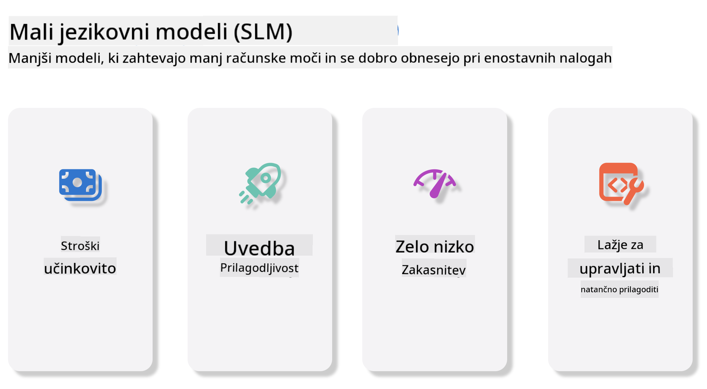
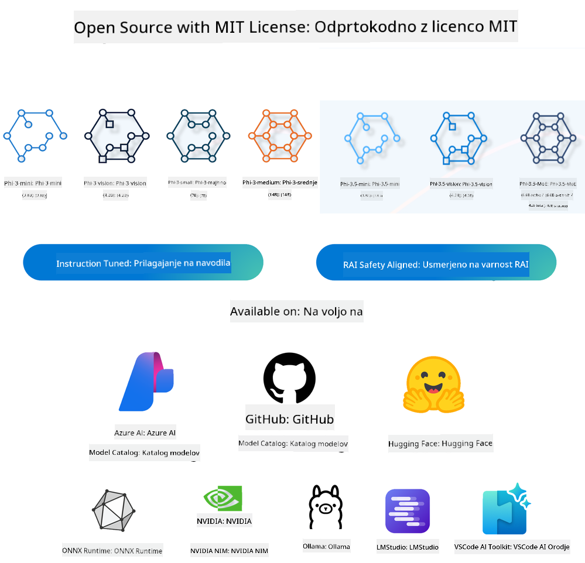
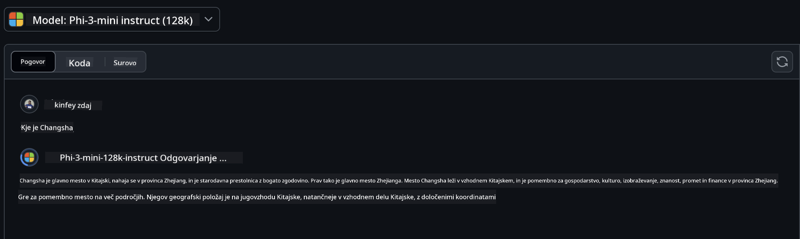
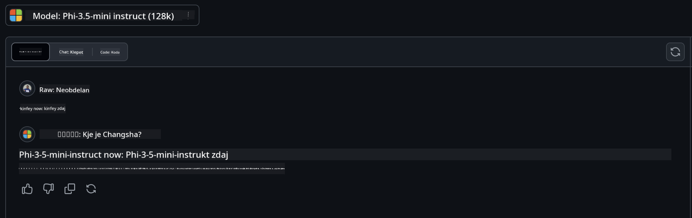

<!--
CO_OP_TRANSLATOR_METADATA:
{
  "original_hash": "124ad36cfe96f74038811b6e2bb93e9d",
  "translation_date": "2025-05-20T10:43:21+00:00",
  "source_file": "19-slm/README.md",
  "language_code": "sl"
}
-->
# Uvod v majhne jezikovne modele za generativno umetno inteligenco za začetnike

Generativna umetna inteligenca je fascinantno področje umetne inteligence, ki se osredotoča na ustvarjanje sistemov, sposobnih generiranja nove vsebine. Ta vsebina lahko sega od besedila in slik do glasbe in celo celotnih virtualnih okolij. Ena najbolj vznemirljivih aplikacij generativne umetne inteligence je na področju jezikovnih modelov.

## Kaj so majhni jezikovni modeli?

Majhen jezikovni model (SLM) predstavlja zmanjšano različico velikega jezikovnega modela (LLM), ki izkorišča številna arhitekturna načela in tehnike LLM-jev, medtem ko kaže znatno zmanjšano računalniško obremenitev. SLM-ji so podskupina jezikovnih modelov, zasnovanih za generiranje besedila, ki je podobno človeškemu. Za razliko od svojih večjih kolegov, kot je GPT-4, so SLM-ji bolj kompaktni in učinkoviti, kar jih naredi idealne za aplikacije, kjer so računalniški viri omejeni. Kljub svoji manjši velikosti lahko še vedno opravljajo vrsto nalog. Običajno so SLM-ji konstruirani z stiskanjem ali destilacijo LLM-jev, z namenom ohraniti znaten del funkcionalnosti in jezikovnih sposobnosti izvirnega modela. Ta zmanjšanje velikosti modela zmanjšuje celotno kompleksnost, kar naredi SLM-je bolj učinkovite v smislu porabe pomnilnika in računalniških zahtev. Kljub tem optimizacijam lahko SLM-ji še vedno opravljajo širok spekter nalog obdelave naravnega jezika (NLP):

- Generiranje besedila: Ustvarjanje koherentnih in kontekstualno relevantnih stavkov ali odstavkov.
- Dopolnjevanje besedila: Napovedovanje in dopolnjevanje stavkov na podlagi danega poziva.
- Prevajanje: Pretvorba besedila iz enega jezika v drugega.
- Povzemanje: Strnjevanje dolgih delov besedila v krajše, bolj prebavljive povzetke.

Čeprav z nekaterimi kompromisi pri zmogljivosti ali globini razumevanja v primerjavi z njihovimi večjimi kolegi.

## Kako delujejo majhni jezikovni modeli?

SLM-ji so usposobljeni na ogromnih količinah podatkov besedila. Med usposabljanjem se naučijo vzorcev in struktur jezika, kar jim omogoča generiranje besedila, ki je tako slovnično pravilno kot kontekstualno primerno. Proces usposabljanja vključuje:

- Zbiranje podatkov: Zbiranje velikih naborov podatkov besedila iz različnih virov.
- Predprocesiranje: Čiščenje in organiziranje podatkov, da postanejo primerni za usposabljanje.
- Usposabljanje: Uporaba algoritmov strojnega učenja za poučevanje modela, kako razumeti in generirati besedilo.
- Fino uglaševanje: Prilagajanje modela za izboljšanje njegove zmogljivosti pri določenih nalogah.

Razvoj SLM-jev se ujema z naraščajočo potrebo po modelih, ki jih je mogoče namestiti v okolja z omejenimi viri, kot so mobilne naprave ali platforme za računalništvo na robu, kjer so polni LLM-ji morda nepraktični zaradi njihovih velikih zahtev po virih. Z osredotočanjem na učinkovitost SLM-ji uravnotežijo zmogljivost z dostopnostjo, kar omogoča širšo uporabo v različnih domenah.



## Cilji učenja

V tej lekciji upamo, da bomo predstavili znanje o SLM-jih in ga kombinirali z Microsoft Phi-3 za učenje različnih scenarijev v besedilni vsebini, viziji in MoE. Do konca te lekcije bi morali biti sposobni odgovoriti na naslednja vprašanja:

- Kaj je SLM
- Kakšna je razlika med SLM in LLM
- Kaj je Microsoft Phi-3/3.5 družina
- Kako sklepati Microsoft Phi-3/3.5 družino

Pripravljeni? Začnimo.

## Razlike med velikimi jezikovnimi modeli (LLM) in majhnimi jezikovnimi modeli (SLM)

Tako LLM-ji kot SLM-ji so zgrajeni na temeljnih načelih verjetnostnega strojnega učenja, sledijo podobnim pristopom v svoji arhitekturni zasnovi, metodologijah usposabljanja, procesih generiranja podatkov in tehnikah ocenjevanja modelov. Vendar pa več ključnih dejavnikov ločuje ti dve vrsti modelov.

## Aplikacije majhnih jezikovnih modelov

SLM-ji imajo širok spekter aplikacij, vključno z:

- Klepetalni roboti: Pomoč strankam in interakcija z uporabniki na pogovoren način.
- Ustvarjanje vsebine: Pomoč pisateljem pri generiranju idej ali celo pisanju celotnih člankov.
- Izobraževanje: Pomoč študentom pri pisanju nalog ali učenju novih jezikov.
- Dostopnost: Ustvarjanje orodij za posameznike z invalidnostmi, kot so sistemi za pretvorbo besedila v govor.

**Velikost**

Primarna razlika med LLM-ji in SLM-ji je v obsegu modelov. LLM-ji, kot je ChatGPT (GPT-4), lahko obsegajo približno 1,76 trilijona parametrov, medtem ko so odprtokodni SLM-ji, kot je Mistral 7B, zasnovani z bistveno manj parametri—približno 7 milijard. Ta razlika je predvsem posledica razlik v arhitekturi modela in procesih usposabljanja. Na primer, ChatGPT uporablja mehanizem samopozornosti znotraj okvira kodirnik-dekodirnik, medtem ko Mistral 7B uporablja drsno okno pozornosti, kar omogoča bolj učinkovito usposabljanje znotraj modela samo-dekodirnik. Ta arhitekturna razlika ima globoke posledice za kompleksnost in zmogljivost teh modelov.

**Razumevanje**

SLM-ji so običajno optimizirani za zmogljivost znotraj določenih domen, kar jih naredi zelo specializirane, vendar potencialno omejene v njihovi sposobnosti zagotavljanja širokega kontekstualnega razumevanja v več poljih znanja. Nasprotno, LLM-ji si prizadevajo simulirati človeško inteligenco na bolj celoviti ravni. Usposobljeni na obsežnih, raznolikih naborih podatkov so LLM-ji zasnovani za dobro delovanje v različnih domenah, kar ponuja večjo vsestranskost in prilagodljivost. Posledično so LLM-ji bolj primerni za širši spekter nalog, kot so obdelava naravnega jezika in programiranje.

**Računalništvo**

Usposabljanje in namestitev LLM-jev sta procesi, ki zahtevata veliko virov, pogosto potrebujejo pomembno računalniško infrastrukturo, vključno z velikimi grozdi GPU-jev. Na primer, usposabljanje modela, kot je ChatGPT, od začetka lahko zahteva tisoče GPU-jev v daljših časovnih obdobjih. Nasprotno, SLM-ji, s svojimi manjšimi številom parametrov, so bolj dostopni v smislu računalniških virov. Modeli, kot je Mistral 7B, se lahko usposabljajo in izvajajo na lokalnih napravah, opremljenih z zmernimi zmogljivostmi GPU-jev, čeprav usposabljanje še vedno zahteva več ur na več GPU-jih.

**Pristranskost**

Pristranskost je znana težava v LLM-jih, predvsem zaradi narave podatkov za usposabljanje. Ti modeli se pogosto zanašajo na surove, odprto dostopne podatke z interneta, ki lahko premalo zastopajo ali napačno zastopajo določene skupine, uvedejo napačno označevanje ali odražajo jezikovne pristranskosti, ki jih vplivajo dialekt, geografske variacije in slovnična pravila. Poleg tega lahko kompleksnost arhitektur LLM-jev nehote poslabša pristranskost, ki lahko ostane neopažena brez skrbnega finega uglaševanja. Po drugi strani pa so SLM-ji, ker so usposobljeni na bolj omejenih, domeno specifičnih naborih podatkov, inherentno manj dovzetni za takšne pristranskosti, čeprav niso imuni nanje.

**Sklepanje**

Zmanjšana velikost SLM-jev jim daje znatno prednost v smislu hitrosti sklepanja, kar jim omogoča, da učinkovito generirajo izhode na lokalni strojni opremi brez potrebe po obsežnem vzporednem procesiranju. Nasprotno, LLM-ji, zaradi svoje velikosti in kompleksnosti, pogosto zahtevajo znatne vzporedne računalniške vire za doseganje sprejemljivih časov sklepanja. Prisotnost več hkratnih uporabnikov dodatno upočasni čas odziva LLM-jev, zlasti ko so nameščeni v velikem obsegu.

Na kratko, čeprav oba LLM-ja in SLM-ja delita temeljno osnovo v strojnem učenju, se znatno razlikujeta v smislu velikosti modela, zahtev po virih, kontekstualnega razumevanja, dovzetnosti za pristranskost in hitrosti sklepanja. Te razlike odražajo njihovo ustrezno primernost za različne primere uporabe, pri čemer so LLM-ji bolj vsestranski, a zahtevni za vire, medtem ko SLM-ji ponujajo bolj domeno specifično učinkovitost z zmanjšanimi računalniškimi zahtevami.

***Opomba: V tem poglavju bomo predstavili SLM z uporabo Microsoft Phi-3 / 3.5 kot primer.***

## Predstavitev Phi-3 / Phi-3.5 družine

Phi-3 / 3.5 družina se predvsem osredotoča na besedilo, vizijo in aplikacijske scenarije Agent (MoE):

### Phi-3 / 3.5 Instruct

Predvsem za generiranje besedila, dokončanje klepeta in ekstrakcijo informacij o vsebini itd.

**Phi-3-mini**

3.8B jezikovni model je na voljo na Microsoft Azure AI Studio, Hugging Face in Ollama. Phi-3 modeli bistveno presegajo jezikovne modele enake in večje velikosti na ključnih merilih (glej spodnje številke meril, višje številke so boljše). Phi-3-mini presega modele dvakratne velikosti, medtem ko Phi-3-small in Phi-3-medium presegata večje modele, vključno z GPT-3.5.

**Phi-3-small & medium**

Samo s 7B parametri Phi-3-small premaga GPT-3.5T na različnih jezikovnih, logičnih, kodirnih in matematičnih merilih. Phi-3-medium s 14B parametri nadaljuje ta trend in presega Gemini 1.0 Pro.

**Phi-3.5-mini**

Lahko ga obravnavamo kot nadgradnjo Phi-3-mini. Medtem ko parametri ostajajo nespremenjeni, izboljšuje sposobnost podpore več jezikov (podpora 20+ jezikov: arabščina, kitajščina, češčina, danščina, nizozemščina, angleščina, finščina, francoščina, nemščina, hebrejščina, madžarščina, italijanščina, japonščina, korejščina, norveščina, poljščina, portugalščina, ruščina, španščina, švedščina, tajščina, turščina, ukrajinščina) in dodaja močnejšo podporo za dolg kontekst. Phi-3.5-mini s 3.8B parametri presega jezikovne modele enake velikosti in je na ravni modelov dvakratne velikosti.

### Phi-3 / 3.5 Vision

Lahko obravnavamo Instruct model Phi-3/3.5 kot sposobnost Phi za razumevanje, in Vision je tisto, kar daje Phi očem za razumevanje sveta.

**Phi-3-Vision**

Phi-3-vision, s samo 4.2B parametri, nadaljuje ta trend in presega večje modele, kot sta Claude-3 Haiku in Gemini 1.0 Pro V na splošnih nalogah vizualnega razumevanja, OCR in nalogah razumevanja tabel in diagramov.

**Phi-3.5-Vision**

Phi-3.5-Vision je tudi nadgradnja Phi-3-Vision, ki dodaja podporo za več slik. Lahko ga obravnavamo kot izboljšanje vizije, ne samo da lahko vidite slike, ampak tudi videe. Phi-3.5-vision presega večje modele, kot sta Claude-3.5 Sonnet in Gemini 1.5 Flash na nalogah OCR, razumevanja tabel in grafikonov ter na ravni na splošnih nalogah razumevanja vizualnega znanja. Podpora za večokvirni vnos, tj. izvajanje sklepanja na več vhodnih slikah.

### Phi-3.5-MoE

***Mešanica strokovnjakov (MoE)*** omogoča modelom, da se predhodno usposobijo z veliko manj računalniške moči, kar pomeni, da lahko dramatično povečate velikost modela ali nabora podatkov z istim proračunom za računalniško moč kot gost model. Zlasti naj bi MoE model dosegel isto kakovost kot njegov gosti nasprotnik veliko hitreje med predhodnim usposabljanjem. Phi-3.5-MoE obsega 16x3.8B modulov strokovnjakov. Phi-3.5-MoE s samo 6.6B aktivnimi parametri dosega podobno raven sklepanja, razumevanja jezika in matematike kot veliko večji modeli.

Phi-3/3.5 družinski model lahko uporabimo glede na različne scenarije. Za razliko od LLM-ja lahko Phi-3/3.5-mini ali Phi-3/3.5-Vision namestite na naprave na robu.

## Kako uporabljati modele Phi-3/3.5 družine

Upamo, da bomo uporabili Phi-3/3.5 v različnih scenarijih. Nato bomo uporabili Phi-3/3.5 glede na različne scenarije.



### Razlika v sklepanju

API v oblaku **GitHub modeli** GitHub
Modeli so najbolj neposreden način. Do modela Phi-3/3.5-Instruct lahko hitro dostopate prek GitHub Models. V kombinaciji z Azure AI Inference SDK / OpenAI SDK lahko dostopate do API-ja prek kode, da dokončate klic Phi-3/3.5-Instruct. Različne učinke lahko preizkusite tudi prek Playground. - Demo: Primerjava učinkov Phi-3-mini in Phi-3.5-mini v kitajskih scenarijih   **Azure AI Studio** Ali če želimo uporabiti modele vizije in MoE, lahko uporabite Azure AI Studio za dokončanje klica. Če vas zanima, lahko preberete Phi-3 Cookbook, da se naučite, kako poklicati Phi-3/3.5 Instruct, Vision, MoE prek Azure AI Studio [Kliknite to povezavo](https://github.com/microsoft/Phi-3CookBook/blob/main/md/02.QuickStart/AzureAIStudio_QuickStart.md?WT.mc_id=academic-105485-koreyst) **NVIDIA NIM** Poleg rešitev Model Catalog, ki temeljijo na oblaku, ki jih ponujata Azure in GitHub, lahko uporabite tudi [Nivida NIM](https://developer.nvidia.com/nim?WT.mc_id=academic-105485-koreyst) za dokončanje povezanih klicev. Lahko obiščete NIVIDA NIM, da dokončate API klice Phi-3/3.5 Family. NVIDIA NIM (NVIDIA Inference Microservices) je niz pospešenih inferenčnih mikrostoritev, zasnovanih za pomoč razvijalcem pri učinkovitem uvajanju AI modelov v različnih okoljih, vključno z oblaki, podatkovnimi centri in delovnimi postajami. Tukaj so nekatere ključne značilnosti NVIDIA NIM: - **Enostavnost uvajanja:** NIM omogoča uvajanje AI modelov z enim samim ukazom, kar olajša integracijo v obstoječe delovne tokove. - **Optimizirana zmogljivost:** Izkoristi NVIDIA-jeve vnaprej optimizirane inferenčne motorje, kot sta TensorRT in TensorRT-LLM, da zagotovi nizko zakasnitev in visoko prepustnost. - **Razširljivost:** NIM podpira samodejno skaliranje na Kubernetes, kar omogoča učinkovito obvladovanje različnih delovnih obremenitev. - **Varnost in nadzor:** Organizacije lahko ohranijo nadzor nad svojimi podatki in aplikacijami z gostovanjem NIM mikrostoritev na svoji lastni upravljani infrastrukturi. - **Standardni API-ji:** NIM zagotavlja industrijske standardne API-je, kar olajša gradnjo in integracijo AI aplikacij, kot so klepetalni roboti, AI asistenti in več. NIM je del NVIDIA AI Enterprise, ki si prizadeva poenostaviti uvajanje in operacionalizacijo AI modelov ter zagotavljati, da delujejo učinkovito na NVIDIA GPU-jih. - Demo: Uporaba Nividia NIM za klic Phi-3.5-Vision-API [[Kliknite to povezavo](../../../19-slm/python/Phi-3-Vision-Nividia-NIM.ipynb)] ### Inferenca Phi-3/3.5 v lokalnem okolju Inferenca v povezavi s Phi-3, ali katerim koli jezikovnim modelom, kot je GPT-3, se nanaša na proces generiranja odgovorov ali napovedi glede na prejete vhodne podatke. Ko Phi-3 posredujete poziv ali vprašanje, uporabi svojo usposobljeno nevronsko mrežo za sklepanje o najbolj verjetnem in ustreznem odgovoru z analizo vzorcev in odnosov v podatkih, na katerih je bil usposobljen. **Hugging Face Transformer** Hugging Face Transformers je zmogljiva knjižnica, zasnovana za obdelavo naravnega jezika (NLP) in druge naloge strojnega učenja. Tukaj je nekaj ključnih točk o njej: 1. **Vnaprej usposobljeni modeli**: Ponuja tisoče vnaprej usposobljenih modelov, ki jih je mogoče uporabiti za različne naloge, kot so klasifikacija besedila, prepoznavanje poimenovanih entitet, odgovarjanje na vprašanja, povzemanje, prevajanje in generiranje besedila. 2. **Interoperabilnost okvirjev**: Knjižnica podpira več globokih učnih okvirov, vključno s PyTorch, TensorFlow in JAX. To omogoča usposabljanje modela v enem okviru in njegovo uporabo v drugem. 3. **Multimodalne zmožnosti**: Poleg NLP Hugging Face Transformers podpira tudi naloge na področju računalniškega vida (npr. klasifikacija slik, zaznavanje objektov) in obdelave zvoka (npr. prepoznavanje govora, klasifikacija zvoka). 4. **Enostavnost uporabe**: Knjižnica ponuja API-je in orodja za enostavno prenašanje in fino nastavitev modelov, kar jo naredi dostopno tako začetnikom kot strokovnjakom. 5. **Skupnost in viri**: Hugging Face ima živahno skupnost in obsežno dokumentacijo, vadnice ter vodnike, ki pomagajo uporabnikom začeti in kar najbolje izkoristiti knjižnico. [uradna dokumentacija](https://huggingface.co/docs/transformers/index?WT.mc_id=academic-105485-koreyst) ali njihov [GitHub repozitorij](https://github.com/huggingface/transformers?WT.mc_id=academic-105485-koreyst). To je najbolj pogosto uporabljena metoda, vendar zahteva tudi pospeševanje z GPU-jem. Navsezadnje prizori, kot sta Vision in MoE, zahtevajo veliko izračunov, kar bo zelo omejeno na CPU-ju, če niso kvantizirani. - Demo: Uporaba Transformerja za klic Phi-3.5-Instruct [Kliknite to povezavo](../../../19-slm/python/phi35-instruct-demo.ipynb) - Demo: Uporaba Transformerja za klic Phi-3.5-Vision[Kliknite to povezavo](../../../19-slm/python/phi35-vision-demo.ipynb) - Demo: Uporaba Transformerja za klic Phi-3.5-MoE[Kliknite to povezavo](../../../19-slm/python/phi35_moe_demo.ipynb) **Ollama** [Ollama](https://ollama.com/?WT.mc_id=academic-105485-koreyst) je platforma, zasnovana za lažje izvajanje velikih jezikovnih modelov (LLM) lokalno na vašem računalniku. Podpira različne modele, kot so Llama 3.1, Phi 3, Mistral in Gemma 2, med drugim. Platforma poenostavi proces z združevanjem uteži modela, konfiguracije in podatkov v en paket, kar omogoča uporabnikom lažjo prilagoditev in ustvarjanje lastnih modelov. Ollama je na voljo za macOS, Linux in Windows. Je odlično orodje, če želite eksperimentirati ali uvajati LLM-je brez zanašanja na storitve v oblaku. Ollama je najbolj neposreden način, samo izvesti morate naslednjo izjavo. ```bash

ollama run phi3.5

``` **ONNX Runtime za GenAI** [ONNX Runtime](https://github.com/microsoft/onnxruntime-genai?WT.mc_id=academic-105485-koreyst) je pospeševalnik strojnega učenja za inferenco in usposabljanje, ki deluje na več platformah. ONNX Runtime za Generative AI (GENAI) je zmogljivo orodje, ki vam pomaga učinkovito izvajati generativne AI modele na različnih platformah. ## Kaj je ONNX Runtime? ONNX Runtime je odprtokodni projekt, ki omogoča visoko zmogljivo inferenco modelov strojnega učenja. Podpira modele v formatu Open Neural Network Exchange (ONNX), ki je standard za reprezentacijo modelov strojnega učenja.ONNX Runtime inferenca lahko omogoči hitrejše uporabniške izkušnje in nižje stroške, podpira modele iz globokih učnih okvirov, kot sta PyTorch in TensorFlow/Keras, ter klasične knjižnice strojnega učenja, kot so scikit-learn, LightGBM, XGBoost itd. ONNX Runtime je združljiv z različnimi strojno opremo, gonilniki in operacijskimi sistemi ter zagotavlja optimalno zmogljivost z izkoriščanjem pospeševalnikov strojne opreme, kjer je to primerno, poleg optimizacij grafov in transformacij ## Kaj je Generativni AI? Generativni AI se nanaša na AI sisteme, ki lahko generirajo novo vsebino, kot so besedilo, slike ali glasba, glede na podatke, na katerih so bili usposobljeni. Primeri vključujejo jezikovne modele, kot je GPT-3, in modele generiranja slik, kot je Stable Diffusion. ONNX Runtime za GenAI knjižnica zagotavlja generativno AI zanko za ONNX modele, vključno z inferenco z ONNX Runtime, obdelavo logitov, iskanjem in vzorčenjem ter upravljanjem predpomnilnika KV. ## ONNX Runtime za GENAI ONNX Runtime za GENAI razširja zmogljivosti ONNX Runtime za podporo generativnim AI modelom. Tukaj so nekatere ključne značilnosti: - **Široka podpora platformam:** Deluje na različnih platformah, vključno z Windows, Linux, macOS, Android in iOS. - **Podpora modelom:** Podpira številne priljubljene generativne AI modele, kot so LLaMA, GPT-Neo, BLOOM in več. - **Optimizacija zmogljivosti:** Vključuje optimizacije za različne pospeševalnike strojne opreme, kot so NVIDIA GPU-ji, AMD GPU-ji in več2. - **Enostavnost uporabe:** Ponuja API-je za enostavno integracijo v aplikacije, kar omogoča generiranje besedila, slik in druge vsebine z minimalno kodo - Uporabniki lahko pokličejo visok nivo generate() metodo ali izvedejo vsako iteracijo modela v zanki, generirajo en token naenkrat in po potrebi posodobijo parametre generiranja znotraj zanke. - ONNX runtime ima tudi podporo za pohlepno/beam iskanje in TopP, TopK vzorčenje za generiranje sekvenc tokenov ter vgrajeno obdelavo logitov, kot so kazni za ponavljanje. Lahko tudi enostavno dodate lastno ocenjevanje. ## Začetek Da začnete z ONNX Runtime za GENAI, lahko sledite tem korakom: ### Namestite ONNX Runtime: ```Python
pip install onnxruntime
``` ### Namestite razširitve za Generativni AI: ```Python
pip install onnxruntime-genai
``` ### Zaženite model: Tukaj je preprost primer v Pythonu: ```Python
import onnxruntime_genai as og

model = og.Model('path_to_your_model.onnx')

tokenizer = og.Tokenizer(model)

input_text = "Hello, how are you?"

input_tokens = tokenizer.encode(input_text)

output_tokens = model.generate(input_tokens)

output_text = tokenizer.decode(output_tokens)

print(output_text) 
``` ### Demo: Uporaba ONNX Runtime GenAI za klic Phi-3.5-Vision ```python

import onnxruntime_genai as og

model_path = './Your Phi-3.5-vision-instruct ONNX Path'

img_path = './Your Image Path'

model = og.Model(model_path)

processor = model.create_multimodal_processor()

tokenizer_stream = processor.create_stream()

text = "Your Prompt"

prompt = "<|user|>\n"

prompt += "<|image_1|>\n"

prompt += f"{text}<|end|>\n"

prompt += "<|assistant|>\n"

image = og.Images.open(img_path)

inputs = processor(prompt, images=image)

params = og.GeneratorParams(model)

params.set_inputs(inputs)

params.set_search_options(max_length=3072)

generator = og.Generator(model, params)

while not generator.is_done():

    generator.compute_logits()
    
    generator.generate_next_token()

    new_token = generator.get_next_tokens()[0]
    
    code += tokenizer_stream.decode(new_token)
    
    print(tokenizer_stream.decode(new_token), end='', flush=True)

``` **Drugi** Poleg referenčnih metod ONNX Runtime in Ollama, lahko dokončamo referenco kvantitativnih modelov na podlagi referenčnih metod modelov, ki jih zagotavljajo različni proizvajalci. Na primer, Apple MLX okvir z Apple Metal, Qualcomm QNN z NPU, Intel OpenVINO z CPU/GPU itd. Več vsebine lahko dobite tudi iz [Phi-3 Cookbook](https://github.com/microsoft/phi-3cookbook?WT.mc_id=academic-105485-koreyst) ## Več Naučili smo se osnov Phi-3/3.5 Family, vendar za več znanja o SLM potrebujemo več znanja. Odgovore lahko najdete v Phi-3 Cookbook. Če želite izvedeti več, obiščite [Phi-3 Cookbook](https://github.com/microsoft/phi-3cookbook?WT.mc_id=academic-105485-koreyst).

**Omejitev odgovornosti**: 
Ta dokument je bil preveden z uporabo AI prevajalske storitve [Co-op Translator](https://github.com/Azure/co-op-translator). Čeprav si prizadevamo za natančnost, vas prosimo, da upoštevate, da avtomatski prevodi lahko vsebujejo napake ali netočnosti. Izvirni dokument v njegovem maternem jeziku bi moral biti obravnavan kot avtoritativni vir. Za kritične informacije se priporoča profesionalni človeški prevod. Ne odgovarjamo za kakršne koli nesporazume ali napačne razlage, ki izhajajo iz uporabe tega prevoda.