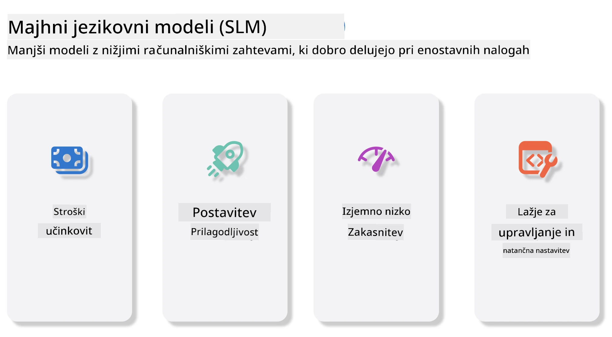
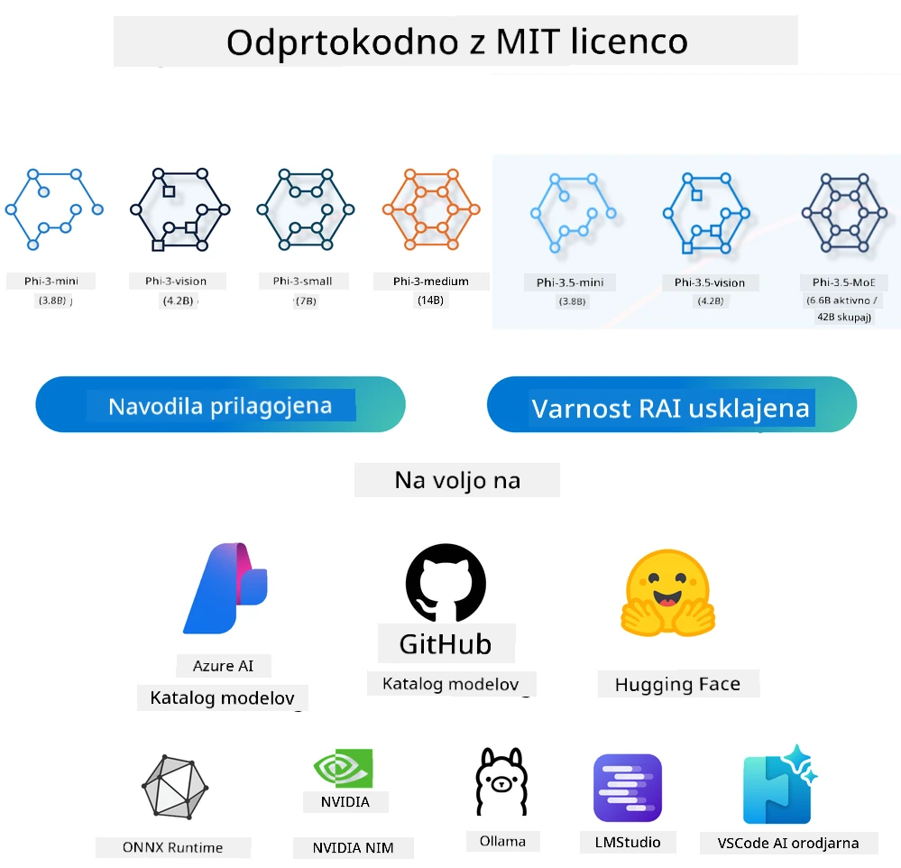
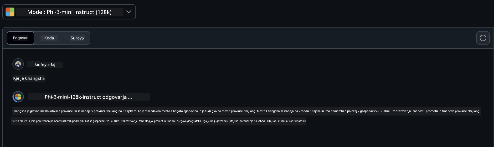
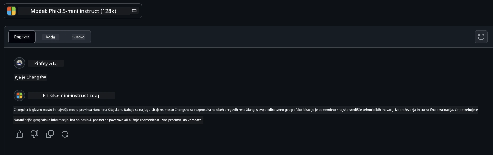

# Uvod v majhne jezikovne modele za generativno umetno inteligenco za začetnike
Generativna umetna inteligenca je fascinantno področje umetne inteligence, ki se osredotoča na ustvarjanje sistemov, sposobnih generiranja nove vsebine. Ta vsebina lahko sega od besedila in slik do glasbe ter celo celotnih virtualnih okolij. Ena najbolj razburljivih uporab generativne AI je na področju jezikovnih modelov.

## Kaj so majhni jezikovni modeli?

Majhni jezikovni model (SLM) predstavlja zmanjšano različico velikega jezikovnega modela (LLM), ki uporablja številna arhitekturna načela in tehnike LLM-jev, hkrati pa ima znatno manjšo računalniško zahtevnost.

SLM-i so podskupina jezikovnih modelov, zasnovanih za generiranje besedila, ki spominja na človeško. V nasprotju z njihovimi večjimi kolegi, kot je GPT-4, so SLM-i bolj kompaktni in učinkoviti, zato so idealni za aplikacije, kjer so računalniški viri omejeni. Kljub manjšim dimenzijam lahko opravljajo različne naloge. Običajno so SLM-i izdelani s kompresijo ali destilacijo LLM-jev, pri čemer si prizadevajo zadržati velik del prvotne funkcionalnosti in jezikovnih sposobnosti modela. Ta zmanjšana velikost modela znižuje celotno kompleksnost, zaradi česar so SLM-i učinkovitejši tako glede porabe pomnilnika kot računalniških zahtev. Kljub tem optimizacijam lahko SLM-i opravljajo širok nabor nalog obdelave naravnega jezika (NLP):

- Generiranje besedila: Ustvarjanje skladnih in kontekstualno ustreznih stavkov ali odstavkov.
- Dokončanje besedila: Napovedovanje in dokončanje stavkov na podlagi danega izhodišča.
- Prevajanje: Pretvarjanje besedila iz enega jezika v drugega.
- Povzemanje: Skrčevanje dolgega besedila v krajše, bolj razumljive povzetke.

Čeprav z nekaterimi kompromisi pri zmogljivosti ali globini razumevanja v primerjavi z večjimi kolegi.

## Kako delujejo majhni jezikovni modeli?
SLM-i so usposobljeni na ogromnih količinah besedilnih podatkov. Med usposabljanjem se naučijo vzorcev in struktur jezika, kar jim omogoča generiranje besedila, ki je tako slovnično pravilno kot kontekstualno ustrezno. Proces usposabljanja vključuje:

- Zbiranje podatkov: Pridobivanje velikih zbirk besedil iz različnih virov.
- Predobdelava: Čiščenje in organizacija podatkov, da so primerni za usposabljanje.
- Usposabljanje: Uporaba algoritmov strojnega učenja, s katerimi model spozna, kako razumeti in generirati besedilo.
- Doplnjevanje: Prilagajanje modela za izboljšanje zmogljivosti pri specifičnih nalogah.

Razvoj SLM-jev se usklajuje z naraščajočo potrebo po modelih, ki jih je mogoče namestiti v okolja z omejenimi viri, kot so mobilne naprave ali robni računalniški sistemi, kjer polno veliki LLM-ji niso praktični zaradi visokih zahtev po virih. S poudarkom na učinkovitosti SLM-i uravnotežijo zmogljivost z dostopnostjo, kar omogoča širšo uporabo v različnih domenah.



## Cilji učenja

V tej lekciji želimo predstaviti znanje o SLM-jih in ga združiti z Microsoft Phi-3 za spoznavanje različnih scenarijev na področju besedilne vsebine, vida in MoE.

Do konca te lekcije boste lahko odgovorili na naslednja vprašanja:

- Kaj je SLM?
- Kakšna je razlika med SLM in LLM?
- Kaj je Microsoft Phi-3/3.5 družina?
- Kako izvesti inferenco z Microsoft Phi-3/3.5 družino?

Pripravljeni? Začnimo.

## Razlike med velikimi jezikovnimi modeli (LLM) in majhnimi jezikovnimi modeli (SLM)

Tako LLM kot SLM temeljita na osnovnih principih probabilističnega strojnega učenja, sledita podobnim pristopom pri arhitekturni zasnovi, metodologijah usposabljanja, postopkih generiranja podatkov ter tehnikah ocenjevanja modelov. Vendar pa obstaja več ključnih razlik med tema dvema tipoma modelov.

## Uporabe majhnih jezikovnih modelov

SLM-i imajo širok spekter uporab, vključno z:

- Čatboti: Nudenje podpore strankam in interakcijo z uporabniki v konverzacijskem slogu.
- Ustvarjanje vsebin: Pomoč pisateljem z generiranjem idej ali celo celotnih člankov.
- Izobraževanje: Pomoč študentom pri pisnih nalogah ali učenju tujih jezikov.
- Dostopnost: Izdelava orodij za osebe z invalidnostjo, kot so sistemi pretvorbe besedila v govor.

**Velikost**

Glavna razlika med LLM in SLM je v obsegu modelov. LLM, kot je ChatGPT (GPT-4), lahko vsebuje ocenjeno 1,76 bilijona parametrov, medtem ko odprtokodni SLM, kot je Mistral 7B, ima bistveno manj parametrov – približno 7 milijard. Ta razlika je predvsem posledica razlik v arhitekturi modela in procesih usposabljanja. Na primer, ChatGPT uporablja mehanizem samopozornosti znotraj okvira kodirnik-dekodirnik, medtem ko Mistral 7B uporablja pozornost na podlagi drsečega okna, kar omogoča bolj učinkovito usposabljanje znotraj modela samo z dekodirnikom. Ta arhitekturna razlika ima globoke posledice za kompleksnost in zmogljivost teh modelov.

**Razumevanje**

SLM-i so običajno optimizirani za zmogljivost znotraj specifičnih domen, zaradi česar so zelo specializirani, vendar z omejenimi sposobnostmi nudenja širokega kontekstualnega razumevanja čez več področij znanja. Nasprotno pa LLM-ji ciljajo na simulacijo človeške inteligence na bolj obsežni ravni. Usposobljeni na ogromnih, raznolikih podatkovnih zbirkah, so zasnovani za dobro delovanje na različnih področjih, kar omogoča večjo prilagodljivost in vsestranskost. Zato so LLM bolj primerni za širši nabor nalog, kot so obdelava naravnega jezika in programiranje.

**Računalništvo**

Usposabljanje in uvajanje LLM-jev sta procesa, ki zahtevata veliko virov, pogosto zahtevata obsežno računalniško infrastrukturo, vključno z velikimi gruči GPU-jev. Na primer, usposabljanje modela, kot je ChatGPT iz nič, lahko vključuje tisoče GPU-jev skozi dolga obdobja. V nasprotju s tem so SLM-i z manjšim številom parametrov bolj dostopni v smislu računalniških virov. Modelle, kot je Mistral 7B, je mogoče usposobiti in zagnati na lokalnih napravah z zmernimi GPU zmogljivostmi, čeprav usposabljanje še vedno zahteva več ur na več GPU-jih.

**Pristranskost**

Pristranskost je znan problem pri LLM-jih, predvsem zaradi narave podatkov za usposabljanje. Ti modeli pogosto temeljijo na nepredelanih, javno dostopnih podatkih iz interneta, ki lahko premalo predstavljajo ali napačno prikazujejo določene skupine, uvajajo napačno označevanje ali odražajo jezikovne pristranskosti, vplivane z dialektom, geografskimi razlikami in slovničnimi pravili. Poleg tega lahko kompleksnost arhitektur LLM nevede poveča pristranskost, ki lahko ostane neopažena brez natančnega dopolnjevanja. Po drugi strani so SLM-i, usposobljeni na bolj omejenih, domeno-specifičnih podatkovnih zbirkah, inherentno manj dovzetni za takšne pristranskosti, čeprav niso imuni nanje.

**Infernca**

Zmanjšana velikost SLM-jev jim nudi pomembno prednost pri hitrosti inferenc, kar jim omogoča učinkovito generiranje rezultatov na lokalni opremi brez potrebe po obsežnem vzporednem procesiranju. Po drugi strani LLM zaradi svoje velikosti in kompleksnosti pogosto potrebujejo obsežne vzporedne računalniške vire za dosego sprejemljivih časov inferenc. Prisotnost več sočasnih uporabnikov dodatno upočasni odzivni čas LLM, zlasti ob uvajanju v večjem obsegu.

Povzetek: Čeprav si LLM in SLM delita temeljne paradigme strojnega učenja, se pomembno razlikujeta glede velikosti modela, zahtev po virih, kontekstualnega razumevanja, dovzetnosti za pristranskost in hitrosti inferenc. Te razlike odražajo njihovo primernost za različne primere uporabe, pri čemer so LLM bolj vsestranski, a zahtevajo več virov, SLM pa ponujajo večjo učinkovitost v domenah z zmanjšanimi računalniškimi zahtevami.

***Opomba: v tej lekciji bomo SLM predstavili na primeru Microsoft Phi-3 / 3.5.***

## Predstavitev družine Phi-3 / Phi-3.5

Družina Phi-3 / 3.5 je namenjena predvsem scenarijem za besedilo, vid in agente (MoE):

### Phi-3 / 3.5 Instruct

Glavna uporaba je za generiranje besedila, dokončanje klepeta in izločanje informacij iz vsebine.

**Phi-3-mini**

Jezikovni model z 3,8 milijardami parametrov je na voljo na Microsoft Azure AI Studiju, Hugging Face in Ollama. Phi-3 modeli občutno prekašajo jezikovne modele enake in večje velikosti pri ključnih merilih (glejte spodnje številke meritev, višje številke so boljše). Phi-3-mini prekaša modele, ki so dvakrat večji, medtem ko sta Phi-3-small in Phi-3-medium boljša od večjih modelov, vključno z GPT-3.5.

**Phi-3-small in medium**

Z le 7 milijardami parametrov Phi-3-small premaga GPT-3.5T v različnih merilih za jezik, sklepanje, kodiranje in matematiko.

Phi-3-medium s 14 milijardami parametrov nadaljuje ta trend in prekaša Gemini 1.0 Pro.

**Phi-3.5-mini**

Lahko ga razumemo kot nadgradnjo Phi-3-mini. Čeprav se število parametrov ni spremenilo, izboljša sposobnost podpore več jezikov (podpira več kot 20 jezikov: arabščino, kitajščino, češčino, danščino, nizozemščino, angleščino, finščino, francoščino, nemščino, hebrejščino, madžarščino, italijanščino, japonščino, korejščino, norveščino, poljščino, portugalščino, ruščino, španščino, švedščino, tajiščino, turščino, ukrajinščino) in doda močnejšo podporo dolgim kontekstom.

Phi-3.5-mini s 3,8 milijardami parametrov prekaša jezikovne modele enake velikosti in je primerljiv z modeli, ki so dvakrat večji.

### Phi-3 / 3.5 Vision

Model Instruct pri Phi-3/3.5 lahko razumemo kot Phi-jevo sposobnost razumevanja, medtem ko Vision Phi-ju daje oči, da razume svet.

**Phi-3-Vision**

Phi-3-vision z le 4,2 milijardami parametrov nadaljuje ta trend in prekaša večje modele, kot sta Claude-3 Haiku in Gemini 1.0 Pro V v nalogah splošnega vizualnega sklepanje, OCR ter razumevanju tabel in diagramov.

**Phi-3.5-Vision**

Phi-3.5-Vision je nadgradnja Phi-3-Vision, ki dodaja podporo za več slik. Lahko ga razumemo kot izboljšavo vida, saj ne vidite samo slik, ampak tudi videoposnetke.

Phi-3.5-vision prekaša večje modele, kot so Claude-3.5 Sonnet in Gemini 1.5 Flash pri nalogah OCR, razumevanja tabel in grafikonov ter je primerljiv pri splošnem vizualnem sklepanju. Podpira več-stopenjski vhod, tj. sklepa na podlagi več vhodnih slik.

### Phi-3.5-MoE

***Mešanica strokovnjakov (MoE)*** omogoča, da se modeli vnaprej usposobijo z zelo manj računske moči, kar pomeni, da lahko močno povečate velikost modela ali podatkovnega niza z enakim proračunom računalniških virov kot pri gostem modelu. Konkretno, MoE model naj bi dosegel enako kakovost kot gost model veliko hitreje med vnaprejšnjim usposabljanjem.

Phi-3.5-MoE vključuje 16 modulov strokovnjakov po 3,8 milijard parametrov. Phi-3.5-MoE z le 6,6 milijardami aktivnih parametrov dosega primerljivo raven sklepanja, razumevanja jezika in matematike kot veliko večji modeli.

Phi-3/3.5 družinske modele lahko uporabimo glede na različne scenarije. V nasprotju z LLM lahko Phi-3/3.5-mini ali Phi-3/3.5-Vision namestite tudi na robne naprave.

## Kako uporabljati modele družine Phi-3/3.5

Želimo uporabiti Phi-3/3.5 v različnih scenarijih. V nadaljevanju bomo uporabili Phi-3/3.5 glede na posamezne scenarije.



### Inferenca preko API-jev v oblaku

**GitHub modeli**

GitHub modeli so najhitrejši pristop. Hitro lahko dostopate do modela Phi-3/3.5-Instruct preko GitHub modelov. V kombinaciji z Azure AI Inference SDK / OpenAI SDK lahko preko kode pokličete API in izvedete poziv Phi-3/3.5-Instruct. Prav tako lahko poizkusite različne učinke preko Playgrounda.

- Demo: Primerjava učinkov Phi-3-mini in Phi-3.5-mini v kitajskih scenarijih






**Azure AI Studio**

Ali pa, če želimo uporabiti modele vida in MoE, lahko uporabite Azure AI Studio za izvedbo poziva. Če vas zanima, lahko preberete Phi-3 Kuharico, ki pojasnjuje, kako klicati Phi-3/3.5 Instruct, Vision, MoE preko Azure AI Studio [Kliknite ta povezavo](https://github.com/microsoft/Phi-3CookBook/blob/main/md/02.QuickStart/AzureAIStudio_QuickStart.md?WT.mc_id=academic-105485-koreyst)


**NVIDIA NIM**

Poleg rešitev kataloga modelov v oblaku, ki jih ponujata Azure in GitHub, lahko uporabite tudi [NVIDIA NIM](https://developer.nvidia.com/nim?WT.mc_id=academic-105485-koreyst) za izvedbo povezanih klicev. Obiščete lahko NVIDIA NIM za izvedbo klicev API modelov družine Phi-3/3.5. NVIDIA NIM (NVIDIA Inference Microservices) je niz pospešenih mikrostoritev za inferenco, zasnovanih za pomoč razvijalcem pri učinkoviti uvedbi AI modelov v različnih okoljih, vključno z oblaki, podatkovnimi centri in delovnimi postajami.

Tukaj so nekatere ključne značilnosti NVIDIA NIM:
- **Enostavnost nameščanja:** NIM omogoča nameščanje AI modelov z eno samo ukazno vrstico, zaradi česar je enostavno integrirati v obstoječe delovne procese.
- **Optimizirana zmogljivost:** Izrablja NVIDIA-jeve vnaprej optimizirane pogone za inferenco, kot sta TensorRT in TensorRT-LLM, da zagotovi nizko zakasnitev in visoko prepustnost.
- **Prilagodljivost:** NIM podpira samodejno skaliranje na Kubernetesu, kar omogoča učinkovito obvladovanje različnih delovnih obremenitev.
- **Varnost in nadzor:** Organizacije lahko obdržijo nadzor nad svojimi podatki in aplikacijami z lastnim gostovanjem NIM mikrostoritev na lastni upravljani infrastrukturi.
- **Standardni API-ji:** NIM nudi industrijsko standardne API-je, kar omogoča enostavno gradnjo in integracijo AI aplikacij, kot so klepetalniki, AI asistenti in več.

NIM je del NVIDIA AI Enterprise, katerega cilj je poenostaviti nameščanje in operacionalizacijo AI modelov ter zagotoviti njihovo učinkovito delovanje na NVIDIA GPU-jih.

- Predstavitev: Uporaba NVIDIA NIM za klic Phi-3.5-Vision-API [[Kliknite to povezavo](./python/Phi-3-Vision-Nividia-NIM.ipynb?WT.mc_id=academic-105485-koreyst)]


### Lokalen zagon Phi-3/3.5  
Inferenca v zvezi s Phi-3 ali katerim koli jezikovnim modelom, kot je GPT-3, pomeni postopek ustvarjanja odgovorov ali napovedi na podlagi prejetih vhodnih podatkov. Ko Phi-3 podate poziv ali vprašanje, uporabi svoj naučeni nevronski model, da s preučevanjem vzorcev in povezav v podatkih, na katerih je bil treniran, ugotovi najbolj verjeten in relevanten odgovor.

**Hugging Face Transformer**  
Hugging Face Transformers je zmogljiva knjižnica, zasnovana za obdelavo naravnega jezika (NLP) in druge naloge strojnega učenja. Tukaj je nekaj ključnih točk o njej:

1. **Vnaprej naučeni modeli**: Ponuja tisoče vnaprej naučenih modelov, ki jih je mogoče uporabiti za različne naloge, kot so klasifikacija besedila, prepoznavanje entitet, odgovarjanje na vprašanja, povzemanje, prevajanje in generiranje besedila.

2. **Medplatformska združljivost**: Knjižnica podpira več globokih učnih ogrodij, vključno s PyTorch, TensorFlow in JAX, kar omogoča treniranje modela v enem ogrodju in uporabo v drugem.

3. **Večmodalne zmožnosti**: Poleg NLP podpira tudi naloge računalniškega vida (npr. klasifikacija slik, zaznavanje predmetov) in obdelavo zvoka (npr. prepoznavanje govora, klasifikacija zvoka).

4. **Enostavnost uporabe**: Knjižnica ponuja API-je in orodja za preprosto prenašanje in fino prilagajanje modelov, kar omogoča dostopnost tako začetnikom kot strokovnjakom.

5. **Skupnost in viri**: Hugging Face ima živahno skupnost ter obsežno dokumentacijo, vodiče in vadnice, ki uporabnikom pomagajo pri začetku in uporabi celotnih zmogljivosti knjižnice. [uradna dokumentacija](https://huggingface.co/docs/transformers/index?WT.mc_id=academic-105485-koreyst) ali njihov [GitHub repozitorij](https://github.com/huggingface/transformers?WT.mc_id=academic-105485-koreyst).

To je najpogosteje uporabljena metoda, vendar zahteva pospešitev z GPU-jem. Scenariji, kot so Vision in MoE, namreč zahtevajo veliko računanju, kar bi na CPU-ju zelo upočasnilo postopek, če modeli niso kvantizirani.

- Predstavitev: Uporaba Transformerja za klic Phi-3.5-Instruct [Kliknite to povezavo](./python/phi35-instruct-demo.ipynb?WT.mc_id=academic-105485-koreyst)

- Predstavitev: Uporaba Transformerja za klic Phi-3.5-Vision [Kliknite to povezavo](./python/phi35-vision-demo.ipynb?WT.mc_id=academic-105485-koreyst)

- Predstavitev: Uporaba Transformerja za klic Phi-3.5-MoE [Kliknite to povezavo](./python/phi35_moe_demo.ipynb?WT.mc_id=academic-105485-koreyst)

**Ollama**  
[Ollama](https://ollama.com/?WT.mc_id=academic-105485-koreyst) je platforma, zasnovana za lažje lokalno zagon velikih jezikovnih modelov (LLM) na vašem računalniku. Podpira različne modele, kot so Llama 3.1, Phi 3, Mistral in Gemma 2, med drugim. Platforma poenostavi postopek z združevanjem uteži modela, konfiguracije in podatkov v en paket, kar omogoča lažje prilagajanje in ustvarjanje lastnih modelov. Ollama je na voljo za macOS, Linux in Windows. Je odlično orodje za eksperimentiranje ali nameščanje LLM modelov brez odvisnosti od oblačnih storitev. Ollama je najbolj neposredna pot, potrebujete samo zgolj zagnati naslednji ukaz.


```bash

ollama run phi3.5

```


**ONNX Runtime za GenAI**

[ONNX Runtime](https://github.com/microsoft/onnxruntime-genai?WT.mc_id=academic-105485-koreyst) je multiplatformski pospeševalnik za inferenco in učenje strojnih modelov. ONNX Runtime za Generativno AI (GENAI) je zmogljivo orodje, ki pomaga učinkovito izvajati generativne AI modele na različnih platformah.

## Kaj je ONNX Runtime?  
ONNX Runtime je odprtokodni projekt, ki omogoča visoko zmogljivo inferenco strojnih modelov. Podpira modele v formatu Open Neural Network Exchange (ONNX), ki je standard za predstavitev strojnih učnih modelov. ONNX Runtime inferenca omogoča hitrejše uporabniške izkušnje in nižje stroške ter podpira modele iz ogrodij za globoko učenje, kot so PyTorch in TensorFlow/Keras, pa tudi klasične knjižnice strojnega učenja, kot so scikit-learn, LightGBM, XGBoost itd. ONNX Runtime je združljiv z različnimi strojno opremo, gonilniki in operacijskimi sistemi ter nudi optimalno delovanje z izrabo strojnih pospeševalnikov, kjer je to mogoče, skupaj z optimizacijami in transformacijami grafov.

## Kaj je Generativna AI?  
Generativna AI se nanaša na AI sisteme, ki lahko ustvarjajo novo vsebino, kot so besedilo, slike ali glasba, na podlagi podatkov, na katerih so bili usposobljeni. Primeri so jezikovni modeli, kot je GPT-3, in modeli za generiranje slik, kot je Stable Diffusion. Knjižnica ONNX Runtime za GenAI zagotavlja generativni AI zanko za ONNX modele, vključno z inferenco z ONNX Runtime, obdelavo izhodnih logitov, iskanjem in vzorčenjem, ter upravljanjem KV predpomnilnika.

## ONNX Runtime za GENAI  
ONNX Runtime za GENAI širi zmogljivosti ONNX Runtime, da podpira generativne AI modele. Nekatere ključne lastnosti:

- **Široka podpora platform:** Deluje na različnih platformah, vključno z Windows, Linux, macOS, Android in iOS.
- **Podpora modelom:** Podpira številne priljubljene generativne AI modele, kot so LLaMA, GPT-Neo, BLOOM in drugi.
- **Optimizacija zmogljivosti:** Vključuje optimizacije za različne strojne pospeševalnike, kot so NVIDIA GPU-ji, AMD GPU-ji in drugi.
- **Enostavnost uporabe:** Nudi API-je za enostavno integracijo v aplikacije, ki omogočajo generiranje besedila, slik in druge vsebine z minimalno kodo.
- Uporabniki lahko kličejo visokonivojsko metodo generate(), ali pa zaženete vsak iteracijo modela v zanki, generirajoč en znak naenkrat in po potrebi posodabljajo parametre generiranja znotraj zanke.
- ONNX runtime podpira tudi pohlepno/beam search in TopP, TopK vzorčenje za generiranje zaporedij znakov ter vgrajeno obdelavo logitov, kot so kazni za ponavljanje. Prav tako lahko enostavno dodate lastno ocenjevanje.

## Začetek  
Za začetek z ONNX Runtime za GENAI lahko sledite tem korakom:

### Namestite ONNX Runtime:  
```Python
pip install onnxruntime
```
### Namestite Generative AI Razširitve:  
```Python
pip install onnxruntime-genai
```

### Zaženite model: Tukaj je preprost primer v Pythonu:  
```Python
import onnxruntime_genai as og

model = og.Model('path_to_your_model.onnx')

tokenizer = og.Tokenizer(model)

input_text = "Hello, how are you?"

input_tokens = tokenizer.encode(input_text)

output_tokens = model.generate(input_tokens)

output_text = tokenizer.decode(output_tokens)

print(output_text) 
```
### Predstavitev: Uporaba ONNX Runtime GenAI za klic Phi-3.5-Vision


```python

import onnxruntime_genai as og

model_path = './Your Phi-3.5-vision-instruct ONNX Path'

img_path = './Your Image Path'

model = og.Model(model_path)

processor = model.create_multimodal_processor()

tokenizer_stream = processor.create_stream()

text = "Your Prompt"

prompt = "<|user|>\n"

prompt += "<|image_1|>\n"

prompt += f"{text}<|end|>\n"

prompt += "<|assistant|>\n"

image = og.Images.open(img_path)

inputs = processor(prompt, images=image)

params = og.GeneratorParams(model)

params.set_inputs(inputs)

params.set_search_options(max_length=3072)

generator = og.Generator(model, params)

while not generator.is_done():

    generator.compute_logits()
    
    generator.generate_next_token()

    new_token = generator.get_next_tokens()[0]
    
    output = tokenizer_stream.decode(new_token)
    
    print(tokenizer_stream.decode(new_token), end='', flush=True)

```


**Drugo**

Poleg referenčnih metod ONNX Runtime in Ollama lahko dokončamo tudi referenco kvantitativnih modelov na podlagi referenčnih metod modelov različnih proizvajalcev. Na primer Apple MLX ogrodje z Apple Metal, Qualcomm QNN z NPU, Intel OpenVINO z CPU/GPU itd. Več vsebin lahko dobite tudi v [Phi-3 Cookbook](https://github.com/microsoft/phi-3cookbook?WT.mc_id=academic-105485-koreyst)


## Več

Naučili smo se osnov družine Phi-3/3.5, a za nadaljnje učenje o SLM potrebujemo več znanja. Odgovore lahko poiščete v Phi-3 Cookbook. Če želite izvedeti več, obiščite [Phi-3 Cookbook](https://github.com/microsoft/phi-3cookbook?WT.mc_id=academic-105485-koreyst).

---

<!-- CO-OP TRANSLATOR DISCLAIMER START -->
**Omejitev odgovornosti**:
Ta dokument je bil preveden z uporabo AI prevajalske storitve [Co-op Translator](https://github.com/Azure/co-op-translator). Čeprav si prizadevamo za natančnost, vas prosimo, da upoštevate, da avtomatizirani prevodi lahko vsebujejo napake ali netočnosti. Izvirni dokument v svojem maternem jeziku velja za avtoritativni vir. Za pomembne informacije priporočamo strokovni človeški prevod. Za morebitna nesporazume ali napačne razlage, ki izhajajo iz uporabe tega prevoda, ne prevzemamo odgovornosti.
<!-- CO-OP TRANSLATOR DISCLAIMER END -->