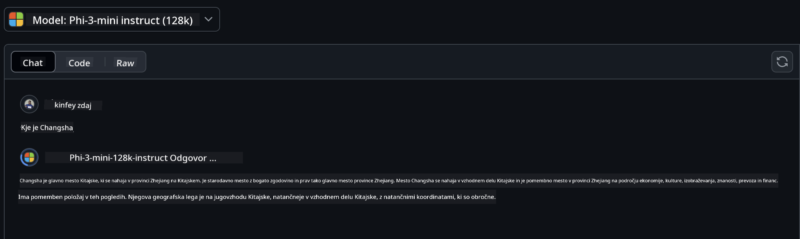
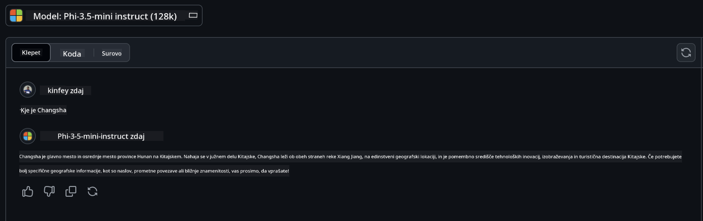

<!--
CO_OP_TRANSLATOR_METADATA:
{
  "original_hash": "124ad36cfe96f74038811b6e2bb93e9d",
  "translation_date": "2025-06-26T03:02:50+00:00",
  "source_file": "19-slm/README.md",
  "language_code": "sl"
}
-->

Modeli so najbolj neposreden način. Do modela Phi-3/3.5-Instruct lahko hitro dostopate prek GitHub Modelov. V kombinaciji z Azure AI Inference SDK / OpenAI SDK lahko prek kode dostopate do API-ja in dokončate klic Phi-3/3.5-Instruct. Različne učinke lahko preizkusite tudi prek Playgrounda. - Demo: Primerjava učinkov Phi-3-mini in Phi-3.5-mini v kitajskih scenarijih   **Azure AI Studio** Ali če želimo uporabiti modele za vid in MoE, lahko uporabite Azure AI Studio za dokončanje klica. Če vas zanima, lahko preberete Phi-3 Cookbook, da se naučite, kako prek Azure AI Studio poklicati Phi-3/3.5 Instruct, Vision, MoE [Kliknite to povezavo](https://github.com/microsoft/Phi-3CookBook/blob/main/md/02.QuickStart/AzureAIStudio_QuickStart.md?WT.mc_id=academic-105485-koreyst) **NVIDIA NIM** Poleg rešitev Model Catalog, ki jih ponujata Azure in GitHub, lahko za dokončanje povezanih klicev uporabite tudi [Nivida NIM](https://developer.nvidia.com/nim?WT.mc_id=academic-105485-koreyst). Obiščete lahko NIVIDA NIM, da dokončate API klice Phi-3/3.5 Family. NVIDIA NIM (NVIDIA Inference Microservices) je nabor pospešenih inferenčnih mikrostoritev, zasnovanih za pomoč razvijalcem pri učinkovitem uvajanju AI modelov v različnih okoljih, vključno z oblaki, podatkovnimi centri in delovnimi postajami. Tukaj so nekatere ključne značilnosti NVIDIA NIM: - **Enostavnost uvajanja:** NIM omogoča uvajanje AI modelov z enim samim ukazom, kar olajša integracijo v obstoječe delovne tokove. - **Optimizirana zmogljivost:** Uporablja predhodno optimizirane inferenčne motorje NVIDIA, kot sta TensorRT in TensorRT-LLM, da zagotovi nizko zakasnitev in visoko prepustnost. - **Razširljivost:** NIM podpira samodejno razširjanje na Kubernetes, kar mu omogoča učinkovito obvladovanje različnih delovnih obremenitev. - **Varnost in nadzor:** Organizacije lahko ohranijo nadzor nad svojimi podatki in aplikacijami s samostojnim gostovanjem NIM mikrostoritev na lastni upravljani infrastrukturi. - **Standardni API-ji:** NIM ponuja industrijsko standardne API-je, kar olajša gradnjo in integracijo AI aplikacij, kot so klepetalni roboti, AI asistenti in drugo. NIM je del NVIDIA AI Enterprise, ki si prizadeva poenostaviti uvajanje in operativnost AI modelov ter zagotoviti, da učinkovito delujejo na NVIDIA GPU-jih. - Demo: Uporaba Nividia NIM za klic Phi-3.5-Vision-API [[Kliknite to povezavo](../../../19-slm/python/Phi-3-Vision-Nividia-NIM.ipynb)] ### Inference Phi-3/3.5 v lokalnem okolju Inference v povezavi s Phi-3 ali katerim koli jezikovnim modelom, kot je GPT-3, se nanaša na proces generiranja odgovorov ali napovedi na podlagi vhodnih podatkov. Ko Phi-3 posredujete poziv ali vprašanje, uporabi svoj treniran nevronski model za inferenco najbolj verjetnega in relevantnega odgovora z analizo vzorcev in odnosov v podatkih, na katerih je bil treniran. **Hugging Face Transformer** Hugging Face Transformers je zmogljiva knjižnica, zasnovana za obdelavo naravnega jezika (NLP) in druge naloge strojnega učenja. Tukaj je nekaj ključnih točk o njej: 1. **Predhodno trenirani modeli**: Ponuja tisoče predhodno treniranih modelov, ki jih je mogoče uporabiti za različne naloge, kot so klasifikacija besedila, prepoznavanje imenovanih entitet, odgovarjanje na vprašanja, povzemanje, prevajanje in generiranje besedila. 2. **Interoperabilnost okvirjev**: Knjižnica podpira več okvirov za globoko učenje, vključno s PyTorch, TensorFlow in JAX. To vam omogoča, da trenirate model v enem okviru in ga uporabite v drugem. 3. **Multimodalne zmogljivosti**: Poleg NLP Hugging Face Transformers podpira tudi naloge v računalniškem vidu (npr. klasifikacija slik, zaznavanje objektov) in avdio obdelavi (npr. prepoznavanje govora, klasifikacija avdia). 4. **Enostavnost uporabe**: Knjižnica ponuja API-je in orodja za enostavno prenašanje in fino prilagajanje modelov, kar jo naredi dostopno tako za začetnike kot strokovnjake. 5. **Skupnost in viri**: Hugging Face ima živahno skupnost ter obsežno dokumentacijo, vadnice in vodiče, ki pomagajo uporabnikom začeti in kar najbolje izkoristiti knjižnico. [uradna dokumentacija](https://huggingface.co/docs/transformers/index?WT.mc_id=academic-105485-koreyst) ali njihov [GitHub repozitorij](https://github.com/huggingface/transformers?WT.mc_id=academic-105485-koreyst). To je najbolj pogosto uporabljena metoda, vendar zahteva tudi pospeševanje GPU. Navsezadnje prizori, kot sta Vision in MoE, zahtevajo veliko izračunov, ki bodo na CPU zelo omejeni, če niso kvantizirani. - Demo: Uporaba Transformer za klic Phi-3.5-Instuct [Kliknite to povezavo](../../../19-slm/python/phi35-instruct-demo.ipynb) - Demo: Uporaba Transformer za klic Phi-3.5-Vision [Kliknite to povezavo](../../../19-slm/python/phi35-vision-demo.ipynb) - Demo: Uporaba Transformer za klic Phi-3.5-MoE [Kliknite to povezavo](../../../19-slm/python/phi35_moe_demo.ipynb) **Ollama** [Ollama](https://ollama.com/?WT.mc_id=academic-105485-koreyst) je platforma, zasnovana za lažje izvajanje velikih jezikovnih modelov (LLM) lokalno na vašem računalniku. Podpira različne modele, kot so Llama 3.1, Phi 3, Mistral in Gemma 2, med drugim. Platforma poenostavi proces z združevanjem uteži modela, konfiguracije in podatkov v en sam paket, kar uporabnikom omogoča lažje prilagajanje in ustvarjanje lastnih modelov. Ollama je na voljo za macOS, Linux in Windows. Je odlično orodje, če želite eksperimentirati z LLM-ji ali jih uvajati, ne da bi se zanašali na storitve v oblaku. Ollama je najbolj neposreden način, preprosto morate izvesti naslednjo izjavo. ```bash

ollama run phi3.5

``` **ONNX Runtime za GenAI** [ONNX Runtime](https://github.com/microsoft/onnxruntime-genai?WT.mc_id=academic-105485-koreyst) je večplatformski pospeševalnik strojnega učenja za inferenco in treniranje. ONNX Runtime za Generative AI (GENAI) je zmogljivo orodje, ki vam pomaga učinkovito izvajati generativne AI modele na različnih platformah. ## Kaj je ONNX Runtime? ONNX Runtime je odprtokodni projekt, ki omogoča visoko zmogljivo inferenco strojnih učnih modelov. Podpira modele v formatu Open Neural Network Exchange (ONNX), ki je standard za predstavitev strojnih učnih modelov. Inferenca ONNX Runtime lahko omogoči hitrejše uporabniške izkušnje in nižje stroške, saj podpira modele iz okvirov za globoko učenje, kot so PyTorch in TensorFlow/Keras, ter klasične knjižnice strojnega učenja, kot so scikit-learn, LightGBM, XGBoost itd. ONNX Runtime je združljiv z različnimi strojno opremo, gonilniki in operacijskimi sistemi ter zagotavlja optimalno zmogljivost z izkoriščanjem strojnih pospeševalnikov, kjer je to mogoče, skupaj z optimizacijami in transformacijami grafov. ## Kaj je generativna AI? Generativna AI se nanaša na AI sisteme, ki lahko generirajo novo vsebino, kot so besedilo, slike ali glasba, na podlagi podatkov, na katerih so bili trenirani. Primeri vključujejo jezikovne modele, kot je GPT-3, in modele za generiranje slik, kot je Stable Diffusion. Knjižnica ONNX Runtime za GenAI zagotavlja generativno AI zanko za ONNX modele, vključno z inferenco z ONNX Runtime, obdelavo logitov, iskanjem in vzorčenjem ter upravljanjem KV predpomnilnika. ## ONNX Runtime za GENAI ONNX Runtime za GENAI razširja zmogljivosti ONNX Runtime za podporo generativnim AI modelom. Tukaj so nekatere ključne značilnosti: - **Široka podpora platformam:** Deluje na različnih platformah, vključno z Windows, Linux, macOS, Android in iOS. - **Podpora modelov:** Podpira številne priljubljene generativne AI modele, kot so LLaMA, GPT-Neo, BLOOM in več. - **Optimizacija zmogljivosti:** Vključuje optimizacije za različne strojne pospeševalnike, kot so NVIDIA GPU-ji, AMD GPU-ji in več. - **Enostavnost uporabe:** Ponuja API-je za enostavno integracijo v aplikacije, kar omogoča generiranje besedila, slik in druge vsebine z minimalno kodo. - Uporabniki lahko pokličejo visoko raven generate() metodo ali izvedejo vsako iteracijo modela v zanki, generirajo en token naenkrat in po želji posodobijo parametre generiranja znotraj zanke. - ONNX Runtime podpira tudi pohlepno/žarkovno iskanje in vzorčenje TopP, TopK za generiranje zaporedij tokenov ter vgrajeno obdelavo logitov, kot so kazni za ponavljanje. Lahko enostavno dodate tudi prilagojeno ocenjevanje. ## Začetek Za začetek z ONNX Runtime za GENAI lahko sledite tem korakom: ### Namestite ONNX Runtime: ```Python
pip install onnxruntime
``` ### Namestite razširitve generativne AI: ```Python
pip install onnxruntime-genai
``` ### Zaženite model: Tukaj je preprost primer v Pythonu: ```Python
import onnxruntime_genai as og

model = og.Model('path_to_your_model.onnx')

tokenizer = og.Tokenizer(model)

input_text = "Hello, how are you?"

input_tokens = tokenizer.encode(input_text)

output_tokens = model.generate(input_tokens)

output_text = tokenizer.decode(output_tokens)

print(output_text) 
``` ### Demo: Uporaba ONNX Runtime GenAI za klic Phi-3.5-Vision ```python

import onnxruntime_genai as og

model_path = './Your Phi-3.5-vision-instruct ONNX Path'

img_path = './Your Image Path'

model = og.Model(model_path)

processor = model.create_multimodal_processor()

tokenizer_stream = processor.create_stream()

text = "Your Prompt"

prompt = "<|user|>\n"

prompt += "<|image_1|>\n"

prompt += f"{text}<|end|>\n"

prompt += "<|assistant|>\n"

image = og.Images.open(img_path)

inputs = processor(prompt, images=image)

params = og.GeneratorParams(model)

params.set_inputs(inputs)

params.set_search_options(max_length=3072)

generator = og.Generator(model, params)

while not generator.is_done():

    generator.compute_logits()
    
    generator.generate_next_token()

    new_token = generator.get_next_tokens()[0]
    
    code += tokenizer_stream.decode(new_token)
    
    print(tokenizer_stream.decode(new_token), end='', flush=True)

``` **Drugo** Poleg referenčnih metod ONNX Runtime in Ollama lahko dokončamo tudi referenco kvantitativnih modelov na podlagi referenčnih metod modelov, ki jih ponujajo različni proizvajalci. Na primer, Apple MLX framework z Apple Metal, Qualcomm QNN z NPU, Intel OpenVINO z CPU/GPU itd. Več vsebine lahko dobite tudi iz [Phi-3 Cookbook](https://github.com/microsoft/phi-3cookbook?WT.mc_id=academic-105485-koreyst) ## Več Naučili smo se osnov Phi-3/3.5 Family, vendar za več znanja o SLM potrebujemo več informacij. Odgovore lahko najdete v Phi-3 Cookbook. Če želite izvedeti več, obiščite [Phi-3 Cookbook](https://github.com/microsoft/phi-3cookbook?WT.mc_id=academic-105485-koreyst).

**Omejitev odgovornosti**:
Ta dokument je bil preveden z uporabo storitve AI za prevajanje [Co-op Translator](https://github.com/Azure/co-op-translator). Čeprav si prizadevamo za natančnost, vas prosimo, da se zavedate, da lahko avtomatizirani prevodi vsebujejo napake ali netočnosti. Izvirni dokument v njegovem maternem jeziku je treba obravnavati kot avtoritativni vir. Za kritične informacije je priporočljivo profesionalno človeško prevajanje. Ne odgovarjamo za kakršna koli nesporazume ali napačne razlage, ki izhajajo iz uporabe tega prevoda.