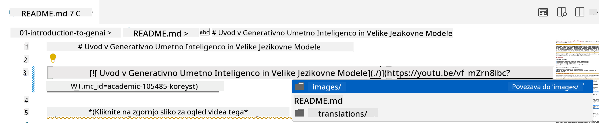
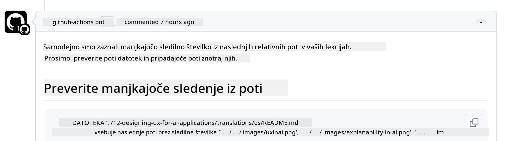
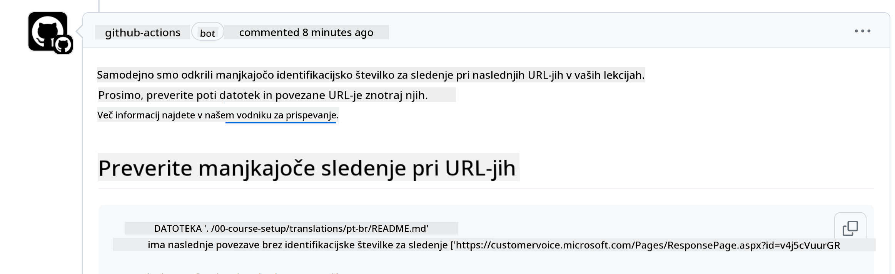
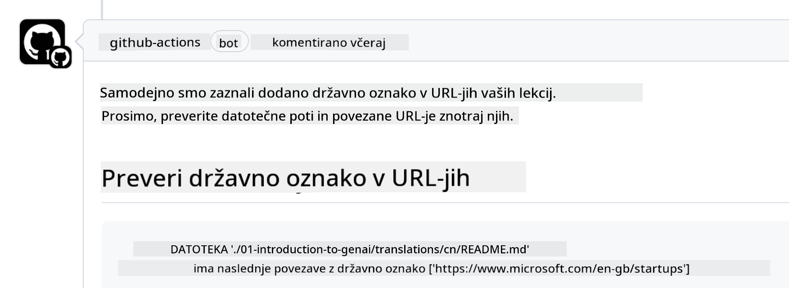

<!--
CO_OP_TRANSLATOR_METADATA:
{
  "original_hash": "57c41f2af71001a2cff9d8eb797cb843",
  "translation_date": "2025-05-19T11:27:14+00:00",
  "source_file": "CONTRIBUTING.md",
  "language_code": "sl"
}
-->
# Prispevanje

Ta projekt sprejema prispevke in predloge. Večina prispevkov zahteva, da se strinjate s Sporazumom o licenci za prispevke (CLA), ki potrjuje, da imate pravico in dejansko podeljujete pravice za uporabo vašega prispevka. Za podrobnosti obiščite <https://cla.microsoft.com>.

> Pomembno: pri prevajanju besedila v tem repozitoriju se prepričajte, da ne uporabljate strojnega prevajanja. Prevod bomo preverili preko skupnosti, zato se prostovoljno prijavite le za prevode v jezike, v katerih ste vešči.

Ko oddate zahtevo za združitev (pull request), bo CLA-bot samodejno ugotovil, ali morate zagotoviti CLA in ustrezno označil PR (npr. oznaka, komentar). Preprosto sledite navodilom, ki jih zagotovi bot. To boste morali storiti le enkrat za vse repozitorije, ki uporabljajo naš CLA.

## Kodeks ravnanja

Ta projekt je sprejel [Kodeks ravnanja odprte kode Microsoft](https://opensource.microsoft.com/codeofconduct/?WT.mc_id=academic-105485-koreyst).
Za več informacij preberite [FAQ kodeksa ravnanja](https://opensource.microsoft.com/codeofconduct/faq/?WT.mc_id=academic-105485-koreyst) ali se obrnite na [opencode@microsoft.com](mailto:opencode@microsoft.com) z dodatnimi vprašanji ali komentarji.

## Vprašanje ali problem?

Prosimo, ne odpirajte GitHub težav za splošna vprašanja podpore, saj naj bi se GitHub seznam uporabljal za zahteve po funkcijah in poročila o napakah. Na ta način lahko lažje sledimo dejanskim težavam ali napakam iz kode in ločimo splošno razpravo od dejanske kode.

## Tipkarske napake, težave, napake in prispevki

Kadarkoli oddate spremembe v repozitorij Generativna AI za začetnike, prosimo, upoštevajte te priporočila.

* Vedno najprej razvejite (fork) repozitorij v svoj račun, preden naredite spremembe
* Ne združujte več sprememb v eno zahtevo za združitev. Na primer, oddajte kakršnokoli popravilo napake in posodobitve dokumentacije z ločenimi PR-ji
* Če vaša zahteva za združitev kaže konflikte združevanja, poskrbite, da posodobite svoj lokalni glavni repozitorij, da bo odsev tega, kar je v glavnem repozitoriju, preden naredite spremembe
* Če oddajate prevod, prosimo, ustvarite en PR za vse prevedene datoteke, saj ne sprejemamo delnih prevodov za vsebino
* Če oddajate tipkarsko napako ali popravilo dokumentacije, lahko združite spremembe v en sam PR, kjer je to primerno

## Splošna navodila za pisanje

- Poskrbite, da so vsi vaši URL-ji oviti v oglate oklepaje, ki jim sledi oklepaj brez dodatnih presledkov okoli njih ali znotraj njih ``.
- Poskrbite, da vsaka relativna povezava (tj. povezave do drugih datotek in map v repozitoriju) začne z `./`, ki se nanaša na datoteko ali mapo, ki se nahaja v trenutnem delovnem imeniku ali `../`, ki se nanaša na datoteko ali mapo, ki se nahaja v nadrejenem delovnem imeniku.
- Poskrbite, da vsaka relativna povezava (tj. povezave do drugih datotek in map v repozitoriju) ima sledilni ID (tj. `?` ali `&` nato `wt.mc_id=` ali `WT.mc_id=`) na koncu.
- Poskrbite, da vsak URL z naslednjih domen _github.com, microsoft.com, visualstudio.com, aka.ms, in azure.com_ ima sledilni ID (tj. `?` ali `&` nato `wt.mc_id=` ali `WT.mc_id=`) na koncu.
- Poskrbite, da vaše povezave nimajo državne specifične lokalizacije v njih (tj. `/en-us/` ali `/en/`).
- Poskrbite, da so vse slike shranjene v mapi `./images`.
- Poskrbite, da imajo slike opisna imena z uporabo angleških znakov, številk in pomišljajev v imenu vaše slike.

## GitHub delovni tokovi

Ko oddate zahtevo za združitev, bodo sproženi štirje različni delovni tokovi za preverjanje prejšnjih pravil.
Preprosto sledite navodilom, navedenim tukaj, da uspešno opravite preverjanja delovnega toka.

- [Preverite pokvarjene relativne poti](../..)
- [Preverite, da poti imajo sledenje](../..)
- [Preverite, da URL-ji imajo sledenje](../..)
- [Preverite, da URL-ji nimajo lokalizacije](../..)

### Preverite pokvarjene relativne poti

Ta delovni tok zagotavlja, da katerakoli relativna pot v vaših datotekah deluje.
Ta repozitorij je nameščen na GitHub straneh, zato morate biti zelo previdni, ko vnašate povezave, ki povezujejo vse skupaj, da ne usmerjate nikogar na napačno mesto.

Da se prepričate, da vaše povezave delujejo pravilno, preprosto uporabite VS kodo za preverjanje.

Na primer, ko se premaknete nad katerokoli povezavo v vaših datotekah, boste pozvani, da sledite povezavi s pritiskom na **ctrl + klik**

Če kliknete na povezavo in ne deluje lokalno, potem bo zagotovo sprožila delovni tok in ne bo delovala na GitHubu.

Za odpravo te težave poskusite vtipkati povezavo s pomočjo VS kode.

Ko vtipkate `./` ali `../`, bo VS koda pozvala, da izberete med razpoložljivimi možnostmi glede na to, kar ste vtipkali.

Sledite poti s klikom na želeno datoteko ali mapo in prepričani boste, da vaša pot ni pokvarjena.

Ko dodate pravilno relativno pot, shranite in potisnite vaše spremembe, bo delovni tok ponovno sprožen za preverjanje vaših sprememb.
Če uspešno opravite preverjanje, ste pripravljeni.

### Preverite, da poti imajo sledenje

Ta delovni tok zagotavlja, da katerakoli relativna pot ima sledenje.
Ta repozitorij je nameščen na GitHub straneh, zato moramo slediti gibanju med različnimi datotekami in mapami.

Da se prepričate, da vaše relativne poti imajo sledenje, preprosto preverite naslednje besedilo `?wt.mc_id=` na koncu poti.
Če je dodano k vašim relativnim potem, boste opravili to preverjanje.

Če ne, boste morda prejeli naslednjo napako.

Za odpravo te težave poskusite odpreti pot datoteke, ki jo je delovni tok izpostavil, in dodajte sledilni ID na konec relativnih poti.

Ko dodate sledilni ID, shranite in potisnite vaše spremembe, bo delovni tok ponovno sprožen za preverjanje vaših sprememb.
Če uspešno opravite preverjanje, ste pripravljeni.

### Preverite, da URL-ji imajo sledenje

Ta delovni tok zagotavlja, da katerikoli spletni URL ima sledenje.
Ta repozitorij je na voljo vsem, zato morate poskrbeti, da sledite dostopu, da veste, od kod prihaja promet.

Da se prepričate, da vaši URL-ji imajo sledenje, preprosto preverite naslednje besedilo `?wt.mc_id=` na koncu URL-ja.
Če je dodano k vašim URL-jem, boste opravili to preverjanje.

Če ne, boste morda prejeli naslednjo napako.

Za odpravo te težave poskusite odpreti pot datoteke, ki jo je delovni tok izpostavil, in dodajte sledilni ID na konec URL-jev.

Ko dodate sledilni ID, shranite in potisnite vaše spremembe, bo delovni tok ponovno sprožen za preverjanje vaših sprememb.
Če uspešno opravite preverjanje, ste pripravljeni.

### Preverite, da URL-ji nimajo lokalizacije

Ta delovni tok zagotavlja, da katerikoli spletni URL nima državne specifične lokalizacije v njem.
Ta repozitorij je na voljo vsem po svetu, zato morate poskrbeti, da ne vključujete lokalizacije vaše države v URL-je.

Da se prepričate, da vaši URL-ji nimajo lokalizacije države, preprosto preverite naslednje besedilo `/en-us/` ali `/en/` ali katerokoli drugo jezikovno lokalizacijo kjerkoli v URL-ju.
Če ni prisotno v vaših URL-jih, boste opravili to preverjanje.

Če ne, boste morda prejeli naslednjo napako.

Za odpravo te težave poskusite odpreti pot datoteke, ki jo je delovni tok izpostavil, in odstranite lokalizacijo države iz URL-jev.

Ko odstranite lokalizacijo države, shranite in potisnite vaše spremembe, bo delovni tok ponovno sprožen za preverjanje vaših sprememb.
Če uspešno opravite preverjanje, ste pripravljeni.

Čestitke! V najkrajšem možnem času se vam bomo oglasili s povratnimi informacijami o vašem prispevku.

**Omejitev odgovornosti**:  
Ta dokument je bil preveden z uporabo storitve AI prevajanja [Co-op Translator](https://github.com/Azure/co-op-translator). Čeprav si prizadevamo za natančnost, vas prosimo, da upoštevate, da lahko avtomatizirani prevodi vsebujejo napake ali netočnosti. Izvirni dokument v njegovem maternem jeziku bi moral biti obravnavan kot avtoritativni vir. Za ključne informacije priporočamo strokovni človeški prevod. Ne prevzemamo odgovornosti za morebitna nesporazumevanja ali napačne interpretacije, ki bi nastala zaradi uporabe tega prevoda.