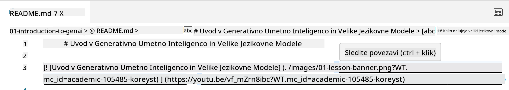
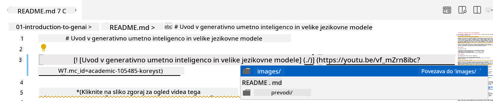
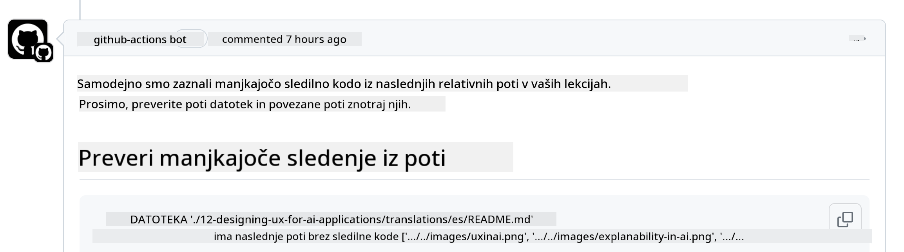
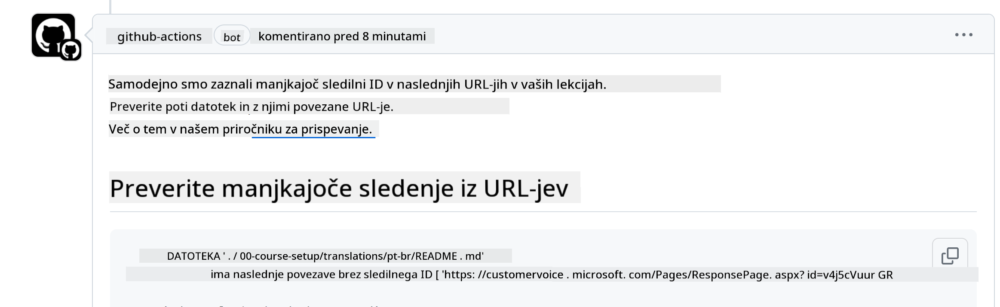
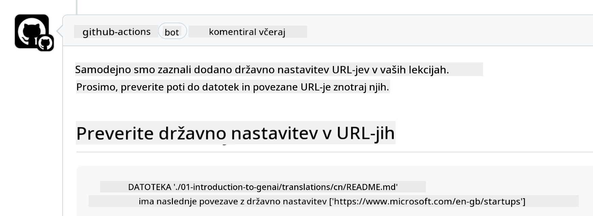

<!--
CO_OP_TRANSLATOR_METADATA:
{
  "original_hash": "57c41f2af71001a2cff9d8eb797cb843",
  "translation_date": "2025-06-25T07:22:14+00:00",
  "source_file": "CONTRIBUTING.md",
  "language_code": "sl"
}
-->
# Prispevanje

Ta projekt pozdravlja prispevke in predloge. Večina prispevkov zahteva, da se strinjate s pogodbo o licenciranju prispevkov (CLA), s katero izjavite, da imate pravico, in dejansko podeljujete pravice za uporabo vašega prispevka. Za podrobnosti obiščite <https://cla.microsoft.com>.

> Pomembno: pri prevajanju besedila v tem repozitoriju poskrbite, da ne uporabljate strojnega prevajanja. Prevajanje bomo preverili prek skupnosti, zato se prostovoljno prijavite le za prevode v jezike, v katerih ste vešči.

Ko pošljete zahtevo za združitev (pull request), bo CLA-bot samodejno določil, ali morate zagotoviti CLA in ustrezno označiti PR (npr. oznaka, komentar). Preprosto sledite navodilom, ki jih poda bot. To boste morali storiti le enkrat v vseh repozitorijih, ki uporabljajo naš CLA.

## Kodeks ravnanja

Ta projekt je sprejel [Microsoftov kodeks ravnanja za odprtokodno programsko opremo](https://opensource.microsoft.com/codeofconduct/?WT.mc_id=academic-105485-koreyst). Za več informacij preberite [pogosta vprašanja o kodeksu ravnanja](https://opensource.microsoft.com/codeofconduct/faq/?WT.mc_id=academic-105485-koreyst) ali se obrnite na [opencode@microsoft.com](mailto:opencode@microsoft.com) z dodatnimi vprašanji ali komentarji.

## Vprašanje ali težava?

Prosimo, ne odpirajte GitHub težav za splošna podporna vprašanja, saj naj bi bil seznam GitHub uporabljen za zahteve po funkcijah in poročila o napakah. Na ta način lahko lažje sledimo dejanskim težavam ali napakam v kodi in ločimo splošno razpravo od dejanske kode.

## Tipkarske napake, težave, napake in prispevki

Kadar koli pošiljate spremembe v repozitorij Generative AI for Beginners, upoštevajte te priporočila.

* Vedno razvejite repozitorij na svoj račun, preden izvedete spremembe
* Ne združujte več sprememb v eno zahtevo za združitev. Na primer, pošljite kakršno koli odpravo napak in posodobitve dokumentacije z ločenimi PR-ji
* Če vaša zahteva za združitev pokaže konflikte združevanja, poskrbite, da posodobite svoj lokalni glavni del, da bo zrcalo tistega, kar je v glavnem repozitoriju, preden izvedete spremembe
* Če pošiljate prevod, ustvarite en PR za vse prevedene datoteke, saj ne sprejemamo delnih prevodov vsebine
* Če pošiljate tipkarsko napako ali popravilo dokumentacije, lahko združite spremembe v en PR, kjer je to primerno

## Splošna navodila za pisanje

- Poskrbite, da bodo vsi vaši URL-ji oviti v oglate oklepaje, ki jim sledi oklepaj brez dodatnih presledkov okoli njih ali znotraj njih ``.
- Poskrbite, da bo katera koli relativna povezava (tj. povezave do drugih datotek in map v repozitoriju) začela z `./`, ki se nanaša na datoteko ali mapo, ki se nahaja v trenutni delovni mapi, ali `../`, ki se nanaša na datoteko ali mapo, ki se nahaja v nadrejeni delovni mapi.
- Poskrbite, da bo katera koli relativna povezava (tj. povezave do drugih datotek in map v repozitoriju) imela sledilno ID (tj. `?` ali `&`, nato `wt.mc_id=` ali `WT.mc_id=`) na koncu.
- Poskrbite, da bo kateri koli URL iz naslednjih domen _github.com, microsoft.com, visualstudio.com, aka.ms in azure.com_ imel sledilno ID (tj. `?` ali `&`, nato `wt.mc_id=` ali `WT.mc_id=`) na koncu.
- Poskrbite, da vaše povezave nimajo v njih specifične jezikovne oznake države (tj. `/en-us/` ali `/en/`).
- Poskrbite, da so vse slike shranjene v mapi `./images`.
- Poskrbite, da imajo slike opisna imena, ki uporabljajo angleške znake, številke in vezaje v imenu vaše slike.

## GitHub poteki dela

Ko pošljete zahtevo za združitev, bodo sproženi štirje različni poteki dela, da preverijo prejšnja pravila. Preprosto sledite navodilom, navedenim tukaj, da opravite preverjanja poteka dela.

- [Preverite prelomljene relativne poti](../..)
- [Preverite, ali imajo poti sledenje](../..)
- [Preverite, ali imajo URL-ji sledenje](../..)
- [Preverite, ali URL-ji nimajo lokalizacije](../..)

### Preverite prelomljene relativne poti

Ta potek dela zagotavlja, da katera koli relativna pot v vaših datotekah deluje. Ta repozitorij je nameščen na GitHub straneh, zato morate biti zelo previdni, ko vnašate povezave, ki vse skupaj povezujejo, da ne bi koga usmerili na napačno mesto.

Da zagotovite, da vaše povezave delujejo pravilno, preprosto uporabite VS kodo za preverjanje.

Na primer, ko se z miško pomaknete nad katero koli povezavo v vaših datotekah, boste pozvani, da sledite povezavi s pritiskom na **ctrl + klik**

Če kliknete na povezavo in ta lokalno ne deluje, bo zagotovo sprožila potek dela in ne bo delovala na GitHubu.

Da odpravite to težavo, poskusite vnesti povezavo s pomočjo VS kode.

Ko vnesete `./` ali `../`, vas bo VS koda pozvala, da izberete med razpoložljivimi možnostmi glede na to, kar ste vnesli.

Sledite poti s klikom na želeno datoteko ali mapo in prepričani boste, da vaša pot ni prelomljena.

Ko dodate pravilno relativno pot, shranite in potisnite svoje spremembe, bo potek dela ponovno sprožen za preverjanje vaših sprememb. Če opravite preverjanje, potem ste pripravljeni.

### Preverite, ali imajo poti sledenje

Ta potek dela zagotavlja, da ima katera koli relativna pot v njej sledenje. Ta repozitorij je nameščen na GitHub straneh, zato moramo slediti premikom med različnimi datotekami in mapami.

Da zagotovite, da vaše relativne poti vsebujejo sledenje, preprosto preverite naslednje besedilo `?wt.mc_id=` na koncu poti. Če je dodano vašim relativnim potem, boste opravili to preverjanje.

Če ne, lahko prejmete naslednjo napako.

Da odpravite to težavo, poskusite odpreti pot datoteke, ki jo je potek dela izpostavil, in dodajte sledilni ID na konec relativnih poti.

Ko dodate sledilni ID, shranite in potisnite svoje spremembe, bo potek dela ponovno sprožen za preverjanje vaših sprememb. Če opravite preverjanje, potem ste pripravljeni.

### Preverite, ali imajo URL-ji sledenje

Ta potek dela zagotavlja, da ima kateri koli spletni URL v njem sledenje. Ta repozitorij je na voljo vsem, zato morate zagotoviti sledenje dostopu, da veste, od kod prihaja promet.

Da zagotovite, da vaši URL-ji vsebujejo sledenje, preprosto preverite naslednje besedilo `?wt.mc_id=` na koncu URL-ja. Če je dodano vašim URL-jem, boste opravili to preverjanje.

Če ne, lahko prejmete naslednjo napako.

Da odpravite to težavo, poskusite odpreti pot datoteke, ki jo je potek dela izpostavil, in dodajte sledilni ID na konec URL-jev.

Ko dodate sledilni ID, shranite in potisnite svoje spremembe, bo potek dela ponovno sprožen za preverjanje vaših sprememb. Če opravite preverjanje, potem ste pripravljeni.

### Preverite, ali URL-ji nimajo lokalizacije

Ta potek dela zagotavlja, da kateri koli spletni URL nima specifične jezikovne oznake države v njem. Ta repozitorij je na voljo vsem po svetu, zato morate zagotoviti, da v URL-jih ne vključujete lokalizacije svoje države.

Da zagotovite, da vaši URL-ji nimajo jezikovne oznake države v njih, preprosto preverite naslednje besedilo `/en-us/` ali `/en/` ali katero koli drugo jezikovno lokalizacijo kjer koli v URL-ju. Če ni prisotno v vaših URL-jih, boste opravili to preverjanje.

Če ne, lahko prejmete naslednjo napako.

Da odpravite to težavo, poskusite odpreti pot datoteke, ki jo je potek dela izpostavil, in odstranite jezikovno oznako države iz URL-jev.

Ko odstranite jezikovno oznako države, shranite in potisnite svoje spremembe, bo potek dela ponovno sprožen za preverjanje vaših sprememb. Če opravite preverjanje, potem ste pripravljeni.

Čestitamo! Takoj, ko bo mogoče, se vam bomo oglasili s povratnimi informacijami o vašem prispevku.

**Izjava o omejitvi odgovornosti**:  
Ta dokument je bil preveden z uporabo storitve strojnega prevajanja [Co-op Translator](https://github.com/Azure/co-op-translator). Čeprav se trudimo za natančnost, vas prosimo, da se zavedate, da lahko avtomatizirani prevodi vsebujejo napake ali netočnosti. Izvirni dokument v svojem maternem jeziku je treba obravnavati kot avtoritativni vir. Za ključne informacije je priporočljivo profesionalno človeško prevajanje. Ne prevzemamo odgovornosti za morebitna nesporazumevanja ali napačne interpretacije, ki izhajajo iz uporabe tega prevoda.