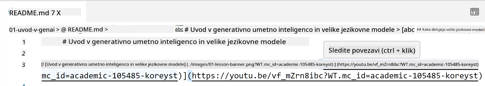
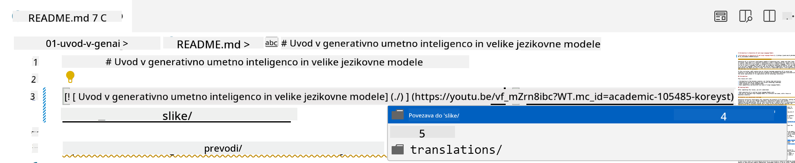
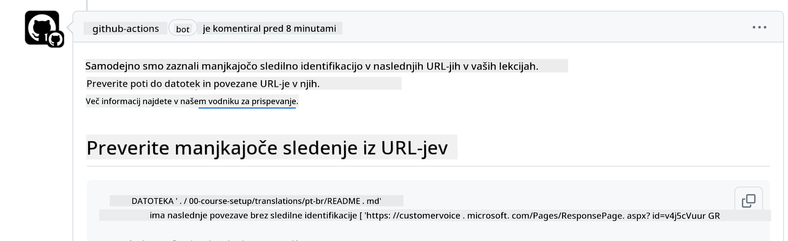

<!--
CO_OP_TRANSLATOR_METADATA:
{
  "original_hash": "57c41f2af71001a2cff9d8eb797cb843",
  "translation_date": "2025-07-09T06:13:49+00:00",
  "source_file": "CONTRIBUTING.md",
  "language_code": "sl"
}
-->
# Prispevanje

Ta projekt sprejema prispevke in predloge. Večina prispevkov zahteva, da se strinjate s Contributor License Agreement (CLA), s katerim izjavite, da imate pravico in dejansko omogočate uporabo vašega prispevka. Za podrobnosti obiščite <https://cla.microsoft.com>.

> Pomembno: pri prevajanju besedil v tem repozitoriju prosimo, da ne uporabljate strojnega prevajanja. Prevode bomo preverjali s pomočjo skupnosti, zato se prijavite za prevode le v jezikih, ki jih dobro obvladate.

Ko oddate pull request, bo CLA-bot samodejno preveril, ali morate predložiti CLA, in ustrezno označil PR (npr. z oznako ali komentarjem). Preprosto sledite navodilom bota. To boste morali storiti le enkrat za vse repozitorije, ki uporabljajo naš CLA.

## Kodeks ravnanja

Ta projekt je sprejel [Microsoft Open Source Code of Conduct](https://opensource.microsoft.com/codeofconduct/?WT.mc_id=academic-105485-koreyst).
Za več informacij preberite [Pogosta vprašanja o kodeksu ravnanja](https://opensource.microsoft.com/codeofconduct/faq/?WT.mc_id=academic-105485-koreyst) ali pa se obrnite na [opencode@microsoft.com](mailto:opencode@microsoft.com) za dodatna vprašanja ali komentarje.

## Vprašanje ali težava?

Prosimo, ne odpirajte GitHub issue-jev za splošna vprašanja o podpori, saj je seznam na GitHubu namenjen zahtevam za funkcionalnosti in poročilom o napakah. Tako bomo lažje sledili dejanskim težavam ali napakam v kodi in ločili splošno razpravo od same kode.

## Tipkarske napake, težave, hrošči in prispevki

Ko pošiljate spremembe v repozitorij Generative AI for Beginners, upoštevajte naslednja priporočila.

* Vedno najprej forkajte repozitorij na svoj račun, preden naredite spremembe
* Ne združujte več sprememb v en pull request. Na primer, popravke napak in posodobitve dokumentacije pošljite v ločenih PR-jih
* Če vaš pull request kaže konflikte pri združevanju, poskrbite, da bo vaša lokalna veja main posodobljena in usklajena z glavno vejo repozitorija, preden naredite spremembe
* Če pošiljate prevod, ustvarite en PR za vse prevedene datoteke, saj ne sprejemamo delnih prevodov vsebine
* Če pošiljate popravke tipkarskih napak ali dokumentacije, lahko združite spremembe v en PR, kjer je to primerno

## Splošna navodila za pisanje

- Poskrbite, da so vsi vaši URL-ji oviti v oglate oklepaje, ki jim sledijo okrogli oklepaji brez dodatnih presledkov ``.
- Poskrbite, da se vsak relativni povezavi (tj. povezave do drugih datotek in map v repozitoriju) začne z `./` za datoteko ali mapo v trenutni delovni mapi ali z `../` za datoteko ali mapo v nadrejeni mapi.
- Poskrbite, da ima vsaka relativna povezava na koncu sledilni ID (tj. `?` ali `&` in nato `wt.mc_id=` ali `WT.mc_id=`).
- Poskrbite, da imajo vsi URL-ji s domen _github.com, microsoft.com, visualstudio.com, aka.ms in azure.com_ na koncu sledilni ID (tj. `?` ali `&` in nato `wt.mc_id=` ali `WT.mc_id=`).
- Poskrbite, da vaši URL-ji ne vsebujejo lokalizacije za državo (npr. `/en-us/` ali `/en/`).
- Poskrbite, da so vse slike shranjene v mapi `./images`.
- Poskrbite, da imajo slike opisna imena, ki vsebujejo angleške znake, številke in vezaje.

## GitHub delovni tokovi

Ko oddate pull request, se sprožijo štirje različni delovni tokovi, ki preverjajo zgoraj navedena pravila.
Preprosto sledite navodilom tukaj, da opravite preverjanja delovnih tokov.

- [Preveri prekinjene relativne poti](../..)
- [Preveri, da poti vsebujejo sledilni ID](../..)
- [Preveri, da URL-ji vsebujejo sledilni ID](../..)
- [Preveri, da URL-ji ne vsebujejo lokalizacije](../..)

### Preveri prekinjene relativne poti

Ta delovni tok zagotavlja, da so vse relativne poti v vaših datotekah pravilne.
Ta repozitorij je nameščen na GitHub Pages, zato morate biti zelo previdni pri vnašanju povezav, da nikogar ne usmerite na napačno mesto.

Da preverite, ali vaše povezave delujejo pravilno, preprosto uporabite VS Code.

Na primer, ko se z miško postavite nad katerokoli povezavo v datotekah, boste lahko sledili povezavi s pritiskom na **ctrl + klik**

Če kliknete povezavo in ta lokalno ne deluje, bo delovni tok sprožen in povezava ne bo delovala niti na GitHubu.

Za odpravo te težave poskusite povezavo vnesti s pomočjo VS Code.

Ko vnesete `./` ali `../`, vam bo VS Code ponudil izbiro iz razpoložljivih možnosti glede na to, kar ste vnesli.

Sledite poti s klikom na želeno datoteko ali mapo in tako boste prepričani, da vaša pot ni prekinjena.

Ko dodate pravilno relativno pot, shranite in potisnite spremembe, bo delovni tok ponovno sprožen za preverjanje.
Če opravite preverjanje, ste pripravljeni za nadaljevanje.

### Preveri, da poti vsebujejo sledilni ID

Ta delovni tok zagotavlja, da ima vsaka relativna pot v sebi sledilni ID.
Ta repozitorij je nameščen na GitHub Pages, zato moramo slediti premikom med različnimi datotekami in mapami.

Da zagotovite, da imajo vaše relativne poti sledilni ID, preprosto preverite, ali se na koncu poti nahaja besedilo `?wt.mc_id=`.
Če je dodano na vaše relativne poti, boste opravili preverjanje.

Če ni, boste morda prejeli naslednjo napako.

Za odpravo te težave odprite datoteko, ki jo je delovni tok označil, in dodajte sledilni ID na konec relativnih poti.

Ko dodate sledilni ID, shranite in potisnite spremembe, bo delovni tok ponovno sprožen za preverjanje.
Če opravite preverjanje, ste pripravljeni za nadaljevanje.

### Preveri, da URL-ji vsebujejo sledilni ID

Ta delovni tok zagotavlja, da ima vsak spletni URL v sebi sledilni ID.
Ta repozitorij je dostopen vsem, zato morate zagotoviti sledenje dostopa, da vemo, od kod prihaja promet.

Da zagotovite, da imajo vaši URL-ji sledilni ID, preprosto preverite, ali se na koncu URL-ja nahaja besedilo `?wt.mc_id=`.
Če je dodano na vaše URL-je, boste opravili preverjanje.

Če ni, boste morda prejeli naslednjo napako.

Za odpravo te težave odprite datoteko, ki jo je delovni tok označil, in dodajte sledilni ID na konec URL-jev.

Ko dodate sledilni ID, shranite in potisnite spremembe, bo delovni tok ponovno sprožen za preverjanje.
Če opravite preverjanje, ste pripravljeni za nadaljevanje.

### Preveri, da URL-ji ne vsebujejo lokalizacije

Ta delovni tok zagotavlja, da noben spletni URL ne vsebuje lokalizacije za določeno državo.
Ta repozitorij je dostopen vsem po svetu, zato morate paziti, da v URL-jih ne vključite lokalizacije svoje države.

Da zagotovite, da vaši URL-ji ne vsebujejo lokalizacije države, preprosto preverite, ali se v URL-jih nahaja besedilo `/en-us/`, `/en/` ali katerakoli druga jezikovna lokalizacija.
Če tega ni v vaših URL-jih, boste opravili preverjanje.

Če je, boste morda prejeli naslednjo napako.

Za odpravo te težave odprite datoteko, ki jo je delovni tok označil, in odstranite lokalizacijo države iz URL-jev.

Ko odstranite lokalizacijo države, shranite in potisnite spremembe, bo delovni tok ponovno sprožen za preverjanje.
Če opravite preverjanje, ste pripravljeni za nadaljevanje.

Čestitamo! Oglasili se bomo čim prej z odzivom na vaš prispevek.

**Omejitev odgovornosti**:  
Ta dokument je bil preveden z uporabo AI prevajalske storitve [Co-op Translator](https://github.com/Azure/co-op-translator). Čeprav si prizadevamo za natančnost, vas opozarjamo, da avtomatizirani prevodi lahko vsebujejo napake ali netočnosti. Izvirni dokument v njegovem izvirnem jeziku velja za avtoritativni vir. Za ključne informacije priporočamo strokovni človeški prevod. Za morebitna nesporazume ali napačne interpretacije, ki izhajajo iz uporabe tega prevoda, ne odgovarjamo.