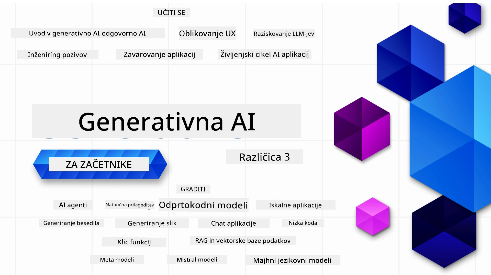

### 21 lekcij, ki poučujejo vse, kar morate vedeti, da začnete graditi aplikacije generativne umetne inteligence

[](https://github.com/microsoft/Generative-AI-For-Beginners/blob/master/LICENSE?WT.mc_id=academic-105485-koreyst)
[](https://GitHub.com/microsoft/Generative-AI-For-Beginners/graphs/contributors/?WT.mc_id=academic-105485-koreyst)
[](https://GitHub.com/microsoft/Generative-AI-For-Beginners/issues/?WT.mc_id=academic-105485-koreyst)
[](https://GitHub.com/microsoft/Generative-AI-For-Beginners/pulls/?WT.mc_id=academic-105485-koreyst)
[](http://makeapullrequest.com?WT.mc_id=academic-105485-koreyst)

[](https://GitHub.com/microsoft/Generative-AI-For-Beginners/watchers/?WT.mc_id=academic-105485-koreyst)
[](https://GitHub.com/microsoft/Generative-AI-For-Beginners/network/?WT.mc_id=academic-105485-koreyst)
[](https://GitHub.com/microsoft/Generative-AI-For-Beginners/stargazers/?WT.mc_id=academic-105485-koreyst)

[](https://discord.gg/nTYy5BXMWG)

### 🌐 Podpora za več jezikov

#### Podprto preko GitHub Action (samodejno in vedno posodobljeno)

<!-- CO-OP TRANSLATOR LANGUAGES TABLE START -->
[Arabsko](../ar/README.md) | [Bengalsko](../bn/README.md) | [Bolgarščina](../bg/README.md) | [Burmanščina (Mjanmar)](../my/README.md) | [Kitajščina (poenostavljena)](../zh-CN/README.md) | [Kitajščina (tradicijska, Hongkong)](../zh-HK/README.md) | [Kitajščina (tradicijska, Macao)](../zh-MO/README.md) | [Kitajščina (tradicijska, Tajvan)](../zh-TW/README.md) | [Hrvaščina](../hr/README.md) | [Češčina](../cs/README.md) | [Dansko](../da/README.md) | [Nizozemščina](../nl/README.md) | [Estonščina](../et/README.md) | [Finščina](../fi/README.md) | [Francoščina](../fr/README.md) | [Nemščina](../de/README.md) | [Grščina](../el/README.md) | [Hebrejščina](../he/README.md) | [Hindujščina](../hi/README.md) | [Madžarščina](../hu/README.md) | [Indonezijščina](../id/README.md) | [Italijanščina](../it/README.md) | [Japonščina](../ja/README.md) | [Kannada](../kn/README.md) | [Korejščina](../ko/README.md) | [Litvanščina](../lt/README.md) | [Malezijščina](../ms/README.md) | [Malayalam](../ml/README.md) | [Marathi](../mr/README.md) | [Nepalščina](../ne/README.md) | [Nigerski pidžin](../pcm/README.md) | [Norveščina](../no/README.md) | [Perzijščina (Farsi)](../fa/README.md) | [Poljščina](../pl/README.md) | [Portugalščina (Brazilija)](../pt-BR/README.md) | [Portugalščina (Portugalska)](../pt-PT/README.md) | [Punjabi (Gurmukhi)](../pa/README.md) | [Romunščina](../ro/README.md) | [Ruščina](../ru/README.md) | [Srbščina (cirilica)](../sr/README.md) | [Slovaščina](../sk/README.md) | [Slovenščina](./README.md) | [Španščina](../es/README.md) | [Svahili](../sw/README.md) | [Švedščina](../sv/README.md) | [Tagalog (Filipino)](../tl/README.md) | [Tamilščina](../ta/README.md) | [Telugu](../te/README.md) | [Tajščina](../th/README.md) | [Turščina](../tr/README.md) | [Ukrajinščina](../uk/README.md) | [Urdu](../ur/README.md) | [Vietnamščina](../vi/README.md)

> **Raje želite klonirati lokalno?**

> Ta repozitorij vključuje prevode v več kot 50 jezikov, kar znatno poveča velikost prenosa. Za kloniranje brez prevodov uporabite sparse checkout:
> ```bash
> git clone --filter=blob:none --sparse https://github.com/microsoft/generative-ai-for-beginners.git
> cd generative-ai-for-beginners
> git sparse-checkout set --no-cone '/*' '!translations' '!translated_images'
> ```
> Tako boste dobili vse, kar potrebujete za dokončanje tečaja z veliko hitrejšim prenosom.
<!-- CO-OP TRANSLATOR LANGUAGES TABLE END -->

# Generativna umetna inteligenca za začetnike (verzija 3) - tečaj

Naučite se osnov gradnje aplikacij generativne umetne inteligence z našim 21-lekcijskim obsežnim tečajem, ki ga pripravljajo Microsoft Cloud Advocates.

## 🌱 Začetek

Ta tečaj ima 21 lekcij. Vsaka lekcija pokriva svojo temo, zato začnite kjerkoli želite!

Lekcije so označene bodisi kot "Learn" lekcije, ki pojasnjujejo koncept generativne umetne inteligence, ali "Build" lekcije, ki pojasnjujejo koncept in primere kode v obeh jezikih **Python** in **TypeScript**, kjer je to mogoče.

Za .NET razvijalce si oglejte [Generative AI for Beginners (.NET Edition)](https://github.com/microsoft/Generative-AI-for-beginners-dotnet?WT.mc_id=academic-105485-koreyst)!

Vsaka lekcija vključuje tudi razdelek "Keep Learning" z dodatnimi učnimi orodji.

## Kaj potrebujete
### Za izvajanje kode iz tega tečaja lahko uporabite:
 - [Azure OpenAI Service](https://aka.ms/genai-beginners/azure-open-ai?WT.mc_id=academic-105485-koreyst) - **Lekcije:** "aoai-assignment"
 - [GitHub Marketplace Model Catalog](https://aka.ms/genai-beginners/gh-models?WT.mc_id=academic-105485-koreyst) - **Lekcije:** "githubmodels"
 - [OpenAI API](https://aka.ms/genai-beginners/open-ai?WT.mc_id=academic-105485-koreyst) - **Lekcije:** "oai-assignment" 
   
- Osnovno znanje Pythona ali TypeScripta je koristno - \*Za popolne začetnike si oglejte ta [Python](https://aka.ms/genai-beginners/python?WT.mc_id=academic-105485-koreyst) in [TypeScript](https://aka.ms/genai-beginners/typescript?WT.mc_id=academic-105485-koreyst) tečaja
- GitHub račun za [forkanje celotnega repozitorija](https://aka.ms/genai-beginners/github?WT.mc_id=academic-105485-koreyst) na vaš lastni GitHub račun

Ustvarili smo **[Course Setup](./00-course-setup/README.md?WT.mc_id=academic-105485-koreyst)** lekcijo, ki vam pomaga pri nastavitvi razvojnega okolja.

Ne pozabite [ozvezditi (🌟) tega repozitorija](https://docs.github.com/en/get-started/exploring-projects-on-github/saving-repositories-with-stars?WT.mc_id=academic-105485-koreyst), da ga boste lažje našli pozneje.

## 🧠 Pripravljeni za razmestitev?

Če iščete bolj napredne primere kode, si oglejte našo [zbirko primerov kode za generativno AI](https://aka.ms/genai-beg-code?WT.mc_id=academic-105485-koreyst) v obeh jezikih **Python** in **TypeScript**.

## 🗣️ Spoznajte druge učence, pridobite podporo

Pridružite se našemu [uradnemu Azure AI Foundry Discord strežniku](https://aka.ms/genai-discord?WT.mc_id=academic-105485-koreyst), da spoznate in vzpostavite mrežo z drugimi učenci, ki obiskujejo ta tečaj, ter pridobite podporo.

Postavljajte vprašanja ali delite povratne informacije v našem [Azure AI Foundry Developer Forum](https://aka.ms/azureaifoundry/forum) na Githubu.

## 🚀 Gradite startup?

Obiščite [Microsoft for Startups](https://www.microsoft.com/startups), da izveste, kako začeti graditi s krediti Azure že danes.

## 🙏 Želite pomagati?

Imate predloge ali ste našli napake v črkovanju ali kodi? [Odprite zadevo](https://github.com/microsoft/generative-ai-for-beginners/issues?WT.mc_id=academic-105485-koreyst) ali [ustvarite pull request](https://github.com/microsoft/generative-ai-for-beginners/pulls?WT.mc_id=academic-105485-koreyst)

## 📂 Vsaka lekcija vsebuje:

- Kratek video uvod v temo
- Pisni učni material v README datoteki
- Vzorčne kode v Python in TypeScript, ki podpirajo Azure OpenAI in OpenAI API
- Povezave do dodatnih virov za nadaljnje učenje

## 🗃️ Lekcije

| #   | **Povezava do lekcije**                                                                                                                      | **Opis**                                                                                       | **Video**                                                                   | **Dodatno učenje**                                                             |
| --- | -------------------------------------------------------------------------------------------------------------------------------------------- | --------------------------------------------------------------------------------------------- | --------------------------------------------------------------------------- | ------------------------------------------------------------------------------ |
| 00  | [Course Setup](./00-course-setup/README.md?WT.mc_id=academic-105485-koreyst)                                                                   | **Learn:** Kako nastaviti svoje razvojno okolje                                             | Video bo na voljo kmalu                                                       | [Izvedi več](https://aka.ms/genai-collection?WT.mc_id=academic-105485-koreyst) |
| 01  | [Uvod v generativno umetno inteligenco in velika jezikovna modela](./01-introduction-to-genai/README.md?WT.mc_id=academic-105485-koreyst)      | **Learn:** Razumevanje, kaj je generativna AI in kako delujejo veliki jezikovni modeli (LLM)  | [Video](https://aka.ms/gen-ai-lesson-1-gh?WT.mc_id=academic-105485-koreyst) | [Izvedi več](https://aka.ms/genai-collection?WT.mc_id=academic-105485-koreyst) |
| 02  | [Raziskovanje in primerjava različnih LLM](./02-exploring-and-comparing-different-llms/README.md?WT.mc_id=academic-105485-koreyst)               | **Learn:** Kako izbrati pravi model za svoj primer uporabe                                  | [Video](https://aka.ms/gen-ai-lesson2-gh?WT.mc_id=academic-105485-koreyst)  | [Izvedi več](https://aka.ms/genai-collection?WT.mc_id=academic-105485-koreyst) |
| 03  | [Odgovorna uporaba generativne umetne inteligence](./03-using-generative-ai-responsibly/README.md?WT.mc_id=academic-105485-koreyst)             | **Learn:** Kako odgovorno graditi aplikacije generativne umetne inteligence                  | [Video](https://aka.ms/gen-ai-lesson3-gh?WT.mc_id=academic-105485-koreyst)  | [Izvedi več](https://aka.ms/genai-collection?WT.mc_id=academic-105485-koreyst) |
| 04  | [Razumevanje osnov inženiringa pozivov](./04-prompt-engineering-fundamentals/README.md?WT.mc_id=academic-105485-koreyst)             | **Nauči se:** Praktične najboljše prakse inženiringa pozivov                                           | [Video](https://aka.ms/gen-ai-lesson4-gh?WT.mc_id=academic-105485-koreyst)  | [Več informacij](https://aka.ms/genai-collection?WT.mc_id=academic-105485-koreyst) |
| 05  | [Ustvarjanje naprednih pozivov](./05-advanced-prompts/README.md?WT.mc_id=academic-105485-koreyst)                                                | **Nauči se:** Kako uporabiti tehnike inženiringa pozivov, ki izboljšajo rezultate vaših pozivov. | [Video](https://aka.ms/gen-ai-lesson5-gh?WT.mc_id=academic-105485-koreyst)  | [Več informacij](https://aka.ms/genai-collection?WT.mc_id=academic-105485-koreyst) |
| 06  | [Izgradnja aplikacij za generiranje besedil](./06-text-generation-apps/README.md?WT.mc_id=academic-105485-koreyst)                                | **Ustvari:** Aplikacijo za generiranje besedil z uporabo Azure OpenAI / OpenAI API                                | [Video](https://aka.ms/gen-ai-lesson6-gh?WT.mc_id=academic-105485-koreyst)  | [Več informacij](https://aka.ms/genai-collection?WT.mc_id=academic-105485-koreyst) |
| 07  | [Izdelava klepetalnih aplikacij](./07-building-chat-applications/README.md?WT.mc_id=academic-105485-koreyst)                                     | **Ustvari:** Tehnike za učinkovito izdelavo in integracijo klepetalnih aplikacij.               | [Video](https://aka.ms/gen-ai-lessons7-gh?WT.mc_id=academic-105485-koreyst) | [Več informacij](https://aka.ms/genai-collection?WT.mc_id=academic-105485-koreyst) |
| 08  | [Izdelava iskalnih aplikacij in vektorskih baz podatkov](./08-building-search-applications/README.md?WT.mc_id=academic-105485-koreyst)                        | **Ustvari:** Iskalno aplikacijo, ki uporablja vdelave za iskanje podatkov.                        | [Video](https://aka.ms/gen-ai-lesson8-gh?WT.mc_id=academic-105485-koreyst)  | [Več informacij](https://aka.ms/genai-collection?WT.mc_id=academic-105485-koreyst) |
| 09  | [Izdelava aplikacij za generiranje slik](./09-building-image-applications/README.md?WT.mc_id=academic-105485-koreyst)                        | **Ustvari:** Aplikacijo za generiranje slik                                                       | [Video](https://aka.ms/gen-ai-lesson9-gh?WT.mc_id=academic-105485-koreyst)  | [Več informacij](https://aka.ms/genai-collection?WT.mc_id=academic-105485-koreyst) |
| 10  | [Izdelava AI aplikacij z nizko kodo](./10-building-low-code-ai-applications/README.md?WT.mc_id=academic-105485-koreyst)                       | **Ustvari:** Aplikacijo Generativne umetne inteligence z orodji za nizko kodo                                     | [Video](https://aka.ms/gen-ai-lesson10-gh?WT.mc_id=academic-105485-koreyst) | [Več informacij](https://aka.ms/genai-collection?WT.mc_id=academic-105485-koreyst) |
| 11  | [Integracija zunanjih aplikacij z uporabo klica funkcij](./11-integrating-with-function-calling/README.md?WT.mc_id=academic-105485-koreyst) | **Ustvari:** Kaj je klic funkcije in kako se uporablja v aplikacijah                          | [Video](https://aka.ms/gen-ai-lesson11-gh?WT.mc_id=academic-105485-koreyst) | [Več informacij](https://aka.ms/genai-collection?WT.mc_id=academic-105485-koreyst) |
| 12  | [Oblikovanje UX za AI aplikacije](./12-designing-ux-for-ai-applications/README.md?WT.mc_id=academic-105485-koreyst)                         | **Nauči se:** Kako uporabiti načela UX oblikovanja pri razvoju generativnih AI aplikacij         | [Video](https://aka.ms/gen-ai-lesson12-gh?WT.mc_id=academic-105485-koreyst) | [Več informacij](https://aka.ms/genai-collection?WT.mc_id=academic-105485-koreyst) |
| 13  | [Zavarovanje vaših generativnih AI aplikacij](./13-securing-ai-applications/README.md?WT.mc_id=academic-105485-koreyst)                         | **Nauči se:** Nevarnosti in tveganja za AI sisteme ter metode za njihovo varovanje.             | [Video](https://aka.ms/gen-ai-lesson13-gh?WT.mc_id=academic-105485-koreyst) | [Več informacij](https://aka.ms/genai-collection?WT.mc_id=academic-105485-koreyst) |
| 14  | [Življenjski cikel generativnih AI aplikacij](./14-the-generative-ai-application-lifecycle/README.md?WT.mc_id=academic-105485-koreyst)           | **Nauči se:** Orodja in metrike za upravljanje življenjskega cikla LLM in LLMOps                         | [Video](https://aka.ms/gen-ai-lesson14-gh?WT.mc_id=academic-105485-koreyst) | [Več informacij](https://aka.ms/genai-collection?WT.mc_id=academic-105485-koreyst) |
| 15  | [Generiranje z dodatkom iskanja (RAG) in vektorske baze podatkov](./15-rag-and-vector-databases/README.md?WT.mc_id=academic-105485-koreyst)        | **Ustvari:** Aplikacijo z uporabo RAG ogrodja za pridobivanje vdelav iz vektorskih baz podatkov  | [Video](https://aka.ms/gen-ai-lesson15-gh?WT.mc_id=academic-105485-koreyst) | [Več informacij](https://aka.ms/genai-collection?WT.mc_id=academic-105485-koreyst) |
| 16  | [Modeli odprte kode in Hugging Face](./16-open-source-models/README.md?WT.mc_id=academic-105485-koreyst)                                    | **Ustvari:** Aplikacijo z uporabo modelov odprte kode, ki so na voljo na Hugging Face                    | [Video](https://aka.ms/gen-ai-lesson16-gh?WT.mc_id=academic-105485-koreyst) | [Več informacij](https://aka.ms/genai-collection?WT.mc_id=academic-105485-koreyst) |
| 17  | [AI agenti](./17-ai-agents/README.md?WT.mc_id=academic-105485-koreyst)                                                                       | **Ustvari:** Aplikacijo z uporabo ogrodja za AI agente                                           | [Video](https://aka.ms/gen-ai-lesson17-gh?WT.mc_id=academic-105485-koreyst) | [Več informacij](https://aka.ms/genai-collection?WT.mc_id=academic-105485-koreyst) |
| 18  | [Natančno prilagajanje LLM-jev](./18-fine-tuning/README.md?WT.mc_id=academic-105485-koreyst)                                                              | **Nauči se:** Kaj, zakaj in kako natančno prilagajati LLM-je                                            | [Video](https://aka.ms/gen-ai-lesson18-gh?WT.mc_id=academic-105485-koreyst) | [Več informacij](https://aka.ms/genai-collection?WT.mc_id=academic-105485-koreyst) |
| 19  | [Izgradnja z majhnimi jezikovnimi modeli (SLM)](./19-slm/README.md?WT.mc_id=academic-105485-koreyst)                                                              | **Nauči se:** Prednosti izgradnje z majhnimi jezikovnimi modeli                                            | Video prihaja kmalu | [Več informacij](https://aka.ms/genai-collection?WT.mc_id=academic-105485-koreyst) |
| 20  | [Izgradnja z modeli Mistral](./20-mistral/README.md?WT.mc_id=academic-105485-koreyst)                                                              | **Nauči se:** Značilnosti in razlike modelov družine Mistral                                           | Video prihaja kmalu | [Več informacij](https://aka.ms/genai-collection?WT.mc_id=academic-105485-koreyst) |
| 21  | [Izgradnja z modeli Meta](./21-meta/README.md?WT.mc_id=academic-105485-koreyst)                                                              | **Nauči se:** Značilnosti in razlike modelov družine Meta                                           | Video prihaja kmalu | [Več informacij](https://aka.ms/genai-collection?WT.mc_id=academic-105485-koreyst) |

### 🌟 Posebna zahvala

Posebna zahvala [**Johnu Azizu**](https://www.linkedin.com/in/john0isaac/) za ustvarjanje vseh GitHub dejanj in delovnih tokov

[**Bernhardu Merkleju**](https://www.linkedin.com/in/bernhard-merkle-738b73/) za ključne prispevke k vsakemuu lekciji za izboljšanje izkušenj učencev in kode.

## 🎒 Druge tečaje

Naša ekipa pripravlja tudi druge tečaje! Oglejte si:

<!-- CO-OP TRANSLATOR OTHER COURSES START -->
### LangChain
[](https://aka.ms/langchain4j-for-beginners)
[](https://aka.ms/langchainjs-for-beginners?WT.mc_id=m365-94501-dwahlin)

---

### Azure / Edge / MCP / Agenti
[](https://github.com/microsoft/AZD-for-beginners?WT.mc_id=academic-105485-koreyst)
[](https://github.com/microsoft/edgeai-for-beginners?WT.mc_id=academic-105485-koreyst)
[](https://github.com/microsoft/mcp-for-beginners?WT.mc_id=academic-105485-koreyst)
[](https://github.com/microsoft/ai-agents-for-beginners?WT.mc_id=academic-105485-koreyst)

---
 
### Serija Generativne umetne inteligence
[](https://github.com/microsoft/generative-ai-for-beginners?WT.mc_id=academic-105485-koreyst)
[-9333EA?style=for-the-badge&labelColor=E5E7EB&color=9333EA)](https://github.com/microsoft/Generative-AI-for-beginners-dotnet?WT.mc_id=academic-105485-koreyst)
[-C084FC?style=for-the-badge&labelColor=E5E7EB&color=C084FC)](https://github.com/microsoft/generative-ai-for-beginners-java?WT.mc_id=academic-105485-koreyst)
[-E879F9?style=for-the-badge&labelColor=E5E7EB&color=E879F9)](https://github.com/microsoft/generative-ai-with-javascript?WT.mc_id=academic-105485-koreyst)

---
 
### Osnovno učenje
[](https://aka.ms/ml-beginners?WT.mc_id=academic-105485-koreyst)
[](https://aka.ms/datascience-beginners?WT.mc_id=academic-105485-koreyst)
[](https://aka.ms/ai-beginners?WT.mc_id=academic-105485-koreyst)
[](https://github.com/microsoft/Security-101?WT.mc_id=academic-96948-sayoung)
[](https://aka.ms/webdev-beginners?WT.mc_id=academic-105485-koreyst)
[](https://aka.ms/iot-beginners?WT.mc_id=academic-105485-koreyst)
[](https://github.com/microsoft/xr-development-for-beginners?WT.mc_id=academic-105485-koreyst)

---
 
### Serija Copilot
[](https://aka.ms/GitHubCopilotAI?WT.mc_id=academic-105485-koreyst)
[](https://github.com/microsoft/mastering-github-copilot-for-dotnet-csharp-developers?WT.mc_id=academic-105485-koreyst)
[](https://github.com/microsoft/CopilotAdventures?WT.mc_id=academic-105485-koreyst)
<!-- CO-OP TRANSLATOR OTHER COURSES END -->

## Pridobivanje pomoči

Če se zataknete ali imate vprašanja glede izdelave AI aplikacij, se pridružite drugim učencem in izkušenim razvijalcem v razpravah o MCP. To je podporna skupnost, kjer so vprašanja dobrodošla in se znanje prosto deli.

[](https://discord.gg/nTYy5BXMWG)

Če imate povratne informacije o izdelku ali napake med razvojem, obiščite:

[](https://aka.ms/foundry/forum)

---

<!-- CO-OP TRANSLATOR DISCLAIMER START -->
**Omejitev odgovornosti**:
Ta dokument je bil preveden z uporabo storitve za samodejni prevod AI [Co-op Translator](https://github.com/Azure/co-op-translator). Čeprav si prizadevamo za natančnost, vas opozarjamo, da samodejni prevodi lahko vsebujejo napake ali netočnosti. Izvirni dokument v njegovem izvorni jeziku velja za avtoritativni vir. Za kritične informacije priporočamo strokovni prevod s strani človeka. Nismo odgovorni za morebitna nesporazumevanja ali napačne interpretacije, ki izhajajo iz uporabe tega prevoda.
<!-- CO-OP TRANSLATOR DISCLAIMER END -->