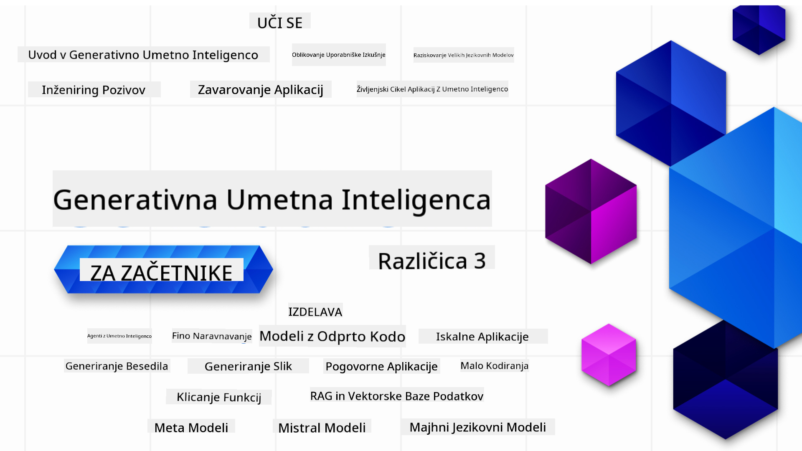

<!--
CO_OP_TRANSLATOR_METADATA:
{
  "original_hash": "c2ee25895ebbfa1a52868bb6eab686fc",
  "translation_date": "2025-05-19T12:07:20+00:00",
  "source_file": "README.md",
  "language_code": "sl"
}
-->

### 21 Lekcija, ki vas nauči vsega, kar morate vedeti, da začnete graditi aplikacije za generativno umetno inteligenco

### 🌐 Podpora za več jezikov

#### Podprto preko GitHub Action (Samodejno & Vedno Posodobljeno)
[Francosko](../fr/README.md) | [Špansko](../es/README.md) | [Nemško](../de/README.md) | [Rusko](../ru/README.md) | [Arabsko](../ar/README.md) | [Perzijsko (Farsi)](../fa/README.md) | [Urdujsko](../ur/README.md) | [Kitajsko (poenostavljeno)](../zh/README.md) | [Kitajsko (tradicionalno, Macao)](../mo/README.md) | [Kitajsko (tradicionalno, Hong Kong)](../hk/README.md) | [Kitajsko (tradicionalno, Tajvan)](../tw/README.md) | [Japonsko](../ja/README.md) | [Korejsko](../ko/README.md) | [Hindsko](../hi/README.md) | [Bengalsko](../bn/README.md) | [Maratsko](../mr/README.md) | [Nepalsko](../ne/README.md) | [Pandžabsko (Gurmukhi)](../pa/README.md) | [Portugalsko (Portugalska)](../pt/README.md) | [Portugalsko (Brazilija)](../br/README.md) | [Italijansko](../it/README.md) | [Poljsko](../pl/README.md) | [Turško](../tr/README.md) | [Grško](../el/README.md) | [Tajsko](../th/README.md) | [Švedsko](../sv/README.md) | [Dansko](../da/README.md) | [Norveško](../no/README.md) | [Finsko](../fi/README.md) | [Nizozemsko](../nl/README.md) | [Hebrejsko](../he/README.md) | [Vietnamsko](../vi/README.md) | [Indonezijsko](../id/README.md) | [Malezijsko](../ms/README.md) | [Tagaloško (Filipinsko)](../tl/README.md) | [Svahilsko](../sw/README.md) | [Madžarsko](../hu/README.md) | [Češko](../cs/README.md) | [Slovaško](../sk/README.md) | [Romunsko](../ro/README.md) | [Bolgarsko](../bg/README.md) | [Srbsko (cirilica)](../sr/README.md) | [Hrvaško](../hr/README.md) | [Slovensko](./README.md)
# Generativna umetna inteligenca za začetnike (Različica 3) - Tečaj

Naučite se osnov gradnje aplikacij generativne umetne inteligence z našim 21-lekcijskim celovitim tečajem, ki ga ponujajo zagovorniki oblaka Microsoft.

## 🌱 Začetek

Ta tečaj ima 21 lekcij. Vsaka lekcija pokriva svojo temo, zato začnite kjerkoli želite!

Lekcije so označene bodisi kot "Učenje", ki pojasnjujejo koncept generativne umetne inteligence, bodisi kot "Gradnja", ki pojasnjujejo koncept in primeri kode v **Pythonu** in **TypeScriptu**, kadar je to mogoče.

Za razvijalce .NET si oglejte [Generativna umetna inteligenca za začetnike (.NET izdaja)](https://github.com/microsoft/Generative-AI-for-beginners-dotnet?WT.mc_id=academic-105485-koreyst)!

Vsaka lekcija vključuje tudi razdelek "Nadaljujte z učenjem" z dodatnimi učnimi orodji.

## Kaj potrebujete
### Za izvajanje kode tega tečaja lahko uporabite:
 - [Azure OpenAI Service](https://aka.ms/genai-beginners/azure-open-ai?WT.mc_id=academic-105485-koreyst) - **Lekcije:** "aoai-assignment"
 - [GitHub Marketplace Model Catalog](https://aka.ms/genai-beginners/gh-models?WT.mc_id=academic-105485-koreyst) - **Lekcije:** "githubmodels"
 - [OpenAI API](https://aka.ms/genai-beginners/open-ai?WT.mc_id=academic-105485-koreyst) - **Lekcije:** "oai-assignment"

- Osnovno znanje Python ali TypeScript je koristno - \*Za popolne začetnike si oglejte te tečaje [Python](https://aka.ms/genai-beginners/python?WT.mc_id=academic-105485-koreyst) in [TypeScript](https://aka.ms/genai-beginners/typescript?WT.mc_id=academic-105485-koreyst)
- GitHub račun za [fork celotnega repozitorija](https://aka.ms/genai-beginners/github?WT.mc_id=academic-105485-koreyst) na vaš GitHub račun

Ustvarili smo lekcijo **[Nastavitev tečaja](./00-course-setup/README.md?WT.mc_id=academic-105485-koreyst)**, da vam pomagamo pri nastavitvi razvojnega okolja.

Ne pozabite [označiti (🌟) tega repozitorija](https://docs.github.com/en/get-started/exploring-projects-on-github/saving-repositories-with-stars?WT.mc_id=academic-105485-koreyst), da ga kasneje lažje najdete.

## 🧠 Pripravljeni na uvajanje?

Če iščete bolj napredne vzorce kode, si oglejte našo [zbirko vzorcev kode generativne umetne inteligence](https://aka.ms/genai-beg-code?WT.mc_id=academic-105485-koreyst) v **Pythonu** in **TypeScriptu**.

## 🗣️ Spoznajte druge učence, pridobite podporo

Pridružite se našemu [uradnemu Discord strežniku Azure AI Foundry](https://aka.ms/genai-discord?WT.mc_id=academic-105485-koreyst), da spoznate in se povežete z drugimi učenci, ki jemljejo ta tečaj, in pridobite podporo.

Postavljajte vprašanja ali delite povratne informacije o izdelku na našem [Azure AI Foundry Developer Forum](https://aka.ms/azureaifoundry/forum) na Githubu.

## 🚀 Gradite startup?

Prijavite se v [Microsoft za ustanovitelje startupov Founders Hub](https://aka.ms/genai-foundershub?WT.mc_id=academic-105485-koreyst) za prejem **brezplačnih kreditov OpenAI** in do **150k $ za Azure kredite za dostop do modelov OpenAI prek storitev Azure OpenAI**.

## 🙏 Želite pomagati?

Imate predloge ali ste našli napake pri črkovanju ali kodiranju? [Odprite težavo](https://github.com/microsoft/generative-ai-for-beginners/issues?WT.mc_id=academic-105485-koreyst) ali [ustvarite zahtevo za združitev](https://github.com/microsoft/generative-ai-for-beginners/pulls?WT.mc_id=academic-105485-koreyst)

## 📂 Vsaka lekcija vključuje:

- Kratek video uvod v temo
- Pisno lekcijo, ki se nahaja v README
- Vzorci kode v Pythonu in TypeScriptu, ki podpirajo Azure OpenAI in OpenAI API
- Povezave do dodatnih virov za nadaljevanje učenja

## 🗃️ Lekcije

| #   | **Povezava do lekcije**                                                                                                                        | **Opis**                                                                                         | **Video**                                                                   | **Dodatno učenje**                                                             |
| --- | ----------------------------------------------------------------------------------------------------------------------------------------------- | ------------------------------------------------------------------------------------------------ | --------------------------------------------------------------------------- | ------------------------------------------------------------------------------ |
| 00  | [Nastavitev tečaja](./00-course-setup/README.md?WT.mc_id=academic-105485-koreyst)                                                               | **Učenje:** Kako nastaviti vaše razvojno okolje                                                 | Video prihaja kmalu                                                         | [Naučite se več](https://aka.ms/genai-collection?WT.mc_id=academic-105485-koreyst) |
| 01  | [Uvod v generativno umetno inteligenco in LLM](./01-introduction-to-genai/README.md?WT.mc_id=academic-105485-koreyst)                           | **Učenje:** Razumevanje, kaj je generativna umetna inteligenca in kako delujejo veliki jezikovni modeli (LLM). | [Video](https://aka.ms/gen-ai-lesson-1-gh?WT.mc_id=academic-105485-koreyst) | [Naučite se več](https://aka.ms/genai-collection?WT.mc_id=academic-105485-koreyst) |
| 02  | [Raziskovanje in primerjava različnih LLM](./02-exploring-and-comparing-different-llms/README.md?WT.mc_id=academic-105485-koreyst)              | **Učenje:** Kako izbrati pravi model za vaš primer uporabe                                      | [Video](https://aka.ms/gen-ai-lesson2-gh?WT.mc_id=academic-105485-koreyst)  | [Naučite se več](https://aka.ms/genai-collection?WT.mc_id=academic-105485-koreyst) |
| 03  | [Uporaba generativne umetne inteligence odgovorno](./03-using-generative-ai-responsibly/README.md?WT.mc_id=academic-105485-koreyst)             | **Učenje:** Kako odgovorno graditi aplikacije generativne umetne inteligence                    | [Video](https://aka.ms/gen-ai-lesson3-gh?WT.mc_id=academic-105485-koreyst)  | [Naučite se več](https://aka.ms/genai-collection?WT.mc_id=academic-105485-koreyst) |
| 04  | [Razumevanje osnov inženiringa pozivov](./04-prompt-engineering-fundamentals/README.md?WT.mc_id=academic-105485-koreyst)                       | **Učenje:** Praktične najboljše prakse inženiringa pozivov                                      | [Video](https://aka.ms/gen-ai-lesson4-gh?WT.mc_id=academic-105485-koreyst)  | [Naučite se več](https://aka.ms/genai-collection?WT.mc_id=academic-105485-koreyst) |
| 05  | [Napredne tehnike za ustvarjanje pozivov](./05-advanced-prompts/README.md?WT.mc_id=academic-105485-koreyst)                                                | **Naučite se:** Kako uporabiti tehnike za izboljšanje rezultatov vaših pozivov. | [Video](https://aka.ms/gen-ai-lesson5-gh?WT.mc_id=academic-105485-koreyst)  | [Več informacij](https://aka.ms/genai-collection?WT.mc_id=academic-105485-koreyst) |
| 06  | [Izdelava aplikacij za generiranje besedila](./06-text-generation-apps/README.md?WT.mc_id=academic-105485-koreyst)                                | **Zgradite:** Aplikacijo za generiranje besedila z uporabo Azure OpenAI / OpenAI API                                | [Video](https://aka.ms/gen-ai-lesson6-gh?WT.mc_id=academic-105485-koreyst)  | [Več informacij](https://aka.ms/genai-collection?WT.mc_id=academic-105485-koreyst) |
| 07  | [Izdelava aplikacij za klepet](./07-building-chat-applications/README.md?WT.mc_id=academic-105485-koreyst)                                     | **Zgradite:** Tehnike za učinkovito izdelavo in integracijo aplikacij za klepet.               | [Video](https://aka.ms/gen-ai-lessons7-gh?WT.mc_id=academic-105485-koreyst) | [Več informacij](https://aka.ms/genai-collection?WT.mc_id=academic-105485-koreyst) |
| 08  | [Izdelava iskalnih aplikacij z vektorskimi bazami podatkov](./08-building-search-applications/README.md?WT.mc_id=academic-105485-koreyst)                        | **Zgradite:** Iskalno aplikacijo, ki uporablja vdelave za iskanje podatkov.                        | [Video](https://aka.ms/gen-ai-lesson8-gh?WT.mc_id=academic-105485-koreyst)  | [Več informacij](https://aka.ms/genai-collection?WT.mc_id=academic-105485-koreyst) |
| 09  | [Izdelava aplikacij za generiranje slik](./09-building-image-applications/README.md?WT.mc_id=academic-105485-koreyst)                        | **Zgradite:** Aplikacijo za generiranje slik                                                       | [Video](https://aka.ms/gen-ai-lesson9-gh?WT.mc_id=academic-105485-koreyst)  | [Več informacij](https://aka.ms/genai-collection?WT.mc_id=academic-105485-koreyst) |
| 10  | [Izdelava aplikacij AI z malo kode](./10-building-low-code-ai-applications/README.md?WT.mc_id=academic-105485-koreyst)                       | **Zgradite:** Generativno AI aplikacijo z uporabo orodij z malo kode                                     | [Video](https://aka.ms/gen-ai-lesson10-gh?WT.mc_id=academic-105485-koreyst) | [Več informacij](https://aka.ms/genai-collection?WT.mc_id=academic-105485-koreyst) |
| 11  | [Integracija zunanjih aplikacij z uporabo klicanja funkcij](./11-integrating-with-function-calling/README.md?WT.mc_id=academic-105485-koreyst) | **Zgradite:** Kaj je klicanje funkcij in njegove uporabe v aplikacijah                          | [Video](https://aka.ms/gen-ai-lesson11-gh?WT.mc_id=academic-105485-koreyst) | [Več informacij](https://aka.ms/genai-collection?WT.mc_id=academic-105485-koreyst) |
| 12  | [Oblikovanje uporabniške izkušnje za AI aplikacije](./12-designing-ux-for-ai-applications/README.md?WT.mc_id=academic-105485-koreyst)                         | **Naučite se:** Kako uporabiti načela oblikovanja uporabniške izkušnje pri razvoju generativnih AI aplikacij         | [Video](https://aka.ms/gen-ai-lesson12-gh?WT.mc_id=academic-105485-koreyst) | [Več informacij](https://aka.ms/genai-collection?WT.mc_id=academic-105485-koreyst) |
| 13  | [Zavarovanje vaših generativnih AI aplikacij](./13-securing-ai-applications/README.md?WT.mc_id=academic-105485-koreyst)                         | **Naučite se:** Grožnje in tveganja za AI sisteme ter metode za njihovo zavarovanje.             | [Video](https://aka.ms/gen-ai-lesson13-gh?WT.mc_id=academic-105485-koreyst) | [Več informacij](https://aka.ms/genai-collection?WT.mc_id=academic-105485-koreyst) |
| 14  | [Življenjski cikel generativne AI aplikacije](./14-the-generative-ai-application-lifecycle/README.md?WT.mc_id=academic-105485-koreyst)           | **Naučite se:** Orodja in metrike za upravljanje življenjskega cikla LLM in LLMOps                         | [Video](https://aka.ms/gen-ai-lesson14-gh?WT.mc_id=academic-105485-koreyst) | [Več informacij](https://aka.ms/genai-collection?WT.mc_id=academic-105485-koreyst) |
| 15  | [Pridobivanje z uporabo generacije (RAG) in vektorske baze podatkov](./15-rag-and-vector-databases/README.md?WT.mc_id=academic-105485-koreyst)        | **Izdelaj:** Aplikacijo z uporabo RAG okvira za pridobivanje vdelanih podatkov iz vektorske baze podatkov  | [Video](https://aka.ms/gen-ai-lesson15-gh?WT.mc_id=academic-105485-koreyst) | [Več informacij](https://aka.ms/genai-collection?WT.mc_id=academic-105485-koreyst) |
| 16  | [Modeli odprte kode in Hugging Face](./16-open-source-models/README.md?WT.mc_id=academic-105485-koreyst)                                    | **Izdelaj:** Aplikacijo z uporabo modelov odprte kode, ki so na voljo na Hugging Face                    | [Video](https://aka.ms/gen-ai-lesson16-gh?WT.mc_id=academic-105485-koreyst) | [Več informacij](https://aka.ms/genai-collection?WT.mc_id=academic-105485-koreyst) |
| 17  | [AI Agenti](./17-ai-agents/README.md?WT.mc_id=academic-105485-koreyst)                                                                       | **Izdelaj:** Aplikacijo z uporabo AI Agent okvira                                           | [Video](https://aka.ms/gen-ai-lesson17-gh?WT.mc_id=academic-105485-koreyst) | [Več informacij](https://aka.ms/genai-collection?WT.mc_id=academic-105485-koreyst) |
| 18  | [Fine-Tuning LLMs](./18-fine-tuning/README.md?WT.mc_id=academic-105485-koreyst)                                                              | **Nauči se:** Kaj, zakaj in kako prilagoditi LLMs                                            | [Video](https://aka.ms/gen-ai-lesson18-gh?WT.mc_id=academic-105485-koreyst) | [Več informacij](https://aka.ms/genai-collection?WT.mc_id=academic-105485-koreyst) |
| 19  | [Gradnja z SLMs](./19-slm/README.md?WT.mc_id=academic-105485-koreyst)                                                              | **Nauči se:** Prednosti gradnje z majhnimi jezikovnimi modeli                                            | Video kmalu | [Več informacij](https://aka.ms/genai-collection?WT.mc_id=academic-105485-koreyst) |
| 20  | [Gradnja z Mistral modeli](./20-mistral/README.md?WT.mc_id=academic-105485-koreyst)                                                              | **Nauči se:** Značilnosti in razlike družine Mistral modelov                                           | Video kmalu | [Več informacij](https://aka.ms/genai-collection?WT.mc_id=academic-105485-koreyst) |
| 21  | [Gradnja z Meta modeli](./21-meta/README.md?WT.mc_id=academic-105485-koreyst)                                                              | **Nauči se:** Značilnosti in razlike družine Meta modelov                                           | Video kmalu | [Več informacij](https://aka.ms/genai-collection?WT.mc_id=academic-105485-koreyst) |

### 🌟 Posebna zahvala

Posebna zahvala [**Johnu Azizu**](https://www.linkedin.com/in/john0isaac/) za ustvarjanje vseh GitHub Actions in delovnih tokov

[**Bernhardu Merkleju**](https://www.linkedin.com/in/bernhard-merkle-738b73/) za pomembne prispevke k vsaki lekciji za izboljšanje izkušnje učencev in kode.

## 🎒 Drugi tečaji

Naša ekipa proizvaja tudi druge tečaje! Oglejte si:

- [**NOVO** AI Agenti za začetnike](https://github.com/microsoft/ai-agents-for-beginners?WT.mc_id=academic-105485-koreyst)
- [**NOVO** Generativna AI za začetnike z uporabo .NET](https://github.com/microsoft/Generative-AI-for-beginners-dotnet?WT.mc_id=academic-105485-koreyst)
- [**NOVO** Generativna AI za začetnike z uporabo JavaScript](https://aka.ms/genai-js-course?WT.mc_id=academic-105485-koreyst)
- [ML za začetnike](https://aka.ms/ml-beginners?WT.mc_id=academic-105485-koreyst)
- [Podatkovna znanost za začetnike](https://aka.ms/datascience-beginners?WT.mc_id=academic-105485-koreyst)
- [AI za začetnike](https://aka.ms/ai-beginners?WT.mc_id=academic-105485-koreyst)
- [Kibernetska varnost za začetnike](https://github.com/microsoft/Security-101??WT.mc_id=academic-96948-sayoung)
- [Spletni razvoj za začetnike](https://aka.ms/webdev-beginners?WT.mc_id=academic-105485-koreyst)
- [IoT za začetnike](https://aka.ms/iot-beginners?WT.mc_id=academic-105485-koreyst)
- [XR razvoj za začetnike](https://github.com/microsoft/xr-development-for-beginners?WT.mc_id=academic-105485-koreyst)
- [GitHub Copilot සමඟ AI යුගල මෘදුකාංග සංවර්ධනයේ පාරංගතය](https://aka.ms/GitHubCopilotAI?WT.mc_id=academic-105485-koreyst)
- [C#/.NET සංවර්ධකයින් සඳහා GitHub Copilot පාරංගතය](https://github.com/microsoft/mastering-github-copilot-for-dotnet-csharp-developers?WT.mc_id=academic-105485-koreyst)
- [ඔබේම Copilot ඇඩ්වෙන්චර් තෝරන්න](https://github.com/microsoft/CopilotAdventures?WT.mc_id=academic-105485-koreyst)

**Omejitev odgovornosti**: 
Ta dokument je bil preveden z uporabo storitve AI prevajanja [Co-op Translator](https://github.com/Azure/co-op-translator). Čeprav si prizadevamo za natančnost, vas prosimo, da upoštevate, da avtomatski prevodi lahko vsebujejo napake ali netočnosti. Izvirni dokument v njegovem maternem jeziku je treba obravnavati kot avtoritativni vir. Za kritične informacije je priporočljiv profesionalni človeški prevod. Ne odgovarjamo za morebitna nesporazume ali napačne interpretacije, ki izhajajo iz uporabe tega prevoda.