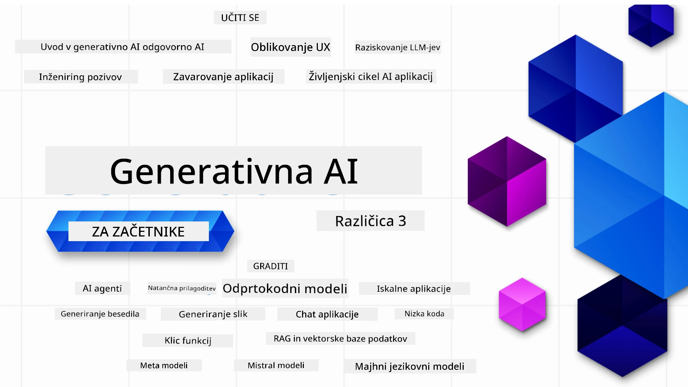

### 21 lekcij, ki vas naučijo vse, kar morate vedeti, da začnete graditi aplikacije Generativne AI

[](https://github.com/microsoft/Generative-AI-For-Beginners/blob/master/LICENSE?WT.mc_id=academic-105485-koreyst)
[](https://GitHub.com/microsoft/Generative-AI-For-Beginners/graphs/contributors/?WT.mc_id=academic-105485-koreyst)
[](https://GitHub.com/microsoft/Generative-AI-For-Beginners/issues/?WT.mc_id=academic-105485-koreyst)
[](https://GitHub.com/microsoft/Generative-AI-For-Beginners/pulls/?WT.mc_id=academic-105485-koreyst)
[](http://makeapullrequest.com?WT.mc_id=academic-105485-koreyst)

[](https://GitHub.com/microsoft/Generative-AI-For-Beginners/watchers/?WT.mc_id=academic-105485-koreyst)
[](https://GitHub.com/microsoft/Generative-AI-For-Beginners/network/?WT.mc_id=academic-105485-koreyst)
[](https://GitHub.com/microsoft/Generative-AI-For-Beginners/stargazers/?WT.mc_id=academic-105485-koreyst)

[](https://discord.gg/nTYy5BXMWG)

### 🌐 Podpora več jezikom

#### Podprto prek GitHub Action (avtomatizirano in vedno posodobljeno)

<!-- CO-OP TRANSLATOR LANGUAGES TABLE START -->
[Arabščina](../ar/README.md) | [Bengalščina](../bn/README.md) | [Bolgarščina](../bg/README.md) | [Burmanski (Mjanmar)](../my/README.md) | [Kitajščina (poenostavljena)](../zh-CN/README.md) | [Kitajščina (tradicionalna, Hong Kong)](../zh-HK/README.md) | [Kitajščina (tradicionalna, Macau)](../zh-MO/README.md) | [Kitajščina (tradicionalna, Tajvan)](../zh-TW/README.md) | [Hrvaščina](../hr/README.md) | [Češčina](../cs/README.md) | [Danščina](../da/README.md) | [Nizozemščina](../nl/README.md) | [Estonščina](../et/README.md) | [Finščina](../fi/README.md) | [Francoščina](../fr/README.md) | [Nemščina](../de/README.md) | [Grščina](../el/README.md) | [Hebrejščina](../he/README.md) | [Hindujščina](../hi/README.md) | [Madžarščina](../hu/README.md) | [Indonezijščina](../id/README.md) | [Italijanščina](../it/README.md) | [Japonščina](../ja/README.md) | [Kannada](../kn/README.md) | [Khmer](../km/README.md) | [Korejščina](../ko/README.md) | [Litovščina](../lt/README.md) | [Malezijščina](../ms/README.md) | [Malayalam](../ml/README.md) | [Maratščina](../mr/README.md) | [Nepalščina](../ne/README.md) | [Nigerijski pidgin](../pcm/README.md) | [Norveščina](../no/README.md) | [Perzijščina (Farsi)](../fa/README.md) | [Poljščina](../pl/README.md) | [Portugalski (Brazilija)](../pt-BR/README.md) | [Portugalski (Portugalska)](../pt-PT/README.md) | [Pandžabščina (Gurmukhi)](../pa/README.md) | [Romunščina](../ro/README.md) | [Ruščina](../ru/README.md) | [Srbščina (cirilica)](../sr/README.md) | [Slovaščina](../sk/README.md) | [Slovenščina](./README.md) | [Španščina](../es/README.md) | [Svahili](../sw/README.md) | [Švedščina](../sv/README.md) | [Tagalog (Filipinski)](../tl/README.md) | [Tamilščina](../ta/README.md) | [Telugu](../te/README.md) | [Tajščina](../th/README.md) | [Turščina](../tr/README.md) | [Ukrajinščina](../uk/README.md) | [Urdu](../ur/README.md) | [Vietnamščina](../vi/README.md)

> **Raje klonirate lokalno?**
>
> Ta repozitorij vključuje več kot 50 jezikovnih prevodov, kar znatno poveča velikost prenosa. Če želite klonirati brez prevodov, uporabite sparse checkout:
>
> **Bash / macOS / Linux:**
> ```bash
> git clone --filter=blob:none --sparse https://github.com/microsoft/generative-ai-for-beginners.git
> cd generative-ai-for-beginners
> git sparse-checkout set --no-cone '/*' '!translations' '!translated_images'
> ```
>
> **CMD (Windows):**
> ```cmd
> git clone --filter=blob:none --sparse https://github.com/microsoft/generative-ai-for-beginners.git
> cd generative-ai-for-beginners
> git sparse-checkout set --no-cone "/*" "!translations" "!translated_images"
> ```
>
> Tako dobite vse, kar potrebujete za dokončanje tečaja z veliko hitrejšim prenosom.
<!-- CO-OP TRANSLATOR LANGUAGES TABLE END -->

# Generativna AI za začetnike (3. izdaja) - Tečaj

Naučite se osnov gradnje aplikacij Generativne AI z našim celovitim 21-lekcijskim tečajem, ki ga pripravijo Microsoft Cloud Advocates.

## 🌱 Začetek

Tečaj ima 21 lekcij. Vsaka lekcija pokriva svojo temo, zato začnite kjer koli želite!

Lekcije so označene bodisi kot "Učenje", ki razlagajo koncept Generativne AI, ali kot "Gradnja", ki razložijo koncept in vključujejo primere kode v obeh jezikih **Python** in **TypeScript**, kjer je mogoče.

Za razvijalce .NET si oglejte [Generativna AI za začetnike (.NET izdaja)](https://github.com/microsoft/Generative-AI-for-beginners-dotnet?WT.mc_id=academic-105485-koreyst)!

Vsaka lekcija vključuje tudi odsek "Nadaljujte z učenjem" z dodatnimi učnimi orodji.

## Kaj potrebujete
### Za zagon kode iz tega tečaja lahko uporabite:
 - [Azure OpenAI Service](https://aka.ms/genai-beginners/azure-open-ai?WT.mc_id=academic-105485-koreyst) - **Lekcije:** "aoai-assignment"
 - [Katalog modelov na GitHub Marketplace](https://aka.ms/genai-beginners/gh-models?WT.mc_id=academic-105485-koreyst) - **Lekcije:** "githubmodels"
 - [OpenAI API](https://aka.ms/genai-beginners/open-ai?WT.mc_id=academic-105485-koreyst) - **Lekcije:** "oai-assignment"
   
- Osnovno znanje Pythona ali TypeScripta je koristno - \*Za popolne začetnike si oglejte tečaje [Python](https://aka.ms/genai-beginners/python?WT.mc_id=academic-105485-koreyst) in [TypeScript](https://aka.ms/genai-beginners/typescript?WT.mc_id=academic-105485-koreyst)
- GitHub račun, da lahko [forkate celoten repozitorij](https://aka.ms/genai-beginners/github?WT.mc_id=academic-105485-koreyst) na vaš osebni račun

Ustvarili smo lekcijo **[Nastavitev tečaja](./00-course-setup/README.md?WT.mc_id=academic-105485-koreyst)**, ki vam pomaga z namestitvijo razvojnega okolja.

Ne pozabite [ozvezdčiti (🌟) tega repozitorija](https://docs.github.com/en/get-started/exploring-projects-on-github/saving-repositories-with-stars?WT.mc_id=academic-105485-koreyst), da ga boste lažje našli kasneje.

## 🧠 Pripravljeni za implementacijo?

Če iščete bolj napredne primere kode, si oglejte našo [zbirko primerov kode Generativne AI](https://aka.ms/genai-beg-code?WT.mc_id=academic-105485-koreyst) v obeh jezikih **Python** in **TypeScript**.

## 🗣️ Spoznajte druge udeležence, pridobite podporo

Pridružite se našemu [uradnemu strežniku Azure AI Foundry na Discordu](https://aka.ms/genai-discord?WT.mc_id=academic-105485-koreyst), da spoznate in navežete stike z drugimi, ki obiskujejo ta tečaj, ter dobite podporo.

Vprašanja ali povratne informacije o izdelku delite v našem [Azure AI Foundry Developer Forumu](https://aka.ms/azureaifoundry/forum) na GitHubu.

## 🚀 Gradite startup?

Obiščite [Microsoft for Startups](https://www.microsoft.com/startups), da izveste, kako začeti z gradnjo že danes s krediti Azure.

## 🙏 Želite pomagati?

Imate predloge ali ste našli pravopisne ali kodne napake? [Odprite zadevo](https://github.com/microsoft/generative-ai-for-beginners/issues?WT.mc_id=academic-105485-koreyst) ali [Ustvarite pull request](https://github.com/microsoft/generative-ai-for-beginners/pulls?WT.mc_id=academic-105485-koreyst)

## 📂 Vsaka lekcija vključuje:

- Kratek video uvod v temo
- Pisno lekcijo, ki je na voljo v README
- Primere kode v Pythonu in TypeScriptu, ki podpirajo Azure OpenAI in OpenAI API
- Povezave do dodatnih virov za nadaljnje učenje

## 🗃️ Lekcije

| #   | **Povezava do lekcije**                                                                                                                      | **Opis**                                                                                            | **Video**                                                                 | **Dodatno učenje**                                                           |
| --- | -------------------------------------------------------------------------------------------------------------------------------------------- | ------------------------------------------------------------------------------------------------- | ------------------------------------------------------------------------- | ----------------------------------------------------------------------------- |
| 00  | [Nastavitev tečaja](./00-course-setup/README.md?WT.mc_id=academic-105485-koreyst)                                                            | **Učenje:** Kako nastaviti razvojno okolje                                                        | Video prihaja kmalu                                                        | [Nauči se več](https://aka.ms/genai-collection?WT.mc_id=academic-105485-koreyst) |
| 01  | [Uvod v Generativno AI in velike jezikovne modele (LLM)](./01-introduction-to-genai/README.md?WT.mc_id=academic-105485-koreyst)                | **Učenje:** Razumevanje, kaj je Generativna AI in kako delujejo veliki jezikovni modeli (LLM).    | [Video](https://aka.ms/gen-ai-lesson-1-gh?WT.mc_id=academic-105485-koreyst) | [Nauči se več](https://aka.ms/genai-collection?WT.mc_id=academic-105485-koreyst) |
| 02  | [Raziščite in primerjajte različne velike jezikovne modele](./02-exploring-and-comparing-different-llms/README.md?WT.mc_id=academic-105485-koreyst) | **Učenje:** Kako izbrati pravi model za vaš primer uporabe                                       | [Video](https://aka.ms/gen-ai-lesson2-gh?WT.mc_id=academic-105485-koreyst) | [Nauči se več](https://aka.ms/genai-collection?WT.mc_id=academic-105485-koreyst) |
| 03  | [Uporaba Generativne AI odgovorno](./03-using-generative-ai-responsibly/README.md?WT.mc_id=academic-105485-koreyst)                          | **Učenje:** Kako graditi aplikacije Generativne AI odgovorno                                     | [Video](https://aka.ms/gen-ai-lesson3-gh?WT.mc_id=academic-105485-koreyst) | [Nauči se več](https://aka.ms/genai-collection?WT.mc_id=academic-105485-koreyst) |
| 04  | [Razumevanje osnov inženiringa pozivov](./04-prompt-engineering-fundamentals/README.md?WT.mc_id=academic-105485-koreyst)             | **Nauči se:** Praktične najboljše prakse inženiringa pozivov                                           | [Video](https://aka.ms/gen-ai-lesson4-gh?WT.mc_id=academic-105485-koreyst)  | [Izvedi več](https://aka.ms/genai-collection?WT.mc_id=academic-105485-koreyst) |
| 05  | [Ustvarjanje naprednih pozivov](./05-advanced-prompts/README.md?WT.mc_id=academic-105485-koreyst)                                                | **Nauči se:** Kako uporabiti tehnike inženiringa pozivov, ki izboljšajo rezultate vaših pozivov. | [Video](https://aka.ms/gen-ai-lesson5-gh?WT.mc_id=academic-105485-koreyst)  | [Izvedi več](https://aka.ms/genai-collection?WT.mc_id=academic-105485-koreyst) |
| 06  | [Gradnja aplikacij za generiranje besedil](./06-text-generation-apps/README.md?WT.mc_id=academic-105485-koreyst)                                | **Ustvari:** Aplikacijo za generiranje besedil z uporabo Azure OpenAI / OpenAI API                                | [Video](https://aka.ms/gen-ai-lesson6-gh?WT.mc_id=academic-105485-koreyst)  | [Izvedi več](https://aka.ms/genai-collection?WT.mc_id=academic-105485-koreyst) |
| 07  | [Gradnja klepetalnih aplikacij](./07-building-chat-applications/README.md?WT.mc_id=academic-105485-koreyst)                                     | **Ustvari:** Tehnike za učinkovito gradnjo in integracijo klepetalnih aplikacij.               | [Video](https://aka.ms/gen-ai-lessons7-gh?WT.mc_id=academic-105485-koreyst) | [Izvedi več](https://aka.ms/genai-collection?WT.mc_id=academic-105485-koreyst) |
| 08  | [Gradnja iskalnih aplikacij z vektorskimi podatkovnimi bazami](./08-building-search-applications/README.md?WT.mc_id=academic-105485-koreyst)                        | **Ustvari:** Iskalno aplikacijo, ki uporablja vdelave (Embeddings) za iskanje podatkov.                        | [Video](https://aka.ms/gen-ai-lesson8-gh?WT.mc_id=academic-105485-koreyst)  | [Izvedi več](https://aka.ms/genai-collection?WT.mc_id=academic-105485-koreyst) |
| 09  | [Gradnja aplikacij za generiranje slik](./09-building-image-applications/README.md?WT.mc_id=academic-105485-koreyst)                        | **Ustvari:** Aplikacijo za generiranje slik                                                       | [Video](https://aka.ms/gen-ai-lesson9-gh?WT.mc_id=academic-105485-koreyst)  | [Izvedi več](https://aka.ms/genai-collection?WT.mc_id=academic-105485-koreyst) |
| 10  | [Gradnja nizko kodnih AI aplikacij](./10-building-low-code-ai-applications/README.md?WT.mc_id=academic-105485-koreyst)                       | **Ustvari:** Aplikacijo generativne umetne inteligence z orodji nizke kode                                     | [Video](https://aka.ms/gen-ai-lesson10-gh?WT.mc_id=academic-105485-koreyst) | [Izvedi več](https://aka.ms/genai-collection?WT.mc_id=academic-105485-koreyst) |
| 11  | [Integracija zunanjih aplikacij s funkcijskim klicem](./11-integrating-with-function-calling/README.md?WT.mc_id=academic-105485-koreyst) | **Ustvari:** Kaj je funkcijski klic in kako se uporablja v aplikacijah                          | [Video](https://aka.ms/gen-ai-lesson11-gh?WT.mc_id=academic-105485-koreyst) | [Izvedi več](https://aka.ms/genai-collection?WT.mc_id=academic-105485-koreyst) |
| 12  | [Oblikovanje UX za AI aplikacije](./12-designing-ux-for-ai-applications/README.md?WT.mc_id=academic-105485-koreyst)                         | **Nauči se:** Kako uporabiti načela oblikovanja UX pri razvoju aplikacij generativne umetne inteligence         | [Video](https://aka.ms/gen-ai-lesson12-gh?WT.mc_id=academic-105485-koreyst) | [Izvedi več](https://aka.ms/genai-collection?WT.mc_id=academic-105485-koreyst) |
| 13  | [Varnost vaših generativnih AI aplikacij](./13-securing-ai-applications/README.md?WT.mc_id=academic-105485-koreyst)                         | **Nauči se:** Grožnje in tveganja za AI sisteme ter načine za zaščito teh sistemov.             | [Video](https://aka.ms/gen-ai-lesson13-gh?WT.mc_id=academic-105485-koreyst) | [Izvedi več](https://aka.ms/genai-collection?WT.mc_id=academic-105485-koreyst) |
| 14  | [Življenjski cikel generativne AI aplikacije](./14-the-generative-ai-application-lifecycle/README.md?WT.mc_id=academic-105485-koreyst)           | **Nauči se:** Orodja in metrike za upravljanje življenjskega cikla velikih jezikovnih modelov (LLM) in LLMOps                         | [Video](https://aka.ms/gen-ai-lesson14-gh?WT.mc_id=academic-105485-koreyst) | [Izvedi več](https://aka.ms/genai-collection?WT.mc_id=academic-105485-koreyst) |
| 15  | [Povečano generiranje z iskanjem (RAG) in vektorske baze podatkov](./15-rag-and-vector-databases/README.md?WT.mc_id=academic-105485-koreyst)        | **Ustvari:** Aplikacijo z uporabo RAG okvira za iskanje vdelav iz vektorskih baz podatkov  | [Video](https://aka.ms/gen-ai-lesson15-gh?WT.mc_id=academic-105485-koreyst) | [Izvedi več](https://aka.ms/genai-collection?WT.mc_id=academic-105485-koreyst) |
| 16  | [Modeli z odprto kodo in Hugging Face](./16-open-source-models/README.md?WT.mc_id=academic-105485-koreyst)                                    | **Ustvari:** Aplikacijo z uporabo modelov odprte kode, ki so na voljo na Hugging Face                    | [Video](https://aka.ms/gen-ai-lesson16-gh?WT.mc_id=academic-105485-koreyst) | [Izvedi več](https://aka.ms/genai-collection?WT.mc_id=academic-105485-koreyst) |
| 17  | [AI agenti](./17-ai-agents/README.md?WT.mc_id=academic-105485-koreyst)                                                                       | **Ustvari:** Aplikacijo z uporabo okvira AI agentov                                           | [Video](https://aka.ms/gen-ai-lesson17-gh?WT.mc_id=academic-105485-koreyst) | [Izvedi več](https://aka.ms/genai-collection?WT.mc_id=academic-105485-koreyst) |
| 18  | [Fino nastavljanje LLM](./18-fine-tuning/README.md?WT.mc_id=academic-105485-koreyst)                                                              | **Nauči se:** Kaj, zakaj in kako nastavljati velike jezikovne modele                                            | [Video](https://aka.ms/gen-ai-lesson18-gh?WT.mc_id=academic-105485-koreyst) | [Izvedi več](https://aka.ms/genai-collection?WT.mc_id=academic-105485-koreyst) |
| 19  | [Gradnja z malimi jezikovnimi modeli (SLM)](./19-slm/README.md?WT.mc_id=academic-105485-koreyst)                                                              | **Nauči se:** Prednosti gradnje z malimi jezikovnimi modeli                                            | Video prihaja kmalu | [Izvedi več](https://aka.ms/genai-collection?WT.mc_id=academic-105485-koreyst) |
| 20  | [Gradnja z modeli Mistral](./20-mistral/README.md?WT.mc_id=academic-105485-koreyst)                                                              | **Nauči se:** Značilnosti in razlike modelov družine Mistral                                           | Video prihaja kmalu | [Izvedi več](https://aka.ms/genai-collection?WT.mc_id=academic-105485-koreyst) |
| 21  | [Gradnja z modeli Meta](./21-meta/README.md?WT.mc_id=academic-105485-koreyst)                                                              | **Nauči se:** Značilnosti in razlike modelov družine Meta                                           | Video prihaja kmalu | [Izvedi več](https://aka.ms/genai-collection?WT.mc_id=academic-105485-koreyst) |

### 🌟 Posebna zahvala

Posebna zahvala [**Johnu Azizu**](https://www.linkedin.com/in/john0isaac/) za ustvarjanje vseh GitHub akcij in potekov dela

[**Bernhardu Merkleju**](https://www.linkedin.com/in/bernhard-merkle-738b73/) za ključne prispevke k vsaki lekciji za izboljšanje izkušnje učenca in kode.

## 🎒 Drugi tečaji

Naša ekipa ustvarja tudi druge tečaje! Oglej si:

<!-- CO-OP TRANSLATOR OTHER COURSES START -->
### LangChain
[](https://aka.ms/langchain4j-for-beginners)
[](https://aka.ms/langchainjs-for-beginners?WT.mc_id=m365-94501-dwahlin)
[](https://github.com/microsoft/langchain-for-beginners?WT.mc_id=m365-94501-dwahlin)
---

### Azure / Edge / MCP / Agenti
[](https://github.com/microsoft/AZD-for-beginners?WT.mc_id=academic-105485-koreyst)
[](https://github.com/microsoft/edgeai-for-beginners?WT.mc_id=academic-105485-koreyst)
[](https://github.com/microsoft/mcp-for-beginners?WT.mc_id=academic-105485-koreyst)
[](https://github.com/microsoft/ai-agents-for-beginners?WT.mc_id=academic-105485-koreyst)

---
 
### Serija generativne umetne inteligence
[](https://github.com/microsoft/generative-ai-for-beginners?WT.mc_id=academic-105485-koreyst)
[-9333EA?style=for-the-badge&labelColor=E5E7EB&color=9333EA)](https://github.com/microsoft/Generative-AI-for-beginners-dotnet?WT.mc_id=academic-105485-koreyst)
[-C084FC?style=for-the-badge&labelColor=E5E7EB&color=C084FC)](https://github.com/microsoft/generative-ai-for-beginners-java?WT.mc_id=academic-105485-koreyst)
[-E879F9?style=for-the-badge&labelColor=E5E7EB&color=E879F9)](https://github.com/microsoft/generative-ai-with-javascript?WT.mc_id=academic-105485-koreyst)

---
 
### Osnove učenja
[](https://aka.ms/ml-beginners?WT.mc_id=academic-105485-koreyst)
[](https://aka.ms/datascience-beginners?WT.mc_id=academic-105485-koreyst)
[](https://aka.ms/ai-beginners?WT.mc_id=academic-105485-koreyst)
[](https://github.com/microsoft/Security-101?WT.mc_id=academic-96948-sayoung)
[](https://aka.ms/webdev-beginners?WT.mc_id=academic-105485-koreyst)
[](https://aka.ms/iot-beginners?WT.mc_id=academic-105485-koreyst)
[](https://github.com/microsoft/xr-development-for-beginners?WT.mc_id=academic-105485-koreyst)

---
 
### Serija Copilot
[](https://aka.ms/GitHubCopilotAI?WT.mc_id=academic-105485-koreyst)
[](https://github.com/microsoft/mastering-github-copilot-for-dotnet-csharp-developers?WT.mc_id=academic-105485-koreyst)
[](https://github.com/microsoft/CopilotAdventures?WT.mc_id=academic-105485-koreyst)
<!-- CO-OP TRANSLATOR OTHER COURSES END -->

## Pridobivanje pomoči

Če naletite na težave ali imate kakršnakoli vprašanja o ustvarjanju AI aplikacij. Pridružite se skupnosti udeležencev in izkušenih razvijalcev v razpravah o MCP. To je podporna skupnost, kjer so vprašanja dobrodošla in znanje se prosto deli.

[](https://discord.gg/nTYy5BXMWG)

Če imate povratne informacije o izdelku ali napake med ustvarjanjem, obiščite:

[](https://aka.ms/foundry/forum)

---

<!-- CO-OP TRANSLATOR DISCLAIMER START -->
**Omejitev odgovornosti**:  
Ta dokument je bil preveden z uporabo AI prevajalske storitve [Co-op Translator](https://github.com/Azure/co-op-translator). Čeprav si prizadevamo za točnost, vas prosimo, da upoštevate, da avtomatizirani prevodi lahko vsebujejo napake ali netočnosti. Izvirni dokument v izvirnem jeziku velja za avtoritativni vir. Za ključne informacije priporočamo strokovni človeški prevod. Nismo odgovorni za morebitne nesporazume ali napačne interpretacije, ki izhajajo iz uporabe tega prevoda.
<!-- CO-OP TRANSLATOR DISCLAIMER END -->