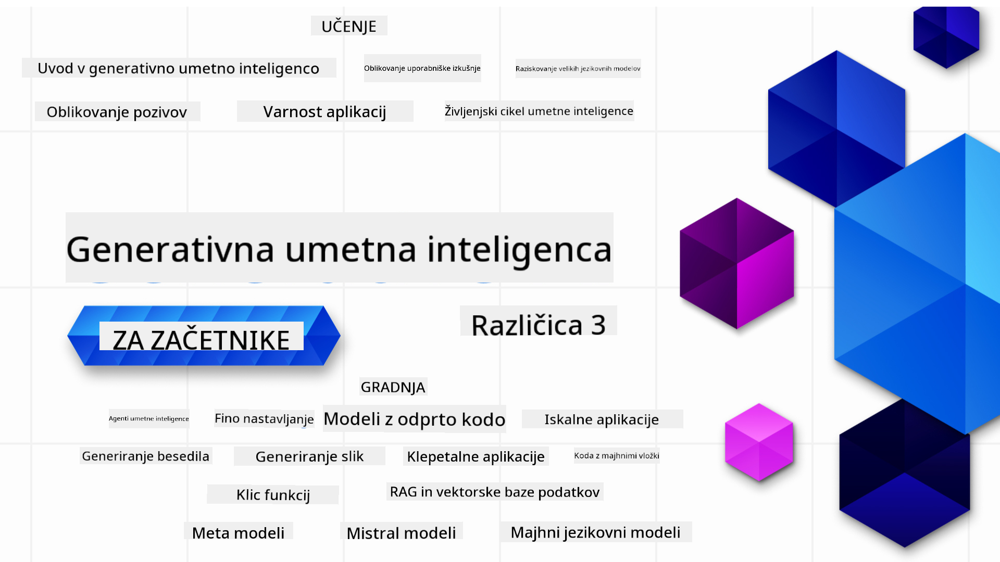

<!--
CO_OP_TRANSLATOR_METADATA:
{
  "original_hash": "6e3f4c8a4f323b8eab1cf11ded304b0f",
  "translation_date": "2025-06-25T08:19:47+00:00",
  "source_file": "README.md",
  "language_code": "sl"
}
-->

### 21 lekcija, ki vas naučijo vsega, kar morate vedeti, da začnete graditi aplikacije generativne umetne inteligence

### 🌐 Podpora za več jezikov

#### Podprto prek GitHub Action (Avtomatizirano in vedno posodobljeno)

# Generativna AI za začetnike (Verzija 3) - Tečaj

Naučite se osnov gradnje aplikacij generativne AI z našim obsežnim tečajem, ki vsebuje 21 lekcij, ki ga ponujajo zagovorniki Microsoft Cloud.

## 🌱 Začetek

Ta tečaj ima 21 lekcij. Vsaka lekcija pokriva svojo temo, zato začnite, kjer želite!

Lekcije so označene kot "Learn" lekcije, ki razlagajo koncept generativne AI, ali "Build" lekcije, ki razlagajo koncept in kodne primere v **Pythonu** in **TypeScriptu**, kadar je to mogoče.

Za .NET razvijalce preverite [Generativna AI za začetnike (.NET izdaja)](https://github.com/microsoft/Generative-AI-for-beginners-dotnet?WT.mc_id=academic-105485-koreyst)!

Vsaka lekcija vključuje tudi razdelek "Keep Learning" z dodatnimi učnimi orodji.

## Kaj potrebujete
### Za izvajanje kode tega tečaja lahko uporabite:
- [Azure OpenAI Service](https://aka.ms/genai-beginners/azure-open-ai?WT.mc_id=academic-105485-koreyst) - **Lekcije:** "aoai-assignment"
- [GitHub Marketplace Model Catalog](https://aka.ms/genai-beginners/gh-models?WT.mc_id=academic-105485-koreyst) - **Lekcije:** "githubmodels"
- [OpenAI API](https://aka.ms/genai-beginners/open-ai?WT.mc_id=academic-105485-koreyst) - **Lekcije:** "oai-assignment"

- Osnovno znanje Pythona ali TypeScripta je koristno - \*Za popolne začetnike preverite te tečaje [Python](https://aka.ms/genai-beginners/python?WT.mc_id=academic-105485-koreyst) in [TypeScript](https://aka.ms/genai-beginners/typescript?WT.mc_id=academic-105485-koreyst)
- GitHub račun za [fork celotnega repozitorija](https://aka.ms/genai-beginners/github?WT.mc_id=academic-105485-koreyst) na svoj GitHub račun

Ustvarili smo lekcijo **[Course Setup](./00-course-setup/README.md?WT.mc_id=academic-105485-koreyst)**, ki vam pomaga pri nastavitvi vašega razvojnega okolja.

Ne pozabite [dati zvezdico (🌟) temu repozitoriju](https://docs.github.com/en/get-started/exploring-projects-on-github/saving-repositories-with-stars?WT.mc_id=academic-105485-koreyst), da ga boste kasneje lažje našli.

## 🧠 Pripravljeni na namestitev?

Če iščete bolj napredne kodne primere, si oglejte našo [zbirko kodnih primerov generativne AI](https://aka.ms/genai-beg-code?WT.mc_id=academic-105485-koreyst) v **Pythonu** in **TypeScriptu**.

## 🗣️ Spoznajte druge učence, pridobite podporo

Pridružite se našemu [uradnemu Discord strežniku Azure AI Foundry](https://aka.ms/genai-discord?WT.mc_id=academic-105485-koreyst) za spoznavanje in povezovanje z drugimi učenci tega tečaja ter pridobivanje podpore.

Postavite vprašanja ali delite povratne informacije o izdelku v našem [Azure AI Foundry Developer Forum](https://aka.ms/azureaifoundry/forum) na Githubu.

## 🚀 Gradite startup?

Prijavite se na [Microsoft for Startups Founders Hub](https://aka.ms/genai-foundershub?WT.mc_id=academic-105485-koreyst), da prejmete **brezplačne OpenAI kredite** in do **$150k za Azure kredite za dostop do OpenAI modelov prek Azure OpenAI storitev**.

## 🙏 Želite pomagati?

Imate predloge ali ste našli napake v črkovanju ali kodi? [Odprite težavo](https://github.com/microsoft/generative-ai-for-beginners/issues?WT.mc_id=academic-105485-koreyst) ali [ustvarite pull request](https://github.com/microsoft/generative-ai-for-beginners/pulls?WT.mc_id=academic-105485-koreyst)

## 📂 Vsaka lekcija vključuje:

- Kratek video uvod v temo
- Pisno lekcijo v README
- Kodne primere v Pythonu in TypeScriptu, ki podpirajo Azure OpenAI in OpenAI API
- Povezave do dodatnih virov za nadaljevanje učenja

## 🗃️ Lekcije

| #   | **Povezava do lekcije**                                                                                                                      | **Opis**                                                                                        | **Video**                                                                   | **Dodatno učenje**                                                             |
| --- | -------------------------------------------------------------------------------------------------------------------------------------------- | ----------------------------------------------------------------------------------------------- | --------------------------------------------------------------------------- | ------------------------------------------------------------------------------ |
| 00  | [Course Setup](./00-course-setup/README.md?WT.mc_id=academic-105485-koreyst)                                                                 | **Learn:** Kako nastaviti vaše razvojno okolje                                                  | Video Coming Soon                                                                 | [Learn More](https://aka.ms/genai-collection?WT.mc_id=academic-105485-koreyst) |
| 01  | [Introduction to Generative AI and LLMs](./01-introduction-to-genai/README.md?WT.mc_id=academic-105485-koreyst)                              | **Learn:** Razumevanje, kaj je generativna AI in kako delujejo veliki jezikovni modeli (LLM).   | [Video](https://aka.ms/gen-ai-lesson-1-gh?WT.mc_id=academic-105485-koreyst) | [Learn More](https://aka.ms/genai-collection?WT.mc_id=academic-105485-koreyst) |
| 02  | [Exploring and comparing different LLMs](./02-exploring-and-comparing-different-llms/README.md?WT.mc_id=academic-105485-koreyst)             | **Learn:** Kako izbrati pravi model za vaš primer uporabe                                       | [Video](https://aka.ms/gen-ai-lesson2-gh?WT.mc_id=academic-105485-koreyst)  | [Learn More](https://aka.ms/genai-collection?WT.mc_id=academic-105485-koreyst) |
| 03  | [Using Generative AI Responsibly](./03-using-generative-ai-responsibly/README.md?WT.mc_id=academic-105485-koreyst)                           | **Learn:** Kako odgovorno graditi aplikacije generativne AI                                     | [Video](https://aka.ms/gen-ai-lesson3-gh?WT.mc_id=academic-105485-koreyst)  | [Learn More](https://aka.ms/genai-collection?WT.mc_id=academic-105485-koreyst) |
| 04  | [Understanding Prompt Engineering Fundamentals](./04-prompt-engineering-fundamentals/README.md?WT.mc_id=academic-105485-koreyst)             | **Learn:** Praktične najboljše prakse inženiringa pozivov                                       | [Video](https://aka.ms/gen-ai-lesson4-gh?WT.mc_id=academic-105485-koreyst)  | [Learn More](https://aka.ms/genai-collection?WT.mc_id=academic-105485-koreyst) |
| 05  | [Ustvarjanje naprednih pozivov](./05-advanced-prompts/README.md?WT.mc_id=academic-105485-koreyst)                                                | **Nauči se:** Kako uporabiti tehnike za oblikovanje pozivov, ki izboljšajo rezultate tvojih pozivov. | [Video](https://aka.ms/gen-ai-lesson5-gh?WT.mc_id=academic-105485-koreyst)  | [Več informacij](https://aka.ms/genai-collection?WT.mc_id=academic-105485-koreyst) |
| 06  | [Izdelava aplikacij za generiranje besedila](./06-text-generation-apps/README.md?WT.mc_id=academic-105485-koreyst)                                | **Izdelaj:** Aplikacijo za generiranje besedila z uporabo Azure OpenAI / OpenAI API                                | [Video](https://aka.ms/gen-ai-lesson6-gh?WT.mc_id=academic-105485-koreyst)  | [Več informacij](https://aka.ms/genai-collection?WT.mc_id=academic-105485-koreyst) |
| 07  | [Izdelava klepetalnih aplikacij](./07-building-chat-applications/README.md?WT.mc_id=academic-105485-koreyst)                                     | **Izdelaj:** Tehnike za učinkovito izdelavo in integracijo klepetalnih aplikacij.               | [Video](https://aka.ms/gen-ai-lessons7-gh?WT.mc_id=academic-105485-koreyst) | [Več informacij](https://aka.ms/genai-collection?WT.mc_id=academic-105485-koreyst) |
| 08  | [Izdelava iskalnih aplikacij z vektorskimi podatkovnimi bazami](./08-building-search-applications/README.md?WT.mc_id=academic-105485-koreyst)                        | **Izdelaj:** Iskalno aplikacijo, ki uporablja vdelave za iskanje podatkov.                        | [Video](https://aka.ms/gen-ai-lesson8-gh?WT.mc_id=academic-105485-koreyst)  | [Več informacij](https://aka.ms/genai-collection?WT.mc_id=academic-105485-koreyst) |
| 09  | [Izdelava aplikacij za generiranje slik](./09-building-image-applications/README.md?WT.mc_id=academic-105485-koreyst)                        | **Izdelaj:** Aplikacijo za generiranje slik                                                       | [Video](https://aka.ms/gen-ai-lesson9-gh?WT.mc_id=academic-105485-koreyst)  | [Več informacij](https://aka.ms/genai-collection?WT.mc_id=academic-105485-koreyst) |
| 10  | [Izdelava nizkokodnih AI aplikacij](./10-building-low-code-ai-applications/README.md?WT.mc_id=academic-105485-koreyst)                       | **Izdelaj:** Generativno AI aplikacijo z uporabo orodij za nizko kodiranje                                     | [Video](https://aka.ms/gen-ai-lesson10-gh?WT.mc_id=academic-105485-koreyst) | [Več informacij](https://aka.ms/genai-collection?WT.mc_id=academic-105485-koreyst) |
| 11  | [Integracija zunanjih aplikacij z uporabo klicanja funkcij](./11-integrating-with-function-calling/README.md?WT.mc_id=academic-105485-koreyst) | **Izdelaj:** Kaj je klicanje funkcij in njegove uporabe v aplikacijah                          | [Video](https://aka.ms/gen-ai-lesson11-gh?WT.mc_id=academic-105485-koreyst) | [Več informacij](https://aka.ms/genai-collection?WT.mc_id=academic-105485-koreyst) |
| 12  | [Oblikovanje uporabniške izkušnje za AI aplikacije](./12-designing-ux-for-ai-applications/README.md?WT.mc_id=academic-105485-koreyst)                         | **Nauči se:** Kako uporabiti načela oblikovanja uporabniške izkušnje pri razvoju generativnih AI aplikacij         | [Video](https://aka.ms/gen-ai-lesson12-gh?WT.mc_id=academic-105485-koreyst) | [Več informacij](https://aka.ms/genai-collection?WT.mc_id=academic-105485-koreyst) |
| 13  | [Zavarovanje tvojih generativnih AI aplikacij](./13-securing-ai-applications/README.md?WT.mc_id=academic-105485-koreyst)                         | **Nauči se:** Grožnje in tveganja za AI sisteme ter metode za njihovo zavarovanje.             | [Video](https://aka.ms/gen-ai-lesson13-gh?WT.mc_id=academic-105485-koreyst) | [Več informacij](https://aka.ms/genai-collection?WT.mc_id=academic-105485-koreyst) |
| 14  | [Življenjski cikel generativne AI aplikacije](./14-the-generative-ai-application-lifecycle/README.md?WT.mc_id=academic-105485-koreyst)           | **Nauči se:** Orodja in metrike za upravljanje življenjskega cikla LLM in LLMOps                         | [Video](https://aka.ms/gen-ai-lesson14-gh?WT.mc_id=academic-105485-koreyst) | [Več informacij](https://aka.ms/genai-collection?WT.mc_id=academic-105485-koreyst) |
| 15  | [Pridobivanje z obogateno generacijo (RAG) in vektorske baze podatkov](./15-rag-and-vector-databases/README.md?WT.mc_id=academic-105485-koreyst)        | **Zgradi:** Aplikacija z uporabo RAG okvira za pridobivanje vgradenj iz vektorskih baz podatkov  | [Video](https://aka.ms/gen-ai-lesson15-gh?WT.mc_id=academic-105485-koreyst) | [Več o tem](https://aka.ms/genai-collection?WT.mc_id=academic-105485-koreyst) |
| 16  | [Modeli odprte kode in Hugging Face](./16-open-source-models/README.md?WT.mc_id=academic-105485-koreyst)                                    | **Zgradi:** Aplikacija z uporabo modelov odprte kode, ki so na voljo na Hugging Face                    | [Video](https://aka.ms/gen-ai-lesson16-gh?WT.mc_id=academic-105485-koreyst) | [Več o tem](https://aka.ms/genai-collection?WT.mc_id=academic-105485-koreyst) |
| 17  | [AI agenti](./17-ai-agents/README.md?WT.mc_id=academic-105485-koreyst)                                                                       | **Zgradi:** Aplikacija z uporabo okvira AI agenta                                           | [Video](https://aka.ms/gen-ai-lesson17-gh?WT.mc_id=academic-105485-koreyst) | [Več o tem](https://aka.ms/genai-collection?WT.mc_id=academic-105485-koreyst) |
| 18  | [Fino nastavljanje LLM-ov](./18-fine-tuning/README.md?WT.mc_id=academic-105485-koreyst)                                                              | **Nauči se:** Kaj, zakaj in kako fino nastaviti LLM-e                                            | [Video](https://aka.ms/gen-ai-lesson18-gh?WT.mc_id=academic-105485-koreyst) | [Več o tem](https://aka.ms/genai-collection?WT.mc_id=academic-105485-koreyst) |
| 19  | [Gradnja z malimi jezikovnimi modeli (SLM)](./19-slm/README.md?WT.mc_id=academic-105485-koreyst)                                                              | **Nauči se:** Koristi gradnje z malimi jezikovnimi modeli                                            | Video prihaja kmalu | [Več o tem](https://aka.ms/genai-collection?WT.mc_id=academic-105485-koreyst) |
| 20  | [Gradnja z Mistral modeli](./20-mistral/README.md?WT.mc_id=academic-105485-koreyst)                                                              | **Nauči se:** Značilnosti in razlike Mistral družine modelov                                           | Video prihaja kmalu | [Več o tem](https://aka.ms/genai-collection?WT.mc_id=academic-105485-koreyst) |
| 21  | [Gradnja z Meta modeli](./21-meta/README.md?WT.mc_id=academic-105485-koreyst)                                                              | **Nauči se:** Značilnosti in razlike Meta družine modelov                                           | Video prihaja kmalu | [Več o tem](https://aka.ms/genai-collection?WT.mc_id=academic-105485-koreyst) |

### 🌟 Posebna zahvala

Posebna zahvala [**Johnu Azizu**](https://www.linkedin.com/in/john0isaac/) za ustvarjanje vseh GitHub akcij in delovnih tokov

[**Bernhardu Merkleju**](https://www.linkedin.com/in/bernhard-merkle-738b73/) za ključne prispevke k vsaki lekciji, ki izboljšajo izkušnjo učenca in kode.

## 🎒 Drugi tečaji

Naša ekipa pripravlja tudi druge tečaje! Oglejte si:

- [**NOVO** Protokol konteksta modela za začetnike](https://github.com/microsoft/mcp-for-beginners?WT.mc_id=academic-105485-koreyst)
- [AI agenti za začetnike](https://github.com/microsoft/ai-agents-for-beginners?WT.mc_id=academic-105485-koreyst)
- [Generativna AI za začetnike z uporabo .NET](https://github.com/microsoft/Generative-AI-for-beginners-dotnet?WT.mc_id=academic-105485-koreyst)
- [Generativna AI za začetnike z uporabo JavaScripta](https://aka.ms/genai-js-course?WT.mc_id=academic-105485-koreyst)
- [ML za začetnike](https://aka.ms/ml-beginners?WT.mc_id=academic-105485-koreyst)
- [Podatkovna znanost za začetnike](https://aka.ms/datascience-beginners?WT.mc_id=academic-105485-koreyst)
- [AI za začetnike](https://aka.ms/ai-beginners?WT.mc_id=academic-105485-koreyst)
- [Kibernetska varnost za začetnike](https://github.com/microsoft/Security-101??WT.mc_id=academic-96948-sayoung)
- [Spletni razvoj za začetnike](https://aka.ms/webdev-beginners?WT.mc_id=academic-105485-koreyst)
- [IoT za začetnike](https://aka.ms/iot-beginners?WT.mc_id=academic-105485-koreyst)
- [XR razvoj za začetnike](https://github.com/microsoft/xr-development-for-beginners?WT.mc_id=academic-105485-koreyst)
- [Obvladovanje GitHub Copilot za AI programiranje v paru](https://aka.ms/GitHubCopilotAI?WT.mc_id=academic-105485-koreyst)
- [Obvladovanje GitHub Copilot za C#/.NET razvijalce](https://github.com/microsoft/mastering-github-copilot-for-dotnet-csharp-developers?WT.mc_id=academic-105485-koreyst)
- [Izberi svojo lastno Copilot pustolovščino](https://github.com/microsoft/CopilotAdventures?WT.mc_id=academic-105485-koreyst)

**Omejitev odgovornosti**: 
Ta dokument je bil preveden s pomočjo storitve AI prevajanja [Co-op Translator](https://github.com/Azure/co-op-translator). Čeprav si prizadevamo za natančnost, vas prosimo, da upoštevate, da lahko avtomatizirani prevodi vsebujejo napake ali netočnosti. Izvirni dokument v njegovem maternem jeziku je treba obravnavati kot avtoritativni vir. Za ključne informacije se priporoča profesionalni človeški prevod. Ne prevzemamo odgovornosti za morebitna napačna razumevanja ali napačne interpretacije, ki izhajajo iz uporabe tega prevoda.