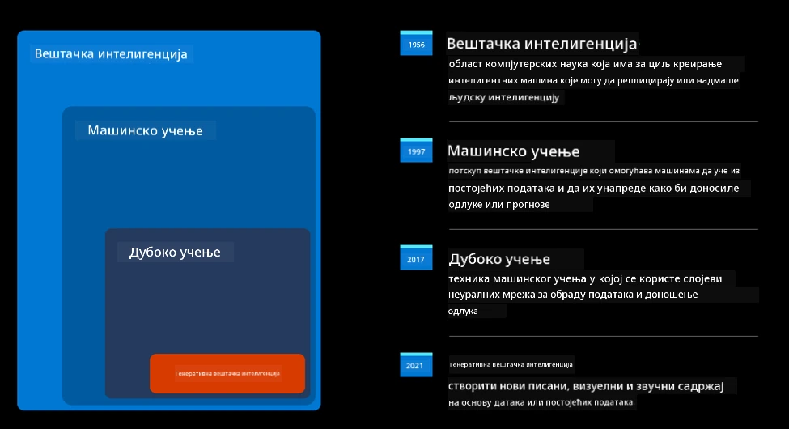
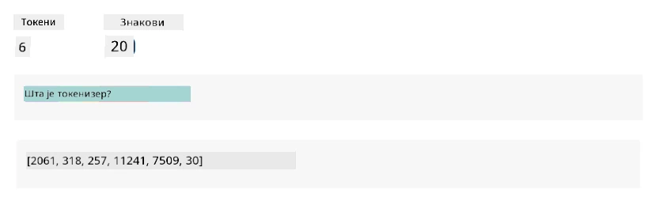
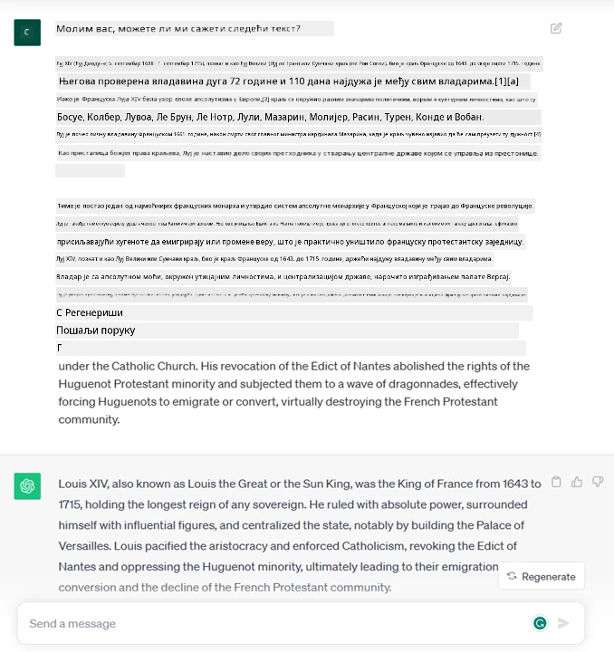
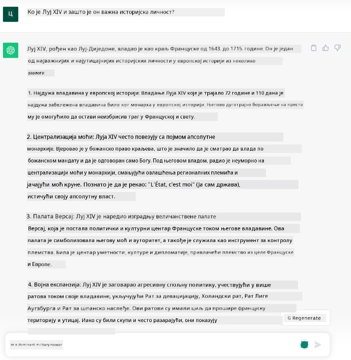
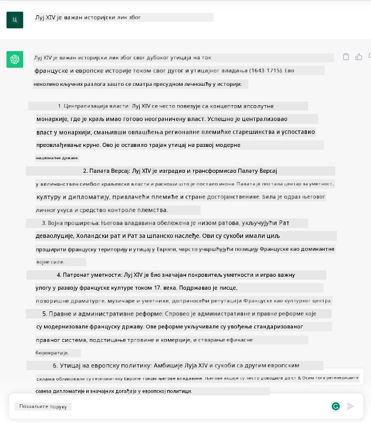
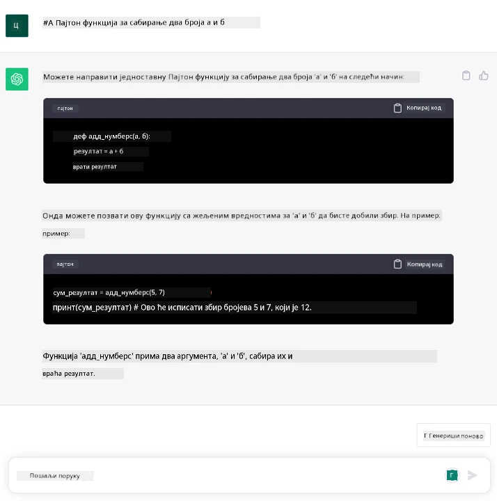

# Увод у генеративну вештачку интелигенцију и моделе великог језика

_(Кликните на слику изнад да бисте погледали видео лекцију)_

Генеративна вештачка интелигенција је врста вештачке интелигенције која је способна да генерише текст, слике и друге врсте садржаја. Оно што ову технологију чини фантастичном јесте то што демократизује вештачку интелигенцију – свако може да је користи уз само један текстуални упит, реченицу написану природним језиком. Не морате да учите језике попут Јаве или SQL-а да бисте постигли нешто вредно; све што вам је потребно јесте да употребите свој језик, наведете шта желите и добијете предлог од модела вештачке интелигенције. Примена и утицај овога су огромни – можете писати или разумети извештаје, креирати апликације и још много тога, све у року од неколико секунди.

У овом курикулуму истражићемо како наша стартап компанија користи генеративну вештачку интелигенцију за откључавање нових сценарија у свету образовања и како се суочавамо са неизбежним изазовима повезаним са друштвеним импликацијама њене примене и технолошким ограничењима.

## Увод

Ова лекција ће обухватити:

- Увод у пословни сценарио: идеја и мисија наше стартап компаније.
- Генеративна вештачка интелигенција и како смо дошли до тренутног технолошког пејзажа.
- Унутрашњи механизам модела великог језика.
- Главне способности и практични примери употребе модела великог језика.

## Циљеви учења

Након завршетка ове лекције, разумећете:

- Шта је генеративна вештачка интелигенција и како функционишу модели великог језика.
- Како можете искористити моделе великог језика за различите сценарије, са фокусом на образовне контексте.

## Сценарио: наша образовна стартап компанија

Генеративна вештачка интелигенција (AI) представља врхунац технологије вештачке интелигенције, померајући границе онога што се некада сматрало немогућим. Генеративни AI модели имају бројне способности и примене, али у овом курикулуму истражићемо како револуционишу образовање кроз измишљену стартап компанију. Ову компанију ћемо назвати _наша стартап компанија_. Наша стартап компанија ради у области образовања са амбициозном мисијом:

> _унапређење приступачности учењу на глобалном нивоу, осигуравајући равноправан приступ образовању и пружајући персонализована искуства учења сваком ученику, у складу са његовим потребама_.

Тим наше стартап компаније је свестан да нећемо моћи да постигнемо овај циљ без коришћења једног од најмоћнијих алата модерног доба – модела великог језика (LLMs).

Очекује се да ће генеративна вештачка интелигенција револуционисати начин на који данас учимо и подучавамо, омогућавајући ученицима да имају на располагању виртуелне наставнике 24 сата дневно који пружају огромне количине информација и примера, а наставницима да користе иновативне алате за процену својих ученика и давање повратних информација.

За почетак, хајде да дефинишемо неке основне концепте и терминологију коју ћемо користити током курикулума.

## Како смо дошли до генеративне вештачке интелигенције?

Упркос изузетној _помами_ коју су недавно изазвале најаве генеративних AI модела, ова технологија се развија деценијама, а први истраживачки напори датирају још из 60-их година. Сада смо на тачки где AI има когнитивне способности сличне људским, као што је конверзација, што показују, на пример, [OpenAI ChatGPT](https://openai.com/chatgpt) или [Bing Chat](https://www.microsoft.com/edge/features/bing-chat?WT.mc_id=academic-105485-koreyst), који такође користи GPT модел за претрагу на вебу.

Ако се мало вратимо уназад, први прототипови AI-а састојали су се од четботова који су користили текстуалне уносе, ослањајући се на базу знања извучену од групе стручњака и представљену у рачунару. Одговори у бази знања су се активирали кључним речима које су се појављивале у улазном тексту. Међутим, убрзо је постало јасно да такав приступ, користећи текстуалне четботове, није добро скалабилан.

### Статистички приступ AI-у: Машинско учење

Преломна тачка догодила се током 90-их година, када је примењен статистички приступ анализи текста. Ово је довело до развоја нових алгоритама – познатих као машинско учење – који су способни да уче обрасце из података без експлицитног програмирања. Овај приступ омогућава машинама да симулирају разумевање људског језика: статистички модел се обучава на паровима текст-ознака, омогућавајући моделу да класификује непознати улазни текст са унапред дефинисаном ознаком која представља намеру поруке.

### Неуронске мреже и модерни виртуелни асистенти

Последњих година, технолошка еволуција хардвера, способног да обрађује веће количине података и сложеније прорачуне, подстакла је истраживање у области AI-а, што је довело до развоја напредних алгоритама машинског учења познатих као неуронске мреже или алгоритми дубоког учења.

Неуронске мреже (а посебно рекурентне неуронске мреже – RNNs) значајно су унапредиле обраду природног језика, омогућавајући представљање значења текста на значајнији начин, вреднујући контекст речи у реченици.

Ово је технологија која је покретала виртуелне асистенте настале у првој деценији новог века, веома способне да тумаче људски језик, идентификују потребу и изврше акцију да је задовоље – као што је одговарање унапред дефинисаним скриптама или коришћење услуга трећих страна.

### Данас, генеративна вештачка интелигенција

Тако смо дошли до генеративне вештачке интелигенције данас, која се може сматрати подгрупом дубоког учења.

Након деценија истраживања у области AI-а, нова архитектура модела – названа _Transformer_ – превазишла је ограничења RNNs, омогућавајући обраду много дужих текстуалних секвенци као улазних података. Трансформери се заснивају на механизму пажње, који омогућава моделу да даје различите тежине улазима које прима, „обраћајући више пажње“ тамо где је концентрисана најрелевантнија информација, без обзира на њихов редослед у текстуалној секвенци.

Већина недавних генеративних AI модела – познатих и као модели великог језика (LLMs), јер раде са текстуалним улазима и излазима – заправо се заснива на овој архитектури. Оно што је занимљиво код ових модела – обучених на огромној количини необележених података из различитих извора као што су књиге, чланци и веб-сајтови – јесте то што се могу прилагодити широком спектру задатака и генерисати граматички исправан текст са дозом креативности. Дакле, не само да су невероватно унапредили способност машине да „разуме“ улазни текст, већ су омогућили њену способност да генерише оригиналан одговор на људском језику.

## Како функционишу модели великог језика?

У наредном поглављу ћемо истражити различите типове генеративних AI модела, али за сада хајде да погледамо како функционишу модели великог језика, са фокусом на OpenAI GPT (Generative Pre-trained Transformer) моделе.

- **Токенизатор, текст у бројеве**: Модели великог језика примају текст као улаз и генеришу текст као излаз. Међутим, као статистички модели, они много боље раде са бројевима него са текстуалним секвенцама. Зато се сваки улаз у модел обрађује токенизатором пре него што га користи основни модел. Токен је део текста – који се састоји од променљивог броја карактера, па је главни задатак токенизатора да подели улаз на низ токена. Затим се сваки токен мапира са индексом токена, што је целобројно кодирање оригиналног дела текста.

- **Предвиђање излазних токена**: Узимајући n токена као улаз (са максималним n који варира од модела до модела), модел је у стању да предвиди један токен као излаз. Тај токен се затим укључује у улаз следеће итерације, у обрасцу проширујућег прозора, омогућавајући боље корисничко искуство добијања једне (или више) реченице као одговора. Ово објашњава зашто, ако сте икада користили ChatGPT, можда сте приметили да понекад изгледа као да застане усред реченице.

- **Процес избора, расподела вероватноће**: Излазни токен се бира од стране модела у складу са његовом вероватноћом да се појави након тренутне текстуалне секвенце. То је зато што модел предвиђа расподелу вероватноће за све могуће „следеће токене“, израчунату на основу његове обуке. Међутим, не бира се увек токен са највећом вероватноћом из резултирајуће расподеле. Додаје се одређени степен случајности у овај избор, на начин да модел делује на недетерминистички начин – не добијамо потпуно исти излаз за исти улаз. Овај степен случајности се додаје да би се симулирао процес креативног размишљања и може се подесити помоћу параметра модела који се назива температура.

## Како наша стартап компанија може искористити моделе великог језика?

Сада када боље разумемо унутрашњи механизам модела великог језика, хајде да видимо неке практичне примере најчешћих задатака које они могу прилично добро да обављају, са фокусом на наш пословни сценарио. Рекли смо да је главна способност модела великог језика _генерисање текста од нуле, почевши од текстуалног улаза, написаног природним језиком_.

Али какав текстуални улаз и излаз?
Улаз модела великог језика је познат као упит (prompt), док је излаз познат као завршетак (completion), термин који се односи на механизам модела за генерисање следећег токена ради завршетка тренутног улаза. Детаљно ћемо истражити шта је упит и како га дизајнирати на начин да се добије највише од нашег модела. Али за сада, рецимо само да упит може укључивати:

- **Инструкцију** која прецизира врсту излаза коју очекујемо од модела. Ова инструкција понекад може садржати примере или додатне податке.

  1. Сажетак чланка, књиге, рецензија производа и више, уз извлачење увида из неструктурираних података.
    
    
  
  2. Креативно осмишљавање и писање чланка, есеја, задатка или другог.
      
     

- **Питање**, постављено у облику разговора са агентом.
  
  

- Део **текста за довршавање**, што имплицитно представља захтев за помоћ у писању.
  
  

- Део **кода** заједно са захтевом за објашњење и документацију, или коментар који тражи генерисање дела кода који обавља одређени задатак.
  
  

Горњи примери су прилично једноставни и нису намењени као исцрпна демонстрација способности модела великог језика. Њихова сврха је да покажу потенцијал коришћења генеративне вештачке интелигенције, посебно, али не искључиво, у образовним контекстима.

Такође, излаз генеративног AI модела није савршен и понекад креативност модела може радити против њега, резултирајући излазом који је комбинација речи коју људски корисник може протумачити као искривљавање стварности или може бити увредљив. Генеративна AI није интелигентна – барем не у свеобухватном значењу интелигенције, укључујући критичко и креативно размишљање или емоционалну интелигенцију; није детерминистичка и није поуздана, јер измишљотине, као што су погрешне референце, садржај и изјаве, могу бити комбиноване са тачним информацијама и представљене на уверљив и самоуверен начин. У наредним лекцијама, бавићемо се свим овим ограничењима и видећемо шта можемо учинити да их ублажимо.

## Задатак

Ваш задатак је да се додатно информишете о [генеративној вештачкој интелигенцији](https://en.wikipedia.org/wiki/Generative_artificial_intelligence?WT.mc_id=academic-105485-koreyst) и покушате да идентификујете област у којој бисте данас додали генеративну AI, а која је тренутно нема. Како би утица
Пребаците се на Лекцију 2 где ћемо погледати како [истражити и упоредити различите типове LLM](../02-exploring-and-comparing-different-llms/README.md?WT.mc_id=academic-105485-koreyst)!

---

**Одрицање од одговорности**:  
Овај документ је преведен помоћу услуге за превођење уз помоћ вештачке интелигенције [Co-op Translator](https://github.com/Azure/co-op-translator). Иако настојимо да обезбедимо тачност, молимо вас да имате у виду да аутоматски преводи могу садржати грешке или нетачности. Оригинални документ на изворном језику треба сматрати меродавним извором. За критичне информације препоручује се професионални превод од стране људи. Не преузимамо одговорност за било каква погрешна тумачења или неспоразуме који могу настати услед коришћења овог превода.