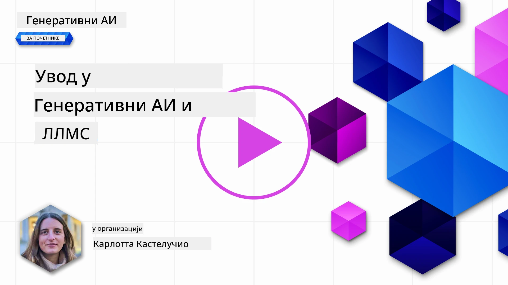
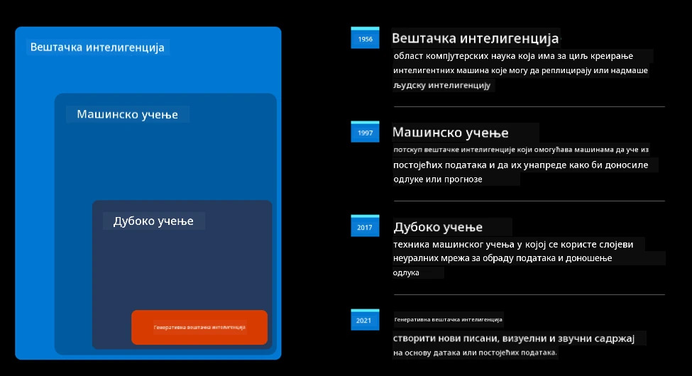
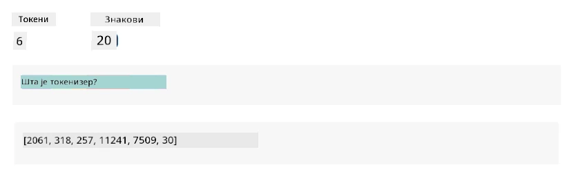
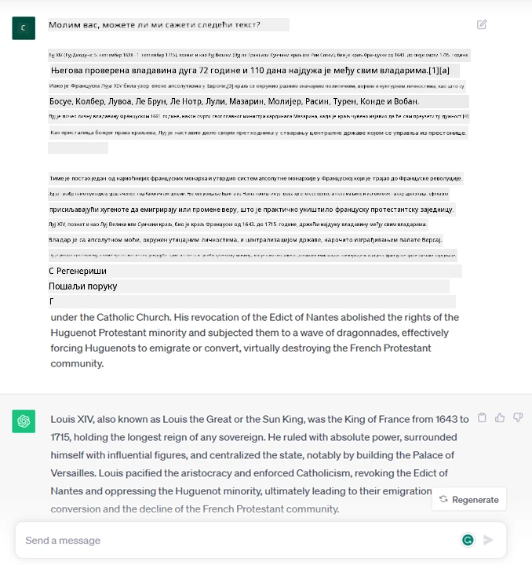
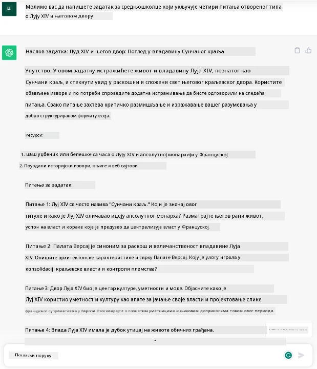
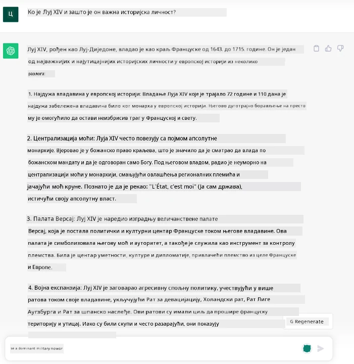
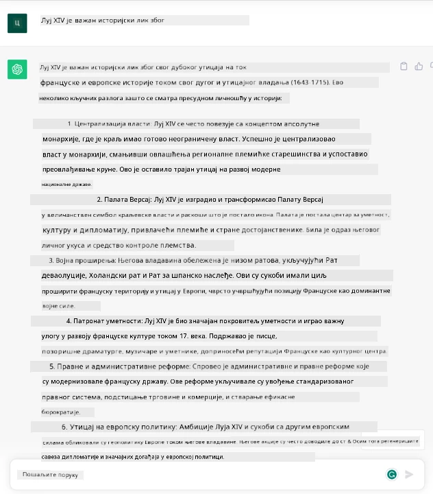
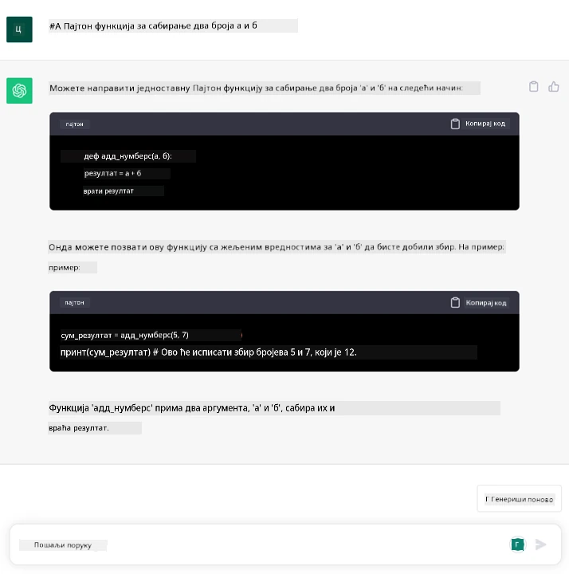

# Увод у генерисану вештачку интелигенцију и велике језичке моделе

_(Кликните на слику изнад да бисте гледали видео о овом часу)_

Генерисана вештачка интелигенција је вештачка интелигенција способна да генерише текст, слике и друге врсте садржаја. Оно што је чини фантастичном технологијом је то што демократизује AI, свако је може користити само са текстуалном инструкцијом, реченицом написаном на природном језику. Нема потребе да учите језик попут Јава или SQL да бисте постигли нешто вредно, све што треба је да користите свој језик, наведете шта желите и излази предлог из AI модела. Примена и утицај су огромни, пишете или разумете извештаје, пишете апликације и још много тога, све то за неколико секунди.

У овом курикулуму ћемо истражити како наш стартап користи генерисану AI да откључа нове сценарије у свету образовања и како се суочавамо са неизбежним изазовима повезаним са друштвеним импликацијама њене примене и технолошким ограничењима.

## Увод

Овај час обухватиће:

- Увођење у пословни сценарио: наша идеја стартапа и мисија.
- Генерисана AI и како смо дошли до садашњег технолошког пејзажа.
- Унутрашње функционисање великог језичког модела.
- Главне могућности и практичне примене Великих језичких модела.

## Циљеви учења

Након завршетка овог часа, разумећете:

- Шта је генерисана AI и како функционишу Велики језички модели.
- Како можете искористити велике језичке моделе за различите примене, са акцентом на сценарије у образовању.

## Сценарио: наш образовни стартап

Генерисана вештачка интелигенција (AI) представља врхунац AI технологије, померајући границе нечега што је некада сматрано немогућим. Модели генерисане AI имају више способности и примена, али за овај курикулум ћемо истражити како она револуционише образовање кроз један фиктивни стартап. Тим стартап називамо _наш стартап_. Наш стартап ради у домену образовања са амбициозним мисијом

> _побољшање приступачности учењу, на глобалном нивоу, осигуравајући праведан приступ образовању и пружајући персонализована искуства учења сваком ученику, према њиховим потребама_.

Тим нашег стартапа зна да нећемо бити у могућности да постигнемо овај циљ без коришћења једног од најмоћнијих алата модерног доба – Великих језичких модела (LLM).

Очекује се да ће генерисана AI револуционисати начин на који данас учимо и подучавамо, са студентима који ће имати на располагању виртуелне наставнике 24 сата дневно, који пружају огромну количину информација и примера, а наставници ће моћи да користе иновативне алате за процену својих ученика и да им пружају повратне информације.

Да почнемо, дефинишемо неке основне појмове и терминологију коју ћемо користити током курикулума.

## Како смо дошли до генерисане AI?

Упркос изузетном _хејпу_ који је недавно настао најавом генерисаних AI модела, ова технологија се развија деценијама уназад, са првим истраживачким напорима још из 60-их година. Сада смо достигли ниво са AI који поседује људске когнитивне способности, као што је разговор приказан на примерима као што су [OpenAI ChatGPT](https://openai.com/chatgpt) или [Microsoft Copilot](https://copilot.microsoft.com/?WT.mc_id=academic-105485-koreyst), који такође користи GPT модел за свој разговорни веб претраживач.

Да се вратимо мало у прошлост, први прототипови AI-а састојали су се од типканих четботова, који су се ослањали на базу знања изграђену од стране групе стручњака и представљену у рачунару. Одговори у тој бази знања били су активирани кључним речима које су се појављивале у улазном тексту.
Међутим, ускоро је постало јасно да такав приступ, коришћењем типканих четботова, није добро скалабилан.

### Статистички приступ AI: машинско учење

Преломни тренутак стигао је током 90-их година, применом статистичког приступа анализи текста. То је довело до развоја нових алгоритама – познатих као машинско учење – који су способни да уче шаблоне из података без експлицитног програмирања. Овај приступ дозвољава машинама да симулирају разумевање људског језика: статистички модел се обучава на парама текст-ознака, омогућујући моделу да класификује непознати улазни текст са претходно дефинисаном ознаком која представља намеру поруке.

### Неуронске мреже и модерни виртуелни асистенти

Последњих година, технолошка еволуција хардвера, способног да обрађује веће количине података и сложеније рачунање, подстакла је истраживања у AI, што је довело до развоја напредних алгоритама машинског учења познатих као неуронске мреже или дубоко учење.

Неуронске мреже (а посебно рекурентне неуронске мреже – RNN) значајно су унапредиле обраду природног језика, омогућавајући представљање значења текста на смисленији начин, узимајући у обзир контекст речи у реченици.

Ово је технологија која је покретала виртуелне асистенте рођене у првој деценији новог века, врло веште у тумачењу људског језика, идентификовању потребе и извршавању акције да је задовоље – као што је одговор уз претходно дефинисан сценарио или коришћење услуге треће стране.

### Савремени тренутак, генерисана AI

Тако смо дошли до данашње генерисане AI, која се може посматрати као подскуп дубоког учења.

Након деценија истраживања у области AI, нова архитектура модела – названа _Трансформер_ – превазишла је ограничења RNN-ова, способна да прими много дужи низ текста као улаз. Трансформери се заснивају на механизму пажње, омогућавајући моделу да даје различите тежине уносима које добија, „обраћајући више пажње“ где је сабрано најрелевантније информације, без обзира на њихов редослед у тексту.

Већина новијих модела генерисане AI – познатих и као Велики језички модели (LLM), јер раде са текстуалним улазима и излазима – засновани су управо на овој архитектури. Занимљиво је то што ти модели – обучени на огромној количини непрописаних података из различитих извора као што су књиге, чланци и веб сајтови – могу бити прилагођени за широку лепезу задатака и генерисати граматички коректан текст пуно личи на креативност. Тако да, не само да су невероватно повећали способност машине да „разуме“ улазни текст, већ и омогућили њихову способност да генеришу оригиналан одговор на људском језику.

## Како функционишу велики језички модели?

У следећем поглављу ћемо истражити различите типове модела генерисане AI, али за сада хајде да погледамо како функционишу велики језички модели, са фокусом на OpenAI GPT (Генерисани Претходно обучени Трансформер) моделе.

- **Токенизер, текст у бројеве**: Велики језички модели примају текст као улаз и генеришу текст као излаз. Међутим, као статистички модели, боље раде са бројевима него са низовима текста. Зато сваки улаз у модел обрађује токенизер, пре него што га користи основни модел. Токен је комад текста – који може имати променљив број знакова, па је главни задатак токенизера да подели улаз у низ токена. Затим се сваки токен мапира индексом токена, што је целобројни код оригиналног текста.

- **Предвиђање излазних токена**: Дато је n токена као улаз (максимални n варира од модела до модела), модел може предвидети један токен као излаз. Тај токен се затим инкорпорира у улаз следеће итерације, у растућем прозору, чиме се остварује боље корисничко искуство добијања једне (или више) реченице као одговора. Ово објашњава зашто, ако сте икада играли са ChatGPT-ом, можда сте приметили да понекад делује као да зауставља у сред реченице.

- **Процес селекције, расподела вероватноћа**: Излазни токен бира модел према његовој вероватноћи појављивања након тренутног текстуалног низа. То је зато што модел предвиђа расподелу вероватноћа за све могуће „следеће токене“, израчунату на основу обучености. Међутим, није увек изабран токен са највишом вероватноћом из добијене расподеле. Додаје се степен случајности у овом избору, тако да модел делује на недетерминисан начин - не добијамо исти излаз за исти улаз. Тај степен случајности служи за симулацију процеса креативног размишљања и може се подесити параметром модела названим температура.

## Како наш стартап може искористити Велике језичке моделе?

Сада када боље разумемо унутрашње функционисање великог језичког модела, хајде да видимо неке практичне примере најчешћих задатака које они могу добро извршавати, са фокусом на наш пословни сценарио.
Рекли смо да је главна способност Великог језичког модела _генерисање текста од нуле, полазећи од текстуалног улаза, написаног на природном језику_.

Али каква врста текстуалног улаза и излаза?
Улаз Великог језичког модела зове се промпт, док се излаз зове комплетирање, термин који се односи на механизам модела да генерише следећи токен како би допунио тренутни улаз. Ускоро ћемо детаљно обрадити шта је промпт и како га дизајнирати да из модела извучемо највише. За сада само рекнимо да промпт може обухватати:

- Јасну **инструкцију** која одређује врсту излаза који очекујемо од модела. Та инструкција понекад може укључивати неке примере или додатне податке.

  1. Сумирање чланка, књиге, рецензија производа и друго, заједно са извлачењем увида из неструктурираних података.
    
    
  
  2. Креативна идеја и дизајн чланка, есеја, задатка и више.
      
     

- Питање, постављено у разговору са агентом.
  
  

- Комад текста за допуну, што имплицитно значи захтев за помоћ у писању.
  
  

- Комад кода заједно са захтевом за објашњењем и документацијом, или коментар који тражи генерисање дела кода који обавља специфичан задатак.
  
  

Горњи примери су прилично једноставни и нису намењени да буду исцрпна демонстрација могућности Великих језичких модела. Они показују потенцијал коришћења генерисане AI, посебно али не искључиво у образовним контекстима.

Такође, излаз модела генерисане AI није савршен и понекад креативност модела може радити против ње, резултујући излазом који је комбинација речи које корисник може протумачити као мистификацију стварности или може бити увредљив. Генерисана AI није интелигентна - барем не у ширем смислу интелигенције, која укључује критичко и креативно резоновање или емотивну интелигенцију; није детерминистична и није поуздана, јер се фабрикације, као што су погрешне референце, садржаји и изјаве, могу мењати са тачним информацијама и представити на убедљив и сигуран начин. У следећим часовима ћемо се бавити свим овим ограничењима и видети шта можемо учинити да их ублажимо.

## Задатак

Ваш задатак је да сазнате више о [генерисаној AI](https://en.wikipedia.org/wiki/Generative_artificial_intelligence?WT.mc_id=academic-105485-koreyst) и покушате да идентификујете област у којој бисте данас додали генерисану AI где је нема. Како би утицај био другачији него „старим путем“, можете ли учинити нешто што раније нисте могли или сте бржи? Напишите резиме од 300 речи о томе како би изгледао ваш сан о AI стартапу укључујући наслове као „Проблем“, „Како бих користио AI“, „Утицај“ и по жељи бизнис план.

Ако сте урадили овај задатак, можда сте чак спремни да се пријавите у Мицрософтов инкубатор, [Microsoft for Startups Founders Hub](https://www.microsoft.com/startups?WT.mc_id=academic-105485-koreyst) где нудимо кредите за Azure, OpenAI, менторинг и још много тога, погледајте!

## Провера знања

Шта је тачно у вези великих језичких модела?

1. Сваки пут добијате исти тачан одговор.
1. Ради ствари савршено, одлично додаје бројеве, производи радни код итд.
1. Одговор може да варира и поред коришћења истог промпта. Такође је одличан у давању првог нацрта нечега, било текста или кода. Али треба да побољшавате резултате.

A: 3, LLM је недетерминистички, одговор варира, али можете контролисати ту варијанту помоћу подешавања температуре. Такође не треба очекивати савршене резултате, него је ту да обави тежи посао за вас што често значи да добијате добар први покушај нечега који треба постепено да побољшате.

## Одличан посао! Наставите путовање

Након завршетка овог часа, погледајте нашу [збирку за учење генерисане AI](https://aka.ms/genai-collection?WT.mc_id=academic-105485-koreyst) да наставите усавршавање вашег знања о генерисаној AI!

Пређите на Лекцију 2 где ћемо погледати како да [истражимо и упоредимо различите типове ЛЛМ-ова](../02-exploring-and-comparing-different-llms/README.md?WT.mc_id=academic-105485-koreyst)!

---

<!-- CO-OP TRANSLATOR DISCLAIMER START -->
**Изјава о одрицању одговорности**:
Овај документ је преведен коришћењем услуге за аутоматски превод [Co-op Translator](https://github.com/Azure/co-op-translator). Иако тежимо тачности, имајте у виду да аутоматски преводи могу садржати грешке или нетачности. Оригинални документ на његовом изворном језику треба сматрати ауторитативним извором. За критичне информације препоручује се професионални људски превод. Нисмо одговорни за било каква неспоразума или погрешна тумачења која произилазе из коришћења овог превода.
<!-- CO-OP TRANSLATOR DISCLAIMER END -->