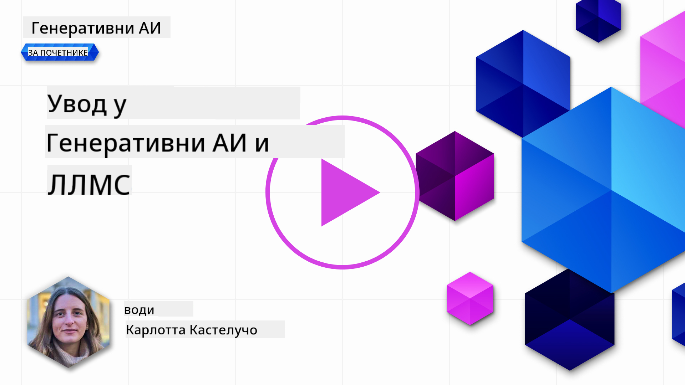
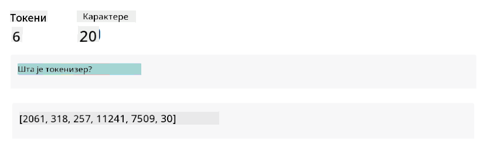
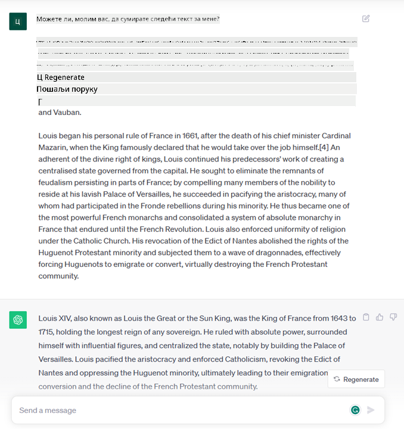
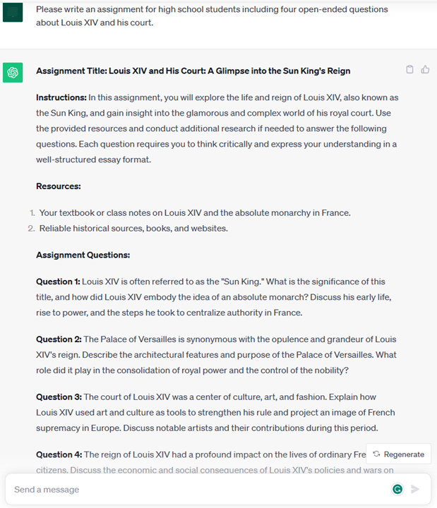
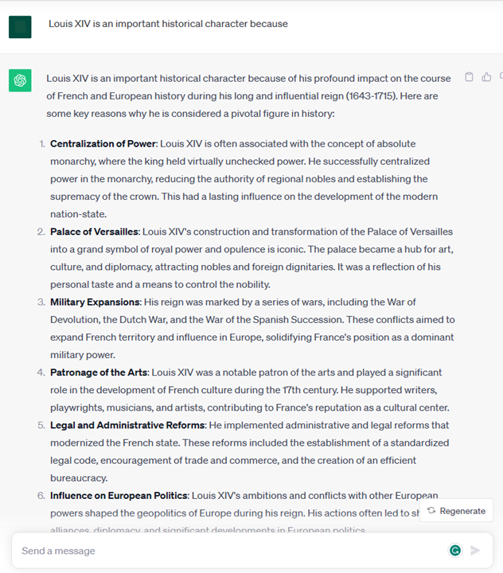

<!--
CO_OP_TRANSLATOR_METADATA:
{
  "original_hash": "f53ba0fa49164f9323043f1c6b11f2b1",
  "translation_date": "2025-07-09T08:03:07+00:00",
  "source_file": "01-introduction-to-genai/README.md",
  "language_code": "sr"
}
-->
# Увод у генеративну вештачку интелигенцију и велике језичке моделе

_(Кликните на слику изнад да бисте погледали видео о овој лекцији)_

Генеративна вештачка интелигенција је облик вештачке интелигенције способан да генерише текст, слике и друге врсте садржаја. Оно што је чини изузетном технологијом јесте то што демократизује вештачку интелигенцију – свако може да је користи само уз текстуални упит, реченицу написану природним језиком. Нема потребе да учите програмске језике као што су Java или SQL да бисте постигли нешто значајно, све што вам треба је да употребите свој језик, изразите шта желите, и добијете предлог од AI модела. Примене и утицај ове технологије су огромни – пишете или разумете извештаје, креирате апликације и још много тога, све у року од неколико секунди.

У овом курикулуму ћемо истражити како наш стартап користи генеративну AI да отвори нове могућности у образовању и како се суочавамо са неизбежним изазовима везаним за друштвене импликације примене и технолошка ограничења.

## Увод

Ова лекција ће обухватити:

- Увод у пословни сценарио: идеја и мисија нашег стартапа.
- Генеративна AI и како смо дошли до тренутног технолошког пејзажа.
- Унутрашњи рад великог језичког модела.
- Главне могућности и практичне примене великих језичких модела.

## Циљеви учења

Након завршетка ове лекције, разумећете:

- Шта је генеративна AI и како функционишу велики језички модели.
- Како можете искористити велике језичке моделе за различите примене, са фокусом на образовне сценарије.

## Сценарио: наш образовни стартап

Генеративна вештачка интелигенција представља врхунац AI технологије, померајући границе онога што је некада сматрано немогућим. Генеративни AI модели имају бројне могућности и примене, али у овом курикулуму ћемо истражити како револуционишу образовање кроз један фиктивни стартап. Назваћемо га _наш стартап_. Наш стартап ради у области образовања са амбициозном мисијом:

> _побољшање приступачности учењу на глобалном нивоу, обезбеђујући једнаке могућности за образовање и пружајући персонализована искуства учења сваком ученику, према његовим потребама_.

Наш тим је свестан да нећемо моћи да остваримо овај циљ без коришћења једног од најмоћнијих алата савременог доба – великих језичких модела (LLM).

Очекује се да ће генеративна AI револуционисати начин на који данас учимо и предајемо, са студентима који имају на располагању виртуелне наставнике 24 сата дневно, који пружају огромне количине информација и примера, а наставници могу да користе иновативне алате за процену својих ученика и пружање повратних информација.

За почетак, дефинисаћемо неке основне појмове и терминологију коју ћемо користити током целог курикулума.

## Како смо дошли до генеративне AI?

Упркос великом _хипу_ који је недавно изазвала најавa генеративних AI модела, ова технологија се развија деценијама, са првим истраживачким напорима још из 60-их година. Данас смо дошли до тачке где AI поседује когнитивне способности сличне људским, као што је разговор, што показују, на пример, [OpenAI ChatGPT](https://openai.com/chatgpt) или [Bing Chat](https://www.microsoft.com/edge/features/bing-chat?WT.mc_id=academic-105485-koreyst), који такође користи GPT модел за претрагу и разговоре на Bing-у.

Да се вратимо мало уназад, први прототипови AI били су типкани чатботови, који су се ослањали на базу знања изведену од групе стручњака и представљену у рачунару. Одговори у бази знања покретани су кључним речима које су се појављивале у улазном тексту. Међутим, убрзо је постало јасно да такав приступ, коришћење типканих чатботова, није добро скалирао.

### Статистички приступ AI: машинско учење

Преломни тренутак је наступио током 90-их, применом статистичког приступа анализи текста. То је довело до развоја нових алгоритама – познатих као машинско учење – који могу да уче обрасце из података без експлицитног програмирања. Овај приступ омогућава машинама да симулирају разумевање људског језика: статистички модел се тренира на паровима текста и ознака, што омогућава моделу да класификује непознати улазни текст са унапред дефинисаном ознаком која представља намеру поруке.

### Неуронске мреже и модерни виртуелни асистенти

У последњих неколико година, технолошки развој хардвера, способног да обрађује веће количине података и сложеније прорачуне, подстакао је истраживања у AI, што је довело до развоја напредних алгоритама машинског учења познатих као неуронске мреже или дубоко учење.

Неуронске мреже (посебно рекурентне неуронске мреже – RNN) значајно су унапредиле обраду природног језика, омогућавајући боље представљање значења текста, узимајући у обзир контекст речи у реченици.

Ова технологија је покретала виртуелне асистенте рођене у првој деценији новог века, веома веште у тумачењу људског језика, препознавању потреба и извршавању радњи које их задовољавају – као што је одговарање унапред дефинисаним скриптама или коришћење услуга трећих страна.

### Савремено доба, генеративна AI

Тако смо дошли до генеративне AI данас, која се може посматрати као подскуп дубоког учења.

Након деценија истраживања у области AI, нова архитектура модела – названа _Transformer_ – превазишла је ограничења RNN-а, омогућавајући обраду много дужих секвенци текста као улаз. Трансформери се заснивају на механизму пажње, који омогућава моделу да даје различите тежине улазима које прима, „обраћајући више пажње“ тамо где је концентрисана најрелевантнија информација, без обзира на њихов редослед у тексту.

Већина новијих генеративних AI модела – познатих и као велики језички модели (LLM), јер раде са текстуалним улазима и излазима – заснована је управо на овој архитектури. Оно што је занимљиво код ових модела – тренираних на огромним количинама неозначених података из различитих извора као што су књиге, чланци и веб сајтови – јесте да се могу прилагодити за широк спектар задатака и генерисати граматички исправан текст са наговештајем креативности. Дакле, не само да су изузетно повећали способност машине да „разуме“ улазни текст, већ су омогућили и да генеришу оригиналан одговор на људском језику.

## Како функционишу велики језички модели?

У следећем поглављу ћемо истражити различите типове генеративних AI модела, али за сада хајде да погледамо како функционишу велики језички модели, са фокусом на OpenAI GPT (Generative Pre-trained Transformer) моделе.

- **Токенизер, текст у бројеве**: Велики језички модели примају текст као улаз и генеришу текст као излаз. Међутим, као статистички модели, боље раде са бројевима него са текстуалним секвенцама. Због тога сваки улаз у модел прво обрађује токенизер. Токен је део текста – састоји се од варијабилног броја карактера, па је главни задатак токенизера да подели улаз у низ токена. Затим се сваки токен мапира на индекс токена, што је целобројни код оригиналног дела текста.

- **Предвиђање излазних токена**: Дато је n токена као улаз (максималан n варира од модела до модела), модел може да предвиди један токен као излаз. Тај токен се затим укључује у улаз следеће итерације, у облику проширујућег прозора, што омогућава боље корисничко искуство добијања једне (или више) реченица као одговора. Ово објашњава зашто, ако сте икада користили ChatGPT, понекад изгледа као да престаје усред реченице.

- **Процес избора, расподела вероватноће**: Излазни токен бира модел према вероватноћи да се појави након тренутне текстуалне секвенце. Модел предвиђа расподелу вероватноће за све могуће „следеће токене“, израчунату на основу свог тренинга. Међутим, није увек изабран токен са највишом вероватноћом. У избор се уноси степен случајности, тако да модел делује недетерминистички – не добијамо увек исти излаз за исти улаз. Овај степен случајности симулира процес креативног размишљања и може се подесити параметром модела који се зове температура.

## Како наш стартап може искористити велике језичке моделе?

Сада када боље разумемо унутрашњи рад великог језичког модела, погледајмо неке практичне примере најчешћих задатака које они могу прилично добро обавити, са освртом на наш пословни сценарио. Рекли смо да је главна способност великог језичког модела _генерисање текста од нуле, почевши од текстуалног улаза написаног природним језиком_.

Али каквог типа су улаз и излаз?
Улаз великог језичког модела познат је као упит (prompt), док је излаз познат као завршетак (completion), термин који се односи на механизам модела да генерише следећи токен како би допунио тренутни улаз. Ускоро ћемо детаљније објаснити шта је упит и како га дизајнирати да бисмо извукли максимум из модела. За сада, упит може да садржи:

- **Упутство** које одређује тип излаза који очекујемо од модела. Ово упутство понекад може укључивати примере или додатне податке.

  1. Сажимање чланака, књига, рецензија производа и слично, уз извлачење увида из неструктурираних података.
    
    
  
  2. Креативно осмишљавање и писање чланака, есеја, задатака и слично.
      
     

- **Питање**, постављено у форми разговора са агентом.
  
  

- Део **текста за допуну**, што имплицитно представља захтев за помоћ у писању.
  
  

- Део **кода** уз захтев за објашњење и документацију, или коментар који тражи генерисање дела кода за одређени задатак.
  
  

Примери изнад су прилично једноставни и нису намењени као исцрпна демонстрација могућности великих језичких модела. Они служе да илуструју потенцијал коришћења генеративне AI, посебно али не искључиво у образовним контекстима.

Такође, излаз генеративног AI модела није савршен и понекад креативност модела може радити против њега, резултујући излазом који је комбинација речи коју људски корисник може протумачити као измишљотину стварности или као увредљив садржај. Генеративна AI није интелигентна – барем не у ширем смислу интелигенције, која укључује критичко и креативно расуђивање или емотивну интелигенцију; није детерминистичка и није поуздана, јер се измишљотине, као што су нетачне референце, садржај и тврдње, могу комбиновати са тачним информацијама и представити на убедљив и самоуверен начин. У наредним лекцијама бавићемо се свим овим ограничењима и видећемо шта можемо учинити да их ублажимо.

## Задатак

Ваш задатак је да прочитате више о [генеративној AI](https://en.wikipedia.org/wiki/Generative_artificial_intelligence?WT.mc_id=academic-105485-koreyst) и покушате да идентификујете област у којој бисте данас додали генеративну AI, а која је још нема. Како би утицај био другачији у односу на „стари начин“ рада, да ли бисте могли да урадите нешто што раније нисте могли, или бисте били бржи? Напишите резиме од 300 речи о томе како би изгледао ваш идеални AI стартап и укључите наслове као што су „Проблем“, „Како бих користио AI“, „Утицај“ и по жељи пословни план.

Ако сте урадили овај задатак, можда сте спремни да се пријавите у Microsoft-ов инкубатор, [Microsoft for Startups Founders Hub](https://www.microsoft.com/startups?WT.mc_id=academic-105485-koreyst) где нудимо кредите за Azure, OpenAI, менторство и још много тога, погледајте!

## Провера знања

Шта је тачно у вези са великим језичким моделима?

1. Увек добијате исти одговор.
1. Они раде све савршено, одлични су у сабирању бројева, генеришу исправан код итд.

Прелазак на Лекцију 2 где ћемо погледати како да [истражимо и упоредимо различите типове LLM-ова](../02-exploring-and-comparing-different-llms/README.md?WT.mc_id=academic-105485-koreyst)!

**Одрицање од одговорности**:  
Овај документ је преведен коришћењем AI сервиса за превођење [Co-op Translator](https://github.com/Azure/co-op-translator). Иако се трудимо да превод буде тачан, молимо вас да имате у виду да аутоматски преводи могу садржати грешке или нетачности. Оригинални документ на његовом изворном језику треба сматрати ауторитетним извором. За критичне информације препоручује се професионални људски превод. Нисмо одговорни за било каква неспоразума или погрешна тумачења настала коришћењем овог превода.