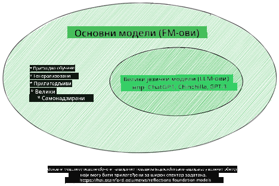
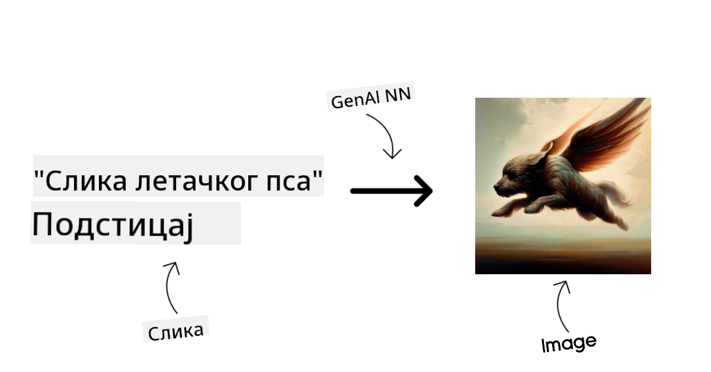
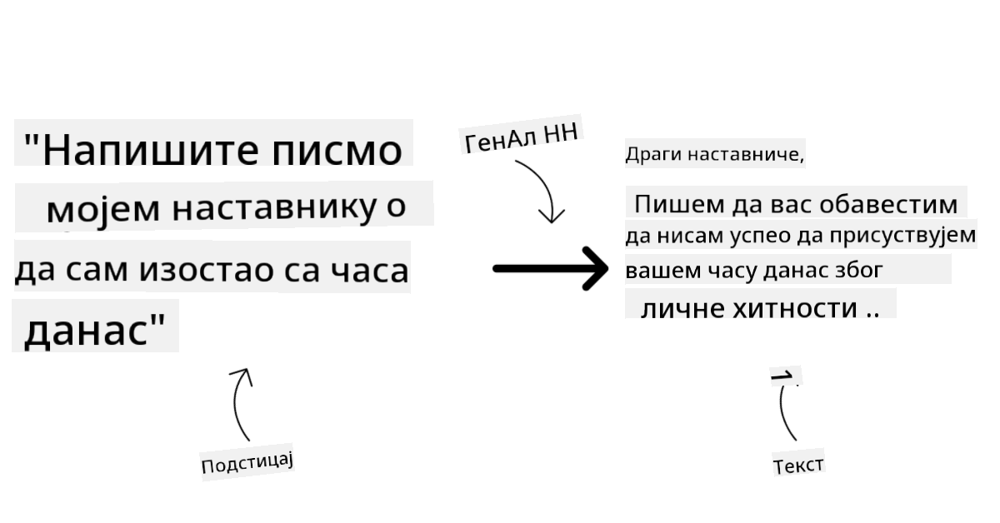
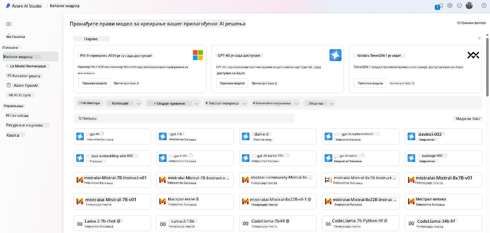
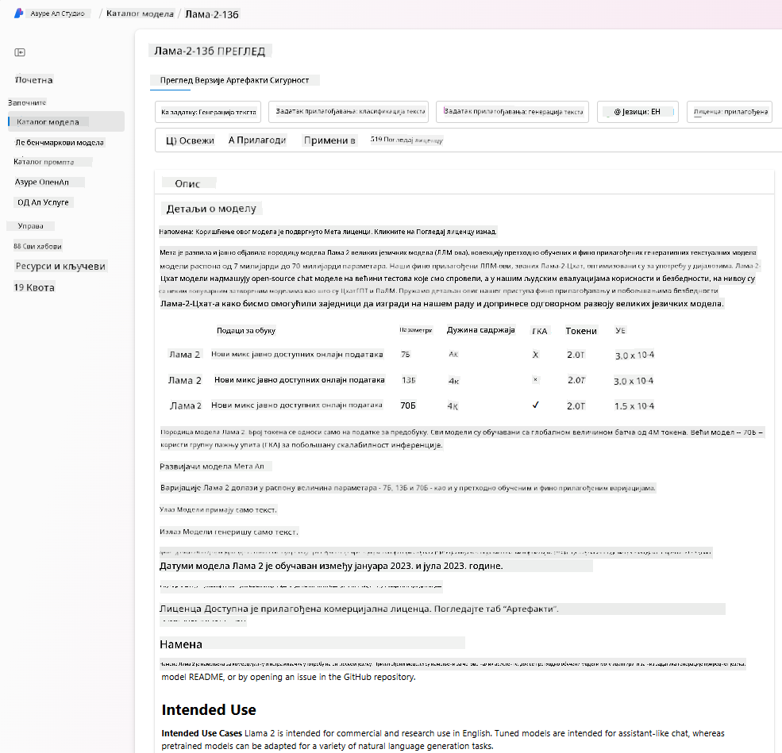
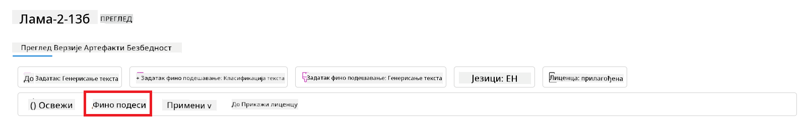
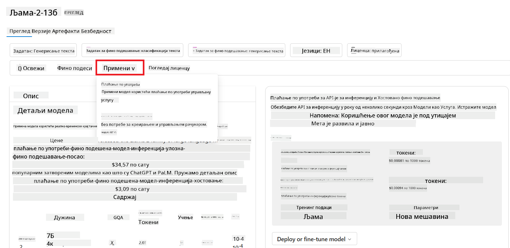
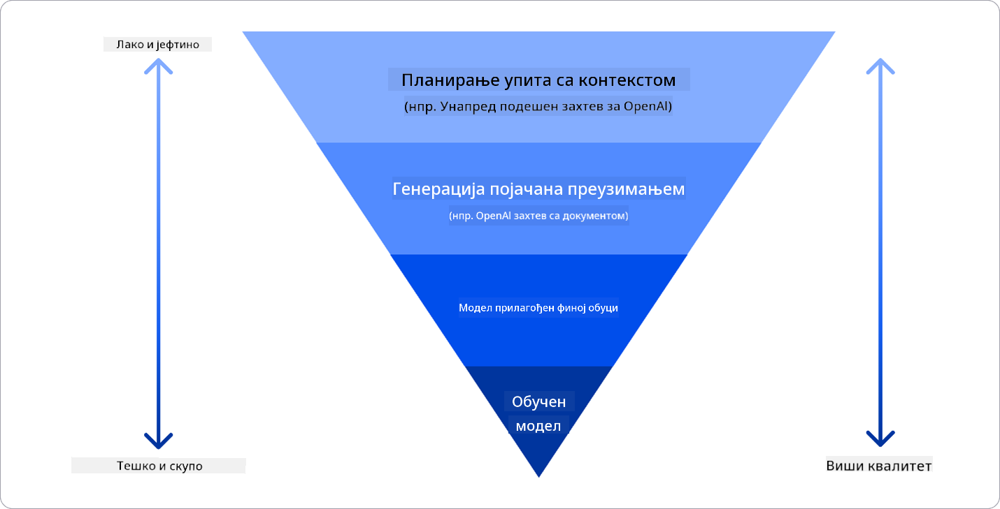

<!--
CO_OP_TRANSLATOR_METADATA:
{
  "original_hash": "e2f686f2eb794941761252ac5e8e090b",
  "translation_date": "2025-05-19T14:25:31+00:00",
  "source_file": "02-exploring-and-comparing-different-llms/README.md",
  "language_code": "sr"
}
-->
# Istraživanje i poređenje različitih LLM-ova

> _Kliknite na sliku iznad da biste pogledali video ovog lekcije_

U prethodnoj lekciji smo videli kako Generativna AI menja tehnološki pejzaž, kako funkcionišu Veliki Jezički Modeli (LLM) i kako preduzeće - poput našeg startapa - može da ih primeni u svojim slučajevima upotrebe i raste! U ovom poglavlju želimo da uporedimo i kontrastiramo različite tipove velikih jezičkih modela (LLM) kako bismo razumeli njihove prednosti i nedostatke.

Sledeći korak u našem startap putovanju je istraživanje trenutnog pejzaža LLM-ova i razumevanje koji su pogodni za naš slučaj upotrebe.

## Uvod

Ova lekcija će pokriti:

- Različite tipove LLM-ova u trenutnom pejzažu.
- Testiranje, iteriranje i poređenje različitih modela za vaš slučaj upotrebe u Azure-u.
- Kako da postavite LLM.

## Ciljevi učenja

Nakon završetka ove lekcije, moći ćete:

- Izabrati pravi model za vaš slučaj upotrebe.
- Razumeti kako da testirate, iterirate i poboljšate performanse vašeg modela.
- Znati kako preduzeća postavljaju modele.

## Razumevanje različitih tipova LLM-ova

LLM-ovi mogu imati više kategorija zasnovanih na njihovoj arhitekturi, podacima za obuku i slučaju upotrebe. Razumevanje ovih razlika pomoći će našem startapu da izabere pravi model za scenario i razume kako da testira, iterira i poboljša performanse.

Postoji mnogo različitih tipova LLM modela, vaš izbor modela zavisi od toga šta želite da ih koristite, vaših podataka, koliko ste spremni da platite i još mnogo toga.

U zavisnosti od toga da li želite da koristite modele za tekst, audio, video, generisanje slika i tako dalje, možete se odlučiti za drugačiji tip modela.

- **Audio i prepoznavanje govora**. Za ovu svrhu, Whisper-tip modeli su odličan izbor jer su višenamenski i namenjeni prepoznavanju govora. Obučeni su na raznolikom zvuku i mogu obavljati višejezično prepoznavanje govora. Saznajte više o [Whisper tip modelima ovde](https://platform.openai.com/docs/models/whisper?WT.mc_id=academic-105485-koreyst).

- **Generisanje slika**. Za generisanje slika, DALL-E i Midjourney su dva vrlo poznata izbora. DALL-E nudi Azure OpenAI. [Pročitajte više o DALL-E ovde](https://platform.openai.com/docs/models/dall-e?WT.mc_id=academic-105485-koreyst) i takođe u Poglavlju 9 ovog kurikuluma.

- **Generisanje teksta**. Većina modela je obučena na generisanje teksta i imate veliki izbor od GPT-3.5 do GPT-4. Dolaze sa različitim troškovima, pri čemu je GPT-4 najskuplji. Vredi pogledati [Azure OpenAI playground](https://oai.azure.com/portal/playground?WT.mc_id=academic-105485-koreyst) da biste procenili koji modeli najbolje odgovaraju vašim potrebama u smislu sposobnosti i troškova.

- **Višemodalnost**. Ako želite da rukujete različitim tipovima podataka u ulazu i izlazu, možda želite da pogledate modele kao što su [gpt-4 turbo sa vizijom ili gpt-4o](https://learn.microsoft.com/azure/ai-services/openai/concepts/models#gpt-4-and-gpt-4-turbo-models?WT.mc_id=academic-105485-koreyst) - najnovija izdanja OpenAI modela - koji su sposobni da kombinuju obradu prirodnog jezika sa vizuelnim razumevanjem, omogućavajući interakcije kroz višemodalne interfejse.

Odabir modela znači da dobijate neke osnovne sposobnosti, što možda neće biti dovoljno. Često imate podatke specifične za kompaniju koje nekako morate preneti LLM-u. Postoji nekoliko različitih izbora kako da pristupite tome, više o tome u narednim sekcijama.

### Osnovni modeli naspram LLM-ova

Termin Osnovni Model je [smislili istraživači sa Stanforda](https://arxiv.org/abs/2108.07258?WT.mc_id=academic-105485-koreyst) i definisali ga kao AI model koji prati neke kriterijume, kao što su:

- **Obučeni su koristeći nesupervizirano učenje ili samosupervizirano učenje**, što znači da su obučeni na neoznačenim višemodalnim podacima i ne zahtevaju ljudsku anotaciju ili označavanje podataka za njihov proces obuke.
- **To su veoma veliki modeli**, zasnovani na veoma dubokim neuronskim mrežama obučeni na milijardama parametara.
- **Obično su namenjeni da služe kao ‘osnova’ za druge modele**, što znači da se mogu koristiti kao početna tačka za druge modele koji se mogu graditi na njima, što se može postići finim podešavanjem.

Izvor slike: [Suštinski vodič za Osnovne modele i Velike jezičke modele | autor Babar M Bhatti | Medium
](https://thebabar.medium.com/essential-guide-to-foundation-models-and-large-language-models-27dab58f7404)

Da dodatno pojasnimo ovu razliku, uzmimo ChatGPT kao primer. Da bi se izgradila prva verzija ChatGPT-a, model nazvan GPT-3.5 je služio kao osnovni model. To znači da je OpenAI koristio neke podatke specifične za chat da kreira prilagođenu verziju GPT-3.5 koja je bila specijalizovana za dobro izvođenje u konverzacijskim scenarijima, kao što su chatboti.

Izvor slike: [2108.07258.pdf (arxiv.org)](https://arxiv.org/pdf/2108.07258.pdf?WT.mc_id=academic-105485-koreyst)

### Open Source naspram Proprietary modela

Još jedan način da kategorizujemo LLM-ove je da li su open source ili proprietary.

Open-source modeli su modeli koji su dostupni javnosti i mogu ih koristiti svi. Često ih objavljuje kompanija koja ih je kreirala ili istraživačka zajednica. Ovi modeli se mogu pregledati, modifikovati i prilagoditi za različite slučajeve upotrebe u LLM-ovima. Međutim, nisu uvek optimizovani za upotrebu u proizvodnji i možda neće biti tako performantni kao proprietary modeli. Plus, finansiranje za open-source modele može biti ograničeno i možda neće biti dugoročno održavani ili ažurirani sa najnovijim istraživanjima. Primeri popularnih open source modela uključuju [Alpaca](https://crfm.stanford.edu/2023/03/13/alpaca.html?WT.mc_id=academic-105485-koreyst), [Bloom](https://huggingface.co/bigscience/bloom) i [LLaMA](https://llama.meta.com).

Proprietary modeli su modeli koji su u vlasništvu kompanije i nisu dostupni javnosti. Ovi modeli su često optimizovani za upotrebu u proizvodnji. Međutim, nisu dozvoljeni da se pregledaju, modifikuju ili prilagode za različite slučajeve upotrebe. Plus, nisu uvek dostupni besplatno i možda zahtevaju pretplatu ili plaćanje za korišćenje. Takođe, korisnici nemaju kontrolu nad podacima koji se koriste za obuku modela, što znači da bi trebalo da poveruju vlasniku modela da osigura posvećenost privatnosti podataka i odgovorno korišćenje AI. Primeri popularnih proprietary modela uključuju [OpenAI modele](https://platform.openai.com/docs/models/overview?WT.mc_id=academic-105485-koreyst), [Google Bard](https://sapling.ai/llm/bard?WT.mc_id=academic-105485-koreyst) ili [Claude 2](https://www.anthropic.com/index/claude-2?WT.mc_id=academic-105485-koreyst).

### Ugrađivanje naspram Generisanje slika naspram Generisanje teksta i koda

LLM-ovi se mogu kategorizovati i prema izlazu koji generišu.

Ugrađivanja su skup modela koji mogu pretvoriti tekst u numerički oblik, nazvan ugrađivanje, što je numerička reprezentacija ulaznog teksta. Ugrađivanja olakšavaju mašinama razumevanje odnosa između reči ili rečenica i mogu se koristiti kao ulazi za druge modele, kao što su modeli za klasifikaciju ili modeli za grupisanje koji imaju bolje performanse na numeričkim podacima. Modeli za ugrađivanje se često koriste za transferno učenje, gde se model gradi za zamenski zadatak za koji postoji obilje podataka, a zatim se težine modela (ugrađivanja) ponovo koriste za druge zadatke nizvodno. Primer ove kategorije je [OpenAI ugrađivanja](https://platform.openai.com/docs/models/embeddings?WT.mc_id=academic-105485-koreyst).

Modeli za generisanje slika su modeli koji generišu slike. Ovi modeli se često koriste za uređivanje slika, sintezu slika i prevođenje slika. Modeli za generisanje slika se često obučavaju na velikim skupovima podataka o slikama, kao što je [LAION-5B](https://laion.ai/blog/laion-5b/?WT.mc_id=academic-105485-koreyst), i mogu se koristiti za generisanje novih slika ili za uređivanje postojećih slika tehnikama kao što su popravka, super-rezolucija i kolorizacija. Primeri uključuju [DALL-E-3](https://openai.com/dall-e-3?WT.mc_id=academic-105485-koreyst) i [Stable Diffusion modeli](https://github.com/Stability-AI/StableDiffusion?WT.mc_id=academic-105485-koreyst).

Modeli za generisanje teksta i koda su modeli koji generišu tekst ili kod. Ovi modeli se često koriste za sumiranje teksta, prevođenje i odgovaranje na pitanja. Modeli za generisanje teksta se često obučavaju na velikim skupovima podataka o tekstu, kao što je [BookCorpus](https://www.cv-foundation.org/openaccess/content_iccv_2015/html/Zhu_Aligning_Books_and_ICCV_2015_paper.html?WT.mc_id=academic-105485-koreyst), i mogu se koristiti za generisanje novog teksta ili za odgovaranje na pitanja. Modeli za generisanje koda, kao što je [CodeParrot](https://huggingface.co/codeparrot?WT.mc_id=academic-105485-koreyst), se često obučavaju na velikim skupovima podataka o kodu, kao što je GitHub, i mogu se koristiti za generisanje novog koda ili za popravku grešaka u postojećem kodu.

### Encoder-Decoder naspram Samo-Decoder

Da bismo razgovarali o različitim tipovima arhitektura LLM-ova, koristimo analogiju.

Zamislite da vam je menadžer dao zadatak da napišete kviz za studente. Imate dva kolege; jedan je zadužen za kreiranje sadržaja, a drugi za pregledanje.

Kreator sadržaja je kao model samo-Decoder, oni mogu pogledati temu i videti šta ste već napisali, a zatim mogu napisati kurs na osnovu toga. Oni su veoma dobri u pisanju zanimljivog i informativnog sadržaja, ali nisu baš dobri u razumevanju teme i ciljeva učenja. Neki primeri Decoder modela su modeli iz GPT porodice, kao što je GPT-3.

Pregledač je kao model samo-Encoder, oni gledaju napisani kurs i odgovore, primećujući odnos između njih i razumevajući kontekst, ali nisu dobri u generisanju sadržaja. Primer modela samo-Encoder bio bi BERT.

Zamislite da možemo imati nekoga ko bi mogao i da kreira i pregleda kviz, to je Encoder-Decoder model. Neki primeri bi bili BART i T5.

### Usluga naspram Model

Sada, hajde da razgovaramo o razlici između usluge i modela. Usluga je proizvod koji nudi Provajder usluga u oblaku i često je kombinacija modela, podataka i drugih komponenti. Model je osnovna komponenta usluge i često je osnovni model, kao što je LLM.

Usluge su često optimizovane za upotrebu u proizvodnji i često su lakše za korišćenje nego modeli, putem grafičkog korisničkog interfejsa. Međutim, usluge nisu uvek dostupne besplatno i možda zahtevaju pretplatu ili plaćanje za korišćenje, u zamenu za korišćenje opreme i resursa vlasnika usluge, optimizujući troškove i lako se skalirajući. Primer usluge je [Azure OpenAI Service](https://learn.microsoft.com/azure/ai-services/openai/overview?WT.mc_id=academic-105485-koreyst), koji nudi plan plaćanja po korišćenju, što znači da se korisnici naplaćuju proporcionalno koliko koriste uslugu. Takođe, Azure OpenAI Service nudi sigurnost na nivou preduzeća i odgovoran AI okvir na vrhu sposobnosti modela.

Modeli su samo Neuronska mreža, sa parametrima, težinama i ostalim. Omogućavaju kompanijama da rade lokalno, međutim, potrebno bi bilo kupiti opremu, izgraditi strukturu za skaliranje i kupiti licencu ili koristiti open-source model. Model kao što je LLaMA je dostupan za korišćenje, zahtevajući računarsku snagu za pokretanje modela.

## Kako testirati i iterirati sa različitim modelima da biste razumeli performanse na Azure-u

Kada naš tim istraži trenutni LLM pejzaž i identifikuje neke dobre kandidate za svoje scenarije, sledeći korak je testiranje na njihovim podacima i radnom opterećenju. Ovo je iterativni proces, koji se sprovodi putem eksperimenata i merenja.
Većina modela koje smo pomenuli u prethodnim pasusima (OpenAI modeli, open source modeli kao Llama2 i Hugging Face transformatori) su dostupni u [Katalogu modela](https://learn.microsoft.com/azure/ai-studio/how-to/model-catalog-overview?WT.mc_id=academic-105485-koreyst) u [Azure AI Studiju](https://ai.azure.com/?WT.mc_id=academic-105485-koreyst).

[Azure AI Studio](https://learn.microsoft.com/azure/ai-studio/what-is-ai-studio?WT.mc_id=academic-105485-koreyst) je Cloud Platforma dizajnirana za programere da grade generativne AI aplikacije i upravljaju celim životnim ciklusom razvoja - od eksperimentisanja do evaluacije - kombinovanjem svih Azure AI usluga u jedan hub sa praktičnim GUI. Katalog modela u Azure AI Studiju omogućava korisniku da:

- Pronađe Osnovni Model od interesa u katalogu - bilo proprietary ili open source, filtrirajući po zadatku, licenci ili imenu. Da bi se poboljšala pretraživost, modeli su organizovani u kolekcije, kao što su Azure OpenAI kolekcija, Hugging Face kolekcija i još mnogo toga.

- Pregleda karticu modela, uključujući detaljan opis nameravane upotrebe i podataka za obuku, uzorke koda i rezultate evaluacije u internom evaluacionom biblioteci.

- Uporedite rezultate testiranja različitih modela i skupova podataka dostupnih u industriji kako biste procenili koji najbolje odgovara poslovnom scenariju, kroz panel [Model Benchmarks](https://learn.microsoft.com/azure/ai-studio/how-to/model-benchmarks?WT.mc_id=academic-105485-koreyst).

- Prilagodite model na osnovu sopstvenih podataka za obuku kako biste poboljšali performanse modela u određenom radnom opterećenju, koristeći eksperimentisanje i mogućnosti praćenja Azure AI Studio.

- Postavite originalni unapred obučeni model ili prilagođenu verziju na udaljeni sistem za realno vreme predviđanja - upravljano računanje - ili API kraj bez servera - [plaćanje po korišćenju](https://learn.microsoft.com/azure/ai-studio/how-to/model-catalog-overview#model-deployment-managed-compute-and-serverless-api-pay-as-you-go?WT.mc_id=academic-105485-koreyst) - kako bi aplikacije mogle da ga koriste.

> [!NOTE]
> Nisu svi modeli u katalogu trenutno dostupni za prilagođavanje i/ili plaćanje po korišćenju. Proverite karticu modela za detalje o mogućnostima i ograničenjima modela.

## Poboljšanje rezultata LLM-a

Istražili smo sa našim timom za startape različite vrste LLM-ova i Cloud Platformu (Azure Machine Learning) koja nam omogućava da uporedimo različite modele, ocenimo ih na test podacima, poboljšamo performanse i postavimo ih na krajeve za predviđanje.

Ali kada treba razmotriti prilagođavanje modela umesto korišćenja unapred obučenog? Da li postoje drugi pristupi za poboljšanje performansi modela u određenim radnim opterećenjima?

Postoji nekoliko pristupa koje biznis može koristiti da dobije rezultate koje želi od LLM-a. Možete izabrati različite vrste modela sa različitim stepenima obuke kada postavljate LLM u produkciju, sa različitim nivoima složenosti, troškova i kvaliteta. Evo nekoliko različitih pristupa:

- **Inženjering podsticaja sa kontekstom**. Ideja je da se obezbedi dovoljno konteksta kada se postavlja pitanje kako biste dobili odgovore koji su vam potrebni.

- **Generacija sa proširenim preuzimanjem, RAG**. Vaši podaci mogu postojati u bazi podataka ili web kraju, na primer, kako biste osigurali da su ti podaci, ili njihov podskup, uključeni u vreme postavljanja pitanja, možete preuzeti relevantne podatke i učiniti ih delom korisničkog podsticaja.

- **Prilagođeni model**. Ovde ste dodatno obučili model na sopstvenim podacima što je dovelo do toga da model bude precizniji i odgovara vašim potrebama, ali može biti skup.

Izvor slike: [Four Ways that Enterprises Deploy LLMs | Fiddler AI Blog](https://www.fiddler.ai/blog/four-ways-that-enterprises-deploy-llms?WT.mc_id=academic-105485-koreyst)

### Inženjering podsticaja sa kontekstom

Unapred obučeni LLM-ovi veoma dobro funkcionišu na generalizovanim zadacima prirodnog jezika, čak i kada se pozivaju sa kratkim podsticajem, poput rečenice za dovršavanje ili pitanja – takozvano „učenje bez primera“.

Međutim, što više korisnik može oblikovati svoj upit, sa detaljnim zahtevom i primerima – Kontekst – to će odgovor biti tačniji i bliži očekivanjima korisnika. U ovom slučaju, govorimo o „učenju sa jednim primerom“ ako podsticaj uključuje samo jedan primer i „učenje sa nekoliko primera“ ako uključuje više primera.
Inženjering podsticaja sa kontekstom je najisplativiji pristup za početak.

### Generacija sa proširenim preuzimanjem (RAG)

LLM-ovi imaju ograničenje da mogu koristiti samo podatke koji su korišćeni tokom njihove obuke za generisanje odgovora. To znači da ne znaju ništa o činjenicama koje su se dogodile nakon njihovog procesa obuke, i ne mogu pristupiti ne-javnim informacijama (poput podataka kompanije).
Ovo se može prevazići kroz RAG, tehniku koja proširuje podsticaj sa spoljnim podacima u obliku delova dokumenata, uzimajući u obzir ograničenja dužine podsticaja. Ovo podržavaju alati za vektorske baze podataka (poput [Azure Vector Search](https://learn.microsoft.com/azure/search/vector-search-overview?WT.mc_id=academic-105485-koreyst)) koji preuzimaju korisne delove iz različitih unapred definisanih izvora podataka i dodaju ih u Kontekst podsticaja.

Ova tehnika je veoma korisna kada biznis nema dovoljno podataka, dovoljno vremena, ili resursa za prilagođavanje LLM-a, ali i dalje želi da poboljša performanse na određenom radnom opterećenju i smanji rizike od izmišljotina, tj. mistifikacije stvarnosti ili štetnog sadržaja.

### Prilagođeni model

Prilagođavanje je proces koji koristi transfer učenje da 'prilagodi' model za zadatak ili da reši specifičan problem. Za razliku od učenja sa nekoliko primera i RAG-a, rezultira u novom modelu koji se generiše, sa ažuriranim težinama i pristrasnostima. Zahteva skup primera za obuku koji se sastoje od jednog ulaza (podsticaj) i njegovog povezanog izlaza (dovršavanje).
Ovo bi bio preferirani pristup ako:

- **Korišćenje prilagođenih modela**. Biznis bi želeo da koristi manje sposobne prilagođene modele (poput modela za ugrađivanje) umesto modela visokih performansi, što rezultira isplativijim i bržim rešenjem.

- **Razmatranje latencije**. Latencija je važna za specifičan slučaj upotrebe, pa nije moguće koristiti veoma duge podsticaje ili broj primera koji bi trebalo da se nauče od modela ne odgovara ograničenju dužine podsticaja.

- **Ostajanje u toku**. Biznis ima mnogo visokokvalitetnih podataka i oznaka istine i resursa potrebnih da održava ove podatke u toku tokom vremena.

### Obučeni model

Obuka LLM-a od početka je bez sumnje najteži i najsloženiji pristup za usvajanje, zahtevajući ogromne količine podataka, stručne resurse i odgovarajuću računalnu snagu. Ova opcija treba biti razmatrana samo u scenariju gde biznis ima slučaj upotrebe specifičan za domen i veliku količinu podataka usmerenih na domen.

## Provera znanja

Šta bi mogao biti dobar pristup za poboljšanje rezultata dovršavanja LLM-a?

1. Inženjering podsticaja sa kontekstom
1. RAG
1. Prilagođeni model

A:3, ako imate vreme i resurse i visokokvalitetne podatke, prilagođavanje je bolja opcija da ostanete u toku. Međutim, ako razmatrate poboljšanje stvari i nedostaje vam vreme, vredi razmotriti RAG prvo.

## 🚀 Izazov

Pročitajte više o tome kako možete [koristiti RAG](https://learn.microsoft.com/azure/search/retrieval-augmented-generation-overview?WT.mc_id=academic-105485-koreyst) za svoj biznis.

## Sjajan rad, nastavite sa učenjem

Nakon završetka ove lekcije, pogledajte našu [Generative AI Learning collection](https://aka.ms/genai-collection?WT.mc_id=academic-105485-koreyst) da nastavite sa unapređivanjem vašeg znanja o Generativnoj AI!

Pređite na Lekciju 3 gde ćemo pogledati kako [odgovorno koristiti Generativnu AI](../03-using-generative-ai-responsibly/README.md?WT.mc_id=academic-105485-koreyst)!

**Одрицање од одговорности**:  
Овај документ је преведен коришћењем AI услуге за превођење [Co-op Translator](https://github.com/Azure/co-op-translator). Иако тежимо тачности, молимо вас да будете свесни да аутоматски преводи могу садржати грешке или нетачности. Оригинални документ на свом изворном језику треба сматрати меродавним извором. За критичне информације, препоручује се професионални превод од стране људи. Не сносимо одговорност за било каква неразумевања или погрешна тумачења која произилазе из коришћења овог превода.