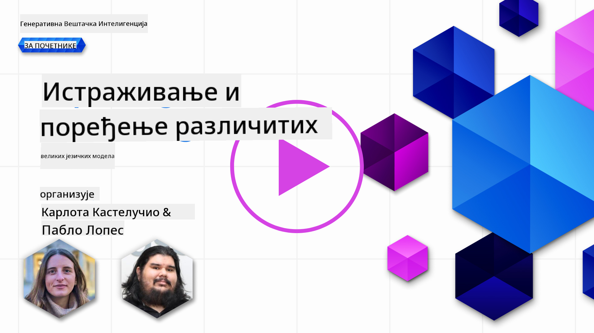
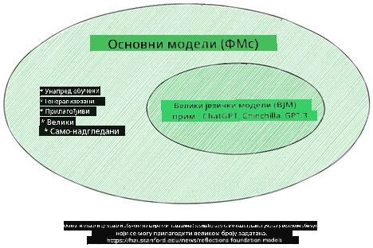
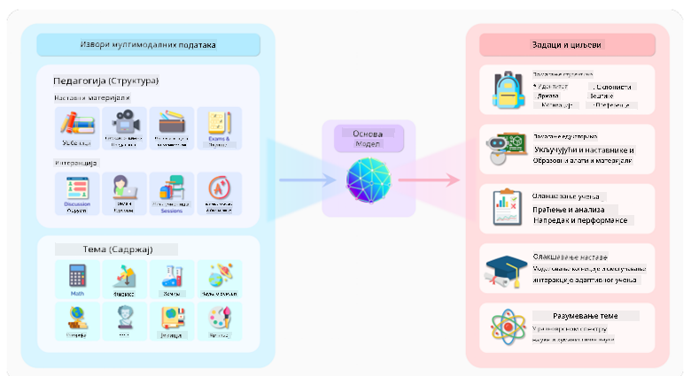
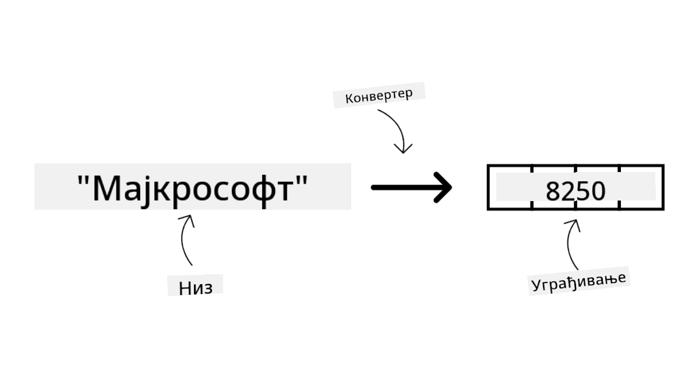
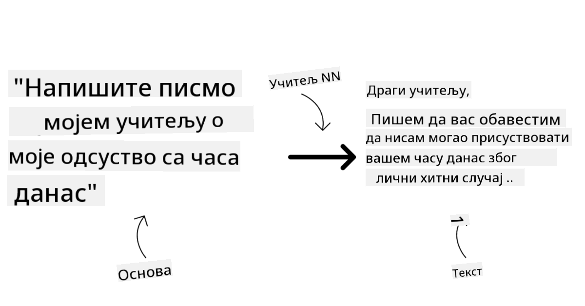
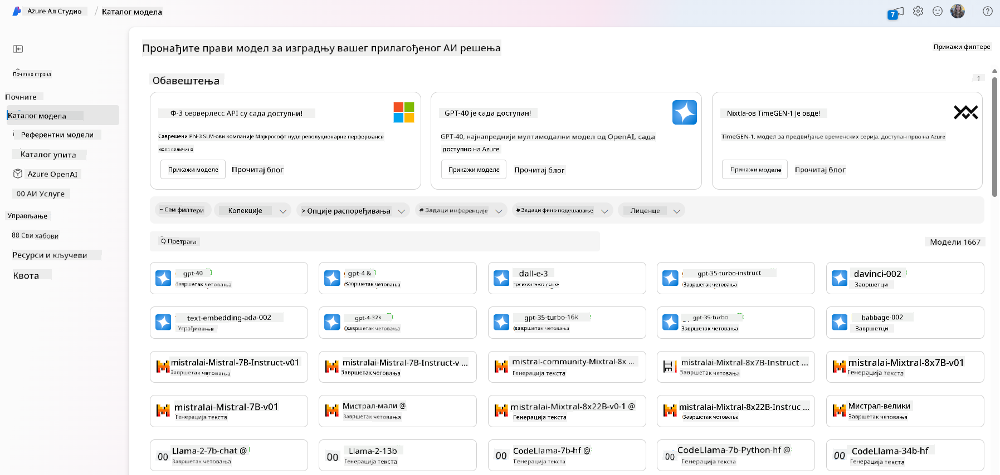
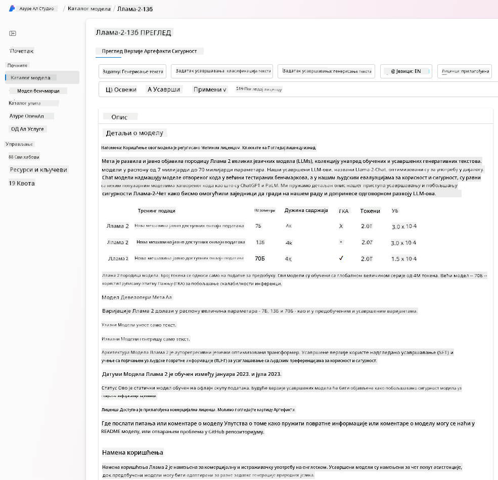
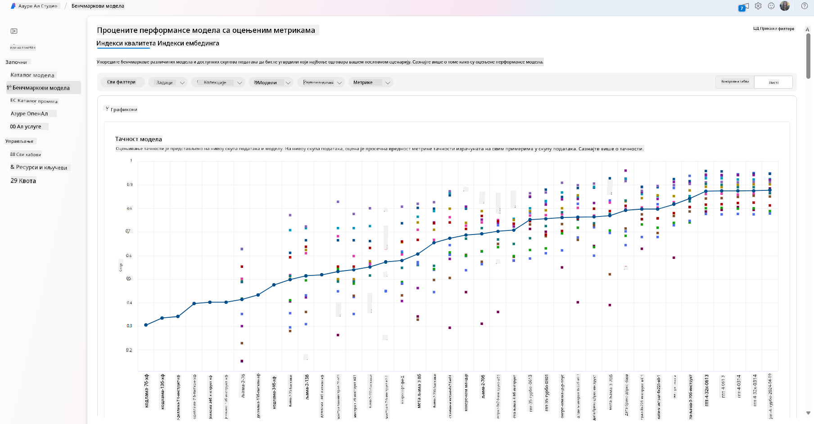
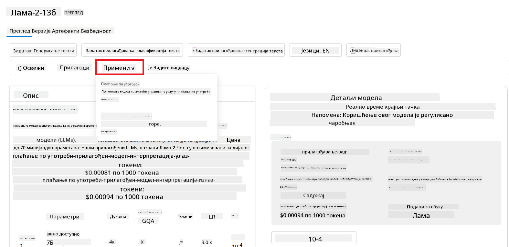
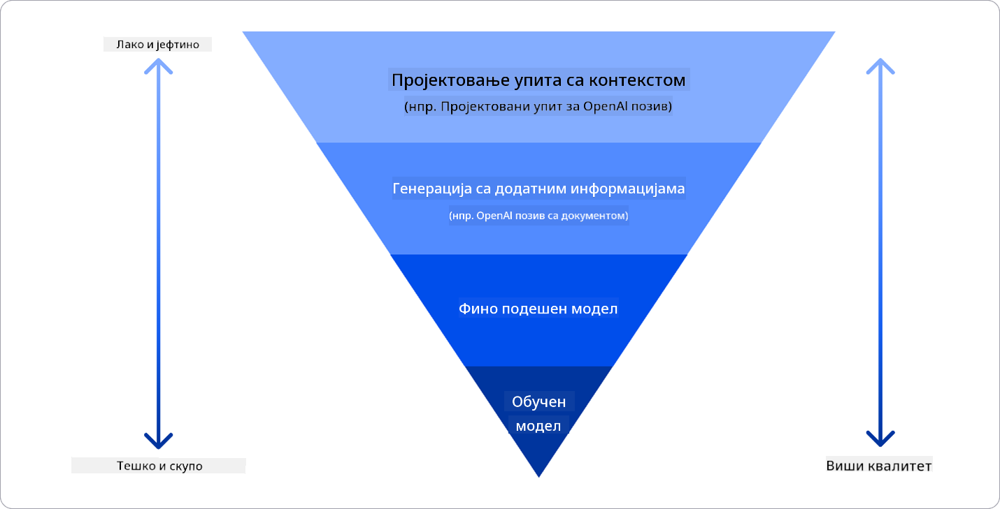

<!--
CO_OP_TRANSLATOR_METADATA:
{
  "original_hash": "e2f686f2eb794941761252ac5e8e090b",
  "translation_date": "2025-07-09T08:41:15+00:00",
  "source_file": "02-exploring-and-comparing-different-llms/README.md",
  "language_code": "sr"
}
-->
# Истраживање и поређење различитих LLM модела

> _Кликните на слику изнад да бисте погледали видео о овој лекцији_

У претходној лекцији смо видели како генеративна вештачка интелигенција мења технолошки пејзаж, како функционишу Large Language Models (LLM) и како један бизнис – као наш стартап – може да их примени у својим случајевима употребе и расте! У овом поглављу ћемо упоредити и размотрити различите типове великих језичких модела (LLM) како бисмо разумели њихове предности и мане.

Следећи корак у путовању нашег стартапа је истраживање тренутног пејзажа LLM модела и разумевање који су погодни за наш случај употребе.

## Увод

Ова лекција ће обухватити:

- Различите типове LLM модела у тренутном пејзажу.
- Тестирање, итерацију и поређење различитих модела за ваш случај употребе у Azure-у.
- Како се имплементира LLM.

## Циљеви учења

Након завршетка ове лекције, моћи ћете да:

- Изаберете прави модел за ваш случај употребе.
- Разумете како да тестирате, итеративно побољшавате и унапређујете перформансе вашег модела.
- Знате како бизниси имплементирају моделе.

## Разумевање различитих типова LLM модела

LLM модели могу имати више категорија у зависности од архитектуре, података за обуку и случаја употребе. Разумевање ових разлика ће помоћи нашем стартапу да одабере прави модел за одређени сценарио, као и да разуме како да тестирамо, итеративно побољшавамо и унапређујемо перформансе.

Постоји много различитих типова LLM модела, а избор зависи од тога за шта их планирате користити, ваших података, колико сте спремни да платите и других фактора.

У зависности од тога да ли желите да користите моделе за текст, аудио, видео, генерисање слика и слично, можда ћете изабрати другачији тип модела.

- **Аудио и препознавање говора**. За ову сврху, Whisper тип модели су одличан избор јер су опште намене и намењени препознавању говора. Тренирани су на разноврсним аудио подацима и могу да обављају мултилингвално препознавање говора. Сазнајте више о [Whisper типовима модела овде](https://platform.openai.com/docs/models/whisper?WT.mc_id=academic-105485-koreyst).

- **Генерисање слика**. За генерисање слика, DALL-E и Midjourney су два веома позната избора. DALL-E је доступан преко Azure OpenAI. [Прочитајте више о DALL-E овде](https://platform.openai.com/docs/models/dall-e?WT.mc_id=academic-105485-koreyst) и такође у Поглављу 9 овог курикулума.

- **Генерисање текста**. Већина модела је обучена за генерисање текста и имате велики избор од GPT-3.5 до GPT-4. Они долазе по различитим ценама, при чему је GPT-4 најскупљи. Вреди погледати [Azure OpenAI playground](https://oai.azure.com/portal/playground?WT.mc_id=academic-105485-koreyst) како бисте проценили који модели најбоље одговарају вашим потребама у погледу могућности и цене.

- **Мултимодалност**. Ако желите да обрађујете више типова података у улазу и излазу, можда ћете желети да погледате моделе као што су [gpt-4 turbo са визијом или gpt-4o](https://learn.microsoft.com/azure/ai-services/openai/concepts/models#gpt-4-and-gpt-4-turbo-models?WT.mc_id=academic-105485-koreyst) – најновија издања OpenAI модела – који могу да комбинују обраду природног језика са визуелним разумевањем, омогућавајући интеракције кроз мултимодалне интерфејсе.

Избор модела значи да добијате неке основне могућности, али то можда неће бити довољно. Често имате податке специфичне за компанију које на неки начин треба да пренесете LLM моделу. Постоји неколико различитих приступа томе, о чему ће бити више речи у наредним одељцима.

### Foundation модели у односу на LLM

Термин Foundation Model је [скован од стране истраживача са Стенфорда](https://arxiv.org/abs/2108.07258?WT.mc_id=academic-105485-koreyst) и дефинисан као AI модел који испуњава неке критеријуме, као што су:

- **Обучавају се коришћењем ненадгледаног или самонадгледаног учења**, што значи да су обучени на мултимодалним подацима без ознака и не захтевају људску анотацију или означавање података током процеса обуке.
- **Веома су велики модели**, засновани на дубоким неуронским мрежама обученим на милијардама параметара.
- **Обично су намењени да служе као ‘основа’ за друге моделе**, што значи да се могу користити као полазна тачка за изградњу других модела, што се може урадити фино подешавање.

Извор слике: [Essential Guide to Foundation Models and Large Language Models | by Babar M Bhatti | Medium](https://thebabar.medium.com/essential-guide-to-foundation-models-and-large-language-models-27dab58f7404)

Да бисмо додатно појаснили ову разлику, узмимо ChatGPT као пример. За изградњу прве верзије ChatGPT-а, модел под називом GPT-3.5 је служио као foundation модел. То значи да је OpenAI користио неке податке специфичне за ћаскање како би креирао подешену верзију GPT-3.5 која је специјализована за добре перформансе у разговорним сценаријима, као што су чатботови.

Извор слике: [2108.07258.pdf (arxiv.org)](https://arxiv.org/pdf/2108.07258.pdf?WT.mc_id=academic-105485-koreyst)

### Отворени код у односу на власничке моделе

Још један начин да се категоришу LLM модели је да ли су отвореног кода или власнички.

Отворени модели су модели који су доступни јавности и могу их користити сви. Често их објављује компанија која их је направила или истраживачка заједница. Ови модели могу да се прегледају, модификују и прилагоде за различите случајеве употребе LLM модела. Међутим, они нису увек оптимизовани за производну употребу и можда нису тако ефикасни као власнички модели. Поред тога, финансирање за отворене моделе може бити ограничено, и можда неће бити дугорочно одржавани или ажурирани са најновијим истраживањима. Примери популарних отворених модела укључују [Alpaca](https://crfm.stanford.edu/2023/03/13/alpaca.html?WT.mc_id=academic-105485-koreyst), [Bloom](https://huggingface.co/bigscience/bloom) и [LLaMA](https://llama.meta.com).

Власнички модели су модели које поседује компанија и нису доступни јавности. Често су оптимизовани за производну употребу. Међутим, није дозвољено да се прегледају, модификују или прилагођавају за различите случајеве употребе. Такође, нису увек доступни бесплатно и могу захтевати претплату или плаћање за коришћење. Корисници немају контролу над подацима који се користе за обуку модела, што значи да морају веровати власнику модела да ће обезбедити поштовање приватности података и одговорну употребу AI. Примери популарних власничких модела укључују [OpenAI моделе](https://platform.openai.com/docs/models/overview?WT.mc_id=academic-105485-koreyst), [Google Bard](https://sapling.ai/llm/bard?WT.mc_id=academic-105485-koreyst) и [Claude 2](https://www.anthropic.com/index/claude-2?WT.mc_id=academic-105485-koreyst).

### Ембединг у односу на генерисање слика у односу на генерисање текста и кода

LLM модели се такође могу категорисати према типу излаза који генеришу.

Ембединг модели су скуп модела који могу претворити текст у нумерички облик, зван ембединг, што је нумеричка репрезентација улазног текста. Ембединг олакшава машинама да разумеју односе између речи или реченица и могу се користити као улаз за друге моделе, као што су модели за класификацију или кластеровање који боље раде са нумеричким подацима. Ембединг модели се често користе за трансфер учење, где се модел гради за заменски задатак за који постоји обиље података, а затим се тежине модела (ембединг) поново користе за друге задатке. Пример ове категорије су [OpenAI embeddings](https://platform.openai.com/docs/models/embeddings?WT.mc_id=academic-105485-koreyst).

Модели за генерисање слика су модели који генеришу слике. Често се користе за уређивање слика, синтезу слика и превођење слика. Ови модели су обично обучени на великим скуповима слика, као што је [LAION-5B](https://laion.ai/blog/laion-5b/?WT.mc_id=academic-105485-koreyst), и могу се користити за генерисање нових слика или уређивање постојећих слика помоћу техника као што су инпејнтинг, супер резолуција и колоризација. Примери укључују [DALL-E-3](https://openai.com/dall-e-3?WT.mc_id=academic-105485-koreyst) и [Stable Diffusion моделе](https://github.com/Stability-AI/StableDiffusion?WT.mc_id=academic-105485-koreyst).

Модели за генерисање текста и кода су модели који генеришу текст или код. Често се користе за резимирање текста, превођење и одговарање на питања. Модели за генерисање текста су обично обучени на великим скуповима текста, као што је [BookCorpus](https://www.cv-foundation.org/openaccess/content_iccv_2015/html/Zhu_Aligning_Books_and_ICCV_2015_paper.html?WT.mc_id=academic-105485-koreyst), и могу се користити за генерисање новог текста или одговарање на питања. Модели за генерисање кода, као што је [CodeParrot](https://huggingface.co/codeparrot?WT.mc_id=academic-105485-koreyst), обучени су на великим скуповима кода, као што је GitHub, и могу се користити за генерисање новог кода или исправљање грешака у постојећем коду.

### Encoder-Decoder у односу на Decoder-only

Да бисмо разговарали о различитим типовима архитектура LLM модела, користићемо аналогни пример.

Замислите да вам је менаџер дао задатак да направите квиз за студенте. Имате два колеге; један је задужен за креирање садржаја, а други за преглед.

Креатор садржаја је као Decoder only модел, он може да погледа тему и види шта сте већ написали, а затим може да напише курс на основу тога. Врло су добри у писању занимљивог и информативног садржаја, али нису баш добри у разумевању теме и циљева учења. Неки примери Decoder модела су GPT породични модели, као што је GPT-3.

Прегледач је као Encoder only модел, он гледа написани курс и одговоре, примећује везу између њих и разуме контекст, али није добар у генерисању садржаја. Пример Encoder only модела је BERT.

Замислите да можемо имати некога ко може и да креира и да прегледа квиз, то је Encoder-Decoder модел. Неки примери су BART и T5.

### Сервис у односу на модел

Сада, хајде да причамо о разлици између сервиса и модела. Сервис је производ који нуди Cloud Service Provider и често је комбинација модела, података и других компоненти. Модел је основни део сервиса и често је foundation модел, као што је LLM.

Сервиси су често оптимизовани за производну употребу и обично су лакши за коришћење од модела, преко графичког корисничког интерфејса. Међутим, сервиси нису увек бесплатни и могу захтевати претплату или плаћање за коришћење, у замену за коришћење опреме и ресурса власника сервиса, оптимизацију трошкова и лако скалирање. Пример сервиса је [Azure OpenAI Service](https://learn.microsoft.com/azure/ai-services/openai/overview?WT.mc_id=academic-105485-koreyst), који нуди модел плаћања по коришћењу, што значи да корисници плаћају пропорционално колико користе сервис. Такође, Azure OpenAI Service нуди безбедност на нивоу предузећа и оквир за одговорну употребу AI изнад могућности модела.

Модели су само неуронске мреже, са параметрима, тежинама и осталим. Компаније могу да их покрећу локално, али би у том случају морале да купе опрему, изграде структуру за скалирање и купе лиценцу или користе модел отвореног кода. Модел као што је LLaMA је доступан за коришћење, али захтева рачунарску снагу за покретање.

## Како тестирати и итеративно радити са различитим моделима да бисте разумели перформансе у Azure-у

Када наш тим истражи тренутни пејзаж LLM модела и идентификује неке добре кандидате за своје сценарије, следећи корак је да их тестирају на својим подацима и радном оптерећењу. Ово је итеративни процес, који се обавља кроз експерименте и мерења.
Većina modela koje smo pomenuli u prethodnim paragrafima (OpenAI modeli, modeli otvorenog koda poput Llama2 i Hugging Face transformeri) dostupni su u [Model Catalog](https://learn.microsoft.com/azure/ai-studio/how-to/model-catalog-overview?WT.mc_id=academic-105485-koreyst) u [Azure AI Studio](https://ai.azure.com/?WT.mc_id=academic-105485-koreyst).

[Azure AI Studio](https://learn.microsoft.com/azure/ai-studio/what-is-ai-studio?WT.mc_id=academic-105485-koreyst) је облачна платформа дизајнирана за програмере да креирају генеративне AI апликације и управљају целим развојним циклусом – од експериментисања до евалуације – комбинујући све Azure AI услуге у један централни хаб са практичним графичким интерфејсом. Model Catalog у Azure AI Studio омогућава кориснику да:

- Пронађе Foundation Model од интереса у каталогу – било власнички или отвореног кода, филтрирајући по задатку, лиценци или имену. Да би претрага била лакша, модели су организовани у колекције, као што су Azure OpenAI колекција, Hugging Face колекција и друге.

- Прегледа model card, укључујући детаљан опис намењене употребе и података за тренирање, примере кода и резултате евалуације из интерне библиотеке за процену.

- Упореди бенчмаркове између модела и скупова података доступних у индустрији како би проценио који најбоље одговара пословном сценарију, преко [Model Benchmarks](https://learn.microsoft.com/azure/ai-studio/how-to/model-benchmarks?WT.mc_id=academic-105485-koreyst) панела.

- Фино подеси модел на прилагођеним подацима за тренирање како би побољшао перформансе модела у специфичном оптерећењу, користећи могућности експериментисања и праћења у Azure AI Studio.

- Деплојује оригинални претходно обучени модел или фино подешену верзију на удаљени real time inference – управљани рачунарски ресурс – или serverless API endpoint – [pay-as-you-go](https://learn.microsoft.com/azure/ai-studio/how-to/model-catalog-overview#model-deployment-managed-compute-and-serverless-api-pay-as-you-go?WT.mc_id=academic-105485-koreyst) – како би апликације могле да га користе.

> [!NOTE]
> Ни сви модели у каталогу тренутно нису доступни за фино подешавање и/или pay-as-you-go деплојмент. Погледајте model card за детаље о могућностима и ограничењима модела.

## Побољшање резултата LLM-а

Истраживали смо са нашим стартап тимом различите врсте LLM-ова и Cloud Platform (Azure Machine Learning) која нам омогућава да упоредимо различите моделе, евалуирамо их на тест подацима, побољшамо перформансе и деплојујемо их на inference endpoint-ове.

Али када треба размотрити фино подешавање модела уместо коришћења претходно обученог? Постоје ли други приступи за побољшање перформанси модела на специфичним задацима?

Постоји неколико приступа које посао може користити да добије жељене резултате од LLM-а. Можете одабрати различите типове модела са различитим степеном обучености приликом деплоја LLM-а у продукцију, са различитим нивоима сложености, трошкова и квалитета. Ево неких приступа:

- **Prompt engineering са контекстом**. Идеја је да се обезбеди довољно контекста приликом слања упита како бисте добили потребне одговоре.

- **Retrieval Augmented Generation, RAG**. Ваши подаци могу постојати у бази података или веб endpoint-у, на пример, и да бисте осигурали да ти подаци, или њихов део, буду укључени у тренутку слања упита, можете дохватити релевантне податке и укључити их у кориснички упит.

- **Фино подешен модел**. Овде сте додатно обучавали модел на својим подацима, што је довело до тога да модел буде прецизнији и боље одговара вашим потребама, али може бити скупље.

Извор слике: [Four Ways that Enterprises Deploy LLMs | Fiddler AI Blog](https://www.fiddler.ai/blog/four-ways-that-enterprises-deploy-llms?WT.mc_id=academic-105485-koreyst)

### Prompt Engineering са контекстом

Претходно обучени LLM-и веома добро раде на општим задацима природног језика, чак и када им се упути кратак упит, као што је реченица за допуну или питање – такозвано „zero-shot“ учење.

Међутим, што корисник боље формулише свој упит, са детаљним захтевом и примерима – Контекстом – одговор ће бити прецизнији и ближи очекивањима корисника. У овом случају говоримо о „one-shot“ учењу ако упит садржи само један пример и „few-shot“ учењу ако садржи више примера.
Prompt engineering са контекстом је најисплативији приступ за почетак.

### Retrieval Augmented Generation (RAG)

LLM-и имају ограничење да могу користити само податке који су коришћени током њихове обуке за генерисање одговора. То значи да не знају ништа о догађајима који су се десили након процеса обуке и не могу приступити непубличним информацијама (као што су подаци компаније).
Ово се може превазићи коришћењем RAG технике, која допуњује упит спољним подацима у виду делова докумената, узимајући у обзир ограничења дужине упита. Ово подржавају алати за векторску базу података (као што је [Azure Vector Search](https://learn.microsoft.com/azure/search/vector-search-overview?WT.mc_id=academic-105485-koreyst)) који дохватају корисне делове из различитих унапред дефинисаних извора података и додају их у контекст упита.

Ова техника је веома корисна када посао нема довољно података, времена или ресурса за фино подешавање LLM-а, али ипак жели да побољша перформансе на специфичном задатку и смањи ризик од измишљања чињеница, односно мистификације стварности или штетног садржаја.

### Фино подешен модел

Фино подешавање је процес који користи transfer learning да „прилагоди“ модел за одређени задатак или решавање специфичног проблема. За разлику од few-shot учења и RAG-а, резултира генерисањем новог модела са ажурираним тежинама и пристрасностима. Захтева скуп примера за тренирање који се састоји од једног улаза (упита) и његовог повезаног излаза (одговора).
Ово би био пожељан приступ ако:

- **Користите фино подешене моделе**. Посао жели да користи фино подешене мање способне моделе (као што су embedding модели) уместо високоперформантних, што резултира исплативијим и бржим решењем.

- **Разматрате латенцију**. Латенција је важна за одређену примену, па није могуће користити веома дуге упите или број примера које модел треба да научи не одговара ограничењу дужине упита.

- **Желите да останете у току**. Посао има много квалитетних података и ground truth ознака и ресурсе потребне да одржава те податке ажурним током времена.

### Обучен модел

Обучавање LLM-а од нуле је без сумње најтежи и најсложенији приступ, који захтева огромне количине података, стручне ресурсе и одговарајућу рачунарску снагу. Ова опција треба да се разматра само у сценарију где посао има доменски специфичан случај употребе и велику количину доменски оријентисаних података.

## Провера знања

Који би био добар приступ за побољшање резултата LLM-а?

1. Prompt engineering са контекстом  
1. RAG  
1. Фино подешен модел

A:3, ако имате време, ресурсе и квалитетне податке, фино подешавање је боља опција да останете у току. Међутим, ако желите брзе резултате и немате довољно времена, вреди прво размотрити RAG.

## 🚀 Изазов

Прочитајте више о томе како можете [користити RAG](https://learn.microsoft.com/azure/search/retrieval-augmented-generation-overview?WT.mc_id=academic-105485-koreyst) за свој посао.

## Одличан посао, наставите са учењем

Након завршетка ове лекције, погледајте нашу [Generative AI Learning collection](https://aka.ms/genai-collection?WT.mc_id=academic-105485-koreyst) да наставите да унапређујете своје знање о генеративном AI-ју!

Прелазите на Лекцију 3 где ћемо погледати како да [одговорно градимо са генеративним AI-јем](../03-using-generative-ai-responsibly/README.md?WT.mc_id=academic-105485-koreyst)!

**Одрицање од одговорности**:  
Овај документ је преведен коришћењем AI преводилачке услуге [Co-op Translator](https://github.com/Azure/co-op-translator). Иако се трудимо да превод буде тачан, молимо вас да имате у виду да аутоматски преводи могу садржати грешке или нетачности. Оригинални документ на његовом изворном језику треба сматрати ауторитетним извором. За критичне информације препоручује се професионални људски превод. Нисмо одговорни за било каква неспоразума или погрешна тумачења која произилазе из коришћења овог превода.