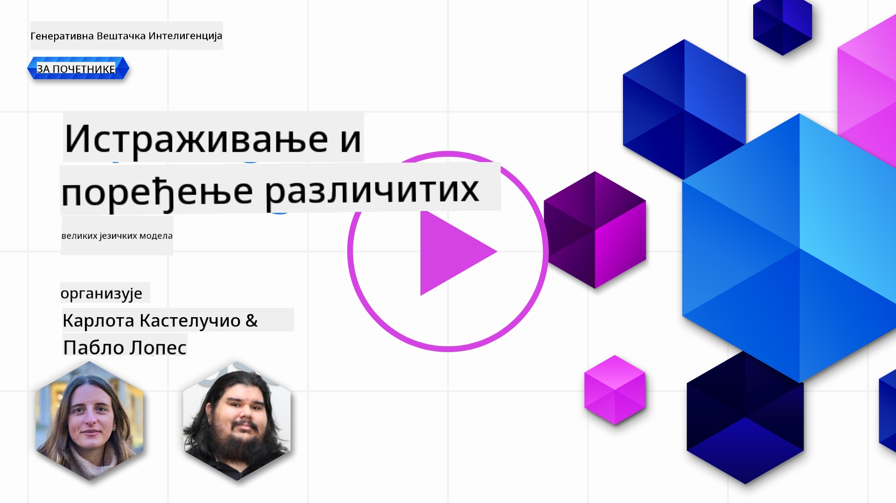
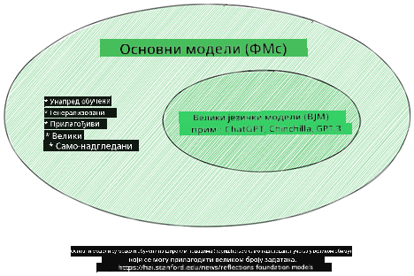
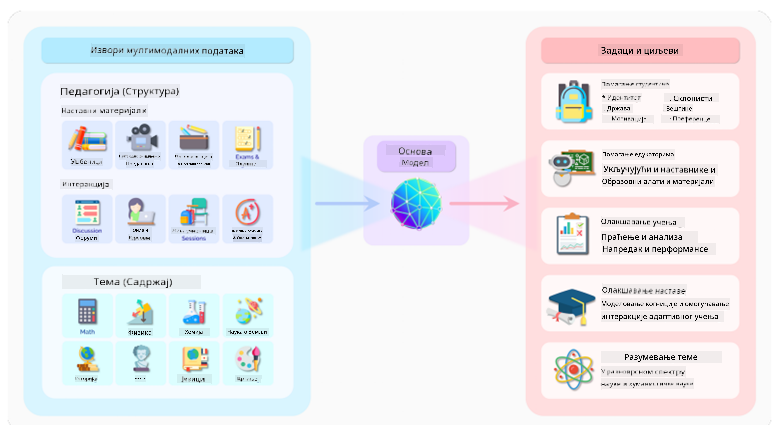
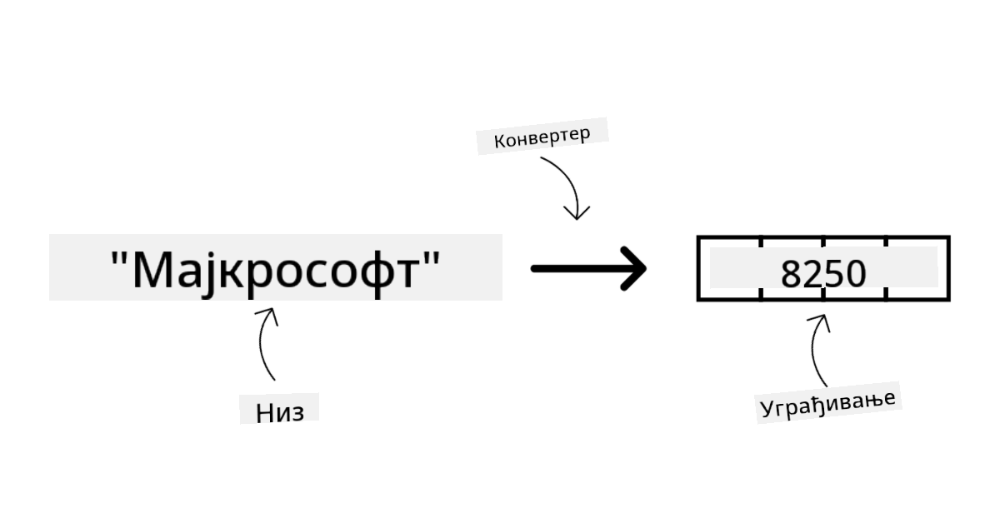
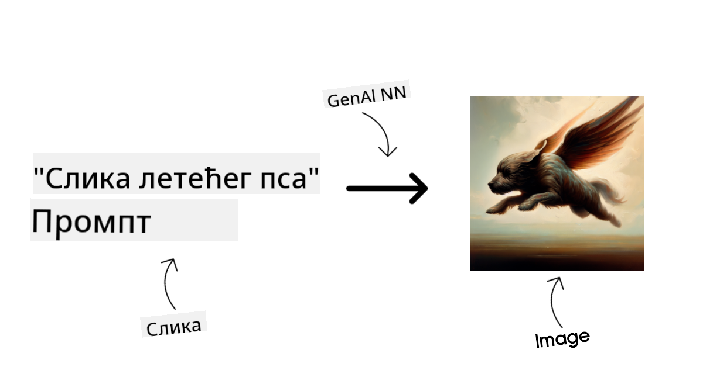
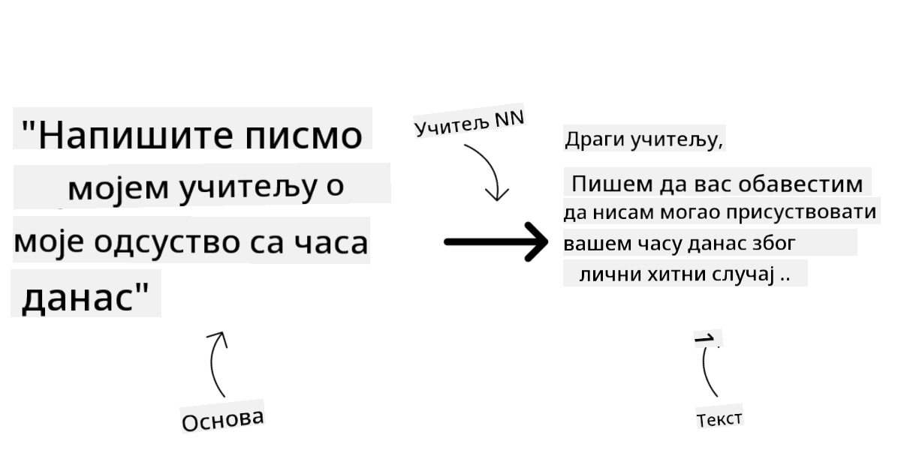
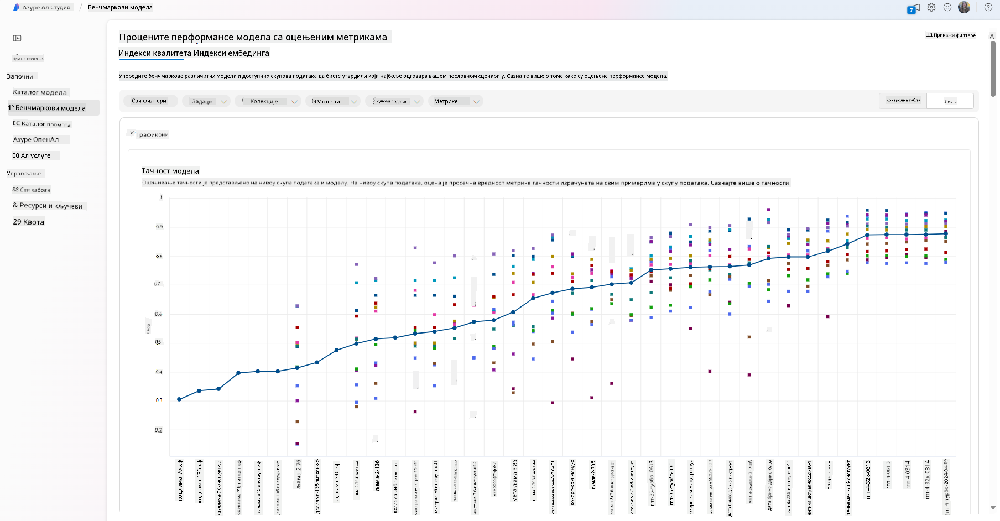
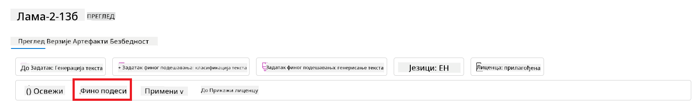
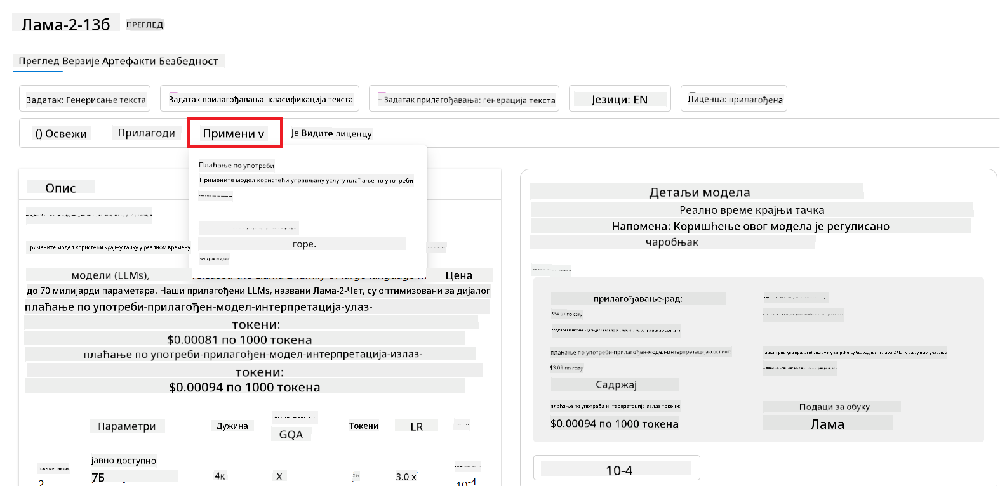
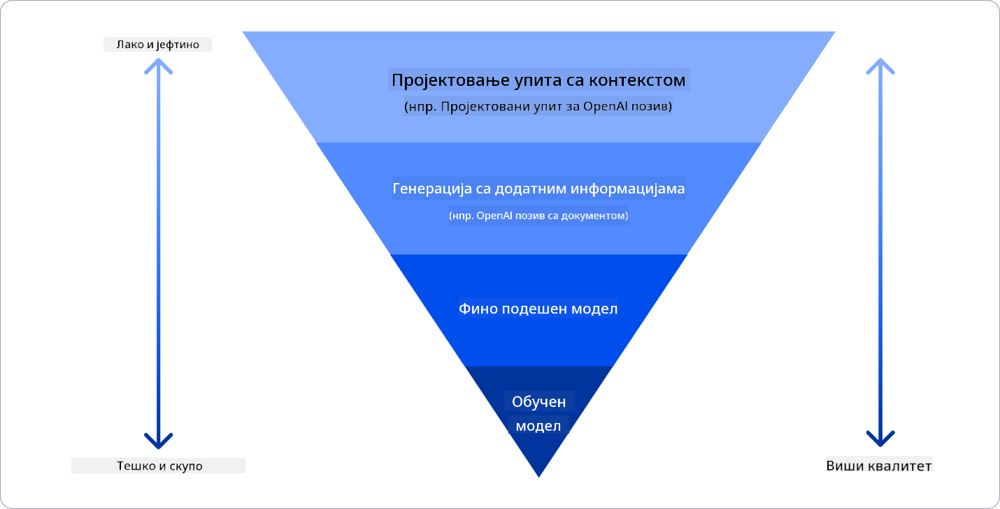

<!--
CO_OP_TRANSLATOR_METADATA:
{
  "original_hash": "e2f686f2eb794941761252ac5e8e090b",
  "translation_date": "2025-06-25T11:02:59+00:00",
  "source_file": "02-exploring-and-comparing-different-llms/README.md",
  "language_code": "sr"
}
-->
# Истраживање и поређење различитих LLM-ова

> _Кликните на слику изнад да бисте погледали видео о овој лекцији_

У претходној лекцији смо видели како Генеративна вештачка интелигенција мења технолошки пејзаж, како функционишу Велики језички модели (LLM) и како их једна компанија - попут нашег стартапа - може применити у својим случајевима употребе и расти! У овом поглављу ћемо упоредити и супротставити различите типове великих језичких модела (LLM) како бисмо разумели њихове предности и мане.

Следећи корак на путу нашег стартапа је истраживање тренутног пејзажа LLM-ова и разумевање који су погодни за наш случај употребе.

## Увод

Ова лекција ће покрити:

- Различите типове LLM-ова у тренутном пејзажу.
- Тестирање, итерацију и поређење различитих модела за ваш случај употребе у Azure.
- Како применити LLM.

## Циљеви учења

Након завршетка ове лекције, бићете у стању да:

- Изаберете прави модел за ваш случај употребе.
- Разумете како тестирати, итератирати и побољшати перформансе вашег модела.
- Знате како компаније примењују моделе.

## Разумевање различитих типова LLM-ова

LLM-ови могу имати више категоризација заснованих на њиховој архитектури, подацима за обуку и случају употребе. Разумевање ових разлика ће помоћи нашем стартапу да изабере прави модел за сценарио и разуме како тестирати, итератирати и побољшати перформансе.

Постоји много различитих типова LLM модела, ваш избор модела зависи од тога за шта их намеравате користити, ваших података, колико сте спремни да платите и више.

У зависности од тога да ли намеравате да користите моделе за текст, аудио, видео, генерисање слика и тако даље, можда ћете изабрати другачији тип модела.

- **Препознавање говора и звука**. За ову сврху, модели типа Whisper су одличан избор јер су опште намене и усмерени на препознавање говора. Обучени су на разноврсном аудио материјалу и могу изводити мултијезичко препознавање говора. Сазнајте више о [Whisper типовима модела овде](https://platform.openai.com/docs/models/whisper?WT.mc_id=academic-105485-koreyst).

- **Генерисање слика**. За генерисање слика, DALL-E и Midjourney су два веома позната избора. DALL-E нуди Azure OpenAI. [Прочитајте више о DALL-E овде](https://platform.openai.com/docs/models/dall-e?WT.mc_id=academic-105485-koreyst) и такође у поглављу 9 овог курикулума.

- **Генерисање текста**. Већина модела је обучена за генерисање текста и имате велики избор од GPT-3.5 до GPT-4. Они долазе по различитим ценама, при чему је GPT-4 најскупљи. Вреди погледати [Azure OpenAI playground](https://oai.azure.com/portal/playground?WT.mc_id=academic-105485-koreyst) да бисте проценили који модели најбоље одговарају вашим потребама у смислу способности и трошкова.

- **Мулти-модалност**. Ако желите да обрадите више типова података у улазу и излазу, можда ћете желети да погледате моделе попут [gpt-4 turbo са визијом или gpt-4o](https://learn.microsoft.com/azure/ai-services/openai/concepts/models#gpt-4-and-gpt-4-turbo-models?WT.mc_id=academic-105485-koreyst) - најновије издање OpenAI модела - који су способни да комбинују обраду природног језика са визуелним разумевањем, омогућавајући интеракције кроз мулти-модалне интерфејсе.

Избор модела значи да добијате неке основне способности, које можда неће бити довољне. Често имате специфичне податке компаније које некако треба да кажете LLM-у. Постоји неколико различитих избора како приступити томе, више о томе у наредним одељцима.

### Основни модели наспрам LLM-ова

Термин Основни модел је [скован од стране истраживача са Станфорда](https://arxiv.org/abs/2108.07258?WT.mc_id=academic-105485-koreyst) и дефинисан је као AI модел који прати неке критеријуме, као што су:

- **Они су обучени коришћењем неконтролисаног учења или самоконтролисаног учења**, што значи да су обучени на ненаметнутим мултимодалним подацима и не захтевају људску анотацију или означавање података за њихов процес обуке.
- **Они су веома велики модели**, засновани на веома дубоким неуронским мрежама обученим на милијардама параметара.
- **Они су обично намењени да служе као 'основа' за друге моделе**, што значи да могу бити коришћени као почетна тачка за друге моделе који се могу изградити на њима, што се може урадити фино подешавањем.

Извор слике: [Основни водич за основне моделе и велике језичке моделе | аутор Бабар М Бхати | Medium](https://thebabar.medium.com/essential-guide-to-foundation-models-and-large-language-models-27dab58f7404)

Да бисмо даље разјаснили ову разлику, узмимо ChatGPT као пример. За изградњу прве верзије ChatGPT-а, модел зван GPT-3.5 је служио као основни модел. То значи да је OpenAI користио неке податке специфичне за разговоре да би створио подешену верзију GPT-3.5 која је била специјализована за добро извођење у сценаријима разговора, као што су четботови.

Извор слике: [2108.07258.pdf (arxiv.org)](https://arxiv.org/pdf/2108.07258.pdf?WT.mc_id=academic-105485-koreyst)

### Отворени код наспрам власничких модела

Још један начин категоризације LLM-ова је да ли су они отвореног кода или власнички.

Модели отвореног кода су модели који су доступни јавности и могу их користити сви. Често их чини доступним компанија која их је створила или истраживачка заједница. Ови модели се могу прегледати, модификовати и прилагодити за различите случајеве употребе у LLM-овима. Међутим, они нису увек оптимизовани за производну употребу и можда неће бити тако перформантни као власнички модели. Поред тога, финансирање за моделе отвореног кода може бити ограничено и можда неће бити одржавани дугорочно или можда неће бити ажурирани са најновијим истраживањима. Примери популарних модела отвореног кода укључују [Alpaca](https://crfm.stanford.edu/2023/03/13/alpaca.html?WT.mc_id=academic-105485-koreyst), [Bloom](https://huggingface.co/bigscience/bloom) и [LLaMA](https://llama.meta.com).

Власнички модели су модели који су у власништву компаније и нису доступни јавности. Ови модели су често оптимизовани за производну употребу. Међутим, није дозвољено да се прегледају, модификују или прилагођавају за различите случајеве употребе. Поред тога, они нису увек доступни бесплатно и можда ће захтевати претплату или плаћање за коришћење. Такође, корисници немају контролу над подацима који се користе за обуку модела, што значи да би требало да верују власнику модела да обезбеди посвећеност приватности података и одговорну употребу AI. Примери популарних власничких модела укључују [OpenAI моделе](https://platform.openai.com/docs/models/overview?WT.mc_id=academic-105485-koreyst), [Google Bard](https://sapling.ai/llm/bard?WT.mc_id=academic-105485-koreyst) или [Claude 2](https://www.anthropic.com/index/claude-2?WT.mc_id=academic-105485-koreyst).

### Уграђивање наспрам генерисања слика наспрам генерисања текста и кода

LLM-ови се такође могу категорисати према излазу који генеришу.

Уграђивања су скуп модела који могу претворити текст у нумерички облик, звано уграђивање, што је нумеричка репрезентација улазног текста. Уграђивања олакшавају машинама да разумеју односе између речи или реченица и могу се користити као улази за друге моделе, као што су модели класификације или модели кластерисања који имају боље перформансе на нумеричким подацима. Модели уграђивања се често користе за трансфер учење, где се модел гради за сурогат задатак за који постоји обиље података, а затим се тежине модела (уграђивања) поново користе за друге задатке. Пример ове категорије је [OpenAI уграђивања](https://platform.openai.com/docs/models/embeddings?WT.mc_id=academic-105485-koreyst).

Модели за генерисање слика су модели који генеришу слике. Ови модели се често користе за уређивање слика, синтезу слика и превођење слика. Модели за генерисање слика се често обучавају на великим скуповима података слика, као што је [LAION-5B](https://laion.ai/blog/laion-5b/?WT.mc_id=academic-105485-koreyst), и могу се користити за генерисање нових слика или за уређивање постојећих слика са техникама као што су инпаинтинг, супер-резолуција и колоризација. Примери укључују [DALL-E-3](https://openai.com/dall-e-3?WT.mc_id=academic-105485-koreyst) и [Stable Diffusion моделе](https://github.com/Stability-AI/StableDiffusion?WT.mc_id=academic-105485-koreyst).

Модели за генерисање текста и кода су модели који генеришу текст или код. Ови модели се често користе за резиме текста, превођење и одговарање на питања. Модели за генерисање текста се често обучавају на великим скуповима података текста, као што је [BookCorpus](https://www.cv-foundation.org/openaccess/content_iccv_2015/html/Zhu_Aligning_Books_and_ICCV_2015_paper.html?WT.mc_id=academic-105485-koreyst), и могу се користити за генерисање новог текста или за одговарање на питања. Модели за генерисање кода, попут [CodeParrot](https://huggingface.co/codeparrot?WT.mc_id=academic-105485-koreyst), се често обучавају на великим скуповима података кода, као што је GitHub, и могу се користити за генерисање новог кода или за исправљање грешака у постојећем коду.

### Енкодер-Декодер наспрам само Декодера

Да бисмо разговарали о различитим типовима архитектура LLM-ова, користићемо аналогију.

Замислите да вам је менаџер дао задатак да напишете квиз за студенте. Имате два колеге; један надгледа креирање садржаја, а други надгледа прегледање.

Креатор садржаја је као модел само Декодера, они могу погледати тему и видети шта сте већ написали и онда написати курс на основу тога. Они су веома добри у писању занимљивог и информативног садржаја, али нису веома добри у разумевању теме и циљева учења. Неки примери модела само Декодера су GPT породични модели, као што је GPT-3.

Рецензент је као модел само Енкодера, они гледају на написани курс и одговоре, примећујући однос између њих и разумејући контекст, али нису добри у генерисању садржаја. Пример модела само Енкодера био би BERT.

Замислите да можемо имати и некога ко би могао креирати и прегледати квиз, то је модел Енкодер-Декодер. Неки примери би били BART и T5.

### Услуга наспрам Модела

Сада, хајде да разговарамо о разлици између услуге и модела. Услуга је производ који нуди пружалац услуга у облаку и често је комбинација модела, података и других компоненти. Модел је основна компонента услуге и често је основни модел, као што је LLM.

Услуге су често оптимизоване за производну употребу и често су лакше за коришћење него модели, преко графичког корисничког интерфејса. Међутим, услуге нису увек доступне бесплатно и могу захтевати претплату или плаћање за коришћење, у замену за коришћење опреме и ресурса власника услуге, оптимизацију трошкова и лако скалирање. Пример услуге је [Azure OpenAI услуга](https://learn.microsoft.com/azure/ai-services/openai/overview?WT.mc_id=academic-105485-koreyst), која нуди план цене по употреби, што значи да се корисници наплаћују пропорционално колико користе услугу. Такође, Azure OpenAI услуга нуди сигурност на нивоу предузећа и одговоран AI оквир на врху могућности модела.

Модели су само Неуронска мрежа, са параметрима, тежинама и осталим. Омогућавају компанијама да раде локално, међутим, било би потребно купити опрему, изградити структуру за скалирање и купити лиценцу или користити модел отвореног кода. Модел као што је LLaMA је доступан за коришћење, захтевајући рачунарску снагу за покретање модела.

## Како тестирати и итератирати са различитим моделима да бисте разумели перформансе на Azure

Када наш тим истражи тренутни пејзаж LLM-ова и идентификује неке добре кандидате за своје сценарије, следећи корак је тестирање на њиховим подацима и на њиховом радном оптерећењу. Ово је итеративан процес, који се ради експериментима и
- Упоредите бенчмаркове међу моделима и скуповима података доступним у индустрији да процените који одговара пословном сценарију, преко панела [Model Benchmarks](https://learn.microsoft.com/azure/ai-studio/how-to/model-benchmarks?WT.mc_id=academic-105485-koreyst).

- Прилагодите модел на прилагођеним подацима за обуку да бисте побољшали перформансе модела у одређеном радном оптерећењу, користећи могућности експериментисања и праћења Azure AI Studio.

- Деплојујте оригинални претходно обучени модел или фино подешену верзију на удаљену инференцију у реалном времену - управљено рачунање - или серверлес API крајњу тачку - [плаћање по коришћењу](https://learn.microsoft.com/azure/ai-studio/how-to/model-catalog-overview#model-deployment-managed-compute-and-serverless-api-pay-as-you-go?WT.mc_id=academic-105485-koreyst) - да омогућите апликацијама да га користе.

> [!NOTE]
> Није сваки модел у каталогу тренутно доступан за фино подешавање и/или деплојмент са плаћањем по коришћењу. Проверите картицу модела за детаље о могућностима и ограничењима модела.

## Побољшање резултата LLM-а

Истражили смо са нашим стартап тимом различите врсте LLM-ова и Cloud платформу (Azure Machine Learning) која нам омогућава да упоредимо различите моделе, проценимо их на тестним подацима, побољшамо перформансе и деплојујемо их на инференцијске крајње тачке.

Али када би требало да размотре фино подешавање модела уместо коришћења претходно обученог? Да ли постоје други приступи за побољшање перформанси модела на специфичним радним оптерећењима?

Постоји неколико приступа које предузеће може користити да би добило резултате које им је потребно од LLM-а. Можете изабрати различите типове модела са различитим степеном обуке приликом деплоја LLM-а у производњу, са различитим нивоима сложености, трошкова и квалитета. Ево неких различитих приступа:

- **Инжењеринг промпта са контекстом**. Идеја је да се обезбеди довољно контекста када постављате промпт да бисте добили потребне одговоре.

- **Генерација обогаћена преузимањем, RAG**. Ваши подаци могу постојати у бази података или веб крајњој тачки, на пример, да би се осигурало да су ови подаци, или њихов подскуп, укључени у време промпта, можете преузети релевантне податке и учинити их делом корисничког промпта.

- **Фино подешен модел**. Овде сте додатно обучили модел на сопственим подацима што је довело до тога да модел буде прецизнији и одзивнији на ваше потребе, али може бити скупо.

Извор слике: [Четири начина на која предузећа деплојују LLM-ове | Fiddler AI Blog](https://www.fiddler.ai/blog/four-ways-that-enterprises-deploy-llms?WT.mc_id=academic-105485-koreyst)

### Инжењеринг промпта са контекстом

Претходно обучени LLM-ови веома добро раде на генерализованим задацима обраде природног језика, чак и када их позовете кратким промптом, као што је реченица за довршавање или питање – такозвано „учење без примера“.

Међутим, што више корисник може да уоквири свој упит, са детаљним захтевом и примерима – Контекстом – то ће одговор бити тачнији и ближи очекивањима корисника. У овом случају говоримо о „учењу са једним примером“ ако промпт укључује само један пример и „учењу са неколико примера“ ако укључује више примера. Инжењеринг промпта са контекстом је најисплативији приступ за почетак.

### Генерација обогаћена преузимањем (RAG)

LLM-ови имају ограничење да могу користити само податке који су коришћени током њихове обуке да би генерисали одговор. То значи да не знају ништа о чињеницама које су се догодиле након процеса њихове обуке и не могу приступити непубличним информацијама (као што су подаци компаније). Ово се може превазићи кроз RAG, технику која обогаћује промпт спољним подацима у облику делова докумената, узимајући у обзир ограничења дужине промпта. Ово подржавају алати за векторске базе података (као што је [Azure Vector Search](https://learn.microsoft.com/azure/search/vector-search-overview?WT.mc_id=academic-105485-koreyst)) који преузимају корисне делове из различитих унапред дефинисаних извора података и додају их у Контекст промпта.

Ова техника је веома корисна када предузеће нема довољно података, довољно времена или ресурса за фино подешавање LLM-а, али и даље жели да побољша перформансе на одређеном радном оптерећењу и смањи ризике од измишљања, тј. мистификације стварности или штетног садржаја.

### Фино подешен модел

Фино подешавање је процес који користи трансфер учење да „прилагоди“ модел за доле наведени задатак или за решавање одређеног проблема. За разлику од учења са неколико примера и RAG-а, резултира новим моделом који се генерише, са ажурираним тежинама и пристрасностима. Захтева скуп примера за обуку који се састоји од једног уноса (промпта) и његовог повезаног излаза (допуне). Ово би био пожељан приступ ако:

- **Коришћење фино подешених модела**. Предузеће би желело да користи фино подешене мање способне моделе (као што су модели уграђивања) уместо високоперформансних модела, што резултира исплативијим и бржим решењем.

- **Разматрање латенције**. Латенција је важна за одређени случај употребе, па није могуће користити веома дуге промптове или број примера који би требало да се науче из модела не одговара ограничењу дужине промпта.

- **Одржавање ажурности**. Предузеће има много висококвалитетних података и етикета истине на терену и ресурсе потребне за одржавање ових података ажурним током времена.

### Обучен модел

Обучавање LLM-а од почетка је без сумње најтежи и најсложенији приступ за усвајање, захтевајући огромне количине података, квалификоване ресурсе и одговарајућу рачунарску снагу. Ова опција би требало да се разматра само у сценарију где предузеће има случај употребе специфичан за домен и велику количину података усредсређених на домен.

## Провера знања

Шта би могао бити добар приступ за побољшање резултата LLM завршетка?

1. Инжењеринг промпта са контекстом
2. RAG
3. Фино подешен модел

A:3, ако имате времена и ресурса и висококвалитетне податке, фино подешавање је боља опција за одржавање ажурности. Међутим, ако размишљате о побољшању ствари и немате времена, вреди прво размотрити RAG.

## 🚀 Изазов

Прочитајте више о томе како можете [користити RAG](https://learn.microsoft.com/azure/search/retrieval-augmented-generation-overview?WT.mc_id=academic-105485-koreyst) за своје пословање.

## Одличан рад, наставите са учењем

Након завршетка ове лекције, погледајте нашу [Збирку учења о генеративној вештачкој интелигенцији](https://aka.ms/genai-collection?WT.mc_id=academic-105485-koreyst) да наставите са унапређивањем вашег знања о генеративној вештачкој интелигенцији!

Идите на Лекцију 3 где ћемо погледати како [одговорно градити са генеративном вештачком интелигенцијом](../03-using-generative-ai-responsibly/README.md?WT.mc_id=academic-105485-koreyst)!

**Одрицање од одговорности**:  
Овај документ је преведен коришћењем AI услуге за превођење [Co-op Translator](https://github.com/Azure/co-op-translator). Иако се трудимо да будемо прецизни, имајте на уму да аутоматизовани преводи могу садржати грешке или нетачности. Оригинални документ на његовом изворном језику треба сматрати меродавним извором. За критичне информације, препоручује се професионални људски превод. Не сносимо одговорност за било каква неспоразума или погрешна тумачења која произилазе из коришћења овог превода.