# Истраживање и поређење различитих LLM-ова

> _Кликните на слику изнад да бисте погледали видео овог часа_

У претходном часу смо видели како Генеративна вештачка интелигенција мења технолошки пејзаж, како функционишу Велики језички модели (LLM) и како посао - као наш стартап - може да их примени на своје случајеве коришћења и расте! У овом поглављу, желимо да упоредимо и разликујемо различите типове великих језичких модела (LLM) како бисмо разумели њихове предности и мане.

Следећи корак у нашој стартап причи је истраживање тренутног пејзажа LLM-ова и разумевање који су погодни за наш случај коришћења.

## Увод

Овај час ће обухватити:

- Различите типове LLM-ова у тренутном пејзажу.
- Тестирање, итерирање и поређење различитих модела за ваш случај коришћења у Azure-у.
- Како распоредити LLM.

## Циљеви учења

Након завршетка овог часа моћи ћете да:

- Изаберете прави модел за ваш случај коришћења.
- Разумете како тестирати, итерирати и побољшавати перформансе вашег модела.
- Знате како предузећа распореде моделе.

## Разумети различите типове LLM-ова

LLM-ови могу имати више категоризација на основу њихове архитектуре, података за обуку и случаја коришћења. Разумевање ових разлика помоћи ће нашем стартапу да одабере прави модел за сценарио и да разуме како тестирати, итерирати и побољшати перформансе.

Постоји много различитих типова LLM модела, ваш избор зависи од тога за шта имате намеру да их користите, ваших података, колико сте спремни да платите и још много тога.

У зависности од тога да ли планирате да користите моделе за текст, аудио, видео, генерисање слика и сл., можда ћете изабрати другачији тип модела.

- **Аудио и препознавање говора**. Whisper-стил модели су и даље корисни општи модели за препознавање говора, али производни избори сада укључују и новије модели превођења говора у текст као што су `gpt-4o-transcribe`, `gpt-4o-mini-transcribe` и варијанте за дијаризацију. Процените покривеност језика, дијаризацију, подршку у реалном времену, латенцију и трошкове за ваш сценарио. Сазнајте више у [OpenAI документацији за превођење говора у текст](https://platform.openai.com/docs/guides/speech-to-text?WT.mc_id=academic-105485-koreyst).

- **Генерисање слика**. DALL-E и Midjourney су познате опције за генерисање слика, али тренутни OpenAI API-ји за слике се фокусирају на GPT Image моделе као што су `gpt-image-2`, док су Stable Diffusion, Imagen, Flux и друге породице модела такође уобичајени избори. Упоредите придржавање упита, подршку за уређивање, контролу стила, захтеве безбедности и лиценцирање. Сазнајте више у [OpenAI водичу за генерисање слика](https://platform.openai.com/docs/guides/images?WT.mc_id=academic-105485-koreyst) и Поглављу 9 овог курикулума.

- **Генерисање текста**. Текстуални модели обухватају најмодерније моделe, моделе резоновања, мање моделе са ниском латенцијом и моделе отворене тежине. Тренутни примери укључују OpenAI GPT-5.x моделе, Anthropic Claude 4.x моделе, Google Gemini 3.x моделе, Meta Llama 4 моделе и Mistral моделе. Не бирајте само по датуму издања или цени; упоредите квалитет задатка, латенцију, величину контекстног прозора, коришћење алата, безбедносно понашање, регионалну доступност и укупне трошкове. [Microsoft Foundry каталог модела](https://ai.azure.com/catalog?WT.mc_id=academic-105485-koreyst) је добро место за упоређивање модела доступних на Azure-у.

- **Мулти-модалност**. Многи тренутни модели могу обрађивати више од текста. Неки прихватају уносе слика, аудио или видео; неки могу позивати алате; а специјализовани модели могу генерисати слике, аудио или видео. На пример, тренутни OpenAI модели подржавају уносе текста и слика, Gemini модели могу подржавати текст, код, слике, аудио и видео уносе у зависности од варијанте, а Llama 4 Scout и Maverick су модели отворене тежине који су нативно мултимодални. Увек проверите картицу сваког модела за подржане улазне и излазне модалитете пре него што изградите радни ток око њега.

Избором модела добијате неке основне капацитете, али то можда неће бити довољно. Често имате податке специфичне за компанију које на неки начин треба да саопштите LLM-у. Постоји неколико различитих начина како то приступити, више о томе у наредним одељцима.

### Основни модели (Foundation Models) у односу на LLM

Појам Основни модел је [цветао од стране истраживача са Стенфорда](https://arxiv.org/abs/2108.07258?WT.mc_id=academic-105485-koreyst) и дефинисан као AI модел који испуњава неке критеријуме, као што су:

- **Обукују се коришћењем неконтролисаног или самоконтролисаног учења**, што значи да се обучавају на неозначеним мулти-модалним подацима и нису им потребне људске анотације или означавање података за процес обуке.
- **То су веома велики модели**, засновани на веома дубоким неуронским мрежама обученим на милијардама параметара.
- **Обично су намењени да служe као ‘основа’ за друге моделе**, што значи да се могу користити као почетна тачка за грађење других модела на њиховој бази, што је могуће путем фино подешавања.

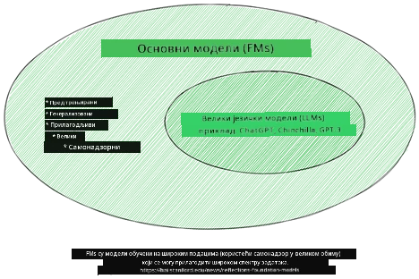

Извор слике: [Основни водич за Темљне моделе и Велике језичке моделе | аутор Бабар М. Бхатти | Medium
](https://thebabar.medium.com/essential-guide-to-foundation-models-and-large-language-models-27dab58f7404)

Да би се даље разјаснила ова разлика, узмимо ChatGPT као историјски пример. Ране верзије ChatGPT користиле су GPT-3.5 као основни модел. Затим је OpenAI користио податке специфичне за ћаскање и технике усаглашавања да направи верзију која је боље радила у разговорним сценаријима, као што су чатботови. Модерне AI услуге често користе више варијанти модела, па имена услуге и основног модела нису увек иста ствар.

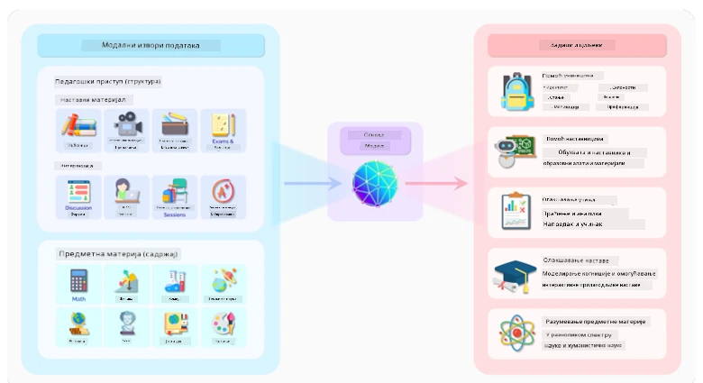

Извор слике: [2108.07258.pdf (arxiv.org)](https://arxiv.org/pdf/2108.07258.pdf?WT.mc_id=academic-105485-koreyst)

### Модели отворене тежине/отвореног кода у односу на власничке моделе

Још један начин категоризације LLM-ова је да ли су модели отворене тежине, отвореног кода или власнички.

Модели отвореног кода и отворене тежине омогућавају приступ артефактима модела ради прегледа, преузимања или прилагођавања, али њихове лиценце се разликују. Неки су у потпуности отвореног кода, док су други модели отворене тежине с ограничењима коришћења. Могу бити корисни када предузеће треба већу контролу над распоређивањем, локацијом података, трошковима или прилагођавањем. Међутим, тимови и даље морају прегледати услове лиценцирања, трошкове сервиса, одржавање, ажурирања безбедности и квалитет процене пре коришћења у производњи. Примери укључују [Meta Llama 4](https://ai.meta.com/blog/llama-4-multimodal-intelligence/?WT.mc_id=academic-105485-koreyst), неке од [Mistral модела](https://docs.mistral.ai/models/overview?WT.mc_id=academic-105485-koreyst) и многе моделе хостоване на [Hugging Face](https://huggingface.co/models?WT.mc_id=academic-105485-koreyst).

Власнички модели су у власништву и подршци провајдера. Често су оптимизовани за управљано производно коришћење и могу понудити јаку подршку, системе безбедности, интеграцију алата и скалабилност. Међутим, купци обично не могу да прегледају или модификују тежине модела и морају прегледати услове провајдера у вези приватности, чувања, усклађености и прихватљивог коришћења. Примери укључују [OpenAI моделе](https://platform.openai.com/docs/models?WT.mc_id=academic-105485-koreyst), [Google Gemini](https://deepmind.google/models/gemini/pro/?WT.mc_id=academic-105485-koreyst) и [Anthropic Claude](https://platform.claude.com/docs/en/about-claude/models/overview?WT.mc_id=academic-105485-koreyst).

### Генерисање угнежђивања у односу на слике у односу на генерисање текста и кода

LLM-ови се могу категорисати и према излазу који генеришу.

Угнежђивање су скуп модела који могу претворити текст у нумерички облик, назван угнежђење, што је нумеричка представка улазног текста. Угнежђивања олакшавају машинама разумевање односа између речи или реченица и могу се користити као улази за друге моделе, као што су модели класификације или модели кластерисања који имају боље перформансе на нумеричким подацима. Модели угнежђивања често се користе за трансфер учење, где се модел гради за заменски задатак за који постоји обиље података, а затим се тежине модела (угнежђења) поново користе за друге спуштене задатке. Пример ове категорије су [OpenAI угнежђивања](https://platform.openai.com/docs/models/embeddings?WT.mc_id=academic-105485-koreyst).

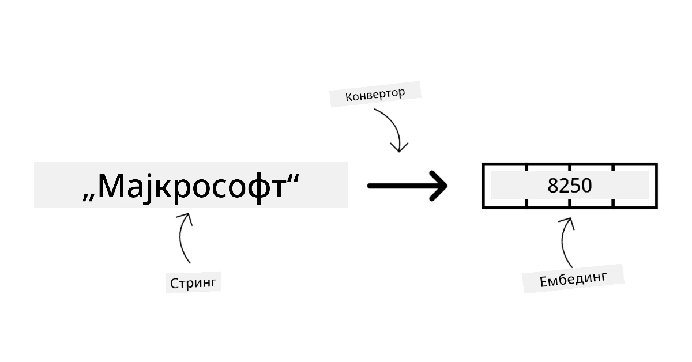

Модели за генерисање слика су модели који генеришу слике. Често се користе за уређивање слика, синтезу слика и превођење слика. Модели за генерисање слика често се обучавају на великим скупова слика, као што је [LAION-5B](https://laion.ai/blog/laion-5b/?WT.mc_id=academic-105485-koreyst), и могу се користити за генерисање нових слика или за уређивање постојећих слика техниками као што су инпеинтинг, супер-резолуција и колоризација. Примери укључују [GPT Image моделе](https://platform.openai.com/docs/guides/images?WT.mc_id=academic-105485-koreyst), [Stable Diffusion моделе](https://github.com/Stability-AI/StableDiffusion?WT.mc_id=academic-105485-koreyst) и Imagen моделе.

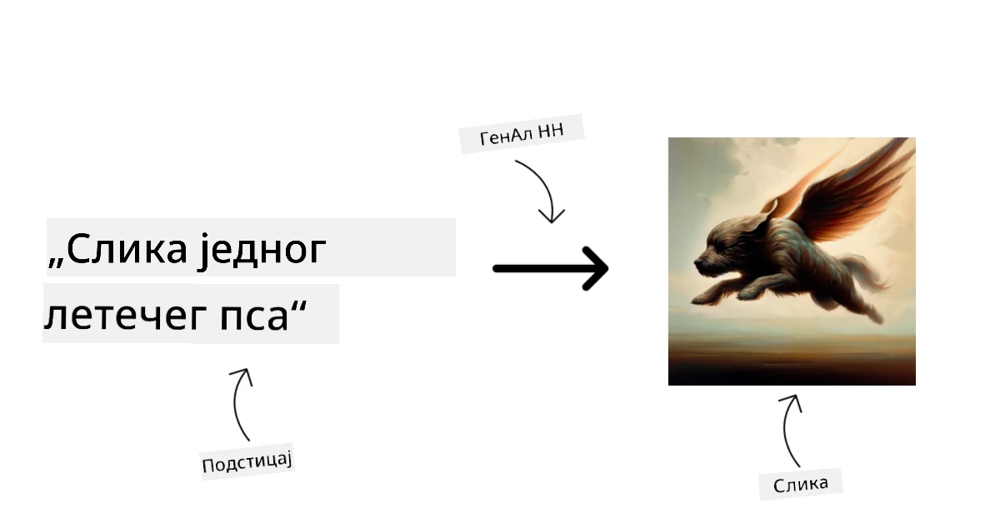

Модели за генерисање текста и кода су модели који генеришу текст или код. Често се користе за резимирање текста, превођење и одговарање на питања. Модели за генерисање текста обучавају се на великим скупова текста, као што је [BookCorpus](https://www.cv-foundation.org/openaccess/content_iccv_2015/html/Zhu_Aligning_Books_and_ICCV_2015_paper.html?WT.mc_id=academic-105485-koreyst), и могу се користити за генерисање новог текста или за одговарање на питања. Модели за генерисање кода, као што је [CodeParrot](https://huggingface.co/codeparrot?WT.mc_id=academic-105485-koreyst), обучавају се на великим скупова кода, као што је GitHub, и могу се користити за генерисање новог кода или исправљање грешака у постојећем коду.

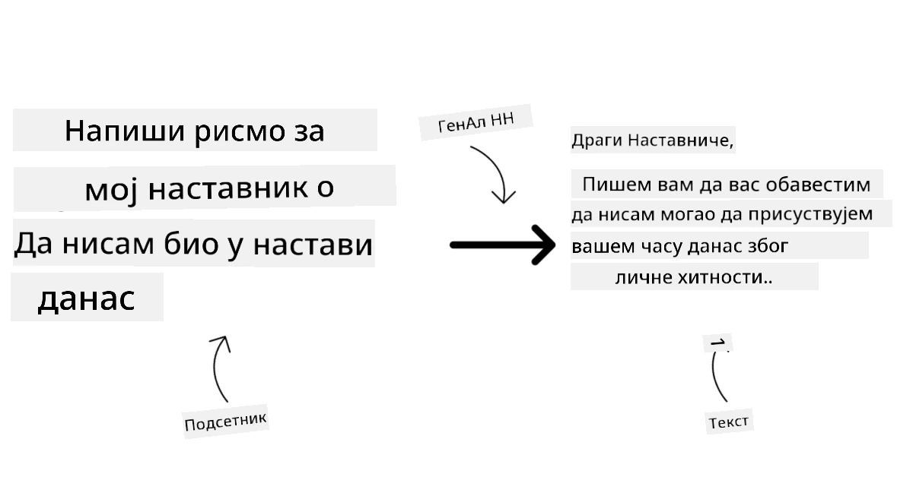

### Енкодер-декодер у односу на само декодер

Да бисмо говорили о различитим типовима архитектуре LLM-ова, користимо аналогију.

Замислите да вам је менаџер дао задатак да напишете квиз за студенте. Имате два колеге; један надгледа креирање садржаја, а други надгледа преглед.

Креатор садржаја је као модел само са декодером: може погледати тему, видети шта сте већ написали и онда наставити да генерише садржај на основу тог контекста. Јако су добри у писању занимљивог и информативног садржаја, али нису увек најбољи избор када је задатак само класификација, претрага или енкодирање информација. Примери породице модела са само декодером укључују GPT и Llama моделе.

Прегледач је као модел само са енкодером, гледа написани курс и одговоре, примећује односе између и разуме контекст, али није добар у генерисању садржаја. Пример модела само са енкодером био би BERT.

Замислите да постоји неко ко може и да креира и да прегледа квиз, то је енкодер-декодер модел. Неколико примера су BART и T5.

### Услуга у односу на модел

Сада, хајде да причамо о разлици између услуге и модела. Услуга је производ који нуди добављач Cloud услуга и често је комбинација модела, података и других компоненти. Модел је основни састојак услуге и често је основни модел, као што је LLM.

Услуге су често оптимизоване за производно коришћење и често су лакше за употребу од модела, преко графичког корисничког интерфејса. Међутим, услуге нису увек бесплатне и могу захтевати претплату или плаћање, у замену за коришћење опреме и ресурса власника услуге, оптимизацију трошкова и лако скалирање. Пример услуге је [Azure OpenAI Service](https://learn.microsoft.com/azure/ai-foundry/openai/overview?WT.mc_id=academic-105485-koreyst), која нуди тарифни план плаћања по коришћењу, што значи да се корисници наплаћују пропорционално колико користе услугу. Azure OpenAI Service такође нуди безбедност на нивоу предузећа и оквир одговорне AI изнад способности модела.

Модели су артефакти неуронске мреже: параметри, тежине, архитектура, токенизатор и подржавајућа конфигурација. Покретање модела локално или у приватном окружењу захтева одговарајући хардвер, инфраструктуру сервиса, надгледање и или компатибилну лиценцу отворене тежине/отвореног кода или комерцијалну лиценцу. Модели отворене тежине као што су Llama 4 или Mistral модели могу се сами хостовати, али и даље захтевају рачунарску снагу и оперативну експертизу.

## Како тестирати и вршити итерирање са различитим моделима да бисте разумели перформансе на Azure-у

Када наш тим истражи тренутни пејзаж LLM-ова и идентификује неке добре кандидатуре за њихове сценарије, следећи корак је тестирање на њиховим подацима и радном оптерећењу. Ово је итеративни процес, који се обавља експериментима и мерама.
Већина модела које смо споменули у претходним параграфима (OpenAI модели, модели с отвореном тежином као Llama 4 и Mistral, и Hugging Face модели) доступни су у [Microsoft Foundry Models](https://learn.microsoft.com/azure/foundry/concepts/foundry-models-overview?WT.mc_id=academic-105485-koreyst).

[Microsoft Foundry](https://learn.microsoft.com/azure/foundry/what-is-foundry?WT.mc_id=academic-105485-koreyst), раније познат као Azure AI Studio/Azure AI Foundry, је уједињена Azure платформа за израду AI апликација и агената. Она помаже програмерима да управљају животним циклусом од експериментисања и процене до имплементације, мониторинга и управљања. Каталог модела у Microsoft Foundry омогућава кориснику да:

- Пронађе основни модел од интереса у каталогу, укључујући моделе које продаје Azure и моделе партнерских и заједничких провајдера. Корисници могу филтрирати по задатку, провајдеру, лиценци, опцији имплементације или имену.

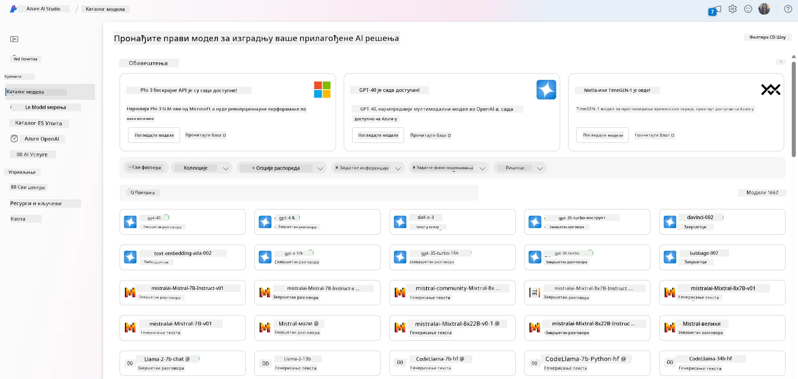

- Прегледа картицу модела, укључујући детаљан опис намењене употребе и података за тренирање, примере кода и резултате процене из унутрашње библиотеке евалуација.

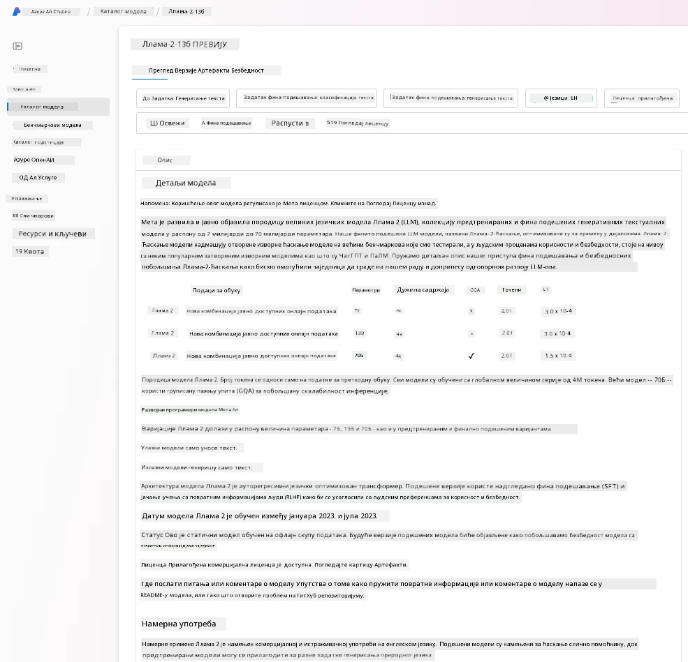

- Упореди референтне вредности између модела и скупова података доступних у индустрији да би се проценило који модел најбоље одговара пословном сценарију, преко панела [Model Benchmarks](https://learn.microsoft.com/azure/ai-foundry/concepts/model-benchmarks?WT.mc_id=academic-105485-koreyst).

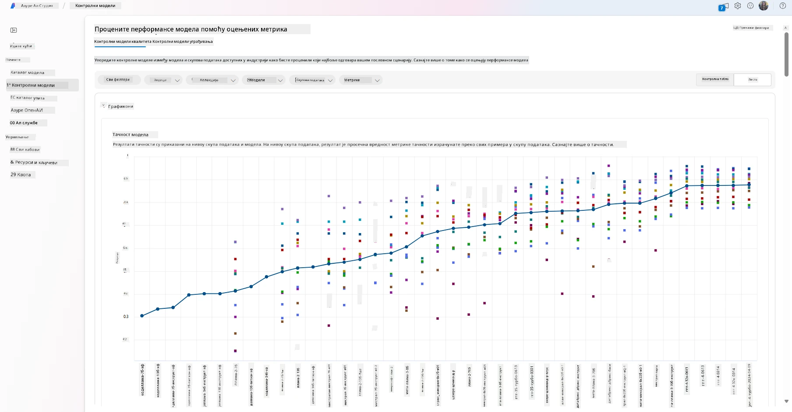

- Фино подеси подржане моделе на прилагођеним подацима за тренинг да би се побољшала перформанса модела у специфичном радном оптерећењу, искоришћавајући могућности експериментисања и праћења Microsoft Foundry.

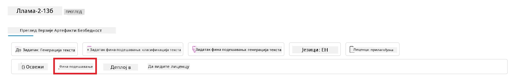

- Распореди оригинални претходно тренирани модел или фино подешену верзију на удаљени крај за реално време (inference endpoint), користећи управљане рачунарске ресурсе или серверлес опције за имплементацију, како би апликације могле да га користе.

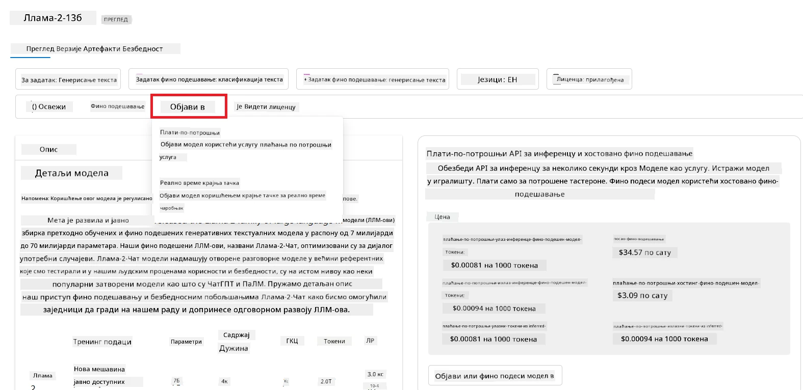

> [!NOTE]
> Нису сви модели у каталогу тренутно доступни за фино подешавање и/или имплементацију по принципу плаћања по коришћењу. Проверите картицу модела за детаље о могућностима и ограничењима модела.

## Побољшање резултата LLM-а

Наш стартап тим је испробао различите типове LLM-ова и облачну платформу (Microsoft Foundry) која нам омогућава да упоредимо различите моделе, оценимо их на тест подацима, побољшамо перформансе и распоредимо их на inference endpoint-ове.

Али када треба размотрити финo подешавање модела уместо коришћења претходно тренираног? Постоје ли други приступи за побољшање перформанси модела на специфичним радним оптерећењима?

Постоји неколико приступа које посао може користити да добије потребне резултате од LLM-а. Можете бирати различите типове модела са различитим степеном тренинга приликом распореда LLM-а у продукцију, са различитим нивоима сложености, трошкова и квалитета. Ево неколико различитих приступа:

- **Инжењеринг упита с контекстом**. Идеја је да обезбедите довољно контекста када постављате упит како бисте осигурали да добијете одговоре који су вам потребни.

- **Retrieval Augmented Generation, RAG**. Ваша правила могу постојати у бази података или веб ендпоинту, на пример, да обезбедите да ти подаци, или њихов подскуп, буду укључени у моменту постављања упита, можете преузети релевантне податке и учинити их делом корисничког упита.

- **Фино подешен модел**. Овде сте додатно тренирали модел на својим подацима што је довело до тога да модел буде прецизнији и боље одговара вашим потребама, али може бити скупље.

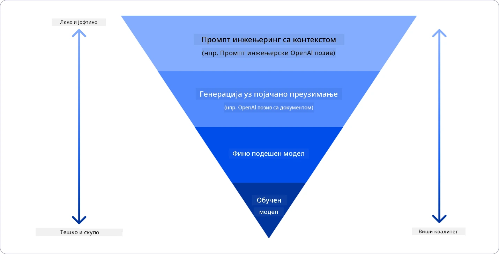

Извор слике: [Four Ways that Enterprises Deploy LLMs | Fiddler AI Blog](https://www.fiddler.ai/blog/four-ways-that-enterprises-deploy-llms?WT.mc_id=academic-105485-koreyst)

### Инжењеринг упита с контекстом

Претходно тренирани LLM-ови добро функционишу на генерализованим задацима природног језика, чак и када их позовете кратким упитом, као што је реченица за довршавање или питање – тзв. „zero-shot“ учење.

Међутим, што корисник може детаљније формулисати свој упит, са детаљним захтевом и примерима – Контекстом – то ће одговор бити прецизнији и ближи корисничким очекивањима. У том случају, говоримо о „one-shot“ учењу ако упит садржи само један пример и „few-shot“ учењу ако садржи више примера.
Инжењеринг упита с контекстом је најисплативији приступ за почетак.

### Retrieval Augmented Generation (RAG)

LLM-ови имају ограничење да могу користити само податке који су коришћени током њиховог тренинга за генерисање одговора. То значи да не знају ништа о чињеницама које су се десиле након тренинга, и не могу приступити непубличним информацијама (попут података компаније).
Ово се може превазићи кроз RAG, технологију која допуњује упит спољним подацима у облику делова докумената, с обзиром на ограничења дужине упита. Ово подржавају алати за векторске базе података (као што је [Azure Vector Search](https://learn.microsoft.com/azure/search/vector-search-overview?WT.mc_id=academic-105485-koreyst)) који враћају корисне делове из разноврсних унапред дефинисаних извора података и додају их у контекст упита.

Ова техника је веома корисна када посао нема довољно података, времена или ресурса да финo подеси LLM, али ипак жели да побољша перформансе на специфичном радном оптерећењу и смањи ризик од халуцинација, застарелих или непотврђених одговора.

### Фино подешен модел

Фино подешавање је процес који користи пренос учења (transfer learning) да „прилагоди“ модел за одређени задатак или решавање специфичног проблема. За разлику од few-shot учења и RAG-а, резултира генерацијом новог модела са ажурираним тежинама и помацима. Захтева скуп примера за тренирање који се састоји од појединачног улаза (упита) и његовог повезаног излаза (завршетка).
Ово би био пожељан приступ ако:

- **Користите мање моделе специфичне за задатак**. Посао би желео да финo подеси мањи модел за уски задатак уместо да више пута поставља упите већем моделу, што резултује исплативијим и бржим решењем.

- **Разматрајући латенцију**. Латенција је важна за одређену употребу, па није могуће користити веома дуге упите или број примера од којих модел треба да учи не одговара ограничењу дужине упита.

- **Прилагођавање стабилног понашања**. Посао има много квалитетних примера и жели да модел доследно прати образац задатка, формат резултата, тон или стил специфичан за домен. Ако је главни проблем свеже чињенице или приватно знање које се често мења, користите RAG уместо да се ослањате само на финo подешавање.

### Тренирани модел

Тренирање LLM-а од нуле је без сумње најтежи и најкомплекснији приступ, који захтева огромне количине података, стручне ресурсе и одговарајућу рачунарску снагу. Ова опција треба да се разматра само у сценарију где посао има доменски специфичну употребу и велику количину доменских података.

## Провера знања

Који би могао бити добар приступ за побољшање резултата завршетка LLM-а?

1. Инжењеринг упита с контекстом
1. RAG
1. Фино подешен модел

О: Сва три могу помоћи. Почните са инжењерингом упита и контекстом за брза побољшања, и користите RAG када модел треба актуелне чињенице или приватне пословне податке. Изаберите фино подешавање када имате довољно квалитетних примера и потребно је да модел доследно прати задатак, формат, тон или образац домена.

## 🚀 Изазов

Прочитајте више о томе како можете [користити RAG](https://learn.microsoft.com/azure/search/retrieval-augmented-generation-overview?WT.mc_id=academic-105485-koreyst) за ваш посао.

## Одличан рад, наставите учење

Након завршетка ове лекције, погледајте нашу [Generative AI Learning колекцију](https://aka.ms/genai-collection?WT.mc_id=academic-105485-koreyst) да наставите да унапређујете своје знање о генеративној вештачкој интелигенцији!

Пређите на Лекцију 3 где ћемо погледати како да [грађевинарство са генеративном AI одговорно](../03-using-generative-ai-responsibly/README.md?WT.mc_id=academic-105485-koreyst)!

---

<!-- CO-OP TRANSLATOR DISCLAIMER START -->
**Изјава о одрицању одговорности**:
Овај документ је преведен коришћењем услуге за аутоматски превод [Co-op Translator](https://github.com/Azure/co-op-translator). Иако тежимо тачности, имајте у виду да аутоматски преводи могу садржати грешке или нетачности. Оригинални документ на његовом изворном језику треба сматрати ауторитативним извором. За критичне информације препоручује се професионални људски превод. Нисмо одговорни за било каква неспоразума или погрешна тумачења која произилазе из коришћења овог превода.
<!-- CO-OP TRANSLATOR DISCLAIMER END -->