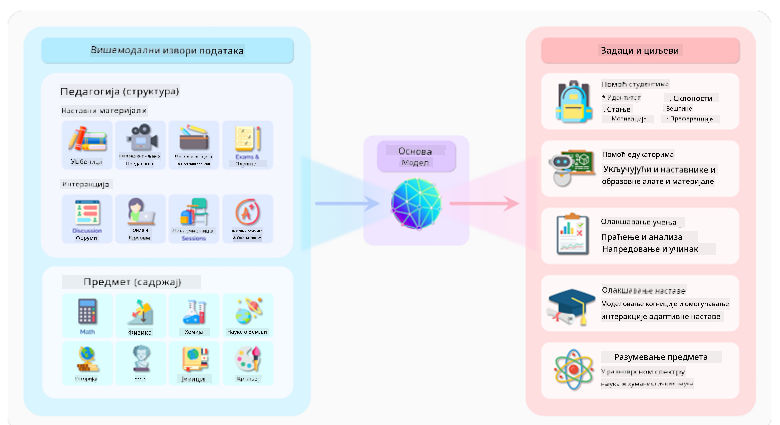
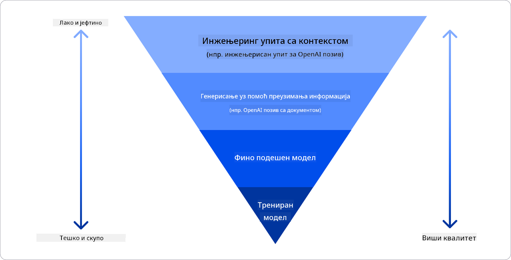

<!--
CO_OP_TRANSLATOR_METADATA:
{
  "original_hash": "6b7629b8ee4d7d874a27213e903d86a7",
  "translation_date": "2025-10-18T01:20:21+00:00",
  "source_file": "02-exploring-and-comparing-different-llms/README.md",
  "language_code": "sr"
}
-->
# Istraživanje i poređenje različitih LLM-ova

> _Kliknite na sliku iznad da pogledate video lekcije_

U prethodnoj lekciji videli smo kako generativna veštačka inteligencija menja tehnološki pejzaž, kako funkcionišu veliki jezički modeli (LLM-ovi) i kako ih jedna kompanija - poput našeg startapa - može primeniti na svoje slučajeve upotrebe i rasti! U ovom poglavlju ćemo uporediti i suprotstaviti različite vrste velikih jezičkih modela (LLM-ova) kako bismo razumeli njihove prednosti i mane.

Sledeći korak u razvoju našeg startapa je istraživanje trenutnog pejzaža LLM-ova i razumevanje koji su pogodni za naš slučaj upotrebe.

## Uvod

Ova lekcija će obuhvatiti:

- Različite vrste LLM-ova u trenutnom pejzažu.
- Testiranje, iteraciju i poređenje različitih modela za vaš slučaj upotrebe u Azure-u.
- Kako implementirati LLM.

## Ciljevi učenja

Nakon završetka ove lekcije, moći ćete:

- Izabrati pravi model za vaš slučaj upotrebe.
- Razumeti kako testirati, iterirati i poboljšati performanse vašeg modela.
- Znati kako kompanije implementiraju modele.

## Razumevanje različitih vrsta LLM-ova

LLM-ovi se mogu klasifikovati na više načina, u zavisnosti od njihove arhitekture, podataka za obuku i slučaja upotrebe. Razumevanje ovih razlika pomoći će našem startapu da izabere pravi model za scenario i razume kako testirati, iterirati i poboljšati performanse.

Postoji mnogo različitih vrsta LLM modela, a vaš izbor modela zavisi od toga za šta ih nameravate koristiti, vaših podataka, budžeta i drugih faktora.

U zavisnosti od toga da li nameravate koristiti modele za generisanje teksta, zvuka, videa, slika i slično, možda ćete se odlučiti za različite vrste modela.

- **Prepoznavanje zvuka i govora**. Za ovu svrhu, modeli tipa Whisper su odličan izbor jer su univerzalni i namenjeni prepoznavanju govora. Trenirani su na raznovrsnim audio podacima i mogu obavljati prepoznavanje govora na više jezika. Saznajte više o [modelima tipa Whisper ovde](https://platform.openai.com/docs/models/whisper?WT.mc_id=academic-105485-koreyst).

- **Generisanje slika**. Za generisanje slika, DALL-E i Midjourney su dva veoma poznata izbora. DALL-E nudi Azure OpenAI. [Pročitajte više o DALL-E ovde](https://platform.openai.com/docs/models/dall-e?WT.mc_id=academic-105485-koreyst) i takođe u 9. poglavlju ovog kurikuluma.

- **Generisanje teksta**. Većina modela je trenirana za generisanje teksta i imate veliki izbor od GPT-3.5 do GPT-4. Oni dolaze sa različitim troškovima, pri čemu je GPT-4 najskuplji. Vredi pogledati [Azure OpenAI playground](https://oai.azure.com/portal/playground?WT.mc_id=academic-105485-koreyst) kako biste procenili koji modeli najbolje odgovaraju vašim potrebama u smislu sposobnosti i troškova.

- **Multimodalnost**. Ako želite da radite sa više vrsta podataka u ulazu i izlazu, možda biste želeli da istražite modele poput [gpt-4 turbo sa vizijom ili gpt-4o](https://learn.microsoft.com/azure/ai-services/openai/concepts/models#gpt-4-and-gpt-4-turbo-models?WT.mc_id=academic-105485-koreyst) - najnovije verzije OpenAI modela - koji su sposobni da kombinuju obradu prirodnog jezika sa vizuelnim razumevanjem, omogućavajući interakcije kroz multimodalne interfejse.

Izbor modela znači da dobijate osnovne sposobnosti, koje možda neće biti dovoljne. Često imate specifične podatke za kompaniju koje nekako morate preneti LLM-u. Postoji nekoliko različitih pristupa kako to učiniti, o čemu ćemo više govoriti u narednim odeljcima.

### Osnovni modeli naspram LLM-ova

Termin Osnovni model (Foundation Model) je [skovao tim istraživača sa Stanforda](https://arxiv.org/abs/2108.07258?WT.mc_id=academic-105485-koreyst) i definisan je kao AI model koji ispunjava određene kriterijume, kao što su:

- **Trenirani su koristeći nesupervizirano učenje ili samostalno supervizirano učenje**, što znači da su trenirani na nepovezanim multimodalnim podacima i ne zahtevaju ljudsku anotaciju ili označavanje podataka za proces obuke.
- **To su veoma veliki modeli**, zasnovani na veoma dubokim neuronskim mrežama treniranim na milijardama parametara.
- **Obično su namenjeni da služe kao 'osnova' za druge modele**, što znači da se mogu koristiti kao polazna tačka za izgradnju drugih modela, što se može postići finim podešavanjem.

Izvor slike: [Essential Guide to Foundation Models and Large Language Models | by Babar M Bhatti | Medium
](https://thebabar.medium.com/essential-guide-to-foundation-models-and-large-language-models-27dab58f7404)

Da dodatno pojasnimo ovu razliku, uzmimo ChatGPT kao primer. Za izgradnju prve verzije ChatGPT-a, model nazvan GPT-3.5 služio je kao osnovni model. To znači da je OpenAI koristio neke podatke specifične za razgovor kako bi stvorio prilagođenu verziju GPT-3.5 koja je specijalizovana za dobro funkcionisanje u scenarijima razgovora, poput chatbotova.

Izvor slike: [2108.07258.pdf (arxiv.org)](https://arxiv.org/pdf/2108.07258.pdf?WT.mc_id=academic-105485-koreyst)

### Otvoreni kod naspram vlasničkih modela

Još jedan način za kategorizaciju LLM-ova je da li su otvorenog koda ili vlasnički.

Modeli otvorenog koda su modeli koji su dostupni javnosti i mogu ih koristiti svi. Često ih objavljuje kompanija koja ih je kreirala ili istraživačka zajednica. Ovi modeli mogu biti pregledani, modifikovani i prilagođeni za različite slučajeve upotrebe u LLM-ovima. Međutim, nisu uvek optimizovani za proizvodnu upotrebu i možda nisu tako performantni kao vlasnički modeli. Pored toga, finansiranje za modele otvorenog koda može biti ograničeno, možda neće biti dugoročno održavani ili ažurirani najnovijim istraživanjima. Primeri popularnih modela otvorenog koda uključuju [Alpaca](https://crfm.stanford.edu/2023/03/13/alpaca.html?WT.mc_id=academic-105485-koreyst), [Bloom](https://huggingface.co/bigscience/bloom) i [LLaMA](https://llama.meta.com).

Vlasnički modeli su modeli koji su u vlasništvu kompanije i nisu dostupni javnosti. Ovi modeli su često optimizovani za proizvodnu upotrebu. Međutim, nije dozvoljeno da se pregledaju, modifikuju ili prilagođavaju za različite slučajeve upotrebe. Pored toga, nisu uvek dostupni besplatno i mogu zahtevati pretplatu ili plaćanje za korišćenje. Takođe, korisnici nemaju kontrolu nad podacima koji se koriste za obuku modela, što znači da treba da veruju vlasniku modela da će se pridržavati obaveza o privatnosti podataka i odgovornoj upotrebi AI. Primeri popularnih vlasničkih modela uključuju [OpenAI modele](https://platform.openai.com/docs/models/overview?WT.mc_id=academic-105485-koreyst), [Google Bard](https://sapling.ai/llm/bard?WT.mc_id=academic-105485-koreyst) ili [Claude 2](https://www.anthropic.com/index/claude-2?WT.mc_id=academic-105485-koreyst).

### Ugrađivanje naspram generisanja slika naspram generisanja teksta i koda

LLM-ovi se takođe mogu kategorizovati prema izlazu koji generišu.

Ugrađivanja su skup modela koji mogu konvertovati tekst u numerički oblik, nazvan ugrađivanje, što je numerička reprezentacija ulaznog teksta. Ugrađivanja olakšavaju mašinama razumevanje odnosa između reči ili rečenica i mogu se koristiti kao ulazi za druge modele, poput modela za klasifikaciju ili klasterovanje koji imaju bolje performanse na numeričkim podacima. Modeli ugrađivanja se često koriste za transferno učenje, gde se model gradi za zamenski zadatak za koji postoji obilje podataka, a zatim se težine modela (ugrađivanja) ponovo koriste za druge zadatke. Primer ove kategorije je [OpenAI embeddings](https://platform.openai.com/docs/models/embeddings?WT.mc_id=academic-105485-koreyst).

Modeli za generisanje slika su modeli koji generišu slike. Ovi modeli se često koriste za uređivanje slika, sintezu slika i prevođenje slika. Modeli za generisanje slika se često treniraju na velikim skupovima podataka slika, kao što je [LAION-5B](https://laion.ai/blog/laion-5b/?WT.mc_id=academic-105485-koreyst), i mogu se koristiti za generisanje novih slika ili za uređivanje postojećih slika tehnikama poput inpainting-a, super-rezolucije i kolorizacije. Primeri uključuju [DALL-E-3](https://openai.com/dall-e-3?WT.mc_id=academic-105485-koreyst) i [Stable Diffusion modele](https://github.com/Stability-AI/StableDiffusion?WT.mc_id=academic-105485-koreyst).

Modeli za generisanje teksta i koda su modeli koji generišu tekst ili kod. Ovi modeli se često koriste za sažimanje teksta, prevođenje i odgovaranje na pitanja. Modeli za generisanje teksta se često treniraju na velikim skupovima podataka teksta, kao što je [BookCorpus](https://www.cv-foundation.org/openaccess/content_iccv_2015/html/Zhu_Aligning_Books_and_ICCV_2015_paper.html?WT.mc_id=academic-105485-koreyst), i mogu se koristiti za generisanje novog teksta ili za odgovaranje na pitanja. Modeli za generisanje koda, poput [CodeParrot](https://huggingface.co/codeparrot?WT.mc_id=academic-105485-koreyst), često se treniraju na velikim skupovima podataka koda, kao što je GitHub, i mogu se koristiti za generisanje novog koda ili za ispravljanje grešaka u postojećem kodu.

### Encoder-Decoder naspram samo Decoder

Da bismo razgovarali o različitim vrstama arhitektura LLM-ova, koristimo analogiju.

Zamislite da vam je menadžer dao zadatak da napišete kviz za studente. Imate dva kolege; jedan je zadužen za kreiranje sadržaja, a drugi za pregled.

Kreator sadržaja je poput modela samo Decoder, može pogledati temu i videti šta ste već napisali, a zatim može napisati kurs na osnovu toga. Oni su veoma dobri u pisanju zanimljivog i informativnog sadržaja, ali nisu baš dobri u razumevanju teme i ciljeva učenja. Neki primeri modela samo Decoder su modeli iz GPT porodice, kao što je GPT-3.

Recenzent je poput modela samo Encoder, gleda kurs koji je napisan i odgovore, primećujući odnos između njih i razumevajući kontekst, ali nije dobar u generisanju sadržaja. Primer modela samo Encoder bio bi BERT.

Zamislite da imamo nekoga ko bi mogao i da kreira i da pregleda kviz, to je model Encoder-Decoder. Neki primeri su BART i T5.

### Servis naspram modela

Sada, hajde da razgovaramo o razlici između servisa i modela. Servis je proizvod koji nudi provajder usluga u oblaku i često je kombinacija modela, podataka i drugih komponenti. Model je osnovna komponenta servisa i često je osnovni model, kao što je LLM.

Servisi su često optimizovani za proizvodnu upotrebu i često su lakši za upotrebu od modela, putem grafičkog korisničkog interfejsa. Međutim, servisi nisu uvek dostupni besplatno i mogu zahtevati pretplatu ili plaćanje za korišćenje, u zamenu za korišćenje opreme i resursa vlasnika servisa, optimizaciju troškova i lako skaliranje. Primer servisa je [Azure OpenAI Service](https://learn.microsoft.com/azure/ai-services/openai/overview?WT.mc_id=academic-105485-koreyst), koji nudi plan plaćanja po korišćenju, što znači da se korisnici naplaćuju proporcionalno koliko koriste servis. Takođe, Azure OpenAI Service nudi sigurnost na nivou preduzeća i okvir za odgovornu upotrebu AI-a uz mogućnosti modela.

Modeli su samo neuronske mreže, sa parametrima, težinama i ostalim. Omogućavaju kompanijama da ih pokreću lokalno, međutim, potrebno je kupiti opremu, izgraditi strukturu za skaliranje i kupiti licencu ili koristiti model otvorenog koda. Model poput LLaMA je dostupan za korišćenje, ali zahteva računske resurse za pokretanje modela.

## Kako testirati i iterirati sa različitim modelima kako biste razumeli performanse na Azure-u

Kada naš tim istraži trenutni pejzaž LLM-ova i identifikuje neke dobre kandidate za svoje scenarije, sledeći korak je testiranje na njihovim podacima i radnom opterećenju. Ovo je iterativni proces, koji se sprovodi kroz eksperimente i merenja.
Većina modela koje smo pomenuli u prethodnim paragrafima (OpenAI modeli, modeli otvorenog koda poput Llama2 i Hugging Face transformeri) dostupni su u [Model Catalog](https://learn.microsoft.com/azure/ai-studio/how-to/model-catalog-overview?WT.mc_id=academic-105485-koreyst) u [Azure AI Studio](https://ai.azure.com/?WT.mc_id=academic-105485-koreyst).

[Azure AI Studio](https://learn.microsoft.com/azure/ai-studio/what-is-ai-studio?WT.mc_id=academic-105485-koreyst) je Cloud platforma dizajnirana za programere da kreiraju aplikacije generativne veštačke inteligencije i upravljaju celokupnim razvojnim ciklusom - od eksperimentisanja do evaluacije - kombinujući sve Azure AI usluge u jedan centar sa praktičnim grafičkim interfejsom. Model Catalog u Azure AI Studio omogućava korisnicima da:

- Pronađu osnovni model od interesa u katalogu - bilo vlasnički ili otvorenog koda, filtrirajući po zadatku, licenci ili imenu. Da bi se poboljšala pretraga, modeli su organizovani u kolekcije, poput Azure OpenAI kolekcije, Hugging Face kolekcije i drugih.

- Pregledaju karticu modela, uključujući detaljan opis namene i podataka za obuku, uzorke koda i rezultate evaluacije iz interne biblioteke evaluacija.

- Uporede rezultate testiranja između modela i dostupnih datasetova u industriji kako bi procenili koji model najbolje odgovara poslovnom scenariju, putem [Model Benchmarks](https://learn.microsoft.com/azure/ai-studio/how-to/model-benchmarks?WT.mc_id=academic-105485-koreyst) panela.

- Prilagode model na osnovu sopstvenih podataka za obuku kako bi poboljšali performanse modela u specifičnom radnom opterećenju, koristeći mogućnosti eksperimentisanja i praćenja u Azure AI Studio.

- Postave originalni unapred obučeni model ili prilagođenu verziju za udaljenu inferenciju u realnom vremenu - upravljano računanje - ili serverless API endpoint - [pay-as-you-go](https://learn.microsoft.com/azure/ai-studio/how-to/model-catalog-overview#model-deployment-managed-compute-and-serverless-api-pay-as-you-go?WT.mc_id=academic-105485-koreyst) - kako bi aplikacije mogle da ga koriste.

> [!NOTE]
> Nisu svi modeli u katalogu trenutno dostupni za prilagođavanje i/ili pay-as-you-go postavljanje. Proverite karticu modela za detalje o mogućnostima i ograničenjima modela.

## Poboljšanje rezultata LLM-a

Istražili smo sa našim startup timom različite vrste LLM-ova i Cloud platformu (Azure Machine Learning) koja nam omogućava da uporedimo različite modele, evaluiramo ih na test podacima, poboljšamo performanse i postavimo ih na inferencione endpointove.

Ali kada treba razmotriti prilagođavanje modela umesto korišćenja unapred obučenog? Postoje li drugi pristupi za poboljšanje performansi modela u specifičnim radnim opterećenjima?

Postoji nekoliko pristupa koje preduzeće može koristiti da bi dobilo željene rezultate od LLM-a. Možete odabrati različite vrste modela sa različitim stepenima obuke prilikom postavljanja LLM-a u produkciju, sa različitim nivoima složenosti, troškova i kvaliteta. Evo nekoliko različitih pristupa:

- **Inženjering upita sa kontekstom**. Ideja je da se obezbedi dovoljno konteksta prilikom postavljanja upita kako bi se dobili željeni odgovori.

- **Generacija uz podršku pretrage (RAG)**. Vaši podaci mogu postojati u bazi podataka ili na web endpointu, na primer, kako bi se osiguralo da su ti podaci, ili njihov podskup, uključeni u trenutku postavljanja upita, možete dohvatiti relevantne podatke i učiniti ih delom korisničkog upita.

- **Prilagođeni model**. Ovde se model dodatno obučava na vašim sopstvenim podacima, što dovodi do toga da model bude precizniji i odgovara vašim potrebama, ali može biti skupo.

Izvor slike: [Four Ways that Enterprises Deploy LLMs | Fiddler AI Blog](https://www.fiddler.ai/blog/four-ways-that-enterprises-deploy-llms?WT.mc_id=academic-105485-koreyst)

### Inženjering upita sa kontekstom

Unapred obučeni LLM-ovi vrlo dobro funkcionišu na generalizovanim zadacima prirodnog jezika, čak i kada se pozivaju sa kratkim upitom, poput rečenice za dovršavanje ili pitanja – takozvano „zero-shot“ učenje.

Međutim, što korisnik bolje može da oblikuje svoj upit, sa detaljnim zahtevom i primerima – Kontekstom – to će odgovor biti tačniji i bliži očekivanjima korisnika. U ovom slučaju govorimo o „one-shot“ učenju ako upit uključuje samo jedan primer i „few-shot učenju“ ako uključuje više primera. Inženjering upita sa kontekstom je najisplativiji pristup za početak.

### Generacija uz podršku pretrage (RAG)

LLM-ovi imaju ograničenje da mogu koristiti samo podatke koji su korišćeni tokom njihove obuke za generisanje odgovora. To znači da ne znaju ništa o činjenicama koje su se dogodile nakon procesa obuke i ne mogu pristupiti ne-javnim informacijama (poput podataka kompanije). 

Ovo se može prevazići kroz RAG, tehniku koja proširuje upit spoljnim podacima u obliku delova dokumenata, uzimajući u obzir ograničenja dužine upita. Ovo podržavaju alati za pretragu vektora (poput [Azure Vector Search](https://learn.microsoft.com/azure/search/vector-search-overview?WT.mc_id=academic-105485-koreyst)) koji pronalaze korisne delove iz različitih unapred definisanih izvora podataka i dodaju ih u kontekst upita.

Ova tehnika je veoma korisna kada preduzeće nema dovoljno podataka, vremena ili resursa za prilagođavanje LLM-a, ali ipak želi da poboljša performanse u specifičnom radnom opterećenju i smanji rizik od izmišljanja, tj. iskrivljavanja stvarnosti ili štetnog sadržaja.

### Prilagođeni model

Prilagođavanje je proces koji koristi transferno učenje za „prilagođavanje“ modela određenom zadatku ili rešavanju specifičnog problema. Za razliku od few-shot učenja i RAG-a, rezultira generisanjem novog modela, sa ažuriranim težinama i pristrasnostima. Zahteva skup primera za obuku koji se sastoje od jednog ulaza (upita) i njegovog povezanog izlaza (rezultata).

Ovo bi bio preferirani pristup ako:

- **Korišćenje prilagođenih modela**. Preduzeće želi da koristi prilagođene manje sposobne modele (poput modela za ugrađivanje) umesto modela visokih performansi, što rezultira isplativijim i bržim rešenjem.

- **Razmatranje latencije**. Latencija je važna za određeni slučaj upotrebe, pa nije moguće koristiti veoma duge upite ili broj primera koji treba da se nauče od modela ne odgovara ograničenju dužine upita.

- **Održavanje ažurnosti**. Preduzeće ima mnogo visokokvalitetnih podataka i oznaka istine i resurse potrebne za održavanje ovih podataka ažurnim tokom vremena.

### Obučeni model

Obuka LLM-a od nule je bez sumnje najteži i najsloženiji pristup za usvajanje, zahtevajući ogromne količine podataka, stručne resurse i odgovarajuću računalnu moć. Ova opcija treba da se razmatra samo u scenariju gde preduzeće ima slučaj upotrebe specifičan za određenu oblast i veliku količinu podataka vezanih za tu oblast.

## Provera znanja

Koji bi mogao biti dobar pristup za poboljšanje rezultata LLM-a?

1. Inženjering upita sa kontekstom  
1. RAG  
1. Prilagođeni model  

Odgovor: 3, ako imate vremena, resurse i visokokvalitetne podatke, prilagođavanje je bolja opcija za održavanje ažurnosti. Međutim, ako želite da poboljšate stvari, a nemate dovoljno vremena, vredi prvo razmotriti RAG.

## 🚀 Izazov

Pročitajte više o tome kako možete [koristiti RAG](https://learn.microsoft.com/azure/search/retrieval-augmented-generation-overview?WT.mc_id=academic-105485-koreyst) za vaše poslovanje.

## Odlično urađeno, nastavite sa učenjem

Nakon što završite ovu lekciju, pogledajte našu [Generative AI Learning kolekciju](https://aka.ms/genai-collection?WT.mc_id=academic-105485-koreyst) kako biste nastavili da unapređujete svoje znanje o generativnoj veštačkoj inteligenciji!

Pređite na Lekciju 3 gde ćemo razmotriti kako [odgovorno koristiti generativnu veštačku inteligenciju](../03-using-generative-ai-responsibly/README.md?WT.mc_id=academic-105485-koreyst)!

---

**Одрицање од одговорности**:  
Овај документ је преведен помоћу услуге за превођење вештачке интелигенције [Co-op Translator](https://github.com/Azure/co-op-translator). Иако настојимо да обезбедимо тачност, молимо вас да имате у виду да аутоматски преводи могу садржати грешке или нетачности. Оригинални документ на његовом изворном језику треба сматрати ауторитативним извором. За критичне информације препоручује се професионални превод од стране људи. Не преузимамо одговорност за било каква погрешна тумачења или неспоразуме који могу настати услед коришћења овог превода.