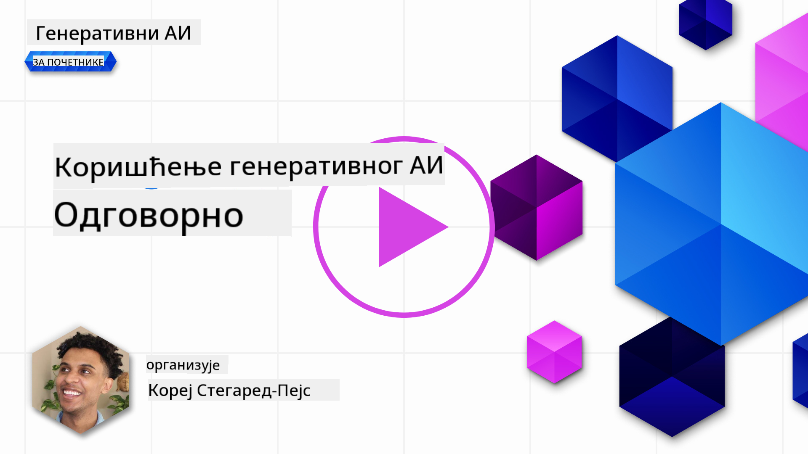
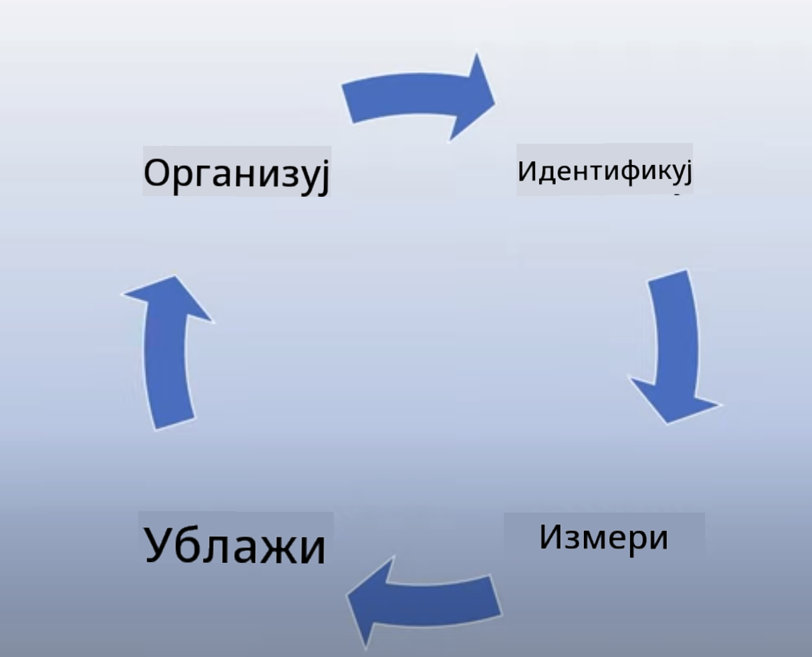
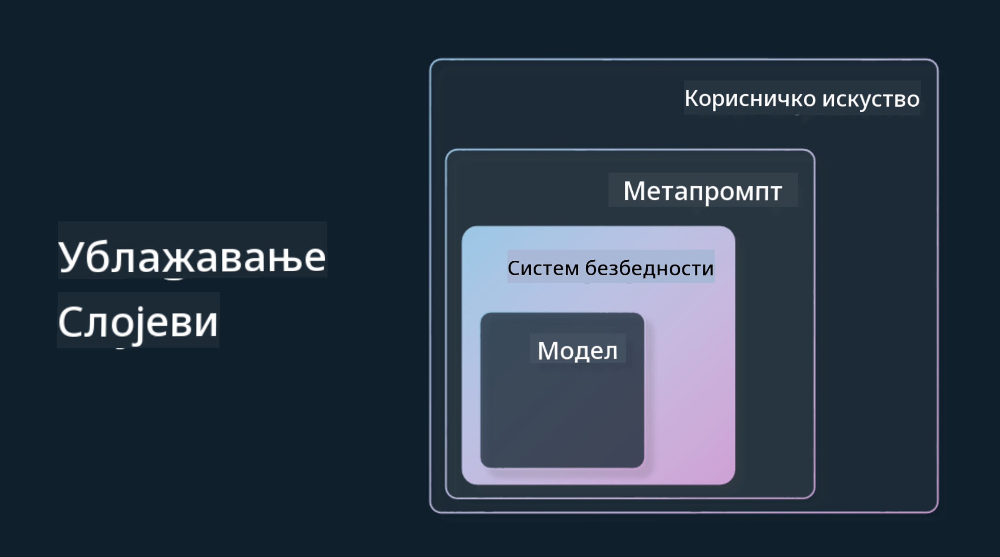

<!--
CO_OP_TRANSLATOR_METADATA:
{
  "original_hash": "7f8f4c11f8c1cb6e1794442dead414ea",
  "translation_date": "2025-07-09T09:03:59+00:00",
  "source_file": "03-using-generative-ai-responsibly/README.md",
  "language_code": "sr"
}
-->
# Коришћење генеративне вештачке интелигенције одговорно

> _Кликните на слику изнад да бисте погледали видео о овој лекцији_

Лако је бити фасциниран вештачком интелигенцијом, а посебно генеративном вештачком интелигенцијом, али је важно размотрити како ћете је одговорно користити. Треба узети у обзир како обезбедити да резултати буду праведни, безбедни и без штете. Ово поглавље има за циљ да вам пружи тај контекст, шта треба узети у обзир и како предузети конкретне кораке за побољшање коришћења вештачке интелигенције.

## Увод

Ова лекција ће обухватити:

- Зашто треба да приоритет дате одговорној вештачкој интелигенцији када правите апликације засноване на генеративној вештачкој интелигенцији.
- Основне принципе одговорне вештачке интелигенције и како се они односе на генеративну вештачку интелигенцију.
- Како применити ове принципе одговорне вештачке интелигенције у пракси кроз стратегију и алате.

## Циљеви учења

Након завршетка ове лекције знаћете:

- Колико је одговорна вештачка интелигенција важна приликом израде апликација заснованих на генеративној вештачкој интелигенцији.
- Када треба размишљати и примењивати основне принципе одговорне вештачке интелигенције приликом израде генеративних AI апликација.
- Који алати и стратегије су вам доступни да бисте концепт одговорне вештачке интелигенције применили у пракси.

## Принципи одговорне вештачке интелигенције

Узбуђење око генеративне вештачке интелигенције никада није било веће. Ово узбуђење је привукло много нових програмера, пажње и финансијских средстава у ову област. Иако је то веома позитивно за све који желе да граде производе и компаније користећи генеративну вештачку интелигенцију, важно је да наставимо одговорно.

Током овог курса фокусирамо се на изградњу нашег стартапа и нашег производа за образовање о вештачкој интелигенцији. Користићемо принципе одговорне вештачке интелигенције: праведност, инклузивност, поузданост/безбедност, безбедност и приватност, транспарентност и одговорност. Са овим принципима истражићемо како се они односе на нашу употребу генеративне вештачке интелигенције у нашим производима.

## Зашто треба да приоритет дате одговорној вештачкој интелигенцији

Када правите производ, приступ усмерен ка људима, са фокусом на најбољи интерес корисника, доводи до најбољих резултата.

Јединственост генеративне вештачке интелигенције је у њеној моћи да креира корисне одговоре, информације, смернице и садржај за кориснике. Ово се може постићи без много ручних корака, што може довести до импресивних резултата. Међутим, без одговарајућег планирања и стратегија, то може довести и до штетних последица по кориснике, производ и друштво у целини.

Погледајмо неке (али не све) од ових потенцијално штетних резултата:

### Халуцинације

Халуцинације су термин који описује када LLM генерише садржај који је или потпуно бесмислен или је фактички нетачан у односу на друге изворе информација.

На пример, замислимо да правимо функцију у нашем стартапу која омогућава студентима да постављају историјска питања моделу. Студент пита: `Ко је био једини преживели са Титаника?`

Модел даје одговор као што је овај испод:

> _(Извор: [Flying bisons](https://flyingbisons.com?WT.mc_id=academic-105485-koreyst))_

Ово је веома уверљив и детаљан одговор. Нажалост, нетачан је. Чак и уз минимално истраживање, сазнало би се да је било више преживелих са Титаника. За студента који тек почиње да истражује ову тему, овај одговор може бити довољно убедљив да се не доводи у питање и третира као чињеница. Последице овога могу бити да систем вештачке интелигенције постане непоуздан и да негативно утиче на углед нашег стартапа.

Са сваким новим издањем било ког LLM модела, видели смо побољшања у смањењу халуцинација. Ипак, као програмери и корисници апликација, морамо бити свесни ових ограничења.

### Штетан садржај

У претходном делу смо говорили о томе када LLM даје нетачне или бесмислене одговоре. Још један ризик који морамо имати на уму је када модел одговара штетним садржајем.

Штетан садржај може се дефинисати као:

- Давање упутстава или подстицање на самоповређивање или повређивање одређених група.
- Мржњом или понижавајући садржај.
- Вођење планирања било каквог напада или насилних аката.
- Давање упутстава како пронаћи илегалан садржај или извршити илегалне радње.
- Приказивање сексуално експлицитног садржаја.

За наш стартап желимо да обезбедимо праве алате и стратегије како бисмо спречили да студенти виде овакву врсту садржаја.

### Недостатак праведности

Праведност се дефинише као „обезбеђивање да систем вештачке интелигенције буде слободан од пристрасности и дискриминације и да свакога третира праведно и једнако.“ У свету генеративне вештачке интелигенције желимо да осигурамо да искључиве светоназоре маргинализованих група модел не појачава својим излазом.

Ови типови излаза нису само штетни за стварање позитивног корисничког искуства, већ изазивају и додатну друштвену штету. Као програмери апликација, увек треба да имамо на уму широк и разнолик кориснички базен када градимо решења са генеративном вештачком интелигенцијом.

## Како одговорно користити генеративну вештачку интелигенцију

Сада када смо препознали важност одговорне генеративне вештачке интелигенције, погледајмо 4 корака која можемо предузети да одговорно градимо наше AI решења:

### Мерење потенцијалне штете

У тестирању софтвера, тестирају се очекиване радње корисника на апликацији. Слично томе, тестирање разноврсног скупа упита које корисници највероватније користе је добар начин да се измери потенцијална штета.

Пошто наш стартап гради образовни производ, било би добро припремити листу упита везаних за образовање. То могу бити питања о одређеној теми, историјским чињеницама и питања о студентском животу.

### Смањење потенцијалне штете

Сада је време да пронађемо начине како да спречимо или ограничимо потенцијалну штету коју модел и његови одговори могу изазвати. Ово можемо посматрати у 4 различита слоја:

- **Модел**. Избор правог модела за одговарајући случај употребе. Већи и сложенији модели као што је GPT-4 могу представљати већи ризик од штетног садржаја када се примењују на мање и специфичније случајеве употребе. Фино подешавање помоћу ваших података за обуку такође смањује ризик од штетног садржаја.

- **Систем безбедности**. Систем безбедности је скуп алата и конфигурација на платформи која служи моделу и помаже у смањењу штете. Пример за то је систем филтрирања садржаја на Azure OpenAI сервису. Системи такође треба да детектују нападе типа jailbreak и нежељене активности као што су захтеви од ботова.

- **Метапромпт**. Метапромпти и „гроундинг“ су начини да усмеримо или ограничимо модел на основу одређених понашања и информација. Ово може бити коришћење системских уноса за дефинисање одређених ограничења модела. Поред тога, пружање одговора који су релевантнији за домен или област система.

Такође се могу користити технике као што је Retrieval Augmented Generation (RAG) да модел извлачи информације само из одабраних поузданих извора. У каснијој лекцији овог курса постоји тема о [изградњи претраживачких апликација](../08-building-search-applications/README.md?WT.mc_id=academic-105485-koreyst).

- **Корисничко искуство**. Последњи слој је место где корисник директно комуницира са моделом преко интерфејса наше апликације. На овај начин можемо дизајнирати UI/UX тако да ограничимо корисника у врстама уноса које може послати моделу, као и текст или слике које се приказују кориснику. При имплементацији AI апликације, такође морамо бити транспарентни о томе шта наша генеративна AI апликација може, а шта не може да уради.

Имамо целу лекцију посвећену [дизајну UX за AI апликације](../12-designing-ux-for-ai-applications/README.md?WT.mc_id=academic-105485-koreyst).

- **Евалуација модела**. Рад са LLM моделима може бити изазован јер немамо увек контролу над подацима на којима је модел трениран. Без обзира на то, увек треба да процењујемо перформансе и излаз модела. Важно је мерити тачност, сличност, утемељеност и релевантност излаза. Ово помаже у обезбеђивању транспарентности и поверења код заинтересованих страна и корисника.

### Управљање одговорним генеративним AI решењем

Изградња оперативне праксе око ваших AI апликација је последња фаза. То укључује сарадњу са другим деловима нашег стартапа као што су правни и безбедносни тимови како бисмо осигурали усаглашеност са свим регулаторним политикама. Пре лансирања, такође желимо да направимо планове о испоруци, руковању инцидентима и враћању на претходне верзије како бисмо спречили било какву штету корисницима.

## Алати

Иако се рад на развоју одговорних AI решења може чинити обимним, то је посао који се исплати. Како област генеративне вештачке интелигенције расте, све више алата који помажу програмерима да ефикасно интегришу одговорност у своје радне токове ће се развијати. На пример, [Azure AI Content Safety](https://learn.microsoft.com/azure/ai-services/content-safety/overview?WT.mc_id=academic-105485-koreyst) може помоћи у детекцији штетног садржаја и слика преко API захтева.

## Провера знања

Шта су неке ствари о којима треба водити рачуна да би се осигурала одговорна употреба вештачке интелигенције?

1. Да је одговор тачан.  
1. Штетна употреба, да AI није коришћен у криминалне сврхе.  
1. Обезбеђивање да AI буде слободан од пристрасности и дискриминације.

Одговор: 2 и 3 су тачни. Одговорна вештачка интелигенција вам помаже да размотрите како да смањите штетне ефекте, пристрасности и још много тога.

## 🚀 Изазов

Прочитајте о [Azure AI Content Safety](https://learn.microsoft.com/azure/ai-services/content-safety/overview?WT.mc_id=academic-105485-koreyst) и видите шта можете применити у својој употреби.

## Одличан посао, наставите са учењем

Након завршетка ове лекције, погледајте нашу [колекцију за учење генеративне вештачке интелигенције](https://aka.ms/genai-collection?WT.mc_id=academic-105485-koreyst) да бисте наставили да унапређујете своје знање о генеративној AI!

Прелазите на Лекцију 4 где ћемо погледати [Основе инжењеринга упита](../04-prompt-engineering-fundamentals/README.md?WT.mc_id=academic-105485-koreyst)!

**Одрицање од одговорности**:  
Овај документ је преведен коришћењем AI услуге за превођење [Co-op Translator](https://github.com/Azure/co-op-translator). Иако се трудимо да превод буде тачан, молимо вас да имате у виду да аутоматски преводи могу садржати грешке или нетачности. Оригинални документ на његовом изворном језику треба сматрати ауторитетним извором. За критичне информације препоручује се професионални људски превод. Нисмо одговорни за било каква неспоразума или погрешна тумачења настала коришћењем овог превода.